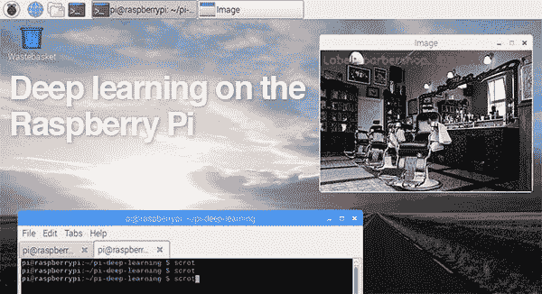
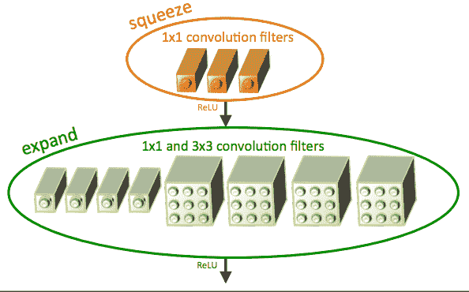
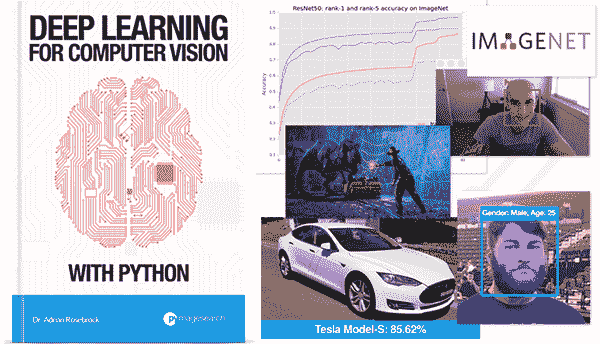
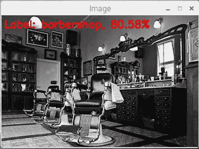
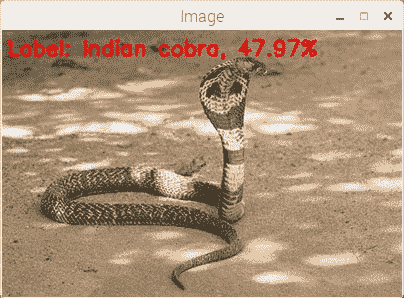
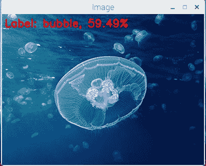

# 基于 OpenCV 的树莓 Pi 深度学习

> 原文：<https://pyimagesearch.com/2017/10/02/deep-learning-on-the-raspberry-pi-with-opencv/>

[](https://pyimagesearch.com/wp-content/uploads/2017/09/raspberry_pi_deep_learning_header.jpg)

我收到了许多来自 PyImageSearch 读者的电子邮件，他们对在他们的 Raspberry Pi 中执行深度学习感兴趣。大多数问题都是这样的:

> 嗨，阿德里安，谢谢你所有关于深度学习的教程。你真的让深度学习变得简单易懂了。我有一个问题:我能在树莓派上做深度学习吗？有哪些步骤？

几乎总是，我有相同的回答:

> 这个问题真的取决于你所说的“做”是什么意思。你永远不应该在树莓派上训练神经网络——它的功能太弱了。你最好在你的笔记本电脑、台式机甚至 GPU(如果你有的话)上训练网络。
> 
> 也就是说，你可以在 Raspberry Pi 上部署高效的浅层神经网络，并使用它们对输入图像进行分类。

我再次强调这一点:

你 ***不应该*** 在树莓 Pi 上训练神经网络(除非你用 Pi 来做类似于神经网络的*【你好，世界】*——但我仍然认为你的笔记本电脑/台式机更合适)。

有了树莓派就没有足够的内存了。

处理器太慢了。

总的来说，它并不适合繁重的计算过程。

相反，你应该首先在你的笔记本电脑、台式机或深度学习环境中 ***训练*** 你的网络。

一旦网络被训练好，你就可以 ***部署*** 神经网络到你的树莓派。

在这篇博文的剩余部分，我将演示我们如何使用 Raspberry Pi 和预先训练的深度学习神经网络来对输入图像进行分类。

## 基于 OpenCV 的树莓 Pi 深度学习

当使用 Raspberry Pi 进行深度学习时，我们有两个主要的陷阱:

1.  内存受限(树莓 Pi 3 上只有 1GB)。
2.  处理器速度有限。

这使得使用更大、更深的神经网络几乎是不可能的。

相反，我们需要使用内存/处理空间更小、计算效率更高的网络，比如 MobileNet 和 SqueezeNet。这些网络更适合树莓派；然而，你需要相应地设定你的期望——你不应该期待极快的速度。

在本教程中，我们将特别使用 SqueezeNet。

### 什么是 SqueezeNet？

[](https://pyimagesearch.com/wp-content/uploads/2017/03/imagenet_squeezenet_fire.png)

**Figure 1:** The “fire” module in SqueezeNet, consisting of a “squeeze” and an “expand” (Iandola et al., 2016).

SqueezeNet 最早是由 Iandola 等人在他们 2016 年的论文 [*中提出的，SqueezeNet: AlexNet 级别的精度，参数少 50 倍，< 0.5MB 模型大小*](https://github.com/DeepScale/SqueezeNet) 。

光是这篇论文的标题就应该能引起你的兴趣。

ResNet 等最新架构的模型大小超过 100MB。VGGNet 超过 550MB。AlexNet 位于这个大小范围的中间，模型大小约为 250MB。

事实上，用于图像分类的较小的卷积神经网络之一是大约 25-50MB 的 GoogLeNet(取决于实现了哪个版本的架构)。

真正的问题是: *我们能变小吗？*

正如 Iandola 等人的工作所展示的，答案是:是的，我们可以通过应用一种新的用法来减小模型的大小，这种用法是 *1×1* 和 *3×3* 卷积，并且没有完全连接的层。最终结果是一个权重为 4.9MB 的模型，可以通过模型处理(也称为“权重修剪”和“稀疏化模型”)进一步减少到< 0.5MB。

在本教程的剩余部分，我将演示 SqueezeNet 如何在大约 GoogLeNet 一半的时间内对图像进行分类，这使得它成为在您的 Raspberry Pi 上应用深度学习的合理选择。

### 有兴趣了解更多关于 SqueezeNet 的信息吗？



**Figure 2:** [*Deep Learning for Computer Vision with Python*](https://pyimagesearch.com/deep-learning-computer-vision-python-book/) book

如果你有兴趣了解更多关于 SqueezeNet 的知识，我会鼓励你看看我的新书，《用 Python 进行计算机视觉的深度学习[](https://pyimagesearch.com/deep-learning-computer-vision-python-book/)*》。*

 *在 *ImageNet 包*中，我:

1.  解释 SqueezeNet 架构的内部工作原理。
2.  演示如何手工实现 SqueezeNet。
3.  在具有挑战性的 ImageNet 数据集上从头开始训练 SqueezeNet，并复制 Iandola 等人的原始结果。

继续前进并[看一看](https://pyimagesearch.com/deep-learning-computer-vision-python-book/) —当我说这是你能在网上找到的最完整的深度学习+计算机视觉教育时，我想你会同意我的观点。

### 在树莓派上运行深度神经网络

这篇博文的源代码很大程度上是基于我之前的帖子， [*用 OpenCV*](https://pyimagesearch.com/2017/08/21/deep-learning-with-opencv/) 进行深度学习。

我仍然会在这里完整地回顾这段代码；然而，我想让你参考一下[上一篇文章](https://pyimagesearch.com/2017/08/21/deep-learning-with-opencv/)中完整详尽的评论。

首先，创建一个名为`pi_deep_learning.py`的新文件，并插入以下源代码:

```py
# import the necessary packages
import numpy as np
import argparse
import time
import cv2

```

**第 2-5 行**简单导入我们需要的包。

从那里，我们需要解析我们的命令行参数:

```py
# construct the argument parse and parse the arguments
ap = argparse.ArgumentParser()
ap.add_argument("-i", "--image", required=True,
	help="path to input image")
ap.add_argument("-p", "--prototxt", required=True,
	help="path to Caffe 'deploy' prototxt file")
ap.add_argument("-m", "--model", required=True,
	help="path to Caffe pre-trained model")
ap.add_argument("-l", "--labels", required=True,
	help="path to ImageNet labels (i.e., syn-sets)")
args = vars(ap.parse_args())

```

如第 9-16 行所示，我们有四个*必需的*命令行参数:

*   `--image`:输入图像的路径。
*   `--prototxt`:Caffe proto txt 文件的路径，该文件本质上是一个遵循类似 JSON 结构的纯文本配置文件。我在我的 [PyImageSearch 大师课程中讲述了 Caffe 项目的剖析。](https://pyimagesearch.com/pyimagesearch-gurus/)
*   `--model`:通往预训 Caffe 模式的道路。如上所述，您可能希望在比 Raspberry Pi 更强大的硬件上训练您的模型——但是，我们可以在 Pi 上利用一个小的、预先存在的模型。
*   `--labels`:类标签的路径，在本例中是 ImageNet“syn-sets”标签。

接下来，我们将从磁盘加载类标签和输入图像:

```py
# load the class labels from disk
rows = open(args["labels"]).read().strip().split("\n")
classes = [r[r.find(" ") + 1:].split(",")[0] for r in rows]

# load the input image from disk
image = cv2.imread(args["image"])

```

请打开这篇文章的 ***【下载】*** 部分的`synset_words.txt`。您将看到每行/每列都有一个 ID 和与之相关联的类标签(用逗号分隔)。

**第 20 行和第 21 行**简单地逐行读入标签文件(`rows`)并提取第一个相关的类标签。结果是一个包含我们的类标签的`classes`列表。

然后，我们利用 OpenCV 在第 24 行加载图像。

现在，我们将利用 OpenCV 3.3 的深度神经网络(DNN)模块将`image`转换为`blob`，并从磁盘加载模型:

```py
# our CNN requires fixed spatial dimensions for our input image(s)
# so we need to ensure it is resized to 227x227 pixels while
# performing mean subtraction (104, 117, 123) to normalize the input;
# after executing this command our "blob" now has the shape:
# (1, 3, 227, 227)
blob = cv2.dnn.blobFromImage(image, 1, (227, 227), (104, 117, 123))

# load our serialized model from disk
print("[INFO] loading model...")
net = cv2.dnn.readNetFromCaffe(args["prototxt"], args["model"])

```

请务必记下我们在上面第 31 行的**中调用`cv2.dnn.blobFromImage`之前的注释。**

输入到卷积神经网络的宽度和高度图像尺寸的常见选择包括 32 × 32、64 × 64、224 × 224、227 × 227、256 × 256 和 299 × 299。在我们的例子中，我们将图像预处理(标准化)为 227 x 227 的尺寸(这是 SqueezeNet 训练的图像尺寸),并执行称为均值减法的缩放技术。我在我的书中讨论了这些步骤[的重要性。](https://pyimagesearch.com/deep-learning-computer-vision-python-book/)

***注意:**当使用 **SqueezeNet** 和 **GoogLeNet** 时，你会想要使用 224 x 224 的 blob 大小来与 prototxt 定义保持一致。*

然后，我们通过利用我们的`prototxt`和`model`文件路径引用，在**行 35** 上从磁盘加载网络。

如果你在上面错过了，这里值得注意的是，我们正在加载一个*预训练的*模型。训练步骤已经在一台更强大的机器上执行了，不在这篇博文的讨论范围之内(但是在 [PyImageSearch 大师](https://pyimagesearch.com/pyimagesearch-gurus/)和[用 Python 进行计算机视觉深度学习](https://pyimagesearch.com/deep-learning-computer-vision-python-book/) 中有详细介绍)。

现在，我们准备通过网络传递图像，并查看预测:

```py
# set the blob as input to the network and perform a forward-pass to
# obtain our output classification
net.setInput(blob)
start = time.time()
preds = net.forward()
end = time.time()
print("[INFO] classification took {:.5} seconds".format(end - start))

# sort the indexes of the probabilities in descending order (higher
# probabilitiy first) and grab the top-5 predictions
preds = preds.reshape((1, len(classes)))
idxs = np.argsort(preds[0])[::-1][:5]

```

为了对查询`blob`进行分类，我们通过网络将其向前传递(**第 39-42 行**)，并打印出对输入图像进行分类所花费的时间(**第 43 行**)。

然后我们可以将概率从最高到最低排序(**第 47 行**)，同时抓住前五位`predictions` ( **第 48 行**)。

剩余的行(1)在图像上绘制最高预测类标签和相应的概率，(2)将前五个结果和概率打印到终端，以及(3)将图像显示到屏幕:

```py
# loop over the top-5 predictions and display them
for (i, idx) in enumerate(idxs):
	# draw the top prediction on the input image
	if i == 0:
		text = "Label: {}, {:.2f}%".format(classes[idx],
			preds[0][idx] * 100)
		cv2.putText(image, text, (5, 25), cv2.FONT_HERSHEY_SIMPLEX,
			0.7, (0, 0, 255), 2)

	# display the predicted label + associated probability to the
	# console	
	print("[INFO] {}. label: {}, probability: {:.5}".format(i + 1,
		classes[idx], preds[0][idx]))

# display the output image
cv2.imshow("Image", image)
cv2.waitKey(0)

```

我们在图像顶部绘制顶部预测和概率(**行 53-57** )，并在终端显示前 5 个预测+概率(**行 61 和 62** )。

最后，我们在屏幕上显示输出图像(**第 65 行和第 66 行**)。如果你使用 SSH 来连接你的 Raspberry Pi，只有当你在 SSH 连接到你的 Pi 时为 X11 转发提供了`-X`标志，这才会起作用。

要查看使用 OpenCV 和 Python 在 Raspberry Pi 上应用深度学习的结果，请继续下一节。

### 树莓 Pi 和深度学习结果

我们将根据两个预训练的深度神经网络对我们的 Raspberry Pi 进行深度学习基准测试:

*   谷歌网
*   斯奎泽尼

正如我们将看到的，SqueezeNet 比 GoogLeNet 小得多(分别为 5MB 和 25MB ),这将使我们能够在 Raspberry Pi 上更快地对图像进行分类。

要在 Raspberry Pi 上运行预先训练好的卷积神经网络，请使用这篇博文的 ***【下载】*** 部分下载源代码+预先训练好的神经网络+示例图像。

从这里开始，让我们首先根据这个输入图像对 GoogLeNet 进行基准测试:

[](https://pyimagesearch.com/wp-content/uploads/2017/09/raspberry_pi_deep_learning_barbershop.jpg)

**Figure 3:** A *“barbershop”* is correctly classified by both GoogLeNet and Squeezenet using deep learning and OpenCV.

从输出中我们可以看到，GoogLeNet 在 **1.7 秒**内正确地将图像分类为*“理发店*:

```py
$ python pi_deep_learning.py --prototxt models/bvlc_googlenet.prototxt \
	--model models/bvlc_googlenet.caffemodel --labels synset_words.txt \
	--image images/barbershop.png
[INFO] loading model...
[INFO] classification took 1.7304 seconds
[INFO] 1\. label: barbershop, probability: 0.70508
[INFO] 2\. label: barber chair, probability: 0.29491
[INFO] 3\. label: restaurant, probability: 2.9732e-06
[INFO] 4\. label: desk, probability: 2.06e-06
[INFO] 5\. label: rocking chair, probability: 1.7565e-06

```

让我们试试 SqueezeNet:

```py
$ python pi_deep_learning.py --prototxt models/squeezenet_v1.0.prototxt \
	--model models/squeezenet_v1.0.caffemodel --labels synset_words.txt \
	--image images/barbershop.png 
[INFO] loading model...
[INFO] classification took 0.92073 seconds
[INFO] 1\. label: barbershop, probability: 0.80578
[INFO] 2\. label: barber chair, probability: 0.15124
[INFO] 3\. label: half track, probability: 0.0052873
[INFO] 4\. label: restaurant, probability: 0.0040124
[INFO] 5\. label: desktop computer, probability: 0.0033352

```

SqueezeNet 也正确地将图像分类为*【理发店】* …

***……但只用了 0.9 秒！***

正如我们所见，SqueezeNet 明显比 GoogLeNet 快——这一点极其重要，因为我们正在将深度学习应用于资源受限的 Raspberry Pi。

让我们用 SqueezeNet 试试另一个例子:

```py
$ python pi_deep_learning.py --prototxt models/squeezenet_v1.0.prototxt \
	--model models/squeezenet_v1.0.caffemodel --labels synset_words.txt \
	--image images/cobra.png 
[INFO] loading model...
[INFO] classification took 0.91687 seconds
[INFO] 1\. label: Indian cobra, probability: 0.47972
[INFO] 2\. label: leatherback turtle, probability: 0.16858
[INFO] 3\. label: water snake, probability: 0.10558
[INFO] 4\. label: common iguana, probability: 0.059227
[INFO] 5\. label: sea snake, probability: 0.046393

```

[](https://pyimagesearch.com/wp-content/uploads/2017/09/raspberry_pi_deep_learning_cobra.jpg)

**Figure 4:** SqueezeNet correctly classifies an image of a cobra using deep learning and OpenCV on the Raspberry Pi.

然而，尽管 SqueezeNet 速度明显更快，但不如 GoogLeNet 准确:

```py
$ python pi_deep_learning.py --prototxt models/squeezenet_v1.0.prototxt \
	--model models/squeezenet_v1.0.caffemodel --labels synset_words.txt \
	--image images/jellyfish.png 
[INFO] loading model...
[INFO] classification took 0.92117 seconds
[INFO] 1\. label: bubble, probability: 0.59491
[INFO] 2\. label: jellyfish, probability: 0.23758
[INFO] 3\. label: Petri dish, probability: 0.13345
[INFO] 4\. label: lemon, probability: 0.012629
[INFO] 5\. label: dough, probability: 0.0025394

```

[](https://pyimagesearch.com/wp-content/uploads/2017/09/raspberry_pi_deep_learning_jellyfish.jpg)

**Figure 5:** A jellyfish is incorrectly classified by SqueezNet as a bubble.

这里我们看到 SqueezeNet 预测的顶部是*“泡沫”*。虽然该图像可能看起来像气泡一样，但它实际上是一只*“水母”*(这是 SqueezeNet 的第二个预测)。

另一方面，GoogLeNet 正确地将*“水母*”报告为第一预测(牺牲了处理时间):

```py
$ python pi_deep_learning.py --prototxt models/bvlc_googlenet.prototxt \
	--model models/bvlc_googlenet.caffemodel --labels synset_words.txt \
	--image images/jellyfish.png
[INFO] loading model...
[INFO] classification took 1.7824 seconds
[INFO] 1\. label: jellyfish, probability: 0.53186
[INFO] 2\. label: bubble, probability: 0.33562
[INFO] 3\. label: tray, probability: 0.050089
[INFO] 4\. label: shower cap, probability: 0.022811
[INFO] 5\. label: Petri dish, probability: 0.013176

```

## 摘要

今天，我们学习了如何使用 Python 和 OpenCV 在 Raspberry Pi 上应用深度学习。

一般来说，您应该:

1.  永远不要用你的树莓派来训练神经网络。
2.  只用你的树莓派*部署*一个预先训练好的深度学习网络。

Raspberry Pi 没有足够的内存或 CPU 能力来从头训练这些类型的深度、复杂的神经网络。

事实上，Raspberry Pi *几乎没有足够的处理能力来运行它们——我们将在下周的博客文章中发现，对于视频处理应用程序，你将很难获得合理的每秒帧数。*

如果你对低成本硬件上的嵌入式深度学习感兴趣，我会考虑看看优化的设备，如 NVIDIA 的 Jetson TX1 和 TX2。这些板旨在 GPU 上执行神经网络，并提供实时(或尽可能接近实时)分类速度。

在下周的博客文章中，我将讨论如何在 Raspberry Pi 上优化 OpenCV，以获得超过 100%的**性能增益，用于使用深度学习的对象检测。**

 ****要在这篇博文发表时得到通知，*只需在下面的表格中输入您的电子邮件地址！******