# 深度学习:OpenCV 的 blobFromImage 如何工作

> 原文：<https://pyimagesearch.com/2017/11/06/deep-learning-opencvs-blobfromimage-works/>

[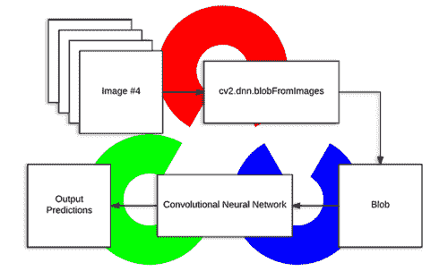](https://pyimagesearch.com/wp-content/uploads/2017/11/blob_from_images_header.png)

今天的博文受到了许多 PyImageSearch 读者的启发，他们对之前的深度学习教程发表了评论，希望了解 OpenCV 的`blobFromImage`函数到底在做什么。

你看，为了从深度神经网络获得(正确的)预测，你首先需要预处理你的数据。

在深度学习和图像分类的背景下，这些预处理任务通常涉及:

1.  均值减法
2.  按某个因子缩放

OpenCV 的新深度神经网络(`dnn`)模块包含两个功能，可用于预处理图像，并通过预训练的深度学习模型为分类做准备。

在今天的博文中，我们将剖析 OpenCV 的`cv2.dnn.blobFromImage`和`cv2.dnn.blobFromImages`预处理函数，并理解它们是如何工作的。

**要了解更多关于通过 OpenCV 进行深度学习的图像预处理，*继续阅读。***

## 深度学习:OpenCV 的 blobFromImage 如何工作

OpenCV 提供了两个功能来促进深度学习分类的图像预处理:

*   `cv2.dnn.blobFromImage`
*   `cv2.dnn.blobFromImages`

这两个功能执行

1.  均值减法
2.  缩放比例
3.  以及可选的频道交换

在本教程的剩余部分，我们将:

1.  探索均值减法和缩放
2.  检查每个深度学习预处理函数的函数签名
3.  详细研究这些方法
4.  最后，将 OpenCV 的深度学习功能应用于一组输入图像

让我们开始吧。

### 深度学习和均值减法

[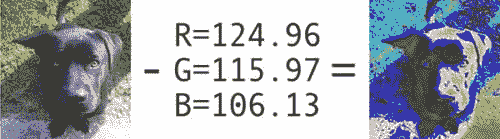](https://pyimagesearch.com/wp-content/uploads/2017/11/blob_from_images_mean_subtraction.jpg)

**Figure 1:** A visual representation of mean subtraction where the RGB mean (*center*) has been calculated from a dataset of images and subtracted from the original image *(left)* resulting in the output image *(right)*.

在我们深入解释 OpenCV 的深度学习预处理功能之前，我们首先需要了解均值减法。均值减法用于帮助应对数据集中输入图像的光照变化。因此，我们可以将均值减法视为一种用于帮助我们的卷积神经网络的技术。

在我们开始训练我们的深度神经网络之前，我们首先计算红色、绿色和蓝色通道的*训练集*中所有图像的*平均像素强度*。

这意味着我们最终有三个变量:

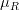

, 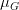, and 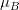

通常，结果值是一个三元组，分别由红色、绿色和蓝色通道的平均值组成。

例如，ImageNet 训练集的平均值为 *R=103.93* 、 *G=116.77* 和 *B=123.68* (如果您以前使用过 ImageNet 上预先训练的网络，您可能已经遇到过这些值)。

然而，在某些情况下，平均红色、绿色和蓝色值可能是按通道方式计算的*，而不是按像素方式*计算的*，从而产生一个 *MxN* 矩阵。在这种情况下，在训练/测试期间，从输入图像中减去每个通道的 *MxN* 矩阵。*

这两种方法都是均值减法的完美有效形式；然而，我们倾向于看到更经常使用的逐像素版本，*尤其是对于更大的数据集。*

当我们准备好通过我们的网络传递图像时(无论是为了*训练*还是*测试*，我们减去*的平均值*、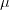

, from each input channel of the input image:

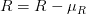

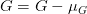


我们可能还有一个*比例因子*、

, which adds in a normalization:

 / \sigma")

 / \sigma")

 / \sigma")

的值

may be the standard deviation across the training set (thereby turning the preprocessing step into a standard score/z-score). However,may also be manually set (versus calculated) to scale the input image space into a particular range — it really depends on the architecture, how the network was trained, and the techniques the implementing author is familiar with.

需要注意的是**并非所有深度学习架构都执行均值减法和缩放！**在预处理图像之前，请务必阅读您正在使用的深度神经网络的相关出版物/文档。

正如你将在深度学习的旅程中发现的，一些架构只执行均值减法(从而设置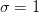

). Other architectures perform both mean subtraction and scaling. Even other architectures choose to perform *no* mean subtraction or scaling. Always check the relevant publication you are implementing/using to verify the techniques the author is using.

均值减法、缩放和归一化在使用 Python 的计算机视觉深度学习中有更详细的介绍。

### OpenCV 的 blobFromImage 和 blobFromImages 函数

让我们从参考[官方 OpenCV 文档](https://docs.opencv.org/trunk/d6/d0f/group__dnn.html#ga33d1b39b53a891e98a654fdeabba22eb)开始:

> [blobFromImage]从图像创建 4 维 blob。可选地调整大小和从中心裁剪`image`，减去`mean`值，通过`scalefactor`缩放值，交换蓝色和红色通道。

非正式地说，*斑点*仅仅是具有相同空间尺寸(即，宽度和高度)、相同深度(通道数量)的图像的(潜在集合),它们都已经以相同的方式进行了预处理。

`cv2.dnn.blobFromImage`和`cv2.dnn.blobFromImages`功能几乎相同。

让我们从检查下面的`cv2.dnn.blobFromImage`函数签名开始:

`blob = cv2.dnn.blobFromImage(image, scalefactor=1.0, size, mean, swapRB=True)`

我在下面提供了对每个参数的讨论:

1.  `image`:这是我们要预处理的输入图像，然后通过我们的深度神经网络进行分类。
2.  在我们执行了均值减法后，我们可以选择用一些因子来缩放我们的图像。该值默认为“1.0”(即无缩放)，但我们也可以提供另一个值。同样需要注意的是，`scalefactor`应该是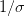，因为我们实际上是将输入通道(减去平均值后)乘以`scalefactor`。
3.  `size`:这里我们提供卷积神经网络期望的空间大小。对于大多数当前最先进的神经网络来说，这要么是 *224×224* ， *227×227* ，要么是 *299×299* 。
4.  这些是我们的平均减法值。它们可以是 RGB 平均值的三元组，或者它们可以是单个值，在这种情况下，从图像的每个通道中减去所提供的值。如果你正在执行均值减法，确保你以`( R，G，B)'的顺序提供三元组，尤其是在使用默认行为`swapRB=True`的时候。
5.  `swapRB` : OpenCV 假设图像是 BGR 通道顺序；然而,“平均值”假定我们使用 RGB 顺序。为了解决这种差异，我们可以通过将该值设置为“真”来交换`image`中的 R 和 B 通道。默认情况下，OpenCV 为我们执行这种通道交换。

`cv2.dnn.blobFromImage`函数返回一个`blob`,这是经过均值相减、归一化和通道交换后的输入图像。

`cv2.dnn.blobFromImages`功能完全相同:

`blob = cv2.dnn.blobFromImages(images, scalefactor=1.0, size, mean, swapRB=True)`

唯一的例外是我们可以传入*多个图像*，使我们能够批量处理一组`images`。

如果您正在处理多个图像/帧，请确保使用`cv2.dnn.blobFromImages`函数，因为它的函数调用开销较少，您可以更快地批量处理图像/帧。

### 利用 OpenCV 的 blobFromImage 功能进行深度学习

既然我们已经研究了`blobFromImage`和`blobFromImages`函数，让我们将它们应用于一些示例图像，然后将它们通过卷积神经网络进行分类。

作为先决条件，你至少需要 OpenCV 版本 3 . 3 . 0*。NumPy 是 OpenCV 的 Python 绑定的依赖项， [imutils](https://pyimagesearch.com/2015/02/02/just-open-sourced-personal-imutils-package-series-opencv-convenience-functions/) 是我在 [GitHub](https://github.com/jrosebr1/imutils) 和 [Python 包索引](https://pypi.python.org/pypi/imutils)中提供的便利函数包。*

 *如果你还没有安装 OpenCV，你会想在这里跟随最新的可用教程[，并且*在你克隆/下载`opencv`和`opencv_contrib`的时候一定要指定 OpenCV 3.3.0 或更高版本*。](https://pyimagesearch.com/opencv-tutorials-resources-guides/)

imutils 软件包可以通过`pip`安装:

```py
$ pip install imutils

```

假设您的图像处理环境已经准备就绪，让我们打开一个新文件，将其命名为`blob_from_images.py`，并插入以下代码:

```py
# import the necessary packages
from imutils import paths
import numpy as np
import cv2

# load the class labels from disk
rows = open("synset_words.txt").read().strip().split("\n")
classes = [r[r.find(" ") + 1:].split(",")[0] for r in rows]

# load our serialized model from disk
net = cv2.dnn.readNetFromCaffe("bvlc_googlenet.prototxt",
	"bvlc_googlenet.caffemodel")

# grab the paths to the input images
imagePaths = sorted(list(paths.list_images("images/")))

```

首先我们导入`imutils`、`numpy`、`cv2` ( **第 2-4 行**)。

然后我们读取`synset_words.txt`(ImageNet 类标签)并提取`classes`(我们的类标签)，在**的第 7 行和第 8 行**。

为了从磁盘加载我们的模型模型，我们使用 DNN 函数`cv2.dnn.readNetFromCaffe`，并指定`bvlc_googlenet.prototxt`作为文件名参数，指定`bvlc_googlenet.caffemodel`作为实际的模型文件(**第 11 行和第 12 行**)。

***注意:**你可以使用本教程底部的**“下载”**部分获取预训练的卷积神经网络、类标签文本文件、源代码和示例图像。*

最后，我们在**行 15** 上获取输入图像的路径。如果您使用的是 Windows，您应该在此处更改路径分隔符，以确保您可以正确加载图像路径。

接下来，我们将从磁盘加载图像，并使用`blobFromImage`对它们进行预处理:

```py
# (1) load the first image from disk, (2) pre-process it by resizing
# it to 224x224 pixels, and (3) construct a blob that can be passed
# through the pre-trained network
image = cv2.imread(imagePaths[0])
resized = cv2.resize(image, (224, 224))
blob = cv2.dnn.blobFromImage(resized, 1, (224, 224), (104, 117, 123))
print("First Blob: {}".format(blob.shape))

```

在这个块中，我们首先加载`image` ( **第 20 行**)，然后将其调整为 *224×224* ( **第 21 行**)，这是 GoogLeNet 所需的输入图像尺寸。

现在我们到了这篇文章的关键。

在**第 22 行**上，我们调用`cv2.dnn.blobFromImage`，如前一节所述，它将创建一个 4 维的`blob`用于我们的神经网络。

让我们打印出我们的`blob`的形状，这样我们可以稍后在终端中分析它(**第 23 行**)。

接下来，我们将通过 GoogLeNet 发送`blob`:

```py
# set the input to the pre-trained deep learning network and obtain
# the output predicted probabilities for each of the 1,000 ImageNet
# classes
net.setInput(blob)
preds = net.forward()

# sort the probabilities (in descending) order, grab the index of the
# top predicted label, and draw it on the input image
idx = np.argsort(preds[0])[::-1][0]
text = "Label: {}, {:.2f}%".format(classes[idx],
	preds[0][idx] * 100)
cv2.putText(image, text, (5, 25),  cv2.FONT_HERSHEY_SIMPLEX,
	0.7, (0, 0, 255), 2)

# show the output image
cv2.imshow("Image", image)
cv2.waitKey(0)

```

如果你熟悉这个博客上最近的深度学习帖子，上面的几行应该看起来很熟悉。

我们通过网络(**第 28 行和第 29 行**)输入`blob`，并获取预测值`preds`。

然后，我们将最有把握的预测排在列表的前面，并生成一个标签文本显示在图像上。标签文本由分类标签和顶部预测的预测百分比值组成(**第 34 行和第 35 行**)。

从那里，我们在`image` ( **第 36 行和第 37 行**)的顶部写下标签`text`，然后在屏幕上显示`image`，并在继续前进(**第 40 行和第 41 行**)之前等待按键。

**现在该使用`blobFromImage`函数的*复数形式*了。**

这里我们将做(几乎)同样的事情，除了我们将创建并填充一个列表`images`，然后将该列表作为参数传递给`blobFromImages`:

```py
# initialize the list of images we'll be passing through the network
images = []

# loop over the input images (excluding the first one since we
# already classified it), pre-process each image, and update the
# `images` list
for p in imagePaths[1:]:
	image = cv2.imread(p)
	image = cv2.resize(image, (224, 224))
	images.append(image)

# convert the images list into an OpenCV-compatible blob
blob = cv2.dnn.blobFromImages(images, 1, (224, 224), (104, 117, 123))
print("Second Blob: {}".format(blob.shape))

```

首先我们初始化我们的`images`列表(**第 44 行**)，然后，使用`imagePaths`，我们读取、调整并将`image`追加到列表中(**第 49-52 行**)。

使用列表切片，我们已经省略了第 49 行上`imagePaths`的第一幅图像。

从那里，我们将`images`作为第一个参数传递到`cv2.dnn.blobFromImages`的**行 55** 上。`cv2.dnn.blobFromImages`的所有其他参数与上面的`cv2.dnn.blobFromImage`相同。

为了以后的分析，我们在第 56 行的**上打印`blob.shape`。**

接下来，我们将通过 GoogLeNet 传递`blob`,并在每张图片的顶部写入类别标签和预测:

```py
# set the input to our pre-trained network and obtain the output
# class label predictions
net.setInput(blob)
preds = net.forward()

# loop over the input images
for (i, p) in enumerate(imagePaths[1:]):
	# load the image from disk
	image = cv2.imread(p)

	# find the top class label from the `preds` list and draw it on
	# the image
	idx = np.argsort(preds[i])[::-1][0]
	text = "Label: {}, {:.2f}%".format(classes[idx],
		preds[i][idx] * 100)
	cv2.putText(image, text, (5, 25),  cv2.FONT_HERSHEY_SIMPLEX,
		0.7, (0, 0, 255), 2)

	# display the output image
	cv2.imshow("Image", image)
	cv2.waitKey(0)

```

剩下的代码基本上和上面的一样，只有我们的`for`循环现在处理每个`imagePaths`的循环(同样，省略第一个，因为我们已经对它进行了分类)。

就是这样！让我们在下一节看看这个脚本的运行情况。

### OpenCV blobfromImage 和 blobFromImages 结果

现在我们到了有趣的部分。

继续使用这篇博文的 ***【下载】*** 部分下载源代码、示例图像和预先训练好的神经网络。您将需要额外的文件来执行代码。

从那里，启动一个终端并运行以下命令:

```py
$ python blob_from_images.py

```

第一个终端输出是关于在我们应用`cv2.dnn.blobFromImage`函数的`images`文件夹中找到的第一幅图像:

```py
First Blob: (1, 3, 224, 224)

```

生成的啤酒杯图像显示在屏幕上:

[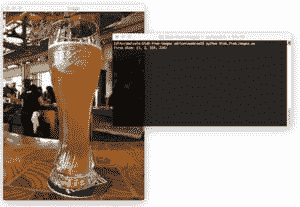](https://pyimagesearch.com/wp-content/uploads/2017/11/blob_from_images_result01.jpg)

**Figure 2:** An enticing beer has been labeled and recognized with high confidence by GoogLeNet. The blob dimensions resulting from `blobFromImage` are displayed in the terminal.

那满满的啤酒杯让我口渴。但在我享受啤酒之前，我会解释为什么这个斑点的形状是`(1, 3, 224, 224)`。

结果元组具有以下格式:

`(num_images=1, num_channels=3, width=224, height=224)`

因为我们只处理了*个*图像，所以我们的`blob`中只有*个*条目。BGR 频道的频道计数是三。最后 *224×224* 是我们输入图像的空间宽度和高度。

接下来，让我们从剩余的四个输入图像中构建一个`blob`。

第二个斑点的形状是:

```py
Second Blob: (4, 3, 224, 224)

```

因为这个斑点包含 4 个图像，所以`num_images=4`。其余维度与第一个单一图像 blob 相同。

我在下面附上了正确分类的图片样本:

[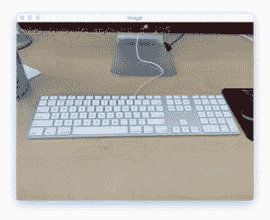](https://pyimagesearch.com/wp-content/uploads/2017/11/blob_from_images_result02.jpg)

**Figure 3:** My keyboard has been correctly identified by GoogLeNet with a prediction confidence of 81%.

[](https://pyimagesearch.com/wp-content/uploads/2017/11/blob_from_images_result03.jpg)

**Figure 4:** I tested the pre-trained network on my computer monitor as well. Here we can see the input image is correctly classified using our Convolutional Neural Network.

[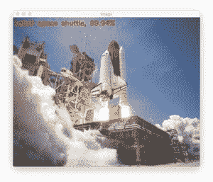](https://pyimagesearch.com/wp-content/uploads/2017/11/blob_from_images_result04.jpg)

**Figure 5:** A NASA space shuttle is recognized with a prediction value of over 99% by our deep neural network.

## 摘要

在今天的教程中，我们检查了 OpenCV 的`blobFromImage`和`blobFromImages`深度学习功能。

这些方法用于通过预训练的深度学习模型为分类准备输入图像。

`blobFromImage`和`blobFromImages`都执行均值减法和缩放。我们也可以根据通道顺序交换图像的红色和蓝色通道。几乎所有最先进的深度学习模型都执行均值减法和缩放——这里的好处是 OpenCV 使这些预处理任务变得非常简单。

如果你有兴趣更详细地研究深度学习，一定要看看我的新书， *[用 Python 进行计算机视觉的深度学习](https://pyimagesearch.com/deep-learning-computer-vision-python-book/)* 。

在这本书里，你会发现:

*   **超级实用的演练**展示了实际、真实世界图像分类问题、挑战和竞赛的解决方案。
*   详细、彻底的实验(使用高度文档化的代码)使您能够**重现最先进的结果。**
*   **我最喜欢的“最佳实践”**提高网络准确率。光是这些技巧就能为你节省足够的时间来支付这本书的多次费用。
*   *..还有更多！*

听起来不错吧？

**[点击这里开始你的深度学习掌握之旅](https://pyimagesearch.com/deep-learning-computer-vision-python-book/)。**

否则，请务必在下表中输入您的电子邮件地址，以便在 PyImageSearch 博客上发布未来的深度学习教程时得到通知。

下周见！*