# 你的深度学习+ Python Ubuntu 虚拟机

> 原文：<https://pyimagesearch.com/2017/09/22/deep-learning-python-ubuntu-virtual-machine/>

[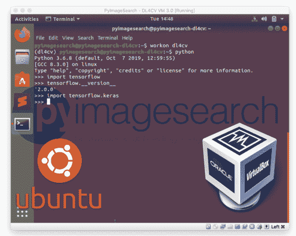](https://pyimagesearch.com/wp-content/uploads/2017/09/deep_learning_vm_header.png)

当谈到使用深度学习+ Python 时，我*强烈推荐*使用 Linux 环境。

深度学习工具可以更容易地配置和安装在 Linux 上，允许您快速开发和运行神经网络。

当然，配置自己的深度学习+ Python + Linux 开发环境可能是一项非常繁琐的任务，*尤其是*如果您是 Linux 新手，是命令行/终端的初学者，或者是手动编译和安装包的新手。

为了帮助你快速启动你的深度学习+ Python 教育，我已经创建了一个 ***Ubuntu 虚拟机*** ，其中包含了你成功所需的所有深度学习库(包括 *Keras* 、 *TensorFlow* 、 *scikit-learn* 、 *scikit-image* 、 *OpenCV* 和其他) ***预配置的*** 和

 *这个虚拟机是我的书的所有三个捆绑包的一部分， [*用 Python 进行计算机视觉的深度学习*](https://pyimagesearch.com/deep-learning-computer-vision-python-book/) 。购买副本后，您将能够下载虚拟机并立即开始深度学习。

在本教程的剩余部分，我将向您展示:

*   如何下载并安装用于管理、创建和导入虚拟机的 *VirtualBox* 。
*   如何导入预先配置好的 *Ubuntu* 虚拟机进行深度学习？
*   如何访问虚拟机上预装的*深度学习库*。

让我们开始吧。

## 你的深度学习+ Python 虚拟机

您使用 Python 购买的用于计算机视觉的 [*深度学习包含一个预配置的用于深度学习的 Ubuntu 虚拟机。在接下来的部分，我将向你展示导入你的 Ubuntu 深度学习虚拟机是多么的容易。*](https://pyimagesearch.com/deep-learning-computer-vision-python-book/)

本教程分为三个部分，以便于消化和理解:

1.  下载并安装 VirtualBox。
2.  下载并导入您预先配置的 Ubuntu 深度学习虚拟机。
3.  访问深度学习虚拟机内部的 Python 开发环境。

### 步骤 1:下载并安装 VirtualBox

第一步是下载 [VirtualBox](https://www.virtualbox.org/) ，一个管理虚拟机的免费开源平台。

VirtualBox 会在***MAC OS******Linux******Windows***上运行。

我们称运行在你的 ***主机*** 上的物理硬件 VirtualBox。将要导入到 VirtualBox 中的虚拟机是 ***来宾机*** 。

要安装 VirtualBox，首先访问[下载页面](https://www.virtualbox.org/wiki/Downloads)，然后为您的操作系统选择合适的二进制文件:

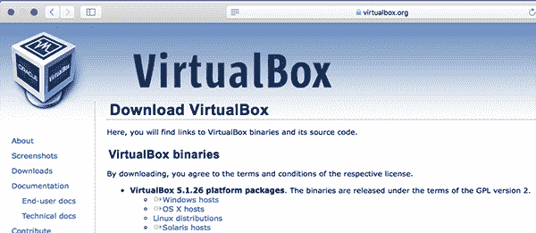

**Figure 1:** VirtualBox downloads.

从这里开始，按照提供的说明在您的系统上安装软件——在这个示例中，我将使用 macOS，但是同样，这些说明也适用于 Linux 和 Windows:

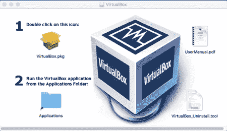

**Figure 2:** Installing VirtualBox on macOS

### 第二步:下载你的深度学习虚拟机

现在已经安装了 VirtualBox，您需要下载与您购买的使用 Python : 的 *[计算机视觉深度学习相关的预配置 Ubuntu 虚拟机](https://pyimagesearch.com/deep-learning-computer-vision-python-book/)*

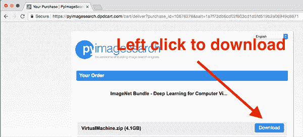

**Figure 3:** Downloading the pre-configured Ubuntu deep learning virtual machine.

该文件大约为 4GB，因此根据您的互联网连接，下载需要一些时间才能完成。

一旦你下载了`VirtualMachine.zip`文件，解压它，你会发现一个名为`DL4CV Ubuntu VM.ova`的文件。我已将此文件放在我的桌面上:

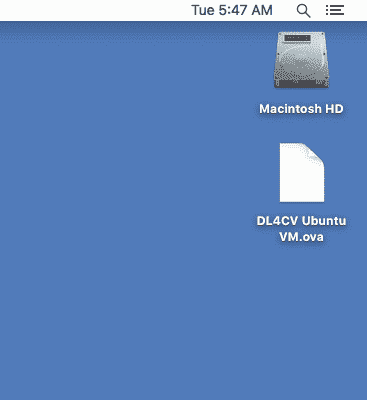

**Figure 4:** The DL4CV Ubuntu VM.ova file.

这是您将导入到 VirtualBox 管理器中的实际文件。

### 第三步:将深度学习虚拟机导入 VirtualBox

继续打开 VirtualBox 管理器。

从那里选择`File => Import Appliance...`:

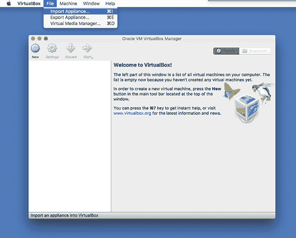

**Figure 5:** Importing the pre-configured Ubuntu deep learning virtual machine.

对话框打开后，您需要导航到`DL4CV Ubuntu VM.ova`文件在磁盘上的位置:

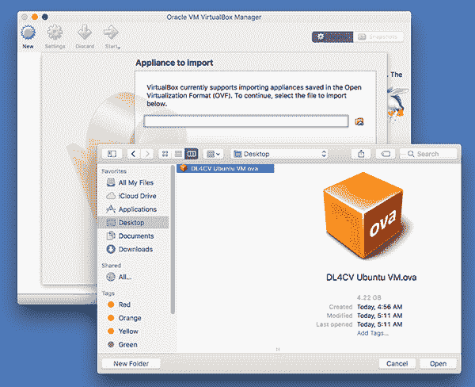

**Figure 6:** Selecting the pre-configured Ubuntu deep learning virtual machine.

最后，您可以点击*“导入”*，允许虚拟机导入:

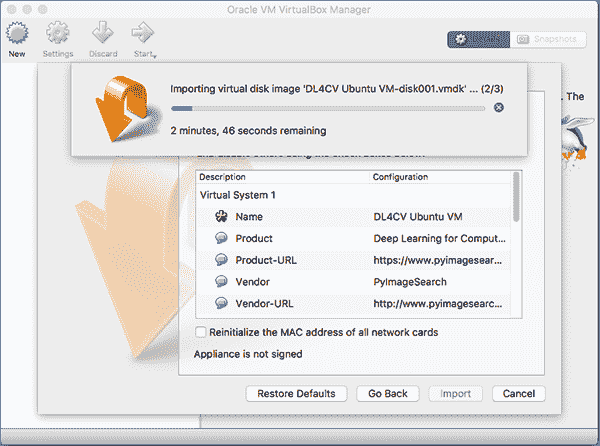

**Figure 7:** Importing the Ubuntu deep learning virtual machine may take 3-4 minutes depending on your system.

整个导入过程应该只需要几分钟。

### 第四步:启动深度学习虚拟机

既然深度学习虚拟机已经导入，我们需要启动它。

从 VirtualBox 管理器中选择窗口左侧窗格中的*“DL4CV Ubuntu VM”*，然后点击*“开始”*:

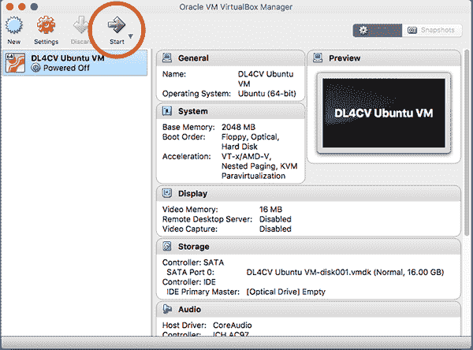

**Figure 8:** Booting the pre-configured Ubuntu deep learning virtual machine.

虚拟机启动后，您可以使用以下凭据登录:

*   **用户名:** `pyimagesearch`
*   **密码:** `deeplearning`

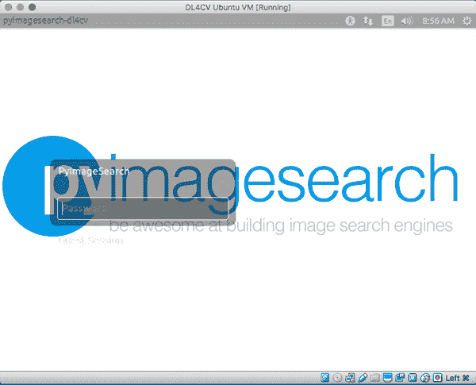

**Figure 9:** Logging into the deep learning virtual machine.

### 步骤#5:访问深度学习 Python 虚拟环境

登录虚拟机后的下一步是启动终端:

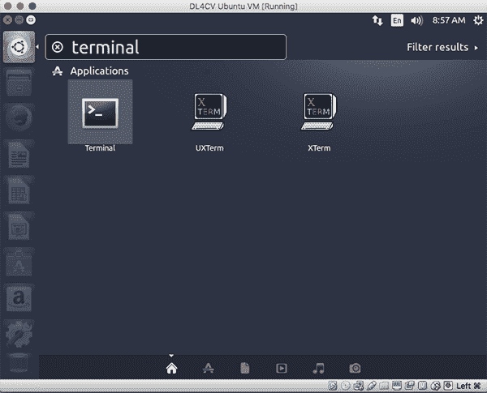

**Figure 10:** Launching a terminal window.

从那里，执行`workon dl4cv`来访问 Python +深度学习开发环境:

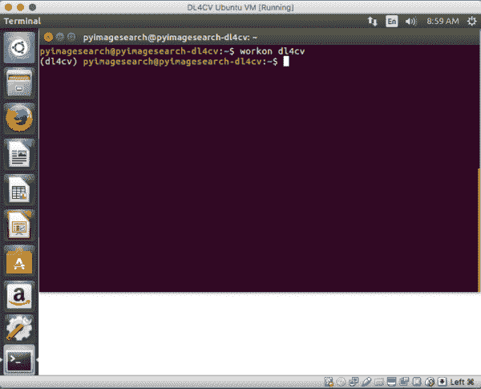

**Figure 11:** Accessing the *dl4cv* deep learning + Python development environment.

注意，现在我的提示前面有了文本`(dl4cv)`，这意味着我在`dl4cv` Python 虚拟环境中。

您可以运行`pip freeze`来查看所有安装的 Python 库。

我在下面附上了一个截图，演示了如何从 Python shell 导入 Keras、TensorFlow 和 OpenCV:

[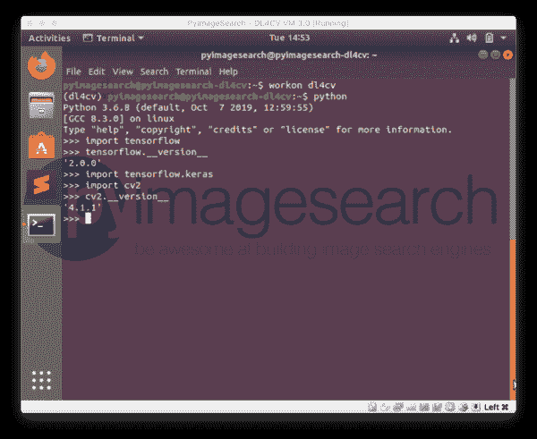](https://pyimagesearch.com/wp-content/uploads/2017/09/deep_learning_vm_python_imports.png)

**Figure 12:** Importing Keras, TensorFlow, and OpenCV into our deep learning Python virtual environment.

### 步骤#6:(可选)在虚拟机上安装来宾附件

您可能希望执行的一个可选步骤是在您的机器上安装 *VirtualBox Guest Additions* 。

客人附加服务包允许您:

*   从虚拟机复制并粘贴到您的主机(反之亦然)
*   在虚拟机和主机之间共享文件夹
*   调整屏幕分辨率
*   等等。

您可以通过从屏幕顶部的 VirtualBox 菜单中选择`Devices => Install Guest Additions...`来安装来宾附件。

### 在虚拟机上使用 Python 执行来自*计算机视觉深度学习的代码*

有多种方法可以从您的虚拟机访问使用 Python 的*计算机视觉深度学习*源代码+数据集。

***到目前为止最简单的方法*** 就是直接打开 Firefox 下载。从*“你的购买”*页面压缩存档在购买了你的*用 Python 进行计算机视觉深度学习*的副本之后。我建议将收据邮件转发给你自己，这样你就可以通过 Firefox 登录到你的收件箱，然后下载代码+数据集。

您还可以使用您最喜欢的 SFTP/FTP 客户端将代码从您的主机传输到虚拟机。

当然，当你阅读这本书时，你可以使用内置的文本编辑器在 Ubuntu 虚拟机中手工编写代码。

### 使用深度学习虚拟机的提示

当使用 Ubuntu VirtualBox 虚拟机进行深度学习时，我建议如下:

*   使用 [Sublime Text](https://www.sublimetext.com/) 作为轻量级代码编辑器。Sublime Text 是我最喜欢的 Linux 代码编辑器。它简单、易于使用，并且非常轻量级，非常适合虚拟机。
*   使用 [PyCharm](https://www.jetbrains.com/pycharm/) 作为一个成熟的 IDE。说到 Python IDEs，很难打败 PyCharm。我个人不喜欢在虚拟机中使用 PyCharm，因为它非常消耗资源。一旦安装完毕，您还需要配置 PyCharm 来使用`dl4cv` Python 环境。

### 故障排除和常见问题

在这一节中，我将详细解答关于预先配置的 Ubuntu 深度学习虚拟机的常见问题。

#### 我如何启动我的深度学习虚拟机？

一旦你的虚拟机被导入，选择 VirtualBox 软件左侧的*“DL4CV Ubuntu 虚拟机”*，然后点击*“开始”*按钮。然后，您的虚拟机将启动。

#### Ubuntu 深度学习虚拟机的用户名和密码是什么？

用户名是`pyimagesearch`，密码是`deeplearning`。

#### 用户名和密码对我无效。

为 Ubuntu 虚拟机选择的键盘布局是标准的 ***英文布局*** 。如果您使用的键盘不是英语，请为您的特定语言添加键盘布局。

为此，首先打开系统设置应用程序，选择*“键盘”*。从那里，点击面板底部的*“文本输入”*按钮:

Figure 13: Selecting “Text Entry” in the deep learning virtual image.

最后，点击*“+”*图标，选择你的键盘布局，点击*“添加”*:

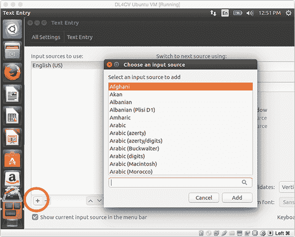

**Figure 14:** Updating the keyboard layout in the Ubuntu virtual machine.

您可能需要重新启动系统才能使这些更改生效。

#### 如何运行访问深度学习库的 Python 脚本？

使用 Python 的*计算机视觉深度学习*虚拟机使用 [Python 虚拟环境](https://realpython.com/blog/python/python-virtual-environments-a-primer/)来帮助组织 Python 模块，并将它们与 Python 的系统安装分开。

要访问虚拟环境，只需在 shell 中执行`workon dl4cv`。从那里你可以访问深度学习/计算机视觉库，如 TensorFlow、Keras、OpenCV、scikit-learn、scikit-image 等。

#### 如何从 Ubuntu 虚拟机访问我的 GPU？

简而言之，你不能从虚拟机访问你的 GPU。

虚拟机将您的硬件抽象化，并在您的主机和客户机器之间创建一个人工屏障。外围设备，如您的 GPU、USB 端口等。虚拟机无法访问物理计算机上的。

如果你想使用你的 GPU 进行深度学习，我建议你配置你的原生开发环境。

#### 我收到一条与*“VT-x/AMD-V 硬件加速不适用于您的系统”*相关的错误消息。我该怎么办？

如果您收到类似如下的错误消息:

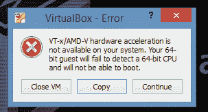

**Figure 13:** Resolving “VT-x/AMD-V hardware acceleration is not available for your system” errors.

那么您可能需要检查您的 BIOS 并确保虚拟化已启用。如果您使用的是 Windows，您可能还需要禁用 Hyper-V 模式。

要解决该问题:

1.  **从 Windows 控制面板禁用 Hyper-V 模式(如果使用 Windows 操作系统)。**看一下这个[问题](http://superuser.com/questions/597121/vt-x-amd-v-hardware-acceleration-is-not-available-on-your-system)的答案，这和你遇到的问题是一样的。禁用 Hyper-V 在不同的 Windows 版本上是不同的，但是根据上面问题的答案，您应该能够找到您的解决方案。也就是说，你也要确保完成下面的第 2 步。
2.  检查你的 BIOS。下次启动系统时，进入 BIOS 并确保虚拟化已启用(通常在某种“高级设置”下)。如果未启用虚拟化，则虚拟机将无法启动。

## 摘要

在今天的教程中，我演示了:

*   如何下载和安装用于管理虚拟机的软件 VirtualBox。
*   如何导入并启动你的 Ubuntu 深度学习虚拟机？
*   Ubuntu 启动后如何访问深度学习开发环境？

所有购买我的书， [*使用 Python 的计算机视觉深度学习*](https://pyimagesearch.com/deep-learning-computer-vision-python-book/) ，都包括我预先配置的虚拟机的副本。

这个虚拟机是迄今为止使用 Python 编程语言启动和运行深度学习和计算机视觉的最快方式。

**如果你想更多地了解我的新书(并自己拿一本)， [*点击这里*](https://pyimagesearch.com/deep-learning-computer-vision-python-book/) 。***