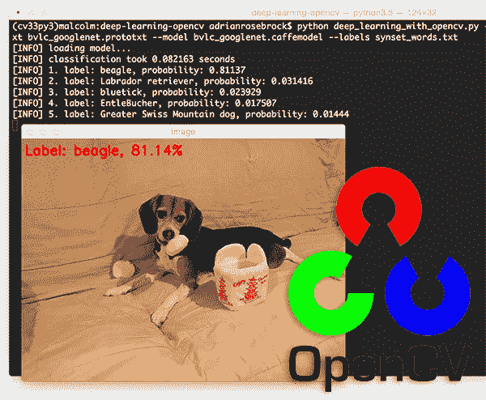
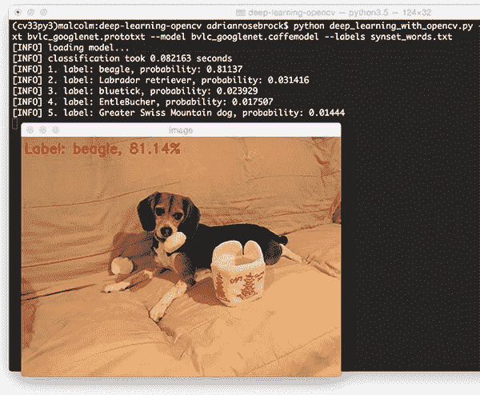
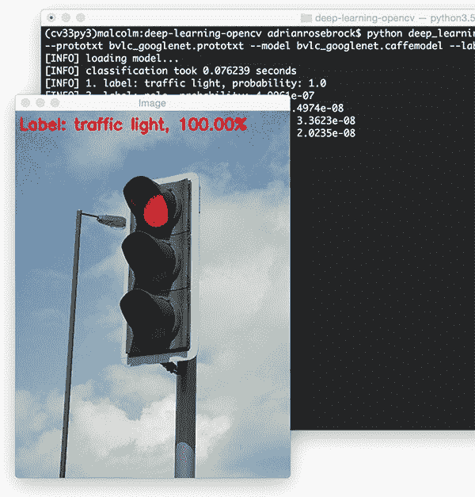
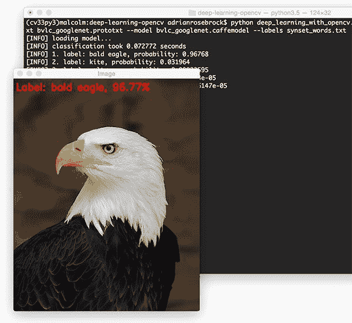
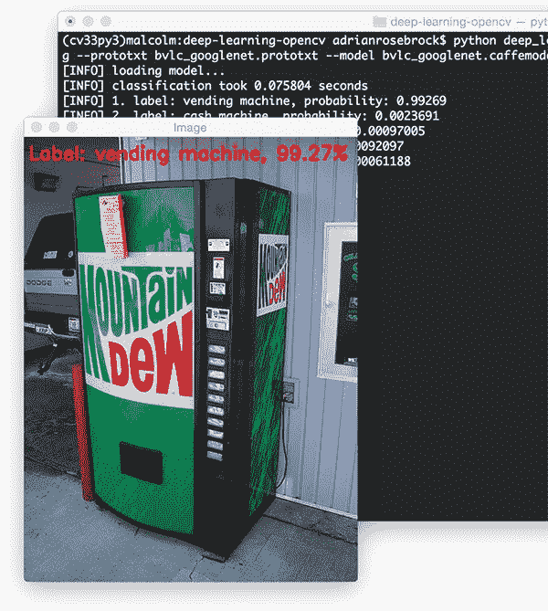

# 利用 OpenCV 进行深度学习

> 原文：<https://pyimagesearch.com/2017/08/21/deep-learning-with-opencv/>

[](https://pyimagesearch.com/wp-content/uploads/2017/08/deep_learning_opencv_header.jpg)

两周前 OpenCV 3.3 正式发布，带来了高度改进的深度学习(`dnn`)模块。这个模块现在支持很多深度学习框架，包括 Caffe、TensorFlow、Torch/PyTorch。

此外，这个用于使用*预训练深度学习模型*的 API 与*兼容*c++ API 和 Python 绑定，使*非常简单*能够:

1.  从磁盘加载模型。
2.  预处理输入图像。
3.  通过网络传递图像并获得输出分类。

虽然我们不能*使用 OpenCV 训练*深度学习模型(我们也不应该)，但这个*确实*允许我们使用专用的深度学习库/工具训练我们的模型，然后在我们的 OpenCV 脚本中直接有效地使用它们。

在这篇博文的剩余部分，我将演示如何在 ImageNet 数据集上使用预训练的深度学习网络并将其应用于输入图像的基础知识。

**想了解更多关于 OpenCV 深度学习的知识，*继续阅读。***

## 利用 OpenCV 进行深度学习

在这篇文章的第一部分，我们将讨论 OpenCV 3.3 版本和经过彻底改革的`dnn`模块。

然后我们将编写一个 Python 脚本，该脚本将使用 OpenCV 和 GoogleLeNet(在 ImageNet 上进行了预训练)来对图像进行分类。

最后，我们将探索分类的结果。

### OpenCV 3.3 内部的深度学习

OpenCV 的 [dnn 模块](https://github.com/opencv/opencv/tree/master/modules/dnn)从 3.1 版开始就是`opencv_contrib`资源库的一部分。现在在 OpenCV 3.3 中，它被包含在主资源库中。

你为什么要在乎？

深度学习是机器学习的一个快速发展的领域，如果你已经在计算机视觉/图像处理领域工作(或者正在加速)，这是一个值得探索的重要领域。

借助 OpenCV 3.3，我们可以利用带有流行深度学习框架的预训练网络。事实上，它们是经过*预训练的*,这意味着我们不需要花很多时间来训练网络——相反，我们可以完成一个正向传递，并利用输出在我们的应用中做出决策。

OpenCV 不是(也不打算)成为训练网络的工具——已经有很好的框架可以用于这个目的。由于网络(如 CNN)可以用作分类器，因此 OpenCV 有一个深度学习模块是合乎逻辑的，我们可以在 OpenCV 生态系统中轻松利用它。

与 OpenCV 3.3 兼容的流行网络架构包括:

*   GoogleLeNet(在这篇博文中使用)
*   AlexNet
*   斯奎泽尼
*   VGGNet(以及相关的风味)
*   ResNet

该模块的发行说明可在 OpenCV 资源库[页面](https://github.com/opencv/opencv/wiki/Deep-Learning-in-OpenCV)上获得。

本模块的主要贡献者 Aleksandr Rybnikov 对本模块有着雄心勃勃的计划，因此请务必保持关注并阅读他的[发行说明](https://habrahabr.ru/company/intel/blog/333612/)(俄语版，因此如果俄语不是您的母语，请确保您的浏览器启用了谷歌翻译)。

我认为`dnn`模块将对 OpenCV 社区产生重大影响，所以让我们把这个消息传出去。

#### 用 OpenCV 3.3 配置您的机器

安装 OpenCV 3.3 等同于安装其他版本。可以使用相同的安装教程—只要确保下载并使用正确的版本。

只需遵循这些针对 [MacOS](https://pyimagesearch.com/2016/12/05/macos-install-opencv-3-and-python-3-5/) 或 [Ubuntu](https://pyimagesearch.com/2015/07/20/install-opencv-3-0-and-python-3-4-on-ubuntu/) 的说明，同时确保使用 OpenCV 3.3 的 [opencv](https://github.com/opencv/opencv/releases/tag/3.3.0) 和 [opencv_contrib](https://github.com/opencv/opencv_contrib/releases/tag/3.3.0) 版本。如果你选择了 [MacOS + homebrew](https://pyimagesearch.com/2016/12/19/install-opencv-3-on-macos-with-homebrew-the-easy-way/) 安装指令，确保使用`--HEAD`开关(在提到的其他开关中)来获得 OpenCV 的最新版本。

如果你正在使用虚拟环境(**强烈推荐**)，你可以很容易地安装 OpenCV 3.3 和以前的版本。按照与您的系统相对应的教程，创建一个全新的虚拟环境(并适当地命名它)。

#### OpenCV 深度学习功能和框架

OpenCV 3.3 支持 [Caffe](http://caffe.berkeleyvision.org/) 、 [TensorFlow](https://www.tensorflow.org/) 和 [Torch](http://torch.ch/) / [PyTorch](http://pytorch.org/) 框架。

目前还不支持 Keras (因为 Keras 实际上是 TensorFlow 和 [Theano](http://deeplearning.net/software/theano/) 等后端的包装器)，尽管鉴于深度学习库的流行，我认为 Keras 得到直接支持只是时间问题。

使用 OpenCV 3.3，我们可以使用`dnn`中的以下函数从磁盘加载图像:

*   `cv2.dnn.blobFromImage`
*   `cv2.dnn.blobFromImages`

我们可以通过“创建”方法直接从各种框架中导入模型:

*   `cv2.dnn.createCaffeImporter`
*   `cv2.dnn.createTensorFlowImporter`
*   `cv2.dnn.createTorchImporter`

尽管我认为简单地使用“读取”方法并直接从磁盘加载序列化模型更容易:

*   `cv2.dnn.readNetFromCaffe`
*   `cv2.dnn.readNetFromTensorFlow`
*   `cv2.dnn.readNetFromTorch`
*   `cv2.dnn.readhTorchBlob`

一旦我们从磁盘加载了一个模型，就可以使用`. forward '方法向前传播我们的图像并获得实际的分类。

为了了解所有这些 OpenCV 深度学习部分是如何组合在一起的，让我们进入下一部分。

### 使用深度学习和 OpenCV 对图像进行分类

在这一节中，我们将创建一个 Python 脚本，该脚本可以使用 Caffe 框架，使用 OpenCV 和 GoogLeNet(在 ImageNet 上进行了预训练)对输入图像进行分类。

Szegedy 等人在他们 2014 年的论文 [*中介绍了 GoogLeNet 架构(在小说《微架构》之后，现在被称为“Inception”)。*](https://arxiv.org/abs/1409.4842)

OpenCV 3.3 还支持其他架构，包括 AlexNet、ResNet 和 SqueezeNet——我们将在未来的博客文章中研究这些用于 OpenCV 深度学习的架构。

与此同时，让我们学习如何加载一个预先训练好的 Caffe 模型，并使用它通过 OpenCV 对图像进行分类。

首先，打开一个新文件，将其命名为`deep_learning_with_opencv.py`，并插入以下代码:

```py
# import the necessary packages
import numpy as np
import argparse
import time
import cv2

```

在第 2-5 行,我们导入我们需要的包。

然后我们解析命令行参数:

```py
# construct the argument parse and parse the arguments
ap = argparse.ArgumentParser()
ap.add_argument("-i", "--image", required=True,
	help="path to input image")
ap.add_argument("-p", "--prototxt", required=True,
	help="path to Caffe 'deploy' prototxt file")
ap.add_argument("-m", "--model", required=True,
	help="path to Caffe pre-trained model")
ap.add_argument("-l", "--labels", required=True,
	help="path to ImageNet labels (i.e., syn-sets)")
args = vars(ap.parse_args())

```

在第 8 行**上，我们创建了一个参数解析器，然后建立了四个必需的命令行参数(**第 9-16 行**):**

*   `--image`:输入图像的路径。
*   `--prototxt`:Caffe“deploy”proto txt 文件的路径。
*   `--model`:预训练的 Caffe 模型(即网络权重本身)。
*   `--labels`:ImageNet 标签的路径(即“syn-sets”)。

现在我们已经建立了我们的参数，我们解析它们并将它们存储在变量`args`中，以便于以后访问。

让我们加载输入图像和类标签:

```py
# load the input image from disk
image = cv2.imread(args["image"])

# load the class labels from disk
rows = open(args["labels"]).read().strip().split("\n")
classes = [r[r.find(" ") + 1:].split(",")[0] for r in rows]

```

在**第 20 行**，我们通过`cv2.imread`从磁盘加载`image`。

让我们仔细看看我们在第 23 行和第 24 行加载的类标签数据:

```py
n01440764 tench, Tinca tinca
n01443537 goldfish, Carassius auratus
n01484850 great white shark, white shark, man-eater, man-eating shark, Carcharodon carcharias
n01491361 tiger shark, Galeocerdo cuvieri
n01494475 hammerhead, hammerhead shark
n01496331 electric ray, crampfish, numbfish, torpedo
n01498041 stingray
...

```

正如您所看到的，我们有一个惟一的标识符，后跟一个空格、一些类标签和一个换行符。使用 Python 逐行解析这个文件简单而高效。

首先，我们将类标签`rows`从磁盘加载到一个列表中。为此，我们去除了每行开头和结尾的空白，同时使用新行(“`\n`”)作为行分隔符(**第 23 行**)。结果是 id 和标签的列表:

```py
['n01440764 tench, Tinca tinca', 'n01443537 goldfish, Carassius auratus',
'n01484850 great white shark, white shark, man-eater, man-eating shark, Carcharodon carcharias',
'n01491361 tiger shark, Galeocerdo cuvieri',
'n01494475 hammerhead, hammerhead shark',
'n01496331 electric ray, crampfish, numbfish, torpedo',
'n01498041 stingray', ...]

```

第二，我们使用 list comprehension 从`rows`中提取相关的类标签，方法是查找 ID 后面的空格(’)，然后用逗号(`,`’)分隔类标签。结果只是一个类标签列表:

```py
['tench', 'goldfish', 'great white shark', 'tiger shark',
'hammerhead', 'electric ray', 'stingray', ...]

```

现在我们已经处理好了标签，让我们深入研究 OpenCV 3.3 的`dnn`模块:

```py
# our CNN requires fixed spatial dimensions for our input image(s)
# so we need to ensure it is resized to 224x224 pixels while
# performing mean subtraction (104, 117, 123) to normalize the input;
# after executing this command our "blob" now has the shape:
# (1, 3, 224, 224)
blob = cv2.dnn.blobFromImage(image, 1, (224, 224), (104, 117, 123))

```

注意上面块中的注释，我们使用`cv2.dnn.blobFromImage`执行均值减法来归一化输入图像，这导致已知的斑点形状(**行 31** )。

然后，我们从磁盘加载我们的模型:

```py
# load our serialized model from disk
print("[INFO] loading model...")
net = cv2.dnn.readNetFromCaffe(args["prototxt"], args["model"])

```

既然我们已经选择使用 Caffe，我们就利用`cv2.dnn.readNetFromCaffe`从磁盘加载我们的 Caffe 模型定义`prototxt`和预先训练的`model`(**第 35 行**)。

如果您熟悉 Caffe，您会发现`prototxt`文件是一个纯文本配置，遵循类似 JSON 的结构——我建议您从文本编辑器的 ***“下载”*** 部分打开`bvlc_googlenet.prototxt`来检查它。

***注意:**如果你不熟悉配置 Caffe CNNs，那么这是一个考虑 [PyImageSearch 大师](https://pyimagesearch.com/pyimagesearch-gurus/)课程的好时机——在课程中，你将深入了解使用深度网络进行计算机视觉和图像分类。*

现在，让我们以`blob`作为输入，通过网络完成一次正向传递:

```py
# set the blob as input to the network and perform a forward-pass to
# obtain our output classification
net.setInput(blob)
start = time.time()
preds = net.forward()
end = time.time()
print("[INFO] classification took {:.5} seconds".format(end - start))

```

在这一步需要注意的是，我们不是在*训练*一个 CNN——相反，我们是在利用一个预先训练好的网络。因此，我们只是*通过网络*传递斑点(即正向传播)以获得结果(没有反向传播)。

首先，我们指定`blob`作为我们的输入(**第 39 行**)。其次，我们制作一个`start`时间戳( **Line 40** )，然后通过网络传递我们的输入图像并存储预测。最后，我们设置了一个`end`时间戳( **Line 42** )，这样我们就可以计算差值并打印运行时间( **L** **ine 43** )。

最后，我们来确定输入图像的前五个预测:

```py
# sort the indexes of the probabilities in descending order (higher
# probabilitiy first) and grab the top-5 predictions
idxs = np.argsort(preds[0])[::-1][:5]

```

使用 NumPy，我们可以很容易地排序并提取第 47 行上的前五个预测。

接下来，我们将显示排名前五的类别预测:

```py
# loop over the top-5 predictions and display them
for (i, idx) in enumerate(idxs):
	# draw the top prediction on the input image
	if i == 0:
		text = "Label: {}, {:.2f}%".format(classes[idx],
			preds[0][idx] * 100)
		cv2.putText(image, text, (5, 25),  cv2.FONT_HERSHEY_SIMPLEX,
			0.7, (0, 0, 255), 2)

	# display the predicted label + associated probability to the
	# console	
	print("[INFO] {}. label: {}, probability: {:.5}".format(i + 1,
		classes[idx], preds[0][idx]))

# display the output image
cv2.imshow("Image", image)
cv2.waitKey(0)

```

该循环的思想是(1)在图像本身上绘制顶部预测标签，以及(2)将相关的类别标签概率打印到终端。

最后，我们将图像显示到屏幕上(**行 64** )，并在退出(**行 65** )之前等待用户按键。

### 深度学习和 OpenCV 分类结果

既然我们已经通过 OpenCV 实现了利用深度学习的 Python 脚本，那么让我们继续将它应用于一些示例图像。

确保你使用这篇博文的 ***【下载】*** 部分下载源代码+预先训练好的 GoogLeNet 架构+示例图片。

从那里，打开一个终端并执行以下命令:

```py
$ python deep_learning_with_opencv.py --image images/jemma.png 
	--prototxt bvlc_googlenet.prototxt \
	--model bvlc_googlenet.caffemodel --labels synset_words.txt
[INFO] loading model...
[INFO] classification took 0.075035 seconds
[INFO] 1\. label: beagle, probability: 0.81137
[INFO] 2\. label: Labrador retriever, probability: 0.031416
[INFO] 3\. label: bluetick, probability: 0.023929
[INFO] 4\. label: EntleBucher, probability: 0.017507
[INFO] 5\. label: Greater Swiss Mountain dog, probability: 0.01444

```

[](https://pyimagesearch.com/wp-content/uploads/2017/08/deep_learning_opencv_beagle.jpg)

**Figure 1:** Using OpenCV and deep learning to predict the class label for an input image.

在上面的例子中，我们有 Jemma，家庭小猎犬。使用 OpenCV 和 GoogLeNet，我们已经正确地将这张图片分类为 ***【小猎犬】*** 。

此外，检查前 5 名的结果，我们可以看到其他的预测也是相关的，它们都是与比格犬有相似外貌的狗。

看一下时间，我们还看到向前传递花费了不到 1 秒，即使我们正在使用我们的 CPU。

请记住，前向传递比后向传递快得多，因为我们不需要计算梯度和通过网络的反向传播。

让我们使用 OpenCV 和深度学习对另一幅图像进行分类:

```py
$ python deep_learning_with_opencv.py --image images/traffic_light.png 
	--prototxt bvlc_googlenet.prototxt \
	--model bvlc_googlenet.caffemodel --labels synset_words.txt
[INFO] loading model...
[INFO] classification took 0.080521 seconds
[INFO] 1\. label: traffic light, probability: 1.0
[INFO] 2\. label: pole, probability: 4.9961e-07
[INFO] 3\. label: spotlight, probability: 3.4974e-08
[INFO] 4\. label: street sign, probability: 3.3623e-08
[INFO] 5\. label: loudspeaker, probability: 2.0235e-08

```

[](https://pyimagesearch.com/wp-content/uploads/2017/08/deep_learning_opencv_traffic_light.jpg)

**Figure 2:** OpenCV and deep learning is used to correctly label this image as “traffic light”.

OpenCV 和 GoogLeNet 以 100%的把握正确地将这张图片标注为 ***【红绿灯】*** 。

在这个例子中我们有一个 ***【秃鹰】*** :

```py
$ python deep_learning_with_opencv.py --image images/eagle.png
	--prototxt bvlc_googlenet.prototxt \
	--model bvlc_googlenet.caffemodel --labels synset_words.txt
[INFO] loading model...
[INFO] classification took 0.087207 seconds
[INFO] 1\. label: bald eagle, probability: 0.96768
[INFO] 2\. label: kite, probability: 0.031964
[INFO] 3\. label: vulture, probability: 0.00023595
[INFO] 4\. label: albatross, probability: 6.3653e-05
[INFO] 5\. label: black grouse, probability: 1.6147e-05

```

[](https://pyimagesearch.com/wp-content/uploads/2017/08/deep_learning_opencv_bald_eagle.jpg)

**Figure 3:** The “deep neural network” (dnn) module inside OpenCV 3.3 can be used to classify images using pre-trained models.

我们再次能够正确地对输入图像进行分类。

我们最后的例子是一个***【自动售货机】****:*

```py
$ python deep_learning_with_opencv.py --image images/vending_machine.png
	--prototxt bvlc_googlenet.prototxt \
	--model bvlc_googlenet.caffemodel --labels synset_words.txt
[INFO] loading model...
[INFO] classification took 0.099602 seconds
[INFO] 1\. label: vending machine, probability: 0.99269
[INFO] 2\. label: cash machine, probability: 0.0023691
[INFO] 3\. label: pay-phone, probability: 0.00097005
[INFO] 4\. label: ashcan, probability: 0.00092097
[INFO] 5\. label: mailbox, probability: 0.00061188

```

[](https://pyimagesearch.com/wp-content/uploads/2017/08/deep_learning_opencv_vending_machine.jpg)

**Figure 4:** Since our GoogLeNet model is pre-trained on ImageNet, we can classify each of the 1,000 labels inside the dataset using OpenCV + deep learning.

OpenCV +深度学习再一次正确地对图像进行了分类。

## 摘要

在今天的博文中，我们学习了如何使用 OpenCV 进行深度学习。

随着 OpenCV 3.3 的发布，深度神经网络(`dnn`)库得到了实质性的改革，允许我们通过 Caffe、TensorFlow 和 Torch/PyTorch 框架加载预训练的网络，然后使用它们对输入图像进行分类。

鉴于这个框架如此受欢迎，我想 Keras 的支持也将很快到来。这可能是一个不简单的实现，因为 Keras 本身可以支持多个数值计算后端。

在接下来的几周里，我们将:

1.  深入研究`dnn`模块，以及如何在我们的 Python + OpenCV 脚本中使用它。
2.  了解如何修改 Caffe `.prototxt`文件以兼容 OpenCV。
3.  了解我们如何使用 OpenCV 将深度学习应用于 Raspberry Pi。

***这是一个不容错过的系列博客文章*，所以在你离开之前，*请确保在下面的表格中输入你的电子邮件地址，以便在这些文章发布时得到通知！****