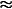

# 利用 Keras 和 TensorFlow 防御恶意图像攻击

> 原文：<https://pyimagesearch.com/2021/03/08/defending-against-adversarial-image-attacks-with-keras-and-tensorflow/>

在本教程中，您将学习如何使用 Keras 和 TensorFlow 防御恶意图像攻击。

到目前为止，您已经学习了如何使用三种不同的方法生成对立的图像:

1.  [*用 Keras 和 TensorFlow* 攻击对抗性图像和 ](https://pyimagesearch.com/2020/10/19/adversarial-images-and-attacks-with-keras-and-tensorflow/)
2.  [*用 Keras 和 TensorFlow 进行针对性的对抗性攻击*](https://pyimagesearch.com/2020/10/26/targeted-adversarial-attacks-with-keras-and-tensorflow/)
3.  [](https://pyimagesearch.com/2021/03/01/adversarial-attacks-with-fgsm-fast-gradient-sign-method/)

 *使用对立的图像，我们可以欺骗我们的卷积神经网络(CNN)做出不正确的预测。虽然，根据人类的眼睛，敌对的图像可能看起来与它们的原始副本*一样*，但是它们包含小的干扰，导致我们的 CNN 做出非常不正确的预测。

[正如我在本教程中讨论的](https://pyimagesearch.com/2020/10/19/adversarial-images-and-attacks-with-keras-and-tensorflow/)，将未设防的模型部署到野外会有*巨大的*后果。

例如，想象一下部署到自动驾驶汽车上的深度神经网络。邪恶的用户可以生成敌对的图像，打印它们，然后将它们应用于道路、标志、立交桥等。，这将导致模型认为有行人、汽车或障碍物，而实际上没有！结果可能是灾难性的，包括车祸、受伤和生命损失。

鉴于敌对图像带来的风险，这就提出了一个问题:

> 我们能做些什么来抵御这些攻击呢？

我们将在关于对抗性图像防御的两部分系列中讨论这个问题:

1.  *使用 Keras 和 TensorFlow 防御恶意图像攻击*(今天的教程)
2.  *训练 CNN 时混合正常图像和敌对图像*(下周指南)

对抗性的形象辩护不是闹着玩的。如果您正在将模型部署到现实世界中，那么请确保您有适当的程序来防御恶意攻击。

通过遵循这些教程，你可以训练你的 CNN 做出正确的预测*，即使*他们面对的是敌对的图像。

**要了解如何训练 CNN 抵御 Keras 和 TensorFlow 的对抗性攻击，*继续阅读。***

## **使用 Keras 和 TensorFlow 防御恶意图像攻击**

在本教程的第一部分，我们将讨论作为“军备竞赛”的对立图像的概念，以及我们可以做些什么来抵御它们。

然后，我们将讨论两种方法，我们可以用来抵御敌对的形象。我们今天实现第一个方法，下周实现第二个方法。

从那里，我们将配置我们的开发环境，并审查我们的项目目录结构。

然后，我们要回顾几个 Python 脚本，包括:

1.  我们的 CNN 架构
2.  使用 FGSM 生成对抗图像的功能
3.  一个数据生成器功能，用于生成*批*对立的图像，这样我们就可以对它们进行微调
4.  一个将所有片段放在一起的训练脚本在 MNIST 数据集上训练我们的模型，生成敌对的图像，然后对 CNN 进行微调以提高准确性

我们开始吧！

### 对立的图像是一场“军备竞赛”，我们需要防范它们

防御敌对攻击已经并将继续是一个活跃的研究领域。没有“灵丹妙药”的方法可以让你的模型在对抗攻击时变得健壮。

相反，你应该重新定义你对对抗性攻击的想法——这不像是“灵丹妙药”程序的*和*,而更像是一场军备竞赛。

在美苏冷战期间，两国都投入了巨额资金和无数时间进行研发:

1.  制造强大的武器
2.  同时创造系统来防御这些武器

对于核武器棋盘上的每一步棋，都有同等的防御企图。

我们一直看到这种类型的军备竞赛:

一家公司在业内创造新产品，而另一家公司创造自己的版本。本田和丰田就是一个很好的例子。当本田在 1986 年推出他们的高端豪华车版本讴歌时，丰田在 1989 年推出了他们的豪华车版本雷克萨斯作为反击。

另一个例子来自反病毒软件，它可以持续防御新的攻击。当一种新的计算机病毒进入数字世界时，反病毒公司会迅速向其软件发布补丁，以检测和删除这些病毒。

不管我们喜欢与否，我们生活在一个不断升级的世界里。对于每一个动作，都有一个相等的反作用力。这不仅仅是物理，这是世界的方式。

假设我们的计算机视觉和深度学习模型存在于真空中，缺乏操纵，这是不明智的。它们可以(也确实)被操纵。

就像我们的计算机可以感染黑客开发的病毒一样，我们的神经网络也容易受到各种类型的攻击，最常见的是敌对攻击。

好消息是我们可以抵御这些攻击。

### 你如何抵御对抗性的形象攻击？

防御敌对攻击的最简单方法之一是在这些类型的图像上训练你的模型。

例如，如果我们担心邪恶的用户将 FGSM 攻击应用于我们的模型，那么我们可以通过在我们自己的 FSGM 图像上训练他们来“接种”我们的神经网络。

典型地，这种类型的对抗性接种通过以下任一方式应用:

1.  在给定数据集上训练我们的模型，生成一组对立图像，然后在对立图像上微调模型
2.  生成混合批次的*原始训练图像*和*对抗图像*，随后在这些混合批次上微调我们的神经网络

第一种方法更简单，需要更少的计算(因为我们只需要生成一组对立的图像)。不利的一面是，这种方法往往不够稳健，因为我们只是在训练结束时对对立例子的模型进行微调。

第二种方法*要复杂得多*并且需要*明显*更多的计算。我们需要使用该模型为每批生成敌对图像*，其中网络被训练。*

第二种方法的好处是，该模型往往更鲁棒，因为它在训练期间的每一次批量更新中都看到了*原始训练图像*和*对抗图像。*

 *此外，*模型本身*用于在每批期间生成对抗图像。**随着模型越来越善于愚弄自己，它可以从错误中学习，从而产生一个可以更好地抵御对抗性攻击的模型。**

今天我们将讨论第一种方法。下周我们将实现更高级的方法。

### **对抗性图像防御的问题和考虑事项**

前面提到的两种对抗性图像防御方法都依赖于:

1.  用于生成对立示例的模型架构和权重
2.  用于生成它们的优化器

如果我们简单地用一个*不同的*模型(可能是一个更复杂的模型)创建一个敌对的形象，这些训练方案可能不能很好地推广。

此外，如果我们只在对抗性图像上训练*而不是*，那么这个模型在常规图像上可能表现不好。这种现象通常被称为[灾难性遗忘](https://en.wikipedia.org/wiki/Catastrophic_interference)，在对抗性防御的背景下，意味着模型已经“忘记”了真实图像的样子。

为了缓解这个问题，我们首先生成一组对立的图像，将它们与常规训练集混合，然后最终训练模型(我们将在下周的博客文章中进行)。

### **配置您的开发环境**

这篇关于防御恶意图像攻击的教程使用了 Keras 和 TensorFlow。如果你打算遵循这个教程，我建议你花时间配置你的深度学习开发环境。

您可以利用这两个指南中的任何一个在您的系统上安装 TensorFlow 和 Keras:

*   [*如何在 Ubuntu 上安装 tensor flow 2.0*](https://pyimagesearch.com/2019/12/09/how-to-install-tensorflow-2-0-on-ubuntu/)
*   [*如何在 macOS 上安装 tensor flow 2.0*](https://pyimagesearch.com/2019/12/09/how-to-install-tensorflow-2-0-on-macos/)

这两个教程都将帮助您在一个方便的 Python 虚拟环境中，用这篇博文所需的所有软件来配置您的系统。

### **在配置开发环境时遇到了问题？**

说了这么多，你是:

*   时间紧迫？
*   了解你雇主的行政锁定系统？
*   想要跳过与命令行、包管理器和虚拟环境斗争的麻烦吗？
*   准备好在您的 Windows、macOS 或 Linux 系统上运行代码*了吗*？

那今天就加入 [PyImageSearch 大学](https://pyimagesearch.com/pyimagesearch-plus/)吧！

**获得本教程的 Jupyter 笔记本和其他 PyImageSearch 指南，这些指南已经过*预配置*，可以在您的网络浏览器中运行在 Google Colab 的生态系统上！**无需安装。

最棒的是，这些 Jupyter 笔记本可以在 Windows、macOS 和 Linux 上运行！

### **项目结构**

在我们深入任何代码之前，让我们首先回顾一下我们的项目目录结构。

请务必访问本指南的 ***“下载”*** 部分以检索源代码:

```py
$ tree . --dirsfirst
.
├── pyimagesearch
│   ├── __init__.py
│   ├── datagen.py
│   ├── fgsm.py
│   └── simplecnn.py
└── train_adversarial_defense.py

1 directory, 5 files
```

在`pyimagesearch`模块中，您会发现三个文件:

1.  `datagen.py`:实现一次批量生成对抗图像的功能。我们将使用这个函数来训练和评估我们的 CNN 对抗防御的准确性。
2.  `fgsm.py`:执行[快速梯度符号法(FGSM)](https://pyimagesearch.com/2021/03/01/adversarial-attacks-with-fgsm-fast-gradient-sign-method/) 生成对抗图像。
3.  我们的 CNN 架构，我们将对其进行训练和评估，以进行图像攻击防御。

最后，`train_adversarial_defense.py`将所有这些部分粘合在一起，并展示:

1.  如何训练我们的 CNN 架构
2.  如何评价 CNN 对我们的测试集
3.  如何使用我们训练有素的 CNN 生成一批图像对手
4.  如何评价我们 CNN 对图像对手的准确性
5.  如何微调我们的 CNN 形象对手
6.  如何重新评价 CNN 对*双方*最初的训练设置和形象的敌对

在本指南结束时，你将对训练 CNN 进行基本的图像对手防御有一个很好的理解。

### **我们简单的 CNN 架构**

我们将训练一个基本的 CNN 架构，并用它来演示对抗性图像防御。

虽然我今天在这里介绍了这个模型的实现，但我在上周关于[快速梯度符号方法](https://pyimagesearch.com/2021/03/01/adversarial-attacks-with-fgsm-fast-gradient-sign-method/)的教程中详细介绍了这个架构，所以如果你需要更全面的复习，我建议你参考那里。

打开您的`pyimagesearch`模块中的`simplecnn.py`文件，您会发现以下代码:

```py
# import the necessary packages
from tensorflow.keras.models import Sequential
from tensorflow.keras.layers import BatchNormalization
from tensorflow.keras.layers import Conv2D
from tensorflow.keras.layers import Activation
from tensorflow.keras.layers import Flatten
from tensorflow.keras.layers import Dropout
from tensorflow.keras.layers import Dense
```

我们文件的顶部由我们的 Keras 和 TensorFlow 导入组成。

然后我们定义`SimpleCNN`架构。

```py
class SimpleCNN:
	@staticmethod
	def build(width, height, depth, classes):
		# initialize the model along with the input shape
		model = Sequential()
		inputShape = (height, width, depth)
		chanDim = -1

		# first CONV => RELU => BN layer set
		model.add(Conv2D(32, (3, 3), strides=(2, 2), padding="same",
			input_shape=inputShape))
		model.add(Activation("relu"))
		model.add(BatchNormalization(axis=chanDim))

		# second CONV => RELU => BN layer set
		model.add(Conv2D(64, (3, 3), strides=(2, 2), padding="same"))
		model.add(Activation("relu"))
		model.add(BatchNormalization(axis=chanDim))

		# first (and only) set of FC => RELU layers
		model.add(Flatten())
		model.add(Dense(128))
		model.add(Activation("relu"))
		model.add(BatchNormalization())
		model.add(Dropout(0.5))

		# softmax classifier
		model.add(Dense(classes))
		model.add(Activation("softmax"))

		# return the constructed network architecture
		return model
```

正如你所看到的，这是一个基本的 CNN 模型，包括两组`CONV => RELU => BN`图层，后跟一个 softmax 图层头。softmax 分类器将返回给定输入图像的类别标签概率分布。

同样，你应该参考[上周的教程](https://pyimagesearch.com/2021/03/01/adversarial-attacks-with-fgsm-fast-gradient-sign-method/)获得更详细的解释。

### **用于生成对抗图像的 FGSM 技术**

我们将使用快速梯度符号方法(FGSM)来生成对抗图像。上周我们讨论了[这种技术，但是为了完整起见，我今天在这里加入了代码。](https://pyimagesearch.com/2021/03/01/adversarial-attacks-with-fgsm-fast-gradient-sign-method/)

如果您在`pyimagesearch`模块中打开`fgsm.py`文件，您会发现以下代码:

```py
# import the necessary packages
from tensorflow.keras.losses import MSE
import tensorflow as tf

def generate_image_adversary(model, image, label, eps=2 / 255.0):
	# cast the image
	image = tf.cast(image, tf.float32)

	# record our gradients
	with tf.GradientTape() as tape:
		# explicitly indicate that our image should be tacked for
		# gradient updates
		tape.watch(image)

		# use our model to make predictions on the input image and
		# then compute the loss
		pred = model(image)
		loss = MSE(label, pred)

	# calculate the gradients of loss with respect to the image, then
	# compute the sign of the gradient
	gradient = tape.gradient(loss, image)
	signedGrad = tf.sign(gradient)

	# construct the image adversary
	adversary = (image + (signedGrad * eps)).numpy()

	# return the image adversary to the calling function
	return adversary
```

本质上，该函数跟踪图像的梯度，对其进行预测，计算损失，然后使用梯度的符号来更新输入图像的像素强度，例如:

1.  这张照片最终被我们的 CNN 错误分类了
2.  然而图像看起来与原始图像完全相同(根据人眼的观察)

参考上周关于[快速梯度符号方法](https://pyimagesearch.com/2021/03/01/adversarial-attacks-with-fgsm-fast-gradient-sign-method/)的教程，了解更多关于该技术如何工作及其实现的细节。

### **实现自定义数据生成器，用于在训练** 期间生成对抗图像

 *今天我们这里最重要的函数是`generate_adverserial_batch`方法。该函数是一个自定义数据生成器，我们将在培训中使用。

在高层次上，该功能:

1.  接受一组训练图像
2.  从我们的训练图像中随机抽取一批大小为 *N* 的样本
3.  将`generate_image_adversary`函数应用于它们，以创建我们的形象对手
4.  **为我们的训练循环产生一批图像对手，从而允许我们的模型从图像对手那里学习模式，并理想地防御它们**

现在让我们来看看我们的定制数据生成器。在我们的项目目录结构中打开`datagen.py`文件，并插入以下代码:

```py
# import the necessary packages
from .fgsm import generate_image_adversary
import numpy as np

def generate_adversarial_batch(model, total, images, labels, dims,
	eps=0.01):
	# unpack the image dimensions into convenience variables
	(h, w, c) = dims
```

我们从导入我们需要的包开始。注意，我们通过前面实现的`generate_image_adversary`函数来使用 FGSM 实现。

我们的`generate_adversarial_batch`函数需要几个参数，包括:

1.  `model`:我们要忽悠的 CNN(即我们正在训练的模型)。
2.  `total`:我们要生成的一批对抗性图像的大小。
3.  我们将从中取样的图像集(通常是训练集或测试集)。
4.  `labels`:对应于`images`的分类标签
5.  `dims`:我们输入的空间维度`images`。
6.  `eps`:当应用快速梯度符号方法时，用于控制像素强度更新幅度的小ε因子。

**第 8 行**将我们的`dims`解包成高度(`h`)、宽度(`w`)和通道数量(`c`)，这样我们就可以很容易地在剩下的函数中引用它们。

现在让我们构建数据生成器本身:

```py
	# we're constructing a data generator here so we need to loop
	# indefinitely
	while True:
		# initialize our perturbed images and labels
		perturbImages = []
		perturbLabels = []

		# randomly sample indexes (without replacement) from the
		# input data
		idxs = np.random.choice(range(0, len(images)), size=total,
			replace=False)
```

**第 12 行**开始一个循环，该循环将无限期继续，直到训练完成。

然后我们初始化两个列表，`perturbImages`(存储稍后在这个`while`循环中生成的一批对立图像)和`perturbLabels`(存储图像的原始类标签)。

**19 号线和 20 号线**随机抽取一套我们的`images`。

我们现在可以循环这些随机选择的图像的索引:

```py
		# loop over the indexes
		for i in idxs:
			# grab the current image and label
			image = images[i]
			label = labels[i]

			# generate an adversarial image
			adversary = generate_image_adversary(model,
				image.reshape(1, h, w, c), label, eps=eps)

			# update our perturbed images and labels lists
			perturbImages.append(adversary.reshape(h, w, c))
			perturbLabels.append(label)

		# yield the perturbed images and labels
		yield (np.array(perturbImages), np.array(perturbLabels))
```

**25、26 线**抢电流`image`和`label`。

然后我们应用我们的`generate_image_adversary`函数使用 FGSM 创建图像对手(**第 29 行和第 30 行**)。

随着`adversary`的生成，我们分别更新了我们的`perturbImages`和`perturbLabels`列表。

我们的数据生成器通过为训练过程产生我们的对立图像和标签的二元组来完成。

**该功能可以概括为:**

1.  接受一组输入图像
2.  随机选择其中的一个子集
3.  为子集生成镜像对手
4.  让形象对手回到训练过程中，这样我们的 CNN 可以从他们身上学习模式

假设我们用*原始训练图像*和*对抗图像*来训练 CNN。在这种情况下，我们的 CNN 可以在两个集合上做出正确的预测，从而使我们的模型对对抗性攻击更加健壮。

### **正常图像的训练，对抗图像的微调**

实现了所有的助手函数后，让我们继续创建训练脚本来防御敌对图像。

打开项目结构中的`train_adverserial_defense.py`文件，让我们开始工作:

```py
# import the necessary packages
from pyimagesearch.simplecnn import SimpleCNN
from pyimagesearch.datagen import generate_adversarial_batch
from tensorflow.keras.optimizers import Adam
from tensorflow.keras.utils import to_categorical
from tensorflow.keras.datasets import mnist
import numpy as np
```

**第 2-7 行**导入我们需要的 Python 包。注意，我们正在导入我们的`SimpleCNN`架构和`generate_adverserial_batch`函数，这是我们刚刚实现的。

然后，我们继续加载 MNIST 数据集并对其进行预处理:

```py
# load MNIST dataset and scale the pixel values to the range [0, 1]
print("[INFO] loading MNIST dataset...")
(trainX, trainY), (testX, testY) = mnist.load_data()
trainX = trainX / 255.0
testX = testX / 255.0

# add a channel dimension to the images
trainX = np.expand_dims(trainX, axis=-1)
testX = np.expand_dims(testX, axis=-1)

# one-hot encode our labels
trainY = to_categorical(trainY, 10)
testY = to_categorical(testY, 10)
```

加载 MNIST 数据集后，我们可以编译模型并在训练集上对其进行训练:

```py
# initialize our optimizer and model
print("[INFO] compiling model...")
opt = Adam(lr=1e-3)
model = SimpleCNN.build(width=28, height=28, depth=1, classes=10)
model.compile(loss="categorical_crossentropy", optimizer=opt,
	metrics=["accuracy"])

# train the simple CNN on MNIST
print("[INFO] training network...")
model.fit(trainX, trainY,
	validation_data=(testX, testY),
	batch_size=64,
	epochs=20,
	verbose=1)
```

下一步是在测试集上评估模型:

```py
# make predictions on the testing set for the model trained on
# non-adversarial images
(loss, acc) = model.evaluate(x=testX, y=testY, verbose=0)
print("[INFO] normal testing images:")
print("[INFO] loss: {:.4f}, acc: {:.4f}\n".format(loss, acc))

# generate a set of adversarial from our test set
print("[INFO] generating adversarial examples with FGSM...\n")
(advX, advY) = next(generate_adversarial_batch(model, len(testX),
	testX, testY, (28, 28, 1), eps=0.1))

# re-evaluate the model on the adversarial images
(loss, acc) = model.evaluate(x=advX, y=advY, verbose=0)
print("[INFO] adversarial testing images:")
print("[INFO] loss: {:.4f}, acc: {:.4f}\n".format(loss, acc))
```

**第 40-42 行**利用我们训练过的 CNN 对测试集进行预测。然后，我们在终端上显示精确度和损耗。

**现在，让我们看看我们的模型在*敌对图像上的表现。***

**第 46 行和第 47 行**生成一组敌对的图像，而**第 50-52 行** *重新评估*我们训练有素的 CNN 对这些敌对的例子。正如我们将在下一节中看到的，我们的预测准确度*在敌对图像上直线下降*。

这就提出了一个问题:

> 我们如何抵御这些敌对的攻击？

一个基本的解决方案是在对立图像上微调我们的模型:

```py
# lower the learning rate and re-compile the model (such that we can
# fine-tune it on the adversarial images)
print("[INFO] re-compiling model...")
opt = Adam(lr=1e-4)
model.compile(loss="categorical_crossentropy", optimizer=opt,
	metrics=["accuracy"])

# fine-tune our CNN on the adversarial images
print("[INFO] fine-tuning network on adversarial examples...")
model.fit(advX, advY,
	batch_size=64,
	epochs=10,
	verbose=1)
```

**第 57-59 行**降低优化器的学习率，然后重新编译模型。

然后我们在对立的例子上微调我们的模型(**第 63-66 行**)。

最后，我们将进行最后一组评估:

```py
# now that our model is fine-tuned we should evaluate it on the test
# set (i.e., non-adversarial) again to see if performance has degraded
(loss, acc) = model.evaluate(x=testX, y=testY, verbose=0)
print("")
print("[INFO] normal testing images *after* fine-tuning:")
print("[INFO] loss: {:.4f}, acc: {:.4f}\n".format(loss, acc))

# do a final evaluation of the model on the adversarial images
(loss, acc) = model.evaluate(x=advX, y=advY, verbose=0)
print("[INFO] adversarial images *after* fine-tuning:")
print("[INFO] loss: {:.4f}, acc: {:.4f}".format(loss, acc))
```

在微调之后，我们需要重新评估我们的模型在原始测试集(**第 70-73 行**)和我们的对抗示例(**第 76-78 行**)上的准确性。

**正如我们将在下一节中看到的，在这些对立的例子上微调我们的 CNN 允许我们的模型对*原始图像*和通过对立技术生成的*图像做出正确的预测！***

 *### **对抗性图像防御结果**

我们现在已经准备好训练我们的 CNN 来抵御敌对的图像攻击！

首先访问本指南的 ***“下载”*** 部分以检索源代码。从那里，打开一个终端并执行以下命令:

```py
$ time python train_adversarial_defense.py
[INFO] loading MNIST dataset...
[INFO] compiling model...
[INFO] training network...
Epoch 1/20
938/938 [==============================] - 12s 13ms/step - loss: 0.1973 - accuracy: 0.9402 - val_loss: 0.0589 - val_accuracy: 0.9809
Epoch 2/20
938/938 [==============================] - 12s 12ms/step - loss: 0.0781 - accuracy: 0.9762 - val_loss: 0.0453 - val_accuracy: 0.9838
Epoch 3/20
938/938 [==============================] - 12s 13ms/step - loss: 0.0599 - accuracy: 0.9814 - val_loss: 0.0410 - val_accuracy: 0.9868
...
Epoch 18/20
938/938 [==============================] - 11s 12ms/step - loss: 0.0103 - accuracy: 0.9963 - val_loss: 0.0476 - val_accuracy: 0.9883
Epoch 19/20
938/938 [==============================] - 11s 12ms/step - loss: 0.0091 - accuracy: 0.9967 - val_loss: 0.0420 - val_accuracy: 0.9889
Epoch 20/20
938/938 [==============================] - 11s 12ms/step - loss: 0.0087 - accuracy: 0.9970 - val_loss: 0.0443 - val_accuracy: 0.9892
[INFO] normal testing images:
[INFO] loss: 0.0443, acc: 0.9892
```

在这里，你可以看到我们已经在 MNIST 数据集上训练了 20 个时期的 CNN。我们在训练集上获得了 99.70%的准确率，在测试集上获得了 98.92%的准确率，这意味着我们的 CNN 在数字预测方面做得很好。

然而，当我们生成一组 10，000 张敌对图像并要求 CNN 对它们进行分类时，这种“高精度”模型是可悲的*不充分*和*不准确*:

```py
[INFO] generating adversarial examples with FGSM...

[INFO] adversarial testing images:
[INFO] loss: 17.2824, acc: 0.0170
```

**如你所见，我们的准确度*从最初的*98.92%*直线下降到 1.7%。***

显然，我们的 CNN 在敌对形象上完全失败了。

也就是说，希望并没有消失！现在让我们对 CNN 的 10，000 张敌对图片进行微调:

```py
[INFO] re-compiling model...
[INFO] fine-tuning network on adversarial examples...
Epoch 1/10
157/157 [==============================] - 2s 12ms/step - loss: 8.0170 - accuracy: 0.2455
Epoch 2/10
157/157 [==============================] - 2s 11ms/step - loss: 1.9634 - accuracy: 0.7082
Epoch 3/10
157/157 [==============================] - 2s 11ms/step - loss: 0.7707 - accuracy: 0.8612
...
Epoch 8/10
157/157 [==============================] - 2s 11ms/step - loss: 0.1186 - accuracy: 0.9701
Epoch 9/10
157/157 [==============================] - 2s 12ms/step - loss: 0.0894 - accuracy: 0.9780
Epoch 10/10
157/157 [==============================] - 2s 12ms/step - loss: 0.0717 - accuracy: 0.9817
```

我们现在获得

**98% accuracy on the adversarial images after fine-tuning.**

现在让我们回过头来，重新评估 CNN 关于*原始测试集和我们的对抗图像:*

```py
[INFO] normal testing images *after* fine-tuning:
[INFO] loss: 0.0594, acc: 0.9844

[INFO] adversarial images *after* fine-tuning:
[INFO] loss: 0.0366, acc: 0.9906

real	5m12.753s
user	12m42.125s
sys	10m0.498s
```

最初，我们的 CNN 在我们的测试集上获得了 98.92%的准确率。由设定的测试精度下降

0.5%, but the *good news* is that we’re now hitting 99% accuracy when classifying our adversarial images, thereby implying that:

1.  我们的模型可以对来自 MNIST 数据集的*原始的、未受干扰的图像*做出正确的预测。
2.  我们还可以对生成的敌对图像做出准确的预测(意味着我们已经成功地抵御了它们)。

### 我们还能如何抵御敌对攻击？

在对抗性图像上微调模型只是抵御对抗性攻击的一种方式。

**一种*更好的*方式是在训练过程** 中将对抗性的图像与原始图像*混合并融合。*

其结果是一个更强大的模型，能够抵御对抗性攻击，因为该模型在每一批中都生成自己的对抗性图像，从而*不断改进自己*，而不是依赖于训练后的一轮微调。

我们将在下周的教程中讨论这种“混合批次对抗训练法”。

### **演职员表和参考资料**

FGSM 和数据生成器的实现受到了塞巴斯蒂安·蒂勒关于对抗性攻击和防御的优秀文章的启发。非常感谢 Sebastian 分享他的知识。

## **总结**

在本教程中，您学习了如何使用 Keras 和 TensorFlow 来防御恶意图像攻击。

我们的对抗性形象辩护通过以下方式发挥作用:

1.  在我们的数据集上训练 CNN
2.  使用所训练的模型生成一组对立图像
3.  在对立图像上微调我们的模型

结果是一个模型，它既:

1.  在原始测试图像上精确
2.  也能够正确地分类对立的图像

对抗性图像防御的微调方法本质上是最基本的对抗性防御。下周，您将学习一种更高级的方法，该方法合并了大量动态生成的对立图像，允许模型从每个时期“愚弄”它的对立示例中学习。

如果你喜欢这个指南，你肯定不想错过下周的教程！

**要下载这篇文章的源代码(并在未来教程在 PyImageSearch 上发布时得到通知)，*只需在下面的表格中输入您的电子邮件地址！*******