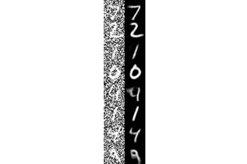

# 使用 Keras、TensorFlow 和深度学习对自动编码器进行降噪

> 原文：<https://pyimagesearch.com/2020/02/24/denoising-autoencoders-with-keras-tensorflow-and-deep-learning/>

在本教程中，您将学习如何使用自动编码器通过 Keras、TensorFlow 和深度学习对图像进行降噪。

今天的教程是关于自动编码器应用的三部分系列的第二部分:

1.  *[带 Keras、TensorFlow、深度学习的自动编码器](https://pyimagesearch.com/2020/02/17/autoencoders-with-keras-tensorflow-and-deep-learning/)* (上周教程)
2.  *使用 Keras、TensorFlow 和深度学习对自动编码器进行降噪*(今天的教程)
3.  *利用 Keras、TensorFlow 和深度学习进行异常检测*(下周教程)

上周，您学习了自动编码器的基础知识，包括如何使用 Keras 和 TensorFlow 训练您的第一个自动编码器——然而，由于我们需要打下基础，该教程的实际应用不可否认地有点有限。

**今天，我们将深入了解自动编码器如何用于*去噪*** ，也称为“降噪”，即从信号中去除噪声的过程。

这里的术语“噪声”可以是:

*   由有故障或质量差的图像传感器产生
*   亮度或颜色的随机变化
*   量化噪声
*   JPEG 压缩导致的伪像
*   图像扫描仪或阈值后处理产生的图像扰动
*   尝试执行 OCR 时纸张质量差(起皱和折叠)

从图像处理和计算机视觉的角度来看，**你应该认为噪音是任何可以被真正好的*T2 预处理过滤器去除的东西。***

我们的目标是训练一个自动编码器来执行这样的预处理——我们称这样的模型为*去噪自动编码器。*

**要了解如何使用 Keras 和 TensorFlow 训练去噪自动编码器，*继续阅读！***

## 使用 Keras、TensorFlow 和深度学习对自动编码器进行降噪

在本教程的第一部分，我们将讨论什么是去噪自动编码器，以及为什么我们可能要使用它们。

从那以后，我将向您展示如何使用 Keras 和 TensorFlow 实现和训练一个去噪自动编码器。

我们将通过检查去噪自动编码器的结果来结束本教程。

### 什么是去噪自动编码器，我们为什么要使用它们？

去噪自动编码器是简单自动编码器的扩展。然而，值得注意的是去噪自动编码器是*而不是*最初的意思是自动去噪图像。

相反，发明去噪自动编码器程序是为了帮助:

*   自动编码器的隐藏层学习更健壮的过滤器
*   降低自动编码器过拟合的风险
*   防止自动编码器学习简单的识别功能

在文森特等人 2008 年的 ICML 论文中， [*使用去噪自动编码器*](https://www.cs.toronto.edu/~larocheh/publications/icml-2008-denoising-autoencoders.pdf) 提取和合成鲁棒特征，作者发现他们可以通过**故意将噪声引入信号来提高其内部层(即潜在空间表示)的鲁棒性。**

噪声被随机地(即，随机地)添加到输入数据中，然后自动编码器被训练以恢复原始的、未受干扰的信号。

从图像处理的角度来看，我们可以训练自动编码器来为我们执行自动图像预处理。

一个很好的例子就是预处理图像来提高光学字符识别(OCR)算法的准确性。如果你以前曾经应用过 OCR，你应该知道一点点*错误类型的噪声*(例如。打印机墨水污迹、扫描期间图像质量差等等。)T4 会对你的 OCR 方法的性能造成显著影响吗？使用去噪自动编码器，我们可以自动预处理图像，提高质量，并因此增加下游 OCR 算法的准确性。

如果你有兴趣了解更多关于去噪自动编码器的知识，我强烈建议你阅读这篇文章，以及本吉奥和德拉鲁的论文，证明和归纳对比差异，T2 和 T4。

关于为 OCR 相关预处理去噪自动编码器的更多信息，[请看 Kaggle](https://www.kaggle.com/c/denoising-dirty-documents) 上的这个数据集。

### 配置您的开发环境

为了跟随今天关于自动编码器的教程，你应该使用 TensorFlow 2.0。我有两个 TF 2.0 的安装教程和相关的包，可以帮助您的开发系统跟上速度:

*   *[如何在 Ubuntu](https://pyimagesearch.com/2019/12/09/how-to-install-tensorflow-2-0-on-ubuntu/)T3 上安装 tensor flow 2.0【Ubuntu 18.04 OS；CPU 和可选的 NVIDIA GPU)*
*   *[如何在 macOS 上安装 tensor flow 2.0](https://pyimagesearch.com/2019/12/09/how-to-install-tensorflow-2-0-on-macos/)*(Catalina 和 Mojave OSes)

**请注意:** PyImageSearch 不支持 Windows — [参考我们的 FAQ](https://pyimagesearch.com/faqs/single-faq/can-you-help-me-do-___-on-windows) 。

### 项目结构

去拿吧。zip 来自今天教程的 ***【下载】*** 部分。从那里，拉开拉链。

您将看到以下项目布局:

```py
$ tree --dirsfirst
.
├── pyimagesearch
│   ├── __init__.py
│   └── convautoencoder.py
├── output.png
├── plot.png
└── train_denoising_autoencoder.py

1 directory, 5 files
```

`pyimagesearch`模块包含了`ConvAutoencoder`类。我们在[之前的教程](https://pyimagesearch.com/2020/02/17/autoencoders-with-keras-tensorflow-and-deep-learning/)中复习了这个类；然而，我们今天将再次简要地浏览一遍。

今天教程的核心是在`train_denoising_autoencoder.py` Python 训练脚本中。该脚本与之前的教程有一个主要不同之处:

**我们将*特意*使用以`0.5`为中心的随机正态分布**为我们的 MNIST 训练图像添加噪声，标准差为`0.5`。

将噪声添加到我们的训练数据的目的是使我们的自动编码器能够有效地从输入图像中去除噪声(即，去噪)。

### 用 Keras 和 TensorFlow 实现去噪自动编码器

我们今天要实现的去噪自动编码器与我们在上周的自动编码器基础教程中实现的基本相同。

为了完整起见，我们今天将在这里回顾模型架构，但是请确保您参考了上周的指南以了解更多细节。

也就是说，打开项目结构中的`convautoencoder.py`文件，并插入以下代码:

```py
# import the necessary packages
from tensorflow.keras.layers import BatchNormalization
from tensorflow.keras.layers import Conv2D
from tensorflow.keras.layers import Conv2DTranspose
from tensorflow.keras.layers import LeakyReLU
from tensorflow.keras.layers import Activation
from tensorflow.keras.layers import Flatten
from tensorflow.keras.layers import Dense
from tensorflow.keras.layers import Reshape
from tensorflow.keras.layers import Input
from tensorflow.keras.models import Model
from tensorflow.keras import backend as K
import numpy as np

class ConvAutoencoder:
	@staticmethod
	def build(width, height, depth, filters=(32, 64), latentDim=16):
		# initialize the input shape to be "channels last" along with
		# the channels dimension itself
		# channels dimension itself
		inputShape = (height, width, depth)
		chanDim = -1

		# define the input to the encoder
		inputs = Input(shape=inputShape)
		x = inputs
```

进口包括`tf.keras`和 NumPy。

我们的`ConvAutoencoder`类包含一个静态方法`build`，它接受五个参数:

*   `width`:输入图像的宽度，单位为像素
*   `height`:输入图像的高度，单位为像素
*   `depth`:输入体积的通道数(即深度)
*   `filters`:包含用于卷积运算的过滤器集合的元组。默认情况下，如果调用者没有提供这个参数，我们将添加两组带有`32`和`64`过滤器的`CONV => RELU => BN`
*   `latentDim`:我们的全连通(`Dense`)潜在向量中的神经元数量。默认情况下，如果该参数未被传递，则该值被设置为`16`

从那里，我们初始化`inputShape`并定义编码器**的`Input`(第 25 和 26 行)。**

让我们开始构建编码器的滤波器:

```py
		# loop over the number of filters
		for f in filters:
			# apply a CONV => RELU => BN operation
			x = Conv2D(f, (3, 3), strides=2, padding="same")(x)
			x = LeakyReLU(alpha=0.2)(x)
			x = BatchNormalization(axis=chanDim)(x)

		# flatten the network and then construct our latent vector
		volumeSize = K.int_shape(x)
		x = Flatten()(x)
		latent = Dense(latentDim)(x)

		# build the encoder model
		encoder = Model(inputs, latent, name="encoder")
```

使用 Keras 的函数式 API，我们继续循环多个`filters`并添加我们的`CONV => RELU => BN`层集合(**第 29-33 行**)。

然后我们拉平网络并构建我们的潜在向量(**第 36-38 行**)。潜在空间表示是我们数据的压缩形式。

从那里，我们构建自动编码器的`encoder`部分(**第 41 行**)。

接下来，我们将使用我们的潜在空间表示来重建原始输入图像。

```py
		# start building the decoder model which will accept the
		# output of the encoder as its inputs
		latentInputs = Input(shape=(latentDim,))
		x = Dense(np.prod(volumeSize[1:]))(latentInputs)
		x = Reshape((volumeSize[1], volumeSize[2], volumeSize[3]))(x)

		# loop over our number of filters again, but this time in
		# reverse order
		for f in filters[::-1]:
			# apply a CONV_TRANSPOSE => RELU => BN operation
			x = Conv2DTranspose(f, (3, 3), strides=2,
				padding="same")(x)
			x = LeakyReLU(alpha=0.2)(x)
			x = BatchNormalization(axis=chanDim)(x)

		# apply a single CONV_TRANSPOSE layer used to recover the
		# original depth of the image
		x = Conv2DTranspose(depth, (3, 3), padding="same")(x)
		outputs = Activation("sigmoid")(x)

		# build the decoder model
		decoder = Model(latentInputs, outputs, name="decoder")

		# our autoencoder is the encoder + decoder
		autoencoder = Model(inputs, decoder(encoder(inputs)),
			name="autoencoder")

		# return a 3-tuple of the encoder, decoder, and autoencoder
		return (encoder, decoder, autoencoder)
```

这里，我们采用潜在输入，并使用全连接层将其重塑为 3D 体积(即图像数据)。

我们再次循环我们的过滤器，但是以相反的顺序，应用`CONV_TRANSPOSE => RELU => BN`层，其中`CONV_TRANSPOSE`层的目的是增加体积大小。

最后，我们建立了解码器模型并构建了自动编码器。记住，自动编码器的概念——上周[讨论过](https://pyimagesearch.com/2020/02/17/autoencoders-with-keras-tensorflow-and-deep-learning/)——由编码器和解码器组件组成。

### 实现去噪自动编码器训练脚本

现在，让我们来实现用于以下目的的培训脚本:

1.  向 MNIST 数据集添加随机噪声
2.  在噪声数据集上训练去噪自动编码器
3.  从噪声中自动恢复原始数字

我的实现[遵循 Francois Chollet 在官方 Keras 博客上自己的去噪自动编码器](https://blog.keras.io/building-autoencoders-in-keras.html)的实现——我在这里的主要贡献是更详细地介绍实现本身。

打开`train_denoising_autoencoder.py`文件，插入以下代码:

```py
# set the matplotlib backend so figures can be saved in the background
import matplotlib
matplotlib.use("Agg")

# import the necessary packages
from pyimagesearch.convautoencoder import ConvAutoencoder
from tensorflow.keras.optimizers import Adam
from tensorflow.keras.datasets import mnist
import matplotlib.pyplot as plt
import numpy as np
import argparse
import cv2

# construct the argument parse and parse the arguments
ap = argparse.ArgumentParser()
ap.add_argument("-s", "--samples", type=int, default=8,
	help="# number of samples to visualize when decoding")
ap.add_argument("-o", "--output", type=str, default="output.png",
	help="path to output visualization file")
ap.add_argument("-p", "--plot", type=str, default="plot.png",
	help="path to output plot file")
args = vars(ap.parse_args())
```

在**线 2-12** 我们处理我们的进口。我们将使用`matplotlib`的`"Agg"`后端，这样我们可以将我们的训练图导出到磁盘。我们在上一节中实现的自定义`ConvAutoencoder`类包含自动编码器架构本身。模仿 Chollet 的例子，我们也将使用 [Adam 优化器](https://pyimagesearch.com/2019/10/07/is-rectified-adam-actually-better-than-adam/)。

我们的脚本接受三个可选的[命令行参数](https://pyimagesearch.com/2018/03/12/python-argparse-command-line-arguments/):

*   `--samples`:可视化输出样本数。默认情况下，该值设置为`8`。
*   `--output`:输出可视化图像的路径。默认情况下，我们将我们的可视化命名为`output.png`。
*   `--plot`:matplotlib 输出图的路径。如果终端中未提供该参数，则分配默认值`plot.png`。

接下来，我们初始化超参数并预处理我们的 MNIST 数据集:

```py
# initialize the number of epochs to train for and batch size
EPOCHS = 25
BS = 32

# load the MNIST dataset
print("[INFO] loading MNIST dataset...")
((trainX, _), (testX, _)) = mnist.load_data()

# add a channel dimension to every image in the dataset, then scale
# the pixel intensities to the range [0, 1]
trainX = np.expand_dims(trainX, axis=-1)
testX = np.expand_dims(testX, axis=-1)
trainX = trainX.astype("float32") / 255.0
testX = testX.astype("float32") / 255.0
```

我们的训练周期将是`25`，我们将使用`32`的批量。

我们继续抓取 MNIST 数据集(**第 30 行**)，而**第 34-37 行** (1)向数据集中的每个图像添加通道维度，以及(2)将像素强度缩放到范围*【0，1】*。

此时，我们将**偏离上周的教程:**

```py
# sample noise from a random normal distribution centered at 0.5 (since
# our images lie in the range [0, 1]) and a standard deviation of 0.5
trainNoise = np.random.normal(loc=0.5, scale=0.5, size=trainX.shape)
testNoise = np.random.normal(loc=0.5, scale=0.5, size=testX.shape)
trainXNoisy = np.clip(trainX + trainNoise, 0, 1)
testXNoisy = np.clip(testX + testNoise, 0, 1)
```

为了**将随机噪声**添加到 MNIST 数字中，我们使用 NumPy 的*随机正态分布*，以`0.5`为中心，标准差为`0.5` ( **第 41-44 行**)。

下图显示了添加噪声前*(左)*和添加噪声后*(右)*的图像:

[](https://pyimagesearch.com/wp-content/uploads/2020/02/keras_denoising_autoencoder_noise_added.png)

**Figure 2:** Prior to training a denoising autoencoder on MNIST with Keras, TensorFlow, and Deep Learning, we take input images *(left)* and deliberately add noise to them *(right)*.

正如你所看到的，我们的图像非常糟糕——从噪声中恢复原始数字需要一个强大的模型。

幸运的是，我们的去噪自动编码器将胜任这项任务:

```py
# construct our convolutional autoencoder
print("[INFO] building autoencoder...")
(encoder, decoder, autoencoder) = ConvAutoencoder.build(28, 28, 1)
opt = Adam(lr=1e-3)
autoencoder.compile(loss="mse", optimizer=opt)

# train the convolutional autoencoder
H = autoencoder.fit(
	trainXNoisy, trainX,
	validation_data=(testXNoisy, testX),
	epochs=EPOCHS,
	batch_size=BS)

# construct a plot that plots and saves the training history
N = np.arange(0, EPOCHS)
plt.style.use("ggplot")
plt.figure()
plt.plot(N, H.history["loss"], label="train_loss")
plt.plot(N, H.history["val_loss"], label="val_loss")
plt.title("Training Loss and Accuracy")
plt.xlabel("Epoch #")
plt.ylabel("Loss/Accuracy")
plt.legend(loc="lower left")
plt.savefig(args["plot"])
```

**第 48 行**构建我们的去噪自动编码器，传递必要的参数。使用初始学习速率为`1e-3`的`Adam`优化器，我们继续用均方差`loss` ( **第 49 行和第 50 行**)编译自动编码器。

通过**线 53-57** 启动培训。使用训练历史数据，`H`，**行 60-69** 绘制损失，将结果数字保存到磁盘。

让我们编写一个快速循环来帮助我们可视化去噪自动编码器的结果:

```py
# use the convolutional autoencoder to make predictions on the
# testing images, then initialize our list of output images
print("[INFO] making predictions...")
decoded = autoencoder.predict(testXNoisy)
outputs = None

# loop over our number of output samples
for i in range(0, args["samples"]):
	# grab the original image and reconstructed image
	original = (testXNoisy[i] * 255).astype("uint8")
	recon = (decoded[i] * 255).astype("uint8")

	# stack the original and reconstructed image side-by-side
	output = np.hstack([original, recon])

	# if the outputs array is empty, initialize it as the current
	# side-by-side image display
	if outputs is None:
		outputs = output

	# otherwise, vertically stack the outputs
	else:
		outputs = np.vstack([outputs, output])

# save the outputs image to disk
cv2.imwrite(args["output"], outputs)
```

我们继续使用我们训练过的自动编码器从测试集中的图像中去除噪声( **Line 74** )。

然后我们抓取 *N* `--samples`值的`original`和重建数据，并放在一起形成一个可视化蒙太奇(**第 78-93 行**)。**第 96 行**将可视化图形写入磁盘进行检查。

### 用 Keras 和 TensorFlow 训练去噪自动编码器

为了训练你的去噪自动编码器，确保你使用本教程的 ***【下载】*** 部分下载源代码。

从那里，打开一个终端并执行以下命令:

```py
$ python train_denoising_autoencoder.py --output output_denoising.png \
	--plot plot_denoising.png
[INFO] loading MNIST dataset...
[INFO] building autoencoder...
Train on 60000 samples, validate on 10000 samples
Epoch 1/25
60000/60000 [==============================] - 85s 1ms/sample - loss: 0.0285 - val_loss: 0.0191
Epoch 2/25
60000/60000 [==============================] - 83s 1ms/sample - loss: 0.0187 - val_loss: 0.0211
Epoch 3/25
60000/60000 [==============================] - 84s 1ms/sample - loss: 0.0177 - val_loss: 0.0174
Epoch 4/25
60000/60000 [==============================] - 84s 1ms/sample - loss: 0.0171 - val_loss: 0.0170
Epoch 5/25
60000/60000 [==============================] - 83s 1ms/sample - loss: 0.0167 - val_loss: 0.0177
...
Epoch 21/25
60000/60000 [==============================] - 67s 1ms/sample - loss: 0.0146 - val_loss: 0.0161
Epoch 22/25
60000/60000 [==============================] - 67s 1ms/sample - loss: 0.0145 - val_loss: 0.0164
Epoch 23/25
60000/60000 [==============================] - 67s 1ms/sample - loss: 0.0145 - val_loss: 0.0158
Epoch 24/25
60000/60000 [==============================] - 67s 1ms/sample - loss: 0.0144 - val_loss: 0.0155
Epoch 25/25
60000/60000 [==============================] - 66s 1ms/sample - loss: 0.0144 - val_loss: 0.0157
[INFO] making predictions...
```

[](https://pyimagesearch.com/wp-content/uploads/2020/02/plot-1.png)

**Figure 3:** Example results from training a deep learning denoising autoencoder with Keras and Tensorflow on the MNIST benchmarking dataset. Inside our training script, we added random noise with NumPy to the MNIST images.

在我的配备 3 GHz 英特尔至强 W 处理器的 iMac Pro 上训练降噪自动编码器花费了 **~32.20 分钟。**

如图 3 所示，我们的训练过程稳定，没有过度适应的迹象。

### 去噪自动编码器结果

我们的去噪自动编码器已经被成功训练，**但是它在去除我们添加到 MNIST 数据集的噪声时表现如何呢？**

要回答这个问题，请看一下**图 4:**

[](https://pyimagesearch.com/wp-content/uploads/2020/02/keras_denoising_autoencoder_results.png)

**Figure 4:** The results of removing noise from MNIST images using a denoising autoencoder trained with Keras, TensorFlow, and Deep Learning.

在*左侧*我们有添加了噪声的原始 MNIST 数字，而在*右侧*我们有去噪自动编码器的输出— **我们可以清楚地看到去噪自动编码器能够在去除噪声的同时从图像中恢复原始信号(即数字)。**

更先进的去噪自动编码器可用于自动预处理图像，以提高 OCR 准确度。

## 摘要

在本教程中，您了解了**去噪自动编码器**，顾名思义，它是用于从信号中去除噪声的模型。

在计算机视觉的背景下，去噪自动编码器可以被视为*非常*强大的过滤器，可以用于**自动预处理。**例如，去噪自动编码器可用于自动预处理图像，提高 OCR 算法的质量，从而*提高* OCR 准确度。

为了演示去噪自动编码器的运行，我们向 MNIST 数据集添加了噪声，从而大大降低了图像质量，以至于任何模型都难以正确分类图像中的数字。使用我们的去噪自动编码器，我们能够从图像中去除噪声，恢复原始信号(即数字)。

在下周的教程中，您将了解自动编码器的另一个实际应用——异常和异常值检测。

**要下载这篇文章的源代码(并在未来教程在 PyImageSearch 上发布时得到通知)，*只需在下面的表格中输入您的电子邮件地址！***