# 用 Python 和 OpenCV 检测图像中的条形码

> 原文：<https://pyimagesearch.com/2014/11/24/detecting-barcodes-images-python-opencv/>

[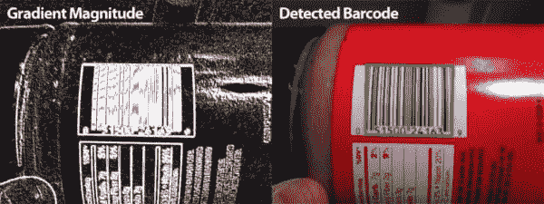](https://pyimagesearch.com/wp-content/uploads/2014/11/barcode_gradient_and_detection.jpg)

**更新:**这篇帖子的介绍可能看起来有点“扎眼”。出于某些背景，在写这篇文章之前，我刚刚看完了*南方公园黑色星期五集*，所以我肯定有一些关于僵尸购物者、黑色星期五混乱和*权力的游戏*的灵感。

* * *

黑色星期五要来了。

成群愤怒的购物者。中西部的中年妇女蜂拥而至，她们的牙齿掉光了，在当地的沃尔玛，最新一季的《权力的游戏》打了 75 折。

他们会在感恩节午夜在沃尔玛门口排队。他们会聚集起来，用手和头敲打锁着的门，直到他们的身体血肉模糊，就像 28 天后的僵尸一样。但他们渴望的不是人肉，而是琐碎的消费食物。他们关于打折和销售的呐喊将会响彻云霄。他们雷鸣般的脚步声会在大平原上引起地震。

当然，媒体不会帮忙——他们会大肆渲染每一个细节。从冻伤的家庭在酷寒中整夜露营，到愤怒的讨价还价的猎人开门时践踏的小老太太，类似于《侏罗纪公园》中的加利米穆斯踩踏事件。所有这一切仅仅是因为她想为她 9 岁的小孙子 Timmy 购买最新的 Halo 游戏，他的父母去年这个时候去世了。在沃尔玛。在黑色星期五期间。

我不得不问，这些混乱和混乱值得吗？

***地狱。**号*

这个黑色星期五，我将(安全地)在笔记本电脑屏幕后购物，可能会喝一杯咖啡，吃一把泰诺，来缓解前一天晚上的宿醉。

但是，如果你决定冒险进入现实世界，勇敢面对捡便宜货的人， ***你会想先下载这篇博文的源代码……***

想象一下，你会觉得自己有多傻，排队等着结账，只是为了扫描最新一季《权力的游戏》的条形码，却发现 Target 只便宜了 5 美元？

在这篇博文的剩余部分，我将向你展示如何只使用 Python 和 OpenCV 来检测图像中的条形码。

## 使用 Python 和 OpenCV 检测图像中的条形码

这篇博文的目的是演示使用计算机视觉和图像处理技术实现条形码检测的基本方法。我的算法实现最初松散地基于这个 StackOverflow 问题。我检查了代码，并对原始算法进行了一些更新和改进。

值得注意的是，这种算法并不适用于所有的条形码，但它会给你一个基本的直觉，告诉你应该应用什么类型的技术。

对于本例，我们将检测下图中的条形码:

[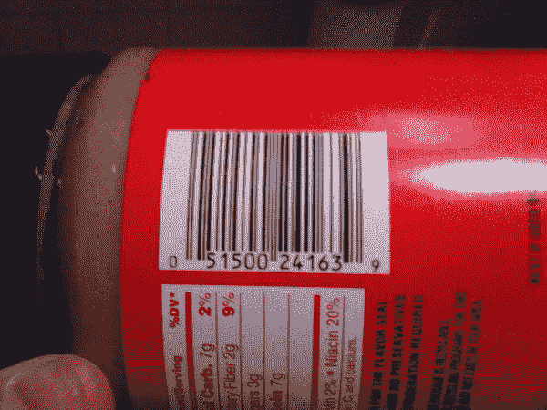](https://pyimagesearch.com/wp-content/uploads/2014/11/barcode_01.jpg)

**Figure 1:** Example image containing a barcode that we want to detect.

让我们开始写一些代码。打开一个新文件，命名为`detect_barcode.py`，让我们开始编码:

```py
# import the necessary packages
import numpy as np
import argparse
import imutils
import cv2

# construct the argument parse and parse the arguments
ap = argparse.ArgumentParser()
ap.add_argument("-i", "--image", required = True,
	help = "path to the image file")
args = vars(ap.parse_args())

```

我们要做的第一件事是导入我们需要的包。我们将利用 NumPy 进行数值处理，利用`argparse`解析[命令行参数](https://pyimagesearch.com/2018/03/12/python-argparse-command-line-arguments/)，利用`cv2`进行 OpenCV 绑定。

然后我们将设置我们的命令行参数。这里我们只需要一个开关，`--image`，它是包含我们想要检测的条形码的图像的路径。

现在，是时候进行一些实际的图像处理了:

```py
# load the image and convert it to grayscale
image = cv2.imread(args["image"])
gray = cv2.cvtColor(image, cv2.COLOR_BGR2GRAY)

# compute the Scharr gradient magnitude representation of the images
# in both the x and y direction using OpenCV 2.4
ddepth = cv2.cv.CV_32F if imutils.is_cv2() else cv2.CV_32F
gradX = cv2.Sobel(gray, ddepth=ddepth, dx=1, dy=0, ksize=-1)
gradY = cv2.Sobel(gray, ddepth=ddepth, dx=0, dy=1, ksize=-1)

# subtract the y-gradient from the x-gradient
gradient = cv2.subtract(gradX, gradY)
gradient = cv2.convertScaleAbs(gradient)

```

在第 14 行和第 15 行上，我们从磁盘上加载`image`并将其转换成灰度。

然后，我们使用 Scharr 算子(使用`ksize = -1`指定)在**行 19-21** 上构建灰度图像在水平和垂直方向上的梯度幅度表示。

从那里，我们从第 24 和 25 行**上的*x*-Scharr 算子的梯度中减去 Scharr 算子的*y*-梯度。通过执行这种减法，我们得到了具有高水平梯度和低垂直梯度的图像区域。**

我们上面的原始图像看起来像:

[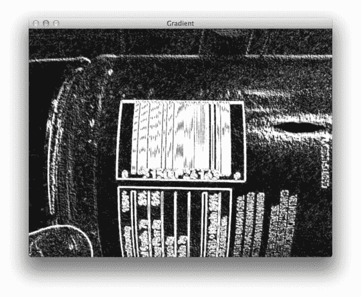](https://pyimagesearch.com/wp-content/uploads/2014/11/barcode_gradient.jpg)

**Figure 2:** The gradient representation of our barcode image.

**注意我们的梯度操作是如何检测到图像的条形码区域的。**接下来的步骤是滤除图像中的噪声，只关注条形码区域。

```py
# blur and threshold the image
blurred = cv2.blur(gradient, (9, 9))
(_, thresh) = cv2.threshold(blurred, 225, 255, cv2.THRESH_BINARY)

```

我们要做的第一件事是使用一个 *9 x 9* 内核将第 28 行**的平均模糊应用到渐变图像上。这将有助于消除图像的梯度表示中的高频噪声。**

然后我们将对第 29 行上的模糊图像进行阈值处理。渐变图像中不大于 225 的任何像素都被设置为 0(黑色)。否则，像素设置为 255(白色)。

模糊和阈值处理的输出如下所示:

[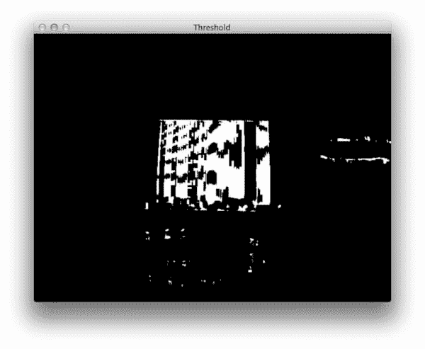](https://pyimagesearch.com/wp-content/uploads/2014/11/barcode_threhsold.jpg)

**Figure 3:** Thresholding the gradient image to obtain a rough approximation to the rectangular barcode region.

然而，正如您在上面的阈值图像中看到的，*条形码的垂直条之间有间隙。*为了填补这些空白，并使我们的算法更容易检测条形码的“斑点”状区域，我们需要执行一些基本的形态学操作:

```py
# construct a closing kernel and apply it to the thresholded image
kernel = cv2.getStructuringElement(cv2.MORPH_RECT, (21, 7))
closed = cv2.morphologyEx(thresh, cv2.MORPH_CLOSE, kernel)

```

我们将从使用第 32 行的第**行的`cv2.getStructuringElement`构建一个矩形内核开始。这个内核的宽度大于高度，因此允许我们闭合条形码的垂直条纹之间的间隙。**

然后，我们对第 33 行**执行我们的形态学操作，将我们的内核应用于我们的阈值图像，从而试图闭合条之间的间隙。**

现在，您可以看到，与上面的阈值图像相比，这些间隙更加紧密:

[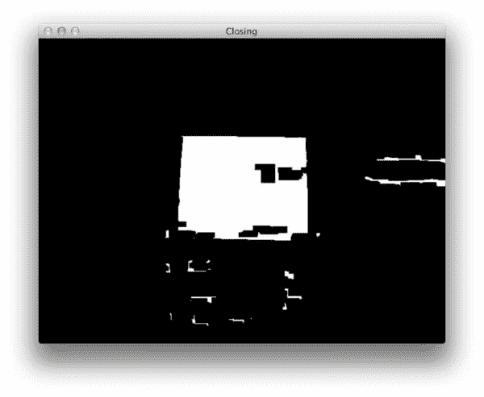](https://pyimagesearch.com/wp-content/uploads/2014/11/barcode_closing.jpg)

**Figure 4:** Applying closing morphological operations to close the gap between barcode stripes.

当然，现在我们在图像中有小斑点，它们不是实际条形码的一部分，但可能会干扰我们的轮廓检测。

让我们继续尝试移除这些小斑点:

```py
# perform a series of erosions and dilations
closed = cv2.erode(closed, None, iterations = 4)
closed = cv2.dilate(closed, None, iterations = 4)

```

我们在这里所做的就是执行 4 次腐蚀迭代，然后是 4 次膨胀迭代。侵蚀将“侵蚀”图像中的白色像素，从而移除小斑点，而膨胀将“扩张”剩余的白色像素，并使白色区域重新生长出来。

假如这些小斑点在侵蚀过程中被去除，它们将不会在扩张过程中再次出现。

经过一系列腐蚀和扩张后，您可以看到小斑点已被成功移除，剩下的是条形码区域:

[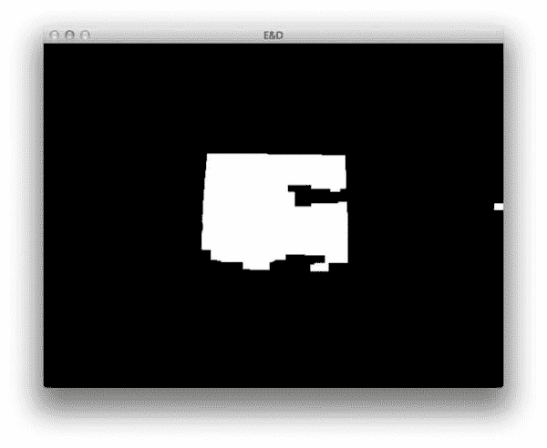](https://pyimagesearch.com/wp-content/uploads/2014/11/barcode_erosion_and_dilation.jpg)

**Figure 5:** Removing small, irrelevant blobs by applying a series of erosions and dilations.

最后，让我们找到图像条形码区域的轮廓:

```py
# find the contours in the thresholded image, then sort the contours
# by their area, keeping only the largest one
cnts = cv2.findContours(closed.copy(), cv2.RETR_EXTERNAL,
	cv2.CHAIN_APPROX_SIMPLE)
cnts = imutils.grab_contours(cnts)
c = sorted(cnts, key = cv2.contourArea, reverse = True)[0]

# compute the rotated bounding box of the largest contour
rect = cv2.minAreaRect(c)
box = cv2.cv.BoxPoints(rect) if imutils.is_cv2() else cv2.boxPoints(rect)
box = np.int0(box)

# draw a bounding box arounded the detected barcode and display the
# image
cv2.drawContours(image, [box], -1, (0, 255, 0), 3)
cv2.imshow("Image", image)
cv2.waitKey(0)

```

幸运的是，这是最简单的部分。在**行 41-44** 上，我们简单地找到图像中的最大轮廓，如果我们正确地完成了图像处理步骤，该轮廓应该对应于条形码区域。

然后我们确定第 47-49 行**上最大轮廓的最小边界框，最后在第 53-55** 行**上显示检测到的条形码。**

如下图所示，我们已成功检测到条形码:

[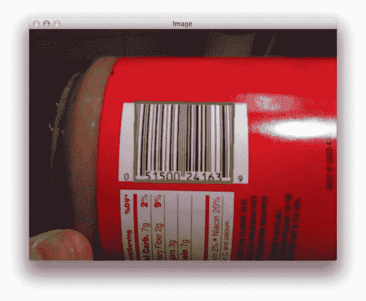](https://pyimagesearch.com/wp-content/uploads/2014/11/barcode_results_01.jpg)

**Figure 6:** Successfully detecting the barcode in our example image.

在下一部分，我们将尝试更多的图片。

### 成功的条形码检测

要了解这些结果，请使用本文底部的表格下载这篇博文的源代码和附带的图片。

努力运行这一部分的代码？看看我的[命令行参数](https://pyimagesearch.com/2018/03/12/python-argparse-command-line-arguments/)博文。

获得代码和图像后，打开终端并执行以下命令:

```py
$ python detect_barcode.py --image images/barcode_02.jpg

```

[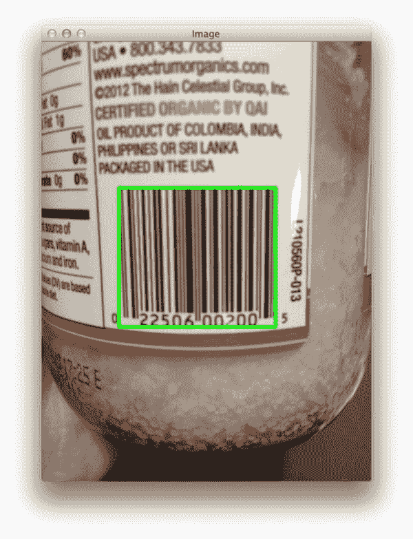](https://pyimagesearch.com/wp-content/uploads/2014/11/barcode_results_02.jpg)

**Figure 7:** Using OpenCV to detect a barcode in an image.

检测那罐椰子油上的条形码没问题！

让我们尝试另一个图像:

```py
$ python detect_barcode.py --image images/barcode_03.jpg

```

[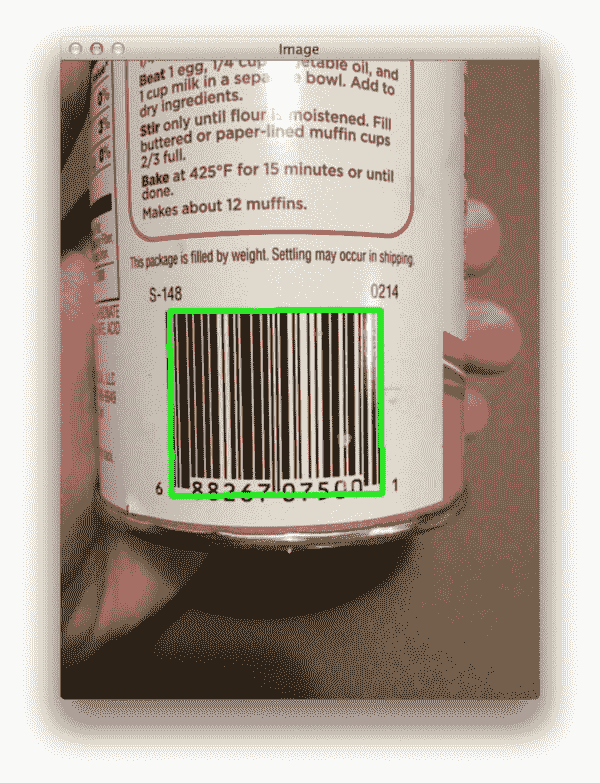](https://pyimagesearch.com/wp-content/uploads/2014/11/barcode_results_03.jpg)

**Figure 8:** Using computer vision to detect a barcode in an image.

我们也能在那张图片中找到条形码！

食品已经够多了，那么书上的条形码呢:

```py
$ python detect_barcode.py --image images/barcode_04.jpg

```

[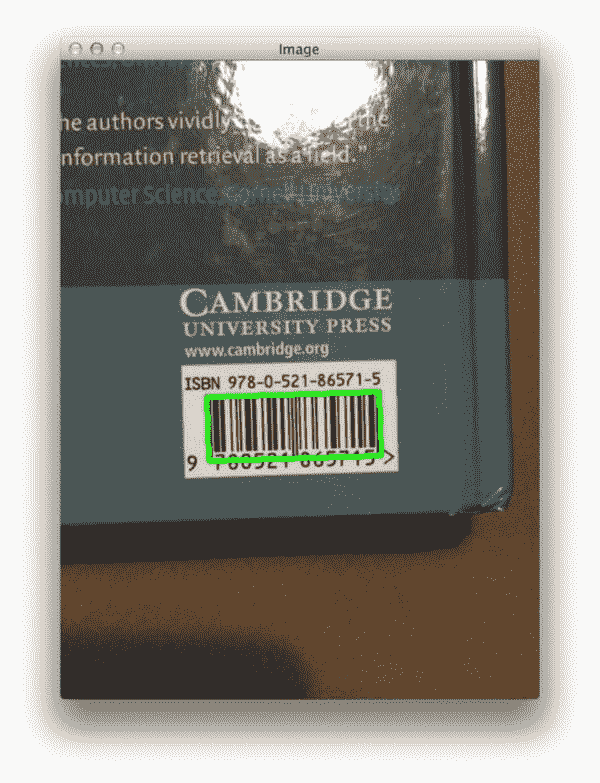](https://pyimagesearch.com/wp-content/uploads/2014/11/barcode_results_04.jpg)

**Figure 9:** Detecting a barcode on a book using Python and OpenCV.

再说一遍，没问题！

包裹上的追踪代码怎么样？

```py
$ python detect_barcode.py --image images/barcode_05.jpg

```

[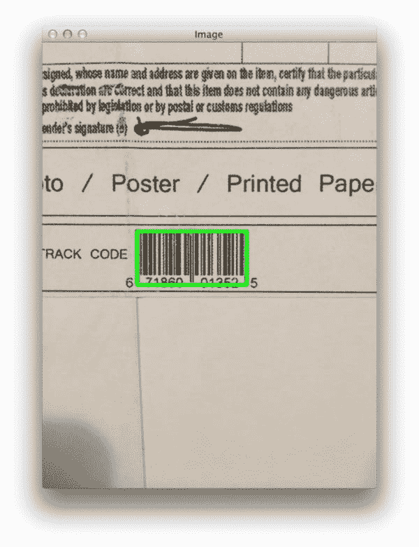](https://pyimagesearch.com/wp-content/uploads/2014/11/barcode_results_05.jpg)

**Figure 10:** Detecting the barcode on a package using computer vision and image processing.

同样，我们的算法能够成功检测条形码。

最后，让我们再看一张图片，这是我最喜欢的面酱，饶自制的伏特加酱:

```py
$ python detect_barcode.py --image images/barcode_06.jpg

```

[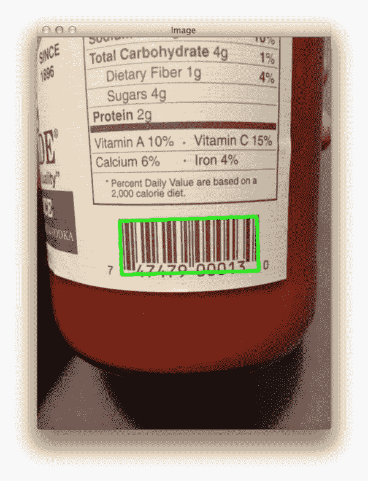](https://pyimagesearch.com/wp-content/uploads/2014/11/barcode_results_06.jpg)

**Figure 11:** Barcode detection is easy using Python and OpenCV!

我们又一次检测到了条形码！

## 摘要

在这篇博文中，我们回顾了使用计算机视觉技术检测图像中条形码的必要步骤。我们使用 Python 编程语言和 OpenCV 库实现了我们的算法。

该算法的一般概要是:

1.  计算在 *x* 和 *y* 方向上的沙尔梯度幅度表示。
2.  从 *x* 梯度中减去 *y* 梯度，以显示条形码区域。
3.  模糊和阈值的图像。
4.  对阈值化图像应用关闭内核。
5.  进行一系列的扩张和侵蚀。
6.  找到图像中最大的轮廓，现在大概就是条形码。

重要的是要注意，由于这种方法对图像的梯度表示进行了假设，因此只适用于水平条形码。

如果您想要实现更强大的条形码检测算法，您需要考虑图像的方向，或者更好的是，应用机器学习技术，如 Haar 级联或 HOG +线性 SVM 来“扫描”图像中的条形码区域。