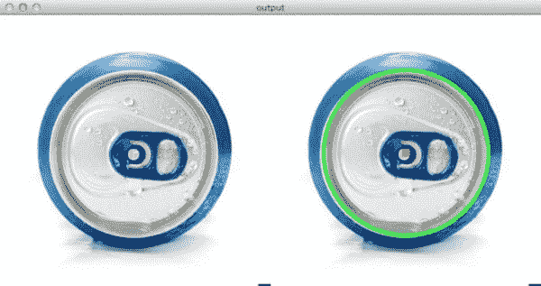
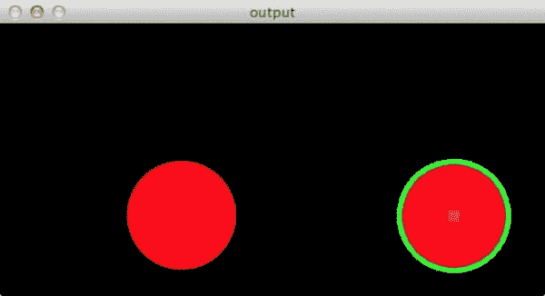
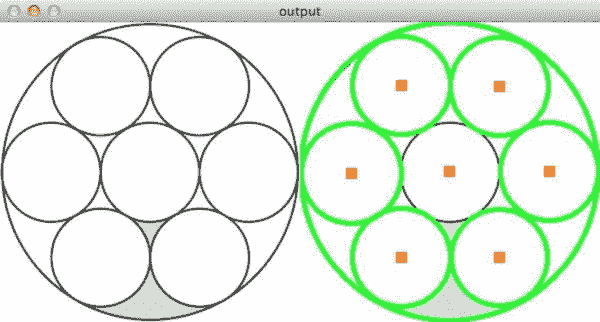

# 利用 OpenCV 和 Hough 圆检测图像中的圆

> 原文：<https://pyimagesearch.com/2014/07/21/detecting-circles-images-using-opencv-hough-circles/>

[](https://pyimagesearch.com/wp-content/uploads/2014/07/detect_circles_soda.jpg)

几天前，我收到了一封来自 PyImageSearch 读者的邮件，询问关于圆检测的问题。要点见下文:

> 嘿阿德里安，
> 
> 喜欢你的博客。我看到了你关于[检测图像中的矩形/正方形](https://pyimagesearch.com/2014/04/21/building-pokedex-python-finding-game-boy-screen-step-4-6/)的帖子，但是我想知道，你如何使用 OpenCV 检测图像中的圆形？
> 
> 谢了。

问得好。

您可能已经发现，使用 OpenCV 检测图像中的圆形比检测其他具有尖锐边缘的形状要困难得多。

但是不用担心！

在这篇博文中，我将向你展示如何使用 OpenCV 利用`cv2.HoughCircles`函数来检测图像中的圆形。

**要学习如何用 OpenCV 检测圆，*继续阅读！***

# cv2。霍夫圆函数

为了检测图像中的圆圈，您需要使用`cv2.HoughCircles`功能。这肯定不是最容易使用的功能，但只要稍加解释，我想你就会掌握它的窍门。

看看下面的函数签名:

```py
cv2.HoughCircles(image, method, dp, minDist)

```

*   **`image` :** 8 位，单通道图像。如果使用彩色图像，请先转换为灰度图像。
*   **`method` :** 定义检测图像中圆圈的方法。目前唯一实现的方法是`cv2.HOUGH_GRADIENT`，对应于[袁等人](http://www.bmva.org/bmvc/1989/avc-89-029.pdf)的论文。
*   **`dp` :** 该参数是累加器分辨率与图像分辨率的反比(详见 Yuen 等)。实际上，`dp`越大，累加器数组就越小。
*   **`minDist` :** 被检测圆的圆心 *(x，y)* 坐标间的最小距离。如果`minDist`太小，可能会(错误地)检测到与原始圆在同一邻域的多个圆。如果`minDist`太大，那么一些圆圈可能根本检测不到。
*   **`param1`:**Yuen 等人方法中用于处理边缘检测的梯度值。
*   **`param2` :** 为`cv2.HOUGH_GRADIENT`方法的累加器阈值。阈值越小，检测到的圆越多(包括假圆)。阈值越大，可能返回的圆就越多。
*   **`minRadius` :** 半径的最小尺寸(像素)。
*   **`maxRadius` :** 半径的最大值(以像素为单位)。

如果这个方法看起来很复杂，不要担心。其实也不算太差。

但是我要说的是——准备好从一个图像到另一个图像调整参数值。`minDist`参数对于正确使用尤其重要。没有一个最佳的`minDist`值，您可能会错过一些圆，或者您可能会检测到许多错误的圆。

# 利用 OpenCV 和 Hough 圆检测图像中的圆

准备好应用`cv2.HoughCircles`功能来检测图像中的圆形了吗？

太好了。让我们跳到一些代码中:

```py
# import the necessary packages
import numpy as np
import argparse
import cv2

# construct the argument parser and parse the arguments
ap = argparse.ArgumentParser()
ap.add_argument("-i", "--image", required = True, help = "Path to the image")
args = vars(ap.parse_args())

```

**第 2-4 行**导入我们需要的必要包。我们将利用 NumPy 进行数值处理，`argparse`用于解析命令行参数，而`cv2`用于 OpenCV 绑定。

然后，在**第 7-9 行**我们解析我们的命令行参数。我们只需要一个开关，`--image`，它是我们想要检测圆圈的图像的路径。

让我们继续加载图像:

```py
# load the image, clone it for output, and then convert it to grayscale
image = cv2.imread(args["image"])
output = image.copy()
gray = cv2.cvtColor(image, cv2.COLOR_BGR2GRAY)

```

我们在第 12 行**处从磁盘上下载我们的图像，并在第 13** 行**处创建它的副本，这样我们就可以在不破坏原始图像的情况下绘制我们检测到的圆。**

正如我们将看到的，`cv2.HoughCircles`功能需要一个 8 位的单通道图像，所以我们将在**第 14 行**上从 RGB 颜色空间转换为灰度。

好了，该检测圆圈了:

```py
# detect circles in the image
circles = cv2.HoughCircles(gray, cv2.HOUGH_GRADIENT, 1.2, 100)

# ensure at least some circles were found
if circles is not None:
	# convert the (x, y) coordinates and radius of the circles to integers
	circles = np.round(circles[0, :]).astype("int")

	# loop over the (x, y) coordinates and radius of the circles
	for (x, y, r) in circles:
		# draw the circle in the output image, then draw a rectangle
		# corresponding to the center of the circle
		cv2.circle(output, (x, y), r, (0, 255, 0), 4)
		cv2.rectangle(output, (x - 5, y - 5), (x + 5, y + 5), (0, 128, 255), -1)

	# show the output image
	cv2.imshow("output", np.hstack([image, output]))
	cv2.waitKey(0)

```

圆的检测由**线 17** 上的`cv2.HoughCircles`功能处理。我们传入想要检测圆的图像作为第一个参数，圆检测方法作为第二个参数(目前，`cv2.cv.HOUGH_GRADIENT`方法是 OpenCV 支持的唯一圆检测方法，并且在一段时间内很可能是唯一的方法)，累加器值 1.5 作为第三个参数，最后是 100 像素的`minDist`。

对第 20 行**进行检查，以确保在图像中至少找到一个圆。**

然后，第 22 行处理将我们的圆从浮点 *(x，y)* 坐标转换成整数，允许我们在输出图像上绘制它们。

从那里，我们开始在中心 *(x，y)* 坐标和**线 25** 上的圆的半径上循环。

我们使用`cv2.circle`函数在**线 28** 上绘制实际检测到的圆，然后在**线 29** 上的圆的中心绘制一个矩形。

最后，**行 32 和 33** 显示我们的输出图像。

现在你有了——使用 OpenCV 检测图像中的圆。

但是让我们来看看一些结果。

启动一个 shell，并执行以下命令:

```py
$ python detect_circles.py --image images/simple.png

```

我们从简单的东西开始，检测黑色背景上的红色圆圈:

[](https://pyimagesearch.com/wp-content/uploads/2014/07/detect_circles_simple.jpg)

**Figure 1:** Detecting a simple circle in an image using OpenCV.

还不错！我们的 Python 脚本检测到了红色的圆圈，用绿色勾勒出它的轮廓，然后在它的中心放置一个橙色的正方形。

让我们转到别的事情上来:

```py
$ python detect_circles.py --image images/soda.png

```

[](https://pyimagesearch.com/wp-content/uploads/2014/07/detect_circles_soda.jpg)

**Figure 2:** Detecting the top of a soda can using circle detection with OpenCV.

同样，我们的 Python 脚本能够检测罐子的圆形区域。

现在，让我们来试试 8 圈问题。

在这个问题中，我们有*一个*大圆，接着是*七个*大圆。

由于这是一个比之前小得多的图像(我们正在检测多个圆圈)，我将调整`minDist`为 75 像素而不是 100 像素。

[](https://pyimagesearch.com/wp-content/uploads/2014/07/detect_circles_8circles.jpg)

**Figure 3:** Notice how `cv2.HoughCircles` failed to detect the inner-most circle.

嗯。现在看来，我们遇到了一个问题。

`cv2.HoughCircles`功能只能检测到圆圈中的*七个*，而不是所有的*八个*，忽略了中心的一个。

为什么会这样？

这是由于`minDist`参数。大外圆的中心 *(x，y)* 坐标与中心内圆相同，因此中心内圆被丢弃。

不幸的是，除非我们将`minDist`做得不合理的小，并因此产生许多“错误的”圆检测，否则没有办法解决这个问题。

# 摘要

在这篇博文中，我展示了如何使用 OpenCV 中的`cv2.HoughCircles`函数来检测图像中的圆形。

与检测图像中的正方形或矩形不同，检测圆形要困难得多，因为我们无法回答轮廓中大约有多少个点。

为了帮助我们检测图像中的圆形，OpenCV 提供了`cv2.HoughCircles`函数。

虽然`cv2.HoughCircles`方法初看起来可能很复杂，但我认为最重要的参数是`minDist`，或者检测圆的中心 *(x，y)* 坐标之间的最小距离。

如果将`minDist`设置得太小，最终可能会出现许多错误检测到的圆圈。另一方面，如果`minDist`太大，那么你可能会错过一些圆。设置这个参数肯定需要一些微调。

# 有问题吗？

你有关于 OpenCV 和 Python 的问题吗？给我发个信息就行了。我会尽我所能在这个博客上回答这个问题。