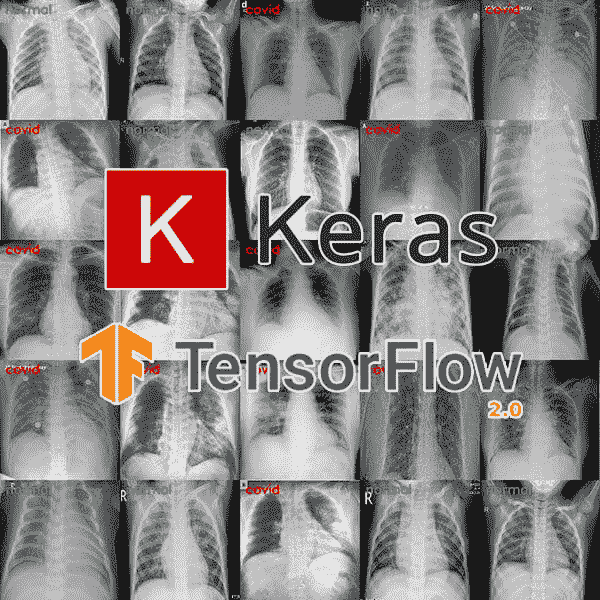
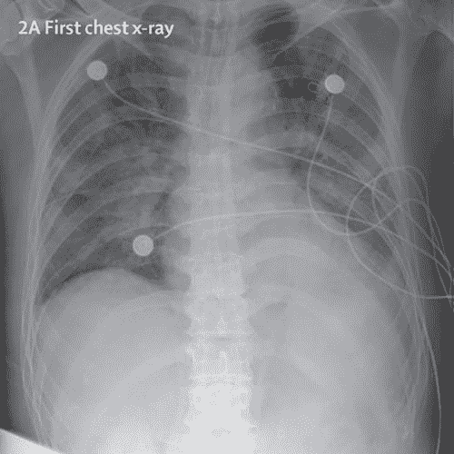
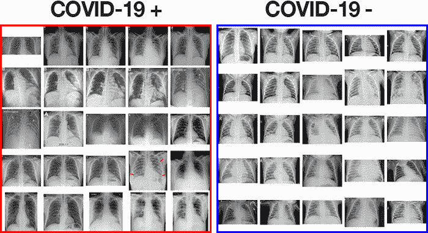
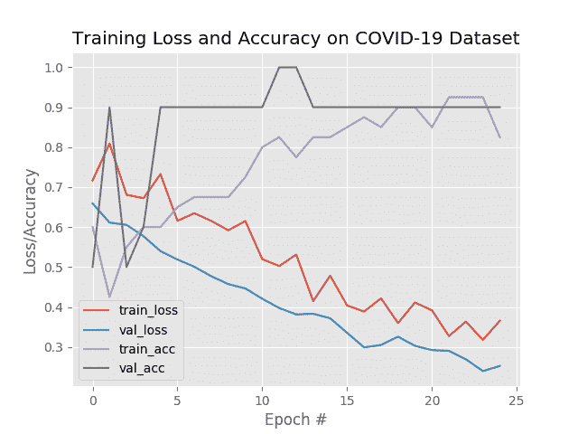
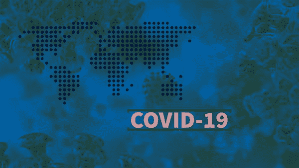

# 利用 Keras、TensorFlow 和深度学习检测 X 射线图像中的新冠肺炎

> 原文：<https://pyimagesearch.com/2020/03/16/detecting-covid-19-in-x-ray-images-with-keras-tensorflow-and-deep-learning/>



In this tutorial, you will learn how to automatically detect COVID-19 in a hand-created X-ray image dataset using Keras, TensorFlow, and Deep Learning.

像现在世界上大多数人一样，我真的很担心新冠肺炎。我发现自己不断地分析自己的健康状况，想知道自己是否/何时会感染。

我越担心它，它就越变成一场合法症状与疑病症相结合的痛苦心理游戏:

*   我今天早上醒来觉得有点疼，就倒下了。
*   当我从床上爬起来时，我注意到我在流鼻涕(尽管现在[报道](https://www.webmd.com/lung/news/20200310/know-the-symptoms-of-covid19)流鼻涕是*而不是*新冠肺炎的症状)。
*   当我去洗手间拿纸巾的时候，我也在咳嗽。

起初，我并没有把它放在心上 — 我对花粉过敏，而且由于美国东海岸的温暖天气，今年的春天来得很早。我的过敏症可能只是发作了。

但是我的症状一整天都没有改善。

实际上，我正坐在这里，嘴里含着温度计，写着这个教程。低头一看，我看到它的读数是华氏 99.4 度。

我的体温比大多数人都要低，通常在华氏 97.4 度左右。任何高于 99 F 的对我来说都是低烧。

咳嗽低烧？可能是新冠肺炎……也可能只是我过敏。

不经过测试是不可能知道的，而从人类的本能层面来看，“不知道”正是这种情况如此可怕的原因。

作为人类，没有什么比未知更可怕的了。

尽管我焦虑不安，但我试图用理性来消除它们。我 30 出头，身材很好，免疫系统很强。我会隔离自己(以防万一)，好好休息，度过难关 — 从我自己*个人*健康的角度来看，新冠肺炎并不会吓到我(至少我一直这么告诉自己)。

也就是说，我很担心我的年长亲戚，包括任何已经患有疾病的人，或者那些在疗养院或医院的人。他们很脆弱，看着他们因为新冠肺炎而离开真的是毁灭性的。

我没有无所事事，也没有让任何困扰我的事情让我沮丧(无论是过敏、新冠肺炎还是我自己的个人焦虑)，我决定做我最擅长的事情 — **通过** **专注于整个 CV/DL 社区，编写代码，进行实验，并教育其他人如何在实际的现实世界应用中使用计算机视觉和深度学习。**

说实话，这是我写过的最科学的文章。事实上，远非如此。所使用的方法和数据集将*而不是*值得出版。但是对于那些需要感觉自己在做*一些事情来帮助别人的人来说，它们是一个起点。*

我关心你，也关心这个社区。**我想尽我所能帮助——*这篇博客是我在精神上处理困难时期的一种方式，*，同时帮助处于类似情况的其他人。**

我希望你也这样认为。

在今天的教程中，您将学习如何:

1.  对新冠肺炎病毒检测呈阳性的患者的 X 射线图像的开源数据集进行采样
2.  来自健康患者的“正常”(即未感染)X 射线图像样本
3.  通过我们创建的数据集，训练 CNN 自动检测 X 射线图像中的新冠肺炎
4.  从教育的角度评估结果

***免责声明:**我已经暗示过这一点，但我将在这里明确地说出来。本文中使用的方法和技术仅用于教育目的。这不是科学严谨的研究，也不会发表在杂志上。这篇文章是为那些对(1)计算机视觉/深度学习感兴趣，并希望通过实用的动手方法学习，以及(2)受当前事件启发的读者写的。我恳请你如此对待它。*

**要了解如何使用 Keras、TensorFlow 和深度学习来检测 X 射线图像中的新冠肺炎，*请继续阅读！***

## 利用 Keras、TensorFlow 和深度学习检测 X 射线图像中的新冠肺炎

在本教程的第一部分，我们将讨论如何在病人的胸部 x 光片中检测出新冠肺炎。

从那里，我们将回顾我们的新冠肺炎胸部 x 光数据集。

然后，我将向您展示如何使用 Keras 和 TensorFlow 来训练深度学习模型，以预测我们图像数据集中的新冠肺炎。

### 放弃

这篇关于自动新冠肺炎检测的博文仅用于教育目的。它不是 T2 想要的可靠、高度精确的新冠肺炎诊断系统，也没有经过专业或学术审查。

我的目标只是启发你，让你看到学习计算机视觉/深度学习，然后将这些知识应用到医学领域，可以对世界产生巨大影响。

简单来说:**你不需要医学学位就可以在医学领域产生影响 —** 深度学习实践者与医生和医疗专业人士密切合作，可以解决复杂的问题，拯救生命，让世界变得更美好。

我希望这篇教程能启发你这样做。

但尽管如此，研究人员、期刊管理者和同行评审系统正被质量可疑的新冠肺炎预测模型所淹没。**请不要从这篇文章中提取代码/模型并提交给期刊或开放科学**——**你只会增加噪音。**

此外，如果你打算利用这篇文章(或你在网上找到的任何其他新冠肺炎文章)进行研究，确保你参考了关于报告预测模型的 [TRIPOD 指南。](https://www.equator-network.org/reporting-guidelines/tripod-statement/)

正如你可能意识到的，应用于医学领域的人工智能会产生非常真实的后果。如果您是医学专家，或者与医学专家有密切联系，请仅发布或部署此类模型。

### 如何在 x 光图像中发现新冠肺炎？

[](https://pyimagesearch.com/wp-content/uploads/2020/03/covid19_keras_xray_example.jpg)

**Figure 1:** Example of an X-ray image taken from a patient with a positive test for COVID-19\. Using X-ray images we can train a machine learning classifier to detect COVID-19 using Keras and TensorFlow.

新冠肺炎测试目前很难获得————[数量根本不够](https://www.usatoday.com/story/news/2020/03/11/coronavirus-covid-19-response-hurt-by-shortage-testing-components/5013586002/)而且生产速度也不够快，这引起了恐慌。

当出现恐慌时，就会有邪恶的人伺机利用他人，[即在](https://abc7news.com/5995593/)[在社交媒体平台和聊天应用程序上找到受害者后](https://www.edgeprop.my/content/1658343/covid-19-home-testing-kits-are-fake-medical-authority)出售假冒的新冠肺炎检测试剂盒。

鉴于新冠肺炎检测试剂盒有限，我们需要依靠其他诊断方法。

出于本教程的目的，我想探索 X 射线图像，因为医生经常使用 X 射线和 CT 扫描来诊断肺炎、肺部炎症、脓肿和/或肿大的淋巴结。

由于新冠肺炎攻击我们呼吸道的上皮细胞，我们可以使用 X 射线来分析患者肺部的健康状况。

鉴于几乎所有的医院都有 X 射线成像设备，使用 X 射线来检测新冠肺炎病毒*而不需要专用的检测工具*是可能的。

一个缺点是 X 射线分析需要放射学专家，并且花费大量时间——当世界各地的人们生病时，这些时间是宝贵的。**因此，需要开发一种自动化分析系统来节省医疗专业人员的宝贵时间。**

***注:*** *有更新的出版物提出 CT 扫描更适合诊断新冠肺炎，但我们在本教程中所要做的只是一个 X 射线图像数据集。第二，我不是医学专家，我认为除了专用的检测试剂盒之外，还有其他更可靠的方法可以让医生和医学专家检测新冠肺炎病毒。*

### 我们的新冠肺炎患者 X 射线图像数据集

[](https://pyimagesearch.com/wp-content/uploads/2020/03/covid19_keras_dataset.png)

**Figure 2:** CoronaVirus (COVID-19) chest X-ray image data. On the left we have positive (i.e., infected) X-ray images, whereas on the right we have negative samples. These images are used to train a deep learning model with TensorFlow and Keras to automatically predict whether a patient has COVID-19 (i.e., coronavirus).

我们将在本教程中使用的新冠肺炎 X 射线图像数据集由蒙特利尔大学的博士后 Joseph Cohen 博士管理。

一周前，科恩博士开始收集新冠肺炎病例的 x 光图像，并在 GitHub repo 之后的[中发表。](https://github.com/ieee8023/covid-chestxray-dataset)

在回购中，你会发现新冠肺炎病例的例子，以及中东呼吸综合征，非典和急性呼吸窘迫综合征。

为了创建本教程的新冠肺炎 X 射线图像数据集，我:

1.  解析了在科恩博士的知识库中找到的`metadata.csv`文件。
2.  选择所有符合以下条件的行:
    1.  新冠肺炎阳性(即忽略 MERS、SARS 和 ARDS 病例)。
    2.  肺的后前(PA)视图。我使用 PA 视图，据我所知，这是用于我的“健康”案例的视图，如下所述；然而，我确信如果我说错了(我很可能是错的，这只是一个例子)，医学专家将会澄清并纠正我。

总共，这给我留下了 25 张阳性新冠肺炎病例的 x 光照片。

**下一步是采集健康的患者的 x 光图像样本。**

为此，我使用了 [Kaggle 的胸部 x 光图像(肺炎)数据集](https://www.kaggle.com/paultimothymooney/chest-xray-pneumonia)，并从健康患者 ( **图 2** ，*右*)中采样了**的 25 张 x 光图像。Kaggle 的胸部 X 射线数据集有许多问题，即噪音/错误的标签，但它是这种概念验证新冠肺炎探测器的一个足够好的起点。**

在收集了我的数据集之后，我剩下了总共 **50 张图像**，其中 25 张是新冠肺炎阳性 x 光图像，25 张是健康患者 x 光图像。

**我已经在本教程的*“下载”*部分包含了我的样本数据集，所以您不必重新创建它。**

此外，我还在下载中包含了用于生成数据集的 Python 脚本，但这些脚本不在本文讨论范围之内，因此不在本教程中讨论。

### 项目结构

继续从本教程的 ***“下载”*** 部分获取今天的代码和数据。从那里，提取文件，您将看到以下目录结构:

```py
$ tree --dirsfirst --filelimit 10
.
├── dataset
│   ├── covid [25 entries]
│   └── normal [25 entries]
├── build_covid_dataset.py
├── sample_kaggle_dataset.py
├── train_covid19.py
├── plot.png
└── covid19.model

3 directories, 5 files
```

我们的冠状病毒(新冠肺炎)胸部 x 光数据在`dataset/`目录中，我们的两类数据被分为`covid/`和`normal/`。

我的两个数据集构建脚本都提供了；但是，我们今天不会复习它们。

相反，我们将回顾训练我们的新冠肺炎探测器的`train_covid19.py`脚本。

让我们开始工作吧！

### 使用 Keras 和 TensorFlow 实现我们的新冠肺炎培训脚本

现在，我们已经查看了我们的图像数据集以及我们项目的相应目录结构，让我们继续微调卷积神经网络，以使用 Keras、TensorFlow 和深度学习自动诊断新冠肺炎。

打开目录结构中的`train_covid19.py`文件，插入以下代码:

```py
# import the necessary packages
from tensorflow.keras.preprocessing.image import ImageDataGenerator
from tensorflow.keras.applications import VGG16
from tensorflow.keras.layers import AveragePooling2D
from tensorflow.keras.layers import Dropout
from tensorflow.keras.layers import Flatten
from tensorflow.keras.layers import Dense
from tensorflow.keras.layers import Input
from tensorflow.keras.models import Model
from tensorflow.keras.optimizers import Adam
from tensorflow.keras.utils import to_categorical
from sklearn.preprocessing import LabelBinarizer
from sklearn.model_selection import train_test_split
from sklearn.metrics import classification_report
from sklearn.metrics import confusion_matrix
from imutils import paths
import matplotlib.pyplot as plt
import numpy as np
import argparse
import cv2
import os
```

该脚本通过选择`tensorflow.keras`导入来利用 TensorFlow 2.0 和 Keras 深度学习库。

此外，我们使用 [scikit-learn](https://scikit-learn.org/stable/) 、*事实上的* Python 库用于机器学习、 [matplotlib](https://matplotlib.org) 用于绘图，以及 [OpenCV](https://opencv.org) 用于加载和预处理数据集中的图像。

要了解如何安装 TensorFlow 2.0(包括相关的 scikit-learn、OpenCV 和 matplotlib 库)，只需遵循我的 [Ubuntu](https://pyimagesearch.com/2019/12/09/how-to-install-tensorflow-2-0-on-ubuntu/) 或 [macOS](https://pyimagesearch.com/2019/12/09/how-to-install-tensorflow-2-0-on-macos/) 指南。

导入完成后，接下来我们将解析命令行参数并初始化超参数:

```py
# construct the argument parser and parse the arguments
ap = argparse.ArgumentParser()
ap.add_argument("-d", "--dataset", required=True,
	help="path to input dataset")
ap.add_argument("-p", "--plot", type=str, default="plot.png",
	help="path to output loss/accuracy plot")
ap.add_argument("-m", "--model", type=str, default="covid19.model",
	help="path to output loss/accuracy plot")
args = vars(ap.parse_args())

# initialize the initial learning rate, number of epochs to train for,
# and batch size
INIT_LR = 1e-3
EPOCHS = 25
BS = 8
```

我们的三个[命令行参数](https://pyimagesearch.com/2018/03/12/python-argparse-command-line-arguments/) ( **第 24-31 行**)包括:

*   `--dataset`:胸部 x 光图像输入数据集的路径。
*   `--plot`:输出训练历史图的可选路径。默认情况下，该图被命名为`plot.png`，除非命令行另有规定。
*   `--model`:我们输出新冠肺炎模型的可选路径；默认情况下，它将被命名为`covid19.model`。

从那里，我们初始化我们的初始学习率、训练时期数和批量超参数(**第 35-37 行**)。

我们现在准备加载和预处理 X 射线数据:

```py
# grab the list of images in our dataset directory, then initialize
# the list of data (i.e., images) and class images
print("[INFO] loading images...")
imagePaths = list(paths.list_images(args["dataset"]))
data = []
labels = []

# loop over the image paths
for imagePath in imagePaths:
	# extract the class label from the filename
	label = imagePath.split(os.path.sep)[-2]

	# load the image, swap color channels, and resize it to be a fixed
	# 224x224 pixels while ignoring aspect ratio
	image = cv2.imread(imagePath)
	image = cv2.cvtColor(image, cv2.COLOR_BGR2RGB)
	image = cv2.resize(image, (224, 224))

	# update the data and labels lists, respectively
	data.append(image)
	labels.append(label)

# convert the data and labels to NumPy arrays while scaling the pixel
# intensities to the range [0, 1]
data = np.array(data) / 255.0
labels = np.array(labels)
```

为了加载我们的数据，我们在`--dataset`目录中获取图像的所有路径(**行 42** )。然后，对于每个`imagePath`，我们:

*   从路径(**行 49** )中提取类`label`(或者`covid`或者`normal`)。
*   加载`image` ，并通过转换为 RGB 通道排序对其进行预处理，并将其调整为 *224×224* 像素，以便为我们的卷积神经网络做好准备( **行 53-55** )。
*   更新我们的`data` 和 `labels` 列表分别( **第 58 行和第 59 行** )。

然后，我们将像素强度缩放到范围*【0，1】*，并将我们的`data`和`labels`转换为 NumPy 数组格式(**第 63 行和第 64 行**)。

接下来，我们将对`labels`进行一次性编码，并创建我们的培训/测试分割:

```py
# perform one-hot encoding on the labels
lb = LabelBinarizer()
labels = lb.fit_transform(labels)
labels = to_categorical(labels)

# partition the data into training and testing splits using 80% of
# the data for training and the remaining 20% for testing
(trainX, testX, trainY, testY) = train_test_split(data, labels,
	test_size=0.20, stratify=labels, random_state=42)

# initialize the training data augmentation object
trainAug = ImageDataGenerator(
	rotation_range=15,
	fill_mode="nearest")
```

`labels`的一次性编码发生在**的第 67-69 行**，这意味着我们的数据将采用以下格式:

```py
[[0\. 1.]
 [0\. 1.]
 [0\. 1.]
 ...
 [1\. 0.]
 [1\. 0.]
 [1\. 0.]]
```

每个编码标签由两个元素的数组组成，其中一个元素是“热”(即`1`)而不是“非”(即`0`)。

**第 73 行和第 74 行**然后构建我们的数据分割，保留 80%的数据用于训练，20%用于测试。

为了确保我们的模型一般化，我们通过将随机图像旋转设置为顺时针或逆时针 15 度来执行[数据扩充](https://pyimagesearch.com/2019/07/08/keras-imagedatagenerator-and-data-augmentation/)。

**第 77-79 行**初始化数据扩充生成器对象。

从这里，我们将初始化我们的 VGGNet 模型，并为[微调](https://pyimagesearch.com/2019/06/03/fine-tuning-with-keras-and-deep-learning/)设置它:

```py
# load the VGG16 network, ensuring the head FC layer sets are left
# off
baseModel = VGG16(weights="imagenet", include_top=False,
	input_tensor=Input(shape=(224, 224, 3)))

# construct the head of the model that will be placed on top of the
# the base model
headModel = baseModel.output
headModel = AveragePooling2D(pool_size=(4, 4))(headModel)
headModel = Flatten(name="flatten")(headModel)
headModel = Dense(64, activation="relu")(headModel)
headModel = Dropout(0.5)(headModel)
headModel = Dense(2, activation="softmax")(headModel)

# place the head FC model on top of the base model (this will become
# the actual model we will train)
model = Model(inputs=baseModel.input, outputs=headModel)

# loop over all layers in the base model and freeze them so they will
# *not* be updated during the first training process
for layer in baseModel.layers:
	layer.trainable = False
```

**第 83 行和第 84 行**用 ImageNet 上预先训练的权重实例化 VGG16 网络，去掉了 FC 层头。

从那里，我们构建一个新的全连接层头，它由`POOL => FC = SOFTMAX`层(**行 88-93** )组成，并将其附加到 VGG16 ( **行 97** )的顶部。

然后我们冻结 VGG16 的`CONV`权重，这样*只有*层头会被训练(**第 101-102 行**)；这就完成了我们的微调设置。

我们现在准备编译和训练我们的新冠肺炎(冠状病毒)深度学习模型:

```py
# compile our model
print("[INFO] compiling model...")
opt = Adam(lr=INIT_LR, decay=INIT_LR / EPOCHS)
model.compile(loss="binary_crossentropy", optimizer=opt,
	metrics=["accuracy"])

# train the head of the network
print("[INFO] training head...")
H = model.fit_generator(
	trainAug.flow(trainX, trainY, batch_size=BS),
	steps_per_epoch=len(trainX) // BS,
	validation_data=(testX, testY),
	validation_steps=len(testX) // BS,
	epochs=EPOCHS)
```

**第 106-108 行**用[学习速率衰减](https://pyimagesearch.com/2019/07/22/keras-learning-rate-schedules-and-decay/)和`Adam`优化器编译网络。鉴于这是一个 2 类问题，我们使用`"binary_crossentropy"`损失而不是分类交叉熵。

为了启动我们的新冠肺炎神经网络训练过程，我们调用了 [Keras 的 fit_generator 方法，](https://pyimagesearch.com/2018/12/24/how-to-use-keras-fit-and-fit_generator-a-hands-on-tutorial/)，同时通过我们的数据增强对象(**第 112-117 行**)传入我们的胸部 X 射线数据。

接下来，我们将评估我们的模型:

```py
# make predictions on the testing set
print("[INFO] evaluating network...")
predIdxs = model.predict(testX, batch_size=BS)

# for each image in the testing set we need to find the index of the
# label with corresponding largest predicted probability
predIdxs = np.argmax(predIdxs, axis=1)

# show a nicely formatted classification report
print(classification_report(testY.argmax(axis=1), predIdxs,
	target_names=lb.classes_))
```

为了进行评估，我们首先对测试集进行预测，并获取预测指数(**第 121-125 行**)。

然后，我们使用 scikit-learn 的助手实用程序生成并打印一份分类报告(**第 128 行和第 129 行**)。

接下来，我们将为进一步的统计评估计算混淆矩阵:

```py
# compute the confusion matrix and and use it to derive the raw
# accuracy, sensitivity, and specificity
cm = confusion_matrix(testY.argmax(axis=1), predIdxs)
total = sum(sum(cm))
acc = (cm[0, 0] + cm[1, 1]) / total
sensitivity = cm[0, 0] / (cm[0, 0] + cm[0, 1])
specificity = cm[1, 1] / (cm[1, 0] + cm[1, 1])

# show the confusion matrix, accuracy, sensitivity, and specificity
print(cm)
print("acc: {:.4f}".format(acc))
print("sensitivity: {:.4f}".format(sensitivity))
print("specificity: {:.4f}".format(specificity))
```

在这里我们:

*   生成混淆矩阵(**行 133** )
*   使用混淆矩阵得出准确性、敏感性和特异性(**第 135-137 行**)，并打印这些指标(**第 141-143 行**)

然后，我们绘制我们的训练准确度/损失历史以供检查，将该图输出到图像文件:

```py
# plot the training loss and accuracy
N = EPOCHS
plt.style.use("ggplot")
plt.figure()
plt.plot(np.arange(0, N), H.history["loss"], label="train_loss")
plt.plot(np.arange(0, N), H.history["val_loss"], label="val_loss")
plt.plot(np.arange(0, N), H.history["accuracy"], label="train_acc")
plt.plot(np.arange(0, N), H.history["val_accuracy"], label="val_acc")
plt.title("Training Loss and Accuracy on COVID-19 Dataset")
plt.xlabel("Epoch #")
plt.ylabel("Loss/Accuracy")
plt.legend(loc="lower left")
plt.savefig(args["plot"])
```

最后，我们将我们的`tf.keras`新冠肺炎分类器模型序列化到磁盘:

```py
# serialize the model to disk
print("[INFO] saving COVID-19 detector model...")
model.save(args["model"], save_format="h5")
```

### 用 Keras 和 TensorFlow 训练我们的新冠肺炎检测器

随着我们的`train_covid19.py`脚本的实现，我们现在准备训练我们的自动新冠肺炎检测器。

确保使用本教程的 ***“下载”*** 部分下载源代码、新冠肺炎 X 射线数据集和预训练模型。

从那里，打开一个终端并执行以下命令来训练新冠肺炎检测器:

```py
$ python train_covid19.py --dataset dataset
[INFO] loading images...
[INFO] compiling model...
[INFO] training head...
Epoch 1/25
5/5 [==============================] - 20s 4s/step - loss: 0.7169 - accuracy: 0.6000 - val_loss: 0.6590 - val_accuracy: 0.5000
Epoch 2/25
5/5 [==============================] - 0s 86ms/step - loss: 0.8088 - accuracy: 0.4250 - val_loss: 0.6112 - val_accuracy: 0.9000
Epoch 3/25
5/5 [==============================] - 0s 99ms/step - loss: 0.6809 - accuracy: 0.5500 - val_loss: 0.6054 - val_accuracy: 0.5000
Epoch 4/25
5/5 [==============================] - 1s 100ms/step - loss: 0.6723 - accuracy: 0.6000 - val_loss: 0.5771 - val_accuracy: 0.6000
...
Epoch 22/25
5/5 [==============================] - 0s 99ms/step - loss: 0.3271 - accuracy: 0.9250 - val_loss: 0.2902 - val_accuracy: 0.9000
Epoch 23/25
5/5 [==============================] - 0s 99ms/step - loss: 0.3634 - accuracy: 0.9250 - val_loss: 0.2690 - val_accuracy: 0.9000
Epoch 24/25
5/5 [==============================] - 27s 5s/step - loss: 0.3175 - accuracy: 0.9250 - val_loss: 0.2395 - val_accuracy: 0.9000
Epoch 25/25
5/5 [==============================] - 1s 101ms/step - loss: 0.3655 - accuracy: 0.8250 - val_loss: 0.2522 - val_accuracy: 0.9000
[INFO] evaluating network...
              precision    recall  f1-score   support

       covid       0.83      1.00      0.91         5
      normal       1.00      0.80      0.89         5

    accuracy                           0.90        10
   macro avg       0.92      0.90      0.90        10
weighted avg       0.92      0.90      0.90        10

[[5 0]
 [1 4]]
acc: 0.9000
sensitivity: 1.0000
specificity: 0.8000
[INFO] saving COVID-19 detector model...
```

### 根据 X 射线图像结果进行自动新冠肺炎诊断

***免责声明:**以下章节不主张，也不打算“解决”，新冠肺炎检测。它是根据本教程的上下文和结果编写的。这是初露头角的计算机视觉和深度学习从业者的一个例子，这样他们就可以了解各种指标，包括原始准确性、灵敏度和特异性(以及我们在医疗应用中必须考虑的权衡)。再次声明，本节/教程**并没有宣称**可以解决新冠肺炎检测。*

正如您从上面的结果中看到的，我们的自动新冠肺炎检测器在我们的样本数据集上获得了 **~90-92%的准确率**，该数据集仅基于*X 射线图像 — 没有其他数据，包括地理位置、人口密度等。用来训练这个模型。*

 *我们还获得了 **100%的灵敏度**和 **80%的特异性**，这意味着:

*   在*患有*新冠肺炎(即，真阳性)**的患者中，我们可以使用我们的模型 100%准确地将他们识别为“新冠肺炎阳性”**。
*   在*没有*新冠肺炎(即，真阴性)**的患者中，使用我们的模型，我们只能在 80%的**时间内将他们准确识别为“新冠肺炎阴性”。

正如我们的训练历史图所示，尽管*的训练数据*非常有限，但我们的网络并没有过度拟合:

[](https://pyimagesearch.com/wp-content/uploads/2020/03/covid19_keras_plot.png)

**Figure 3:** This deep learning training history plot showing accuracy and loss curves demonstrates that our model is not overfitting despite limited COVID-19 X-ray training data used in our Keras/TensorFlow model.

能够以 100%的准确率准确检测新冠肺炎是很棒的；然而，我们的真实阴性率有点涉及 — **我们不想把某人归类为*、【新冠肺炎阴性】、*，当他们是*、【新冠肺炎阳性】。***

事实上，我们想做的最后一件事是告诉病人他们是新冠肺炎阴性，然后让他们回家并感染他们的家人和朋友；从而进一步传播疾病。

我们还希望对我们的假阳性率——**非常小心*。我们不想错误地将某人归类为*【新冠肺炎阳性】*，将他们与其他新冠肺炎阳性患者隔离，然后感染一个实际上从未感染过病毒的人。***

在医疗应用方面，平衡灵敏度和特异性是非常具有挑战性的,*，*,尤其是*像新冠肺炎这样可以快速传播的传染病。*

 *谈到医学计算机视觉和深度学习，我们必须时刻注意这样一个事实，即我们的预测模型可能会产生*非常真实的后果——***一次漏诊可能会导致生命损失**。

同样，收集这些结果只是为了教育目的。这篇文章和附带的结果是*而非*旨在成为一篇期刊文章，也不符合[关于报告预测模型的 TRIPOD 指南。如果你对此感兴趣，我建议你参考这些指南以获取更多信息。](https://www.equator-network.org/reporting-guidelines/tripod-statement/)

### 局限性、改进和未来工作

[](https://pyimagesearch.com/wp-content/uploads/2020/03/covid19_keras_future_work.jpg)

**Figure 4:** Currently, artificial intelligence (AI) experts and deep learning practitioners are suffering from a lack of quality COVID-19 data to effectively train automatic image-based detection systems. ([image source](https://globalbiodefense.com/newswire/labcorp-launches-test-for-coronavirus-disease-2019-covid-19/))

本教程中讨论的方法的最大限制之一是数据。

我们根本没有足够(可靠)的数据来训练新冠肺炎探测器。

医院已经不堪新冠肺炎病例的数量，考虑到患者的权利和保密性，及时收集高质量的医学图像数据集变得更加困难。

我想象在接下来的 12-18 个月里，我们会有更多高质量的新冠肺炎图像数据集；但目前我们只能凑合着用现有的。

鉴于我有限的时间和资源，我已经尽我所能(鉴于我目前的精神状态和身体健康状况)为我的读者整理了一份教程，这些读者有兴趣将计算机视觉和深度学习应用于新冠肺炎疫情；然而，我必须提醒你，我是受过训练的医学专家，而不是 T2。

对于部署在现场的新冠肺炎探测器，它必须经过训练有素的医疗专业人员的*严格*测试，并与专业的深度学习实践者携手合作。今天这里介绍的方法当然是*而不是*这样的方法，并且仅仅是为了教育的目的。

此外，我们需要关心模型实际上在“学习”什么。

正如我在上周的 Grad-CAM 教程的[中所讨论的，我们的模型可能正在学习与新冠肺炎不相关的*模式，而只是两个数据分割之间的变化(即，阳性与阴性新冠肺炎诊断)。*](https://pyimagesearch.com/2020/03/09/grad-cam-visualize-class-activation-maps-with-keras-tensorflow-and-deep-learning/)

需要训练有素的医疗专业人员和严格的测试来验证我们的新冠肺炎检测器得出的结果。

最后，未来(更好)的新冠肺炎探测器将是多模态的。

目前，我们仅使用*的*图像数据(即 X 射线) — 更好的自动新冠肺炎检测器应利用多种数据源，而不仅限于*的*图像，包括患者生命体征、人口密度、地理位置等。图像数据本身通常不足以满足这些类型的应用。

**出于这些原因，我必须再次强调，本教程仅用于教育目的*—*它*不是*打算成为一个强大的新冠肺炎探测器。**

如果你认为你自己或你所爱的人患有新冠肺炎病毒，你应该遵循由[疾病控制中心(CDC)](https://www.cdc.gov/coronavirus/2019-ncov/index.html) 、[世界卫生组织(世卫组织)](https://www.who.int/emergencies/diseases/novel-coronavirus-2019/events-as-they-happen)或当地国家、州或司法管辖区制定的协议。

我希望你喜欢这个教程，并发现它的教育意义。我也希望这篇教程可以作为任何对将计算机视觉和深度学习应用于自动新冠肺炎检测感兴趣的人的起点。

## 下一步是什么？

我通常会通过推荐我的一本书/课程来结束我的博客帖子，以便您可以了解更多关于将计算机视觉和深度学习应用到您自己的项目中的信息。出于对冠状病毒严重性的尊重，我不打算这么做——此时此地不合适。

相反，我要说的是，我们现在正处于人生中一个非常可怕的时期。

像所有季节一样，它将会过去，但我们需要蹲下身子，为寒冷的冬天做准备——最糟糕的情况可能还没有到来。

坦率地说，我感到*难以置信的*沮丧和孤立。我明白了:

*   股票市场暴跌。
*   封锁边境的国家。
*   大型体育赛事被取消。
*   一些世界上最受欢迎的乐队推迟了他们的巡演。
*   在当地，我最喜欢的餐馆和咖啡店都关门了。

以上都是宏观层面的— **但是微观层面的*呢？***

作为个体的我们又如何呢？

太容易陷入全球统计数据中。

我们看到的数字是 6000 人死亡，160000 例确诊病例(由于缺乏新冠肺炎检测试剂盒，一些人选择自我隔离，因此可能会多几个数量级)。

当我们用这些术语思考时，我们就看不到自己和我们所爱的人。我们需要日复一日地对待事情。我们需要在个人层面上考虑我们自己的心理健康和理智。我们需要可以撤退的安全空间。

当我 5 年前开始 PyImageSearch 时，我知道这将是一个安全的空间。我为 PyImageSearch 后来的发展树立了榜样，直到今天我依然如此。为此，我不允许任何形式的骚扰，包括但不限于种族主义、性别歧视、仇外心理、精英主义、欺凌等。

PyImageSearch 社区很特别。这里的人尊重他人——如果他们不尊重，我就把他们赶走。

当我跑 [PyImageConf 2018](https://pyimagesearch.com/2018/10/01/pyimageconf-2018-recap/) 时，我最喜欢的善良、接受和利他的人性表现之一出现了——与会者被会议的友好和热情所淹没。

软件工程师 Dave Snowdon 和 PyImageConf 与会者说:

> 毫无疑问，PyImageConf 是我参加过的最友好、最受欢迎的会议。技术含量也很高！很荣幸见到一些人，并向他们学习，他们贡献了自己的时间来构建我们工作(和娱乐)所依赖的工具。

工程学博士、弗吉尼亚联邦大学教授大卫斯通分享了以下内容:

> 感谢您整理 PyImageConf。我也同意这是我参加过的最友好的会议。

我为什么要说这些？

因为我知道你现在可能很害怕。

我知道你可能已经穷途末路了(相信我，我也是)。

最重要的是，因为我想让 PyImageSearch 成为你的安全空间。

*   你可能是一个学期提前结束后从学校回家的学生，对你的教育被搁置感到失望。
*   你可能是一名开发人员，在你的工作场所在可预见的未来关上大门后，你完全迷失了。
*   你可能是一名研究人员，因为无法继续你的实验和撰写那篇小说论文而感到沮丧。
*   你可能是一位家长，试图兼顾两个孩子和一个强制性的“在家工作”的要求，但没有成功。

或者，你可能像我一样——只是试图通过学习一项新技能、算法或技术来度过一天。

我收到了许多来自 PyImageSearch 读者的电子邮件，他们想利用这段时间研究计算机视觉和深度学习，而不是在家里发疯。

我尊重这一点，也想提供帮助，在某种程度上，我认为尽我所能提供帮助是我的道德义务:

*   首先，你可以在 PyImageSearch 博客上学习超过 350 个免费教程。美国东部时间每周一上午 10 点，我会发布一个新的教程。
*   我已经在我的 [***【入门】***](https://pyimagesearch.com/start-here/) 页面上对这些教程进行了分类、交叉引用和编译。
*   在*【入门】*页面上最受欢迎的话题包括 **[*【深度学习】*](https://pyimagesearch.com/start-here/#deep_learning)**[***【人脸应用】***](https://pyimagesearch.com/start-here/#face_applications) 。

所有这些指南都是 100%免费的。用它们来学习和借鉴。

也就是说，许多读者也要求我出售我的书和课程。起初，我对此有点犹豫——我最不想做的事情是让人们认为我在以某种方式利用冠状病毒来“赚钱”。

但事实是，作为一个小企业主，不仅要对我自己和我的家人负责，还要对我队友的生活和家人负责，有时会令人恐惧和不知所措——人们的生活，包括小企业，将被这种病毒摧毁。

为此，就像:

*   乐队和表演者正在提供打折的“仅在线”表演
*   餐馆提供送货上门服务
*   健身教练在网上提供培训课程

…我会照着做。

从明天开始，我将在 PyImageSearch 上销售图书。这次销售*不是*的盈利目的，当然*也不是*计划好的(我整个周末都在生病，试图把这些放在一起)。

相反，这是为了帮助像我这样的人(也许就像你 T2 一样)，他们在混乱中努力寻找自己的安全空间。让我自己和 PyImageSearch 成为你的退路。

我通常每年只进行一次大拍卖(黑色星期五)，但考虑到有多少人要求，我相信这是我需要为那些想利用这段时间学习和/或从世界其他地方转移注意力的人做的事情。

随意加入或不加入。完全没问题。我们都以自己的方式处理这些艰难的时刻。

但是，如果你需要休息，如果你需要一个避风港，如果你需要通过教育撤退——我会在这里。

谢谢，注意安全。

## 摘要

在本教程中，您学习了如何使用 Keras、TensorFlow 和深度学习在 X 射线图像数据集上训练自动新冠肺炎检测器。

(目前)还没有高质量的、经过同行评审的新冠肺炎影像数据集，所以我们不得不利用现有的资料，即 [Joseph Cohen 的 GitHub repo 的开源 X 射线影像](https://github.com/ieee8023/covid-chestxray-dataset):

*   **我们从 Cohen 的数据集中采样了 25 幅图像，**仅取新冠肺炎阳性病例的后前(PA)视图。
*   **然后我们使用 [Kaggle 的胸部 x 光图像(肺炎)数据集对 25 个健康患者的图像](https://www.kaggle.com/paultimothymooney/chest-xray-pneumonia)**进行采样。

在那里，我们使用 Keras 和 TensorFlow 来训练新冠肺炎检测器，该检测器能够在我们的测试集上获得 90-92%的准确性，具有 100%的灵敏度和 80%的特异性(给定我们有限的数据集)。

**请记住，本教程中涉及的新冠肺炎探测器仅用于** ***教育目的(参考我在本教程顶部的“免责声明”)。*** 我的目标是激励深度学习的实践者，比如你自己，并睁开眼睛看看深度学习和计算机视觉如何能够对世界产生*大影响*。

我希望你喜欢这篇博文。

**要下载这篇文章的源代码(包括预先训练的新冠肺炎诊断模型)，*只需在下面的表格中输入您的电子邮件地址！*****