# 检测护照图像中的机器可读区域

> 原文：<https://pyimagesearch.com/2015/11/30/detecting-machine-readable-zones-in-passport-images/>

[](https://pyimagesearch.com/wp-content/uploads/2015/11/mrz_output_04.jpg)

没有 **[图片搜索大师](https://pyimagesearch.com/pyimagesearch-gurus/)** 的成员汉斯·布恩，今天的博客是不可能的。汉斯正在进行一个计算机视觉项目，以自动检测护照图像中的[机器可读区域](https://en.wikipedia.org/wiki/Machine-readable_passport)(MRZs)—*很像上图*中检测到的区域。

护照或旅行卡上的 MRZ 地区分为两类:*第一类*和*第三类*。类型 1 MRZs 是三行，每行包含 30 个字符。类型 3 MRZ 只有两行，但每行包含 44 个字符。在任一情况下，MRZ 对给定公民的识别信息进行编码，包括护照类型、护照 ID、签发国、姓名、国籍、有效期等。

在 PyImageSearch 大师课程中，Hans 向我展示了他在这个项目上的进展，我立即产生了兴趣。我一直想将计算机视觉算法应用于护照图像(主要只是为了好玩)，但缺乏这样做的数据集。鉴于护照包含的个人识别信息，我显然不能就此主题写博客，也不能分享我用来开发算法的图像。

幸运的是，Hans 同意分享一些他可以接触到的护照样本图片，我抓住机会玩这些图片。

现在，在我们深入讨论之前，重要的是要注意，这些护照不是“真实的”，因为它们可以与真实的人联系起来。但它们是用假名字、假地址等伪造的真护照。供开发人员使用。

你可能会认为，为了检测护照上的 MRZ 地区，你需要一点机器学习，也许使用[线性 SVM +猪](https://pyimagesearch.com/2014/11/10/histogram-oriented-gradients-object-detection/)框架来构建一个“MRZ 检测器”——*，但这将是多余的*。

相反，我们可以仅使用*基本图像处理技术来执行 MRZ 检测，例如*阈值处理*、*形态操作*和*轮廓属性*。在这篇博文的剩余部分，我将详述我自己对如何应用这些方法来检测护照的 MRZ 地区的看法。*

 *## 检测护照图像中的机器可读区域

让我们着手开始这个项目吧。打开一个新文件，将其命名为`detect_mrz.py`，并插入以下代码:

```py
# import the necessary packages
from imutils import paths
import numpy as np
import argparse
import imutils
import cv2

# construct the argument parse and parse the arguments
ap = argparse.ArgumentParser()
ap.add_argument("-i", "--images", required=True, help="path to images directory")
args = vars(ap.parse_args())

# initialize a rectangular and square structuring kernel
rectKernel = cv2.getStructuringElement(cv2.MORPH_RECT, (13, 5))
sqKernel = cv2.getStructuringElement(cv2.MORPH_RECT, (21, 21))

```

**2-6 线**进口我们必要的包装。我假设您已经安装了 OpenCV。你还需要 [imutils](https://github.com/jrosebr1/imutils) ，我的便利函数集合，让 OpenCV 的基本图像处理操作更容易。您可以使用`pip`安装`imutils`:

```py
$ pip install --upgrade imutils

```

从那里，**第 9-11 行**处理解析我们的命令行参数。这里我们只需要一个开关`--images`，它是包含我们要处理的护照图像的目录的路径。

最后，**行 14 和 15** 初始化两个内核，我们稍后将在应用*形态操作*，特别是*关闭操作*时使用它们。目前，只需注意第一个内核是矩形的，宽度大约比高度大 3x。第二个内核是方形的。这些内核将允许我们填补 MRZ 字符之间的空白和 MRZ 线之间的空白。

既然我们的命令行参数已经被解析，我们就可以开始遍历数据集中的每个图像并处理它们了:

```py
# loop over the input image paths
for imagePath in paths.list_images(args["images"]):
	# load the image, resize it, and convert it to grayscale
	image = cv2.imread(imagePath)
	image = imutils.resize(image, height=600)
	gray = cv2.cvtColor(image, cv2.COLOR_BGR2GRAY)

	# smooth the image using a 3x3 Gaussian, then apply the blackhat
	# morphological operator to find dark regions on a light background
	gray = cv2.GaussianBlur(gray, (3, 3), 0)
	blackhat = cv2.morphologyEx(gray, cv2.MORPH_BLACKHAT, rectKernel)

```

**第 20 行和第 21 行**从磁盘加载我们的原始图像，并将其调整到最大高度 600 像素。您可以在下面看到原始图像的示例:

[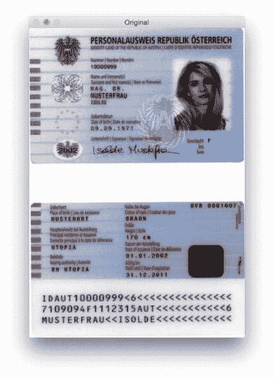](https://pyimagesearch.com/wp-content/uploads/2015/11/mrz_original.jpg)

**Figure 1:** Our original passport image that we are trying to detect the MRZ in.

在**行 26** 上应用高斯模糊以减少高频噪声。然后我们对第 27 行的**模糊的灰度图像应用*黑帽形态学操作*。**

blackhat 操作器用于在*浅色背景*(即护照本身的背景)下显示*深色区域*(即 MRZ 文本)。由于护照文本在浅色背景下总是黑色的(至少对于这个数据集来说)，所以 blackhat 操作是合适的。下面您可以看到应用 blackhat 运算符的输出:

[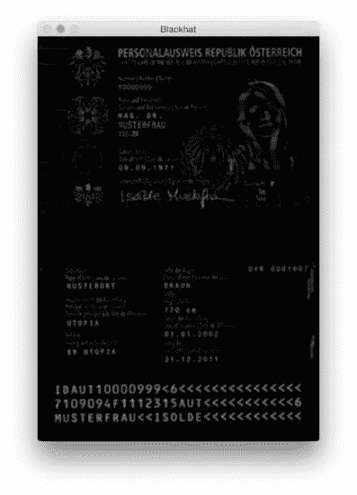](https://pyimagesearch.com/wp-content/uploads/2015/11/mrz_blackhat.jpg)

**Figure 2:** Applying the blackhat morphological operator reveals the black MRZ text against the light passport background.

MRZ 检测的下一步是使用 Scharr 算子计算 blackhat 图像的梯度幅度表示:

```py
	# compute the Scharr gradient of the blackhat image and scale the
	# result into the range [0, 255]
	gradX = cv2.Sobel(blackhat, ddepth=cv2.CV_32F, dx=1, dy=0, ksize=-1)
	gradX = np.absolute(gradX)
	(minVal, maxVal) = (np.min(gradX), np.max(gradX))
	gradX = (255 * ((gradX - minVal) / (maxVal - minVal))).astype("uint8")

```

这里我们计算沿着 ***blackhat*** 图像的 *x* 轴的 [Scharr 梯度](https://en.wikipedia.org/wiki/Sobel_operator#Alternative_operators)，揭示图像的区域，这些区域不仅相对于亮背景是*暗的，而且包含梯度*中的*垂直变化，例如 MRZ 文本区域。然后，我们使用最小/最大缩放将该梯度图像缩放回范围*【0，255】*:*

[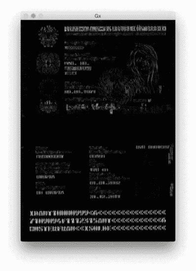](https://pyimagesearch.com/wp-content/uploads/2015/11/mrz_gradient_x.jpg)

**Figure 3:** Applying Scharr operator to our blackhat image reveals regions that contain strong vertical changes in gradient.

虽然我们为什么应用这一步骤还不完全清楚，但我可以说它对减少 MRZ 检测的假阳性非常有帮助。没有它，我们可能会意外地将护照上的修饰或设计区域标记为 MRZ。我将把这作为一个练习留给您，以验证计算 blackhat 图像的梯度可以提高 MRZ 检测精度。

下一步是尝试检测 MRZ 的实际*线*:

```py
	# apply a closing operation using the rectangular kernel to close
	# gaps in between letters -- then apply Otsu's thresholding method
	gradX = cv2.morphologyEx(gradX, cv2.MORPH_CLOSE, rectKernel)
	thresh = cv2.threshold(gradX, 0, 255, cv2.THRESH_BINARY | cv2.THRESH_OTSU)[1]

```

首先，我们使用矩形内核应用一个*关闭操作*。这种闭合操作意在闭合 MRZ 字符之间的间隙。然后，我们使用[大津法](https://en.wikipedia.org/wiki/Otsu%27s_method)应用阈值处理来自动对图像进行阈值处理:

[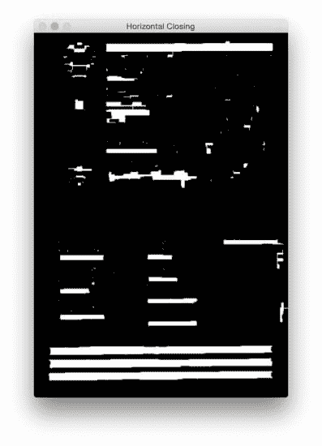](https://pyimagesearch.com/wp-content/uploads/2015/11/mrz_horizontal_closing.jpg)

**Figure 4:** Applying a closing operation using a rectangular kernel (that is wider than it is tall) to close gaps in between the MRZ characters

从上图中我们可以看到，每条 MRZ 线都出现在我们的阈值图上。

下一步是闭合实际线条之间的间隙，给我们一个对应于 MRZ 的大矩形区域:

```py
	# perform another closing operation, this time using the square
	# kernel to close gaps between lines of the MRZ, then perform a
	# series of erosions to break apart connected components
	thresh = cv2.morphologyEx(thresh, cv2.MORPH_CLOSE, sqKernel)
	thresh = cv2.erode(thresh, None, iterations=4)

```

这里我们执行另一个关闭操作，这一次使用我们的方形内核。这个内核用于闭合 MRZ 各条线之间的间隙，给我们一个与 MRZ 相对应的大区域。然后进行一系列腐蚀，以分开在闭合操作中可能已经连接的连接部件。这些侵蚀也有助于去除与 MRZ 无关的小斑点。

[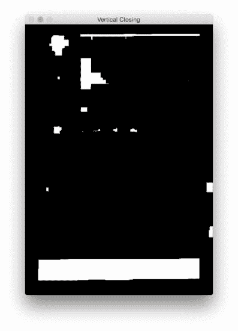](https://pyimagesearch.com/wp-content/uploads/2015/11/mrz_vertical_closing.jpg)

**Figure 5:** A second closing operation is performed, this time using a square kernel to close the gaps in between individual MRZ lines.

对于一些护照扫描，护照的边界可能在关闭过程中附着在 MRZ 地区。为了解决这个问题，我们将图像的 5%左右边框设置为零(即黑色):

```py
	# during thresholding, it's possible that border pixels were
	# included in the thresholding, so let's set 5% of the left and
	# right borders to zero
	p = int(image.shape[1] * 0.05)
	thresh[:, 0:p] = 0
	thresh[:, image.shape[1] - p:] = 0

```

你可以在下面看到我们移除边框的输出。

[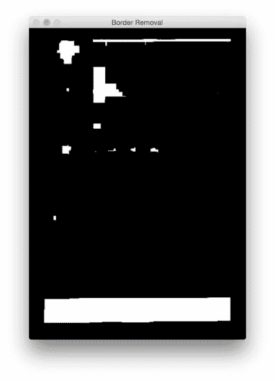](https://pyimagesearch.com/wp-content/uploads/2015/11/mrz_border_removal.jpg)

**Figure 6:** Setting 5% of the left and right border pixels to zero, ensuring that the MRZ region is not attached to the scanned margin of the passport.

与上面的**图 5** 相比，您现在可以看到边框被移除了。

最后一步是在我们的阈值图像中找到轮廓，并使用轮廓属性来识别 MRZ:

```py
	# find contours in the thresholded image and sort them by their
	# size
	cnts = cv2.findContours(thresh.copy(), cv2.RETR_EXTERNAL,
		cv2.CHAIN_APPROX_SIMPLE)
	cnts = imutils.grab_contours(cnts)
	cnts = sorted(cnts, key=cv2.contourArea, reverse=True)

	# loop over the contours
	for c in cnts:
		# compute the bounding box of the contour and use the contour to
		# compute the aspect ratio and coverage ratio of the bounding box
		# width to the width of the image
		(x, y, w, h) = cv2.boundingRect(c)
		ar = w / float(h)
		crWidth = w / float(gray.shape[1])

		# check to see if the aspect ratio and coverage width are within
		# acceptable criteria
		if ar > 5 and crWidth > 0.75:
			# pad the bounding box since we applied erosions and now need
			# to re-grow it
			pX = int((x + w) * 0.03)
			pY = int((y + h) * 0.03)
			(x, y) = (x - pX, y - pY)
			(w, h) = (w + (pX * 2), h + (pY * 2))

			# extract the ROI from the image and draw a bounding box
			# surrounding the MRZ
			roi = image[y:y + h, x:x + w].copy()
			cv2.rectangle(image, (x, y), (x + w, y + h), (0, 255, 0), 2)
			break

	# show the output images
	cv2.imshow("Image", image)
	cv2.imshow("ROI", roi)
	cv2.waitKey(0)

```

在**行 56-58** 上，我们计算阈值图像的轮廓(即轮廓)。然后我们取出这些轮廓，并根据它们在**行 59** 上的大小降序排列(暗示着*最大的轮廓*是列表中的第*第一个*)。

在第 62 行**,我们开始循环我们的轮廓排序列表。对于这些轮廓中的每一个，我们将计算边界框(**线 66** )并使用它来计算两个属性:*纵横比*和*覆盖率*。纵横比就是边界框的宽度除以高度。覆盖率是边界框的宽度除以实际图像的宽度。**

使用这两个属性，我们可以在第 72 行上做一个检查，看看我们是否在检查 MRZ 地区。MRZ 是长方形的，宽度远大于高度。MRZ 还应该覆盖输入图像的至少 75%。

假设这两种情况成立，**行 75-84** 使用边界框的 *(x，y)*-坐标来提取 MRZ 并在我们的输入图像上绘制边界框。

最后，**第 87-89 行**显示了我们的结果。

## 结果

要查看我们的 MRZ 检测器的运行情况，只需执行以下命令:

```py
$ python detect_mrz.py --images examples

```

下面你可以看到一个成功的 MRZ 探测的例子，MRZ 用绿色标出:

[](https://pyimagesearch.com/wp-content/uploads/2015/11/mrz_output_04.jpg)

**Figure 7:** On the *left*, we have our input image. And on the *right*, we have the MRZ region that has been successfully detected.

下面是使用 Python 和 OpenCV 检测 passport 图像中的机器可读区域的另一个示例:

[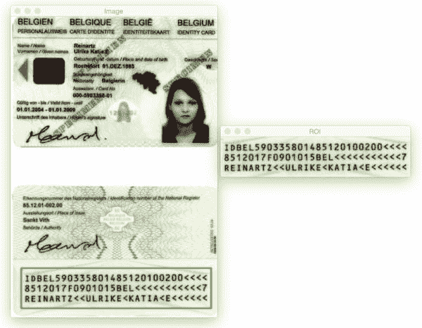](https://pyimagesearch.com/wp-content/uploads/2015/11/mrz_output_01.jpg)

**Figure 8:** Applying MRZ detection to a scanned passport.

MRZ 地区是在图像的顶部还是底部并不重要。通过应用形态学操作、提取轮廓和计算轮廓属性，我们能够毫无问题地提取 MRZ。

下图也是如此:

[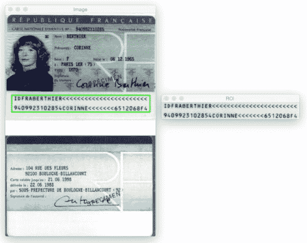](https://pyimagesearch.com/wp-content/uploads/2015/11/mrz_output_02.jpg)

**Figure 9:** Detecting machine-readable zones in images using computer vision.

让我们试试另一个图像:

[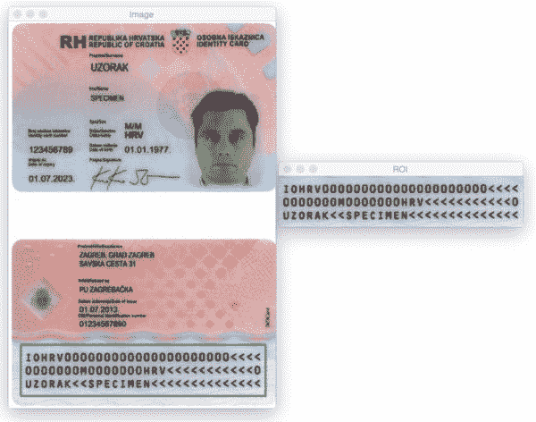](https://pyimagesearch.com/wp-content/uploads/2015/11/mrz_output_03.jpg)

**Figure 10:** Again, we are able to detect the MRZ in the passport scan using basic image processing techniques.

到目前为止，我们只看到了包含三条线的 1 型 mrz。然而，我们的方法同样适用于只包含两行的类型 3 MRZs:

[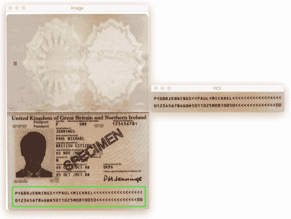](https://pyimagesearch.com/wp-content/uploads/2015/11/mrz_output_05.jpg)

**Figure 11:** Detecting the MRZ in a Type 3 passport image using Python and OpenCV.

这是另一个检测 3 型 MRZ 的例子:

[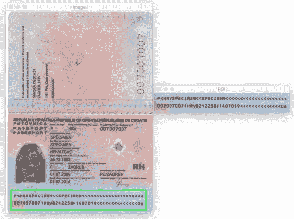](https://pyimagesearch.com/wp-content/uploads/2015/11/mrz_output_06.jpg)

**Figure 12:** Applying computer vision and image processing to detect machine-readable zones in images.

## 摘要

在这篇博文中，我们学习了如何仅使用基本的图像处理技术来检测护照扫描中的机器可读区域(mrz ),即:

*   阈值处理。
*   渐变。
*   形态学操作(具体来说，*闭合*和*腐蚀*)。
*   轮廓属性。

这些操作虽然简单，但允许我们检测图像中的 MRZ 区域*，而*不必依赖更高级的特征提取和机器学习方法，如[线性 SVM + HOG](https://pyimagesearch.com/2014/11/10/histogram-oriented-gradients-object-detection/) 进行对象检测。

记住，当面对具有挑战性的计算机视觉问题— ***时，要时刻考虑问题和你的假设！*** 正如这篇博文所展示的，你可能会惊讶于串联使用基本的图像处理功能可以完成什么。

再次感谢 **[图片搜索大师](https://pyimagesearch.com/pyimagesearch-gurus/)** 成员汉斯·布恩，他为我们提供了这些护照图片样本！谢谢汉斯！*