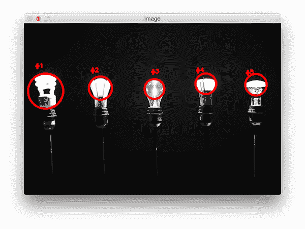
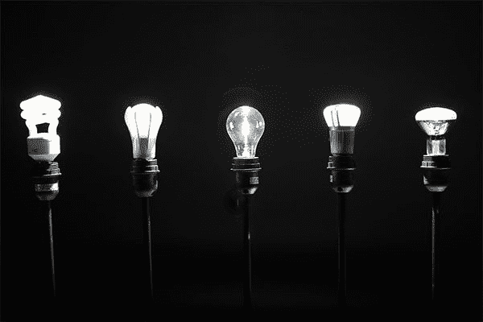
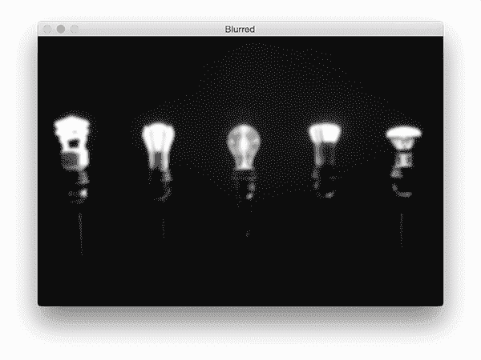
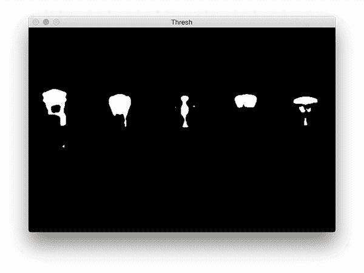
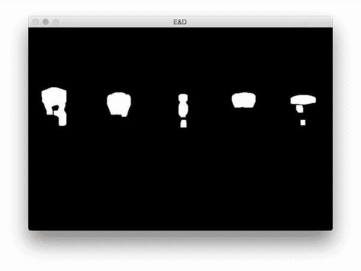
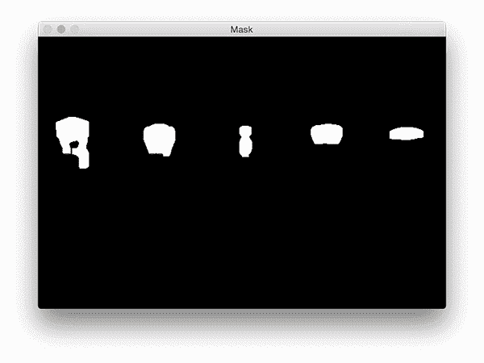
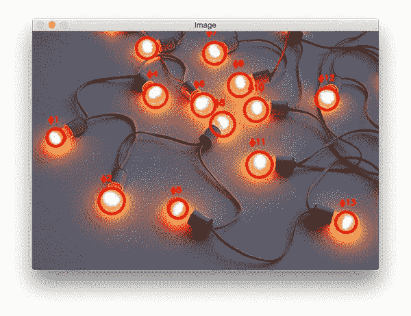

# 用 Python 和 OpenCV 检测图像中的多个亮点

> 原文：<https://pyimagesearch.com/2016/10/31/detecting-multiple-bright-spots-in-an-image-with-python-and-opencv/>



今天的博客是我几年前做的一个关于寻找图像中最亮的地方的教程的后续。

我之前的教程假设图像中只有*一个*亮点需要检测…

**…但是如果有*多个*亮点呢？**

如果你想检测一幅图像中的多个亮点，代码会稍微复杂一点，但不会太复杂。不过不用担心:我会详细解释每个步骤。

要了解如何检测图像中的多个亮点，请继续阅读。

## 用 Python 和 OpenCV 检测图像中的多个亮点

通常，当我在 PyImageSearch 博客上做基于代码的教程时，我会遵循一个非常标准的模板:

1.  解释问题是什么以及我们将如何解决它。
2.  提供解决项目的代码。
3.  演示执行代码的结果。

这个模板对于 95%的 PyImageSearch 博客文章都很有效，但是对于这个，我将把模板压缩到一个步骤中。

我觉得检测图像中最亮区域的问题是不言自明的，所以我不需要用一整节来详细说明这个问题。

我还认为，解释每个代码块，紧接着是显示执行相应代码块的*输出*的*，会帮助你更好地理解发生了什么。*

也就是说，看看下面的图片:



**Figure 1:** The example image that we are detecting multiple bright objects in using computer vision and image processing techniques ([source image](http://articles.latimes.com/2014/jan/01/business/la-fi-mo-incandescent-lightbulb-ban-20140101)).

在这张图片中，我们有五个灯泡。

**我们的目标是*检测出图像中的*这五个灯泡，并*给它们贴上独特的标签*。**

首先，打开一个新文件，命名为`detect_bright_spots.py`。从那里，插入以下代码:

```py
# import the necessary packages
from imutils import contours
from skimage import measure
import numpy as np
import argparse
import imutils
import cv2

# construct the argument parse and parse the arguments
ap = argparse.ArgumentParser()
ap.add_argument("-i", "--image", required=True,
	help="path to the image file")
args = vars(ap.parse_args())

```

**第 2-7 行**进口我们所需的 Python 包。在本教程中，我们将使用 [scikit-image](http://scikit-image.org/) ，所以如果您的系统上还没有安装它，请确保[按照这些安装说明](http://scikit-image.org/docs/stable/install.html)进行操作。

我们还将使用 [imutils](https://github.com/jrosebr1/imutils) ，这是我的一组便利函数，用来使应用图像处理操作更容易。

如果您的系统上还没有安装`imutils`，您可以使用`pip`为您安装:

```py
$ pip install --upgrade imutils

```

从那里，**第 10-13 行**解析我们的命令行参数。这里我们只需要一个开关`--image`，它是我们输入图像的路径。

要开始检测图像中最亮的区域，我们首先需要从磁盘加载图像，然后将其转换为灰度，并对其进行平滑(即模糊)以减少高频噪声:

```py
# load the image, convert it to grayscale, and blur it
image = cv2.imread(args["image"])
gray = cv2.cvtColor(image, cv2.COLOR_BGR2GRAY)
blurred = cv2.GaussianBlur(gray, (11, 11), 0)

```

这些操作的输出如下所示:



**Figure 2:** Converting our image to grayscale and blurring it.

注意我们的`image`现在是如何(1)灰度和(2)模糊的。

为了显示模糊图像中最亮的区域,我们需要应用阈值处理:

```py
# threshold the image to reveal light regions in the
# blurred image
thresh = cv2.threshold(blurred, 200, 255, cv2.THRESH_BINARY)[1]

```

该操作取任意像素值 *p > = 200* 并将其设置为 *255* (白色)。像素值 *< 200* 被设置为 *0* (黑色)。

阈值处理后，我们剩下以下图像:



**Figure 3:** Applying thresholding to reveal the brighter regions of the image.

注意图像的明亮区域现在都是白色的，而图像的其余部分被设置为黑色的。

然而，这个图像中有一点噪声(即小斑点)，所以让我们通过执行一系列腐蚀和膨胀来清理它:

```py
# perform a series of erosions and dilations to remove
# any small blobs of noise from the thresholded image
thresh = cv2.erode(thresh, None, iterations=2)
thresh = cv2.dilate(thresh, None, iterations=4)

```

应用这些操作后，你可以看到我们的`thresh`图像更加“干净”,尽管我们仍然有一些想要排除的残留斑点(我们将在下一步处理):



**Figure 4:** Utilizing a series of erosions and dilations to help “clean up” the thresholded image by removing small blobs and then regrowing the remaining regions.

该项目的关键步骤是*标记上图中的每个区域*；然而，即使在应用了腐蚀和膨胀之后，我们仍然想要过滤掉任何残留的“噪声”区域。

一个很好的方法是执行[连接组件分析](https://en.wikipedia.org/wiki/Connected-component_labeling):

```py
# perform a connected component analysis on the thresholded
# image, then initialize a mask to store only the "large"
# components
labels = measure.label(thresh, neighbors=8, background=0)
mask = np.zeros(thresh.shape, dtype="uint8")

# loop over the unique components
for label in np.unique(labels):
	# if this is the background label, ignore it
	if label == 0:
		continue

	# otherwise, construct the label mask and count the
	# number of pixels 
	labelMask = np.zeros(thresh.shape, dtype="uint8")
	labelMask[labels == label] = 255
	numPixels = cv2.countNonZero(labelMask)

	# if the number of pixels in the component is sufficiently
	# large, then add it to our mask of "large blobs"
	if numPixels > 300:
		mask = cv2.add(mask, labelMask)

```

**第 32 行**使用 scikit-image 库执行实际的连接组件分析。从`measure.label`返回的`labels`变量与我们的`thresh`图像具有完全相同的尺寸——唯一的区别是`labels`为`thresh`中的*每个*斑点存储一个 ***唯一整数*** 。

然后我们初始化第 33 行**上的`mask`来只存储大的斑点。**

在**的第 36 行**，我们开始循环每个独特的`labels`。如果`label`是零，那么我们知道我们正在检查背景区域，可以安全地忽略它(**第 38 和 39 行**)。

否则，我们为第 43 行和第 44 行上的*构造一个掩码*当前的`label`。

我在下面提供了一个 GIF 动画，它可视化了每个`label`的`labelMask`的构造。使用此动画帮助您理解如何访问和显示各个组件:


**Figure 5:** A visual animation of applying a connected-component analysis to our thresholded image.

**第 45 行**然后计算`labelMask`中非零像素的数量。如果`numPixels`超过预定义的阈值(在这种情况下，总共有 *300 个*像素)，那么我们认为该斑点“足够大”，并将其添加到我们的`mask`。

输出`mask`如下所示:



**Figure 6:** After applying a connected-component analysis we are left with only the larger blobs in the image (which are also bright).

请注意小斑点是如何被过滤掉的，只有大斑点被保留下来。

最后一步是在我们的图像上绘制标记的斑点:

```py
# find the contours in the mask, then sort them from left to
# right
cnts = cv2.findContours(mask.copy(), cv2.RETR_EXTERNAL,
	cv2.CHAIN_APPROX_SIMPLE)
cnts = imutils.grab_contours(cnts)
cnts = contours.sort_contours(cnts)[0]

# loop over the contours
for (i, c) in enumerate(cnts):
	# draw the bright spot on the image
	(x, y, w, h) = cv2.boundingRect(c)
	((cX, cY), radius) = cv2.minEnclosingCircle(c)
	cv2.circle(image, (int(cX), int(cY)), int(radius),
		(0, 0, 255), 3)
	cv2.putText(image, "#{}".format(i + 1), (x, y - 15),
		cv2.FONT_HERSHEY_SIMPLEX, 0.45, (0, 0, 255), 2)

# show the output image
cv2.imshow("Image", image)
cv2.waitKey(0)

```

首先，我们需要检测`mask`图像中的轮廓，然后从左到右对它们进行排序(**第 54-57 行**)。

一旦我们的轮廓被排序，我们就可以逐个循环了( **Line 60** )。

对于这些轮廓中的每一个，我们将计算*最小封闭圆* ( **线 63** )，它代表明亮区域包含的*区域*。

然后，我们对该区域进行唯一标记，并将其绘制在我们的`image` ( **第 64-67 行**)上。

最后，**行 70 和 71** 显示我们的输出结果。

为了可视化灯泡图像的输出，请务必使用本教程底部的 ***【下载】*** 部分将源代码+示例图像下载到这篇博文中。

从那里，只需执行以下命令:

```py
$ python detect_bright_spots.py --image images/lights_01.png

```

然后，您应该会看到以下输出图像:


**Figure 7:** Detecting multiple bright regions in an image with Python and OpenCV.

请注意，每一个灯泡都有独特的标签，上面画了一个圆圈来包围每个单独的明亮区域。

您可以通过执行以下命令来可视化第二个示例:

```py
$ python detect_bright_spots.py --image images/lights_02.png

```



**Figure 8:** A second example of detecting multiple bright regions using computer vision and image processing techniques.

这次输入图像里有*多个*灯泡！然而，即使图像中有许多明亮的区域，我们的方法仍然能够正确地(并且唯一地)标记它们中的每一个。

## 摘要

在这篇博文中，我扩展了之前关于检测图像中最亮点的教程来处理 T2 的多个明亮区域。我能够通过应用*阈值*来揭示图像中最亮的区域来完成这个任务。

这里的关键是阈值步骤——如果您的`thresh`图非常嘈杂，并且无法使用轮廓属性或连通分量分析进行过滤，那么您将无法定位图像中的每个明亮区域。

因此，您应该通过应用各种阈值处理技术(简单阈值处理、Otsu 阈值处理、自适应阈值处理，甚至可能是 GrabCut)来评估您的输入图像，并可视化您的结果。

这一步应该在之前*执行，你甚至都懒得应用连通分量分析或轮廓过滤。*

如果你能合理地将图像中较亮的区域与较暗的无关区域分割开来，那么这篇博文中概述的方法应该非常适合你。

无论如何，我希望你喜欢这篇博文！

在您离开之前，请务必在下表中输入您的电子邮件地址，以便在 PyImageSearch 博客上发布未来教程时得到通知。