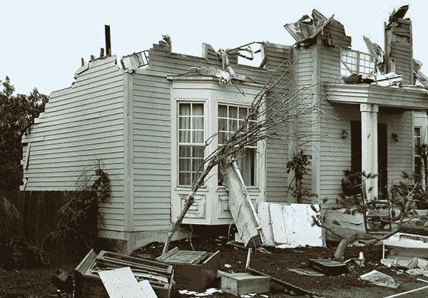
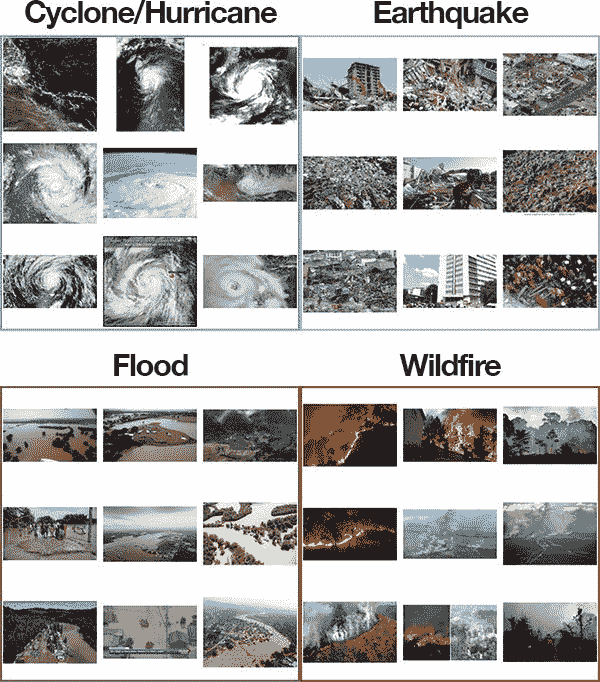
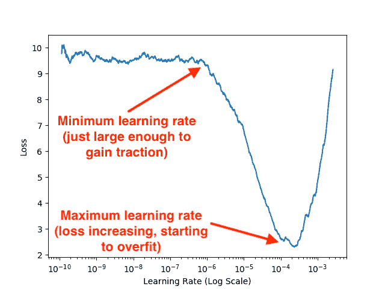
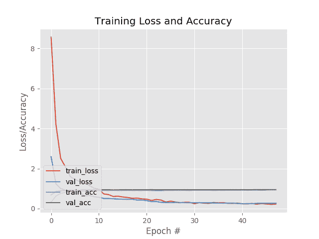

# 利用 Keras 和深度学习检测自然灾害

> 原文：<https://pyimagesearch.com/2019/11/11/detecting-natural-disasters-with-keras-and-deep-learning/>

在本教程中，您将学习如何使用 Keras、计算机视觉和深度学习自动检测自然灾害(地震、洪水、野火、气旋/飓风)，准确率高达**95%**。

我记得我第一次经历自然灾害的时候——我只是一个幼儿园的孩子，不超过 6-7 岁。

课间休息时，我们在户外玩攀登架，像小孩子一样像野生动物一样跑来跑去。

天气预报说有雨。天气多云。而且非常潮湿。

我妈妈给了我一件外套让我在外面穿，但我又热又不舒服——潮湿的天气让棉/涤纶混纺面料粘在了我的皮肤上。这件外套，就像我周围的空气一样，令人窒息。

突然间，天空从“正常的雨云”变成了不祥的绿色。

课间休息的班长把手伸进她的口袋，抓起她的哨子，吹了一声，表示我们该停止野生动物的古怪行为，到里面去上学了。

课间休息后，我们通常会围着老师的桌子坐成一圈，进行展示和讲解。

但这次不是。

我们立即被冲进走廊，并被告知用手捂住头部——一场龙卷风刚刚在我们学校附近登陆。

一想到龙卷风就足以吓到一个孩子。

而是去实际*体验*一次？

那完全是另外一回事。

风急剧加大，愤怒的暴风雨咆哮着，用树枝、岩石和任何没有绑好的松散碎片斥责我们的学校。

整个折磨不会超过 5-10 分钟，但感觉像是可怕的永恒。

结果证明我们一直都是安全的。龙卷风登陆后，它开始穿过玉米地，从我们学校离开，而不是从 T2 到 T3。

我们很幸运。

有趣的是，小时候的经历，尤其是那些让你害怕的经历，会在你长大后塑造你。

活动结束几天后，我妈妈带我去了当地的图书馆。我挑选了所有我能找到的关于龙卷风和飓风的书。尽管当时我只有基本的阅读水平，但我还是狼吞虎咽地阅读了它们，专心研究这些照片，直到我能在脑海中重现它们——想象置身于其中一场风暴中会是什么样子。

后来，在研究生院，我经历了具有历史意义的 2012 年 6 月 29 日的飓风 derecho，持续风速超过 60 英里/小时，阵风超过 100 英里/小时，撞倒了电线和大树。

那场风暴造成 29 人死亡，数百人受伤，并导致美国东海岸部分地区停电超过 6 天，这在现代美国是前所未有的。

自然灾害是无法预防的，但是它们是可以被探测到的，给人们宝贵的时间逃到安全的地方。

在本教程中，您将了解我们如何使用计算机视觉和深度学习来帮助检测自然灾害。

**要了解如何用 Keras、计算机视觉和深度学习来检测自然灾害，*继续阅读！***

## 利用 Keras 和深度学习检测自然灾害

在本教程的第一部分，我们将讨论如何使用计算机视觉和深度学习算法来自动检测图像和视频流中的自然灾害。

接下来，我们将回顾我们的自然灾害数据集，它由四个类组成:

*   旋风/飓风
*   地震
*   洪水
*   野火

然后，我们将设计一组实验，这些实验将:

*   帮助我们在数据集上微调 VGG16(在 ImageNet 上进行了预训练)。
*   找到最佳的学习速度。
*   **训练我们的模型，获得 *> 95%的准确率！***

我们开始吧！

### 计算机视觉和深度学习如何检测自然灾害？

[](https://pyimagesearch.com/wp-content/uploads/2019/11/keras_natural_disaster_hurricane.jpg)

**Figure 1:** We can detect natural disasters with Keras and Deep Learning using a dataset of natural disaster images. ([image source](https://drive.google.com/open?id=1NvTyhUsrFbL91E10EPm38IjoCg6E2c6q))

自然灾害无法预防，但却可以被发现。

在世界各地，我们使用传感器来监测自然灾害:

*   **地震传感器**(地震仪)和**振动传感器**(地震仪)用于监测地震(和下游海啸)。
*   **雷达图**用于探测龙卷风的标志性“钩状回波”(即从雷达回波延伸出来的一个钩子)。
*   **洪水传感器**用于测量湿度水平，而**水位传感器**用于监控河流、小溪等的水位。
*   野火传感器仍处于初级阶段，但有望探测到微量的烟和火。

**这些传感器中的每一个都是*高度专业化的*来完成手头的任务**——及早发现自然灾害，向人们发出警报，并让他们到达安全地带。

使用计算机视觉，我们可以增强现有的传感器，从而提高自然灾害探测器的准确性，最重要的是，让人们采取预防措施，保持安全，防止/减少因这些灾害而发生的伤亡人数。

### 我们的自然灾害图像数据集

[](https://pyimagesearch.com/wp-content/uploads/2019/11/keras_natural_disaster_dataset.jpg)

**Figure 2:** A dataset of natural disaster images. We’ll use this dataset to train a natural disaster detector with Keras and Deep Learning.

我们今天在这里使用的数据集是由 PyImageSearch 阅读器 [Gautam Kumar](https://www.linkedin.com/in/gautam-kumar-65399150/) 策划的。

高塔姆使用[谷歌图片](https://pyimagesearch.com/2017/12/04/how-to-create-a-deep-learning-dataset-using-google-images/)收集了总共**4428 张图片**，它们属于四个不同的类别:

*   **气旋/飓风:** 928 张图片
*   地震:1350
*   洪水:1073 人
*   野火:1077 人

然后，他训练了一个卷积神经网络来识别每一个自然灾害案例。

高塔姆在他的 LinkedIn 个人资料上分享了他的工作，吸引了许多深度学习从业者的注意(包括我自己)。我问他是否愿意(1)与 PyImageSearch 社区共享他的数据集，以及(2)允许我使用该数据集编写一个教程。高塔姆同意了，于是我们就有了今天！

**我再次衷心感谢高塔姆的辛勤工作和贡献——如果有机会，一定要感谢他！**

### 下载自然灾害数据集

[](https://pyimagesearch.com/wp-content/uploads/2019/11/keras_natural_disaster_download_dataset.png)

**Figure 3:** Gautam Kumar’s dataset for detecting natural disasters with Keras and deep learning.

您可以使用此链接通过 Google Drive 下载原始自然灾害数据集。

下载归档文件后，您应该将其解压缩并检查内容:

```py
$ tree --dirsfirst --filelimit 10 Cyclone_Wildfire_Flood_Earthquake_Database
Cyclone_Wildfire_Flood_Earthquake_Database
├── Cyclone [928 entries]
├── Earthquake [1350 entries]
├── Flood [1073 entries]
├── Wildfire [1077 entries]
└── readme.txt

4 directories, 1 file

```

在这里，您可以看到每个自然灾害都有自己的目录，每个类的示例都位于各自的父目录中。

### 项目结构

使用`tree`命令，让我们通过本教程的 ***【下载】*** 部分查看今天的项目:

```py
$ tree --dirsfirst --filelimit 10
.
├── Cyclone_Wildfire_Flood_Earthquake_Database
│   ├── Cyclone [928 entries]
│   ├── Earthquake [1350 entries]
│   ├── Flood [1073 entries]
│   ├── Wildfire [1077 entries]
│   └── readme.txt
├── output
│   ├── natural_disaster.model
│   │   ├── assets
│   │   ├── variables
│   │   │   ├── variables.data-00000-of-00002
│   │   │   ├── variables.data-00001-of-00002
│   │   │   └── variables.index
│   │   └── saved_model.pb
│   ├── clr_plot.png
│   ├── lrfind_plot.png
│   └── training_plot.png
├── pyimagesearch
│   ├── __init__.py
│   ├── clr_callback.py
│   ├── config.py
│   └── learningratefinder.py
├── videos
│   ├── floods_101_nat_geo.mp4
│   ├── fort_mcmurray_wildfire.mp4
│   ├── hurricane_lorenzo.mp4
│   ├── san_andreas.mp4
│   └── terrific_natural_disasters_compilation.mp4
├── Cyclone_Wildfire_Flood_Earthquake_Database.zip
├── train.py
└── predict.py

11 directories, 20 files

```

我们的项目包含:

*   自然灾害数据集。参考前面两节。
*   一个目录，我们的模型和绘图将存储在这里。我的实验结果包括在内。
*   我们的`pyimagesearch`模块包含我们的[循环学习率](https://pyimagesearch.com/2019/07/29/cyclical-learning-rates-with-keras-and-deep-learning/) Keras 回调，一个配置文件，和 [Keras 学习率查找器](https://pyimagesearch.com/2019/08/05/keras-learning-rate-finder/)。
*   选择`videos/`用于测试视频分类预测脚本。
*   我们的训练脚本，`train.py`。该脚本将对在 ImageNet 数据集上预训练的 VGG16 模型执行微调。
*   我们的视频分类预测脚本`predict.py`，执行滚动平均预测，实时对视频进行分类。

### 我们的配置文件

我们的项目将跨越多个 Python 文件，因此为了保持代码整洁有序(并确保我们没有大量命令行参数)，让我们创建一个配置文件来存储所有重要的路径和变量。

打开`pyimagesearch`模块中的`config.py`文件，插入以下代码:

```py
# import the necessary packages
import os

# initialize the path to the input directory containing our dataset
# of images
DATASET_PATH = "Cyclone_Wildfire_Flood_Earthquake_Database"

# initialize the class labels in the dataset
CLASSES = ["Cyclone", "Earthquake", "Flood", "Wildfire"]

```

`os`模块导入允许我们直接在这个配置文件中构建与操作系统无关的路径(**第 2 行**)。

第 6 行指定了自然灾害数据集的根路径。

**第 7 行**提供了类标签的名称(即数据集中子目录的名称)。

让我们定义数据集分割:

```py
# define the size of the training, validation (which comes from the
# train split), and testing splits, respectively
TRAIN_SPLIT = 0.75
VAL_SPLIT = 0.1
TEST_SPLIT = 0.25

```

**第 13-15 行**包含我们的培训、测试和验证分割尺寸。请注意，验证分割是训练分割的 10%(而不是所有数据的 10%)。

接下来，我们将定义我们的培训参数:

```py
# define the minimum learning rate, maximum learning rate, batch size,
# step size, CLR method, and number of epochs
MIN_LR = 1e-6
MAX_LR = 1e-4
BATCH_SIZE = 32
STEP_SIZE = 8
CLR_METHOD = "triangular"
NUM_EPOCHS = 48

```

**第 19 行和第 20 行**包含[循环学习率](https://pyimagesearch.com/2019/07/29/cyclical-learning-rates-with-keras-and-deep-learning/) (CLR)的最小和最大学习率。我们将在下面的*“找到我们的初始学习率”*部分学习如何设置这些学习率值。

**第 21-24 行**定义批量大小、步长、CLR 方法和训练时期数。

在这里，我们将定义输出路径:

```py
# set the path to the serialized model after training
MODEL_PATH = os.path.sep.join(["output", "natural_disaster.model"])

# define the path to the output learning rate finder plot, training
# history plot and cyclical learning rate plot
LRFIND_PLOT_PATH = os.path.sep.join(["output", "lrfind_plot.png"])
TRAINING_PLOT_PATH = os.path.sep.join(["output", "training_plot.png"])
CLR_PLOT_PATH = os.path.sep.join(["output", "clr_plot.png"])

```

**第 27-33 行**定义了以下输出路径:

*   训练后的序列化模型
*   学习率探测器图
*   训练历史图
*   CLR plot

### 使用 Keras 实现我们的培训脚本

我们的培训程序将包括两个步骤:

1.  **步骤#1:** 使用我们的[学习率查找器](https://pyimagesearch.com/2019/08/05/keras-learning-rate-finder/)来查找最佳学习率，以在我们的数据集上微调我们的 VGG16 CNN。
2.  **步骤#2:** 结合循环学习率(CLR)使用我们的最优学习率来获得高精度模型。

我们的`train.py`文件将处理这两个步骤。

继续在您最喜欢的代码编辑器中打开`train.py`,插入以下代码:

```py
# set the matplotlib backend so figures can be saved in the background
import matplotlib
matplotlib.use("Agg")

# import the necessary packages
from tensorflow.keras.preprocessing.image import ImageDataGenerator
from tensorflow.keras.applications import VGG16
from tensorflow.keras.layers import Dropout
from tensorflow.keras.layers import Flatten
from tensorflow.keras.layers import Dense
from tensorflow.keras.layers import Input
from tensorflow.keras.models import Model
from tensorflow.keras.optimizers import SGD
from sklearn.preprocessing import LabelBinarizer
from sklearn.model_selection import train_test_split
from sklearn.metrics import classification_report
from pyimagesearch.learningratefinder import LearningRateFinder
from pyimagesearch.clr_callback import CyclicLR
from pyimagesearch import config
from imutils import paths
import matplotlib.pyplot as plt
import numpy as np
import argparse
import pickle
import cv2
import sys
import os

```

**第 2-27 行**导入必要的包，包括:

*   `matplotlib`:用于绘图(使用`"Agg"`后端，以便将绘图图像保存到磁盘)。
*   `tensorflow`:导入包括我们的`VGG16` CNN，数据扩充，图层类型，和`SGD`优化器。
*   `scikit-learn`:导入包括标签二进制化器、数据集分割功能、评估报告工具。
*   `LearningRateFinder`:我们的 [Keras 学习率查找器](https://pyimagesearch.com/2019/08/05/keras-learning-rate-finder/)类。
*   `CyclicLR`:波动学习率的 Keras 回调，称为[周期性学习率](https://pyimagesearch.com/2019/07/29/cyclical-learning-rates-with-keras-and-deep-learning/)。clr 导致更快的收敛，并且通常需要更少的超参数更新实验。
*   `config`:我们在上一节中回顾的自定义配置设置。
*   `paths`:包含在目录树中列出图像路径的功能。
*   `cv2` : OpenCV，用于预处理和显示。

让我们解析命令行参数并获取我们的图像路径:

```py
# construct the argument parser and parse the arguments
ap = argparse.ArgumentParser()
ap.add_argument("-f", "--lr-find", type=int, default=0,
	help="whether or not to find optimal learning rate")
args = vars(ap.parse_args())

# grab the paths to all images in our dataset directory and initialize
# our lists of images and class labels
print("[INFO] loading images...")
imagePaths = list(paths.list_images(config.DATASET_PATH))
data = []
labels = []

```

回想一下，我们大部分的设定都在`config.py`里。有一个例外。`--lr-find`命令行参数告诉我们的脚本是否找到最优的学习率(**第 30-33 行**)。

**第 38 行**获取数据集中所有图像的路径。

然后我们初始化两个同步列表来保存我们的图像`data`和`labels` ( **第 39 行和第 40 行**)。

现在让我们填充`data`和`labels`列表:

```py
# loop over the image paths
for imagePath in imagePaths:
	# extract the class label
	label = imagePath.split(os.path.sep)[-2]

	# load the image, convert it to RGB channel ordering, and resize
	# it to be a fixed 224x224 pixels, ignoring aspect ratio
	image = cv2.imread(imagePath)
	image = cv2.cvtColor(image, cv2.COLOR_BGR2RGB)
	image = cv2.resize(image, (224, 224))

	# update the data and labels lists, respectively
	data.append(image)
	labels.append(label)

# convert the data and labels to NumPy arrays
print("[INFO] processing data...")
data = np.array(data, dtype="float32")
labels = np.array(labels)

# perform one-hot encoding on the labels
lb = LabelBinarizer()
labels = lb.fit_transform(labels)

```

**第 43-55 行**在`imagePaths`上循环，同时:

*   从路径中提取类`label`(**第 45 行**)。
*   加载并预处理`image` ( **第 49-51 行**)。对于 VGG16，图像被转换为 RGB 通道排序，并被调整为 *224×224* 。
*   将预处理后的`image`添加到`data`列表中(**第 54 行**)。
*   将`label`添加到`labels`列表中(**行 55** )。

**第 59 行**通过将`data`转换为`"float32"`数据类型 NumPy 数组来执行最后的预处理步骤。

类似地，**行 60** 将`labels`转换成一个数组，这样**行 63 和 64** 可以执行一键编码。

从这里开始，我们将对数据进行分区，并设置数据扩充:

```py
# partition the data into training and testing splits
(trainX, testX, trainY, testY) = train_test_split(data, labels,
	test_size=config.TEST_SPLIT, random_state=42)

# take the validation split from the training split
(trainX, valX, trainY, valY) = train_test_split(trainX, trainY,
	test_size=config.VAL_SPLIT, random_state=84)

# initialize the training data augmentation object
aug = ImageDataGenerator(
	rotation_range=30,
	zoom_range=0.15,
	width_shift_range=0.2,
	height_shift_range=0.2,
	shear_range=0.15,
	horizontal_flip=True,
	fill_mode="nearest")

```

**第 67-72 行**构建培训、测试和验证分割。

第 75-82 行实例化我们的数据扩充对象。在我的[以前的帖子](https://pyimagesearch.com/tag/data-augmentation/)中以及在*的 [*的*实践者包中阅读更多关于使用 Python](https://pyimagesearch.com/deep-learning-computer-vision-python-book/)* 进行计算机视觉深度学习的信息。

此时，我们将设置 VGG16 模型以进行[微调](https://pyimagesearch.com/2019/06/03/fine-tuning-with-keras-and-deep-learning/):

```py
# load the VGG16 network, ensuring the head FC layer sets are left
# off
baseModel = VGG16(weights="imagenet", include_top=False,
	input_tensor=Input(shape=(224, 224, 3)))

# construct the head of the model that will be placed on top of the
# the base model
headModel = baseModel.output
headModel = Flatten(name="flatten")(headModel)
headModel = Dense(512, activation="relu")(headModel)
headModel = Dropout(0.5)(headModel)
headModel = Dense(len(config.CLASSES), activation="softmax")(headModel)

# place the head FC model on top of the base model (this will become
# the actual model we will train)
model = Model(inputs=baseModel.input, outputs=headModel)

# loop over all layers in the base model and freeze them so they will
# *not* be updated during the first training process
for layer in baseModel.layers:
	layer.trainable = False

# compile our model (this needs to be done after our setting our
# layers to being non-trainable
print("[INFO] compiling model...")
opt = SGD(lr=config.MIN_LR, momentum=0.9)
model.compile(loss="categorical_crossentropy", optimizer=opt,
	metrics=["accuracy"])

```

**第 86 行和第 87 行**使用预先训练的 ImageNet 权重加载`VGG16`(但没有全连接层头)。

**第 91-95 行**创建一个新的全连接层头，随后是**第 99 行**，它将新的 FC 层添加到 VGG16 的主体。

**第 103 行和第 104 行**将 VGG16 的主体标记为不可训练——我们将只训练(即微调)FC 层头部。

**第 109-111 行**然后`compile`我们的随机梯度下降(`SGD`)优化器模型和我们指定的最小学习率。

第一次运行脚本时，您应该设置`--lr-find`命令行参数，以使用 [Keras 学习率查找器](https://pyimagesearch.com/2019/08/05/keras-learning-rate-finder/)来确定最佳学习率。让我们看看它是如何工作的:

```py
# check to see if we are attempting to find an optimal learning rate
# before training for the full number of epochs
if args["lr_find"] > 0:
	# initialize the learning rate finder and then train with learning
	# rates ranging from 1e-10 to 1e+1
	print("[INFO] finding learning rate...")
	lrf = LearningRateFinder(model)
	lrf.find(
		aug.flow(trainX, trainY, batch_size=config.BATCH_SIZE),
		1e-10, 1e+1,
		stepsPerEpoch=np.ceil((trainX.shape[0] / float(config.BATCH_SIZE))),
		epochs=20,
		batchSize=config.BATCH_SIZE)

	# plot the loss for the various learning rates and save the
	# resulting plot to disk
	lrf.plot_loss()
	plt.savefig(config.LRFIND_PLOT_PATH)

	# gracefully exit the script so we can adjust our learning rates
	# in the config and then train the network for our full set of
	# epochs
	print("[INFO] learning rate finder complete")
	print("[INFO] examine plot and adjust learning rates before training")
	sys.exit(0)

```

第 115 行检查我们是否应该尝试找到最佳学习率。假设如此，我们:

*   初始化`LearningRateFinder` ( **第 119 行**)。
*   以`1e-10`的学习率开始训练，并以指数方式增加，直到我们达到`1e+1` ( **第 120-125 行**)。
*   绘制损失与学习率的关系图，并保存结果数字(**第 129 和 130 行**)。
*   优雅地`exit`打印一条消息后的脚本，该消息指示用户检查学习率查找器图(**第 135-137 行**)。

在这段代码执行之后，我们现在需要:

1.  **步骤#1:** 检查生成的绘图。
2.  **步骤#2:** 分别用我们的`MIN_LR`和`MAX_LR`更新`config.py`。
3.  **步骤#3:** 在我们的完整数据集上训练网络。

假设我们已经完成了**步骤#1 和#2** ，现在让我们处理**步骤#3** ，其中我们的最小和最大学习率已经在配置中找到并更新。

在这种情况下，是时候初始化我们的[循环学习率类](https://pyimagesearch.com/2019/07/29/cyclical-learning-rates-with-keras-and-deep-learning/)并开始训练了:

```py
# otherwise, we have already defined a learning rate space to train
# over, so compute the step size and initialize the cyclic learning
# rate method
stepSize = config.STEP_SIZE * (trainX.shape[0] // config.BATCH_SIZE)
clr = CyclicLR(
	mode=config.CLR_METHOD,
	base_lr=config.MIN_LR,
	max_lr=config.MAX_LR,
	step_size=stepSize)

# train the network
print("[INFO] training network...")
H = model.fit_generator(
	aug.flow(trainX, trainY, batch_size=config.BATCH_SIZE),
	validation_data=(valX, valY),
	steps_per_epoch=trainX.shape[0] // config.BATCH_SIZE,
	epochs=config.NUM_EPOCHS,
	callbacks=[clr],
	verbose=1)

```

第 142-147 行初始化我们的`CyclicLR`。

**第 151-157 行**然后使用`.fit_generator` 和我们的`aug`数据增强对象以及我们的`clr`回调来训练我们的`model` [。](https://pyimagesearch.com/2018/12/24/how-to-use-keras-fit-and-fit_generator-a-hands-on-tutorial/)

培训完成后，我们开始评估并保存我们的`model`:

```py
# evaluate the network and show a classification report
print("[INFO] evaluating network...")
predictions = model.predict(testX, batch_size=config.BATCH_SIZE)
print(classification_report(testY.argmax(axis=1),
	predictions.argmax(axis=1), target_names=config.CLASSES))

# serialize the model to disk
print("[INFO] serializing network to '{}'...".format(config.MODEL_PATH))
model.save(config.MODEL_PATH)

```

第 161 行对我们的测试集进行预测。这些预测被传递到**行 162 和 163** ，它们打印一个分类报告摘要。

**第 167 行**将微调后的模型序列化保存到磁盘。

最后，让我们绘制我们的培训历史和 CLR 历史:

```py
# construct a plot that plots and saves the training history
N = np.arange(0, config.NUM_EPOCHS)
plt.style.use("ggplot")
plt.figure()
plt.plot(N, H.history["loss"], label="train_loss")
plt.plot(N, H.history["val_loss"], label="val_loss")
plt.plot(N, H.history["accuracy"], label="train_acc")
plt.plot(N, H.history["val_accuracy"], label="val_acc")
plt.title("Training Loss and Accuracy")
plt.xlabel("Epoch #")
plt.ylabel("Loss/Accuracy")
plt.legend(loc="lower left")
plt.savefig(config.TRAINING_PLOT_PATH)

# plot the learning rate history
N = np.arange(0, len(clr.history["lr"]))
plt.figure()
plt.plot(N, clr.history["lr"])
plt.title("Cyclical Learning Rate (CLR)")
plt.xlabel("Training Iterations")
plt.ylabel("Learning Rate")
plt.savefig(config.CLR_PLOT_PATH)

```

**第 170-181 行**生成我们训练历史的图表，并将图表保存到磁盘。

***注:**在 TensorFlow 2.0 中，历史字典键由`acc`变为`accuracy`，`val_acc`变为`val_accuracy`。尤其令人困惑的是，现在“准确性”被拼写出来了，而“有效性”却没有。根据您的 TensorFlow 版本，请特别注意这一细微差别。*

**第 184-190 行**绘制我们的循环学习率历史，并将数字保存到磁盘。

### 找到我们的初始学习率

在我们尝试微调我们的模型以识别自然灾害之前，让我们首先使用我们的[学习率查找器](https://pyimagesearch.com/2019/08/05/keras-learning-rate-finder/)来找到一组最优的学习率范围。使用这个最佳学习率范围，我们将能够应用[循环学习率](https://pyimagesearch.com/2019/07/29/cyclical-learning-rates-with-keras-and-deep-learning/)来提高我们的模型精度。

确保你两者都有:

1.  使用本教程的 ***【下载】*** 部分下载源代码。
2.  使用上面的*“下载自然灾害数据集”*部分下载数据集。

从那里，打开一个终端并执行以下命令:

```py
$ python train.py --lr-find 1
[INFO] loading images...
[INFO] processing data...
[INFO] compiling model...
[INFO] finding learning rate...
Epoch 1/20
94/94 [==============================] - 29s 314ms/step - loss: 9.7411 - accuracy: 0.2664
Epoch 2/20
94/94 [==============================] - 28s 295ms/step - loss: 9.5912 - accuracy: 0.2701
Epoch 3/20
94/94 [==============================] - 27s 291ms/step - loss: 9.4601 - accuracy: 0.2731
...
Epoch 12/20
94/94 [==============================] - 27s 290ms/step - loss: 2.7111 - accuracy: 0.7764
Epoch 13/20
94/94 [==============================] - 27s 286ms/step - loss: 5.9785 - accuracy: 0.6084
Epoch 14/20
47/94 [==============>...............] - ETA: 13s - loss: 10.8441 - accuracy: 0.3261
[INFO] learning rate finder complete
[INFO] examine plot and adjust learning rates before training

```

假设`train.py`脚本已正确退出，那么现在您的输出目录中应该有一个名为`lrfind_plot.png`的文件。

现在花点时间来看看这张图片:

[](https://pyimagesearch.com/wp-content/uploads/2019/11/keras_natural_disaster_lrfind_plot.png)

**Figure 4:** Using a [*Keras Learning Rate Finder*](https://pyimagesearch.com/2019/08/05/keras-learning-rate-finder/) to find the optimal learning rates to fine tune our CNN on our natural disaster dataset. We will use the dataset to train a model for detecting natural disasters with the Keras deep learning framework.

检查该图，您可以看到我们的模型最初在`1e-6`左右开始学习并获得牵引力。

我们的损失继续下降，直到大约`1e-4`时又开始上升，这是过度拟合的明显迹象。

**因此，我们的最佳学习率范围是`1e-6`到`1e-4`。**

### 更新我们的学习率

既然我们已经知道了我们的最佳学习率，让我们回到我们的`config.py`文件并相应地更新它们:

```py
# define the minimum learning rate, maximum learning rate, batch size,
# step size, CLR method, and number of epochs
MIN_LR = 1e-6
MAX_LR = 1e-4
BATCH_SIZE = 32
STEP_SIZE = 8
CLR_METHOD = "triangular"
NUM_EPOCHS = 48

```

请注意我们配置文件的**第 19 行和第 20 行**(高亮显示)上的`MIN_LR`和`MAX_LR`学习率值是最新更新的。这些值是通过检查我们的 [Keras Learning Rate Finder](https://pyimagesearch.com/2019/08/05/keras-learning-rate-finder/) 图找到的。

### 用 Keras 训练自然灾害检测模型

我们现在可以微调我们的模型来识别自然灾害！

执行以下命令，该命令将在整个时期内训练我们的网络:

```py
$ python train.py
[INFO] loading images...
[INFO] processing data...
[INFO] compiling model...
[INFO] training network...
Epoch 1/48
93/93 [==============================] - 32s 343ms/step - loss: 8.5819 - accuracy: 0.3254 - val_loss: 2.5915 - val_accuracy: 0.6829
Epoch 2/48
93/93 [==============================] - 30s 320ms/step - loss: 4.2144 - accuracy: 0.6194 - val_loss: 1.2390 - val_accuracy: 0.8573
Epoch 3/48
93/93 [==============================] - 29s 316ms/step - loss: 2.5044 - accuracy: 0.7605 - val_loss: 1.0052 - val_accuracy: 0.8862
Epoch 4/48
93/93 [==============================] - 30s 322ms/step - loss: 2.0702 - accuracy: 0.8011 - val_loss: 0.9150 - val_accuracy: 0.9070
Epoch 5/48
93/93 [==============================] - 29s 313ms/step - loss: 1.5996 - accuracy: 0.8366 - val_loss: 0.7397 - val_accuracy: 0.9268
...
Epoch 44/48
93/93 [==============================] - 28s 304ms/step - loss: 0.2180 - accuracy: 0.9275 - val_loss: 0.2608 - val_accuracy: 0.9476
Epoch 45/48
93/93 [==============================] - 29s 315ms/step - loss: 0.2521 - accuracy: 0.9178 - val_loss: 0.2693 - val_accuracy: 0.9449
Epoch 46/48
93/93 [==============================] - 29s 312ms/step - loss: 0.2330 - accuracy: 0.9284 - val_loss: 0.2687 - val_accuracy: 0.9467
Epoch 47/48
93/93 [==============================] - 29s 310ms/step - loss: 0.2120 - accuracy: 0.9322 - val_loss: 0.2646 - val_accuracy: 0.9476
Epoch 48/48
93/93 [==============================] - 29s 311ms/step - loss: 0.2237 - accuracy: 0.9318 - val_loss: 0.2664 - val_accuracy: 0.9485
[INFO] evaluating network...
              precision    recall  f1-score   support

     Cyclone       0.99      0.97      0.98       205
  Earthquake       0.96      0.93      0.95       362
       Flood       0.90      0.94      0.92       267
    Wildfire       0.96      0.97      0.96       273

    accuracy                           0.95      1107
   macro avg       0.95      0.95      0.95      1107
weighted avg       0.95      0.95      0.95      1107

[INFO] serializing network to 'output/natural_disaster.model'...

```

这里您可以看到，在测试集中识别自然灾害时，我们获得了 95%的准确率。

检查我们的训练图，我们可以看到我们的验证损失跟随着我们的训练损失，这意味着在我们的数据集本身内几乎没有过度拟合:

[](https://pyimagesearch.com/wp-content/uploads/2019/11/training_plot.png)

**Figure 5:** Training history accuracy/loss curves for creating a natural disaster classifier using Keras and deep learning.

最后，我们有我们的学习率图，它显示了我们的 CLR 回调分别在我们的`MIN_LR`和`MAX_LR`之间振荡学习率:

[](https://pyimagesearch.com/wp-content/uploads/2019/11/clr_plot.png)

**Figure 6:** Cyclical learning rates are used with Keras and deep learning for detecting natural disasters.

### 实施我们的自然灾害预测脚本

现在我们的模型已经训练好了，让我们看看如何使用它对它从未见过的图像/视频进行预测，从而为自动自然灾害检测系统铺平道路。

为了创建这个脚本，我们将利用视频 的 ***时间特性，特别是假设视频中的 ***后续帧将具有相似的语义内容*。*****

通过执行滚动预测准确性，我们将能够“平滑”预测并避免“预测闪烁”。

我已经在我的 ***[视频分类与 Keras 和深度学习](https://pyimagesearch.com/2019/07/15/video-classification-with-keras-and-deep-learning/)*** 文章中深入介绍了这个近乎相同的脚本。请务必参考那篇文章，了解完整的背景和更详细的代码解释。

为了完成*自然灾害视频分类*让我们来看看`predict.py`:

```py
# import the necessary packages
from tensorflow.keras.models import load_model
from pyimagesearch import config
from collections import deque
import numpy as np
import argparse
import cv2

# construct the argument parser and parse the arguments
ap = argparse.ArgumentParser()
ap.add_argument("-i", "--input", required=True,
	help="path to our input video")
ap.add_argument("-o", "--output", required=True,
	help="path to our output video")
ap.add_argument("-s", "--size", type=int, default=128,
	help="size of queue for averaging")
ap.add_argument("-d", "--display", type=int, default=-1,
	help="whether or not output frame should be displayed to screen")
args = vars(ap.parse_args())

```

**2-7 线**装载必要的包和模块。特别是，我们将使用 Python 的`collections`模块中的`deque`来辅助我们的滚动平均算法。

**第 10-19 行** [解析命令行参数](https://pyimagesearch.com/2018/03/12/python-argparse-command-line-arguments/)，包括我们输入/输出视频的路径，我们滚动平均队列的大小，以及我们是否会在视频生成时在屏幕上显示输出帧。

让我们继续加载我们的自然灾害分类模型，并初始化我们的队列+视频流:

```py
# load the trained model from disk
print("[INFO] loading model and label binarizer...")
model = load_model(config.MODEL_PATH)

# initialize the predictions queue
Q = deque(maxlen=args["size"])

# initialize the video stream, pointer to output video file, and
# frame dimensions
print("[INFO] processing video...")
vs = cv2.VideoCapture(args["input"])
writer = None
(W, H) = (None, None)

```

随着我们的`model`、`Q`和`vs`准备就绪，我们将开始循环播放帧:

```py
# loop over frames from the video file stream
while True:
	# read the next frame from the file
	(grabbed, frame) = vs.read()

	# if the frame was not grabbed, then we have reached the end
	# of the stream
	if not grabbed:
		break

	# if the frame dimensions are empty, grab them
	if W is None or H is None:
		(H, W) = frame.shape[:2]

	# clone the output frame, then convert it from BGR to RGB
	# ordering and resize the frame to a fixed 224x224
	output = frame.copy()
	frame = cv2.cvtColor(frame, cv2.COLOR_BGR2RGB)
	frame = cv2.resize(frame, (224, 224))
	frame = frame.astype("float32")

```

**第 38-47 行**抓取一个`frame`并存储其尺寸。

**第 51-54 行**为了`output`的目的复制我们的`frame`，然后对其进行分类预处理。预处理步骤是，*和必须，*与我们为训练执行的步骤相同。

现在让我们在框架上做一个自然灾害预测:

```py
	# make predictions on the frame and then update the predictions
	# queue
	preds = model.predict(np.expand_dims(frame, axis=0))[0]
	Q.append(preds)

	# perform prediction averaging over the current history of
	# previous predictions
	results = np.array(Q).mean(axis=0)
	i = np.argmax(results)
	label = config.CLASSES[i]

```

**第 58 行和第 59 行**执行推理并将预测添加到我们的队列中。

**第 63 行**执行`Q`中可用预测的滚动平均预测。

**第 64 行和第 65 行**然后提取最高概率类标签，以便我们可以注释我们的帧:

```py
	# draw the activity on the output frame
	text = "activity: {}".format(label)
	cv2.putText(output, text, (35, 50), cv2.FONT_HERSHEY_SIMPLEX,
		1.25, (0, 255, 0), 5)

	# check if the video writer is None
	if writer is None:
		# initialize our video writer
		fourcc = cv2.VideoWriter_fourcc(*"MJPG")
		writer = cv2.VideoWriter(args["output"], fourcc, 30,
			(W, H), True)

	# write the output frame to disk
	writer.write(output)

	# check to see if we should display the output frame to our
	# screen
	if args["display"] > 0:
		# show the output image
		cv2.imshow("Output", output)
		key = cv2.waitKey(1) & 0xFF

		# if the `q` key was pressed, break from the loop
		if key == ord("q"):
			break

# release the file pointers
print("[INFO] cleaning up...")
writer.release()
vs.release()

```

**第 68-70 行**在`output`画面的角落标注自然灾害活动。

**第 73-80 行**处理将`output`帧写入视频文件。

如果`--display`标志被置位，**行 84-91** 向屏幕显示该帧并捕捉按键。

否则，处理继续，直到完成，此时循环结束，我们执行清除(**行 95 和 96** )。

### 用 Keras 预测自然灾害

出于本教程的目的，我通过 YouTube 下载了自然灾害视频示例——具体视频在下面的*“Credits”*部分列出。您可以使用自己的示例视频，也可以通过演职员表下载视频。

无论哪种方式，请确保您已经使用本教程的 ***“下载”*** 部分下载了源代码和预先训练好的自然灾害预测模型。

下载后，您可以使用以下命令启动`predict.py`脚本:

```py
$ python predict.py --input videos/terrific_natural_disasters_compilation.mp4 \
	--output output/natural_disasters_output.avi
[INFO] processing video...
[INFO] cleaning up...

```

在这里你可以看到我们的模型的一个样本结果，正确地将这个视频剪辑分类为*“洪水”:*


**Figure 7:** Natural disaster “flood” classification with Keras and Deep Learning.

下面的例子来自 2016 年麦克默里堡野火:


**Figure 8:** Detecting “wildfires” and other natural disasters with Keras, deep learning, and computer vision.

出于好玩，我随后尝试将自然灾害探测器应用到电影*圣安地列斯(2015)* :


**Figure 9:** Detecting “earthquake” damage with Keras, deep learning, and Python.

请注意我们的模型如何能够正确地将视频剪辑标记为(过度戏剧化的)地震。

您可以在下面找到完整的演示视频:

<https://www.youtube.com/embed/MjK_jGmYkps?feature=oembed>