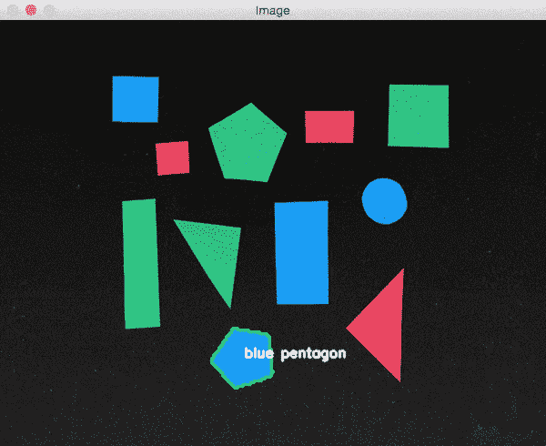
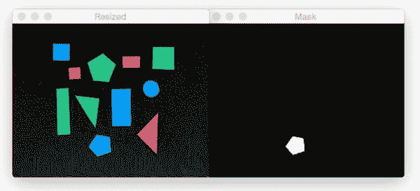
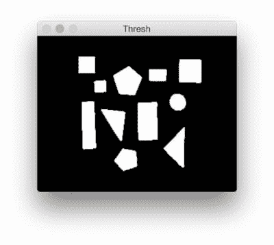

# 用 OpenCV 确定对象颜色

> 原文：<https://pyimagesearch.com/2016/02/15/determining-object-color-with-opencv/>

[](https://pyimagesearch.com/wp-content/uploads/2016/01/determining_object_color_result.gif)

这是我们关于形状检测和分析的三部分系列的最后一篇文章。

之前，我们学习了如何:

1.  [计算轮廓的中心](https://pyimagesearch.com/2016/02/01/opencv-center-of-contour/)
2.  [进行形状检测&识别](https://pyimagesearch.com/2016/02/08/opencv-shape-detection/)

今天我们将对图像中的物体进行 ***形状检测*** 和 ***颜色标注*** 。

在这一点上，我们理解图像的区域可以由[颜色直方图](https://pyimagesearch.com/2014/01/22/clever-girl-a-guide-to-utilizing-color-histograms-for-computer-vision-and-image-search-engines/)和[基本颜色通道统计](https://pyimagesearch.com/2014/03/03/charizard-explains-describe-quantify-image-using-feature-vectors/)来表征，例如平均值和标准偏差。

但是，虽然我们可以计算这些不同的统计数据，但它们无法给我们一个实际的*标签*，如“红色”、“绿色”、“蓝色”或“黑色”，来标记包含特定颜色的区域。

***……或者他们能？***

在这篇博文中，我将详细介绍我们如何利用 [L*a*b*颜色空间](https://en.wikipedia.org/wiki/Lab_color_space)以及欧几里德距离，使用 Python 和 OpenCV 来标记、标注和确定图像中对象的颜色。

## 用 OpenCV 确定对象颜色

在深入研究任何代码之前，让我们简要回顾一下我们的项目结构:

```py
|--- pyimagesearch
|    |--- __init__.py
|    |--- colorlabeler.py
|    |--- shapedetector.py
|--- detect_color.py
|--- example_shapes.png

```

注意我们是如何重用我们之前的[博客文章](https://pyimagesearch.com/2016/02/08/opencv-shape-detection/)中的`shapedetector.py`和`ShapeDetector`类的。我们还将创建一个新文件，`colorlabeler.py`，它将被用来标记带有颜色的*文本标签*的图像区域。

最后，`detect_color.py`驱动脚本将被用来把所有的部分粘在一起。

在继续阅读本文之前，请确保您的系统上安装了 [imutils Python 包](https://github.com/jrosebr1/imutils):

```py
$ pip install imutils

```

在本课的剩余部分，我们将使用这个库中的各种函数。

### 标记图像中的颜色

该项目的第一步是创建一个 Python 类，该类可用于用相关颜色标记图像中的形状。

为此，让我们在`colorlabeler.py`文件中定义一个名为`ColorLabeler`的类:

```py
# import the necessary packages
from scipy.spatial import distance as dist
from collections import OrderedDict
import numpy as np
import cv2

class ColorLabeler:
	def __init__(self):
		# initialize the colors dictionary, containing the color
		# name as the key and the RGB tuple as the value
		colors = OrderedDict({
			"red": (255, 0, 0),
			"green": (0, 255, 0),
			"blue": (0, 0, 255)})

		# allocate memory for the L*a*b* image, then initialize
		# the color names list
		self.lab = np.zeros((len(colors), 1, 3), dtype="uint8")
		self.colorNames = []

		# loop over the colors dictionary
		for (i, (name, rgb)) in enumerate(colors.items()):
			# update the L*a*b* array and the color names list
			self.lab[i] = rgb
			self.colorNames.append(name)

		# convert the L*a*b* array from the RGB color space
		# to L*a*b*
		self.lab = cv2.cvtColor(self.lab, cv2.COLOR_RGB2LAB)

```

**第 2-5 行**导入我们需要的 Python 包，而**第 7 行**定义了`ColorLabeler`类。

然后我们进入第 8 行的构造函数。首先，我们需要初始化一个颜色字典(**第 11-14 行**)，它指定了*颜色名称*(字典的*键*)到 *RGB 元组*(字典的*值*)的映射。

从那里，我们为 NumPy 数组分配内存来存储这些颜色，然后初始化颜色名称列表(**行 18 和 19** )。

下一步是遍历`colors`字典，然后分别更新 NumPy 数组和`colorNames`列表(**第 22-25 行**)。

最后，我们将 NumPy“图像”从 RGB 颜色空间转换到 [L*a*b*颜色空间](https://en.wikipedia.org/wiki/Lab_color_space)。

那么，为什么我们使用 L*a*b*颜色空间，而不是 RGB 或 HSV？

好吧，为了真正地将图像区域标记为包含某种颜色，我们将计算我们的*已知颜色*(即`lab`数组)的数据集和特定图像区域的*平均值*之间的[欧几里德距离](https://en.wikipedia.org/wiki/Euclidean_distance)。

将选择最小化欧几里德距离的已知颜色作为颜色标识。

与 HSV 和 RGB 颜色空间不同，L*a*b*颜色之间的欧几里德距离具有*实际的感知意义*——因此我们将在本文的剩余部分使用它。

下一步是定义`label`方法:

```py
	def label(self, image, c):
		# construct a mask for the contour, then compute the
		# average L*a*b* value for the masked region
		mask = np.zeros(image.shape[:2], dtype="uint8")
		cv2.drawContours(mask, [c], -1, 255, -1)
		mask = cv2.erode(mask, None, iterations=2)
		mean = cv2.mean(image, mask=mask)[:3]

		# initialize the minimum distance found thus far
		minDist = (np.inf, None)

		# loop over the known L*a*b* color values
		for (i, row) in enumerate(self.lab):
			# compute the distance between the current L*a*b*
			# color value and the mean of the image
			d = dist.euclidean(row[0], mean)

			# if the distance is smaller than the current distance,
			# then update the bookkeeping variable
			if d < minDist[0]:
				minDist = (d, i)

		# return the name of the color with the smallest distance
		return self.colorNames[minDist[1]]

```

`label`方法需要两个参数:L*a*b* `image`包含我们想要计算颜色通道统计的形状，后面是`c`，我们感兴趣的`image`的轮廓区域。

**第 34 行和第 35 行**为轮廓区域构造了一个遮罩，我们可以在下面看到一个例子:

[](https://pyimagesearch.com/wp-content/uploads/2016/01/determining_object_color_mask.jpg)

**Figure 1:** *(Right)* The original image. *(Left)* The mask image for the blue pentagon at the bottom of the image, indicating that we will only perform computations in the “white” region of the image, ignoring the black background.

注意如何将`mask`的*前景*区域设置为白色，而*背景*设置为黑色。我们将只在图像的蒙版(白色)区域进行计算。

我们还稍微腐蚀了一下蒙版，以确保只为蒙版区域计算统计数据*和*而不意外地包括背景*(例如，由于原始图像中形状的不完美分割)。*

**第 37 行**仅针对**`mask`ed 区域计算`image`的 L*、a*和*b*通道中每一个的平均值(即平均值)。**

 **最后，**第 43-51 行**处理`lab`数组每行的循环，计算每个已知颜色和平均颜色之间的欧几里德距离，然后返回欧几里德距离最小的颜色的名称。

### 定义颜色标记和形状检测过程

现在我们已经定义了我们的`ColorLabeler`，让我们创建`detect_color.py`驱动脚本。在这个脚本中，我们将组合*和*上周[的`ShapeDetector`类](https://pyimagesearch.com/2016/02/08/opencv-shape-detection/)以及今天帖子中的`ColorLabeler`。

让我们开始吧:

```py
# import the necessary packages
from pyimagesearch.shapedetector import ShapeDetector
from pyimagesearch.colorlabeler import ColorLabeler
import argparse
import imutils
import cv2

# construct the argument parse and parse the arguments
ap = argparse.ArgumentParser()
ap.add_argument("-i", "--image", required=True,
	help="path to the input image")
args = vars(ap.parse_args())

```

**第 2-6 行**导入我们需要的 Python 包——注意我们是如何导入我们的`ShapeDetector`和`ColorLabeler`的。

**第 9-12 行**然后解析我们的命令行参数。像本系列的其他两篇文章一样，我们只需要一个参数:我们想要处理的图像在磁盘上的路径。

接下来，我们可以加载图像并处理它:

```py
# load the image and resize it to a smaller factor so that
# the shapes can be approximated better
image = cv2.imread(args["image"])
resized = imutils.resize(image, width=300)
ratio = image.shape[0] / float(resized.shape[0])

# blur the resized image slightly, then convert it to both
# grayscale and the L*a*b* color spaces
blurred = cv2.GaussianBlur(resized, (5, 5), 0)
gray = cv2.cvtColor(blurred, cv2.COLOR_BGR2GRAY)
lab = cv2.cvtColor(blurred, cv2.COLOR_BGR2LAB)
thresh = cv2.threshold(gray, 60, 255, cv2.THRESH_BINARY)[1]

# find contours in the thresholded image
cnts = cv2.findContours(thresh.copy(), cv2.RETR_EXTERNAL,
	cv2.CHAIN_APPROX_SIMPLE)
cnts = imutils.grab_contours(cnts)

# initialize the shape detector and color labeler
sd = ShapeDetector()
cl = ColorLabeler()

```

**第 16-18 行**处理从磁盘加载图像，然后创建它的`resized`版本，跟踪原始高度到调整后高度的`ratio`。我们调整图像的大小，以便我们的轮廓近似对于形状识别更精确。此外，图像越小，需要处理的数据就越少，因此我们的代码会执行得更快。

**第 22-25 行**将高斯平滑应用于调整后的图像，转换为灰度和 L*a*b*，最后进行阈值处理以显示图像中的形状:

[](https://pyimagesearch.com/wp-content/uploads/2016/01/determining_object_color_thresh.jpg)

**Figure 2:** Thresholding is applied to segment the background from the foreground shapes.

我们在第 29-30 行的**上找到形状的轮廓(即轮廓),根据我们的 OpenCV 版本注意获取`cnts` [的适当元组值。](https://pyimagesearch.com/2015/08/10/checking-your-opencv-version-using-python/)**

我们现在准备检测图像中每个物体的形状和颜色:

```py
# loop over the contours
for c in cnts:
	# compute the center of the contour
	M = cv2.moments(c)
	cX = int((M["m10"] / M["m00"]) * ratio)
	cY = int((M["m01"] / M["m00"]) * ratio)

	# detect the shape of the contour and label the color
	shape = sd.detect(c)
	color = cl.label(lab, c)

	# multiply the contour (x, y)-coordinates by the resize ratio,
	# then draw the contours and the name of the shape and labeled
	# color on the image
	c = c.astype("float")
	c *= ratio
	c = c.astype("int")
	text = "{} {}".format(color, shape)
	cv2.drawContours(image, [c], -1, (0, 255, 0), 2)
	cv2.putText(image, text, (cX, cY),
		cv2.FONT_HERSHEY_SIMPLEX, 0.5, (255, 255, 255), 2)

	# show the output image
	cv2.imshow("Image", image)
	cv2.waitKey(0)

```

我们开始在第 38 行的**上循环每个轮廓，同时第 40-42** 行的**计算形状的[中心](https://pyimagesearch.com/2016/02/01/opencv-center-of-contour/)。**

使用轮廓，我们可以检测物体的`shape`，随后确定其在**线 45 和 46** 上的`color`。

最后，**第 51-57 行**处理绘制当前形状的轮廓，随后是输出图像上的颜色+文本标签。

第 60 和 61 行将结果显示到我们的屏幕上。

### 彩色标签结果

要运行我们的 shape detector + color labeler，只需使用本教程底部的表单将源代码下载到 post 并执行以下命令:

```py
$ python detect_color.py --image example_shapes.png

```

[](https://pyimagesearch.com/wp-content/uploads/2016/01/determining_object_color_result.gif)

**Figure 3:** Detecting the shape and labeling the color of objects in an image.

正如你从上面的 GIF 中看到的，每个物体都被正确地识别出了形状和颜色。

### 限制

使用这篇文章中介绍的方法来标记颜色的一个主要缺点是，由于光照条件以及各种色调和饱和度，颜色*很少*看起来像**纯**红色、绿色、蓝色等。

您通常可以使用 L*a*b*颜色空间和欧几里德距离来识别小颜色集，但是对于较大的调色板，根据图像的复杂性，此方法可能会返回不正确的结果。

那么，也就是说，我们怎样才能更可靠地标记图像中的颜色呢？

也许有一种方法可以让你*了解真实世界中的颜色“看起来”是什么样的。*

 *确实有。

这正是我将在未来的博客文章中讨论的内容。

## 摘要

今天是我们关于形状检测和分析的三部分系列的最后一篇文章。

我们开始学习如何使用 OpenCV 计算轮廓的中心。上周我们学习了如何利用轮廓逼近[检测图像中的形状](https://pyimagesearch.com/2016/02/08/opencv-shape-detection/)。最后，今天我们把我们的形状检测算法和一个颜色标签结合起来，用来给形状加上一个特定的颜色名称。

虽然这种方法适用于半受控照明条件下的小颜色集，但它可能不适用于受控程度较低的环境中的较大调色板。正如我在这篇文章的“局限性”部分所暗示的，实际上有一种方法可以让我们“了解”真实世界中的颜色“看起来”是什么样的。我将把对这种方法的讨论留到以后的博客文章中。

**那么，你对这一系列博文有什么看法？一定要在评论区让我知道。**

请务必使用下面的表格注册 PyImageSearch 时事通讯，以便在新帖子发布时得到通知！***