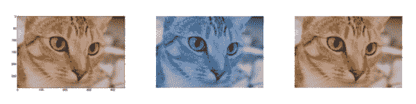
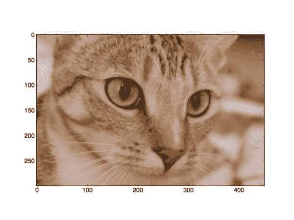

# 如何显示 Matplotlib RGB 图像

> 原文：<https://pyimagesearch.com/2014/11/03/display-matplotlib-rgb-image/>

[](https://pyimagesearch.com/wp-content/uploads/2014/05/matplotlib-rgb-header.jpg)

所以我们知道 matplotlib 在生成图形和数字方面非常棒。

但是如果我们想要显示一个简单的 RGB 图像呢？我们能用 matplotlib 做到吗？

当然啦！

这篇博客文章将向你展示如何用几行代码显示 Matplotlib RGB 图像……同时也澄清了你在一起使用 OpenCV 和 Matplotlib 时可能遇到的任何警告。

# 教程:如何显示 Matplotlib RGB 图像

好吧，我们别浪费时间了。让我们跳到一些代码中:

```py
>>> import matplotlib.pyplot as plt
>>> import matplotlib.image as mpimg
>>> image = mpimg.imread("chelsea-the-cat.png")
>>> plt.imshow(image)
>>> plt.show()

```

我们要做的第一件事是导入我们的`matplotlib`包。然后我们将导入`matplotlib`的`image`子包，为了方便起见，将其别名为`mpimg`。这个子程序包处理 matplotlib 的图像操作。

对`imread`方法的简单调用将我们的图像作为一个多维 NumPy 数组加载(每个数组分别对应一个红色、绿色和蓝色组件),然后`imshow`将我们的图像显示到我们的屏幕上。

我们可以在下面看到我们的图像:

[](https://pyimagesearch.com/wp-content/uploads/2014/05/matplotlib-rgb-with-axis.jpg)

**Figure 1:** Displaying a Matplotlib RGB image (note how the axes are labeled).

这是一个好的开始，但是去掉编号的轴怎么样呢？

```py
plt.axis("off")
plt.imshow(image)
plt.show()

```

通过调用`plt.axis("off")`,我们可以移除编号轴。

执行我们的代码，我们最终会得到:

[](https://pyimagesearch.com/wp-content/uploads/2014/05/matplotlib-rgb-no-axis.jpg)

**Figure 2:** Displaying a Matplotlib RGB image, this time, turning off our axes.

没什么！您现在可以看到编号的轴已经消失了。

# OpenCV 警告

但是当然，我们在这个博客上经常使用 OpenCV。

因此，让我们使用 OpenCV 加载一个图像，并用 matplotlib 显示它:

```py
import cv2
image = cv2.imread("chelsea-the-cat.png")
plt.axis("off")
plt.imshow(image)
plt.show()

```

同样，代码很简单。

但是结果并不像预期的那样:

[](https://pyimagesearch.com/wp-content/uploads/2014/05/matplotlib-rgb-reversed.jpg)

**Figure 3:** Loading an image with OpenCV and displaying it with matplotlib.

啊哦。这可不好。

我们图像的颜色明显不对！

这是为什么呢？

答案在于对 OpenCV 的警告。

OpenCV 将 RGB 图像表示为多维 NumPy 数组… ***但是顺序相反！***

这意味着图像实际上是以 BGR 顺序而不是 RGB 来表示的！

不过有一个简单的解决方法。

我们需要做的就是将图像从 BGR 转换成 RGB:

```py
plt.axis("off")
plt.imshow(cv2.cvtColor(image, cv2.COLOR_BGR2RGB))
plt.show()

```

运行我们的脚本，我们可以看到我们的图像颜色现在是正确的:

[](https://pyimagesearch.com/wp-content/uploads/2014/05/matplotlib-rgb-fixed.jpg)

**Figure 4:** When using OpenCV and displaying an image using matplotlib, be sure to call cv2.cvtColor first.

如我所说，显示 matplotlib RGB 图像没什么！

# 摘要

在这篇博文中，我展示了如何显示 matplotlib RGB 图像。

我们利用`matplotlib`、`pyplot`和`mpimg`来加载和显示我们的图像。

要删除图形的轴，调用`plt.axis("off")`。

只要记住，如果你使用 OpenCV，你的图像是以 BGR 顺序存储的，而不是 RGB！

只要你记住这一点，你就不会有任何问题！