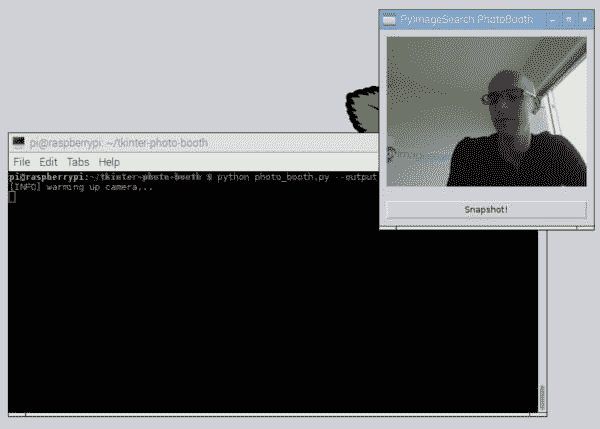
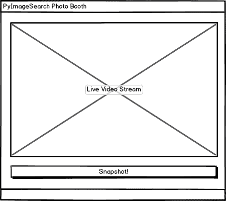
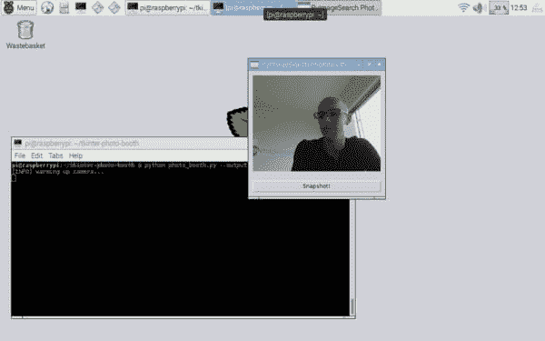
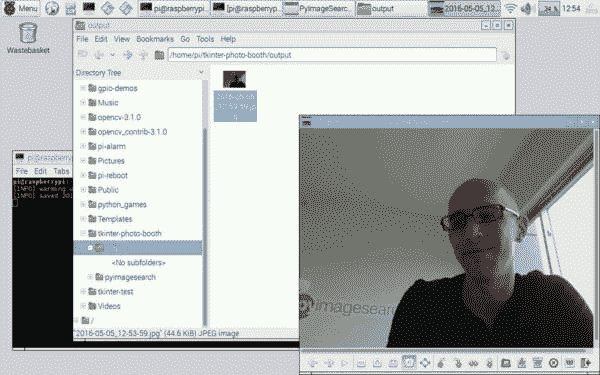

# 用 OpenCV 和 Tkinter 显示视频提要

> 原文：<https://pyimagesearch.com/2016/05/30/displaying-a-video-feed-with-opencv-and-tkinter/>



我在[上周的博客文章](https://pyimagesearch.com/2016/05/23/opencv-with-tkinter/)中说过，今天我会在这里再说一遍——***无论怎么想象，我都不是 GUI 开发人员。***

我想我对 GUI 开发的厌恶可以追溯到高中早期，那时我正在自学 Java 具体来说，如何编写 Java 小程序(还记得什么是该死的噩梦小程序吗？)利用`javax`和摆动。

那是我一生中的黑暗时期。

我经常生病，错过了很多学校。

有许多家庭问题正在发生。

我还没有从青少年成长为成年人，陷入青春期的痛苦之中——一个笨拙的十几岁的男孩，沉醉于冷漠，同时缺乏任何方向或目标。

在我(早期)编程生涯的那一点上，我转向 Java 和 GUI 开发，作为逃避的最后努力，就像海洛因成瘾者转向勺子和针寻求几分钟的缓解，只是为了在最初的兴奋消退后世界又会崩溃。

你看，我发现开发 GUI 应用程序很有趣。这是*上瘾*。它完全背离了大家太熟悉的命令行界面。

但是这种“乐趣”是有代价的。

冗长的代码块来完成哪怕是微小的简单任务。奇怪的编译错误。通宵达旦地试图解决*比赛状况*、*回拨地狱*和*线程噩梦，即使是一个有经验的女裁缝也无法解开*。

从那以后，我总是(在精神上)将 GUI 开发与痛苦、艰难的时期联系起来。这是一扇我从… ***到现在都没有打开过的门。***

在这篇博文中，我将直面我麻烦的过去，写一点代码用 OpenCV 和 Tkinter 显示一个视频提要。最终，这个 GUI 应用程序将允许我们创建一个类似“照片亭”的东西，让我们通过点击一个按钮就可以将视频流中的帧保存到磁盘上。

你会发现，我*有点儿失败了*，但是我想和你分享我的经验——希望更多有经验的 GUI 开发者能给我指出正确的方向。

## 用 OpenCV 和 Tkinter 显示视频提要

我假设你已经阅读了上周关于使用 OpenCV 和 Tkinter 的博文。在本教程中，我*详细介绍了 Tkinter 是什么* , *如何安装它*，以及*如何编写一个简单的 Tkinter GUI 应用程序*，它可以显示通过 OpenCV 加载的图像。

今天，我们将在上周帖子中获得的知识的基础上，并结合一些在早期博客帖子中讨论的特殊技术，具体来说，[如何以高效、线程化的方式访问视频流](https://pyimagesearch.com/2016/01/04/unifying-picamera-and-cv2-videocapture-into-a-single-class-with-opencv/)。

***注意:**我认为我对利用线程流的渴望最终导致了这个应用程序的问题。正如我从其他来源读到的， [Tkinter 没有用线程放置尼斯](http://stackoverflow.com/questions/14168346/python-tkinter-with-threading-causing-crash)。*

### 模仿照片亭应用程序

正如我们在上周的文章中所做的，让我们从创建应用程序的模型开始。下面你可以看到我们的 GUI 应用程序的主屏幕:



**Figure 1:** A mockup of our Photo Both Application. This GUI will contain two elements: an image panel where the frames of our live video stream will be displayed, followed by a button, that allows us to save the current frame to disk.

该屏幕有两个元素。最下面的*第一张*，是我们的 ***快照！*** 按钮。每次点击该按钮，从视频流中读取的当前帧将被存储在磁盘上。

第二个元素*位于第一个元素的正上方，是视频流本身的一个*实时显示*。*

我们的目标是编写 Python + OpenCV + Tkinter 代码来连续轮询视频流中的帧，更新实时显示，然后在单击快照按钮时处理将当前帧写入文件。

### 创建照片亭应用程序

现在我们已经创建了项目的模型，让我们继续并开始编码 GUI。打开一个新文件，将其命名为`photoboothapp.py`，并插入以下代码:

```py
# import the necessary packages
from __future__ import print_function
from PIL import Image
from PIL import ImageTk
import Tkinter as tki
import threading
import datetime
import imutils
import cv2
import os

```

**第 2-10 行**处理导入我们需要的 Python 包。我们需要`Image`类的`PIL`，这是`ImageTk`和`Label`类在 Tkinter GUI 中显示图像/帧所需要的。

我们还需要 Python 的`threading`包来产生一个线程(独立于 Tkinter 的`mainloop`)，用于处理视频流中新帧的轮询。

`datetime`模块将用于为我们保存到磁盘的每一帧构建一个人类可读的时间戳文件名。

最后，我们将需要 [imutils](https://github.com/jrosebr1/imutils) ，我的便利函数集合用来使 OpenCV 工作更容易。如果您的系统上还没有安装`imutils`，让`pip`为您安装软件包:

```py
$ pip install imutils

```

让我们继续我们的`PhotoBoothApp`类的定义:

```py
class PhotoBoothApp:
	def __init__(self, vs, outputPath):
		# store the video stream object and output path, then initialize
		# the most recently read frame, thread for reading frames, and
		# the thread stop event
		self.vs = vs
		self.outputPath = outputPath
		self.frame = None
		self.thread = None
		self.stopEvent = None

		# initialize the root window and image panel
		self.root = tki.Tk()
		self.panel = None

```

**第 13 行**定义了我们的`PhotoBoothApp`类的构造函数。这个构造函数需要两个参数— `vs`，它是一个`VideoStream`的实例化，和`outputPath`，我们想要存储我们捕获的快照的路径。

**第 17 行和第 18 行**存储我们的视频流对象和输出路径，而**第 19-21 行**对最近读取的`frame`、用于控制我们的视频轮询循环的`thread`和用于指示何时应该停止帧池线程的`stopEvent``thread.Event`对象执行一系列初始化。

然后我们初始化`root` Tkinter 窗口和用于在 GUI 中显示我们的框架的面板(**第 24 行和第 25 行**)。

我们继续下面的构造函数的定义:

```py
		# create a button, that when pressed, will take the current
		# frame and save it to file
		btn = tki.Button(self.root, text="Snapshot!",
			command=self.takeSnapshot)
		btn.pack(side="bottom", fill="both", expand="yes", padx=10,
			pady=10)

		# start a thread that constantly pools the video sensor for
		# the most recently read frame
		self.stopEvent = threading.Event()
		self.thread = threading.Thread(target=self.videoLoop, args=())
		self.thread.start()

		# set a callback to handle when the window is closed
		self.root.wm_title("PyImageSearch PhotoBooth")
		self.root.wm_protocol("WM_DELETE_WINDOW", self.onClose)

```

**第 29-32 行**创建我们的 ***快照！*** 按钮，单击该按钮将调用`takeSnapshot`方法(我们将在本例中稍后定义)。

为了从我们的视频流中连续轮询帧并更新 GUI 中的`panel`，我们需要生成一个单独的线程来监控我们的视频传感器并获取最近读取的帧(**第 36-38 行**)。

最后，我们设置了一个回调函数来处理窗口关闭时的情况，这样我们就可以执行清理操作，并且(理想情况下)停止视频轮询线程并释放所有资源(不幸的是，这在实践中并没有像我预期的那样工作)。

接下来，让我们定义`videoLoop`函数，顾名思义，它监视视频流中的新帧:

```py
	def videoLoop(self):
		# DISCLAIMER:
		# I'm not a GUI developer, nor do I even pretend to be. This
		# try/except statement is a pretty ugly hack to get around
		# a RunTime error that Tkinter throws due to threading
		try:
			# keep looping over frames until we are instructed to stop
			while not self.stopEvent.is_set():
				# grab the frame from the video stream and resize it to
				# have a maximum width of 300 pixels
				self.frame = self.vs.read()
				self.frame = imutils.resize(self.frame, width=300)

				# OpenCV represents images in BGR order; however PIL
				# represents images in RGB order, so we need to swap
				# the channels, then convert to PIL and ImageTk format
				image = cv2.cvtColor(self.frame, cv2.COLOR_BGR2RGB)
				image = Image.fromarray(image)
				image = ImageTk.PhotoImage(image)

				# if the panel is not None, we need to initialize it
				if self.panel is None:
					self.panel = tki.Label(image=image)
					self.panel.image = image
					self.panel.pack(side="left", padx=10, pady=10)

				# otherwise, simply update the panel
				else:
					self.panel.configure(image=image)
					self.panel.image = image

		except RuntimeError, e:
			print("[INFO] caught a RuntimeError")

```

正如我在这篇博文的开头所说——我不是 GUI 开发人员，我对 Tkinter 也没有什么经验。为了避开 Tkinter 抛出的`RunTime`异常(可能是由于线程)，我求助于*真正的*丑陋的`try/except`黑客来捕捉`RunTime`错误。我试图解决这个 bug，但在几个小时没有任何进展后，我最终放弃了，求助于这个黑客。

**第 51 行**开始一个循环，用于从我们的视频传感器读取帧。这个循环将继续，直到`stopEvent`被设置，指示线程应该返回到它的父线程。

**第 54 行和第 55 行**从我们的视频流中读取`frame`，并使用`imutils`库调整其大小。

我们现在需要对我们的图像进行一些格式化。首先，OpenCV 以 BGR 顺序表示图像；然而，PIL 希望图像以 RGB 顺序存储。为了解决这个问题，我们需要通过调用`cv2.cvtColor`来交换频道。从那里，我们将`frame`转换成 PIL/枕头格式，然后是`ImageTk`格式。在 Tkinter 窗口中显示图像时需要`ImageTk`格式。

如果我们的`panel`没有初始化，**第 65-68 行**通过创建`Label`来处理实例化它。我们特别注意第 67 行的**来存储对`image`的引用，确保 Python 的垃圾收集例程不会在`image`显示在我们的屏幕上之前回收它。**

否则，如果`panel`已经被初始化，我们简单地用第 71-73 行**上最近的`image`来更新它。**

现在，让我们来看看`takeSnapshot`回调:

```py
	def takeSnapshot(self):
		# grab the current timestamp and use it to construct the
		# output path
		ts = datetime.datetime.now()
		filename = "{}.jpg".format(ts.strftime("%Y-%m-%d_%H-%M-%S"))
		p = os.path.sep.join((self.outputPath, filename))

		# save the file
		cv2.imwrite(p, self.frame.copy())
		print("[INFO] saved {}".format(filename))

```

当*“快照！”点击*按钮，调用`takeSnapshot`函数。**第 81-83 行**基于当前时间戳为`frame`生成一个文件名。

然后我们通过调用`cv2.imwrite`将`frame`保存到磁盘的**行 86** 上。

最后，我们可以定义我们的最后一个方法，`onClose`:

```py
	def onClose(self):
		# set the stop event, cleanup the camera, and allow the rest of
		# the quit process to continue
		print("[INFO] closing...")
		self.stopEvent.set()
		self.vs.stop()
		self.root.quit()

```

当我们点击 GUI 中的*“X”*关闭应用程序时，这个函数被调用。首先，我们设置`stopEvent`，这样我们的无限`videoLoop`就停止了，线程返回。然后我们清理视频流指针，让`root`应用程序完成关闭。

### 构建照相亭驱动程序

创建 Photo Booth 的最后一步是构建驱动程序脚本，用于初始化`VideoStream`和`PhotoBoothApp`。为了创建驱动程序脚本，我将下面的代码添加到一个名为`photo_booth.py`的文件中:

```py
# import the necessary packages
from __future__ import print_function
from pyimagesearch.photoboothapp import PhotoBoothApp
from imutils.video import VideoStream
import argparse
import time

# construct the argument parse and parse the arguments
ap = argparse.ArgumentParser()
ap.add_argument("-o", "--output", required=True,
	help="path to output directory to store snapshots")
ap.add_argument("-p", "--picamera", type=int, default=-1,
	help="whether or not the Raspberry Pi camera should be used")
args = vars(ap.parse_args())

# initialize the video stream and allow the camera sensor to warmup
print("[INFO] warming up camera...")
vs = VideoStream(usePiCamera=args["picamera"] > 0).start()
time.sleep(2.0)

# start the app
pba = PhotoBoothApp(vs, args["output"])
pba.root.mainloop()

```

**第 9-14 行**处理解析我们脚本的命令行参数。第一个命令行参数`--output`，是 ***必需的*** 。`--output`开关只是我们想要存储输出快照的路径。

然后我们有`--picamera`，一个 ***可选的*** 开关，用于指示是否应该使用树莓派相机模块。默认情况下，这个值将是 *-1* ，表示应该使用我们的内置/USB 网络摄像头。如果我们想使用 Pi 摄像机，我们可以指定一个值 *> 0* 。在这篇博文中，你可以了解更多关于这个参数的信息，以及如何结合`VideoStream`类[使用它。](https://pyimagesearch.com/2016/01/04/unifying-picamera-and-cv2-videocapture-into-a-single-class-with-opencv/)

**第 18 和 19 行**初始化我们的`VideoStream`并允许摄像机传感器预热。

最后，**线 22 和 23** 线启动`PhotoBoothApp`。

### 经营我们的照相亭

要运行我们的 photo booth 应用程序，请确保您已经安装了必要的库和包(详见[之前的博文](https://pyimagesearch.com/2016/05/23/opencv-with-tkinter/))。确保系统配置正确后，执行以下命令:

```py
$ python photo_booth.py --output output

```

摄像头传感器预热后，您应该会看到以下显示:



**Figure 2:** Once our app launches, you should see the live stream of the camera displayed in the Tkinter window.

注意我们的 GUI 是如何包含来自网络摄像头的*实时流*以及用于触发快照的*按钮*的。

点击快照按钮后，我可以看到我的`output`目录中包含了我刚刚拍摄的照片:



**Figure 3:** Whenever I click the “Snapshot!” button, the current frame is saved to my local disk.

下面我放了一个短片来演示 Photo Booth 应用程序:

<https://www.youtube.com/embed/CMwin1SFb-I?feature=oembed>