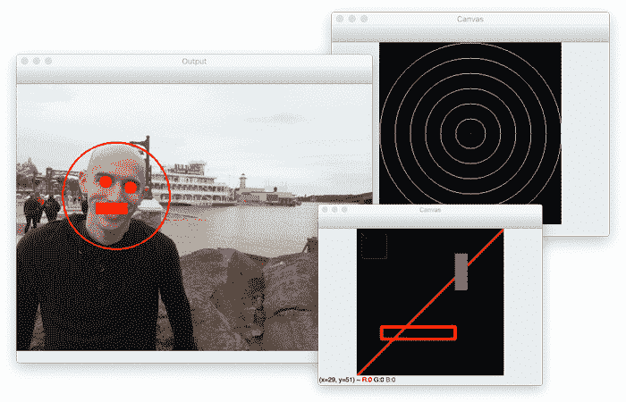
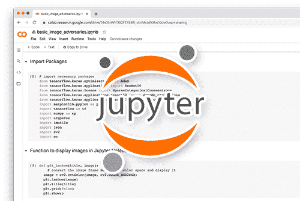
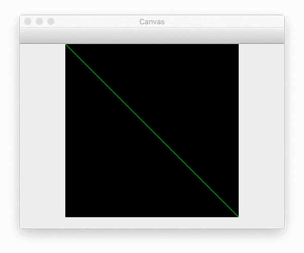
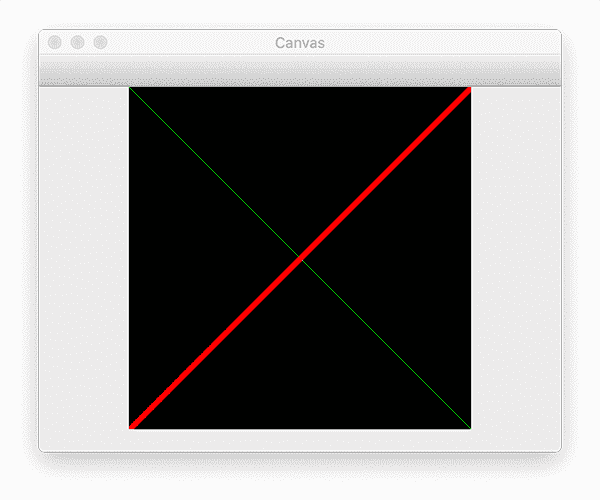
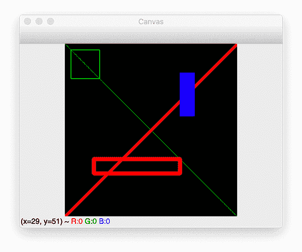
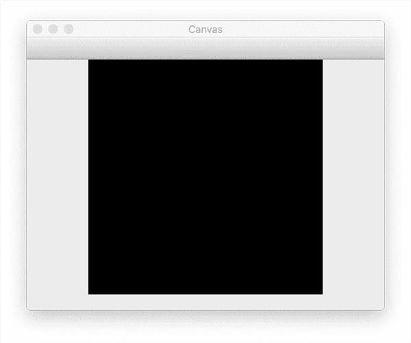
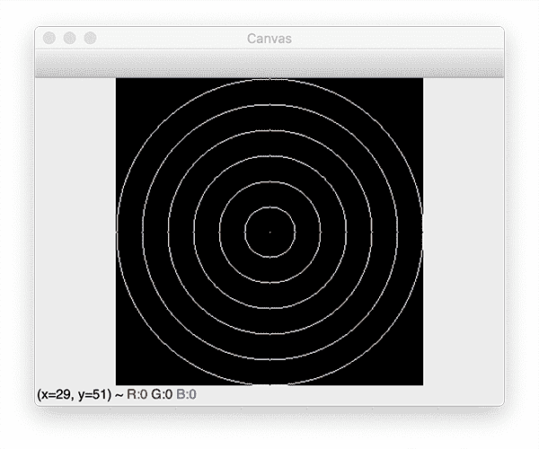
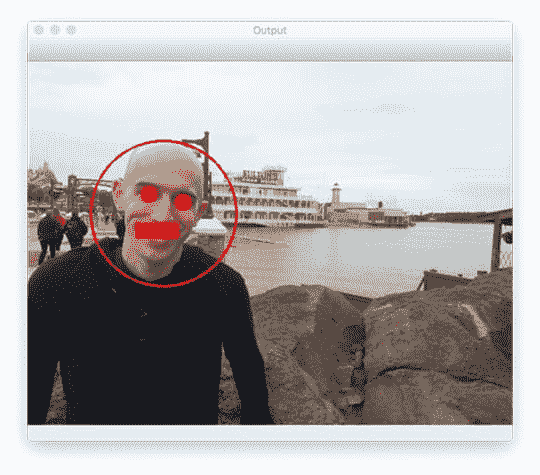

# 用 OpenCV 绘图

> 原文：<https://pyimagesearch.com/2021/01/27/drawing-with-opencv/>

在本教程中，你将学习如何使用 OpenCV 的基本绘图功能。您将学习如何使用 OpenCV 来绘制:

*   线
*   长方形
*   环



您还将学习如何使用 OpenCV 在图像和用 NumPy 初始化的空白/空数组上绘图。

**学习如何使用 OpenCV 的基本绘图功能，** ***继续阅读。***

## **用 OpenCV 绘图**

在本教程的第一部分，我们将简要回顾 OpenCV 的绘图功能。

然后，我们将配置我们的开发环境，并检查我们的项目目录结构。

完成审查后，我们将继续实现两个 Python 脚本:

1.  `basic_drawing.py`
2.  `image_drawing.py`

这些脚本将帮助您理解如何使用 OpenCV 执行基本的绘图功能。

本指南结束时，您将了解如何使用 OpenCV 绘制直线、圆和矩形。

### **OpenCV 中的绘图功能**

OpenCV 有许多绘图函数，您可以使用它们来绘制各种形状，包括不规则形状的多边形，但是您将看到的三个最常见的 OpenCV 绘图函数是:

1.  `cv2.line`:在图像上画一条线，从指定的 *(x，y)* 坐标开始，到另一个 *(x，y)* 坐标结束
2.  `cv2.circle`:在由中心 *(x，y)* 坐标和提供的半径指定的图像上画一个圆
3.  `cv2.rectangle`:在由*左上角*和*右下角*指定的图像上绘制一个矩形 *(x，y)*-坐标

今天我们将讨论这三个绘图功能。

但是，值得注意的是，还有更高级的 OpenCV 绘图函数，包括:

1.  `cv2.ellipse`:在图像上画一个椭圆
2.  `cv2.polylines`:绘制一组 *(x，y)* 坐标指定的多边形轮廓
3.  `cv2.fillPoly`:绘制多边形，但不是绘制轮廓，而是填充多边形
4.  `cv2.arrowedLine`:画一个箭头，从起点 *(x，y)* 坐标指向终点 *(x，y)* 坐标

这些 OpenCV 绘图函数不太常用，但仍然值得注意。我们偶尔会在 PyImageSearch 博客上使用它们。

### **配置您的开发环境**

为了遵循本指南，您需要在您的系统上安装 OpenCV 库。

幸运的是，OpenCV 可以通过 pip 安装:

```py
$ pip install opencv-contrib-python
```

**如果你需要帮助为 OpenCV 配置开发环境，我*强烈推荐*阅读我的** [***pip 安装 OpenCV* 指南**](https://pyimagesearch.com/2018/09/19/pip-install-opencv/)——它将在几分钟内让你的系统启动并运行。

### **在配置开发环境时遇到了问题？**

[](https://pyimagesearch.com/pyimagesearch-plus/)

**Figure 1:** Having trouble configuring your development environment? Want access to pre-configured Jupyter Notebooks running on Google Colab? Be sure to join [PyImageSearch Plus](https://pyimagesearch.com/pyimagesearch-plus/) — your system will be up and running with this tutorial in a matter of minutes.

说了这么多，你是:

*   时间紧迫？
*   了解你雇主的行政锁定系统？
*   想要跳过与命令行、包管理器和虚拟环境斗争的麻烦吗？
*   准备好在您的 Windows、macOS 或 Linux 系统上运行代码*了吗*？

那今天就加入 [PyImageSearch 加](https://pyimagesearch.com/pyimagesearch-plus/)吧！

**获得本教程的 Jupyter 笔记本和其他 PyImageSearch 指南，这些指南是** ***预先配置的*** **，可以在您的网络浏览器中运行在 Google Colab 的生态系统上！**无需安装。

最棒的是，这些 Jupyter 笔记本可以在 Windows、macOS 和 Linux 上运行！

### **项目结构**

让我们从查看 OpenCV 绘图项目的项目目录结构开始:

```py
$ tree . --dirsfirst
.
├── adrian.png
├── basic_drawing.py
└── image_drawing.py

0 directories, 3 files
```

我们今天要复习两个 Python 脚本:

1.  初始化一个空的 NumPy 数组，并利用 OpenCV 绘制线条、圆形和矩形
2.  `image_drawing.py`:从磁盘加载`adrian.png`，然后在图像上绘制(而不是空的/空白的 NumPy 数组画布)。

我们现在准备开始了！

### **用 OpenCV 实现基本绘图功能**

在我们绘制实际图像之前，让我们首先学习如何初始化一个空的 NumPy 数组/图像并在其上绘制。

打开项目目录结构中的`basic_drawing.py`文件，让我们开始工作。

```py
# import the necessary packages
import numpy as np
import cv2

# initialize our canvas as a 300x300 pixel image with 3 channels
# (Red, Green, and Blue) with a black background
canvas = np.zeros((300, 300, 3), dtype="uint8")
```

**第 2 行和第 3 行**导入我们将要使用的包。

作为一种快捷方式，我们将为`numpy`创建一个别名为`np`。您将在所有利用 NumPy 的 PyImageSearch 教程中看到这种约定(事实上，您在 Python 社区中也会经常看到这种约定！)

我们还将导入`cv2`，因此我们可以访问 OpenCV 库。

初始化我们的图像是在**线 7** 上处理的。我们使用`np.zeros`方法构造一个 300 行 300 列的 NumPy 数组，得到一个 *300 x 300* 像素的图像。我们还为 3 个通道分配空间——红色、绿色和蓝色各一个。顾名思义，`np.zeros`方法用初始值零填充数组中的每个元素。

**其次，需要注意的是`np.zeros`方法的第二个参数:数据类型`dtype`。**

因为我们用范围*【0，255】*内的像素来表示我们的图像，所以我们必须使用 8 位无符号整数，或`uint8`。我们可以使用许多其他的数据类型(常见的包括 32 位整数和 32 位和 64 位浮点数)，但是对于本课中的大多数例子，我们将主要使用`uint8`。

现在我们已经初始化了画布，我们可以开始绘制了:

```py
# draw a green line from the top-left corner of our canvas to the
# bottom-right
green = (0, 255, 0)
cv2.line(canvas, (0, 0), (300, 300), green)
cv2.imshow("Canvas", canvas)
cv2.waitKey(0)

# draw a 3 pixel thick red line from the top-right corner to the
# bottom-left
red = (0, 0, 255)
cv2.line(canvas, (300, 0), (0, 300), red, 3)
cv2.imshow("Canvas", canvas)
cv2.waitKey(0)
```

我们在第 11 行**做的第一件事是定义一个用于表示颜色“绿色”的元组然后，我们从图像左上角的点 *(0，0)*(T4)到图像右下角的点 *(300，300)* (在第 12 行**处)画一条绿线。****

为了画线，我们使用了`cv2.line`方法:

*   这个方法的第一个参数是我们将要绘制的图像。在这种情况下，是我们的`canvas`。
*   **第二个参数是该行的起点。**我们选择从图像左上角的*开始我们的行，在点 *(0，0)*——同样，记住 Python 语言是零索引的。*
*   *我们还需要为该行提供一个终点(第三个参数)。我们定义我们的终点为 *(300，300)* ，图像右下角的*。**
*   ****最后一个参数是我们的线的颜色**(在本例中是绿色)。**第 13 和 14 行**显示我们的图像，然后等待按键(见**图 2** )。**

**

**Figure 2:** Drawing lines with OpenCV.

如你所见，使用`cv2.line`函数非常简单！但是在`cv2.line`方法中还有一个重要的参数需要考虑:*厚度。*

在**第 18-21 行，**我们将红色定义为一个元组(同样是 BGR 格式，而不是 RGB 格式)。然后我们从图像右上角的*到左下角的*画一条红线。该方法的最后一个参数控制线条的粗细——我们决定将粗细设为 3 个像素。我们再次显示我们的图像并等待按键:**



**Figure 3:** Drawing multiple lines with OpenCV.

画一条线很简单。现在我们可以继续画矩形了。查看下面的代码了解更多细节:

```py
# draw a green 50x50 pixel square, starting at 10x10 and ending at 60x60
cv2.rectangle(canvas, (10, 10), (60, 60), green)
cv2.imshow("Canvas", canvas)
cv2.waitKey(0)

# draw another rectangle, this one red with 5 pixel thickness
cv2.rectangle(canvas, (50, 200), (200, 225), red, 5)
cv2.imshow("Canvas", canvas)
cv2.waitKey(0)

# draw a final rectangle (blue and filled in )
blue = (255, 0, 0)
cv2.rectangle(canvas, (200, 50), (225, 125), blue, -1)
cv2.imshow("Canvas", canvas)
cv2.waitKey(0)
```

在**的第 24 行**，我们使用了`cv2.rectangle`的方法。这个方法的签名与上面的`cv2.line`方法相同，但是无论如何让我们研究一下每个参数:

*   **第一个参数是我们要在其上绘制矩形的图像。**我们想利用我们的`canvas`，所以我们把它传递到方法中。
*   **第二个参数是我们矩形**的起始位置 *(x，y)*—这里，我们从点 *(10，10)* 开始矩形。
*   然后，我们必须为矩形提供一个结束点 *(x，y)* 。我们决定在 *(60，60)* 处结束我们的矩形，定义一个 *50 x 50* 像素的区域(花一秒钟让自己相信最终的矩形是 *50 x 50* )。
*   **最后，最后一个参数是我们要绘制的矩形的颜色。**这里，我们画一个绿色的长方形。

正如我们可以控制线条的粗细一样，我们也可以控制矩形的粗细。第 29 行提供了厚度参数。这里，我们画一个 5 像素厚的红色矩形，从点 *(50，200)* 开始，到 *(200，225)结束。*

至此，我们只画出了一个长方形的轮廓。我们如何画一个“完全填充”的矩形？

**简单。我们只是为厚度参数传递了一个负值。**

演示了如何绘制一个纯色的矩形。我们画一个蓝色的矩形，从 *(200，50)* 开始，到 *(225，125)* 结束。通过指定`-1`(或者使用`cv2.FILLED`关键字)作为厚度，我们的矩形被绘制为纯蓝色。

**图 4** 显示绘制我们的线条和矩形的完整输出:



**Figure 4:** Using OpenCV to draw lines and rectangles.

如您所见，输出与我们的代码相匹配。我们可以从*左上角*到*右下角*画一条*绿线*，然后从*右上角*到*左下角*画一条*粗红线*。

我们还能够画出一个绿色矩形 T1，一个稍微 T2 粗一点的红色矩形 T3，以及一个完全填充的蓝色矩形 T4。

这很好，但是圆圈呢？

怎样才能用 OpenCV 画圆？

画圆和画矩形一样简单，但函数参数略有不同:

```py
# re-initialize our canvas as an empty array, then compute the
# center (x, y)-coordinates of the canvas
canvas = np.zeros((300, 300, 3), dtype="uint8")
(centerX, centerY) = (canvas.shape[1] // 2, canvas.shape[0] // 2)
white = (255, 255, 255)

# loop over increasing radii, from 25 pixels to 150 pixels in 25
# pixel increments
for r in range(0, 175, 25):
	# draw a white circle with the current radius size
	cv2.circle(canvas, (centerX, centerY), r, white)

# show our work of art
cv2.imshow("Canvas", canvas)
cv2.waitKey(0)
```

在**第 41 行，**我们将画布重新初始化为空白:



**Figure 5:** Re-initializing our canvas as a blank image.

**第 42 行**计算两个变量:`centerX`和`centerY`。这两个变量代表图像中心的 *(x，y)*-坐标。

我们通过检查 NumPy 数组的形状来计算中心，然后除以 2:

*   图像的高度可以在`canvas.shape[0]`(行数)中找到
*   宽度在`canvas.shape[1]`(列数)中找到

最后，**行 43** 定义了一个白色像素(即，红色、绿色和蓝色分量的每一个的桶都是“满的”)。

现在，让我们画一些圆圈！

在**第 45 行，**我们循环了几个半径值，从`0`开始，到`150`结束，每一步增加`25`。`range`功能是*独占*；因此，我们指定停止值为`175`而不是`150`。

要亲自演示这一点，请打开 Python shell，并执行以下代码:

```py
$ python
>>> list(range(0, 175, 25))
[0, 25, 50, 75, 100, 125, 150]
```

注意`range`的输出如何在`150`停止，并且不包括`175`。

**第 49 行**处理圆的实际绘制:

*   第一个参数是我们的`canvas`，我们想要在上面画圆的图像。
*   然后我们需要提供一个点，我们将围绕这个点画一个圆。我们传入一个元组`(centerX, centerY)`,这样我们的圆就会以图像的中心为中心。
*   第三个参数是我们想要画的圆的半径`r`。
*   最后，我们传入圆圈的颜色:在本例中，是白色。

**第 52 行和第 53 行**然后显示我们的图像并等待按键:



**Figure 6:** Drawing a bullseye with OpenCV.

查看**图 6** ，你会看到我们已经画了一个简单的靶心！图像正中心的“点”是以半径 0 绘制的。较大的圆是从我们的`for`循环中以不断增加的半径尺寸画出的。

不算太坏。但是我们还能做什么呢？

让我们画一些抽象画:

```py
# re-initialize our canvas once again
canvas = np.zeros((300, 300, 3), dtype="uint8")

# let's draw 25 random circles
for i in range(0, 25):
	# randomly generate a radius size between 5 and 200, generate a
	# random color, and then pick a random point on our canvas where
	# the circle will be drawn
	radius = np.random.randint(5, high=200)
	color = np.random.randint(0, high=256, size=(3,)).tolist()
	pt = np.random.randint(0, high=300, size=(2,))

	# draw our random circle on the canvas
	cv2.circle(canvas, tuple(pt), radius, color, -1)

# display our masterpiece to our screen
cv2.imshow("Canvas", canvas)
cv2.waitKey(0)
```

我们的代码从第 59 行的**开始，有更多的循环。这一次，我们不是在我们的半径大小上循环——相反，我们将绘制`25`随机圆，通过`np.random.randint`函数利用 NumPy 的随机数功能。**

要画一个随机的圆，我们需要生成三个值:圆的`radius`、圆的`color`和`pt` —将要画圆的地方的 *(x，y)*—坐标。

我们在第 63 行的**上生成一个*【5，200】*范围内的`radius`值。这个值控制我们的圆有多大。**

在**第 64 行**，我们随机生成一个`color`。我们知道，RGB 像素的颜色由范围*【0，255】*内的三个值组成。为了得到三个随机整数而不是一个整数，我们传递关键字参数`size=(3,)`，指示 NumPy 返回一个包含三个数字的列表。

最后，我们需要一个 *(x，y)*-中心点来画我们的圆。我们将再次使用 NumPy 的`np.random.randint`函数在*【0，300】*范围内生成一个点。

然后在第 68 行**上画出我们的圆，使用我们随机生成的`radius`、`color`和`pt`。注意我们是如何使用厚度`-1`的，所以我们的圆被绘制成纯色，而不仅仅是轮廓。**

**第 71 行和第 72 行**展示了我们的杰作，你可以在**图 7** 中看到:


**Figure 7:** Drawing multiple circles with OpenCV.

注意每个圆在画布上有不同的大小、颜色和位置。

### **OpenCV 基本绘图结果**

要执行我们的基本绘图脚本，请确保访问 ***“下载”*** 部分以检索源代码和示例图像。

从那里，您可以执行以下命令:

```py
$ python basic_drawing.py
```

您的输出应该与前一部分的输出相同。

### **使用 OpenCV 在图像上绘图**

到目前为止，我们只探索了在空白画布上绘制形状。但是如果我们想在一个*现有的图像上画形状呢？*

**原来，在现有图像上绘制形状的代码是** ***完全相同的*** **就好像我们在 NumPy 生成的空白画布上绘图一样。**

为了演示这一点，让我们看一些代码:

```py
# import the necessary packages
import argparse
import cv2

# construct the argument parser and parse the arguments
ap = argparse.ArgumentParser()
ap.add_argument("-i", "--image", type=str, default="adrian.png",
	help="path to the input image")
args = vars(ap.parse_args())
```

**第 2 行和第 3 行**导入我们需要的 Python 包，而**第 6-9 行**解析我们的命令行参数。

我们只需要一个参数`--image`，它是我们在磁盘上的输入图像的路径。默认情况下，我们将`--image`命令行参数设置为指向项目目录结构中的`adrian.png`图像。

```py
# load the input image from disk
image = cv2.imread(args["image"])

# draw a circle around my face, two filled in circles covering my
# eyes, and a rectangle over top of my mouth
cv2.circle(image, (168, 188), 90, (0, 0, 255), 2)
cv2.circle(image, (150, 164), 10, (0, 0, 255), -1)
cv2.circle(image, (192, 174), 10, (0, 0, 255), -1)
cv2.rectangle(image, (134, 200), (186, 218), (0, 0, 255), -1)

# show the output image
cv2.imshow("Output", image)
cv2.waitKey(0)
```

**第 12 行**从磁盘加载我们的`--image`。从那里，我们继续:

1.  在我的头(**线 16** )周围画一个*空的*圆(*不是*填充)
2.  画两个*填充的*圆圈遮住我的眼睛(**第 17 行和第 18 行**
3.  在我的嘴上画一个矩形

我们的最终输出`image`，然后显示在我们的屏幕上。

### **OpenCV 图像绘制结果**

让我们看看如何使用 OpenCV 在图像上绘制，而不是使用 NumPy 生成的“空白画布”。

首先访问本指南的 ***“下载”*** 部分，检索源代码和示例图像。

然后，您可以执行以下命令:

```py
$ python image_drawing.py
```



**Figure 8:** Drawing shapes on an image with OpenCV.

在这里，你可以看到我们在我的脸周围画了一个圆形，在我的眼睛上画了两个圆形，在我的嘴巴上画了一个矩形。

事实上，在从磁盘加载的*图像和*空白数字数组*上绘制形状*没有区别。只要我们的图像/画布可以表示为一个 NumPy 数组，OpenCV 也会在其上绘制。**

## **总结**

在本教程中，您学习了如何使用 OpenCV 绘图。具体来说，您学习了如何使用 OpenCV 来绘制:

*   线
*   环
*   长方形

使用`cv2.line`功能绘制线条。我们用 OpenCV 的`cv2.circle`函数画圆，用`cv2.rectangle`方法画矩形。

OpenCV 中还存在其他绘图功能。但是，这些是您最常使用的功能。

**要下载这篇文章的源代码(并在未来教程在 PyImageSearch 上发布时得到通知)，** ***只需在下面的表格中输入您的电子邮件地址！*****