# 我在 CUDAMat、深度信仰网络和 Python 方面的经验

> 原文：<https://pyimagesearch.com/2014/10/06/experience-cudamat-deep-belief-networks-python/>

[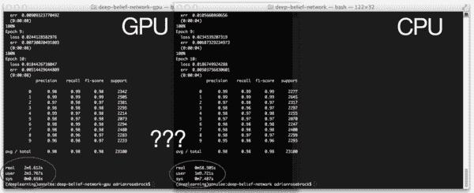](https://pyimagesearch.com/wp-content/uploads/2014/10/gpu_vs_cpu_performance.png)

拿纸巾。

这是我的 MacBook Pro、GPU 和 CUDAMat 库的一个尾巴——它没有一个美好的结局。

两周前，我发布了一篇关于深度学习和 Python 的入门指南。指南很棒，很受欢迎。我写得很开心。很多 PyImageSearch 的读者真的很喜欢它。

因此，作为本指南的自然后续，我想演示如何使用 GPU 来加速深度信念网络的训练(以前，只使用了 CPU)。

然而，我从来没有设置我的 MacBook Pro 来利用 GPU 进行计算处理。我认为这很好。这将成为一个很好的教程，我通过试错进行实验——并记录下我一路上的步骤，希望其他人会发现这个教程很有用。

简而言之就是:*我成功地安装了 CUDA 工具包、驱动程序和 CUDAMat。*

**然而**。

出于我无法理解的原因，在我的 GPU 上用 [nolearn](https://pythonhosted.org/nolearn/) 训练我的深度信念网络比在 CPU 上多花了 ***整整一分多钟*** 。说实话。我已经尝试了所有我能想到的方法。没有骰子。

仅仅因为我用的是 MacBook Pro，我的 GeForce GT 750m 的性能就不够好吗？我的配置有问题吗？我是不是漏了一个开关？

老实说，我不确定。

因此，如果有人能对这个问题有所了解，那就太好了！

但与此同时，我将继续写下我安装 CUDA 工具包、驱动程序和 CUDAMat 的步骤。

# 我在 OSX 使用 CUDAMat、深度信仰网络和 Python 的经历

因此，在您考虑使用显卡来加快训练时间之前，您需要确保满足 CUDA 工具包最新版本的所有先决条件(在撰写本文时，版本 6.5.18 是最新版本)，包括:

*   Mac OSX 10.8 或更高版本
*   gcc 或 Clang 编译器(如果您的系统上有 Xcode，这些应该已经安装好了)
*   支持 CUDA 的 GPU
*   NVIDIA CUDA 工具包

这个清单上的前两项检查起来很简单。最后一项，NVIDIA Cuda 工具包是一个简单的下载和安装，前提是你有一个支持 Cuda 的 GPU。

要检查你在 OSX 上是否有支持 CUDA 的 GPU，只需点击屏幕左上方的苹果图标，选择“关于这台 Mac”，然后是“更多信息”，然后是“系统报告”，最后是“图形/显示”标签。

它应该是这样的:

[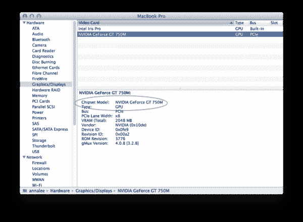](https://pyimagesearch.com/wp-content/uploads/2014/10/chipset.png)

在我的“芯片组型号”下，我看到我使用的是 NVIDIA GeForce GT 750m 显卡。

我们去看看 CUDA 工具包是否支持这个模型。

要执行检查，[只需点击此处查看支持的 GPU 列表](https://developer.nvidia.com/cuda-gpus)，并查看您的 GPU 是否在列表中。

果然，我的 750m 被列为受支持:

[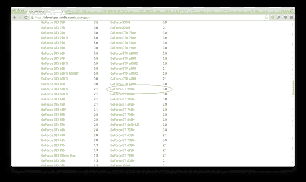](https://pyimagesearch.com/wp-content/uploads/2014/10/determing_graphics_card.png)

太棒了。那是一种解脱。至少我知道我的 MacBook Pro 是支持 CUDA 的。

下一步是下载并安装 CUDA 驱动程序、工具包和示例。

为此，只需进入 [CUDA 下载页面](https://developer.nvidia.com/cuda-downloads)，选择您的操作系统(在我的例子中是 OSX)，并下载安装程序:

[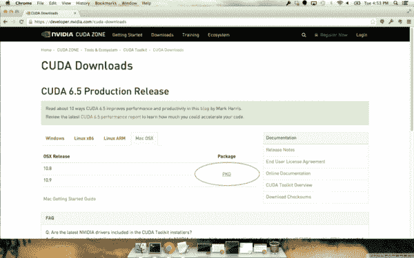](https://pyimagesearch.com/wp-content/uploads/2014/10/cuda_sdk_download.png)

在撰写本文时，CUDA 工具包的最新版本是 v6.5.18。这也是一个相当大的 800mb 的下载量，所以请确保您有一些带宽。

PKG 下载完成后，开始安装过程:

[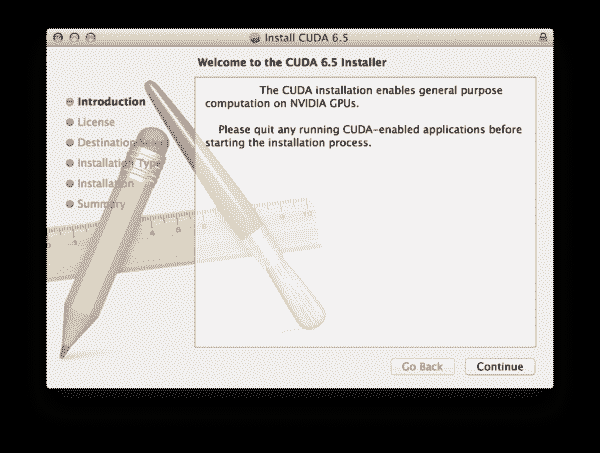](https://pyimagesearch.com/wp-content/uploads/2014/10/installing_cuda_sdk.png)对我来说，安装过程非常快捷，从打开安装程序到安装完成不到 30 秒。

现在 CUDA 工具包已经安装好了，您需要设置一些环境变量:

```py
export PATH=/Developer/NVIDIA/CUDA-6.5/bin:$PATH
export DYLD_LIBRARY_PATH=/Developer/NVIDIA/CUDA-6.5/lib:$DYLD_LIBRARY_PATH

```

我喜欢把这些放在我的`.bash_profile`文件中，这样我每次打开一个新的终端时都会设置我的路径:

[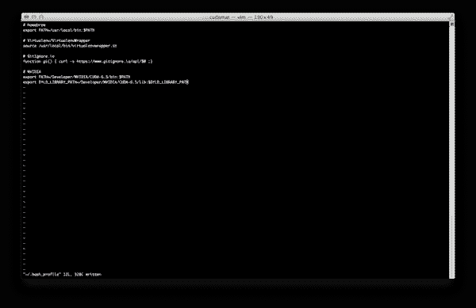](https://pyimagesearch.com/wp-content/uploads/2014/10/updating_paths.png)编辑完`.bash_profile`文件后，关闭终端并打开一个新的终端，这样您的更改就会被读取。或者。您可以执行`source ~/.bash_profile`来重新加载您的设置。

为了验证 CUDA 驱动程序确实安装正确，我执行了以下命令:

```py
$ kextstat | grep -i cuda

```

并收到以下输出:

[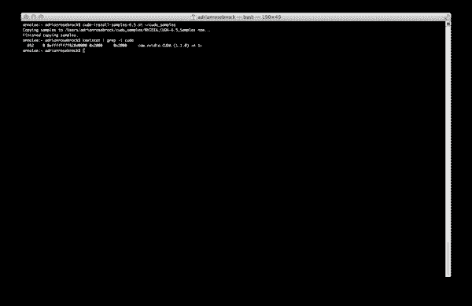](https://pyimagesearch.com/wp-content/uploads/2014/10/ensuring_cuda_installed.png)

果然，CUDA 司机如获至宝！

根据 OSX 的 [CUDA 入门指南，你现在应该打开你的**系统偏好**，进入**节能器**设置。](http://developer.download.nvidia.com/compute/cuda/6_5/rel/docs/CUDA_Getting_Started_Mac.pdf)

你会想要 ***取消*****自动图形开关**(这确保你的 GPU 将一直被利用)并且也将你的**系统睡眠**时间拖到**从不**。

[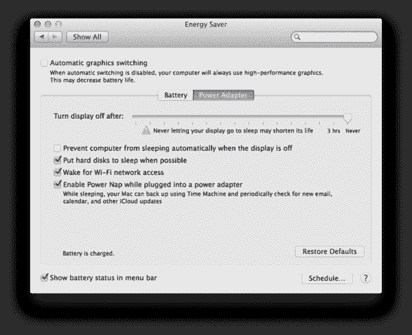](https://pyimagesearch.com/wp-content/uploads/2014/10/adjusting_settings.png)

注意:老实说，我尝试过这两种设置。他们都没有提高我的表现。

现在，让我们继续安装 CUDA 示例，这样我们就可以确保 CUDA 工具包正常工作，驱动程序正常工作。安装示例只是一个简单的 shell 脚本，如果您已经重新加载了您的`.bash_profile`，那么您的`PATH`上应该有这个脚本。

```py
$ cuda-install-samples-6.5.sh

```

这个脚本在我的主目录中安装了 CUDA 示例。以下脚本的输出并不令人兴奋，只是证明它成功了:

[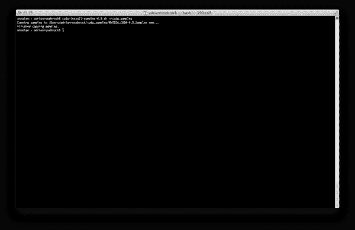](https://pyimagesearch.com/wp-content/uploads/2014/10/creating_cuda_samples.png)

在那里，我用以下命令编译了`deviceQuery`和`deviceBandwith`示例:

```py
$ make -C 1_Utilities/deviceQuery
$ make -C 1_Utilities/bandwidthTest

```

这两个例子编译时都没有任何错误。

运行编译过的`deviceQuery`程序，我能够确认 GPU 正在被拾取:

[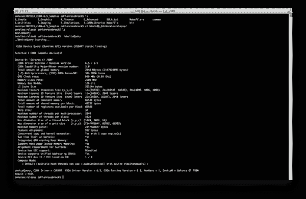](https://pyimagesearch.com/wp-content/uploads/2014/10/device_query.png)类似地，`deviceBandwith`的输出表明 GPU 是可访问的并且行为正确:

[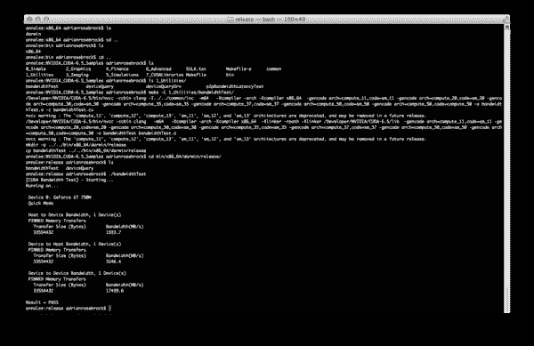](https://pyimagesearch.com/wp-content/uploads/2014/10/device_bandwidth.png)此时我已经开始觉得不错了。

CUDA 工具包、驱动程序和示例安装没有问题。我能够毫无问题地编译和执行这些示例。

因此，现在是时候继续前进到 [CUDAMat](https://github.com/cudamat/cudamat) 了，它允许通过 Python 在 GPU 上进行矩阵计算，从而(有望)大幅加快神经网络的训练时间。

我将 CUDAMat 克隆到我的系统中，并使用提供的`Makefile`顺利编译它:

[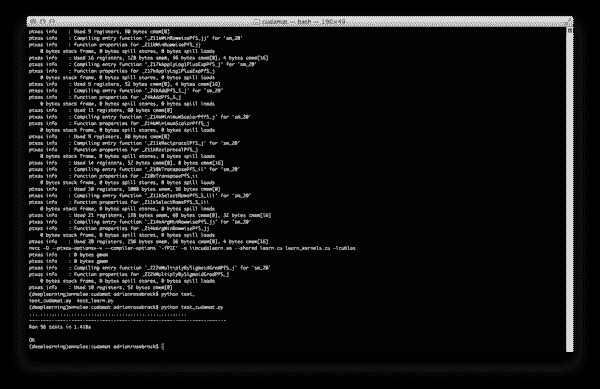](https://pyimagesearch.com/wp-content/uploads/2014/10/compling_cudamat.png)然后我运行`test_cudamat.py`以确保一切都运行顺利——确实看起来一切都运行良好。

现在我真的很兴奋！

CUDA 工具包安装完毕，CUDAMat 编译顺利，所有的 CUDAMat 测试都通过了。我将很快获得 GPU 加速！

至少我是这样认为的…

# 丑陋的结果

所以我们在这里。结果部分。

在 GPU 上训练我的深度信念网络*应该*产生显著的加速。

然而，在我的例子中，使用 GPU ***比使用 CPU***慢一分钟。

在下面报告的基准测试中，我使用了在 MNIST 数据集上训练的深度信念网络(DBN)的 [nolearn](https://pythonhosted.org/nolearn/) 实现。我的网络包括一个 784 个节点的输入层(每个节点对应一个 28 x 28 像素图像的输入像素)，一个 300 个节点的隐藏层，以及一个 10 个节点的输出层，每个节点对应一个可能的数字。我允许网络训练 10 个纪元。

我首先使用 CPU 获得了一个基线:

```py
(deeplearning)annalee:deep-belief-network adrianrosebrock$ time python dbn.py 
gnumpy: failed to import cudamat. Using npmat instead. No GPU will be used.
[X] downloading data...
[DBN] fitting X.shape=(46900, 784)
[DBN] layers [784, 300, 10]
[DBN] Fine-tune...
100%
Epoch 1:
  loss 0.2840207848
  err  0.0822020150273
  (0:00:04)
100%
Epoch 2:
  loss 0.171618364679
  err  0.0484332308743
  (0:00:04)
100%
Epoch 3:
  loss 0.123517068572
  err  0.0357112363388
  (0:00:04)
100%
Epoch 4:
  loss 0.0954012227419
  err  0.0278133538251
  (0:00:04)
100%
Epoch 5:
  loss 0.0675616915956
  err  0.0207906420765
  (0:00:04)
100%
Epoch 6:
  loss 0.0503800100696
  err  0.0156463456284
  (0:00:04)
100%
Epoch 7:
  loss 0.0398645849321
  err  0.0122096994536
  (0:00:04)
100%
Epoch 8:
  loss 0.0268006172097
  err  0.0083674863388
  (0:00:04)
100%
Epoch 9:
  loss 0.0210037707263
  err  0.00587004781421
  (0:00:04)
100%
Epoch 10:
  loss 0.0183086322316
  err  0.00497353142077
  (0:00:04)
             precision    recall  f1-score   support

          0       0.99      0.99      0.99      2281
          1       0.99      0.99      0.99      2611
          2       0.97      0.98      0.98      2333
          3       0.98      0.97      0.97      2343
          4       0.98      0.99      0.98      2297
          5       0.96      0.97      0.97      2061
          6       0.99      0.99      0.99      2282
          7       0.99      0.97      0.98      2344
          8       0.97      0.97      0.97      2236
          9       0.97      0.97      0.97      2312

avg / total       0.98      0.98      0.98     23100

real	1m1.586s
user	1m13.888s
sys	0m7.856s

```

如你所见，我收到了来自`gnumpy`(NumPy 的 GPU 优化版本)的警告，表明无法找到 CUDAMat，CPU 将用于训练:

```py
gnumpy: failed to import cudamat. Using npmat instead. No GPU will be used.

```

10 个时期的训练和评估时间刚刚超过 1 分钟，感觉非常好。

但是 GPU 呢？它能做得更好吗？

我当然满怀希望。

但是结果让我很困惑:

```py
(deeplearning)annalee:deep-belief-network adrianrosebrock$ time python dbn.py 
[X] downloading data...
[DBN] fitting X.shape=(46900, 784)
[DBN] layers [784, 300, 10]
gnumpy: failed to use gpu_lock. Using board #0 without knowing whether it is in use or not.
[DBN] Fine-tune...
100%
Epoch 1:
  loss 0.285464493333
  err  0.083674863388
  (0:00:08)
100%
Epoch 2:
  loss 0.173001268822
  err  0.0487107240437
  (0:00:08)
100%
Epoch 3:
  loss 0.125673221345
  err  0.0372054303279
  (0:00:08)
100%
Epoch 4:
  loss 0.0976806794358
  err  0.0285604508197
  (0:00:08)
100%
Epoch 5:
  loss 0.0694847570084
  err  0.0209400614754
  (0:00:08)
100%
Epoch 6:
  loss 0.0507848879893
  err  0.015881147541
  (0:00:09)
100%
Epoch 7:
  loss 0.0385255556989
  err  0.0123804644809
  (0:00:08)
100%
Epoch 8:
  loss 0.0291288460832
  err  0.00849556010929
  (0:00:08)
100%
Epoch 9:
  loss 0.0240176528952
  err  0.00766308060109
  (0:00:08)
100%
Epoch 10:
  loss 0.0197711178206
  err  0.00561390027322
  (0:00:08)
             precision    recall  f1-score   support

          0       0.99      0.99      0.99      2290
          1       0.99      0.99      0.99      2610
          2       0.98      0.98      0.98      2305
          3       0.98      0.97      0.97      2337
          4       0.97      0.98      0.98      2302
          5       0.98      0.97      0.97      2069
          6       0.98      0.99      0.98      2229
          7       0.98      0.99      0.98      2345
          8       0.97      0.97      0.97      2299
          9       0.97      0.97      0.97      2314

avg / total       0.98      0.98      0.98     23100

real	2m8.462s
user	2m7.977s
sys	0m0.505s

```

在 GPU 上训练网络超过两分钟？

这不可能是正确的——这是 ***两倍于*** 的 **CPU** 训练所花费的时间！

但是果然。结果是这样说的。

我对这场奇怪表演的唯一了解是这条`gnumpy`消息:

```py
gnumpy: failed to use gpu_lock. Using board #0 without knowing whether it is in use or not.

```

我做了一些谷歌搜索，但我不知道这条消息是否是一个关键的警告。

更重要的是，我不知道这条消息是否表明我的性能因为无法获得`gpu_lock`而严重受损。

悲伤和失败，我收集了我的截图和结果，并打印了这篇博文。

虽然我经常去健身房，但我的收获显然没有转化为 GPU。

希望有人在使用 CUDA 工具包，OSX 和 GPU 更多的专业知识可以指导我在正确的方向。

# 摘要

在这篇博文中，我试图展示如何利用 OSX 上的 GPU 来加速深度信念网络的训练时间。

不幸的是，我的结果表明，GPU 产生的**训练时间比 CPU 慢——这对我来说完全没有意义，完全违背直觉。**

 **我的配置有问题吗？

我错过了一步吗？

肯定是我弄错了，或者是我的直觉出了问题。

如果你正在读这篇文章，并且在想“嗨，阿德里安，你是个白痴。你忘了做步骤 X、Y 和 Z" 然后请[给我发一封电子邮件](https://pyimagesearch.com/contact/)主题为*你是个白痴*并纠正我。非常感谢。

至少我希望这篇文章是我经历的一个可靠的编年史，并且有人在某处发现它是有帮助的。

# 更新:

我找到了我的救赎！要了解我是如何抛弃 MacBook Pro，转而使用亚马逊 EC2 GPU 的，[只需点击这里](https://pyimagesearch.com/2014/10/13/deep-learning-amazon-ec2-gpu-python-nolearn/)**