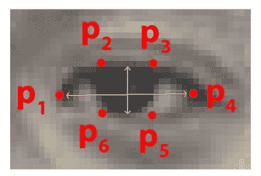
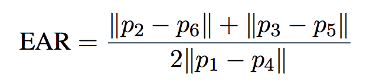

# 使用 OpenCV、Python 和 dlib 进行眨眼检测

> 原文：<https://pyimagesearch.com/2017/04/24/eye-blink-detection-opencv-python-dlib/>


在上周的博客文章中，我演示了如何在视频流中实时检测面部标志。

今天，我们将在这一知识的基础上开发一个计算机视觉应用程序，它能够使用面部标志和 OpenCV 在视频流中 ***检测和计数眨眼*** 。

为了构建我们的眨眼检测器，我们将计算一种称为*眼睛纵横比*(耳朵)的度量，这是由 Soukupová和 ech 在他们 2016 年的论文 [*中介绍的，使用面部标志*](http://vision.fe.uni-lj.si/cvww2016/proceedings/papers/05.pdf) 进行实时眨眼检测。

与用于计算眨眼的传统图像处理方法不同，传统图像处理方法通常包括以下的一些组合:

1.  眼睛定位。
2.  阈值化以找到眼白。
3.  确定眼睛的“白色”区域是否消失一段时间(表示眨眼)。

相反，眼睛的长宽比是一个更加优雅的解决方案，它包括一个非常简单的基于眼睛面部标志之间距离比的 T2 计算。

这种检测眨眼的方法快速、高效且易于实现。

**要了解更多关于使用 OpenCV、Python 和 dlib 构建计算机视觉系统来检测视频流中眨眼的信息，*请继续阅读。***

## 使用 OpenCV、Python 和 dlib 进行眨眼检测

我们的眨眼检测博文分为四个部分。

在第一部分中，我们将讨论*眼睛纵横比*以及如何用它来确定一个人在给定的视频帧中是否在眨眼。

从那里，我们将编写 Python、OpenCV 和 dlib 代码来(1)执行面部标志检测和(2)检测视频流中的眨眼。

基于这种实现，我们将应用我们的方法来检测示例网络摄像机流以及视频文件中的眨眼。

最后，我将通过讨论改进我们的眨眼检测器的方法来结束今天的博文。

### 了解“眼睛纵横比”(耳朵)

正如我们从[之前的教程](https://pyimagesearch.com/2017/04/03/facial-landmarks-dlib-opencv-python/)中了解到的，我们可以应用面部标志检测来定位面部的重要区域，包括眼睛、眉毛、鼻子、耳朵和嘴巴:


**Figure 1:** Detecting facial landmarks in an video stream in real-time.

这也意味着我们可以通过知道特定面部部分的索引来提取特定面部结构*:*


**Figure 2:** Applying facial landmarks to localize various regions of the face, including eyes, eyebrows, nose, mouth, and jawline.

**在眨眼检测方面，我们只对两组面部结构感兴趣——*眼睛。***

每只眼睛由 6 个 *(x，y)*-坐标表示，从眼睛的左上角开始(就好像你正在看着这个人)，然后围绕该区域的其余部分顺时针工作:



**Figure 3:** The 6 facial landmarks associated with the eye.

基于这一形象，我们应该抓住关键点:

**这些坐标的*宽度*和*高度*有关系。**

基于 Soukupová和 ech 在他们 2016 年的论文 *[中的工作，使用面部标志](http://vision.fe.uni-lj.si/cvww2016/proceedings/papers/05.pdf)* 进行实时眨眼检测，然后我们可以推导出一个反映这种关系的方程，称为*眼睛纵横比*(耳朵):



**Figure 4:** The eye aspect ratio equation.

其中 *p1，…，p6* 为 2D 面部标志点位置。

该等式的分子计算垂直眼界标之间的距离，而分母计算水平眼界标之间的距离，适当地加权分母，因为只有*一组*水平点，但是*有两组*垂直点。

为什么这个方程这么有趣？

嗯，我们会发现，当眼睛睁开时，眼睛的长宽比几乎是恒定的，但是当眨眼时，眼睛的长宽比会迅速下降到零。

使用这个简单的等式，我们可以*避免图像处理技术*，而简单地依靠眼睛标志距离的*比率*来确定一个人是否在眨眼。

为了更清楚地说明这一点，请看 Soukupová和 ech 的下图:


**Figure 5:** *Top-left:* A visualization of eye landmarks when then the eye is open. *Top-right:* Eye landmarks when the eye is closed. *Bottom:* Plotting the eye aspect ratio over time. The dip in the eye aspect ratio indicates a blink (Figure 1 of Soukupová and Čech).

在*左上角的*上，我们有一只完全睁开的眼睛——这里的眼睛纵横比很大(r ),并且随着时间的推移相对恒定。

然而，一旦这个人眨眼(*右上方*)，眼睛的纵横比就会急剧下降，接近于零。

底部的*图绘制了一个视频剪辑的眼睛纵横比随时间变化的图表。正如我们所看到的，眼睛的纵横比是恒定的，然后迅速下降到接近零，然后再次增加，这表明发生了一次眨眼。*

在下一节中，我们将学习如何使用面部标志、OpenCV、Python 和 dlib 实现眨眼检测的眼睛纵横比。

### 使用面部标志和 OpenCV 检测眨眼

首先，打开一个新文件，命名为`detect_blinks.py`。从那里，插入以下代码:

```py
# import the necessary packages
from scipy.spatial import distance as dist
from imutils.video import FileVideoStream
from imutils.video import VideoStream
from imutils import face_utils
import numpy as np
import argparse
import imutils
import time
import dlib
import cv2

```

要访问我们磁盘上的视频文件(`FileVideoStream`)或内置的网络摄像头/USB 摄像头/Raspberry Pi 摄像头模块(`VideoStream`)，我们需要使用我的 [imutils 库](https://github.com/jrosebr1/imutils)，这是一组方便的函数，使 OpenCV 的工作更容易。

如果您的系统上没有安装`imutils`(或者如果您使用的是旧版本)，请确保使用以下命令安装/升级:

```py
$ pip install --upgrade imutils

```

***注意:**如果你正在使用 Python 虚拟环境(正如我所有的 [OpenCV 安装教程](https://pyimagesearch.com/opencv-tutorials-resources-guides/)所做的)，确保你首先使用`workon`命令访问你的虚拟环境，然后安装/升级`imutils`。*

除此之外，我们大部分的导入都是相当标准的——例外是 [dlib](http://dlib.net/) ，它包含了我们面部标志检测的实现。

如果你的系统上没有安装 dlib，请按照我的 [dlib 安装教程](https://pyimagesearch.com/2017/03/27/how-to-install-dlib/)来配置你的机器。

接下来，我们将定义我们的`eye_aspect_ratio`函数:

```py
def eye_aspect_ratio(eye):
	# compute the euclidean distances between the two sets of
	# vertical eye landmarks (x, y)-coordinates
	A = dist.euclidean(eye[1], eye[5])
	B = dist.euclidean(eye[2], eye[4])

	# compute the euclidean distance between the horizontal
	# eye landmark (x, y)-coordinates
	C = dist.euclidean(eye[0], eye[3])

	# compute the eye aspect ratio
	ear = (A + B) / (2.0 * C)

	# return the eye aspect ratio
	return ear

```

该函数接受一个必需的参数，即给定`eye`的面部标志的 *(x，y)* 坐标。

**行 16 和 17** 计算两组*垂直*眼标之间的距离，而**行 21** 计算*水平*眼标之间的距离。

最后，**第 24 行**结合分子和分母得到最终的眼睛纵横比，如上面的**图 4** 所述。

**第 27 行**然后将眼睛纵横比返回给调用函数。

让我们继续分析我们的命令行参数:

```py
# construct the argument parse and parse the arguments
ap = argparse.ArgumentParser()
ap.add_argument("-p", "--shape-predictor", required=True,
	help="path to facial landmark predictor")
ap.add_argument("-v", "--video", type=str, default="",
	help="path to input video file")
args = vars(ap.parse_args())

```

我们的`detect_blinks.py`脚本需要一个命令行参数，后跟第二个可选参数:

*   `--shape-predictor`:这是通往 dlib 预先训练好的面部标志检测器的路径。你可以使用这篇博文底部的 ***【下载】*** 部分下载这个探测器以及源代码和示例视频。
*   `--video`:此可选开关控制驻留在磁盘上的输入视频文件的路径。如果你想使用一个*实时视频流*，只需在执行脚本时省略这个开关。

我们现在需要设置两个重要的常量，您可能需要为自己的实现进行调优，同时初始化另外两个重要的变量， ***，所以一定要注意这个解释:***

```py
# define two constants, one for the eye aspect ratio to indicate
# blink and then a second constant for the number of consecutive
# frames the eye must be below the threshold
EYE_AR_THRESH = 0.3
EYE_AR_CONSEC_FRAMES = 3

# initialize the frame counters and the total number of blinks
COUNTER = 0
TOTAL = 0

```

当确定视频流中是否发生眨眼时，我们需要计算眼睛的纵横比。

如果眼睛长宽比低于某个阈值，然后又高于该阈值，那么我们将记录一次“眨眼”——`EYE_AR_THRESH`就是这个阈值。我们将它默认为值`0.3`,因为这是最适合我的应用程序的值，但是您可能需要针对自己的应用程序进行调整。

然后，我们有一个重要的常数，`EYE_AR_CONSEC_FRAME`——该值被设置为`3`以指示眼睛纵横比小于`EYE_AR_THRESH`的三个*连续帧*必须发生，以便记录眨眼。

同样，根据管道的帧处理吞吐率，您可能需要根据自己的实现提高或降低这个数字。

**第 44 和 45 行**初始化两个计数器。`COUNTER`是眼睛长宽比小于`EYE_AR_THRESH`的连续帧的总数，而`TOTAL`是脚本运行时眨眼的总数。

现在我们的导入、命令行参数和常量都已经处理好了，我们可以初始化 dlib 的面部检测器和面部标志检测器了:

```py
# initialize dlib's face detector (HOG-based) and then create
# the facial landmark predictor
print("[INFO] loading facial landmark predictor...")
detector = dlib.get_frontal_face_detector()
predictor = dlib.shape_predictor(args["shape_predictor"])

```

dlib 库使用预训练的人脸检测器，该检测器基于对用于对象检测的[方向梯度直方图+线性 SVM](https://pyimagesearch.com/2014/11/10/histogram-oriented-gradients-object-detection/) 方法的修改。

然后，我们初始化第 51 行**上的实际面部标志预测器。**

你可以了解更多关于 dlib 的面部标志检测器的信息(例如，它是如何工作的，它是在什么数据集上训练的，等等。，[在这篇博文中](https://pyimagesearch.com/2017/04/03/facial-landmarks-dlib-opencv-python/)。

dlib 生成的面部标志遵循一个可索引列表，[正如我在本教程中描述的](https://pyimagesearch.com/2017/04/10/detect-eyes-nose-lips-jaw-dlib-opencv-python/):


**Figure 6:** The full set of facial landmarks that can be detected via dlib ([higher resolution](https://pyimagesearch.com/wp-content/uploads/2017/04/facial_landmarks_68markup.jpg)).

因此，我们可以确定用于提取左眼和右眼的 *(x，y)*-坐标的开始和结束阵列切片索引值，如下:

```py
# grab the indexes of the facial landmarks for the left and
# right eye, respectively
(lStart, lEnd) = face_utils.FACIAL_LANDMARKS_IDXS["left_eye"]
(rStart, rEnd) = face_utils.FACIAL_LANDMARKS_IDXS["right_eye"]

```

使用这些索引，我们将能够毫不费力地提取眼睛区域。

接下来，我们需要决定我们是使用基于文件的视频流还是使用 USB/网络摄像头/Raspberry Pi 摄像头直播的视频流:

```py
# start the video stream thread
print("[INFO] starting video stream thread...")
vs = FileVideoStream(args["video"]).start()
fileStream = True
# vs = VideoStream(src=0).start()
# vs = VideoStream(usePiCamera=True).start()
# fileStream = False
time.sleep(1.0)

```

如果你使用的是一个*文件视频流*，那么让代码保持原样。

否则，如果你想使用内置网络摄像头或 USB 摄像头，取消注释**行 62** 。

对于 Raspberry Pi 摄像机模块，取消第 63 行的注释。

如果您取消了第 62 行 **或第 63 行**的*注释，那么也取消第 64 行的**注释，以表明您是*而不是*从磁盘读取视频文件。***

最后，我们到达了脚本的主循环:

```py
# loop over frames from the video stream
while True:
	# if this is a file video stream, then we need to check if
	# there any more frames left in the buffer to process
	if fileStream and not vs.more():
		break

	# grab the frame from the threaded video file stream, resize
	# it, and convert it to grayscale
	# channels)
	frame = vs.read()
	frame = imutils.resize(frame, width=450)
	gray = cv2.cvtColor(frame, cv2.COLOR_BGR2GRAY)

	# detect faces in the grayscale frame
	rects = detector(gray, 0)

```

在第 68 行，我们开始循环视频流中的帧。

如果我们正在访问一个视频文件流，并且视频中没有剩余的帧，我们从循环中断开(**行 71 和 72** )。

第 77 行从我们的视频流中读取下一帧，然后调整其大小并将其转换为灰度(**第 78 和 79 行**)。

然后，我们通过 dlib 的内置人脸检测器在第 82 行的**灰度帧中检测人脸。**

我们现在需要遍历帧中的每张脸，然后对每张脸应用面部标志检测:

```py
	# loop over the face detections
	for rect in rects:
		# determine the facial landmarks for the face region, then
		# convert the facial landmark (x, y)-coordinates to a NumPy
		# array
		shape = predictor(gray, rect)
		shape = face_utils.shape_to_np(shape)

		# extract the left and right eye coordinates, then use the
		# coordinates to compute the eye aspect ratio for both eyes
		leftEye = shape[lStart:lEnd]
		rightEye = shape[rStart:rEnd]
		leftEAR = eye_aspect_ratio(leftEye)
		rightEAR = eye_aspect_ratio(rightEye)

		# average the eye aspect ratio together for both eyes
		ear = (leftEAR + rightEAR) / 2.0

```

**行 89** 确定面部区域的面部标志，而**行 90** 将这些 *(x，y)* 坐标转换成一个 NumPy 数组。

使用脚本前面的数组切片技术，我们可以分别提取左眼和右眼的 *(x，y)*-坐标(**第 94 行和第 95 行**)。

从那里，我们在第 96 行和第 97 行上计算每只眼睛的眼睛纵横比。

根据 Soukupová和 ech 的建议，我们*将两只眼睛的长宽比一起平均*，以获得更好的眨眼估计值(当然，假设一个人同时眨两只眼睛)。

我们的下一个代码块只是处理眼睛区域本身的面部标志的可视化:

```py
		# compute the convex hull for the left and right eye, then
		# visualize each of the eyes
		leftEyeHull = cv2.convexHull(leftEye)
		rightEyeHull = cv2.convexHull(rightEye)
		cv2.drawContours(frame, [leftEyeHull], -1, (0, 255, 0), 1)
		cv2.drawContours(frame, [rightEyeHull], -1, (0, 255, 0), 1)

```

你可以在这篇文章中阅读更多关于[提取和可视化个人面部标志区域的信息。](https://pyimagesearch.com/2017/04/10/detect-eyes-nose-lips-jaw-dlib-opencv-python/)

在这一点上，我们已经计算了我们的(平均)眼睛纵横比，但我们还没有实际确定是否发生了眨眼——这将在下一节中讨论:

```py
		# check to see if the eye aspect ratio is below the blink
		# threshold, and if so, increment the blink frame counter
		if ear < EYE_AR_THRESH:
			COUNTER += 1

		# otherwise, the eye aspect ratio is not below the blink
		# threshold
		else:
			# if the eyes were closed for a sufficient number of
			# then increment the total number of blinks
			if COUNTER >= EYE_AR_CONSEC_FRAMES:
				TOTAL += 1

			# reset the eye frame counter
			COUNTER = 0

```

**行 111** 进行检查以查看眼睛纵横比是否低于我们的眨眼阈值——如果是，我们增加指示眨眼正在发生的连续帧的数量(**行 112** )。

否则，**线 116** 处理眼睛纵横比*不低于眨眼阈值*的情况。

在这种情况下，我们在**行 119** 上进行另一次检查，以查看是否有足够数量的*连续帧*包含低于我们预定义阈值的眨眼比率。

如果检查通过，我们增加眨眼次数`TOTAL`(**第 120 行**)。

然后我们重置连续眨眼的次数`COUNTER` ( **第 123 行**)。

我们的最终代码块只是处理在输出帧上绘制眨眼次数，以及显示当前眼睛的纵横比:

```py
		# draw the total number of blinks on the frame along with
		# the computed eye aspect ratio for the frame
		cv2.putText(frame, "Blinks: {}".format(TOTAL), (10, 30),
			cv2.FONT_HERSHEY_SIMPLEX, 0.7, (0, 0, 255), 2)
		cv2.putText(frame, "EAR: {:.2f}".format(ear), (300, 30),
			cv2.FONT_HERSHEY_SIMPLEX, 0.7, (0, 0, 255), 2)

	# show the frame
	cv2.imshow("Frame", frame)
	key = cv2.waitKey(1) & 0xFF

	# if the `q` key was pressed, break from the loop
	if key == ord("q"):
		break

# do a bit of cleanup
cv2.destroyAllWindows()
vs.stop()

```

要查看我们的眨眼检测器，请进入下一部分。

### 眨眼检测结果

在执行任何这些示例之前，请确保使用本指南的 ***“下载”*** 部分下载源代码+示例视频+预训练的 dlib 面部标志预测器。从那里，您可以打开归档文件并开始使用代码。

在过去的这个周末，我去拉斯维加斯参加一个会议。在等待登机的时候，我坐在登机口，整理了这篇博文的代码——这包括录制一段简单的视频，我可以用它来评估眨眼检测软件。

要将我们的眨眼检测器应用于示例视频，只需执行以下命令:

```py
$ python detect_blinks.py \
	--shape-predictor shape_predictor_68_face_landmarks.dat \
	--video blink_detection_demo.mp4

```

正如你将看到的，我们可以使用 OpenCV 和面部标志成功计算视频中眨眼的次数:

<https://www.youtube.com/embed/72_7ByIfvEI?feature=oembed>