# 基于 OpenCV 和 Python 的人脸对齐

> 原文：<https://pyimagesearch.com/2017/05/22/face-alignment-with-opencv-and-python/>

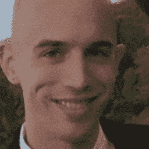

继续我们关于[面部标志](https://pyimagesearch.com/2017/04/03/facial-landmarks-dlib-opencv-python/)的系列博文，今天我们要讨论**面部对齐的过程:**

 **1.  识别数字图像中人脸的几何结构。
2.  尝试基于平移、缩放和旋转获得面部的规范对齐。

面部对齐有多种形式。

一些方法试图强加(预定义的)3D 模型，然后对输入图像应用变换，使得输入面上的界标匹配 3D 模型上的界标。

其他更简单的方法(如这篇博客中讨论的方法)，仅依靠面部标志本身(特别是眼睛区域)来获得面部的标准化旋转、平移和比例表示(T2)。

我们执行这种标准化的原因是因为许多面部识别算法，包括用于面部识别的*特征脸*、*LBPs*、*鱼脸*和*深度学习/度量方法*都可以从在尝试识别面部之前应用面部对齐中受益。

因此，人脸对齐可以被视为“数据规范化”的一种形式。正如您可以在训练机器学习模型之前通过零中心化或缩放到单位范数来归一化一组特征向量一样，在训练人脸识别器之前对齐数据集中的人脸是非常常见的。

通过执行此过程，您将享受到面部识别模型的更高准确性。

***注意:**如果你有兴趣了解更多关于创建你自己的定制人脸识别器的知识，请务必参考 [PyImageSearch 大师课程](https://pyimagesearch.com/pyimagesearch-gurus/)，在那里我提供了关于人脸识别的**详细教程**。*

**要了解更多关于面部对齐和标准化的信息，*继续阅读*。**

## 基于 OpenCV 和 Python 的人脸对齐

这篇博文的目的是演示如何使用 OpenCV、Python 和[面部标志](https://pyimagesearch.com/2017/04/03/facial-landmarks-dlib-opencv-python/)来对齐面部。

给定一组面部标志(输入坐标)，我们的目标是*扭曲*和*转换*图像到输出坐标空间。

**在这个输出坐标空间中，整个数据集的所有面应该:**

1.  在图像中居中。
2.  旋转，使眼睛位于一条水平线上(即，旋转面部，使眼睛位于相同的 *y* 坐标)。
3.  被缩放以使面的大小大致相同。

为了实现这一点，我们将首先实现一个专用的 Python 类来使用仿射变换对齐面部。我已经在 imutils 中实现了这个 [FaceAligner 类。](https://github.com/jrosebr1/imutils/blob/master/imutils/face_utils/facealigner.py)

***注:**仿射变换用于旋转、缩放、平移等。我们可以将上述三个需求打包成一个单独的* `cv2.warpAffine` *调用；诀窍是创建旋转矩阵，* `M` *。*

然后，我们将创建一个示例驱动程序 Python 脚本来接受输入图像、检测人脸并对齐它们。

最后，我们将回顾使用 OpenCV 过程进行人脸对齐的结果。

### 实现我们的面部对准器

人脸对齐算法本身是基于 *[用实用的计算机视觉项目](http://amzn.to/2qZAr4e)* (巴乔，2012)掌握 OpenCV 的第八章，如果你有 C++背景或者兴趣的话我强烈推荐。这本书在 GitHub 上提供了开放代码样本[。](https://github.com/MasteringOpenCV/code/blob/master/Chapter8_FaceRecognition/preprocessFace.cpp)

让我们从检查我们的`FaceAligner`实现和理解幕后发生的事情开始。

```py
# import the necessary packages
from .helpers import FACIAL_LANDMARKS_IDXS
from .helpers import shape_to_np
import numpy as np
import cv2

class FaceAligner:
    def __init__(self, predictor, desiredLeftEye=(0.35, 0.35),
        desiredFaceWidth=256, desiredFaceHeight=None):
        # store the facial landmark predictor, desired output left
        # eye position, and desired output face width + height
        self.predictor = predictor
        self.desiredLeftEye = desiredLeftEye
        self.desiredFaceWidth = desiredFaceWidth
        self.desiredFaceHeight = desiredFaceHeight

        # if the desired face height is None, set it to be the
        # desired face width (normal behavior)
        if self.desiredFaceHeight is None:
            self.desiredFaceHeight = self.desiredFaceWidth

```

2-5 号线处理我们的进口。要阅读面部标志和我们相关的辅助功能，请务必[查看之前的帖子](https://pyimagesearch.com/2017/04/03/facial-landmarks-dlib-opencv-python/)。

在**第 7 行**，我们开始我们的`FaceAligner`类，我们的构造函数在**第 8-20 行**被定义。

我们的构造函数有 4 个参数:

*   `predictor`:面部标志预测模型。
*   `desiredLeftEye`:可选的 *(x，y)* 元组，默认显示，指定期望的输出左眼位置。对于这一变量，常见的百分比在 20-40%之间。这些百分比控制对齐后有多少面是可见的。所用的确切百分比因应用而异。20%的话，你基本上会得到一个“放大”的脸部视图，而更大的值会让脸部看起来更“缩小”
*   `desiredFaceWidth`:另一个可选参数，以像素为单位定义我们想要的脸。我们将这个值默认为 256 像素。
*   `desiredFaceHeight`:最后一个可选参数，以像素为单位指定我们想要的面部高度值。

这些参数中的每一个都被设置为第 12-15 行上的相应实例变量。

接下来，让我们决定我们是想要一个正方形的人脸图像，还是矩形的。**第 19 行和第 20 行**检查`desiredFaceHeight`是否为`None`，如果是，我们将其设置为`desiredFaceWidth`，表示脸是方的。正方形图像是典型的例子。或者，我们可以为`desiredFaceWidth`和`desiredFaceHeight`指定不同的值，以获得感兴趣的矩形区域。

现在我们已经构建了我们的`FaceAligner`对象，接下来我们将定义一个对齐面部的函数。

这个函数有点长，所以我把它分成了 5 个代码块，使它更容易理解:

```py
    def align(self, image, gray, rect):
        # convert the landmark (x, y)-coordinates to a NumPy array
        shape = self.predictor(gray, rect)
        shape = shape_to_np(shape)

        # extract the left and right eye (x, y)-coordinates
        (lStart, lEnd) = FACIAL_LANDMARKS_IDXS["left_eye"]
        (rStart, rEnd) = FACIAL_LANDMARKS_IDXS["right_eye"]
        leftEyePts = shape[lStart:lEnd]
        rightEyePts = shape[rStart:rEnd]

```

从第 22 行的**开始，我们定义了接受三个参数的 align 函数:**

*   `image`:RGB 输入图像。
*   `gray`:灰度输入图像。
*   `rect`:dlib 的猪脸检测器产生的包围盒矩形。

在**第 24 行和第 25 行**，我们应用 dlib 的面部标志预测器，并将标志转换为 NumPy 格式的 *(x，y)*-坐标。

接下来，在**的第 28 行和第 29 行**，我们从`FACIAL_LANDMARK_IDXS`字典中读取`left_eye`和`right_eye`区域，该字典是在`helpers.py`脚本中找到的。这些二元组值存储在左/右眼起始和结束索引中。

使用第 30 和 31 行**上的起始和结束索引从形状列表中提取`leftEyePts`和`rightEyePts`。**

接下来，让我们来计算每只眼睛的中心以及眼睛质心之间的角度。

这个角度是调整我们形象的关键部分。

下图**图 1** 所示的两眼之间绿线的角度，就是我们所关心的角度。

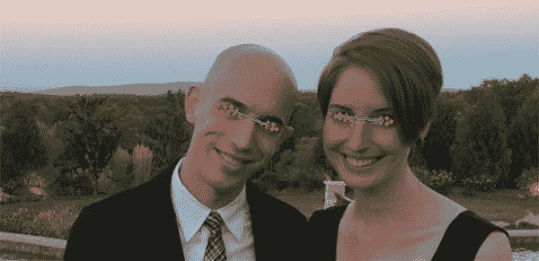

**Figure 1:** Computing the angle between two eyes for face alignment.

要查看角度是如何计算的，请参考下面的代码块:

```py
        # compute the center of mass for each eye
        leftEyeCenter = leftEyePts.mean(axis=0).astype("int")
        rightEyeCenter = rightEyePts.mean(axis=0).astype("int")

        # compute the angle between the eye centroids
        dY = rightEyeCenter[1] - leftEyeCenter[1]
        dX = rightEyeCenter[0] - leftEyeCenter[0]
        angle = np.degrees(np.arctan2(dY, dX)) - 180

```

在第**行第 34 和 35** 行，我们分别通过平均每只眼睛的所有 *(x，y)* 点来计算每只眼睛的质心，也称为质心。

给定眼睛中心，我们可以计算 *(x，y)*-坐标中的差异，并取反正切来获得眼睛之间的旋转角度。

***这个角度将允许我们对旋转进行校正。***

为了确定角度，我们首先计算在 *y* 方向`dY`的增量。这是通过找出**线 38** 上的`rightEyeCenter`和`leftEyeCenter`之间的差异来完成的。

类似地，我们计算第 39 条线上 *x* 方向的增量`dX`。

接下来，在**第 40 行**，我们计算脸部旋转的角度。我们使用带有参数`dY`和`dX`的 NumPy 的`arctan2`函数，然后转换成度数，同时减去 180°以获得角度。

在下面的代码块中，我们计算所需的右眼坐标(作为左眼位置的函数)，并计算新生成图像的比例。

```py
        # compute the desired right eye x-coordinate based on the
        # desired x-coordinate of the left eye
        desiredRightEyeX = 1.0 - self.desiredLeftEye[0]

        # determine the scale of the new resulting image by taking
        # the ratio of the distance between eyes in the *current*
        # image to the ratio of distance between eyes in the
        # *desired* image
        dist = np.sqrt((dX ** 2) + (dY ** 2))
        desiredDist = (desiredRightEyeX - self.desiredLeftEye[0])
        desiredDist *= self.desiredFaceWidth
        scale = desiredDist / dist

```

在**第 44 行**上，我们根据期望的左眼 *x* 坐标计算期望的右眼。我们从`1.0`中减去`self.desiredLeftEye[0]`，因为`desiredRightEyeX`值应该与图像的右边缘等距，因为相应的左眼 *x* 坐标距离图像的左边缘。

然后，我们可以通过获取当前图像中双眼之间的距离与期望图像中双眼之间的距离的比值来确定面部的`scale`

首先，我们计算第 50 行**上的欧几里德距离比`dist`。**

接下来，在**线 51** 上，使用右眼和左眼之间的差值*x*-值，我们计算期望的距离`desiredDist`。

我们通过将`desiredDist`乘以**行 52** 上的`desiredFaceWidth`来更新`desiredDist`。这实际上是根据想要的宽度来调整我们的眼距。

最后，我们的规模是通过将`desiredDist`除以我们之前计算的`dist`来计算的。

现在我们有了旋转`angle`和`scale`，在计算仿射变换之前，我们需要采取一些步骤。这包括找到两眼之间的中点以及计算旋转矩阵并更新其平移分量:

```py
        # compute center (x, y)-coordinates (i.e., the median point)
        # between the two eyes in the input image
        eyesCenter = ((leftEyeCenter[0] + rightEyeCenter[0]) // 2,
            (leftEyeCenter[1] + rightEyeCenter[1]) // 2)

        # grab the rotation matrix for rotating and scaling the face
        M = cv2.getRotationMatrix2D(eyesCenter, angle, scale)

        # update the translation component of the matrix
        tX = self.desiredFaceWidth * 0.5
        tY = self.desiredFaceHeight * self.desiredLeftEye[1]
        M[0, 2] += (tX - eyesCenter[0])
        M[1, 2] += (tY - eyesCenter[1])

```

在第 57 行和第 58 行上，我们计算左右眼的中点`eyesCenter`。这将用于我们的旋转矩阵计算。本质上，这个中点位于鼻子的顶部，也是我们旋转面部的点:

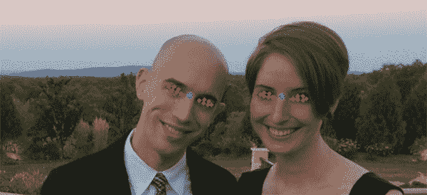

**Figure 2:** Computing the midpoint (blue) between two eyes. This will serve as the *(x, y)*-coordinate in which we rotate the face around.

为了计算我们的旋转矩阵，`M`，我们利用`cv2.getRotationMatrix2D`指定`eyesCenter`、`angle`和`scale` ( **行 61** )。这三个值中的每一个都已经预先计算过了，所以根据需要参考第**行 40** 、**行 53** 和**行 57** 。

`cv2.getRotationMatrix2D`的参数描述如下:

*   两眼之间的中点是我们旋转脸部的点。
*   我们将脸部旋转到的角度，以确保眼睛位于同一水平线。
*   `scale`:我们将放大或缩小图像的百分比，确保图像缩放到所需的大小。

现在，我们必须更新矩阵的平移分量，以便在仿射变换后人脸仍然在图像中。

在**第 64 行**上，我们取`desiredFaceWidth`的一半，并将值存储为`tX`，即在 *x* 方向的平移。

为了计算在 *y* 方向上的平移`tY`，我们将`desiredFaceHeight`乘以期望的左眼 *y* 值`desiredLeftEye[1]`。

使用`tX`和`tY`，我们通过从它们对应的眼睛中点值`eyesCenter` ( **行 66 和 67** )中减去每个值来更新矩阵的平移分量。

我们现在可以应用仿射变换来对齐面部:

```py
        # apply the affine transformation
        (w, h) = (self.desiredFaceWidth, self.desiredFaceHeight)
        output = cv2.warpAffine(image, M, (w, h),
            flags=cv2.INTER_CUBIC)

        # return the aligned face
        return output

```

为了方便起见，我们将`desiredFaceWidth`和`desiredFaceHeight`分别存储到`w`和`h`(**线 70** )。

然后我们通过调用`cv2.warpAffine`在**行 70 和 71** 上执行最后一步。该函数调用需要 3 个参数和 1 个可选参数:

*   `image`:人脸图像。
*   `M`:平移、旋转和缩放矩阵。
*   `(w, h)`:输出面所需的宽度和高度。
*   `flags`:用于扭曲的插值算法，在本例中为`INTER_CUBIC`。要阅读其他可能的标志和图像转换，请参考[OpenCV 文档](http://docs.opencv.org/trunk/da/d6e/tutorial_py_geometric_transformations.html)。

最后，我们返回第 75 条线**上对齐的面。**

### 使用 OpenCV 和 Python 对齐人脸

现在让我们用一个简单的驱动程序脚本来处理这个对齐类。打开一个新文件，命名为`align_faces.py`，让我们开始编码。

```py
# import the necessary packages
from imutils.face_utils import FaceAligner
from imutils.face_utils import rect_to_bb
import argparse
import imutils
import dlib
import cv2

# construct the argument parser and parse the arguments
ap = argparse.ArgumentParser()
ap.add_argument("-p", "--shape-predictor", required=True,
help="path to facial landmark predictor")
ap.add_argument("-i", "--image", required=True,
help="path to input image")
args = vars(ap.parse_args())

```

在第 2-7 行上，我们导入所需的包。

如果您的系统上没有安装`imutils`和/或`dlib` [，请确保通过`pip`安装/升级它们:](https://pyimagesearch.com/2017/03/27/how-to-install-dlib/)

```py
$ pip install --upgrade imutils
$ pip install --upgrade dlib

```

***注意:**如果你正在使用 Python 虚拟环境(正如我所有的 [OpenCV 安装教程](https://pyimagesearch.com/opencv-tutorials-resources-guides/)所做的)，确保你首先使用* `workon` *命令访问你的虚拟环境，然后安装/升级* `imutils` *和* `dlib` *。*

在第 10-15 行的**上使用`argparse`，我们指定了两个必需的命令行参数:**

*   `--shape-predictor`:dlib 面部标志预测器。
*   `--image`:包含人脸的图像。

在下一个代码块中，我们初始化基于 HOG 的检测器([方向梯度直方图](https://pyimagesearch.com/2014/11/10/histogram-oriented-gradients-object-detection/))、面部标志预测器和面部对准器:

```py
# initialize dlib's face detector (HOG-based) and then create
# the facial landmark predictor and the face aligner
detector = dlib.get_frontal_face_detector()
predictor = dlib.shape_predictor(args["shape_predictor"])
fa = FaceAligner(predictor, desiredFaceWidth=256)

```

**第 19 行**使用 dlib 的`get_frontal_face_detector`初始化我们的探测器对象。

在**第 20 行**上，我们使用`--shape-predictor`，dlib 的预训练预测器的路径，实例化我们的面部标志预测器。

我们通过在第 21 行的**上初始化一个对象`fa`来利用我们在上一节刚刚构建的`FaceAligner`类。我们指定 256 像素的面宽。**

接下来，让我们加载我们的图像，并为人脸检测做准备:

```py
# load the input image, resize it, and convert it to grayscale
image = cv2.imread(args["image"])
image = imutils.resize(image, width=800)
gray = cv2.cvtColor(image, cv2.COLOR_BGR2GRAY)

# show the original input image and detect faces in the grayscale
# image
cv2.imshow("Input", image)
rects = detector(gray, 2)

```

在第 24 行的**上，我们加载由命令行参数`–-image`指定的图像。我们调整图像的大小，保持第 25 行**的宽高比为 800 像素。然后我们在第 26 行将图像转换成灰度。

检测输入图像中的人脸是在**行 31** 处理的，这里我们应用了 dlib 的人脸检测器。这个函数返回`rects`，这是我们的检测器已经找到的面部周围的边界框列表。

在下一个块中，我们迭代`rects`，对齐每个面，并显示原始和对齐的图像。

```py
# loop over the face detections
for rect in rects:
	# extract the ROI of the *original* face, then align the face
	# using facial landmarks
	(x, y, w, h) = rect_to_bb(rect)
	faceOrig = imutils.resize(image[y:y + h, x:x + w], width=256)
	faceAligned = fa.align(image, gray, rect)

	# display the output images
	cv2.imshow("Original", faceOrig)
	cv2.imshow("Aligned", faceAligned)
	cv2.waitKey(0)

```

我们从第 34 行的**开始循环。**

对于 dlib 预测的每个边界框`rect`，我们将其转换为格式`(x, y, w, h)` ( **第 37 行**)。

随后，我们将框的宽度调整为 256 像素，*保持第**行第 38** 的纵横比*。我们将这个原始的、但是调整了大小的图像存储为`faceOrig`。

在**第 39 行**上，我们对齐图像，指定我们的图像、灰度图像和矩形。

最后，**行 42 和 43** 在各自的窗口中向屏幕显示原始的和相应的对准的面部图像。

在第**行第 44** 处，我们等待用户在显示下一个原始/校准图像对之前，在任一窗口处于焦点时按下一个键。

对所有检测到的面部重复第 35-44 行的过程，然后脚本退出。

要查看我们的面部矫正器，请进入下一部分。

### 面部对齐结果

让我们继续将我们的面部对齐器应用于一些示例图像。确保你使用这篇博文的 ***【下载】*** 部分下载源代码+示例图片。

解压缩归档文件后，执行以下命令:

```py
$ python align_faces.py \
	--shape-predictor shape_predictor_68_face_landmarks.dat \
	--image images/example_01.jpg

```

从这里你会看到下面的输入图像，一张我和我的未婚妻 Trisha 的照片:

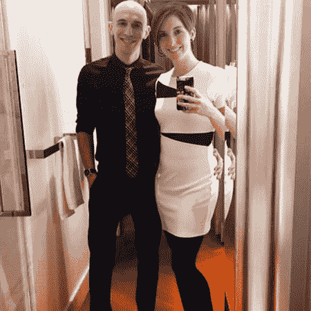

**Figure 3:** An input image to our OpenCV face aligner.

该图像包含两张脸，因此我们将执行*两张*面部对齐。

第一个如下所示:

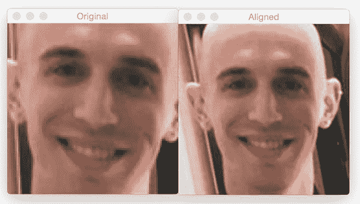

**Figure 4:** Aligning faces with OpenCV.

在左边的*上，我们有原始的检测到的人脸。然后*对齐的面*显示在*右侧*。*

现在是特丽莎的脸:

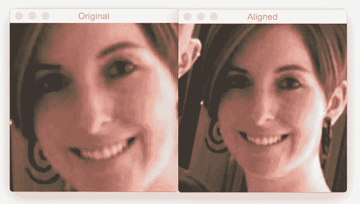

**Figure 5:** Facial alignment with OpenCV and Python.

注意在面部对齐*之后，我们两张脸的*比例相同*和*，眼睛出现在相同的输出 *(x，y)* 坐标中。

让我们试试第二个例子:

```py
$ python align_faces.py \
	--shape-predictor shape_predictor_68_face_landmarks.dat \
	--image images/example_02.jpg

```

在感恩节的早晨，我正在享用一杯葡萄酒:

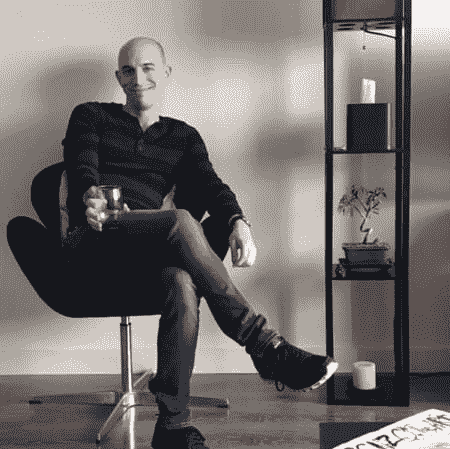

**Figure 6:** An input image to our face aligner.

检测到我的面部后，它会被对齐，如下图所示:

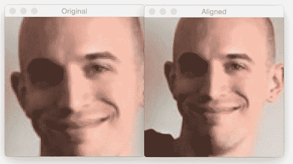

**Figure 7:** Using facial landmarks to align faces in images.

这里是第三个例子，这是我和我父亲去年春天烹饪了一批软壳蟹后的一个例子:

```py
$ python align_faces.py \
	--shape-predictor shape_predictor_68_face_landmarks.dat \
	--image images/example_03.jpg

```

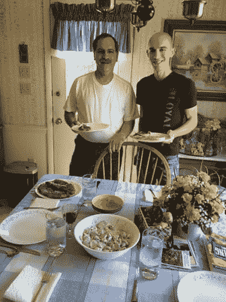

**Figure 8:** Another example input to our face aligner.

我父亲的脸首先对齐:

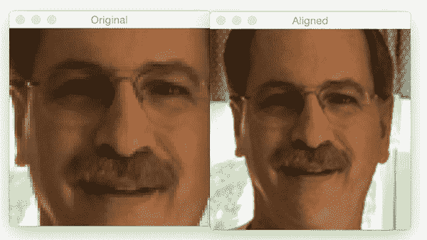

**Figure 9:** Applying facial alignment using OpenCV and Python.

其次是我自己的:

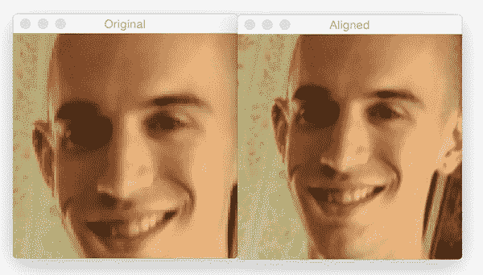

**Figure 10:** Using face alignment to obtain canonical representations of faces.

第四个例子是我祖父母最后一次去北卡罗来纳时的照片:

```py
$ python align_faces.py \
	--shape-predictor shape_predictor_68_face_landmarks.dat \
	--image images/example_04.jpg

```

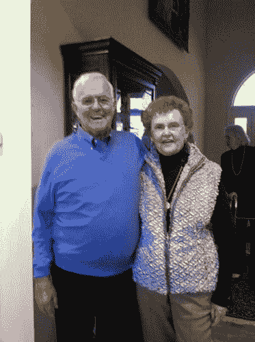

**Figure 11:** Inputting an image to our face alignment algorithm.

我奶奶的脸先对齐了:

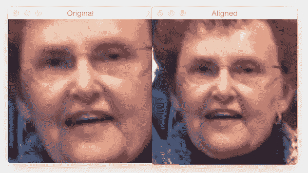

**Figure 12:** Performing face alignment using computer vision.

然后是我祖父的:

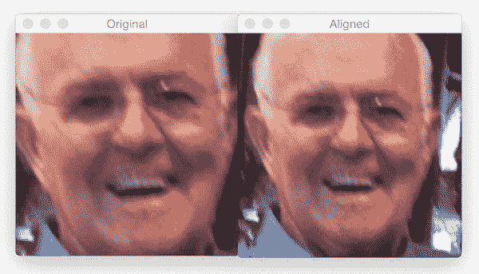

**Figure 13:** Face alignment in unaffected by the person in the photo wearing glasses.

尽管两个人都戴着眼镜，但他们的脸还是被正确地对齐了。

让我们做最后一个例子:

```py
$ python align_faces.py \
	--shape-predictor shape_predictor_68_face_landmarks.dat \
	--image images/example_05.jpg

```

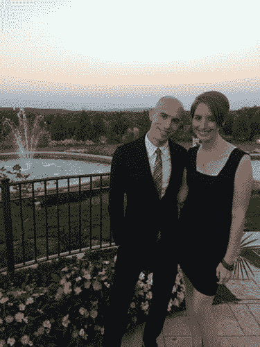

**Figure 14:** The final example input image to our face aligner.

应用面部检测后，首先对齐 Trisha 的面部:

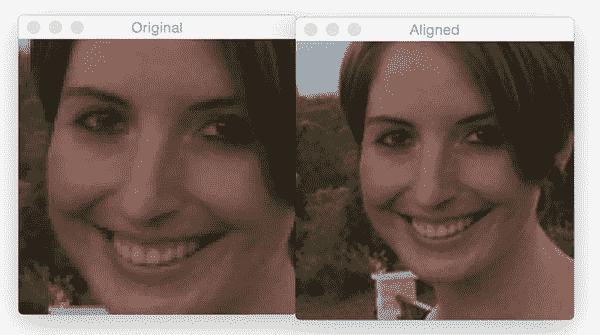

**Figure 15:** Facial alignment using facial landmarks.

然后是我自己的:

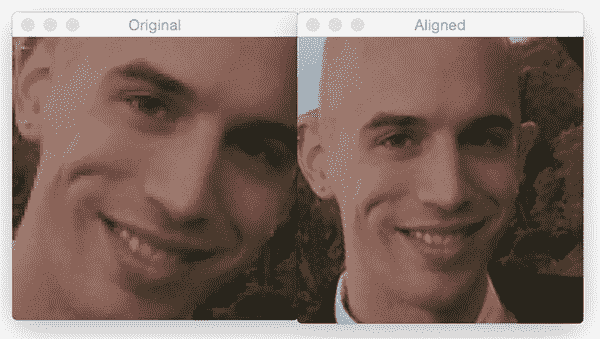

**Figure 16:** Face alignment still works even if the input face is rotated.

我的脸的旋转角度被检测和纠正，然后被缩放到适当的大小。

为了证明这种面部对齐方法确实可以(1)使面部居中，(2)旋转面部，使眼睛沿着水平线，以及(3)缩放面部，使它们的大小大致相同，我制作了一个 GIF 动画，如下所示:


**Figure 17:** An animation demonstrating face alignment across multiple images.

**正如你所看到的，每张输入图像的眼睛位置和面部尺寸几乎相同。**

## 摘要

在今天的帖子中，我们学习了如何使用 OpenCV 和 Python 应用面部对齐。面部对齐是一种标准化技术，通常用于提高面部识别算法的准确性，包括深度学习模型。

面部对齐的目标是将输入坐标空间转换为输出坐标空间，使得整个数据集上的所有面部应该:

1.  在图像中居中。
2.  旋转，使眼睛位于一条水平线上(即，旋转面部，使眼睛位于相同的 *y* 坐标)。
3.  被缩放以使面的大小大致相同。

使用仿射变换可以实现这三个目标。诀窍是确定变换矩阵的分量`M`。

我们的面部对齐算法依赖于知道眼睛的 *(x，y)*-坐标。在这篇博文中，我们使用了 dlib，但是你也可以使用其他面部标志库——同样的技术也适用。

对于面部对齐，面部标志往往比 Haar cascades 或 HOG 检测器工作得更好，因为我们获得了对眼睛位置的更精确的估计(而不仅仅是边界框)。

**如果你有兴趣学习更多关于人脸识别和物体检测的知识，一定要看看 [*PyImageSearch 大师课程*](https://pyimagesearch.com/pyimagesearch-gurus/) ，在那里我有超过 *25 节以上关于这些主题的课程*。****