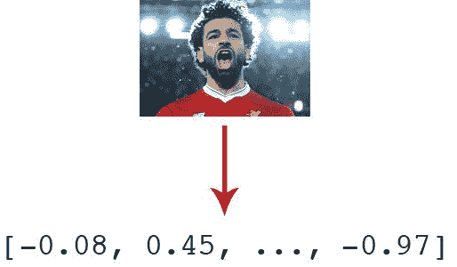
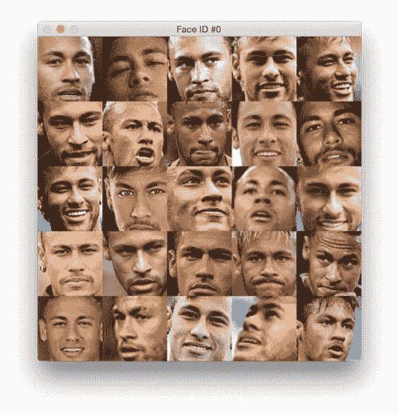
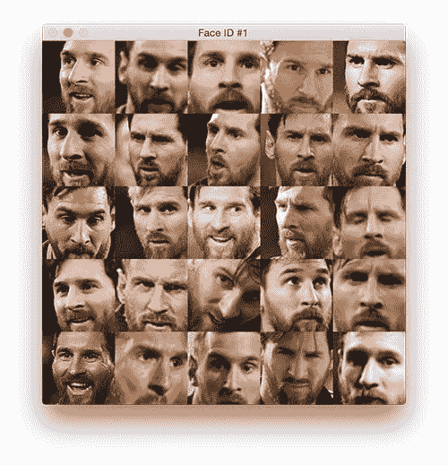
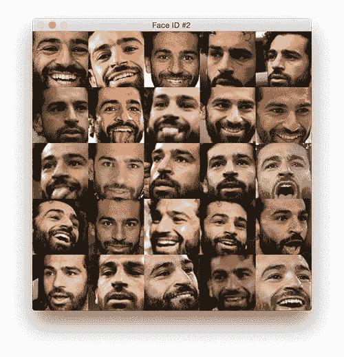
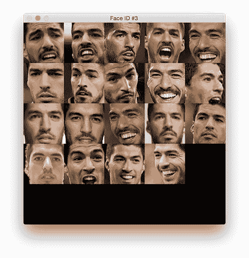
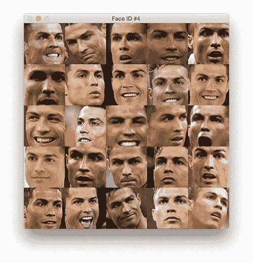
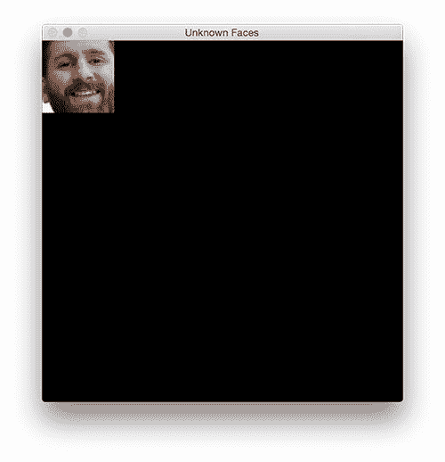

# 用 Python 进行人脸聚类

> 原文：<https://pyimagesearch.com/2018/07/09/face-clustering-with-python/>

今天这篇博文的灵感来自于 PyImageSearch 读者 Leonard Bogdonoff 的一个问题。

在我发表了我之前关于使用 OpenCV 的 *[**人脸识别和深度学习**](https://pyimagesearch.com/2018/06/18/face-recognition-with-opencv-python-and-deep-learning/)* 的帖子之后，Leonard 写道:

> 嘿，阿德里安，你能进入身份聚类吗？我有一个由照片和 ***组成的数据集，但我似乎无法确定如何处理它们来识别独特的人。***

这种“面部聚类”或“身份聚类”的应用可以用于帮助执法。

考虑一个场景，两个罪犯在一个繁忙的城市如波士顿或纽约抢劫一家银行。银行的安全摄像头工作正常，捕捉到了抢劫过程——但是罪犯戴着滑雪面罩，所以你看不到他们的脸。

行凶者将现金藏在衣服下面逃离银行，摘下他们的面具，并将其扔进附近的垃圾桶，以免在公共场合显得“可疑”。

他们会逍遥法外吗？

也许吧。

但是安装在附近加油站、餐馆和红灯/主要十字路口的安全摄像头捕捉到了附近所有的行人活动。

**在警察到达后，他们的侦探可以利用人脸聚类来查找该地区*所有*视频源中的所有独特人脸** —给定这些独特的人脸，侦探可以:(1)手动调查它们并将其与银行出纳员的描述进行比较，(2)运行自动搜索来将人脸与已知的罪犯数据库进行比较，或者(3)应用良好的 ole’侦探工作来查找可疑的个人。

这当然是一个虚构的例子，但我希望你能看到人脸聚类在现实世界中的应用价值。

要了解更多关于人脸聚类的知识，以及如何使用 Python 实现它，以及深度学习，请继续阅读。

## 用 Python 进行人脸聚类

人脸识别和人脸聚类是不同的，但高度相关的概念。当执行人脸识别时，我们应用**监督学习**，其中我们有(1)我们想要识别的人脸的示例图像，以及(2)对应于每个人脸的名称(即“类别标签”)。

但是在*人脸聚类*中，我们需要执行**无监督学习**——我们只有*人脸本身*，没有*名字/标签。*从那里我们需要*识别*和*计算*数据集中唯一的人的数量。

在这篇博文的第一部分，我们将讨论我们的面聚类数据集和我们将用于构建项目的项目结构。

接下来，我将帮助您编写两个 Python 脚本:

1.  一个是提取和量化数据集中的人脸
2.  另一个是*聚类面部，*其中每个结果聚类(理想地)代表一个*独特的个体*

从那里，我们将在一个样本数据集上运行我们的面部聚类管道，并检查结果。

### 配置您的开发环境

在我们之前的[人脸识别](https://pyimagesearch.com/2018/06/18/face-recognition-with-opencv-python-and-deep-learning/)帖子中，我在标题为*“安装你的人脸识别库”*的部分解释了如何配置你的开发环境——请确保在配置你的环境时参考它。

作为快速分解，这里是您在 Python 环境中需要的一切:

*   [OpenCV](https://pyimagesearch.com/opencv-tutorials-resources-guides/)
*   [dlib](http://dlib.net/)
*   [人脸识别](https://github.com/ageitgey/face_recognition)
*   [imutils](https://github.com/jrosebr1/imutils)
*   [scikit-learn](http://scikit-learn.org/)

如果你有一个 GPU，你会想要安装带有 CUDA 绑定的 dlib，这也在之前的文章中描述过。

### 我们的人脸聚类数据集

随着 2018 年 FIFA 世界杯半决赛明天开始，我认为将面部聚类应用于著名足球运动员的面部会很有趣。

正如你从上面的**图 1** 中看到的，我收集了五名足球运动员的数据集，包括:

*   [穆罕默德·萨拉赫](https://en.wikipedia.org/wiki/Mohamed_Salah)
*   小内马尔
*   克里斯蒂亚诺·罗纳尔多
*   莱昂内尔·梅西
*   路易斯·苏亚雷斯

数据集中总共有 129 幅图像。

我们的目标是提取量化图像中每张脸的特征，并对得到的“面部特征向量”进行聚类。理想情况下，每个足球运动员都有自己的仅包含他们面部的聚类。

### 面聚类项目结构

在我们开始之前，请务必从这篇博文的 ***“下载”*** 部分获取可下载的 zip 文件。

我们的项目结构如下:

```py
$ tree --dirsfirst
.
├── dataset [129 entries]
│   ├── 00000000.jpg
│   ├── 00000001.jpg
│   ├── 00000002.jpg
│   ├── ...
│   ├── 00000126.jpg
│   ├── 00000127.jpg
│   └── 00000128.jpg
├── encode_faces.py
├── encodings.pickle
└── cluster_faces.py

1 directory, 132 files

```

我们的项目有一个目录和三个文件:

*   包含了我们五个足球运动员的 129 张照片。请注意，在上面的输出中，文件名或另一个文件中没有标识每个图像中的人的标识信息。仅仅根据文件名，不可能知道哪个足球运动员在哪个图像中。我们将设计一个人脸聚类算法来识别数据集中相似和唯一的人脸。
*   这是我们的第一个脚本——它为数据集中的所有人脸计算人脸嵌入，并输出一个序列化的编码文件。
*   `encodings.pickle`:我们的脸嵌入序列化泡菜文件。
*   神奇的事情发生在这个脚本中，我们将相似的脸聚集在一起，并理想地找出离群值。

### 通过深度学习对人脸进行编码

[](https://pyimagesearch.com/wp-content/uploads/2018/07/face_clustering_embedding.jpg)

**Figure 2:** In order to represent faces numerically, we quantify all faces in the dataset with a 128-d feature vector generated by a neural network. We’ll use these feature vectors later in our face clustering Python script.

在对一组人脸进行聚类之前，我们首先需要对它们进行量化。这个量化面部的过程将使用深度神经网络来完成，该深度神经网络负责:

*   接受输入图像
*   以及输出量化面部的 128 维特征向量

我讨论了这个深度神经网络是如何工作的，以及它是如何在我的[之前的人脸识别帖子](https://pyimagesearch.com/2018/06/18/face-recognition-with-opencv-python-and-deep-learning/)中被训练的，所以如果你对网络本身有任何问题，请务必参考它。我们的`encode_faces.py`脚本将包含用于提取每张人脸的 128 维特征向量表示的所有代码。

要查看这个过程是如何执行的，创建一个名为`encode_faces.py`的文件，并插入以下代码:

```py
# import the necessary packages
from imutils import paths
import face_recognition
import argparse
import pickle
import cv2
import os

# construct the argument parser and parse the arguments
ap = argparse.ArgumentParser()
ap.add_argument("-i", "--dataset", required=True,
	help="path to input directory of faces + images")
ap.add_argument("-e", "--encodings", required=True,
	help="path to serialized db of facial encodings")
ap.add_argument("-d", "--detection-method", type=str, default="cnn",
	help="face detection model to use: either `hog` or `cnn`")
args = vars(ap.parse_args())

```

我们需要的包在**线 2-7** 导入。注意到:

*   从我的 [imutils](https://github.com/jrosebr1/imutils/blob/master/imutils/paths.py) 包里
*   `face_recognition`由[亚当·盖特基](https://github.com/ageitgey/face_recognition)，一位 **[PyImageConf2018](https://www.pyimageconf.com/)** 主讲

从那里，我们将解析第 10-17 行****:**上的[命令行参数](https://pyimagesearch.com/2018/03/12/python-argparse-command-line-arguments/)**

 ***   `--dataset`:人脸和图像输入目录的路径。
*   `--encodings`:包含面部编码的输出序列化 pickle 文件的路径。
*   `--detection-method`:在量化人脸之前，您可以使用卷积神经网络(CNN)或梯度方向直方图(HOG)方法来检测输入图像中的人脸。CNN 方法更准确(但较慢)，而 HOG 方法更快(但不太准确)。

如果你不熟悉命令行参数以及如何使用它们，请参考我的[上一篇文章](https://pyimagesearch.com/2018/03/12/python-argparse-command-line-arguments/)。

我还会提到，如果你认为这个脚本运行缓慢，或者你想在没有 GPU 的情况下实时运行面部聚类帖子，你绝对应该*将`--detection-method`设置为`hog`而不是`cnn`。虽然 CNN 人脸检测器更准确，但如果没有 GPU，它的速度太慢，无法实时运行。*

 *让我们获取输入数据集中所有图像的路径:

```py
# grab the paths to the input images in our dataset, then initialize
# out data list (which we'll soon populate)
print("[INFO] quantifying faces...")
imagePaths = list(paths.list_images(args["dataset"]))
data = []

```

在第 22 行的**上，我们使用命令行参数中提供的数据集路径创建了数据集中所有`imagePaths`的列表。**

从那里，我们初始化我们的`data`列表，稍后我们将用图像路径、边界框和面部编码来填充它。

让我们开始循环所有的`imagePaths`:

```py
# loop over the image paths
for (i, imagePath) in enumerate(imagePaths):
	# load the input image and convert it from RGB (OpenCV ordering)
	# to dlib ordering (RGB)
	print("[INFO] processing image {}/{}".format(i + 1,
		len(imagePaths)))
	print(imagePath)
	image = cv2.imread(imagePath)
	rgb = cv2.cvtColor(image, cv2.COLOR_BGR2RGB)

```

在**线 26** 上，我们开始在`imagePaths`上循环，并继续装载`image` ( **线 32** )。然后我们在`image`中交换颜色通道，因为 dlib 采用`rgb`排序，而不是 OpenCV 的默认 BGR。(**第 33 行**)。

现在图像已经被处理了，让我们检测所有的脸并且抓取它们的边界框坐标:

```py
	# detect the (x, y)-coordinates of the bounding boxes
	# corresponding to each face in the input image
	boxes = face_recognition.face_locations(rgb,
		model=args["detection_method"])

```

我们必须*检测*一张脸在图像中的实际位置*，然后*才能量化它。该检测发生在**线 37 和 38** 上。你会注意到`face_recognition` API 非常容易使用。

***注意:**我们使用 CNN 面部检测器以获得更高的准确性，但如果你使用 CPU 而不是 GPU，运行时间会明显更长。如果您希望编码脚本或您的系统运行得更快，并且您的系统没有足够的 RAM 或 CPU 来运行 CNN 人脸检测器，请使用 HOG +线性 SVM 方法。*

让我们来看看这个剧本的“精髓”。在下一个模块中，我们将计算面部编码:

```py
	# compute the facial embedding for the face
	encodings = face_recognition.face_encodings(rgb, boxes)

	# build a dictionary of the image path, bounding box location,
	# and facial encodings for the current image
	d = [{"imagePath": imagePath, "loc": box, "encoding": enc}
		for (box, enc) in zip(boxes, encodings)]
	data.extend(d)

```

这里，我们为在`rgb`图像中检测到的每个人脸计算 128 维人脸`encodings`(**线 41** )。

对于每个检测到的人脸+编码，我们构建一个字典(**第 45 行和第 46 行**)，包括:

1.  输入图像的路径
2.  图像中人脸的位置(即边界框)
3.  128-d 编码本身

然后我们将词典添加到我们的`data`列表中(**第 47 行**)。**稍后当我们想要可视化哪些人脸属于哪个聚类时，我们将使用这些信息。**

为了结束这个脚本，我们只需将数据列表写入一个序列化的 pickle 文件:

```py
# dump the facial encodings data to disk
print("[INFO] serializing encodings...")
f = open(args["encodings"], "wb")
f.write(pickle.dumps(data))
f.close()

```

使用我们的命令行参数`args["encodings"]`作为路径+文件名，我们将数据列表作为序列化的 pickle 文件写入磁盘(**第 51-53 行**)。

#### 运行人脸编码脚本

继续之前，滚动到 ***【下载】*** 部分下载代码+图像。您可以选择使用您自己的图像数据集——这也完全没问题，只是要确保在命令行参数中提供适当的路径。

然后，打开一个终端并激活 Python 虚拟环境(如果您正在使用的话),其中包含您在本文前面安装的库和包。

从那里，使用两个命令行参数，执行脚本来编码著名足球运动员的脸，如下所示:

```py
$ python encode_faces.py --dataset dataset --encodings encodings.pickle
[INFO] quantifying faces...
[INFO] processing image 1/129
dataset/00000038.jpg
[INFO] processing image 2/129
dataset/00000010.jpg
[INFO] processing image 3/129
dataset/00000004.jpg
...
[INFO] processing image 127/129
dataset/00000009.jpg
[INFO] processing image 128/129
dataset/00000021.jpg
[INFO] processing image 129/129
dataset/00000035.jpg
[INFO] serializing encodings...

```

这个过程可能需要一段时间，您可以使用终端输出来跟踪进度。

如果你使用的是 GPU，它会很快执行——大约 1-2 分钟。只要确保你安装了带有 CUDA 绑定的 dlib 来利用你的 GPU(正如我上面提到的和在这篇文章中描述的[)。](https://pyimagesearch.com/2018/06/18/face-recognition-with-opencv-python-and-deep-learning/)

但是，如果您只是在带 CPU 的笔记本电脑上执行脚本，脚本可能需要 20-30 分钟才能运行。

### 聚类人脸

既然我们已经将数据集中的所有人脸量化和编码为 128 维向量，下一步就是用*将它们聚类成组。*

我们希望每个独特的个体都有自己独立的集群。

问题是，很多聚类算法如 [k-means](https://en.wikipedia.org/wiki/K-means_clustering) 和[层次凝聚聚类](https://en.wikipedia.org/wiki/Hierarchical_clustering)，都要求我们提前指定要寻找的聚类数*。*

对于这个例子，我们知道只有五名足球运动员——但是在现实世界的应用程序中，您可能*不*知道一个数据集中有多少不同的个体。

因此，我们需要使用一个基于密度或基于图的聚类算法，它不仅可以*聚类*数据点，还可以*根据数据的密度确定聚类的数量*。

对于人脸聚类，我推荐两种算法:

1.  具有噪声的应用的基于密度的空间聚类( [DBSCAN](https://en.wikipedia.org/wiki/DBSCAN) )
2.  [窃窃私语群集](https://en.wikipedia.org/wiki/Chinese_Whispers_(clustering_method))

我们将在本教程中使用 DBSCAN，因为我们的数据集相对较小。对于真正的大规模数据集，你应该考虑使用中文耳语算法，因为它在时间上是线性的。

DBSCAN 算法的工作原理是将紧密封装在一个 *N* 维空间中的点组合在一起。距离较近的点将被分组到一个聚类中。

DBSCAN 还自然地处理异常值，如果它们落在“最近的邻居”距离很远的低密度区域，就标记它们。

让我们继续使用 DBSCAN 实现面部聚类。

打开一个新文件，将其命名为`cluster_faces.py`，并插入以下代码:

```py
# import the necessary packages
from sklearn.cluster import DBSCAN
from imutils import build_montages
import numpy as np
import argparse
import pickle
import cv2

# construct the argument parser and parse the arguments
ap = argparse.ArgumentParser()
ap.add_argument("-e", "--encodings", required=True,
	help="path to serialized db of facial encodings")
ap.add_argument("-j", "--jobs", type=int, default=-1,
	help="# of parallel jobs to run (-1 will use all CPUs)")
args = vars(ap.parse_args())

```

DBSCAN 内置于 scikit-learn 中。我们在第 2 行的**上导入 DBSCAN 实现。**

我们也从**线 3** 上的`imutils`导入`build_montages`模块。我们将使用这个函数为每个集群建立一个“人脸蒙太奇”。如果你对图像剪辑感兴趣，一定要看看我之前关于 OpenCV 的 *[图像剪辑的帖子。](https://pyimagesearch.com/2017/05/29/montages-with-opencv/)*

我们的其他进口产品应该对第 4-7 行相当熟悉。

让我们解析两个命令行参数:

*   `--encodings`:我们在前面的脚本中生成的编码 pickle 文件的路径。
*   `--jobs` : DBSCAN 是多线程的，可以将一个参数传递给包含要运行的并行作业数量的构造函数。值`-1`将使用所有可用的 CPU(也是这个命令行参数的默认值)。

让我们加载面部嵌入数据:

```py
# load the serialized face encodings + bounding box locations from
# disk, then extract the set of encodings to so we can cluster on
# them
print("[INFO] loading encodings...")
data = pickle.loads(open(args["encodings"], "rb").read())
data = np.array(data)
encodings = [d["encoding"] for d in data]

```

在这个街区，我们已经:

*   从磁盘加载面部编码`data`(**第 21 行**)。
*   将`data`组织成一个 NumPy 数组(**第 22 行**)。
*   从`data`中提取 128-d `encodings`，将它们放入一个列表中(**第 23 行**)。

现在我们可以在下一个代码块中聚集`encodings`:

```py
# cluster the embeddings
print("[INFO] clustering...")
clt = DBSCAN(metric="euclidean", n_jobs=args["jobs"])
clt.fit(encodings)

# determine the total number of unique faces found in the dataset
labelIDs = np.unique(clt.labels_)
numUniqueFaces = len(np.where(labelIDs > -1)[0])
print("[INFO] # unique faces: {}".format(numUniqueFaces))

```

为了让 ***对编码*** 进行聚类，我们只需创建一个`DBSCAN`对象，然后在`encodings`本身上`fit`模型(**第 27 行和第 28 行**)。

没有比这更简单的了！

现在让我们来确定在数据集中找到的独特面孔！

参考**第 31 行**，`clt.labels_`包含我们数据集中所有人脸的标签 ID(即每个人脸属于哪个聚类)。要找到唯一的面孔/唯一的标签 id，我们只需使用 NumPy 的`unique`函数。结果是一个独特的`labelIDs`列表。

在第 32 行的**上，我们数着`numUniqueFaces`。在`labelIDs`中可能存在值`-1`——该值对应于“离群值”类，其中 128-d 嵌入离任何其他聚类太远而不能添加到它。这种点被称为“异常值”，并且可能值得检查或者基于面部聚类的应用而简单地丢弃。**

在我们的例子中，我们在这个计数中排除了负数`labelIDs`,因为我们知道我们的数据集只包含 5 个人的图像。你是否做出这样的假设在很大程度上取决于你的项目。

我们的*接下来的三个代码块*的目标是在我们的数据集中生成独特的足球/五人制足球运动员的面部蒙太奇。

我们通过循环所有独特的`labelIDs`来开始这个过程:

```py
# loop over the unique face integers
for labelID in labelIDs:
	# find all indexes into the `data` array that belong to the
	# current label ID, then randomly sample a maximum of 25 indexes
	# from the set
	print("[INFO] faces for face ID: {}".format(labelID))
	idxs = np.where(clt.labels_ == labelID)[0]
	idxs = np.random.choice(idxs, size=min(25, len(idxs)),
		replace=False)

	# initialize the list of faces to include in the montage
	faces = []

```

在**第 41-43 行**中，我们找到当前`labelID`的所有索引，然后随机抽取最多 25 张图像包含在蒙太奇中。

`faces`列表将包括面部图像本身(**第 46 行**)。我们需要另一个循环来填充这个列表:

```py
	# loop over the sampled indexes
	for i in idxs:
		# load the input image and extract the face ROI
		image = cv2.imread(data[i]["imagePath"])
		(top, right, bottom, left) = data[i]["loc"]
		face = image[top:bottom, left:right]

		# force resize the face ROI to 96x96 and then add it to the
		# faces montage list
		face = cv2.resize(face, (96, 96))
		faces.append(face)

```

我们在第 49 行的**开始循环我们随机样本中的所有`idxs`。**

在循环的第一部分，我们:

*   从磁盘中加载`image`并使用在我们的面部嵌入步骤中找到的边界框坐标提取`face` ROI ( **第 51-53 行**)。
*   将脸部大小调整为固定的 *96×96* ( **第 57 行**)，这样我们就可以将它添加到用于可视化每个集群的`faces`蒙太奇(**第 58 行**)中。

为了完成我们的顶级循环，让我们构建蒙太奇并将其显示到屏幕上:

```py
	# create a montage using 96x96 "tiles" with 5 rows and 5 columns
	montage = build_montages(faces, (96, 96), (5, 5))[0]

	# show the output montage
	title = "Face ID #{}".format(labelID)
	title = "Unknown Faces" if labelID == -1 else title
	cv2.imshow(title, montage)
	cv2.waitKey(0)

```

我们使用 [imutils](https://github.com/jrosebr1/imutils/blob/ad3a7ac220d09a5d1875cd5b0f0720bae60dd572/imutils/convenience.py#L173) 的`build_montages`函数生成包含`faces` ( **行 61** )的 *5×5* 网格的单幅图像`montage`。

从那里，我们`title`窗口(**第 64 行和第 65 行**)，然后在我们的屏幕上显示窗口中的`montage`。

只要 OpenCV 打开的窗口是打开的，你就可以按一个键来显示下一个人脸聚类蒙太奇。

### 人脸聚类结果

请务必使用这篇博文的 ***【下载】*** 部分来下载运行这个脚本所需的代码和数据。

这个脚本只需要一个[命令行参数](https://pyimagesearch.com/2018/03/12/python-argparse-command-line-arguments/)——编码文件的路径。要为足球运动员执行面部聚类，只需在终端中输入以下命令:

```py
$ python cluster_faces.py --encodings encodings.pickle
[INFO] loading encodings...
[INFO] clustering...
[INFO] # unique faces: 5
[INFO] faces for face ID: -1
[INFO] faces for face ID: 0
[INFO] faces for face ID: 1
[INFO] faces for face ID: 2
[INFO] faces for face ID: 3
[INFO] faces for face ID: 4

```

识别五个面部聚类类别。-1 的面 ID 包含找到的任何离群值。你会在屏幕上看到集群蒙太奇。要生成下一个面部聚类蒙太奇，只需按一个键(窗口处于焦点状态，以便 OpenCV 的 highgui 模块可以捕获您的按键)。

以下是从我们的 128 维面部嵌入和数据库扫描聚类算法中生成的面部聚类:

[](https://pyimagesearch.com/wp-content/uploads/2018/07/face_clustering_id_0.jpg)

**图 3:** 用 Python 进行人脸聚类对世界杯球员小内马尔的相似人脸进行分组

[](https://pyimagesearch.com/wp-content/uploads/2018/07/face_clustering_id_1.jpg)

**图 4:** 在用 Python 脚本运行我们的人脸聚类后，梅西的人脸图像由于相似而被分组在一起。

[](https://pyimagesearch.com/wp-content/uploads/2018/07/face_clustering_id_2.jpg)

**图 5:** 人脸聚类通过 Python 和 face_recognition 库识别出 2018 世界杯球员穆罕默德·萨拉赫的聚类。

[](https://pyimagesearch.com/wp-content/uploads/2018/07/face_clustering_id_3.jpg)

**图 6:** 我们的 Python 人脸聚类脚本可以让我们找到相似的人脸图片，识别离群点。在这种情况下，我们发现了 2018 世界杯球员路易斯·苏亚雷斯的类似图片。

[](https://pyimagesearch.com/wp-content/uploads/2018/07/face_clustering_id_4.jpg)

**图 7:**c 罗是 2018 世界杯足球运动员。克里斯蒂亚诺的所有 25 张照片被我们的 Python 人脸聚类脚本分组在一起。

最后，未知的面孔出现了(它实际上是首先显示的，但我最后在这里提供评论):

[](https://pyimagesearch.com/wp-content/uploads/2018/07/face_clustering_id_neg_1.jpg)

**Figure 8:** This picture of Lionel Messi didn’t get clustered together and is presented as an “Unknown face” as it does not belong to any other cluster. Our Python face clustering algorithm did a reasonably good job clustering images and only mis-clustered this face picture.

在我们的数据集中的 5 个人的 129 个图像中，只有一个*单个*人脸没有被分组到现有的聚类中(**图 8**；莱昂内尔·梅西)。

我们的无监督学习 DBSCAN 方法生成了五组数据。不幸的是，莱昂内尔·梅西的一张照片没有与他的其他照片聚集在一起，但总的来说，这种方法非常有效。

我们今天使用的这种方法可以用于在您自己的应用程序中对人脸进行聚类。

## 摘要

在今天的博文中，你学习了如何使用 Python 和深度学习来执行人脸聚类。

与人脸识别不同，人脸识别是一个**监督学习**任务，人脸聚类是一个**非监督学习**任务。

有了人脸识别，我们同时拥有了:

1.  人们的*面孔*
2.  以及它们的*名*(即类别标签)

但是在人脸聚类中，我们只有人脸，也没有相应的名字。缺乏名称/类别标签，我们只能利用无监督的学习算法，在这种情况下，聚类技术。

为了将真实的人脸分组，我们选择使用 [DBSCAN 算法](https://en.wikipedia.org/wiki/DBSCAN)。也可以使用其他聚类算法——Davis King(dlib 的创建者)建议使用[中文耳语算法](https://en.wikipedia.org/wiki/Chinese_Whispers_(clustering_method))。

要了解更多关于人脸识别和计算机视觉+人脸应用的信息，请务必参考本系列的前两篇博文:

*   [*人脸识别用 OpenCV、Python 和深度学习*](https://pyimagesearch.com/2018/06/18/face-recognition-with-opencv-python-and-deep-learning/)
*   [*如何构建自定义人脸识别数据集*](https://pyimagesearch.com/2018/06/11/how-to-build-a-custom-face-recognition-dataset/)

我希望你喜欢今天的帖子！

**在 PyImageSearch 博客上发布新的博文时，我们会通知您，*请在下面的表格中输入您的电子邮件地址！******