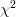

# 基于局部二值模式和 OpenCV 的人脸识别

> 原文：<https://pyimagesearch.com/2021/05/03/face-recognition-with-local-binary-patterns-lbps-and-opencv/>

在本教程中，您将学习如何使用本地二进制模式(LBPs)、OpenCV 和`cv2.face.LBPHFaceRecognizer_create`函数来执行人脸识别。

在我们之前的教程中，我们讨论了人脸识别的[基础，包括:](https://pyimagesearch.com/2021/05/01/what-is-face-recognition/)

*   人脸检测和人脸识别的区别
*   人脸识别算法如何工作
*   经典人脸识别方法和基于深度学习的人脸识别器的区别

今天我们将首次尝试通过局部二进制模式算法实现人脸识别。本教程结束时，你将能够实现你的第一个人脸识别系统。

**要了解如何使用 LBPs 和 OpenCV 进行人脸识别，** ***继续阅读。***

## **采用局部二值模式(LBPs)和 OpenCV 的人脸识别**

在本教程的第一部分，我们将讨论人脸识别算法的 LBPs，包括它是如何工作的。

然后，我们将配置我们的开发环境，并检查我们的项目目录结构。

然后，我将向您展示如何使用 OpenCV 实现 LBPs 进行人脸识别。

### **局部二进制模式(LBPs)用于人脸识别算法**

我们今天在这里讨论的人脸识别算法首先是由 Ahonen 等人在他们 2004 年的出版物上提出的， [*用本地二进制模式进行人脸识别*](https://link.springer.com/chapter/10.1007/978-3-540-24670-1_36) 。

在这一节中，我们将对算法进行概述。正如你将看到的，这其实很简单。

给定数据集中的人脸，算法的第一步是将人脸分成 *7×7* 个大小相等的单元:

然后，对于这些细胞中的每一个，我们计算一个[局部二进制模式](https://pyimagesearch.com/2015/12/07/local-binary-patterns-with-python-opencv/)直方图。

根据定义，直方图丢弃了关于模式如何彼此相邻的所有空间信息。然而，通过计算每个细胞的直方图，我们实际上能够对空间信息的级别进行编码，例如眼睛、鼻子、嘴等。否则我们就不会有。

这种空间编码还允许我们对来自每个单元*的结果直方图进行不同的加权*，从而为面部的更多区别特征提供更强的辨别能力:

在这里，我们可以看到原始人脸图像被分成 *7×7* 个细胞(*左*)。然后，在右边的*，我们可以看到每个单元格的加权方案:*

 **   白色细胞(如眼睛)的 LBP 直方图的权重是其他细胞的 4 倍**。**这仅仅意味着我们从白细胞区域提取 LBP 直方图，并将它们乘以 4(考虑直方图的任何缩放/归一化)。
*   浅灰色细胞(嘴和耳朵)多贡献 2 倍。
*   深灰色细胞(内颊和前额)仅贡献 1 倍。
*   最后，黑色细胞，如鼻子和外颊，完全被忽略，并被加权为 0x。

这些加权值是 Ahonen 等人通过在他们的训练、验证和测试数据分割之上运行超参数调整算法而实验发现的。

最后，加权的 *7×7* LBP 直方图连接在一起形成最终的特征向量。

使用完成面部识别

distance and a nearest neighbor classifier:

*   一张脸被呈现给系统
*   LBP 以与训练数据相同的方式被提取、加权和连接
*   用距离进行 k-NN(用 *k=1* )在训练数据中寻找最近的人脸。
*   与脸部关联的人的名字以最小的距离被选为最终分类

如你所见，LBPs 人脸识别算法非常简单！提取局部二进制模式并不是一项具有挑战性的任务——扩展提取方法来计算 *7×7 = 49* 个单元的直方图是足够简单的。

**在我们结束这一部分之前，重要的是要注意，LBPs 人脸识别算法还有一个额外的好处，即当新的人脸被引入到数据集中时，它可以更新。**

其他流行的算法，如特征脸，要求所有要识别的人脸在训练时出现。这意味着如果一个新的人脸被添加到数据集中，整个特征脸分类器必须被重新训练，这在计算上是相当密集的。

相反，LBPs for face recognition 算法可以简单地插入新的人脸样本，而根本不需要重新训练——这在处理人脸数据集时是一个明显的优势，因为在人脸数据集上，人们经常被添加或删除。

### **配置您的开发环境**

要了解如何使用本地二进制模式进行人脸识别，您需要在计算机上安装 OpenCV:

幸运的是，OpenCV 可以通过 pip 安装:

```py
$ pip install opencv-contrib-python
$ pip install scikit-image
```

**如果你需要帮助为 OpenCV 配置开发环境，我*强烈推荐*阅读我的** [***pip 安装 OpenCV* 指南**](https://pyimagesearch.com/2018/09/19/pip-install-opencv/)——它将在几分钟内让你启动并运行。

### **在配置开发环境时遇到了问题？**

说了这么多，你是:

*   时间紧迫？
*   了解你雇主的行政锁定系统？
*   想要跳过与命令行、包管理器和虚拟环境斗争的麻烦吗？
*   **准备好在您的 Windows、macOS 或 Linux 系统上运行代码*****？***

 *那今天就加入 [PyImageSearch 大学](https://pyimagesearch.com/pyimagesearch-university/)吧！

**获得本教程的 Jupyter 笔记本和其他 PyImageSearch 指南，这些指南是** ***预先配置的*** **，可以在您的网络浏览器中运行在 Google Colab 的生态系统上！**无需安装。

最棒的是，这些 Jupyter 笔记本可以在 Windows、macOS 和 Linux 上运行！

### **加州理工学院人脸数据集**

加州理工学院人脸挑战赛是人脸识别算法的基准数据集。总的来说，该数据集由大约 27 个不同的人的 450 幅图像组成。每个对象都是在各种照明条件、背景场景和面部表情下拍摄的，如图 4 中的**所示。**

本教程的总体目标是应用 Eigenfaces 人脸识别算法来识别加州理工学院人脸数据集中的每个主题。

***注意:我已经在与本教程相关的“下载”中包含了加州理工学院人脸数据集的一个稍微修改的版本。*** *稍加修改的版本包括一个更容易解析的目录结构，每个主题都有假名，这使得更容易评估我们的人脸识别系统的准确性。同样，您* ***不需要*** *从加州理工学院的服务器上下载加州理工学院人脸数据集——只需使用与本指南相关的“下载”即可*

### **项目结构**

在我们可以用本地二进制模式实现人脸识别之前，让我们先回顾一下我们的项目目录结构。

首先访问本教程的 ***“下载”*** 部分，以检索源代码、预训练的人脸检测器和示例加州理工学院人脸数据集:

```py
$ tree --dirsfirst --filelimit 20
.
├── caltech_faces [26 entries exceeds filelimit, not opening dir]
├── face_detector
│   ├── deploy.prototxt
│   └── res10_300x300_ssd_iter_140000.caffemodel
├── pyimagesearch
│   ├── __init__.py
│   └── faces.py
└── lbp_face_reco.py

4 directories, 7 files
```

`face_detector`目录包含我们的[基于 OpenCV 深度学习的人脸检测器](https://pyimagesearch.com/2018/02/26/face-detection-with-opencv-and-deep-learning/)。该检测器既快速又准确，能够在没有 GPU 的情况下实时运行。

我们将对`caltech_faces`数据集中的每张图像应用人脸检测器模型。该目录中有一个子目录，包含我们想要识别的每个人的图像:

```py
$ ls -l caltech_faces/
abraham
alberta
allen
carmen
conrad
cynthia
darrell
flyod
frank
glen
gloria
jacques
judy
julie
kathleen
kenneth
lewis
mae
phil
raymond
rick
ronald
sherry
tiffany
willie
winston

$ ls -l caltech_faces/abraham/*.jpg
caltech_faces/abraham/image_0022.jpg
caltech_faces/abraham/image_0023.jpg
caltech_faces/abraham/image_0024.jpg
...
caltech_faces/abraham/image_0041.jpg
```

如你所见，我们为每个想要识别的人准备了多张图片。这些图像将作为我们的训练数据，以便我们的 LBP 人脸识别器可以了解每个人的长相。

从那里，我们今天要回顾两个 Python 脚本。

第一个是`faces.py`，位于`pyimagesearch`模块中。该文件包含两个函数:

1.  将我们的人脸检测器应用于给定的图像，返回人脸的边界框坐标
2.  `load_face_dataset`:循环浏览`caltech_faces`中的所有图像，并对每个图像应用`detect_faces`功能

最后，`lbp_face_reco.py`将所有的片段粘在一起，形成我们最终的局部二值模式人脸识别实现。

### **创建我们的人脸检测器**

正如我们在[人脸识别简介指南](https://pyimagesearch.com/2021/05/01/what-is-face-recognition/)中了解到的，在执行人脸识别之前，我们需要:

1.  检测图像/视频流中人脸的存在
2.  提取感兴趣区域(ROI)，即人脸本身

一旦我们有了面部 ROI，我们就可以应用我们的面部识别算法来从个人的面部学习辨别模式。一旦训练完成，我们实际上就可以在图像和视频中识别人了。

让我们学习如何应用 OpenCV 人脸检测器来检测图像中的人脸。打开`pyimagesearch`模块中的`faces.py`文件，让我们开始工作:

```py
# import the necessary packages
from imutils import paths
import numpy as np
import cv2
import os
```

我们从第 2-5 行的**开始，开始我们需要的 Python 包。我们将需要`imutils`的`paths`子模块来获取驻留在磁盘上的所有加州理工学院人脸图像的路径。`cv2`导入提供了我们的 OpenCV 绑定。**

现在让我们定义`detect_faces`函数:

```py
def detect_faces(net, image, minConfidence=0.5):
	# grab the dimensions of the image and then construct a blob
	# from it
	(h, w) = image.shape[:2]
	blob = cv2.dnn.blobFromImage(image, 1.0, (300, 300),
		(104.0, 177.0, 123.0))
```

该方法接受三个参数:

1.  `net`:我们用于人脸检测的深度神经网络
2.  `image`:我们要对其应用人脸检测的图像
3.  `minConfidence`:正面人脸检测的最小置信度——概率小于该值的检测将作为假阳性结果被丢弃

从那里，我们获取输入`image`的空间维度，并构建一个`blob`，以便它可以通过我们的深度神经网络传递。

随着`blob`的创建，我们将其设置为面部检测器的输入并执行推断:

```py
	# pass the blob through the network to obtain the face detections,
	# then initialize a list to store the predicted bounding boxes
	net.setInput(blob)
	detections = net.forward()
	boxes = []
```

我们还初始化了一个列表`boxes`来存储应用人脸检测后的边界框坐标。

说到这里，现在让我们循环我们的`detections`并填充`boxes`列表:

```py
	# loop over the detections
	for i in range(0, detections.shape[2]):
		# extract the confidence (i.e., probability) associated with
		# the detection
		confidence = detections[0, 0, i, 2]

		# filter out weak detections by ensuring the confidence is
		# greater than the minimum confidence
		if confidence > minConfidence:
			# compute the (x, y)-coordinates of the bounding box for
			# the object
			box = detections[0, 0, i, 3:7] * np.array([w, h, w, h])
			(startX, startY, endX, endY) = box.astype("int")

			# update our bounding box results list
			boxes.append((startX, startY, endX, endY))

	# return the face detection bounding boxes
	return boxes
```

**21 线**循环所有`detections`，而**24 线**提取当前检测的`confidence`。

**第 28 行**通过丢弃任何具有小于`minConfidence`的`confidence`的面部检测来过滤弱/假阳性检测。

从那里，我们提取人脸检测的边界框坐标，缩放它们，并更新我们的边界`boxes`列表(**第 31-35 行**)。

最终的边界框返回到第 38 行**的调用函数。**

***注:*** *如果需要更详细的复习 OpenCV 的深度学习人脸检测器，一定要参考我的关于* [*用 OpenCV 进行人脸检测和深度学习*](https://pyimagesearch.com/2018/02/26/face-detection-with-opencv-and-deep-learning/) *的指南。那篇文章更详细地介绍了人脸检测器的工作原理，会让你对它有更深的理解。*

### **加载加州理工学院人脸数据集**

实现了人脸检测辅助函数之后，我们可以开始实现第二个辅助实用程序`load_face_dataset`。

该职能部门负责:

1.  遍历加州理工学院人脸数据集中的所有图像
2.  计算每个人的示例图像数量
3.  对于训练数据，排除任何少于 *N* 张面孔的个体(否则我们会遇到类别不平衡的问题)
4.  应用我们的`detect_faces`函数
5.  提取每个单独的人脸 ROI
6.  将面部 ROI 和类别标签(即人名)返回给调用函数

让我们现在就开始实现`load_face_dataset`。再次打开`pyimagesearch`模块中的`faces.py`文件，并在文件底部添加以下代码:

```py
def load_face_dataset(inputPath, net, minConfidence=0.5,
	minSamples=15):
	# grab the paths to all images in our input directory, extract
	# the name of the person (i.e., class label) from the directory
	# structure, and count the number of example images we have per
	# face
	imagePaths = list(paths.list_images(inputPath))
	names = [p.split(os.path.sep)[-2] for p in imagePaths]
	(names, counts) = np.unique(names, return_counts=True)
	names = names.tolist()
```

我们的`load_face_dataset`函数接受四个参数:

1.  `inputPath`:我们想要在其上训练 LBP 人脸识别器的输入数据集的人脸(在这种情况下，是`caltech_faces`目录)
2.  `net`:我们的 OpenCV 深度学习人脸检测器网络
3.  `minConfidence`:用于过滤弱/假阳性检测的人脸检测的最小概率/置信度
4.  `minSamples`:每个人所需的最少图像数量

**第 46 行**获取了`inputPath`中所有图像的路径。然后我们从第 47 行的**中提取这些`imagePaths`的名字。**

**线 48** 执行两个操作:

1.  首先，它从`names`(即我们想要识别的人的名字)中确定一组*唯一的*类标签
2.  第二，它统计每个人的名字出现的次数

我们执行这个计数操作，因为我们想要丢弃任何少于`minSamples`的个体。如果我们试图在具有少量训练样本的个体上训练我们的 LBP 人脸识别器，我们会遇到类别不平衡的问题，并且准确性会受到影响(这个概念超出了本教程的范围)。

让我们现在处理我们的每一个图像:

```py
	# initialize lists to store our extracted faces and associated
	# labels
	faces = []
	labels = []

	# loop over the image paths
	for imagePath in imagePaths:
		# load the image from disk and extract the name of the person
		# from the subdirectory structure
		image = cv2.imread(imagePath)
		name = imagePath.split(os.path.sep)[-2]

		# only process images that have a sufficient number of
		# examples belonging to the class
		if counts[names.index(name)] < minSamples:
			continue
```

**第 53 和 54 行**初始化两个列表——一个存储提取的人脸 ROI，另一个存储每个人脸 ROI 包含的个人姓名。

然后我们循环第 57 行上的所有`imagePaths`。对于每张脸，我们:

1.  从磁盘加载它
2.  从子目录结构中提取个人的姓名
3.  查看`name`是否少于与其相关联的`minSamples`

如果最小测试失败(**行 65 和 66** )，意味着没有足够的训练图像用于该个体，我们丢弃该图像并且不考虑将其用于训练。

否则，我们假设通过了最小测试，然后继续处理图像:

```py
		# perform face detection
		boxes = detect_faces(net, image, minConfidence)

		# loop over the bounding boxes
		for (startX, startY, endX, endY) in boxes:
			# extract the face ROI, resize it, and convert it to
			# grayscale
			faceROI = image[startY:endY, startX:endX]
			faceROI = cv2.resize(faceROI, (47, 62))
			faceROI = cv2.cvtColor(faceROI, cv2.COLOR_BGR2GRAY)

			# update our faces and labels lists
			faces.append(faceROI)
			labels.append(name)

	# convert our faces and labels lists to NumPy arrays
	faces = np.array(faces)
	labels = np.array(labels)

	# return a 2-tuple of the faces and labels
	return (faces, labels)
```

对**行 69** 上的`detect_faces`的调用执行面部检测，产生一组边界框，我们在**行 72 上循环。**

对于每个包围盒，我们:

1.  使用 NumPy 数组切片提取人脸感兴趣区域
2.  将脸部 ROI 调整为固定大小
3.  将面部 ROI 转换为灰度
4.  更新我们的`faces`和`labels`列表

然后将结果`faces`和`labels`返回给调用函数。

### **实现用于人脸识别的局部二进制模式**

实现了助手工具后，我们可以继续创建驱动程序脚本，负责从人脸 ROI 中提取 LBP，训练模型，然后最终执行人脸识别。

打开项目目录结构中的`lbp_face_reco.py`文件，让我们开始工作:

```py
# import the necessary packages
from sklearn.preprocessing import LabelEncoder
from sklearn.model_selection import train_test_split
from sklearn.metrics import classification_report
from pyimagesearch.faces import load_face_dataset
import numpy as np
import argparse
import imutils
import time
import cv2
import os
```

**第 2-11 行**导入我们需要的 Python 包。值得注意的进口包括:

*   `LabelEncoder`:用于将类别标签(即个人姓名)编码为*整数*而不是*字符串*(这是利用 OpenCV 的 LBP 人脸识别器的*要求*
*   `train_test_split`:从我们的加州理工学院人脸数据集构建一个训练和测试分割
*   `load_face_dataset`:从磁盘加载我们的加州理工学院人脸数据集

现在让我们解析我们的命令行参数:

```py
# construct the argument parser and parse the arguments
ap = argparse.ArgumentParser()
ap.add_argument("-i", "--input", type=str, required=True,
	help="path to input directory of images")
ap.add_argument("-f", "--face", type=str,
	default="face_detector",
	help="path to face detector model directory")
ap.add_argument("-c", "--confidence", type=float, default=0.5,
	help="minimum probability to filter weak detections")
args = vars(ap.parse_args())
```

我们需要解析一个必需的和两个可选的命令行参数:

1.  `--input`:我们的输入数据集的路径，该数据集包含我们想要训练 LBP 人脸识别器的个人的图像
2.  `--face`:OpenCV 深度学习人脸检测器之路
3.  `--confidence`:用于过滤弱检测的最小概率

考虑到我们的命令行参数，我们可以从磁盘加载面部检测器:

```py
# load our serialized face detector model from disk
print("[INFO] loading face detector model...")
prototxtPath = os.path.sep.join([args["face"], "deploy.prototxt"])
weightsPath = os.path.sep.join([args["face"],
	"res10_300x300_ssd_iter_140000.caffemodel"])
net = cv2.dnn.readNet(prototxtPath, weightsPath)
```

从那里，我们应用`load_face_dataset`函数来加载我们的面部数据:

```py
# load the CALTECH faces dataset
print("[INFO] loading dataset...")
(faces, labels) = load_face_dataset(args["input"], net,
	minConfidence=0.5, minSamples=20)
print("[INFO] {} images in dataset".format(len(faces)))

# encode the string labels as integers
le = LabelEncoder()
labels = le.fit_transform(labels)

# construct our training and testing split
(trainX, testX, trainY, testY) = train_test_split(faces,
	labels, test_size=0.25, stratify=labels, random_state=42)
```

**第 33 和 34 行**加载加州理工学院人脸数据集。这里我们提供包含数据集的`--input`目录的路径。我们还提供人脸检测器(`net)`)和一个人参与训练过程所需的最少人脸数量(`20`)。

然后，我们使用我们的`LabelEncoder` ( **第 38 和 39 行**)对`labels`进行编码，然后构建我们的训练和测试分割，使用 75%的数据进行训练，25%的数据进行评估(**第 42 和 43 行**)。

我们现在准备使用 LBPs 和 OpenCV 来训练我们人脸识别器:

```py
# train our LBP face recognizer
print("[INFO] training face recognizer...")
recognizer = cv2.face.LBPHFaceRecognizer_create(
	radius=2, neighbors=16, grid_x=8, grid_y=8)
start = time.time()
recognizer.train(trainX, trainY)
end = time.time()
print("[INFO] training took {:.4f} seconds".format(end - start))
```

`cv2.face.LBPHFaceRecognizer_create`函数接受几个(可选的)参数，我显式定义这些参数是为了让这个例子更清楚。

`radius=2`和`neighbors=16`参数是[局部二进制模式图像描述符](https://pyimagesearch.com/2015/12/07/local-binary-patterns-with-python-opencv/)的一部分。这些值控制直方图计算中包含的像素数，以及这些像素所在的半径。如果你需要复习这些参数，请参阅[本地二进制模式教程](https://pyimagesearch.com/2015/12/07/local-binary-patterns-with-python-opencv/)。

`grid_x`和`grid_y`控制人脸识别算法中 *MxN* 细胞的数量。

虽然 Ahonen 等人的原始论文建议使用 *7×7* 网格，但我更喜欢使用 *8×8* 网格，它允许更大的粒度，从而导致更高的精度。

然而，这种增加的精度是以(1)更长的特征提取/比较时间(由于要计算的 LBP 直方图的数量从 49 跳到 64)为代价的，并且可能更重要的是，(2)存储特征向量的相当多的存储器消耗。

在实践中，您应该在自己的数据集上调整`grid_x`和`grid_y`超参数，看看哪个值产生的精度最高。

为了训练我们的 LBP 人脸识别器，我们简单地调用`train`方法，传入我们的加州理工学院人脸训练数据以及每个主题的(整数)标签。

现在让我们使用 LBP 面部识别器来收集预测:

```py
# initialize the list of predictions and confidence scores
print("[INFO] gathering predictions...")
predictions = []
confidence = []
start = time.time()

# loop over the test data
for i in range(0, len(testX)):
	# classify the face and update the list of predictions and
	# confidence scores
	(prediction, conf) = recognizer.predict(testX[i])
	predictions.append(prediction)
	confidence.append(conf)

# measure how long making predictions took
end = time.time()
print("[INFO] inference took {:.4f} seconds".format(end - start))

# show the classification report
print(classification_report(testY, predictions,
	target_names=le.classes_))
```

我们初始化两个列表`predictions`和`confidences`，以存储预测的类标签和预测的置信度/概率。

从那里，我们循环测试集中的所有图像(**行 61** )。

对于这些面孔中的每一个，我们调用`recognizer`的`predict`方法，该方法返回一个二元组(1)`prediction`(即主题的整数标签)和(2)`conf`(信心的简称)，它只是

distance between the current testing vector and the closest data point in the training data. **The lower the distance, more likely the two faces are of the same subject.**

最后，分类报告显示在**行 73 和 74 上。**

我们的最后一步是可视化人脸识别结果的子集:

```py
# generate a sample of testing data
idxs = np.random.choice(range(0, len(testY)), size=10, replace=False)

# loop over a sample of the testing data
for i in idxs:
	# grab the predicted name and actual name
	predName = le.inverse_transform([predictions[i]])[0]
	actualName = le.classes_[testY[i]]

	# grab the face image and resize it such that we can easily see
	# it on our screen
	face = np.dstack([testX[i]] * 3)
	face = imutils.resize(face, width=250)

	# draw the predicted name and actual name on the image
	cv2.putText(face, "pred: {}".format(predName), (5, 25),
		cv2.FONT_HERSHEY_SIMPLEX, 0.8, (0, 255, 0), 2)
	cv2.putText(face, "actual: {}".format(actualName), (5, 60),
		cv2.FONT_HERSHEY_SIMPLEX, 0.8, (0, 0, 255), 2)

	# display the predicted name, actual name, and confidence of the
	# prediction (i.e., chi-squared distance; the *lower* the distance
	# is the *more confident* the prediction is)
	print("[INFO] prediction: {}, actual: {}, confidence: {:.2f}".format(
		predName, actualName, confidence[i]))

	# display the current face to our screen
	cv2.imshow("Face", face)
	cv2.waitKey(0)
```

第 77 行随机抽取所有测试数据指标。

然后我们在第 80 行的**上循环这些索引。对于每个指数，我们:**

1.  从我们的标签编码器中提取*预测的*人的名字(**行 82**
2.  抢*地面实况*人名(**线 83**
3.  调整`face`的大小，以便我们可以在屏幕上轻松看到它(**第 87 行和第 88 行**)
4.  在脸上画出预测名和实际名(**第 91-94 行**)
5.  将最终输出显示到我们的屏幕上(**第 99-104 行**)

这就是全部了！恭喜用局部二值模式和 LBPs 实现人脸识别！

### **局部二值模式人脸识别结果**

我们现在准备用局部二进制模式和 OpenCV 进行人脸识别！

请务必访问本教程的 ***“下载”*** 部分，以检索源代码和示例 CALTECH Faces 数据集。

从那里，打开一个终端并执行以下命令:

```py
$ python lbp_face_reco.py --input caltech_faces
[INFO] loading face detector model...
[INFO] loading dataset...
[INFO] 397 images in dataset
[INFO] training face recognizer...
[INFO] training took 3.0534 seconds
[INFO] gathering predictions...
[INFO] inference took 127.8610 seconds
              precision    recall  f1-score   support

     abraham       1.00      1.00      1.00         5
       allen       1.00      1.00      1.00         8
      carmen       1.00      0.80      0.89         5
      conrad       0.86      1.00      0.92         6
     cynthia       1.00      1.00      1.00         5
     darrell       1.00      1.00      1.00         5
       frank       1.00      1.00      1.00         5
      gloria       1.00      1.00      1.00         5
     jacques       1.00      1.00      1.00         6
        judy       1.00      1.00      1.00         5
       julie       1.00      1.00      1.00         5
     kenneth       1.00      1.00      1.00         6
         mae       1.00      1.00      1.00         5
     raymond       1.00      1.00      1.00         6
        rick       1.00      1.00      1.00         6
      sherry       1.00      0.83      0.91         6
     tiffany       0.83      1.00      0.91         5
      willie       1.00      1.00      1.00         6

    accuracy                           0.98       100
   macro avg       0.98      0.98      0.98       100
weighted avg       0.98      0.98      0.98       100
```

正如我们的输出所示，我们首先遍历数据集中的所有输入图像，检测人脸，然后使用人脸识别算法提取 LBP。由于需要为每个单元计算 LBP，因此该过程需要一些时间。

从那里我们执行推理，获得 98%的准确性。

这种方法的缺点是，识别我们数据集中的所有人脸只需要 2 分多钟。推理如此缓慢的原因是因为我们必须在整个训练集中执行最近邻搜索。

为了提高我们算法的速度，我们应该考虑使用专门的近似最近邻算法，这可以*大大减少*执行最近邻搜索所需的时间。

现在，让我们将我们的 LBP 人脸识别器应用于单独的图像:

```py
[INFO] prediction: jacques, actual: jacques, confidence: 163.11
[INFO] prediction: jacques, actual: jacques, confidence: 164.36
[INFO] prediction: allen, actual: allen, confidence: 192.58
[INFO] prediction: abraham, actual: abraham, confidence: 167.72
[INFO] prediction: mae, actual: mae, confidence: 154.34
[INFO] prediction: rick, actual: rick, confidence: 170.42
[INFO] prediction: rick, actual: rick, confidence: 171.12
[INFO] prediction: tiffany, actual: carmen, confidence: 204.12
[INFO] prediction: allen, actual: allen, confidence: 192.51
[INFO] prediction: mae, actual: mae, confidence: 167.03
```

**图 5** 显示了我们的 LBP 人脸识别算法的合成结果。我们能够使用 LBP 方法正确地识别每个个体。

## **总结**

本课详细介绍了局部二进制模式人脸识别算法的工作原理。我们首先回顾了加州理工学院人脸数据集，这是一个用于评估人脸识别算法的流行基准。

从那里，我们回顾了 Ahonen 等人在他们 2004 年的论文*用局部二进制模式进行人脸识别*中介绍的 LBPs 人脸识别算法。这个方法很简单，但很有效。整个算法基本上由三个步骤组成:

1.  将每个输入图像分成 *7×7* 个大小相等的单元
2.  从每个单元中提取局部二进制模式；根据每个细胞对人脸识别的区分程度对它们进行加权；最后将 *7×7 = 49* 个直方图串联起来，形成最终的特征向量
3.  通过使用具有 *k=1* 和距离度量的 k-NN 分类器来执行人脸识别

虽然算法本身实现起来非常简单，但 OpenCV 预构建了一个类，专门用于使用 LBP 执行人脸识别。我们使用`cv2.face.LBPHFaceRecognizer_create`在加州理工学院人脸数据集上训练我们的人脸识别器，并获得了 98%的准确率，这是我们人脸识别之旅的良好开端。

**要下载这篇文章的源代码(并在未来教程在 PyImageSearch 上发布时得到通知)，*只需在下面的表格中输入您的电子邮件地址！*****