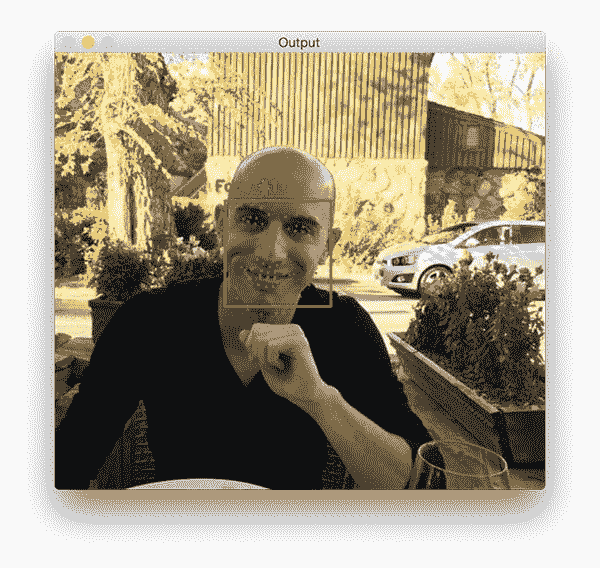
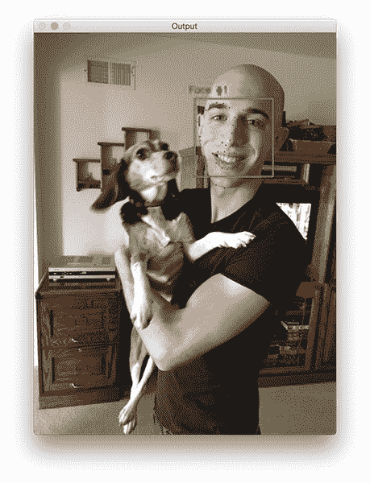

# 使用 dlib、OpenCV 和 Python 的面部标志

> 原文：<https://pyimagesearch.com/2017/04/03/facial-landmarks-dlib-opencv-python/>

最后更新于 2021 年 7 月 3 日。

上周我们学习了如何用 Python 绑定在我们的系统上安装和配置 dlib。

今天我们将使用 dlib 和 OpenCV 来检测图像中的*面部标志。*

 *面部标志用于定位和表示面部的显著区域，例如:

*   眼睛
*   眉毛
*   鼻子
*   口
*   下颌的轮廓

面部标志已经成功地应用于面部对齐、头部姿势估计、面部交换、眨眼检测等等。

在今天的博文中，我们将关注面部标志的**基础，包括:**

1.  到底什么是面部标志以及*它们是如何工作的*。
2.  如何使用 dlib、OpenCV 和 Python 从图像中检测和提取面部标志。

在本系列的下一篇博文中，我们将更深入地探究面部标志，并学习如何基于这些面部标志提取特定的*面部区域。*

**要了解更多关于面部标志的信息，*继续阅读*。**

*   【2021 年 7 月更新: 增加了替代面部标志检测器的部分，包括 dlib 的 5 点面部标志检测器、OpenCV 的内置面部标志检测器和 MediaPipe 的面部网格检测器。

## 使用 dlib、OpenCV 和 Python 的面部标志

这篇博客文章的第一部分将讨论面部标志以及为什么它们被用于计算机视觉应用。

从那以后，我将演示如何使用 dlib、OpenCV 和 Python 来检测和提取面部标志。

最后，我们将查看将面部标志检测应用于图像的一些结果。

### 什么是面部标志？

检测面部标志是*形状预测*问题的*子集*。给定输入图像(通常是指定感兴趣对象的 ROI ),形状预测器试图沿着形状定位感兴趣的关键点。

在面部标志的背景下，我们的目标是使用形状预测方法检测面部的重要面部结构。

因此，检测面部标志是一个两步过程:

*   **步骤#1:** 定位图像中的人脸。
*   **步骤#2:** 检测人脸 ROI 上的关键人脸结构。

面部检测(步骤#1)可以以多种方式实现。

我们可以使用 OpenCV 的内置哈尔级联。

我们可以应用预训练的 [HOG +线性 SVM 对象检测器](https://pyimagesearch.com/2014/11/10/histogram-oriented-gradients-object-detection/)专门用于面部检测的任务。

或者我们甚至可以使用基于深度学习的算法进行人脸定位。

在这两种情况下，用于检测图像中人脸的实际算法并不重要。相反，重要的是通过某种方法我们获得人脸包围盒(即 *(x，y)*——图像中人脸的坐标)。

给定面部区域后，我们可以应用**步骤#2:检测面部区域中的关键面部结构。**

有多种面部标志检测器，但是所有方法本质上都试图定位和标记以下面部区域:

*   口
*   右眉
*   左眉毛
*   右眼
*   左眼
*   鼻子
*   颌

dlib 库中包含的面部标志检测器是卡泽米和沙利文(2014)的论文 [*一毫秒面部对齐与回归树*](https://pdfs.semanticscholar.org/d78b/6a5b0dcaa81b1faea5fb0000045a62513567.pdf) 集合的实现。

该方法首先使用:

1.  图像上标记的面部标志的训练集。这些图像被*手动标记为*，指定**特定的** *(x，y)*-每个面部结构周围区域的坐标。
2.  *先验*，更具体地说，输入像素对之间距离的*概率。*

给定该训练数据，回归树的集合被训练来直接从*像素强度本身*估计面部标志位置(即，没有“特征提取”发生)。

最终结果是一个面部标志检测器，它可以用于在具有高质量预测的*实时* 中**检测面部标志。**

关于这种特定技术的更多信息和细节，请务必阅读上面链接的卡泽米和沙利文的论文，以及官方 dlib 公告。

### 了解 dlib 的面部标志检测器

dlib 库中预先训练的面部标志检测器用于估计映射到面部上面部结构的 ***68 (x，y)***坐标的位置。

下图显示了 68 个坐标的索引:

这些注释是 dlib 面部标志预测器被训练的 68 点 [iBUG 300-W 数据集](https://ibug.doc.ic.ac.uk/resources/facial-point-annotations/)的一部分。

值得注意的是，还存在其他风格的面部标志检测器，包括可以在[海伦数据集](http://www.ifp.illinois.edu/~vuongle2/helen/)上训练的 194 点模型。

无论使用哪种数据集，都可以利用相同的 dlib 框架根据输入训练数据训练形状预测器，如果您想要训练面部标志检测器或自己的自定义形状预测器，这将非常有用。

在这篇博文的剩余部分，我将演示如何在图像中检测这些面部标志。

本系列未来的博客文章将使用这些面部标志来提取面部的特定区域，应用面部对齐，甚至建立眨眼检测系统。

### 用 dlib、OpenCV 和 Python 检测面部标志

为了准备这一系列关于面部标志的博文，我在我的 [imutils 库](https://github.com/jrosebr1/imutils)中添加了一些便利的函数，具体来说就是在 face_utils.py 中添加了[。](https://github.com/jrosebr1/imutils/tree/master/imutils/face_utils)

现在我们将在`face_utils.py`中回顾其中的两个函数，下周我们将回顾其余的函数。

第一个效用函数是`rect_to_bb`，是“矩形到边界框”的简称:

```py
def rect_to_bb(rect):
	# take a bounding predicted by dlib and convert it
	# to the format (x, y, w, h) as we would normally do
	# with OpenCV
	x = rect.left()
	y = rect.top()
	w = rect.right() - x
	h = rect.bottom() - y

	# return a tuple of (x, y, w, h)
	return (x, y, w, h)

```

该函数接受单个参数`rect`，该参数被假定为由 dlib 检测器(即面部检测器)产生的边界框矩形。

`rect`对象包括检测的 *(x，y)* 坐标。

然而，在 OpenCV 中，我们通常根据*(x，y，宽度，高度)*来考虑边界框，因此为了方便起见，`rect_to_bb`函数将这个`rect`对象转换成一个 4 元组坐标。

同样，这仅仅是一个便利和品味的问题。

其次，我们有`shape_to_np`函数:

```py
def shape_to_np(shape, dtype="int"):
	# initialize the list of (x, y)-coordinates
	coords = np.zeros((68, 2), dtype=dtype)

	# loop over the 68 facial landmarks and convert them
	# to a 2-tuple of (x, y)-coordinates
	for i in range(0, 68):
		coords[i] = (shape.part(i).x, shape.part(i).y)

	# return the list of (x, y)-coordinates
	return coords

```

dlib 面部标志检测器将返回一个包含面部标志区域的 68 个 *(x，y)* 坐标的`shape`对象。

使用`shape_to_np`函数，我们可以将这个对象转换成一个 NumPy 数组，允许它“更好地”使用我们的 Python 代码。

给定这两个辅助函数，我们现在准备好检测图像中的面部标志。

打开一个新文件，将其命名为`facial_landmarks.py`，并插入以下代码:

```py
# import the necessary packages
from imutils import face_utils
import numpy as np
import argparse
import imutils
import dlib
import cv2

# construct the argument parser and parse the arguments
ap = argparse.ArgumentParser()
ap.add_argument("-p", "--shape-predictor", required=True,
	help="path to facial landmark predictor")
ap.add_argument("-i", "--image", required=True,
	help="path to input image")
args = vars(ap.parse_args())

```

**第 2-7 行**导入我们需要的 Python 包。

我们将使用`imutils`的`face_utils`子模块来访问上面详述的助手函数。

然后我们将导入`dlib`。如果你的系统上还没有安装 dlib，请[按照我之前的博客文章](https://pyimagesearch.com/2017/03/27/how-to-install-dlib/)中的说明来正确配置你的系统。

**第 10-15 行**解析我们的命令行参数:

*   `--shape-predictor`:这是通往 dlib 预先训练好的面部标志检测器的路径。你可以在这里下载探测器型号[，或者你也可以使用这篇文章的 ***“下载”*** 部分来获取代码+示例图像+预训练的探测器。](http://dlib.net/files/shape_predictor_68_face_landmarks.dat.bz2)
*   `--image`:我们要检测面部标志的输入图像的路径。

既然我们的导入和命令行参数已经处理好了，让我们初始化 dlib 的面部检测器和面部标志预测器:

```py
# initialize dlib's face detector (HOG-based) and then create
# the facial landmark predictor
detector = dlib.get_frontal_face_detector()
predictor = dlib.shape_predictor(args["shape_predictor"])

```

**第 19 行**基于对用于对象检测的标准[梯度方向直方图+线性 SVM 方法](https://pyimagesearch.com/2014/11/10/histogram-oriented-gradients-object-detection/)的修改，初始化 dlib 的预训练人脸检测器。

**第 20 行**然后使用提供的路径`--shape-predictor`加载面部标志预测器。

但是在我们实际检测面部标志之前，我们首先需要检测输入图像中的面部:

```py
# load the input image, resize it, and convert it to grayscale
image = cv2.imread(args["image"])
image = imutils.resize(image, width=500)
gray = cv2.cvtColor(image, cv2.COLOR_BGR2GRAY)

# detect faces in the grayscale image
rects = detector(gray, 1)

```

**第 23 行**通过 OpenCV 从磁盘加载我们的输入图像，然后预处理图像，调整宽度为 500 像素，并将其转换为灰度(**第 24 行和第 25 行**)。

**第 28 行**处理检测我们图像中人脸的边界框。

`detector`的第一个参数是我们的灰度图像(尽管这个方法也可以用于彩色图像)。

第二个参数是在应用检测器之前放大图像时要应用的图像金字塔层数(这相当于在图像上计算[cv2 . pyrap](http://docs.opencv.org/3.1.0/d4/d86/group__imgproc__filter.html#gada75b59bdaaca411ed6fee10085eb784)*N*次)。

在人脸检测之前提高输入图像的分辨率的好处是，它可以让我们在图像中检测到更多的*张*张人脸——坏处是，输入图像越大，检测过程的计算成本就越高。

给定图像中面部的 *(x，y)*-坐标，我们现在可以将面部标志检测应用于每个面部区域:

```py
# loop over the face detections
for (i, rect) in enumerate(rects):
	# determine the facial landmarks for the face region, then
	# convert the facial landmark (x, y)-coordinates to a NumPy
	# array
	shape = predictor(gray, rect)
	shape = face_utils.shape_to_np(shape)

	# convert dlib's rectangle to a OpenCV-style bounding box
	# [i.e., (x, y, w, h)], then draw the face bounding box
	(x, y, w, h) = face_utils.rect_to_bb(rect)
	cv2.rectangle(image, (x, y), (x + w, y + h), (0, 255, 0), 2)

	# show the face number
	cv2.putText(image, "Face #{}".format(i + 1), (x - 10, y - 10),
		cv2.FONT_HERSHEY_SIMPLEX, 0.5, (0, 255, 0), 2)

	# loop over the (x, y)-coordinates for the facial landmarks
	# and draw them on the image
	for (x, y) in shape:
		cv2.circle(image, (x, y), 1, (0, 0, 255), -1)

# show the output image with the face detections + facial landmarks
cv2.imshow("Output", image)
cv2.waitKey(0)

```

我们开始在第 31 行的**上循环每个面部检测。**

对于每个面部检测，我们在第 35 行**上应用面部标志检测，给我们 68 *(x，y)*-坐标映射到图像中的特定面部特征。**

**第 36 行**然后将 dlib `shape`对象转换成形状为 *(68，2)* 的 NumPy 数组。

**第 40 和 41 行**在`image`上画出包围被检测人脸的边界框，而**第 44 和 45 行**画出人脸的索引。

最后，**行 49 和 50** 在检测到的面部标志上循环，并单独绘制它们中的每一个。

第 53 行和第 54 行简单地将输出`image`显示到我们的屏幕上。

### 面部标志可视化

在我们测试我们的面部标志检测器之前，请确保您已经升级到包含`face_utils.py`文件的最新版本`imutils`:

```py
$ pip install --upgrade imutils
```

***注意:**如果您正在使用 Python 虚拟环境，请确保在虚拟环境中升级`imutils`。*

从那里，使用本指南的 ***“下载”*** 部分下载源代码、示例图像和预训练的 dlib 面部标志检测器。

一旦你下载了。压缩归档文件，将其解压缩，将目录更改为`facial-landmarks`，并执行以下命令:

```py
$ python facial_landmarks.py --shape-predictor shape_predictor_68_face_landmarks.dat \
	--image images/example_01.jpg

```



**Figure 3:** Applying facial landmark detection using dlib, OpenCV, and Python.

注意我的脸的边界框是如何用绿色绘制的，而每个单独的面部标志是用红色绘制的。

第二个示例图像也是如此:

```py
$ python facial_landmarks.py --shape-predictor shape_predictor_68_face_landmarks.dat \
	--image images/example_02.jpg

```



**Figure 4:** Facial landmarks with dlib.

在这里，我们可以清楚地看到红色圆圈映射到特定的面部特征，包括我的下颌线、嘴、鼻子、眼睛和眉毛。

让我们来看最后一个例子，这次图像中有多个人:

```py
$ python facial_landmarks.py --shape-predictor shape_predictor_68_face_landmarks.dat \
	--image images/example_03.jpg

```

对于图像中的两个人(我自己和我的未婚妻特里莎)，我们的脸不仅被*检测到*，还被*通过面部标志标注到*。

### **替代面部标志检测器**

由于 Dlib 库的速度和可靠性，dlib 的 68 点面部标志检测器往往是计算机视觉领域最受欢迎的面部标志检测器。

然而，存在其他面部标志检测模型。

首先，dlib 提供了一个替代的 5 点面部标志检测器，它比 68 点检测器更快。如果你只需要眼睛和鼻子的位置，这个模型会很好用。

最受欢迎的新面部标志检测器之一来自 [MediaPipe 库](https://mediapipe.dev/)，它能够计算 3D 面部网格:

在不久的将来，我会在 PyImageSearch 博客上用 MediaPipe 和 face mesh 做教程。

如果你想完全避免使用 OpenCV 之外的库(例如，没有 dlib、MediaPipe 等。)，那么值得注意的是[OpenCV*是否支持内置面部标志检测器*](https://learnopencv.com/facemark-facial-landmark-detection-using-opencv/)*；然而，我以前没有使用过它，我不能评论它的准确性，易用性等。*

 *## 摘要

在今天的博文中，我们学习了什么是面部标志，以及如何使用 dlib、OpenCV 和 Python 来检测它们。

检测图像中的面部标志是一个两步过程:

1.  首先，我们必须定位图像中的人脸。这可以使用多种不同的技术来实现，但通常涉及 Haar 级联或 HOG +线性 SVM 检测器(但任何在面部周围产生边界框的方法都可以)。
2.  应用形状预测器，特别是面部标志检测器，以获得面部 ROI 中面部区域的 *(x，y)*-坐标。

给定这些面部标志，我们可以应用许多计算机视觉技术，包括:

*   面部部分提取(即，鼻子、眼睛、嘴、下颌线等。)
*   面部对齐
*   头部姿态估计
*   扇耳光
*   眨眼检测
*   …还有更多！

在下周的博客文章中，我将展示如何通过使用一点 NumPy 数组切片魔法，单独访问每个面部部分*和提取眼睛、眉毛、鼻子、嘴和下颌线特征。*

**为了在下一篇博文发布时得到通知，*请务必在下表中输入您的电子邮件地址！*****