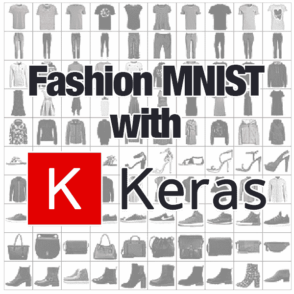
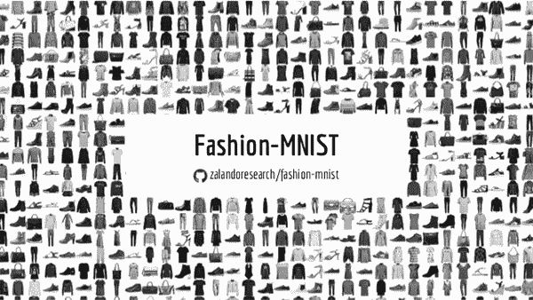
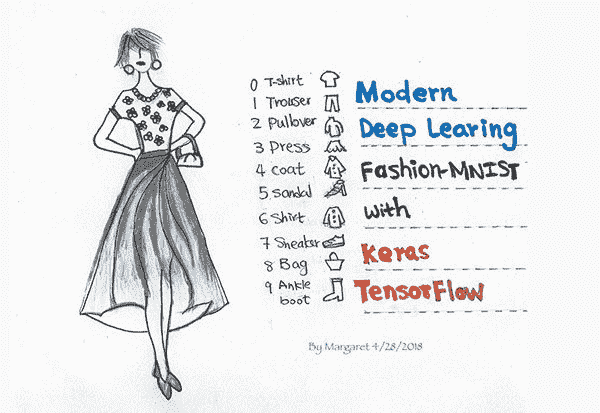
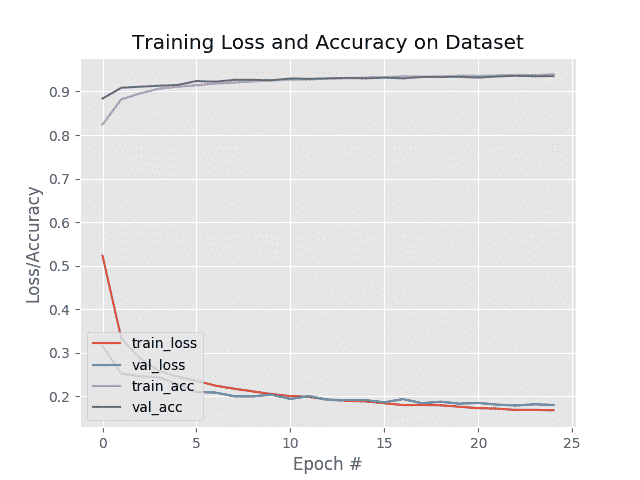

# 用 Keras 和深度学习时尚 MNIST

> 原文：<https://pyimagesearch.com/2019/02/11/fashion-mnist-with-keras-and-deep-learning/>

在本教程中，您将学习如何在时尚 MNIST 数据集上使用 Keras 训练一个简单的卷积神经网络(CNN ),使您能够对时尚图像和类别进行分类。

[](https://pyimagesearch.com/wp-content/uploads/2019/02/fashion_mnist_header.png)

时尚 MNIST 数据集旨在替代(挑战性较小的)MNIST 数据集(挑战性稍大)。

**类似于 MNIST 数字数据集，时尚 MNIST 数据集包括:**

*   60，000 个培训示例
*   10，000 个测试示例
*   10 节课
*   28×28 灰度/单通道图像

**十大时尚类标签包括:**

1.  t 恤/上衣
2.  裤子
3.  套头衬衫
4.  连衣裙
5.  外套
6.  凉鞋
7.  衬衫
8.  运动鞋
9.  包
10.  踝靴

在整个教程中，您将学习如何在时尚 MNIST 数据集上使用 Keras 训练一个简单的卷积神经网络(CNN ),这不仅会让您获得使用 Keras 库的实践经验，还会让您初次体验服装/时尚分类。

**要了解如何在时尚 MNIST 数据集上训练一个 Keras CNN，*继续阅读！***

## 用 Keras 和深度学习时尚 MNIST

***2020-06-11 更新:**此博文现已兼容 TensorFlow 2+!*

在本教程的第一部分，我们将回顾时尚 MNIST 数据集，包括如何将其下载到您的系统。

从那里，我们将使用 Keras 深度学习库定义一个简单的 CNN 网络。

最后，我们将在时尚 MNIST 数据集上训练我们的 CNN 模型，评估它，并检查结果。

让我们开始吧！

### 时尚 MNIST 数据集

[](https://pyimagesearch.com/wp-content/uploads/2019/02/fashion_mnist_dataset_sample.png)

**Figure 1:** The [Fashion MNIST dataset](https://github.com/zalandoresearch/fashion-mnist) was created by e-commerce company, [Zalando](https://zalando.com/), as a drop-in replacement for MNIST Digits. It is a great dataset to practice with when using Keras for deep learning. ([image source](https://medium.com/deep-learning-turkey/deep-learning-lab-episode-1-fashion-mnist-c7af60029836))

时尚 MNIST 数据集是由电子商务公司 Zalando 创建的。

正如他们在时尚 MNIST 数据集、**的官方 [GitHub repo 上指出的，标准的 MNIST 数字识别数据集存在一些问题:](https://github.com/zalandoresearch/fashion-mnist)**

1.  对于标准的机器学习算法来说，获得 97%以上的准确率太容易了。
2.  深度学习模型要达到 99%+的准确率*甚至更容易*。
3.  数据集*被过度使用*。
4.  MNIST *不能代表*现代计算机视觉任务。

因此，Zalando 创建了时尚 MNIST 数据集，作为 MNIST 的替代物。

时尚 MNIST 数据集在训练集大小、测试集大小、类别标签数量和图像尺寸方面与 MNIST 数据集相同:

*   60，000 个培训示例
*   10，000 个测试示例
*   10 节课
*   28×28 灰度图像

如果你曾经在 MNIST 数字数据集上训练过一个网络，那么你基本上可以改变一两行代码，然后在时尚 MNIST 数据集上训练同样的网络！

### How to install TensorFlow/Keras

要针对本教程配置您的系统，我首先建议您遵循以下任一教程:

*   [*如何在 Ubuntu 上安装 tensor flow 2.0*](https://pyimagesearch.com/2019/12/09/how-to-install-tensorflow-2-0-on-ubuntu/)
*   [*如何在 macOS 上安装 tensor flow 2.0*](https://pyimagesearch.com/2019/12/09/how-to-install-tensorflow-2-0-on-macos/)

这两个教程都将帮助您在一个方便的 Python 虚拟环境中，用这篇博文所需的所有软件来配置您的系统。

请注意 [PyImageSearch 不推荐也不支持 CV/DL 项目](https://pyimagesearch.com/faqs/single-faq/can-you-help-me-do-___-on-windows/)的窗口。

### 获取时尚 MNIST 数据集

[](https://pyimagesearch.com/wp-content/uploads/2019/02/fashion_mnist_obtaining.jpg)

**Figure 2:** The Fashion MNIST dataset is [built right into Keras](https://keras.io/datasets/#fashion-mnist-database-of-fashion-articles). Alternatively, you can download it from [GitHub](https://github.com/zalandoresearch/fashion-mnist). ([image source](https://medium.com/tensorflow/hello-deep-learning-fashion- mnist-with-keras-50fcff8cd74a))

有两种方法可以获得时尚 MNIST 数据集。

如果你使用 TensorFlow/Keras 深度学习库，时尚 MNIST 数据集实际上是直接内置在`datasets`模块中的[:](https://keras.io/datasets/#fashion-mnist-database-of-fashion-articles)

```py
from tensorflow.keras.datasets import fashion_mnist
((trainX, trainY), (testX, testY)) = fashion_mnist.load_data()

```

否则，如果你正在使用另一个深度学习库，你可以[从 MNIST 官方时尚 GitHub repo](https://github.com/zalandoresearch/fashion-mnist) 下载它的目录。

非常感谢 [Margaret Maynard-Reid](https://medium.com/@margaretmz) 将*的精彩插图*放在**图 2** 中。

### 项目结构

要跟进，一定要抓住今天博文的 ***【下载】*** 。

解压缩文件后，目录结构将如下所示:

```py
$ tree --dirsfirst
.
├── pyimagesearch
│   ├── __init__.py
│   └── minivggnet.py
├── fashion_mnist.py
└── plot.png

1 directory, 4 files

```

我们今天的项目相当简单——我们正在查看两个 Python 文件:

*   `pyimagesearch/minivggnet.py`:包含一个简单的基于 VGGNet 的 CNN。
*   `fashion_mnist.py`:我们用 Keras 和深度学习进行时尚 MNIST 分类的训练脚本。这个脚本将加载数据(记住，它内置在 Keras 中)，并训练我们的 MiniVGGNet 模型。培训完成后，将生成分类报告和剪辑。

### 定义简单的卷积神经网络(CNN)

今天，我们将定义一个非常简单的卷积神经网络，在时尚 MNIST 数据集上进行训练。

我们称这个 CNN 为“MiniVGGNet ”,因为:

*   这个模型的灵感来自于它的哥哥 VGGNet
*   该模型具有 VGGNet 特性，包括:
    *   仅使用 *3×3* CONV 滤波器
    *   在应用最大池操作之前堆叠多个 CONV 图层

我们之前在 PyImageSearch 博客上使用过几次 MiniVGGNet 模型，但是为了完整起见，我们今天在这里简单回顾一下。

打开一个新文件，将其命名为`minivggnet.py`，并插入以下代码:

```py
# import the necessary packages
from tensorflow.keras.models import Sequential
from tensorflow.keras.layers import BatchNormalization
from tensorflow.keras.layers import Conv2D
from tensorflow.keras.layers import MaxPooling2D
from tensorflow.keras.layers import Activation
from tensorflow.keras.layers import Flatten
from tensorflow.keras.layers import Dropout
from tensorflow.keras.layers import Dense
from tensorflow.keras import backend as K

class MiniVGGNet:
	@staticmethod
	def build(width, height, depth, classes):
		# initialize the model along with the input shape to be
		# "channels last" and the channels dimension itself
		model = Sequential()
		inputShape = (height, width, depth)
		chanDim = -1

		# if we are using "channels first", update the input shape
		# and channels dimension
		if K.image_data_format() == "channels_first":
			inputShape = (depth, height, width)
			chanDim = 1

```

我们的 Keras 进口产品列在第 2-10 行**中。我们的卷积神经网络模型相对简单，但我们将利用批量归一化和丢弃，这是我几乎总是推荐的两种方法。如需进一步阅读，请查看使用 Python 进行计算机视觉深度学习的*。***

我们的`MiniVGGNet`类及其`build`方法在**行的第 12-14 行**中定义。`build`函数接受四个参数:

*   `width`:以像素为单位的图像宽度。
*   `height`:图像高度，单位为像素。
*   `depth`:通道数。通常，对于彩色，该值为`3`，对于灰度，该值为`1`(时尚 MNIST 数据集为灰度)。
*   `classes`:我们能识别的时尚物品的种类数量。类的数量会影响最终完全连接的输出图层。对于时尚 MNIST 数据集，总共有`10`个类。

我们的`model`在**第 17 行**使用`Sequential` API 初始化。

从那里，我们的`inputShape`被定义(**线 18** )。我们将使用`"channels_last"`排序，因为我们的后端是 TensorFlow，但是如果您使用不同的后端，**第 23-25 行**将会提供。

现在让我们将我们的图层添加到 CNN:

```py
		# first CONV => RELU => CONV => RELU => POOL layer set
		model.add(Conv2D(32, (3, 3), padding="same",
			input_shape=inputShape))
		model.add(Activation("relu"))
		model.add(BatchNormalization(axis=chanDim))
		model.add(Conv2D(32, (3, 3), padding="same"))
		model.add(Activation("relu"))
		model.add(BatchNormalization(axis=chanDim))
		model.add(MaxPooling2D(pool_size=(2, 2)))
		model.add(Dropout(0.25))

		# second CONV => RELU => CONV => RELU => POOL layer set
		model.add(Conv2D(64, (3, 3), padding="same"))
		model.add(Activation("relu"))
		model.add(BatchNormalization(axis=chanDim))
		model.add(Conv2D(64, (3, 3), padding="same"))
		model.add(Activation("relu"))
		model.add(BatchNormalization(axis=chanDim))
		model.add(MaxPooling2D(pool_size=(2, 2)))
		model.add(Dropout(0.25))

		# first (and only) set of FC => RELU layers
		model.add(Flatten())
		model.add(Dense(512))
		model.add(Activation("relu"))
		model.add(BatchNormalization())
		model.add(Dropout(0.5))

		# softmax classifier
		model.add(Dense(classes))
		model.add(Activation("softmax"))

		# return the constructed network architecture
		return model

```

我们的`model`有两套`(CONV => RELU => BN) * 2 => POOL`层(**线 28-46** )。这些图层集还包括批量归一化和丢弃。

卷积层，包括它们的参数，在之前的文章中有详细描述。

汇集图层有助于逐步减少输入体积的空间维度。

顾名思义，批量标准化寻求在将输入传递到下一层之前，对给定输入量的激活进行标准化。已经证明，以增加每历元时间为代价，减少训练 CNN 所需的历元数量是有效的。

辍学是一种旨在防止过度适应的正规化形式。随机连接被丢弃，以确保网络中没有单个节点在面对给定模式时负责激活。

接下来是全连接层和 softmax 分类器(**第 49-57 行**)。softmax 分类器用于获取输出分类概率。

然后在**线 60 上返回`model`。**

关于用 Keras 构建模型的进一步阅读，请参考我的 [Keras 教程](https://pyimagesearch.com/2018/09/10/keras-tutorial-how-to-get-started-with-keras-deep-learning-and-python/)和 *[用 Python 进行计算机视觉的深度学习](https://pyimagesearch.com/deep-learning-computer-vision-python-book/)。*

### 用 Keras 实现时尚 MNIST 培训脚本

现在 MiniVGGNet 已经实现，我们可以继续看驱动程序脚本，它:

1.  加载时尚 MNIST 数据集。
2.  在时尚 MNIST 上训练 MiniVGGNet 生成训练历史情节。
3.  评估结果模型并输出分类报告。
4.  创建一个蒙太奇可视化，让我们可以直观地看到我们的结果。

创建一个名为`fashion_mnist.py`的新文件，打开它，并插入以下代码:

```py
# set the matplotlib backend so figures can be saved in the background
import matplotlib
matplotlib.use("Agg")

# import the necessary packages
from pyimagesearch.minivggnet import MiniVGGNet
from sklearn.metrics import classification_report
from tensorflow.keras.optimizers import SGD
from tensorflow.keras.datasets import fashion_mnist
from tensorflow.keras.utils import to_categorical
from tensorflow.keras import backend as K
from imutils import build_montages
import matplotlib.pyplot as plt
import numpy as np
import cv2

# initialize the number of epochs to train for, base learning rate,
# and batch size
NUM_EPOCHS = 25
INIT_LR = 1e-2
BS = 32

```

我们从在第 2-15 行导入必要的包、模块和函数开始

*   后端用于 Matplotlib，这样我们可以将我们的训练图保存到磁盘上(**第 3 行**)。
*   我们的`MiniVGGNet` CNN(在上一节的`minivggnet.py`中定义)在**6 号线**导入。
*   我们将使用 scikit-learn 的`classification_report`来打印最终的分类统计数据/精确度(**第 7 行**)。
*   我们的 TensorFlow/Keras 导入，包括我们的`fashion_mnist`数据集，是在**第 8-11 行**上获取的。
*   来自 [imutils](https://pyimagesearch.com/2017/05/29/montages-with-opencv/) 的`build_montages`功能将用于可视化(**第 12 行**)。
*   最后还导入了`matplotlib`、`numpy`和 OpenCV(`cv2`)(**第 13-15 行**)。

在第 19-21 行上设置了三个超参数，包括:

1.  学习率
2.  批量
3.  我们要训练的时代数

让我们继续加载时尚 MNIST 数据集，并在必要时对其进行整形:

```py
# grab the Fashion MNIST dataset (if this is your first time running
# this the dataset will be automatically downloaded)
print("[INFO] loading Fashion MNIST...")
((trainX, trainY), (testX, testY)) = fashion_mnist.load_data()

# if we are using "channels first" ordering, then reshape the design
# matrix such that the matrix is:
# 	num_samples x depth x rows x columns
if K.image_data_format() == "channels_first":
	trainX = trainX.reshape((trainX.shape[0], 1, 28, 28))
	testX = testX.reshape((testX.shape[0], 1, 28, 28))

# otherwise, we are using "channels last" ordering, so the design
# matrix shape should be: num_samples x rows x columns x depth
else:
	trainX = trainX.reshape((trainX.shape[0], 28, 28, 1))
	testX = testX.reshape((testX.shape[0], 28, 28, 1))

```

我们正在使用的时尚 MNIST 数据集是从磁盘的第 26 行上加载的。如果这是您第一次使用时尚 MNIST 数据集，那么 Keras 会自动为您下载并缓存时尚 MNIST。

此外，时尚 MNIST 已经组织成培训/测试部门，所以今天*我们不使用* scikit-learn 的`train_test_split`功能，你通常会在这里看到。

从那里我们继续前进，并根据`"channels_first"`或`"channels_last"`图像数据格式(**第 31-39 行**)对我们的数据进行重新排序。订单很大程度上取决于你的后端。我用的是 TensorFlow/Keras，我想你也在用 *( **2020-06-11 更新:**以前 Keras 和 TensorFlow 是分开的，我用 TensorFlow 作为我的 Keras 后端)。*

让我们继续预处理+准备我们的数据:

```py
# scale data to the range of [0, 1]
trainX = trainX.astype("float32") / 255.0
testX = testX.astype("float32") / 255.0

# one-hot encode the training and testing labels
trainY = to_categorical(trainY, 10)
testY = to_categorical(testY, 10)

# initialize the label names
labelNames = ["top", "trouser", "pullover", "dress", "coat",
	"sandal", "shirt", "sneaker", "bag", "ankle boot"]

```

这里，我们的像素强度被缩放到范围*【0，1】*(**线 42 和 43** )。然后我们对标签进行一次性编码(**第 46 行和第 47 行**)。

下面是一个基于第 50 和 51 行**上的`labelNames`的一键编码的例子:**

*   "t 恤/上衣":`[1, 0, 0, 0, 0, 0, 0, 0, 0, 0]`
*   “袋”`[0, 0, 0, 0, 0, 0, 0, 0, 1, 0]`

让我们继续安装我们的`model`:

```py
# initialize the optimizer and model
print("[INFO] compiling model...")
opt = SGD(lr=INIT_LR, momentum=0.9, decay=INIT_LR / NUM_EPOCHS)
model = MiniVGGNet.build(width=28, height=28, depth=1, classes=10)
model.compile(loss="categorical_crossentropy", optimizer=opt,
	metrics=["accuracy"])

# train the network
print("[INFO] training model...")
H = model.fit(x=trainX, y=trainY,
	validation_data=(testX, testY),
	batch_size=BS, epochs=NUM_EPOCHS)

```

在**的第 55-58 行**上，我们的`model`被初始化，并用随机梯度下降(`SGD`)优化器和学习率衰减进行编译。

从那里，`model`通过在**线路 62-64 上对`model.fit`的调用而被训练。**

完成`NUM_EPOCHS`的培训后，我们将继续评估我们的网络+生成一个培训图:

```py
# make predictions on the test set
preds = model.predict(testX)

# show a nicely formatted classification report
print("[INFO] evaluating network...")
print(classification_report(testY.argmax(axis=1), preds.argmax(axis=1),
	target_names=labelNames))

# plot the training loss and accuracy
N = NUM_EPOCHS
plt.style.use("ggplot")
plt.figure()
plt.plot(np.arange(0, N), H.history["loss"], label="train_loss")
plt.plot(np.arange(0, N), H.history["val_loss"], label="val_loss")
plt.plot(np.arange(0, N), H.history["accuracy"], label="train_acc")
plt.plot(np.arange(0, N), H.history["val_accuracy"], label="val_acc")
plt.title("Training Loss and Accuracy on Dataset")
plt.xlabel("Epoch #")
plt.ylabel("Loss/Accuracy")
plt.legend(loc="lower left")
plt.savefig("plot.png")

```

***2020-06-11 更新:*** *为了使这个绘图片段与 TensorFlow 2+兼容，更新了`H.history`字典键，以完全拼出“acc”而没有“ACC”(即`H.history["val_accuracy"]`和`H.history["accuracy"]`)。“val”没有拼成“validation”，这有点令人困惑；我们必须学会热爱 API 并与之共存，并永远记住这是一项正在进行的工作，世界各地的许多开发人员都为此做出了贡献。*

为了评估我们的网络，我们在测试集上做了预测(**行 67** )，然后在我们的终端上打印了一个`classification_report`(**行 71 和 72** )。

绘制训练历史并输出到磁盘(**第 75-86 行**)。

好像我们到目前为止所做的还不够有趣，我们现在要可视化我们的结果！

```py
# initialize our list of output images
images = []

# randomly select a few testing fashion items
for i in np.random.choice(np.arange(0, len(testY)), size=(16,)):
	# classify the clothing
	probs = model.predict(testX[np.newaxis, i])
	prediction = probs.argmax(axis=1)
	label = labelNames[prediction[0]]

	# extract the image from the testData if using "channels_first"
	# ordering
	if K.image_data_format() == "channels_first":
		image = (testX[i][0] * 255).astype("uint8")

	# otherwise we are using "channels_last" ordering
	else:
		image = (testX[i] * 255).astype("uint8")

```

为此，我们:

*   通过`random`采样对一组测试图像进行采样，逐个循环(**行 92** )。
*   对每张`random`测试图像进行预测，确定`label`名称(**第 94-96 行**)。
*   基于频道排序，抓取`image`本身(**行 100-105** )。

现在，让我们为每张图片添加一个彩色标签，并将它们排列成一个蒙太奇:

```py
	# initialize the text label color as green (correct)
	color = (0, 255, 0)

	# otherwise, the class label prediction is incorrect
	if prediction[0] != np.argmax(testY[i]):
		color = (0, 0, 255)

	# merge the channels into one image and resize the image from
	# 28x28 to 96x96 so we can better see it and then draw the
	# predicted label on the image
	image = cv2.merge([image] * 3)
	image = cv2.resize(image, (96, 96), interpolation=cv2.INTER_LINEAR)
	cv2.putText(image, label, (5, 20), cv2.FONT_HERSHEY_SIMPLEX, 0.75,
		color, 2)

	# add the image to our list of output images
	images.append(image)

# construct the montage for the images
montage = build_montages(images, (96, 96), (4, 4))[0]

# show the output montage
cv2.imshow("Fashion MNIST", montage)
cv2.waitKey(0)

```

在这里我们:

*   将我们的标签`color`初始化为代表“正确”的`green`和代表“不正确”分类的红色(**第 108-112 行**)。
*   通过将灰度图像合并三次(**线 117** ，创建一个三通道图像。
*   放大`image` ( **线 118** )并在上面画一个`label`(**线 119-120** )。
*   将每个`image`添加到`images`列表中(**行 123**

一旦`images`都通过`for`循环中的步骤被注释，我们的 [OpenCV 蒙太奇](https://pyimagesearch.com/2017/05/29/montages-with-opencv/)就通过**第 126 行**被构建。

最后，显示可视化直到检测到按键(**行 129 和 130** )。

### 时尚 MNIST 结果

我们现在准备在时尚 MNIST 数据集上训练我们的 Keras CNN！

确保你已经使用了这篇博文的 ***【下载】*** 部分来下载源代码和项目结构。

从那里，打开一个终端，导航到您下载代码的位置，并执行以下命令:

```py
$ python fashion_mnist.py
Using TensorFlow backend.
[INFO] loading Fashion MNIST...
[INFO] compiling model...
[INFO] training model...
Epoch 1/25
1875/1875 [==============================] - 7s 4ms/step - loss: 0.5265 - accuracy: 0.8241 - val_loss: 0.3284 - val_accuracy: 0.8847
Epoch 2/25
1875/1875 [==============================] - 7s 4ms/step - loss: 0.3347 - accuracy: 0.8819 - val_loss: 0.2646 - val_accuracy: 0.9046
Epoch 3/25
1875/1875 [==============================] - 6s 3ms/step - loss: 0.2897 - accuracy: 0.8957 - val_loss: 0.2620 - val_accuracy: 0.9056
...
Epoch 23/25
1875/1875 [==============================] - 7s 4ms/step - loss: 0.1728 - accuracy: 0.9366 - val_loss: 0.1905 - val_accuracy: 0.9289
Epoch 24/25
1875/1875 [==============================] - 7s 4ms/step - loss: 0.1713 - accuracy: 0.9372 - val_loss: 0.1933 - val_accuracy: 0.9274
Epoch 25/25
1875/1875 [==============================] - 7s 4ms/step - loss: 0.1705 - accuracy: 0.9376 - val_loss: 0.1852 - val_accuracy: 0.9324
[INFO] evaluating network...
              precision    recall  f1-score   support

         top       0.89      0.88      0.89      1000
     trouser       1.00      0.99      0.99      1000
    pullover       0.89      0.92      0.90      1000
       dress       0.92      0.94      0.93      1000
        coat       0.90      0.90      0.90      1000
      sandal       0.99      0.98      0.99      1000
       shirt       0.81      0.77      0.79      1000
     sneaker       0.96      0.98      0.97      1000
         bag       0.99      0.99      0.99      1000
  ankle boot       0.98      0.96      0.97      1000

    accuracy                           0.93     10000
   macro avg       0.93      0.93      0.93     10000
weighted avg       0.93      0.93      0.93     10000

```

[](https://pyimagesearch.com/wp-content/uploads/2019/02/plot.png)

**Figure 3:** Our Keras + deep learning Fashion MNIST training plot contains the accuracy/loss curves for training and validation.

这里你可以看到我们的网络在测试集上获得了 93%的准确率。

该模型对“裤子”类的分类 100%正确，但对“衬衫”类的分类似乎有点困难(准确率约为 81%)。

根据我们在**图 3** 中的绘图，似乎很少有过度拟合。

具有[数据增强](https://pyimagesearch.com/2018/12/24/how-to-use-keras-fit-and-fit_generator-a-hands-on-tutorial/)的更深层次架构可能会带来更高的准确性。

下面我列举了一些时尚分类的例子:

[](https://pyimagesearch.com/wp-content/uploads/2019/02/fashion_mnist_results.jpg)

**Figure 4:** The results of training a Keras deep learning model (based on VGGNet, but smaller in size/complexity) using the Fashion MNIST dataset.

正如你所看到的，我们的网络在时尚识别方面表现很好。

### 该模型适用于时尚 MNIST 数据集之外的时尚图片吗？

[](https://pyimagesearch.com/wp-content/uploads/2018/05/keras_multi_output_header.png)

**Figure 5:** In a previous tutorial I’ve shared a separate fashion-related tutorial about using [Keras for multi-output deep learning classification](https://pyimagesearch.com/2018/06/04/keras-multiple-outputs-and-multiple-losses/) — be sure to give it a look if you want to build a more robust fashion recognition model.

在这一点上，你很想知道我们刚刚在时尚 MNIST 数据集上训练的模型是否会直接适用于时尚 MNIST 数据集之外的图像？

简短的回答是*“不，不幸的是没有。”*

更长的答案需要一点解释。

首先，请记住，时尚 MNIST 数据集旨在替代 MNIST 数据集，这意味着*我们的图像已经过处理*。

每张图片都被:

*   转换成*灰度*。
*   *分段*，使所有背景像素为黑色，所有前景像素为某种灰色，非黑色像素强度。
*   *调整尺寸*为 28×28 像素。

对于真实世界的时装和服装图像，您必须以与时装 MNIST 数据集相同的方式对数据进行预处理。

此外，即使您*可以*以完全相同的方式预处理您的数据集，该模型仍然可能无法转移到真实世界的图像。

相反，您应该在示例图像上训练 CNN，这些示例图像将模仿 CNN 在部署到真实世界情况时“看到”的图像。

为此，您可能需要利用多标签分类和多输出网络。

有关这两种技术的更多详细信息，请务必参考以下教程:

1.  *[带 Keras 的多标签分类](https://pyimagesearch.com/2018/05/07/multi-label-classification-with-keras/)*
2.  *[Keras:多输出多损耗](https://pyimagesearch.com/2018/06/04/keras-multiple-outputs-and-multiple-losses/)*

## 摘要

在本教程中，您学习了如何使用 Keras 在时尚 MNIST 数据集上训练一个简单的 CNN。

时尚 MNIST 数据集旨在替代标准 MNIST 数字识别数据集，包括:

*   60，000 个培训示例
*   10，000 个测试示例
*   10 节课
*   28×28 灰度图像

虽然时尚 MNIST 数据集比 MNIST 数字识别数据集稍具挑战性，但不幸的是，它不能直接用于现实世界的时尚分类任务，除非您以与时尚 MNIST 完全相同的方式预处理您的图像(分割、阈值、灰度转换、调整大小等)。).

在大多数真实世界的时尚应用中，模仿时尚 MNIST 预处理步骤几乎是不可能的。

您可以而且应该使用时尚 MNIST 作为 MNIST 数字数据集的直接替代品；然而，**如果你对实际识别现实世界图像中的时尚物品感兴趣，你应该参考以下两个教程:**

1.  *[带 Keras 的多标签分类](https://pyimagesearch.com/2018/05/07/multi-label-classification-with-keras/)*
2.  *[Keras:多输出多损耗](https://pyimagesearch.com/2018/06/04/keras-multiple-outputs-and-multiple-losses/)*

上面链接的两个教程将指导你建立一个更强大的时尚分类系统。

我希望你喜欢今天的帖子！

**要下载这篇文章的源代码，并在 PyImageSearch 上发布未来教程时得到通知，*只需在下面的表格中输入您的电子邮件地址！***