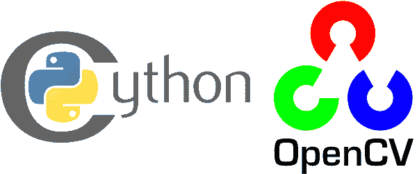
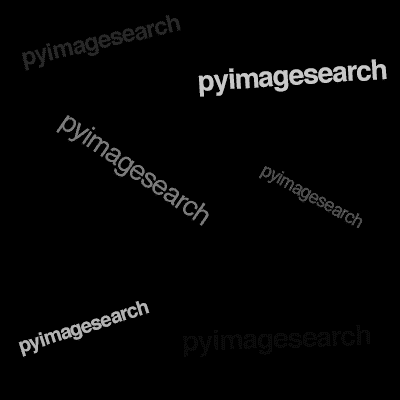

# 利用 OpenCV 和 Python 快速优化像素循环

> 原文：<https://pyimagesearch.com/2017/08/28/fast-optimized-for-pixel-loops-with-opencv-and-python/>



你是否曾经不得不使用 Python 和 OpenCV 逐个像素地遍历图像？

如果是这样的话，你就知道这是一个非常慢的操作，尽管图像在内部是由 NumPy 数组表示的。

那么这是为什么呢？为什么 NumPy 中的单个像素访问这么慢？

你看，NumPy 操作是用 c 实现的，这让我们避免了 Python 循环的昂贵开销。当使用 NumPy 时，性能提高*几个数量级*并不少见(与标准 Python 列表相比)。一般来说，如果你能使用 NumPy 数组把你的问题框定为一个**向量运算**，你将能从速度提升中获益。

这里的问题是访问*单个像素*是**而不是**一个向量操作。因此，尽管 NumPy 可以说是几乎任何编程语言都可用的最好的数值处理库，但当与 Python 的`for`循环+单个元素访问结合使用时，我们会损失很多性能增益。

在您的计算机视觉之旅中，您可能需要实现一些算法，这些算法需要您执行这些手动`for`循环。无论您是需要从头开始实现[本地二进制模式](https://pyimagesearch.com/2015/12/07/local-binary-patterns-with-python-opencv/)，创建自定义的[卷积算法](https://pyimagesearch.com/2016/07/25/convolutions-with-opencv-and-python/)，还是仅仅不能依赖矢量化运算，您都需要了解如何使用 OpenCV 和 Python 来优化`for`循环。

**在这篇博文的剩余部分，我将讨论我们如何使用 Python 和 OpenCV 创建超快速的“for”像素循环——*要了解更多，请继续阅读*。**

## 利用 OpenCV 和 Python 实现超快速像素循环

几周前，我读了 Satya Mallick 精彩的 LearnOpenCV 博客。他的[最新文章](http://www.learnopencv.com/parallel-pixel-access-in-opencv-using-foreach/)讨论了一个名为`forEach`的特殊函数。`forEach`函数允许您在对图像中的每个像素应用函数时利用机器上的所有内核。

将计算分布在多个内核上可以实现大约 5 倍的加速。

但是 Python 呢？

有没有一个`forEach` OpenCV 函数暴露给 Python 绑定？

不幸的是，没有——相反，我们需要创建自己的类似`forEach`的方法。幸运的是，这并不像听起来那么难。

我已经使用这种*精确方法*来加速`for`使用 OpenCV 和 Python 的像素循环*年了*——今天我很高兴与你分享实现。

在这篇博文的第一部分，我们将讨论 [Cython](http://cython.org/) 以及如何使用它来加速 Python 内部的操作。

从那里，我将提供一个 [Jupyter 笔记本](http://jupyter.org/)详细说明如何用 OpenCV 和 Python 实现我们更快的像素循环。

### Cython 是什么？它将如何加速我们的像素循环？

我们都知道，作为一种高级语言，Python 提供了很多抽象和便利，这就是它对图像处理如此重要的主要原因。随之而来的通常是比更接近汇编语言如 c 语言更慢的速度。

你可以把 Cython 看作是 Python 和 C 语言的结合，它提供了类似 C 语言的性能。

Cython 与 Python 的不同之处在于，使用 CPython 解释器将代码翻译成 C。这使得脚本大部分可以用 Python 编写，还有一些装饰器和类型声明。

那么什么时候应该在图像处理中利用 Cython 呢？

使用 Cython 的最佳时机可能是当你发现自己在图像中逐个像素地循环时。你看，OpenCV 和 scikit-image 已经被优化了——对模板匹配等函数的调用，就像我们对银行支票和 T2 信用卡进行 OCR 时所做的那样，已经在底层 c 中被优化了。函数调用中有一点点开销，但仅此而已。你永远不会用 Python 写你自己的模板匹配算法——它不够快。

如果你发现自己在用 Python 编写任何定制的图像处理函数来逐像素地分析或修改图像(也许用一个[内核](https://pyimagesearch.com/2016/07/25/convolutions-with-opencv-and-python/)),那么*极有可能*你的函数不会尽可能快地运行。

其实会跑的很慢。

然而，如果您利用 Cython，它可以与主要的 C/C++编译器一起编译，您可以实现*显著的*性能提升，正如我们今天将演示的。

### 用 OpenCV 和 Python 实现更快的像素循环

几年前，我在努力寻找一种方法来帮助提高使用 Python 和 OpenCV 访问 NumPy 数组中各个像素的速度。

我尝试的一切都不起作用——我求助于将我的问题框架化为复杂的、难以在 NumPy 数组上进行向量运算来实现我期望的速度提升。但是有时候，遍历图像中的每个像素是不可避免的。

直到我发现了马修·派瑞关于用 Cython 并行化 NumPy 数组循环的精彩博文，我才找到了一个解决方案，并将其应用于图像处理。

在这一节中，我们将回顾我整理的一个 Jupyter 笔记本，以帮助您
了解如何用 OpenCV 和 Python 实现更快的逐像素循环。

但是在我们开始之前，请确保您安装了 NumPy、Cython、matplotlib 和 Jupyter:

```py
$ workon cv
$ pip install numpy
$ pip install cython
$ pip install matplotlib
$ pip install jupyter

```

***注** **:** 我建议你把这些安装到你用 Python 进行计算机视觉开发的虚拟环境中。如果你遵循了这个网站上的安装教程，你可能有一个名为`cv`的虚拟环境。在发出上述命令(**第 2-5 行**)之前，只需在您的 shell 中输入`workon cv`(如果 PyImageSearch Gurus 成员愿意，他们可以将安装到他们的`gurus`环境中)。如果您还没有虚拟环境，请创建一个，然后按照此处[的说明](https://pyimagesearch.com/opencv-tutorials-resources-guides/)符号链接您的`cv2.so`绑定。*

从那里，您可以在您的环境中启动 Jupyter 笔记本，并开始输入本文中的代码:

```py
$ jupyter notebook

```

或者，使用这篇博文的 ***【下载】*** 部分，跟随我为你创建的 Jupyter 笔记本 ***(强烈推荐)*** 。如果您使用下载部分中的笔记本，请确保将您的工作目录更改为笔记本在磁盘上的位置。

无论您是选择使用预烤笔记本还是从头开始，本节的剩余部分都将讨论如何使用 OpenCV 和 Python ***将逐像素循环提升两个数量级以上*** 。

在这个例子中，我们将实现一个简单的阈值函数。对于图像中的每个像素，我们将检查输入像素是否大于或等于某个阈值`T`。

如果像素通过了阈值测试，我们将输出值设置为 *255* 。否则，输出像素将被设置为 *0* 。

使用这个函数，我们将能够二值化我们的输入图像，非常类似于 OpenCV 和 scikit-image 的内置阈值方法的工作方式。

我们将使用一个简单的阈值函数作为示例，因为它使我们能够(1)不关注实际的图像处理代码，而是(2)学习如何在手动循环图像中的每个像素时获得速度提升。

要将“幼稚”的像素循环与我们更快的 Cython 循环进行比较，请看下面的笔记本:

```py
# import the necessary packages
import matplotlib.pyplot as plt
import cv2

%matplotlib inline

```

***注意:**当你的笔记本启动时，我建议你点击*菜单栏*中的【查看】>【切换行号】——在 Jupyter 中，每个`In [ ]`和`Out [ ]`块都从 1 开始重新编号，所以你会在这里的代码块中看到那些相同的编号。如果你使用的是本帖下载部分的笔记本，可以随意点击“Cell”>“Run All”来执行所有的块。*

在上面的`In [1]`中，在**的 2-3 行**中，我们导入我们需要的包。**第 5 行**简单地指定我们希望 matplotlib 图在笔记本中显示。

接下来，我们将加载并预处理一个示例图像:

```py
# load the original image, convert it to grayscale, and display
# it inline
image = cv2.imread("example.png")
image = cv2.cvtColor(image, cv2.COLOR_BGR2GRAY)
plt.imshow(image, cmap="gray")

```

在`In [2]`的**第 3** 行，我们加载`example.png`，然后在**第 4** 行将其转换为灰度。

然后我们使用 matplotlib ( **Line 5** )显示图形。

该命令的内联输出如下所示:

[](https://pyimagesearch.com/wp-content/uploads/2017/08/example.png)

**Figure 1:** Our input image (400×400 pixels) that we will be thresholding.

接下来，我们将加载 Cython:

```py
%load_ext cython

```

在上面的`In [3]`中，我们加载 Cython。

现在我们已经将 Cython 存储在内存中，我们将指示 Cython 显示哪些行可以在我们的自定义阈值函数中进行优化:

```py
%%cython -a
def threshold_slow(T, image):
    # grab the image dimensions
    h = image.shape[0]
    w = image.shape[1]

    # loop over the image, pixel by pixel
    for y in range(0, h):
        for x in range(0, w):
            # threshold the pixel
            image[y, x] = 255 if image[y, x] >= T else 0

    # return the thresholded image
    return image

```

上面`In [3]`中的第 1 行告诉解释器，我们希望 Cython 确定哪些行可以优化。

然后，我们定义我们的函数，`threshold_slow`。我们的函数需要两个参数:

*   `T`:门槛
*   `image`:输入图像

在**第 5 行和第 6 行**，我们从图像的`.shape`对象中提取高度和宽度。我们需要`w`和`h`，这样我们就可以逐个像素地循环图像。

**第 9 行和第 10 行**开始一个嵌套的 for 循环，我们从上到下从左到右循环，直到我们的高度和宽度。后面我们会看到这个循环还有优化的空间。

在**第 12 行**上，我们使用三元运算符对每个像素执行原位二进制阈值——如果像素是`>= T`，我们将像素设置为白色( *255* )，否则，我们将像素设置为黑色( *0* )。

最后，我们返回结果`image`。

在 Jupyter 中(假设您执行了上面的`In [ ]`块)，您将看到以下输出:

```py
 01: 
+02: def threshold_slow(T, image):
 03:     # grab the image dimensions
+04:     h = image.shape[0]
+05:     w = image.shape[1]
 06: 
 07:     # loop over the image, pixel by pixel
+08:     for y in range(0, h):
+09:         for x in range(0, w):
 10:             # threshold the pixel
+11:             image[y, x] = 255 if image[y, x] >= T else 0
 12: 
 13:     # return the thresholded image
+14:     return image

```

`Out [4]`中的**黄色高亮线**展示了 **Cython 可用于优化**的区域——我们稍后将看到如何使用 Cython 执行优化。请注意逐像素循环动作是如何突出显示的。

***提示:**你可以点击行首的“+”来查看底层的 C 代码——这是我觉得非常有趣的事情。*

接下来，让我们计时函数的操作:

```py
%timeit threshold_slow(5, image)

```

使用`%timeit`语法，我们可以执行函数并计时——我们指定一个阈值 *5* 和我们已经加载的图像。结果输出如下所示:

```py
1 loop, best of 3: 244 ms per loop

```

输出显示该函数在我的系统上运行的最快时间是 244 ms。这是我们的基准时间——我们将在本文后面大幅减少这个数字。

让我们看看阈值操作的结果，从视觉上验证我们的函数是否正常工作:

```py
# threshold our image to validate that it's working
image = threshold_slow(5, image)
plt.imshow(image, cmap="gray")

```

`In [6]`中显示的两行运行该功能，并在笔记本上显示输出。产生的阈值图像如下所示:

[](https://pyimagesearch.com/wp-content/uploads/2017/08/img.png)

**Figure 2:** Thresholding our input image using the threshod_slow method.

现在我们到了有趣的部分。让我们利用 Cython 创建一个高度优化的逐像素环路:

```py
%%cython -a
import cython

@cython.boundscheck(False)
cpdef unsigned char[:, :] threshold_fast(int T, unsigned char [:, :] image):
    # set the variable extension types
    cdef int x, y, w, h

    # grab the image dimensions
    h = image.shape[0]
    w = image.shape[1]

    # loop over the image
    for y in range(0, h):
        for x in range(0, w):
            # threshold the pixel
            image[y, x] = 255 if image[y, x] >= T else 0

    # return the thresholded image
    return image

```

`In [7]`的**行 1** 再次指定我们希望 Cython 突出显示可以优化的行。

然后，我们在第 2 行的**处导入 Cython。**

Cython 的美妙之处在于，我们的 Python 代码只需要很少的修改——你会的；但是，看到一些 C 语法的痕迹。**第 4 行**是一个 [Cython decorator](http://cython.readthedocs.io/en/latest/src/reference/compilation.html#compiler-directives) 声明我们不会检查数组索引界限，提供了一个轻微的加速。

以下段落强调了一些 Cython 语法，所以要特别注意。

然后我们使用`cpdef`关键字而不是 Python 的`def`来定义函数(**第 5 行**)——这为 C 类型创建了一个`cdef`类型，为 Python 类型创建了一个`def`类型([源](http://notes-on-cython.readthedocs.io/en/latest/function_declarations.html#cpdef-it-s-both))。

`threshold_fast`函数将返回一个`unsigned char [:,:]`，这将是我们的输出 NumPy 数组。我们使用`unsigned char`，因为 OpenCV 将图像表示为无符号的 8 位整数，而`unsigned char`(有效地)为我们提供了相同的数据类型。`[:, :]`暗示我们正在使用 2D 阵列。

从那里，我们向我们的函数提供实际的数据类型，包括`int T`(阈值)，和另一个`unsigned char`数组，我们的输入`image`。

在**第 7 行**，使用`cdef`我们可以将 Python 变量声明为 C 变量——这允许 Cython 理解我们的数据类型。

`In [7]`中的其他一切都是 ***与`threshold_slow`中的*** 相同，这 ***展示了 Cython*** 的便利性。

我们的输出如下所示:

```py
+01: import cython
 02: 
 03: @cython.boundscheck(False)
+04: cpdef unsigned char[:, :] threshold_fast(int T, unsigned char [:, :] image):
 05:     # set the variable extension types
 06:     cdef int x, y, w, h
 07: 
 08:     # grab the image dimensions
+09:     h = image.shape[0]
+10:     w = image.shape[1]
 11: 
 12:     # loop over the image
+13:     for y in range(0, h):
+14:         for x in range(0, w):
 15:             # threshold the pixel
+16:             image[y, x] = 255 if image[y, x] >= T else 0
 17: 
 18:     # return the thresholded image
+19:     return image

```

这次注意到在`Out [7]`中，Cython 突出显示的行更少了。事实上，只有 Cython 导入和函数声明被突出显示——这是典型的。

接下来，我们将重新加载并重新预处理我们的原始图像(有效地重置它):

```py
# reload the original image and convert it to grayscale
image = cv2.imread("example.png")
image = cv2.cvtColor(image, cv2.COLOR_BGR2GRAY)

```

重新加载图像的目的是因为我们的第一个`threshold_slow`操作就地修改了图像。我们需要将其重新初始化为已知状态。

让我们继续，根据 Python 中最初的`threshold_slow`函数对我们的`threshold_fast`函数进行基准测试:

```py
%timeit threshold_fast(5, image)

```

结果是:

```py
10000 loops, best of 3: 41.2 µs per loop

```

这次我们实现了每次调用**41.2 微秒，对使用严格 Python 的 ***244 毫秒*** 进行了大规模改进。这意味着通过使用 Cython，我们可以将逐像素循环 ***的速度提高 2 个数量级以上！*****

 **### OpenMP 呢？

通读本教程后，您可能会想知道我们是否可以获得更多的性能提升。虽然我们通过使用 Cython 而不是 Python 获得了巨大的性能提升，但我们实际上仍然只使用了我们 CPU 的一个核心。

但是，如果我们想要在多个 CPUs 内核之间分配计算，那该怎么办呢？这可能吗？

绝对是——我们只需要使用 [OpenMP](http://www.openmp.org/) (开放式多处理)。

在后续的博客文章中，我将演示如何使用 OpenMP 来进一步增强使用 OpenCV 和 Python 的“for”像素循环。

## 摘要

受到萨蒂亚·马里克(Satya Mallick)的[原始博客文章](http://www.learnopencv.com/parallel-pixel-access-in-opencv-using-foreach/)的启发，我决定写一篇教程，试图用 Python 完成同样的事情——***。***

不幸的是，Python 只有一小部分函数调用可以作为绑定使用(与 C++相比)。正因为如此，我们需要使用 Cython“推出我们自己的”更快的“for”循环方法。

结果相当惊人——通过使用 Cython，我们能够将阈值函数从每个函数调用 244 ms(纯 Python)提升到不到 40.8 μs (Cython)。

有意思的是，还有待优化。

到目前为止，我们的简单方法只使用了 CPU 的一个内核。通过启用 OpenMP 支持，我们实际上可以将`for`循环计算分布在*多个*CPU/内核上——这样做只会进一步提高我们函数的速度。

我将在以后的博文中介绍如何使用 OpenMP 来提升 OpenCV 和 Python 的像素循环。

**目前，*请务必在下面的表格中输入您的电子邮件地址*，以便在发布新的博客帖子时得到通知！****