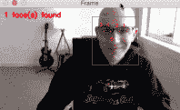
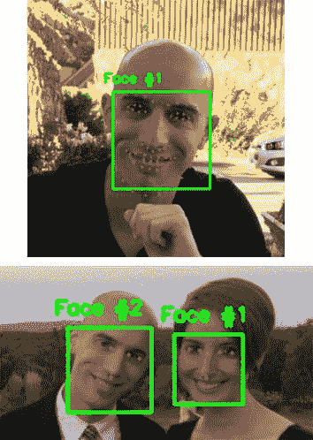

# (更快)带 dlib 的面部标志检测器

> 原文：<https://pyimagesearch.com/2018/04/02/faster-facial-landmark-detector-with-dlib/>

早在 2017 年 9 月，戴维斯·金发布了 dlib 的 v19.7 版本——在发行说明中，你会在 dlib 的新 5 点面部标志检测器上找到一个简短、不显眼的圆点:

> *增加了一个 5 点人脸标记模型，比 68 点模型小 10 倍以上，运行速度更快，并且可以处理 HOG 和 CNN 生成的人脸检测。*

[](https://pyimagesearch.com/wp-content/uploads/2018/03/faster_facial_landmarks_animation.gif)

我今天的目标是向大家介绍新的 dlib 面部标志检测器，它比原来的版本更快(快 8-10%)，更有效，和**(小 10 倍)**。

在今天博客的剩余部分，我们将讨论 dlib 的新面部标志探测器，包括:

*   五点面部标志检测器的工作原理
*   为您自己的应用选择新的 5 点版本或原始的 68 点面部标志检测器时的注意事项
*   如何在自己的脚本中实现 5 点面部标志检测器
*   5 点面部标志检测器的运行演示

**要了解更多关于 dlib 面部标志检测的信息，*请继续阅读。***

## (更快)带 dlib 的面部标志检测器

在这篇博文的第一部分，我们将讨论 dlib 的新的、更快、更小的 5 点面部标志检测器，并将其与随库发布的原始 68 点面部标志检测器进行比较。

在那里，我们将使用 Python、dlib 和 OpenCV 实现面部标志检测，然后运行它并查看结果。

最后，我们将讨论使用 5 点面部标志检测器的一些限制，并强调您应该使用 5 点版本的 68 点面部标志检测器的一些场景。

### Dlib 的 5 点面部标志检测器

[](https://pyimagesearch.com/wp-content/uploads/2018/03/faster_facial_landmarks_5_vs_68.jpg)

**Figure 1:** A comparison of the dlib 68-point facial landmarks (*top*) and the 5-point facial landmarks (*bottom*).

**上面的图 1** 可视化了 dlib 新的 5 点面部标志检测器与原始的 68 点检测器之间的差异。

68 点检测器定位沿着眼睛、眉毛、鼻子、嘴和下颌线的区域，而 5 点面部标志检测器将这些信息简化为:

*   左眼扣 2 分
*   右眼扣 2 分
*   鼻子得 1 分

5 点面部标志检测器最合适的用例是[面部对齐](https://pyimagesearch.com/2017/05/22/face-alignment-with-opencv-and-python/)。

在加速方面，我发现新的 5 点探测器比原来的版本快 8-10%，但这里真正的胜利是模型大小: **9.2MB** 对 **99.7MB** ，分别(**比**小 10 倍以上)。

同样重要的是要注意，面部标志检测器开始时往往非常快(特别是如果它们被正确实现，就像在 dlib 中一样)。

就加速而言，真正的胜利将是决定你应该使用哪种人脸检测器。一些面部检测器比其他检测器更快(但可能不太准确)。如果你还记得我们的睡意检测系列:

*   [使用 OpenCV 进行睡意检测](https://pyimagesearch.com/2017/05/08/drowsiness-detection-opencv/)
*   [Raspberry Pi:面部标志+使用 OpenCV 和 dlib 的睡意检测](https://pyimagesearch.com/2017/10/23/raspberry-pi-facial-landmarks-drowsiness-detection-with-opencv-and-dlib/)

您应该记得，我们在笔记本电脑/台式机实施中使用了更准确的 HOG +线性 SVM 人脸检测器，但需要一个不太准确但更快的 Haar cascade 来实现 Raspberry Pi 上的实时速度。

一般来说，在选择人脸检测模型时，您会发现以下准则是一个很好的起点:

*   **哈尔喀:**速度快，但不太准确。调整参数可能会很痛苦。
*   **HOG +线性 SVM:** 通常(显著)比 Haar 级联更准确，假阳性更少。通常在测试时需要调整的参数较少。与哈尔瀑布相比可能很慢。
*   **基于深度学习的检测器:**当被正确训练时，比哈尔级联和 HOG +线性 SVM 显著更准确和鲁棒。可能会非常慢，这取决于模型的深度和复杂性。可以通过在 GPU 上执行推理来加速(你可以在这篇文章中看到一个 [OpenCV 深度学习人脸检测器)。](https://pyimagesearch.com/2018/02/26/face-detection-with-opencv-and-deep-learning/)

当您构建自己的应用程序来利用人脸检测和面部标志时，请记住这些准则。

### 用 dlib、OpenCV 和 Python 实现面部标志

现在我们已经讨论了 dlib 的 5 点面部标志检测器，让我们编写一些代码来演示并查看它的运行情况。

打开一个新文件，将其命名为`faster_facial_landmarks.py`，并插入以下代码:

```py
# import the necessary packages
from imutils.video import VideoStream
from imutils import face_utils
import argparse
import imutils
import time
import dlib
import cv2

```

在**线 2-8** 我们导入必要的包，特别是`dlib`和来自`imutils`的两个模块。

**imutils 包已经更新，可以处理*68 点和 5 点面部标志模型*。确保在您的环境中通过**进行升级

```py
$ pip install --upgrade imutils

```

同样，更新 imutils 将允许您使用*68 点和 5 点面部标志。*

接下来，让我们解析命令行参数:

```py
# construct the argument parser and parse the arguments
ap = argparse.ArgumentParser()
ap.add_argument("-p", "--shape-predictor", required=True,
	help="path to facial landmark predictor")
args = vars(ap.parse_args())

```

我们有一个命令行参数:`--shape-predictor`。该参数允许我们更改将在运行时加载的面部标志预测器的路径。

***注:**对命令行参数一头雾水？请务必查看我最近的帖子，其中深入讨论了[命令行参数](https://pyimagesearch.com/2018/03/12/python-argparse-command-line-arguments/)。*

接下来，让我们加载形状预测器并初始化我们的视频流:

```py
# initialize dlib's face detector (HOG-based) and then create the
# facial landmark predictor
print("[INFO] loading facial landmark predictor...")
detector = dlib.get_frontal_face_detector()
predictor = dlib.shape_predictor(args["shape_predictor"])

# initialize the video stream and sleep for a bit, allowing the
# camera sensor to warm up
print("[INFO] camera sensor warming up...")
vs = VideoStream(src=1).start()
# vs = VideoStream(usePiCamera=True).start() # Raspberry Pi
time.sleep(2.0)

```

在**第 19 行和第 20 行**，我们初始化 dlib 预训练的 HOG +线性 SVM 人脸`detector`并加载`shape_predictor`文件。

为了访问相机，我们将使用 imutils 的`VideoStream`类。

您可以选择(通过注释/取消注释**第 25 行和第 26 行**)是否使用:

1.  内置/USB 网络摄像头
2.  或者你是否会在你的树莓派上使用 PiCamera

从那里，让我们循环帧，做一些工作:

```py
# loop over the frames from the video stream
while True:
	# grab the frame from the threaded video stream, resize it to
	# have a maximum width of 400 pixels, and convert it to
	# grayscale
	frame = vs.read()
	frame = imutils.resize(frame, width=400)
	gray = cv2.cvtColor(frame, cv2.COLOR_BGR2GRAY)

	# detect faces in the grayscale frame
	rects = detector(gray, 0)

	# check to see if a face was detected, and if so, draw the total
	# number of faces on the frame
	if len(rects) > 0:
		text = "{} face(s) found".format(len(rects))
		cv2.putText(frame, text, (10, 20), cv2.FONT_HERSHEY_SIMPLEX,
			0.5, (0, 0, 255), 2)

```

首先，我们从视频流中读取一个`frame`，调整它的大小，并转换成灰度(**第 34-36 行**)。

然后让我们使用 HOG +线性 SVM `detector`来检测灰度图像中的人脸(**第 39 行**)。

从那里，我们首先确定至少有一张脸被检测到，从而在原始图像上画出人脸的总数(**第 43-46 行**)。

接下来，让我们循环面部检测并绘制界标:

```py
	# loop over the face detections
	for rect in rects:
		# compute the bounding box of the face and draw it on the
		# frame
		(bX, bY, bW, bH) = face_utils.rect_to_bb(rect)
		cv2.rectangle(frame, (bX, bY), (bX + bW, bY + bH),
			(0, 255, 0), 1)

		# determine the facial landmarks for the face region, then
		# convert the facial landmark (x, y)-coordinates to a NumPy
		# array
		shape = predictor(gray, rect)
		shape = face_utils.shape_to_np(shape)

		# loop over the (x, y)-coordinates for the facial landmarks
		# and draw each of them
		for (i, (x, y)) in enumerate(shape):
			cv2.circle(frame, (x, y), 1, (0, 0, 255), -1)
			cv2.putText(frame, str(i + 1), (x - 10, y - 10),
				cv2.FONT_HERSHEY_SIMPLEX, 0.35, (0, 0, 255), 1)

```

从**第 49 行**开始，我们循环播放`rects`中的人脸。

我们通过使用来自`imutils`的`face_utils`模块，在原始帧上绘制人脸边界框(**第 52-54 行**)(你可以在这里阅读更多关于[的内容)。](https://pyimagesearch.com/2017/04/03/facial-landmarks-dlib-opencv-python/)

然后，我们将面部传递给`predictor`以确定面部标志(**第 59 行**)，随后我们将面部标志坐标转换为一个 NumPy 数组。

现在有趣的部分来了。为了可视化地标，我们将使用`cv2.circle`绘制小点，并对每个坐标进行编号。

在第 64 行的**上，我们在地标坐标上循环。然后我们在原始的`frame`上画一个小的填充圆以及地标号。**

让我们完成面部标志性的脚本:

```py
	# show the frame
	cv2.imshow("Frame", frame)
	key = cv2.waitKey(1) & 0xFF

	# if the `q` key was pressed, break from the loop
	if key == ord("q"):
		break

# do a bit of cleanup
cv2.destroyAllWindows()
vs.stop()

```

在这个块中，我们显示帧(**行** **70** ) **、**如果按下“q”则退出循环(**行** **71-75** ) **、**，并执行清除(**行 78 和 79** )。

### 运行我们的面部标志探测器

现在我们已经实现了面部标志检测器，让我们来测试一下。

请务必向下滚动到这篇博客文章的 ***“下载”*** 部分，下载源代码和 5 点面部标志检测器。

从那里，打开一个 shell 并执行以下命令:

```py
$ python faster_facial_landmarks.py \
	--shape-predictor shape_predictor_5_face_landmarks.dat

```

[](https://pyimagesearch.com/wp-content/uploads/2018/03/faster_facial_landmarks_animation.gif)

**Figure 2:** The dlib 5-point facial landmark detector in action.

从上面的 GIF 可以看出，我们已经成功定位了 5 个面部标志，包括:

*   左眼扣 2 分
*   右眼扣 2 分
*   鼻子底部得 1 分

我在下面的视频中加入了面部标志检测器的较长演示:

<https://www.youtube.com/embed/6sN9Oo1CBWY?feature=oembed>