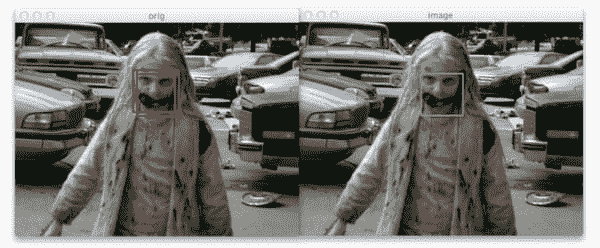
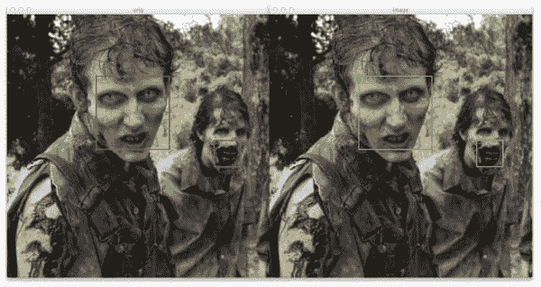
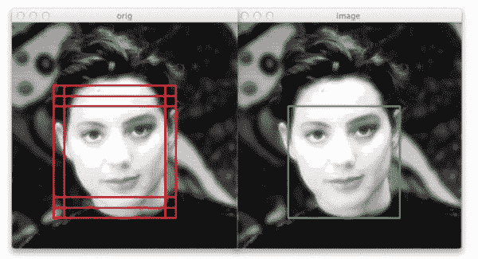

# (更快)Python 中的非最大抑制

> 原文：<https://pyimagesearch.com/2015/02/16/faster-non-maximum-suppression-python/>

[](https://pyimagesearch.com/wp-content/uploads/2014/10/nms_fast_01.jpg)

我有问题— ***我无法停止思考物体探测*。**

你看，昨晚我在看《行尸走肉》,而不是欣赏僵尸的残暴、被迫的同类相食或者迷人的故事情节,**《T3 》,我只想做的是建立一个物体检测系统来识别僵尸。**

会很有用吗？大概不会。

我是说，很明显如果有僵尸在追你。光是那股恶臭就应该是一个*(嘿，看那双关语)死人了，更别说咬牙切齿和伸出手臂了。我们还可以加上喉音*【大脑神经】*呻吟。*

 *就像我说的，如果有僵尸在追你，这是非常明显的——你当然不需要计算机视觉系统来告诉你。但这只是我每天脑海中浮现的一个例子。

为了给你一些背景，两周前我发布了关于使用[方向梯度直方图和线性支持向量机](https://pyimagesearch.com/2014/11/10/histogram-oriented-gradients-object-detection/)来构建一个物体检测系统。厌倦了使用 OpenCV Haar cascades 并获得糟糕的性能，更不用说极长的训练时间，我决定自己编写自己的 Python 对象检测框架。

到目前为止，它进行得非常顺利，并且实现起来非常有趣。

但是在构建一个物体检测系统时，有一个不可避免的问题你必须处理，那就是*重叠包围盒*。这是要发生的，没有办法。事实上，这实际上是一个好的迹象，表明你的物体检测器正在正常工作，所以我甚至不会称之为一个“问题”。

为了处理重叠边界框(指同一对象)的移除，我们可以对[均值偏移算法](http://en.wikipedia.org/wiki/Mean-shift)使用非最大抑制。虽然 [Dalal 和 Triggs](http://lear.inrialpes.fr/people/triggs/pubs/Dalal-cvpr05.pdf) 更喜欢均值漂移，但我发现均值漂移给出的结果并不理想。

在收到我的朋友(也是物体检测专家)Tomasz Malisiewicz 博士的建议后，我决定将他的非最大抑制 MATLAB 实现移植到 Python 上。

上周我向你展示了如何实现 Felzenszwalb 等人的方法。本周我将向你们展示比 T4 快 100 倍的[马利西维茨等人的方法](http://quantombone.blogspot.com/2011/08/blazing-fast-nmsm-from-exemplar-svm.html)。

***注:**早在 11 月我就打算发表这篇博文了，但是由于我计划不周，这篇博文花了我一段时间才发表。反正现在已经上线了！*

那么这种加速来自哪里呢？我们如何获得更快的抑制时间？

请继续阅读，寻找答案。

**OpenCV 和 Python 版本:**
这个例子将运行在 **Python 2.7/Python 3.4+** 和 **OpenCV 2.4.X/OpenCV 3.0+** 上。

# (更快)Python 中的非最大抑制

在我们开始之前，如果你还没有阅读[上周关于非最大抑制](https://pyimagesearch.com/2014/11/17/non-maximum-suppression-object-detection-python)的帖子，我肯定会从那里开始。

否则，在您喜欢的编辑器中打开一个新文件，将其命名为`nms.py`，让我们开始创建一个更快的非最大抑制实现:

```py
# import the necessary packages
import numpy as np

# Malisiewicz et al.
def non_max_suppression_fast(boxes, overlapThresh):
	# if there are no boxes, return an empty list
	if len(boxes) == 0:
		return []

	# if the bounding boxes integers, convert them to floats --
	# this is important since we'll be doing a bunch of divisions
	if boxes.dtype.kind == "i":
		boxes = boxes.astype("float")

	# initialize the list of picked indexes	
	pick = []

	# grab the coordinates of the bounding boxes
	x1 = boxes[:,0]
	y1 = boxes[:,1]
	x2 = boxes[:,2]
	y2 = boxes[:,3]

	# compute the area of the bounding boxes and sort the bounding
	# boxes by the bottom-right y-coordinate of the bounding box
	area = (x2 - x1 + 1) * (y2 - y1 + 1)
	idxs = np.argsort(y2)

	# keep looping while some indexes still remain in the indexes
	# list
	while len(idxs) > 0:
		# grab the last index in the indexes list and add the
		# index value to the list of picked indexes
		last = len(idxs) - 1
		i = idxs[last]
		pick.append(i)

		# find the largest (x, y) coordinates for the start of
		# the bounding box and the smallest (x, y) coordinates
		# for the end of the bounding box
		xx1 = np.maximum(x1[i], x1[idxs[:last]])
		yy1 = np.maximum(y1[i], y1[idxs[:last]])
		xx2 = np.minimum(x2[i], x2[idxs[:last]])
		yy2 = np.minimum(y2[i], y2[idxs[:last]])

		# compute the width and height of the bounding box
		w = np.maximum(0, xx2 - xx1 + 1)
		h = np.maximum(0, yy2 - yy1 + 1)

		# compute the ratio of overlap
		overlap = (w * h) / area[idxs[:last]]

		# delete all indexes from the index list that have
		idxs = np.delete(idxs, np.concatenate(([last],
			np.where(overlap > overlapThresh)[0])))

	# return only the bounding boxes that were picked using the
	# integer data type
	return boxes[pick].astype("int")

```

花点时间仔细检查一下这段代码，并将其与上周 Felzenszwalb 等人的[实现进行比较。](https://pyimagesearch.com/2014/11/17/non-maximum-suppression-object-detection-python)

代码看起来 ***几乎一模一样*** 对吧？

所以你可能会问自己*“这 100 倍的速度提升来自哪里？”*

***答案是去除一个内部`for`循环。***

上周的实现需要一个额外的内部`for`循环来计算边界区域的大小和重叠区域的比例。

相反，Malisiewicz 博士用矢量化代码— *取代了这个内部`for`循环，这就是我们在应用非最大抑制时能够实现更快速度的方法。*

不要像我上周那样重复自己的话，一行一行地检查代码，让我们只检查重要的部分。

**我们的快速非最大值抑制函数的第 6-22 行**与上周的基本相同。我们首先获取边界框的 *(x，y)* 坐标，计算它们的面积，并根据每个框右下角的 y 坐标将索引排序到`boxes`列表中。

**31-55 线**包含我们的提速，其中**41-55 线**尤为重要。

我们没有使用内部的`for`循环来遍历每个单独的框，而是使用`np.maximum`和`np.minimum`函数对代码进行矢量化——这允许我们找到跨越*轴*的最大值和最小值，而不仅仅是*单独的标量*。

**注意:**你 ***有*** 在这里使用`np.maximum`和`np.minimum`函数——它们允许你混合标量和向量。而`np.max`和`np.min`功能则不然，如果你使用它们，你会发现自己有一些非常严重的错误需要查找和修复。当我将算法从 MATLAB 移植到 Python 时，我花了很长时间来调试这个问题。

**第 47 行和第 48 行**也被矢量化——这里我们计算每个矩形的宽度和高度来检查。类似地，计算**线 51** 上的`overlap`比率也被矢量化。从那里，我们只需从我们的`idx`列表中删除所有大于我们提供的重叠阈值的条目。重叠阈值的典型值通常在 0.3-0.5 的范围内。

Malisiewicz 等人的方法本质上与 Felzenszwalb 等人的方法相同，但通过使用矢量化代码，我们能够在非最大抑制方面达到[报告的 100 倍加速](http://quantombone.blogspot.com/2011/08/blazing-fast-nmsm-from-exemplar-svm.html)！

# 更快的非最大抑制

让我们继续探索几个例子。我们将从我们在这张图片顶部看到的令人毛骨悚然的小女孩僵尸开始:

[](https://pyimagesearch.com/wp-content/uploads/2014/10/nms_fast_01.jpg)

**Figure 1:** Detecting **three** bounding boxes in the image, but non-maximum suppression suppresses two of the overlapping boxes.

事实上，非常有趣的是，我们的人脸检测器在真实、健康的人脸上训练得如此之好，也同样适用于僵尸脸。诚然，他们仍然是“人类”的脸，但所有的血和毁容，我不会惊讶地看到一些奇怪的结果。

[](https://pyimagesearch.com/wp-content/uploads/2014/10/nms_fast_02.jpg)

**Figure 2:** It looks like our face detector didn’t generalize as well — the teeth of this zombie looks like a face to the detector.

说到奇怪的结果，看起来我们的面部检测器检测到了右边僵尸的嘴/牙齿区域。也许如果我在僵尸图像上明确训练 HOG +线性 SVM 人脸检测器，结果会更好。

[](https://pyimagesearch.com/wp-content/uploads/2014/10/nms_fast_03.jpg)

**Figure 3:** **Six** bounding boxes are detected around the face, but by applying fast non-maximum suppression we are correctly able to reduce the number of bounding boxes to **one**.

在这个最后的例子中，我们可以再次看到我们的非最大值抑制算法正在正确地工作——即使 HOG +线性 SVM 检测器检测到了**六个**原始边界框，应用非最大值抑制已经正确地抑制了五个框，留给我们最后的检测。

# 摘要

在这篇博文中，我们回顾了 Malisiewicz 等人的非最大抑制方法。

这种方法与 Felzenszwalb 等人的方法几乎相同，但是通过移除内部`for`循环并使用矢量化代码，我们能够获得显著的加速。

如果你有空的话，一定要感谢托马斯·马利西维茨医生！*