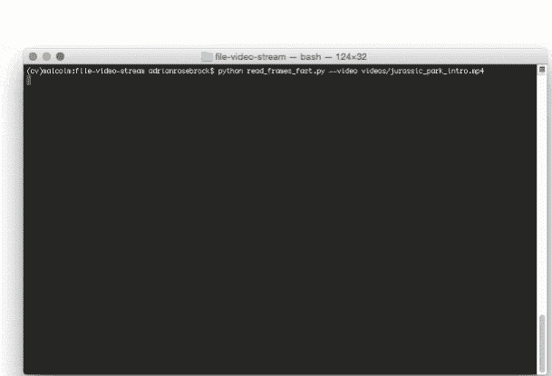

# cv2 提供更快的视频文件 FPS。视频捕捉和 OpenCV

> 原文：<https://pyimagesearch.com/2017/02/06/faster-video-file-fps-with-cv2-videocapture-and-opencv/>



你有没有通过 OpenCV 的`cv2.VideoCapture`功能处理过一个视频文件，发现读帧 ***就是感觉很慢很呆滞？***

我经历过，我完全了解那种感觉。

您的整个视频处理管道缓慢移动，每秒钟无法处理一两帧以上的图像，即使您没有执行任何类型的计算开销很大的图像处理操作。

这是为什么呢？

为什么有时候`cv2.VideoCapture`和相关的`.read`方法从你的视频文件中轮询另一帧看起来像是一个*永恒*？

答案几乎都是 ***视频压缩和帧解码。***

根据您的视频文件类型、您安装的编解码器，更不用说您的机器的物理硬件，您的大部分视频处理管道实际上都可能被读取视频文件中的下一帧的****解码*** 所消耗。*

 *这只是计算上的浪费——还有更好的方法。

在今天博文的剩余部分，我将演示如何使用线程和队列数据结构来 ***提高您的视频文件 FPS 率超过 52%！***

## cv2 提供更快的视频文件 FPS。视频捕捉和 OpenCV

当处理视频文件和 OpenCV 时，您可能会使用`cv2.VideoCapture`功能。

首先，通过传入输入视频文件的路径来实例化`cv2.VideoCapture`对象。

然后您开始一个循环，调用`cv2.VideoCapture`的`.read`方法来轮询视频文件的下一帧，以便您可以在管道中处理它。

*问题*(以及为什么这种方法会感觉缓慢的原因)是你在 ***在你的主处理线程中读取和解码帧！***

正如我在[以前的文章](https://pyimagesearch.com/2015/12/21/increasing-webcam-fps-with-python-and-opencv/)中提到的，`.read`方法是一个 *[阻塞操作](https://en.wikipedia.org/wiki/Blocking_(computing))*——你的 Python + OpenCV 应用程序的主线程被完全阻塞(即停滞)，直到从视频文件中读取帧，解码，并返回到调用函数。

通过将这些阻塞 I/O 操作转移到一个单独的线程，并维护一个解码帧队列 ***，我们实际上可以将 FPS 处理速率提高 52%以上！***

这种帧处理速率的提高(因此我们的整体视频处理流水线)来自于*大幅降低延迟*——我们不必等待`.read`方法完成读取和解码一帧；取而代之的是，总有*一个预解码的帧等待我们去处理。*

为了减少延迟，我们的目标是将视频文件帧的读取和解码转移到程序的一个完全独立的线程中，释放我们的主线程来处理实际的图像处理。

但是，在我们欣赏更快的线程化的视频帧处理方法之前，我们首先需要用更慢的非线程版本设置一个基准/基线。

### 用 OpenCV 读取视频帧的缓慢而简单的方法

本节的目标是使用 OpenCV 和 Python 获得视频帧处理吞吐率的基线。

首先，打开一个新文件，将其命名为`read_frames_slow.py`，并插入以下代码:

```py
# import the necessary packages
from imutils.video import FPS
import numpy as np
import argparse
import imutils
import cv2

# construct the argument parse and parse the arguments
ap = argparse.ArgumentParser()
ap.add_argument("-v", "--video", required=True,
	help="path to input video file")
args = vars(ap.parse_args())

# open a pointer to the video stream and start the FPS timer
stream = cv2.VideoCapture(args["video"])
fps = FPS().start()

```

**第 2-6 行**导入我们需要的 Python 包。我们将使用我的 [imutils 库](https://github.com/jrosebr1/imutils)，这是一系列方便的函数，使 OpenCV 和 Python 的图像和视频处理操作更加容易。

如果您还没有安装`imutils`***或*** 如果您使用的是以前的版本，您可以使用以下命令安装/升级`imutils`:

```py
$ pip install --upgrade imutils

```

**第 9-12 行**然后解析我们的命令行参数。对于这个脚本，我们只需要一个开关`--video`，它是我们输入视频文件的路径。

**第 15 行**使用`cv2.VideoCapture`类打开一个指向`--video`文件的指针，而**第 16 行**启动一个计时器，我们可以用它来测量 FPS，或者更具体地说，我们的视频处理流水线的吞吐率。

随着`cv2.VideoCapture`的实例化，我们可以开始从视频文件中读取帧并逐个处理它们:

```py
# loop over frames from the video file stream
while True:
	# grab the frame from the threaded video file stream
	(grabbed, frame) = stream.read()

	# if the frame was not grabbed, then we have reached the end
	# of the stream
	if not grabbed:
		break

	# resize the frame and convert it to grayscale (while still
	# retaining 3 channels)
	frame = imutils.resize(frame, width=450)
	frame = cv2.cvtColor(frame, cv2.COLOR_BGR2GRAY)
	frame = np.dstack([frame, frame, frame])

	# display a piece of text to the frame (so we can benchmark
	# fairly against the fast method)
	cv2.putText(frame, "Slow Method", (10, 30),
		cv2.FONT_HERSHEY_SIMPLEX, 0.6, (0, 255, 0), 2)	

	# show the frame and update the FPS counter
	cv2.imshow("Frame", frame)
	cv2.waitKey(1)
	fps.update()

```

在**第 19 行**我们开始循环视频文件的帧。

对第 21 行**上的`.read`方法的调用返回一个包含以下内容的二元组:**

1.  `grabbed`:布尔值，表示帧是否被成功读取。
2.  `frame`:实际的视频帧本身。

如果`grabbed`是`False`，那么我们知道我们已经到达了视频文件的末尾，可以从循环中断开(**第 25 和 26 行**)。

否则，我们执行一些基本的图像处理任务，包括:

1.  将框架的宽度调整为 450 像素。
2.  将框架转换为灰度。
3.  通过`cv2.putText`方法在框架上绘制文本。我们这样做是因为我们将使用`cv2.putText`函数在下面的快速线程示例中显示我们的队列大小，并且希望有一个公平的、可比较的管道。

**第 40-42 行**将帧显示到我们的屏幕上，并更新我们的 FPS 计数器。

最后一个代码块处理计算管道的近似 FPS/帧速率吞吐量，释放视频流指针，并关闭任何打开的窗口:

```py
# stop the timer and display FPS information
fps.stop()
print("[INFO] elasped time: {:.2f}".format(fps.elapsed()))
print("[INFO] approx. FPS: {:.2f}".format(fps.fps()))

# do a bit of cleanup
stream.release()
cv2.destroyAllWindows()

```

要执行这个脚本，一定要使用教程底部的 ***“下载”*** 部分将源代码+示例视频下载到这篇博文中。

对于这个例子，我们将使用*侏罗纪公园*预告片的 ***前 31 秒*** (代码下载中包含. mp4 文件):

<https://www.youtube.com/embed/lc0UehYemQA?feature=oembed>*