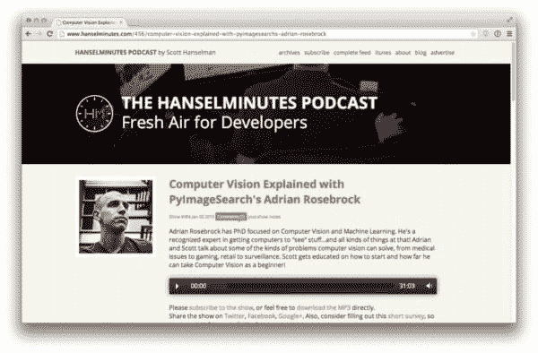

# 我参加了 Hanselminutes 播客:计算机视觉及其对我们日常生活的影响。

> 原文：<https://pyimagesearch.com/2015/01/05/featured-hanselminutes-podcast-computer-vision-impact-daily-lives/>

高中的时候，我并不是一个出色的演说家。

压力。焦虑。害怕犯一个愚蠢的错误，害怕在满是人的礼堂前说错话，这种恐惧令人麻痹——这种压力压在我身上，严重打击了我公开演讲的信心。

但是在研究生院的四年里，我在渴望战斗的学者面前提交论文，等着一有闪失就扑向你，在我的委员会面前为我的论文辩护，知道我随时会被盘问，我能够克服我对公开演讲的恐惧。

然而，我必须承认:几天前我有点紧张。

你看，我最近在 **[Hanselminutes 播客](http://www.hanselminutes.com/456/computer-vision-explained-with-pyimagesearchs-adrian-rosebrock)** 上讲了**计算机视觉****监视跟踪**，【银行】支票检测识别背后的**算法。**

《Hanselminutes》的主持人斯科特·汉塞尔曼(Scott Hanselman)是一个很棒的人，也是播客界的传奇人物。能够和他在播客上聊天是一种荣誉！

无论如何，这次采访是相当高层次的(即没有那么技术性)，面向的是第一次听到计算机视觉的观众。但它仍然是一个很棒的听力，我肯定会鼓励你去看看。

**[点这里听听吧！](http://www.hanselminutes.com/456/computer-vision-explained-with-pyimagesearchs-adrian-rosebrock)**