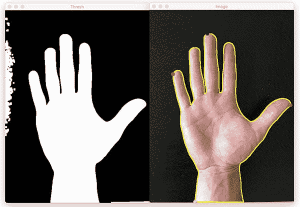
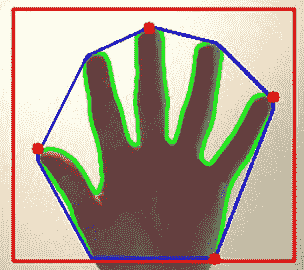
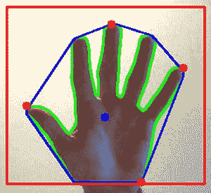
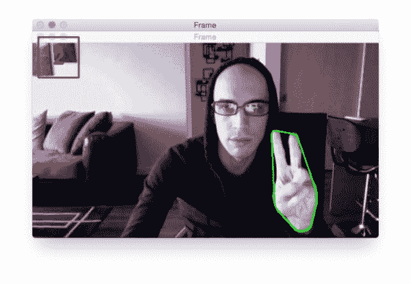
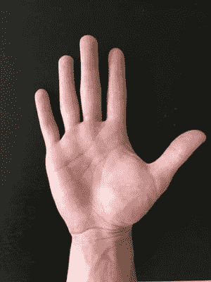
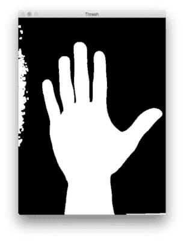
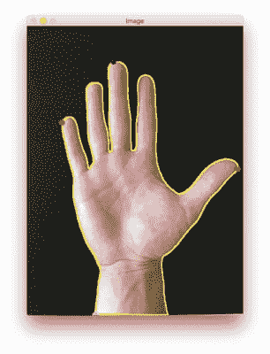
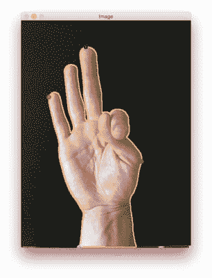

# 用 OpenCV 寻找轮廓中的极值点

> 原文：<https://pyimagesearch.com/2016/04/11/finding-extreme-points-in-contours-with-opencv/>



几周前，我演示了如何以顺时针方式对旋转的边界框的 *(x，y)* 坐标进行[排序——这是一项非常有用的技能，在许多计算机视觉应用程序中至关重要，包括(但不限于)](https://pyimagesearch.com/2016/03/21/ordering-coordinates-clockwise-with-python-and-opencv/)[透视变换](https://pyimagesearch.com/2014/09/01/build-kick-ass-mobile-document-scanner-just-5-minutes/)和[计算图像中对象的尺寸](https://pyimagesearch.com/2016/03/28/measuring-size-of-objects-in-an-image-with-opencv/)。

一位 PyImageSearch 读者发来电子邮件，对这种顺时针顺序感到好奇，并提出了类似的问题:

> 有可能从原始轮廓中找到最北、最南、最东、最西的坐标吗？

**“当然是！”**，我回答。

今天，我将分享我的解决方案，用 OpenCV 和 Python 沿着轮廓寻找极值点。

## 用 OpenCV 寻找轮廓中的极值点

在这篇博文的剩余部分，我将演示如何找到最北、最南、最东和最西 *(x，y)*-沿着等高线的坐标，就像这篇博文顶部的图像一样。

虽然这项技能本身并不十分有用，但它通常被用作更高级的计算机视觉应用的预处理步骤。这种应用的一个很好的例子是 ***手势识别:***



**Figure 1:** Computing the extreme coordinates along a hand contour

在上图中，我们已经从图像中分割出皮肤/手，计算出手轮廓的[凸包](https://en.wikipedia.org/wiki/Convex_hull)(用*蓝色*勾勒)，然后沿着凸包*红色圆圈*找到极值点。

通过计算手部的极值点，我们可以更好地逼近手掌区域(突出显示为*蓝色圆圈*):



**Figure 2:** Using extreme points along the hand allows us to approximate the center of the palm.

这反过来让我们能够识别手势，比如我们举起的手指数量:



**Figure 3:** Finding extreme points along a contour with OpenCV plays a pivotal role in hand gesture recognition.

***注:**我在 [PyImageSearch 大师课程](https://pyimagesearch.com/pyimagesearch-gurus/)中讲述了如何识别手势，所以如果你有兴趣了解更多，**一定要在下一次开放注册中申请你的位置！***

实现这样一个手势识别系统超出了这篇博文的范围，所以我们将利用下面的图片:



**Figure 4:** Our example image containing a hand. We are going to compute the extreme north, south, east, and west *(x, y)*-coordinates along the hand contour.

我们的目标是计算图像中沿着手的轮廓的极值点。

让我们开始吧。打开一个新文件，命名为`extreme_points.py`，让我们开始编码:

```py
# import the necessary packages
import imutils
import cv2

# load the image, convert it to grayscale, and blur it slightly
image = cv2.imread("hand_01.png")
gray = cv2.cvtColor(image, cv2.COLOR_BGR2GRAY)
gray = cv2.GaussianBlur(gray, (5, 5), 0)

# threshold the image, then perform a series of erosions +
# dilations to remove any small regions of noise
thresh = cv2.threshold(gray, 45, 255, cv2.THRESH_BINARY)[1]
thresh = cv2.erode(thresh, None, iterations=2)
thresh = cv2.dilate(thresh, None, iterations=2)

# find contours in thresholded image, then grab the largest
# one
cnts = cv2.findContours(thresh.copy(), cv2.RETR_EXTERNAL,
	cv2.CHAIN_APPROX_SIMPLE)
cnts = imutils.grab_contours(cnts)
c = max(cnts, key=cv2.contourArea)

```

**2 号线和 3 号线**导入我们需要的包。然后，我们从磁盘加载示例图像，将其转换为灰度，并稍微模糊。

**第 12 行**执行阈值处理，允许我们从图像的其余部分中分割出手部区域。阈值处理后，我们的二值图像如下所示:



**Figure 5:** Our image after thresholding. The outlines of the hand are now revealed.

为了检测手的轮廓，我们调用`cv2.findContours`，然后对轮廓进行排序以找到最大的轮廓，我们假设它就是手本身(**第 18-21 行**)。

在我们能够沿着一个轮廓找到极值点之前，重要的是理解一个轮廓仅仅是一个由 *(x，y)* 坐标组成的 NumPy 数组。因此，我们可以利用 NumPy 函数来帮助我们找到极值坐标。

```py
# determine the most extreme points along the contour
extLeft = tuple(c[c[:, :, 0].argmin()][0])
extRight = tuple(c[c[:, :, 0].argmax()][0])
extTop = tuple(c[c[:, :, 1].argmin()][0])
extBot = tuple(c[c[:, :, 1].argmax()][0])

```

例如，**行 24** 通过对 *x-* 值调用`argmin()`并抓取与`argmin()`返回的索引关联的整个 *(x，y)*-坐标，找到*整个*轮廓数组`c`中最小的**x*-坐标(即“西”值)。*

 *类似地，**行 25** 使用`argmax()`函数找到轮廓数组中最大的***x*-坐标(即“东”值)。**

 ****第 26 行和第 27 行**执行相同的操作，只是对于 *y* 坐标，分别给出“北”和“南”坐标。

现在我们有了最北、最南、最东和最西的坐标，我们可以把它们画在我们的`image`上:

```py
# draw the outline of the object, then draw each of the
# extreme points, where the left-most is red, right-most
# is green, top-most is blue, and bottom-most is teal
cv2.drawContours(image, [c], -1, (0, 255, 255), 2)
cv2.circle(image, extLeft, 8, (0, 0, 255), -1)
cv2.circle(image, extRight, 8, (0, 255, 0), -1)
cv2.circle(image, extTop, 8, (255, 0, 0), -1)
cv2.circle(image, extBot, 8, (255, 255, 0), -1)

# show the output image
cv2.imshow("Image", image)
cv2.waitKey(0)

```

**线 32** 在*黄色*处画出手的轮廓，而**线 33-36** 为每个极值点画出圆圈，详细如下:

*   **西:**红色
*   **东方:**绿色
*   **北:**蓝色
*   **南方:**蓝绿色

最后，**第 39 行和第 40 行**将结果显示到我们的屏幕上。

要执行我们的脚本，请确保下载与本文相关的代码和图像(使用本教程底部的“下载”表单)，导航到您的代码目录，然后执行以下命令:

```py
$ python extreme_points.py

```

然后，您应该会看到下面的输出图像:



**Figure 6:** Detecting extreme points in contours with OpenCV and Python.

正如你所看到的，我们已经成功地标记了手上的每个极值点。最西边的点用*红色*标注，最北边的点用*蓝色*，最东边的点用*绿色*，最后最南边的点用*青色*标注。

下面我们可以看到第二个标记 a 手的极值点的例子:



**Figure 7:** Labeling extreme points along a hand contour using OpenCV and Python.

让我们检查最后一个实例:


**Figure 8:** Again, were are able to accurately compute the extreme points along the contour.

这就是全部了！

请记住，`cv2.findContours`返回的轮廓列表只是一个由 *(x，y)* 坐标组成的 NumPy 数组。通过调用这个数组上的`argmin()`和`argmax()`，我们可以提取出极值 *(x，y)*-坐标。

## 摘要

在这篇博文中，我详细介绍了如何沿着给定的等高线找到最北、最南、最东、最西的坐标 *(x，y)* 。该方法可用于*原始轮廓*和*旋转边界框*。

虽然沿着轮廓寻找极值点本身似乎并不有趣，但它实际上是一项非常有用的技能，尤其是作为更高级的计算机视觉和图像处理算法的预处理步骤，例如手势识别的 T4。

要了解更多关于手势识别的信息，以及如何沿着轮廓寻找极值点对识别手势有用， ***[请务必注册 PyImageSearch Gurus 课程的下一次公开注册！](https://pyimagesearch.com/pyimagesearch-gurus/)***

里面见！***