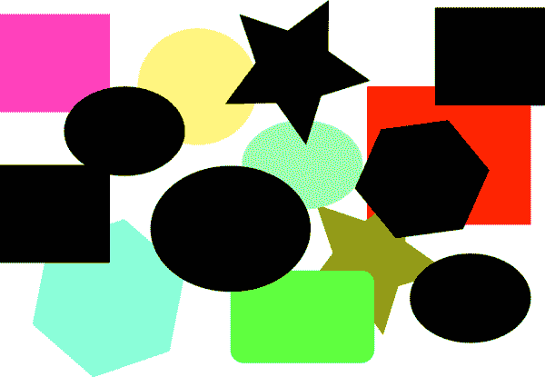
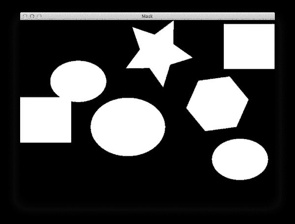
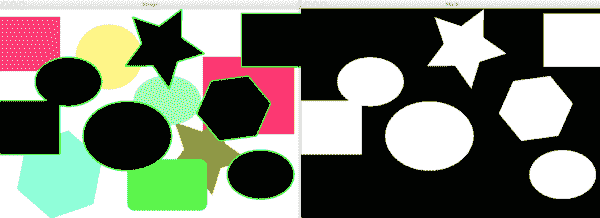

# 使用 Python 和 OpenCV 在图像中查找形状

> 原文：<https://pyimagesearch.com/2014/10/20/finding-shapes-images-using-python-opencv/>

[](https://pyimagesearch.com/wp-content/uploads/2014/10/finding_shapes_example.png)

在我们开始这篇文章之前，让我们先来谈谈 Oscar，一个专门的 PyImageSearch 阅读器。

他在计算机视觉方面刚刚起步——他已经采取了掌握这门学科的最佳途径: ***创建自己的项目并解决它们。***

Oscar 拿起一本我的书， *[实用 Python 和 OpenCV](https://pyimagesearch.com/practical-python-opencv/) ，*单个周末通读一遍，然后决定给自己创建一个项目，解决它。

他*绝对、100%证明*你可以从非常有限(或者没有)的计算机视觉知识开始，在 ***单周末*** 学习构建和解决计算机视觉项目所必需的技能。

今天我们将讨论奥斯卡的第一个项目。他给我发来了这篇文章顶部的图片，并向我寻求一些指导，告诉我如何:

*   仅识别黑色背景*的图形*
*   如果*两个或更多的图形重叠*，它们都应该被*当作一个对象*
*   *检测并绘制每个黑色形状周围的轮廓*
*   *计算*黑色形状的数量

老实说，这是一个伟大的第一个项目。

我回复了奥斯卡，并就如何解决这个问题给了他一些建议。我告诉他*实用 Python 和 OpenCV* 中哪些章节该读，我建议了一个解决问题的高级方法。

一天后，我发现我的收件箱里有了回复——奥斯卡解决了这个问题！

我们继续调整他的代码，并改善结果。

今天我将展示最终产品。

所以让我们为奥斯卡鼓掌。他做得很好。而他的证明是，使用 [*实用 Python 和 OpenCV*](https://pyimagesearch.com/practical-python-opencv/) 只需要一个*的单周末就可以学会计算机视觉。*

 *# 使用 Python 和 OpenCV 在图像中查找形状

让我们开始吧。

打开一个新文件，命名为`find_shapes.py`，然后我们开始工作。

```py
# import the necessary packages
import numpy as np
import argparse
import imutils
import cv2

# construct the argument parse and parse the arguments
ap = argparse.ArgumentParser()
ap.add_argument("-i", "--image", help = "path to the image file")
args = vars(ap.parse_args())

# load the image
image = cv2.imread(args["image"])

```

我们要做的第一件事是导入我们需要的 Python 包。我们将使用 NumPy 进行数值处理，`argparse`解析我们的命令行参数，而`cv2`用于 OpenCV 绑定。我的 [imutils](https://github.com/jrosebr1/imutils) 套装有一个我们会用到的便利功能。

**第 8-10 行**处理命令行参数的解析。我们只需要一个开关`--image`，它是我们在磁盘上的映像的路径。

最后，我们将在第 13 行**加载我们的映像。**

现在我们已经从磁盘上加载了我们的图像，我们可以继续检测图像中的黑色形状。

**我们的目标:**检测图像中的黑色形状。

使用`cv2.inRange`功能检测这些黑色形状实际上非常容易:

```py
# find all the 'black' shapes in the image
lower = np.array([0, 0, 0])
upper = np.array([15, 15, 15])
shapeMask = cv2.inRange(image, lower, upper)

```

在**第 16 行和第 17 行**上，我们在 BGR 颜色空间中定义了一个`lower`和一个`upper`边界点。记住，OpenCV 以 BGR 顺序存储图像，而不是 RGB。

我们的`lower`边界由纯黑色组成，分别为蓝色、绿色和红色通道指定零。

我们的`upper`边界由非常暗的灰色阴影组成，这次为每个通道指定 15。

然后我们在第 18 行的**上找到上下范围内的所有像素。**

我们的`shapeMask`现在看起来像这样:

[](https://pyimagesearch.com/wp-content/uploads/2014/10/finding_shapes_mask.png)

**Figure 1:** Finding all the black shapes in the image.

正如你所看到的，原始图像中的所有黑色形状现在都是在*黑色*背景上的*白色*。

下一步是检测`shapeMask`中的轮廓。这也很简单:

```py
# find the contours in the mask
cnts = cv2.findContours(shapeMask.copy(), cv2.RETR_EXTERNAL,
	cv2.CHAIN_APPROX_SIMPLE)
cnts = imutils.grab_contours(cnts)
print("I found {} black shapes".format(len(cnts)))
cv2.imshow("Mask", shapeMask)

# loop over the contours
for c in cnts:
	# draw the contour and show it
	cv2.drawContours(image, [c], -1, (0, 255, 0), 2)
	cv2.imshow("Image", image)
	cv2.waitKey(0)

```

我们调用**行 21 和 22** 上的`cv2.findContours`，指示它找到形状的所有*外部*轮廓(即边界)。

由于不同版本的 OpenCV 处理轮廓的方式不同，我们解析第 23 行**的轮廓。**

从那里，我们将找到的轮廓数打印到控制台上。

然后，我们开始在第 28 行**的每个单独的轮廓上循环，并在第 30** 行**的原始图像上绘制形状的轮廓。**

这就是全部了！

要执行该脚本，启动一个 shell，并发出以下命令:

```py
$ python find_shapes.py --image shapes.png 
I found 6 black shapes

```

如果一切顺利，您现在可以在黑色形状之间循环，在每个形状周围绘制绿色轮廓:

[](https://pyimagesearch.com/wp-content/uploads/2014/10/finding_shapes_found.png)

**Figure 2:** We have successfully found the black shapes in the image.

正如你所看到的，我们已经清楚地发现了图像中的黑色形状！

所有这些都在 30 行代码之内，其中大部分是导入、注释和解析命令行参数。

# 摘要

在这篇文章中，我们讨论了如何使用`cv2.inRange`和`cv2.findContours`函数在图像中找到形状。

这篇文章很大程度上是受 Oscar 的启发，他是一位专门的 PyImageSearch 读者，他来信询问如何解决这个问题。

你看，Oscar 拿起一本 [*实用 Python 和 OpenCV*](https://pyimagesearch.com/practical-python-opencv/) ，通读一遍，然后决定自己开发项目来磨砺和磨练自己的技能。

这是目前为止最好的学习方法——我强烈推荐给任何对计算机视觉感兴趣的人。

无论如何，如果你想像 Oscar 一样学习计算机视觉的秘密(在一个*单周末*)， **[只需点击这里](https://pyimagesearch.com/practical-python-opencv/)** ，拿起一份*实用 Python 和 OpenCV。奥斯卡成功了，我知道你也会成功的！*

再次感谢奥斯卡！祝贺您的第一个 OpenCV 项目成功！*