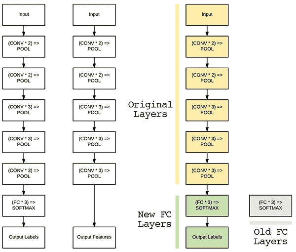
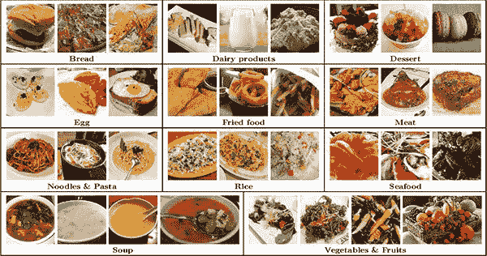
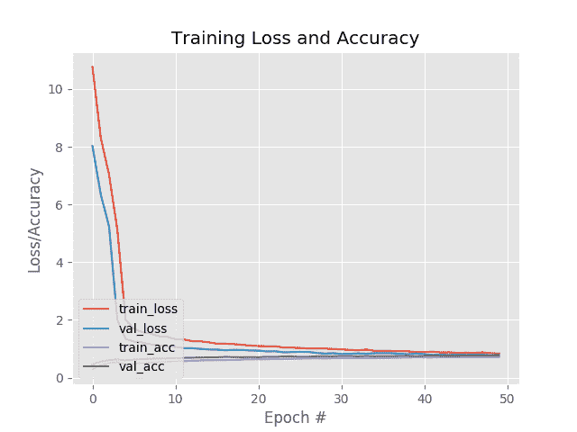
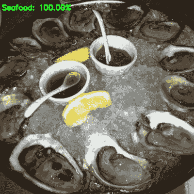
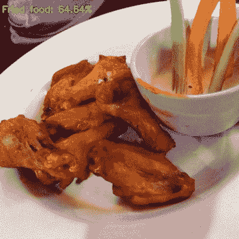

# 使用 Keras 和深度学习进行微调

> 原文：<https://pyimagesearch.com/2019/06/03/fine-tuning-with-keras-and-deep-learning/>


在本教程中，您将学习如何使用 Keras 和深度学习进行微调。

我们将在 ImageNet 数据集上对 CNN 进行预训练，并对其进行微调，以执行图像分类并识别从未训练过的类别。

今天是我们关于微调的三部分系列的最后一篇文章:

1.  **Part #1:** [用 Keras 迁移学习和深度学习](https://pyimagesearch.com/2019/05/20/transfer-learning-with-keras-and-deep-learning/)
2.  **第二部分:** [利用 Keras 和深度学习对大数据集进行特征提取](https://pyimagesearch.com/2019/05/27/keras-feature-extraction-on-large-datasets-with-deep-learning/)
3.  **第三部分:**用 Keras 和深度学习进行微调(今天的帖子)

如果你还没有阅读过本系列的前两个教程，我强烈建议你阅读本系列的前两个教程——理解**迁移学习**的概念，包括通过预先训练的 CNN 执行**特征提取**，将使你更好地理解(并欣赏)**微调**。

当执行特征提取时，我们*没有*重新训练原始 CNN。相反，我们将 CNN 视为一个任意的特征提取器，然后在提取的特征之上训练一个简单的机器学习模型。

**另一方面，微调要求我们不仅*更新*CNN 架构，而且*重新训练*它学习新的对象类。**

微调是一个多步骤的过程:

1.  移除网络末端(即进行实际分类标签预测的位置)的全连接节点。
2.  用新初始化的节点替换完全连接的节点。
3.  在网络中较早地冻结较早的 CONV 层(确保 CNN 学习到的任何先前的健壮特征不被破坏)。
4.  开始训练，*但是只训练 FC 层头*。
5.  可选地解冻网络中的部分/全部 CONV 层，并执行第二遍训练。

如果你是深度学习和 CNN 的新手，我会建议你在这里停下来，学习[如何训练你的第一个 CNN](https://pyimagesearch.com/2018/09/10/keras-tutorial-how-to-get-started-with-keras-deep-learning-and-python/) 。

使用 Keras 进行微调是一种更高级的技术，其中有许多陷阱和隐患，会让您一路出错(例如，如果您不小心，在执行微调时，很容易使网络过载)。

**要了解如何使用 Keras 和深度学习进行微调，*继续阅读。***

## 使用 Keras 和深度学习进行微调

***2020-06-04 更新:**此博文现已兼容 TensorFlow 2+!*

***注意:**我将在这篇文章中涉及的许多微调概念也出现在我的书《用 Python 进行计算机视觉的深度学习》中。**在这本书里，我进行了更详细的讨论(包括更多我的技巧、建议和最佳实践)。**如果你想在阅读完本指南后了解更多关于 Keras 微调的细节，请务必[看看我的书](https://pyimagesearch.com/deep-learning-computer-vision-python-book/)。*

在本教程的第一部分，我们将讨论微调的概念，以及我们如何重新训练神经网络来识别它最初没有训练识别的类。

在那里，我们将查看我们用于微调的数据集。

然后我将讨论我们的项目目录结构。

一旦我们很好地处理了数据集，我们将切换到使用 Keras 实现微调。

完成本教程后，您将能够:

1.  使用 Keras 微调网络。
2.  使用微调网络进行预测。

我们开始吧！

### 什么是微调？

[](https://pyimagesearch.com/wp-content/uploads/2019/06/fine_tuning_keras_knob.jpg)

**Figure 1:** Fine-tuning with Keras and deep learning using Python involves retraining the head of a network to recognize classes it was not originally intended for.

***注:**以下章节改编自我的书，[用 Python 进行计算机视觉的深度学习](https://pyimagesearch.com/deep-learning-computer-vision-python-book/)。关于迁移学习和微调的全套章节，[请参考正文。](https://pyimagesearch.com/deep-learning-computer-vision-python-book/)*

在这一系列关于迁移学习的帖子中，我们学习了如何将预训练的卷积神经网络作为特征提取器。

使用这个特征提取器，我们通过网络向前传播我们的图像数据集，提取给定层的激活(将激活视为特征向量)，然后将值保存到磁盘。

一个标准的机器学习分类器(在我们的情况下，逻辑回归)在 CNN 特征之上被训练，就像我们对手工设计的特征如 SIFT、HOG、LBPs 等所做的一样。

这种转移学习的方法叫做 ***特征提取*** 。

但是还有另一种类型的迁移学习，这种学习实际上比特征提取法更好。这种方法叫做 ***微调*** ，需要我们进行“网络手术”。

首先，我们拿起手术刀，从一个预先训练好的 CNN(通常是 VGG、雷斯网或盗梦空间)上切下最后一组完全连接的层(即返回分类标签预测的网络“头”)。

然后我们用一组新的随机初始化的完全连接的层来代替头部。

从那里，*头*下面的所有层被冻结，因此它们的权重不能被更新(即，反向传播中的反向传递不能到达它们)。

然后，我们使用非常小的学习速率来训练网络，以便新的一组完全连接的层可以从网络中先前学习的*conv 层学习模式— **。这个过程被称为允许 FC 层“预热”。***

可选地，我们可以解冻网络的其余部分并继续培训。应用微调允许我们利用预先训练的网络来识别最初没有在上训练过的*类。*

此外，该方法比通过特征提取的迁移学习具有更高的准确率。

### 微调和网络手术

***注:**以下章节改编自我的书，[用 Python 进行计算机视觉的深度学习](https://pyimagesearch.com/deep-learning-computer-vision-python-book/)。关于迁移学习和微调的全套章节，[请参考正文。](https://pyimagesearch.com/deep-learning-computer-vision-python-book/)*

正如我们在本系列早些时候讨论的[通过特征提取进行迁移学习](https://pyimagesearch.com/2019/05/20/transfer-learning-with-keras-and-deep-learning/)一样，预训练网络(如在 ImageNet 数据集上训练的网络)包含丰富的鉴别过滤器。过滤器可用于数据集，以预测网络已经训练过的类别标签之外的类别标签。

然而，我们不是简单地应用特征提取，而是要执行网络手术并*修改实际架构*，以便我们可以重新训练网络的部分。

如果这听起来像一部糟糕的恐怖电影；别担心，不会有任何流血和流血——但我们会从中获得一些乐趣，并通过我们的 Frankenstien 博士式的网络实验学到很多关于迁移学习的知识。

要了解微调的工作原理，请考虑下图:

[](https://pyimagesearch.com/wp-content/uploads/2019/06/fine_tuning_keras_network_surgery.png)

**Figure 2:** **Left:** The original VGG16 network architecture. **Middle:** Removing the FC layers from VGG16 and treating the final POOL layer as a feature extractor. **Right:** Removing the original FC Layers and replacing them with a brand new FC head. These FC layers can then be fine-tuned to a specific dataset (the old FC Layers are no longer used).

左边的*是 VGG16 网络的各层。*

正如我们所知，最后一组层(即“头部”)是我们与 softmax 分类器完全连接的层。

在进行微调时，我们实际上是*切断*网络的头部，就像在特征提取中一样(**图二**、*中*)。

然而，与特征提取不同，当我们执行*微调*时，我们实际上**构建了一个新的全连接头部**并且**将它放置在原始架构**的顶部(**图 2** 、*右*)。

新的 FC 层报头被随机初始化(就像新网络中的任何其他层一样)并连接到原始网络的主体。

但是，有一个问题:

我们的 CONV 层已经学会了丰富的，有区别的过滤器，而我们的 FC 层是全新的，完全随机的。

如果我们允许梯度从这些随机值一直通过网络反向传播，我们就有破坏这些强大特征的风险。

为了避免这个问题，我们反而让我们的 FC 头通过(讽刺的是)“冻结”网络体中的所有层来“热身”(我告诉过你恐怖/尸体的类比在这里很有效)，如图**图 2** ( *左*)所示。

[](https://pyimagesearch.com/wp-content/uploads/2019/06/fine_tuning_keras_freeze_unfreeze.png)

**Figure 3:** **Left:** When we start the fine-tuning process, we freeze all CONV layers in the network and only allow the gradient to backpropagate through the FC layers. Doing this allows our network to “warm up”. **Right:** After the FC layers have had a chance to warm up, we may choose to unfreeze all or some of the layers earlier in the network and allow each of them to be fine-tuned as well.

训练数据像我们通常所做的那样通过网络向前传播；然而，反向传播在 FC 层之后停止，这允许这些层开始从高区分度的 CONV 层学习模式。

在某些情况下，我们可能会决定永远不解冻网络体，因为我们的新 FC 头可能会获得足够的准确性。

然而，对于某些数据集，在微调过程中允许修改原始 CONV 图层通常也是有利的(**图 3** 、*右*)。

在 FC 头部已经开始学习我们数据集中的模式之后，我们可以暂停训练，解冻身体，并继续训练，*但是学习速率非常小*——我们不想大幅改变我们的 CONV 滤波器。

然后允许继续训练，直到获得足够的准确度。

微调是一种*超级强大的方法*，用于从预训练的 CNN 中获得您自己的定制数据集上的图像分类器(甚至比通过特征提取的[迁移学习](https://pyimagesearch.com/2019/05/20/transfer-learning-with-keras-and-deep-learning/)更强大)。

**如果您想通过深度学习了解更多关于迁移学习的信息，包括:**

*   基于深度学习的特征提取
*   在提取的特征之上训练模型
*   在您自己的自定义数据集上微调网络
*   我个人关于迁移学习的技巧、建议和最佳实践

**…然后你会想看一看我的书， [*用 Python 进行计算机视觉的深度学习*](https://pyimagesearch.com/deep-learning-computer-vision-python-book/) ，在那里我详细介绍了这些算法和技术。**

### **配置您的开发环境**

要针对本教程配置您的系统，我首先建议您遵循以下任一教程:

*   [*如何在 Ubuntu 上安装 tensor flow 2.0*](https://pyimagesearch.com/2019/12/09/how-to-install-tensorflow-2-0-on-ubuntu/)
*   [*如何在 macOS 上安装 tensor flow 2.0*](https://pyimagesearch.com/2019/12/09/how-to-install-tensorflow-2-0-on-macos/)

这两个教程都将帮助您在一个方便的 Python 虚拟环境中，用这篇博文所需的所有软件来配置您的系统。

请注意 [PyImageSearch 不推荐也不支持 CV/DL 项目](https://pyimagesearch.com/faqs/single-faq/can-you-help-me-do-___-on-windows/)的窗口。

***2020-06-03 更新:**本次 TensorFlow 2.0 bug 影响本博文:``Filling up shuffle buffer (this may take a while)`` 。根据[本次 GitHub 问题](https://github.com/beringresearch/ivis/issues/56)tensor flow 2.1 中已经修复了 bug。请使用 TensorFlow > = 2.1，这样才不会遇到这个 bug！*

### Food-11 数据集

[](https://pyimagesearch.com/wp-content/uploads/2019/06/fine_tuning_keras_food11.jpg)

**Figure 4:** The [Food-11 dataset](https://mmspg.epfl.ch/downloads/food-image-datasets/) is curated by the Multimedia Signal Processing Group (MSPG) of the Swiss Federal Institute of Technology. ([image source](https://infoscience.epfl.ch/record/221610/files/madima2016_food_recognition.pdf))

我们将用于微调的数据集是瑞士联邦理工学院[多媒体信号处理小组(MSPG)](https://mmspg.epfl.ch) 的 **[Food-11 数据集](https://mmspg.epfl.ch/downloads/food-image-datasets/)** 。

**该数据集由 16，643 张图像组成，属于 11 个主要食物类别:**

1.  **面包** (1724 张图片)
2.  **乳制品** (721 张图片)
3.  **甜点**(2500 张图片)
4.  **彩蛋**(1648 张图片)
5.  **油炸食品**(1461 张图片)
6.  **肉**(2206 张图片)
7.  **面条/意大利面** (734 张图片)
8.  **大米** (472 张图片)
9.  **海鲜**(1505 张图片)
10.  **汤**(2500 张图片)
11.  **蔬菜/水果**(1172 张图片)

使用 Food-11 数据集，我们可以训练一个能够识别每个主要食物组的深度学习模型——例如，这种模型可以用于移动健身应用程序，自动跟踪估计的食物组和热量摄入。

为了训练这样一个模型，我们将利用 Keras 深度学习库进行微调。

#### 下载 Food-11 数据集

继续从这篇博文的 ***【下载】*** 部分抓取压缩文件。

下载完源代码后，将目录更改为`fine-tuning-keras`:

```py
$ unzip fine-tuning-keras.zip
$ cd fine-tuning-keras

```

***2020-06-04 更新:**根据我的经验，我发现**从原始来源下载 Food-11 数据集是不可靠的。**因此，我提供了 Food-11 数据集的直接下载链接。使用 wget 或 FTP 的选项现在从本文中删除了。*

现在，请使用以下链接下载 Food-11:

[下载食物-11](https://s3-us-west-2.amazonaws.com/static.pyimagesearch.com/food-datasets/Food-11.zip)

下载数据集后，可以将其提取到项目目录(`fine-tuning-keras`):

```py
$ unzip Food-11.zip

```

### 项目结构

现在我们已经下载了项目和数据集，接下来导航回项目根目录。让我们从这里开始分析项目结构:

```py
$ cd ..
$ tree --dirsfirst --filelimit 10
.
├── Food-11
│   ├── evaluation [3347 entries]
│   ├── training [9866 entries]
│   └── validation [3430 entries]
├── dataset
├── output
│   ├── unfrozen.png
│   └── warmup.png
├── pyimagesearch
│   ├── __init__.py
│   └── config.py
├── build_dataset.py
├── predict.py
├── Food-11.zip
└── train.py

7 directories, 8 files

```

我们的项目结构类似于上周的[。](https://pyimagesearch.com/2019/05/27/keras-feature-extraction-on-large-datasets-with-deep-learning/)

我们的原始数据集在`Food-11/`目录中。*参见上面的直接链接下载数据集。*

执行`build_dataset.py`使我们能够将 Food-11 图像组织到`dataset/`目录中。

从那里，我们将使用`train.py`到**进行微调。**

最后，我们将使用`predict.py`通过我们的微调网络对样本图像进行预测。

前面提到的每个脚本都利用了一个名为`config.py`的配置文件。现在让我们继续学习关于配置脚本的更多内容。

### 了解我们的配置文件

在我们实际微调我们的网络之前，我们首先需要创建我们的配置文件来存储重要的变量，包括:

*   输入数据集的路径
*   类别标签
*   批量大小/训练参数
*   输出路径，包括模型文件、标签编码器、绘图历史等。

由于我们需要如此多的参数，我选择使用一个配置文件来保持我们的代码整洁有序(而不是必须使用许多[命令行参数](https://pyimagesearch.com/2018/03/12/python-argparse-command-line-arguments/))。

我们的配置文件`config.py`位于一个名为`pyimagesearch`的 Python 模块中。

我们在那里保存`config.py`文件有两个原因:

1.  为了确保我们可以将配置导入到我们自己的 Python 脚本中
2.  保持我们的代码整洁有序

***注意:*** *这个配置文件类似于上周的[和上周](https://pyimagesearch.com/2019/05/27/keras-feature-extraction-on-large-datasets-with-deep-learning/)的[教程中的那个。](https://pyimagesearch.com/2019/05/20/transfer-learning-with-keras-and-deep-learning/)*

现在让我们填充我们的`config.py`文件——在您最喜欢的代码编辑器中打开它，并插入下面几行:

```py
# import the necessary packages
import os

# initialize the path to the *original* input directory of images
ORIG_INPUT_DATASET = "Food-11"

# initialize the base path to the *new* directory that will contain
# our images after computing the training and testing split
BASE_PATH = "dataset"

```

首先，我们导入`os`，使我们能够在这个配置中直接构建文件/目录路径。

我们提取 Food-11 数据集的原始数据集路径包含在`ORIG_INPUT_DATASET` ( **第 5 行**)中。

然后，我们指定组织好的数据集将很快驻留的`BASE_PATH`。

在这里，我们将定义我们的`TRAIN`、`TEST`和`VAL`目录的名称:

```py
# define the names of the training, testing, and validation
# directories
TRAIN = "training"
TEST = "evaluation"
VAL = "validation"

```

接着列出了我们的 Food-11 数据集的 11 个`CLASSES`:

```py
# initialize the list of class label names
CLASSES = ["Bread", "Dairy product", "Dessert", "Egg", "Fried food",
	"Meat", "Noodles/Pasta", "Rice", "Seafood", "Soup",
	"Vegetable/Fruit"]

```

最后，我们将指定批量大小和模型+绘图路径:

```py
# set the batch size when fine-tuning
BATCH_SIZE = 32

# initialize the label encoder file path and the output directory to
# where the extracted features (in CSV file format) will be stored
LE_PATH = os.path.sep.join(["output", "le.cpickle"])
BASE_CSV_PATH = "output"

# set the path to the serialized model after training
MODEL_PATH = os.path.sep.join(["output", "food11.model"])

# define the path to the output training history plots
UNFROZEN_PLOT_PATH = os.path.sep.join(["output", "unfrozen.png"])
WARMUP_PLOT_PATH = os.path.sep.join(["output", "warmup.png"])

```

我们的`32`中的`BATCH_SIZE`表示将流经 CNN 的数据块的大小。

我们最终会将序列化的标签编码器存储为 pickle 文件(**第 27 行**)。

我们微调后的系列化 Keras 车型将出口到`MODEL_PATH`(**31 线**)。

类似地，我们指定存储预热和解冻绘图图像的路径(**行 34 和 35** )。

### 构建我们的图像数据集进行微调

如果我们将整个 Food-11 数据集存储在内存中，它将占用 **~10GB 的 RAM** 。

大多数深度学习设备应该能够处理如此大量的数据，但尽管如此，我将向您展示如何使用 Keras 的`.flow_from_directory`函数，一次只从磁盘加载少量数据。

然而，在我们真正开始微调和重新训练网络之前，我们首先必须(正确地)组织我们在磁盘上的图像数据集。

为了使用`.flow_from_directory`函数，Keras 要求我们使用以下模板组织数据集:

`dataset_name/class_label/example_of_class_label.jpg`

由于 Food-11 数据集*也提供预先提供的数据分割*，我们最终的目录结构将具有以下形式:

`dataset_name/split_name/class_label/example_of_class_label.jpg`

**拥有上述目录结构可确保:**

1.  `.flow_from_directory`功能将正常工作。
2.  我们的数据集被组织成一个整洁、易于遵循的目录结构。

为了获取*原始的* Food-11 图像，然后将它们复制到我们想要的目录结构中，我们需要`build_dataset.py`脚本。

现在让我们回顾一下这个脚本:

```py
# import the necessary packages
from pyimagesearch import config
from imutils import paths
import shutil
import os

# loop over the data splits
for split in (config.TRAIN, config.TEST, config.VAL):
	# grab all image paths in the current split
	print("[INFO] processing '{} split'...".format(split))
	p = os.path.sep.join([config.ORIG_INPUT_DATASET, split])
	imagePaths = list(paths.list_images(p))

	# loop over the image paths
	for imagePath in imagePaths:
		# extract class label from the filename
		filename = imagePath.split(os.path.sep)[-1]
		label = config.CLASSES[int(filename.split("_")[0])]

		# construct the path to the output directory
		dirPath = os.path.sep.join([config.BASE_PATH, split, label])

		# if the output directory does not exist, create it
		if not os.path.exists(dirPath):
			os.makedirs(dirPath)

		# construct the path to the output image file and copy it
		p = os.path.sep.join([dirPath, filename])
		shutil.copy2(imagePath, p)

```

**2-5 线**进口我们必要的包装，特别是我们的`config`。

从那里，我们循环从第 8 行的**开始的数据分割。在内部，我们:**

*   提取`imagePaths`和每个类`label` ( **第 11-18 行**)。
*   为我们组织好的图像文件创建一个目录结构(**第 21-25 行**)。
*   将图像文件复制到适当的目的地(**第 28 行和第 29 行**)。

这个脚本已经在 Keras 的 [*转移学习和深度学习*](https://pyimagesearch.com/2019/05/20/transfer-learning-with-keras-and-deep-learning/) 帖子中进行了更详细的回顾。如果你想知道更多关于`build_dataset.py`内部工作的细节，请参考之前的教程。

* * *

在继续之前，确保您已经使用教程的 ***【下载】*** 部分下载了与这篇博文相关的源代码。

从那里，打开一个终端并执行以下命令:

```py
$ python build_dataset.py 
[INFO] processing 'training split'...
[INFO] processing 'evaluation split'...
[INFO] processing 'validation split'...

```

如果您研究一下`dataset/`目录，您会看到三个目录，分别对应于我们各自的数据分割:

```py
$ ls dataset/
evaluation		training	validation

```

在每个数据分割目录中，您还可以找到类别标签子目录:

```py
$ ls -l dataset/training/
Bread
Dairy product
Dessert
Egg
Fried food
Meat
Noodles
Rice
Seafood
Soup
Vegetable

```

在每个类别标签子目录中，您会找到与该标签相关的图像:

```py
$ ls -l dataset/training/Bread/*.jpg | head -n 5
dataset/training/Bread/0_0.jpg
dataset/training/Bread/0_1.jpg
dataset/training/Bread/0_10.jpg
dataset/training/Bread/0_100.jpg
dataset/training/Bread/0_101.jpg

```

### 使用 Keras 实现微调

现在我们的图像已经在适当的目录结构中，我们可以使用 Keras 进行微调。

让我们实现`train.py`中的微调脚本:

```py
# set the matplotlib backend so figures can be saved in the background
import matplotlib
matplotlib.use("Agg")

# import the necessary packages
from tensorflow.keras.preprocessing.image import ImageDataGenerator
from tensorflow.keras.applications import VGG16
from tensorflow.keras.layers import Dropout
from tensorflow.keras.layers import Flatten
from tensorflow.keras.layers import Dense
from tensorflow.keras.layers import Input
from tensorflow.keras.models import Model
from tensorflow.keras.optimizers import SGD
from sklearn.metrics import classification_report
from pyimagesearch import config
from imutils import paths
import matplotlib.pyplot as plt
import numpy as np
import os

```

**第 2-19 行**导入所需的包。让我们简要回顾一下对今天帖子中的微调概念最重要的那些:

*   我们将计划我们冻结和解冻的训练努力。**第 3 行**设置后端，确保我们可以将绘图作为图像文件保存到磁盘。
*   `ImageDataGenerator`:允许数据扩充。请务必参考 [DL4CV](https://pyimagesearch.com/deep-learning-computer-vision-python-book/) 和[这篇博文](https://pyimagesearch.com/2018/12/24/how-to-use-keras-fit-and-fit_generator-a-hands-on-tutorial/)以获得更多关于这个类的信息。
*   在 ImageNet 上训练的开创性网络，我们将用我们的手术刀对其进行切割，以达到微调的目的。
*   `classification_report`:在评估我们的模型时计算基本的统计信息。
*   `config`:我们在*“了解我们的配置文件”*一节中查看过的自定义配置文件。

一定要熟悉其余的导入。

包裹唾手可得，我们现在准备继续前进。让我们首先定义一个绘制培训历史的函数:

```py
def plot_training(H, N, plotPath):
	# construct a plot that plots and saves the training history
	plt.style.use("ggplot")
	plt.figure()
	plt.plot(np.arange(0, N), H.history["loss"], label="train_loss")
	plt.plot(np.arange(0, N), H.history["val_loss"], label="val_loss")
	plt.plot(np.arange(0, N), H.history["accuracy"], label="train_acc")
	plt.plot(np.arange(0, N), H.history["val_accuracy"], label="val_acc")
	plt.title("Training Loss and Accuracy")
	plt.xlabel("Epoch #")
	plt.ylabel("Loss/Accuracy")
	plt.legend(loc="lower left")
	plt.savefig(plotPath)

```

***2020-06-03 更新:**为了使该绘图片段与 TensorFlow 2+兼容，更新了`H.history`字典键，以完全拼出“精度”而没有“acc”(即`H.history["val_accuracy"]`和`H.history["accuracy"]`)。“val”没有拼成“validation”，这有点令人困惑；我们必须学会热爱 API 并与之共存，并永远记住这是一项正在进行的工作，世界各地的许多开发人员都为此做出了贡献。*

`plot_training`功能在**行 21-33** 中定义。这个辅助函数将用于构建和保存我们的训练历史图。

让我们确定每个分割中的图像总数:

```py
# derive the paths to the training, validation, and testing
# directories
trainPath = os.path.sep.join([config.BASE_PATH, config.TRAIN])
valPath = os.path.sep.join([config.BASE_PATH, config.VAL])
testPath = os.path.sep.join([config.BASE_PATH, config.TEST])

# determine the total number of image paths in training, validation,
# and testing directories
totalTrain = len(list(paths.list_images(trainPath)))
totalVal = len(list(paths.list_images(valPath)))
totalTest = len(list(paths.list_images(testPath)))

```

第 37-39 行分别定义了训练、验证和测试目录的路径。

然后，我们通过**行 43-45** 确定每次分割的图像总数——这些值将使我们能够计算每个时期的步数。

让我们初始化我们的数据扩充对象，并建立我们的平均减法值:

```py
# initialize the training data augmentation object
trainAug = ImageDataGenerator(
	rotation_range=30,
	zoom_range=0.15,
	width_shift_range=0.2,
	height_shift_range=0.2,
	shear_range=0.15,
	horizontal_flip=True,
	fill_mode="nearest")

# initialize the validation/testing data augmentation object (which
# we'll be adding mean subtraction to)
valAug = ImageDataGenerator()

# define the ImageNet mean subtraction (in RGB order) and set the
# the mean subtraction value for each of the data augmentation
# objects
mean = np.array([123.68, 116.779, 103.939], dtype="float32")
trainAug.mean = mean
valAug.mean = mean

```

数据扩充的过程对于小数据集是很重要的。事实上，它几乎总是被推荐。**第 48-55 行**定义了我们的训练数据增强对象。这些参数指定了在我们训练时对训练数据的随机旋转、缩放、平移、剪切和翻转。

***注:**我看到的一个关于数据扩充的常见误解是，图像的随机变换然后被*添加到原始*训练数据中**事实并非如此。**由数据扩充执行的随机变换在就地执行**，这意味着数据集大小**不会增加。**这些转换在培训期间就地、动态执行。***

尽管我们的验证数据扩充对象( **Line 59** )使用了相同的类，但是我们不提供任何参数(我们不对验证或测试数据应用数据扩充)。验证`ImageDataGenerator`将仅用于均值减法，这就是不需要参数的原因。

接下来，我们在**行 64** 上设置 ImageNet 平均减数值。在这种预处理技术中，我们对所有图像执行逐像素减法。均值减法是我在 [*的*实践者捆绑包*中解释的几种缩放技术之一，用于使用 Python*](https://pyimagesearch.com/deep-learning-computer-vision-python-book/) 进行计算机视觉的深度学习。在本文中，我们甚至将构建一个定制的预处理器来更有效地完成均值减法。

给定逐像素的减法值，我们为每个数据扩充对象准备均值减法(**行 65 和 66** )。

我们的数据扩充生成器将直接从各自的目录中生成数据:

```py
# initialize the training generator
trainGen = trainAug.flow_from_directory(
	trainPath,
	class_mode="categorical",
	target_size=(224, 224),
	color_mode="rgb",
	shuffle=True,
	batch_size=config.BATCH_SIZE)

# initialize the validation generator
valGen = valAug.flow_from_directory(
	valPath,
	class_mode="categorical",
	target_size=(224, 224),
	color_mode="rgb",
	shuffle=False,
	batch_size=config.BATCH_SIZE)

# initialize the testing generator
testGen = valAug.flow_from_directory(
	testPath,
	class_mode="categorical",
	target_size=(224, 224),
	color_mode="rgb",
	shuffle=False,
	batch_size=config.BATCH_SIZE)

```

**第 69-93 行**定义了生成器，它将从它们各自的训练、验证和测试分割中加载批量图像。

使用这些生成器可以确保我们的机器不会因为试图一次加载所有数据而耗尽 RAM。

让我们继续进行**执行网络手术:**

```py
# load the VGG16 network, ensuring the head FC layer sets are left
# off
baseModel = VGG16(weights="imagenet", include_top=False,
	input_tensor=Input(shape=(224, 224, 3)))

# construct the head of the model that will be placed on top of the
# the base model
headModel = baseModel.output
headModel = Flatten(name="flatten")(headModel)
headModel = Dense(512, activation="relu")(headModel)
headModel = Dropout(0.5)(headModel)
headModel = Dense(len(config.CLASSES), activation="softmax")(headModel)

# place the head FC model on top of the base model (this will become
# the actual model we will train)
model = Model(inputs=baseModel.input, outputs=headModel)

```

首先，我们将从磁盘加载 VGG16 架构(带有预训练的 ImageNet 权重)，留下完全连接的层(**行 97 和 98** )。通过省略完全连接的层，我们已经有效地将网络放入了断头台，将我们的网络斩首，如图**图 2** 。

从那里，我们定义一个新的完全连接的层头(**行 102-106** )。

***注:**如果你不熟悉**第 102-106 行**上的内容，我推荐你看我的 [Keras 教程](https://pyimagesearch.com/2018/09/10/keras-tutorial-how-to-get-started-with-keras-deep-learning-and-python/)或者 [CNN 教程](https://pyimagesearch.com/2018/04/16/keras-and-convolutional-neural-networks-cnns/)。如果你想完全沉浸在深度学习的世界中，一定要看看我的高度评价的深度学习书籍。*

在**行 110** 上，我们将新的 FC 层头放在 VGG16 基础网络的顶部。你可以认为这是在手术后增加缝线将头部重新缝合到网络体上。

花点时间仔细查看上面的代码块，因为它是使用 Keras 进行**微调的核心。**

继续微调，让我们**冻结 VGG16 的所有 CONV 层:**

```py
# loop over all layers in the base model and freeze them so they will
# *not* be updated during the first training process
for layer in baseModel.layers:
	layer.trainable = False

```

**第 114 和 115 行**冻结 VGG16 基本模型中的所有 CONV 图层。

**鉴于*基地现在被冻结*，我们将继续训练我们的网络*(只有头部权重会被更新):***

```py
# compile our model (this needs to be done after our setting our
# layers to being non-trainable
print("[INFO] compiling model...")
opt = SGD(lr=1e-4, momentum=0.9)
model.compile(loss="categorical_crossentropy", optimizer=opt,
	metrics=["accuracy"])

# train the head of the network for a few epochs (all other layers
# are frozen) -- this will allow the new FC layers to start to become
# initialized with actual "learned" values versus pure random
print("[INFO] training head...")
H = model.fit(
	x=trainGen,
	steps_per_epoch=totalTrain // config.BATCH_SIZE,
	validation_data=valGen,
	validation_steps=totalVal // config.BATCH_SIZE,
	epochs=50)

# reset the testing generator and evaluate the network after
# fine-tuning just the network head
print("[INFO] evaluating after fine-tuning network head...")
testGen.reset()
predIdxs = model.predict(x=testGen,
	steps=(totalTest // config.BATCH_SIZE) + 1)
predIdxs = np.argmax(predIdxs, axis=1)
print(classification_report(testGen.classes, predIdxs,
	target_names=testGen.class_indices.keys()))
plot_training(H, 50, config.WARMUP_PLOT_PATH)

```

***2020-06-03 更新:**根据 TensorFlow 2.0+，我们不再使用`.fit_generator`方法；它被替换为`.fit`，并具有相同的函数签名(即，第一个参数可以是 Python 生成器对象)。同样，`.predict_generator`换成了`.predict`。*

在这一环节中，我们训练我们的`model`，记住**在基础阶段不会发生体重更新。*此时只有网络的头头会被调整。***

在这个代码块中，我们:

*   编译`model` ( **第 120-122 行**)。我们将`"categorical_crossentropy"`用于我们的`loss`函数。如果只对两个类别进行分类，请务必使用`"binary_crossentropy"`。
*   在应用数据扩充的同时训练我们的网络，仅更新网络头部的权重(**行 128-133**
*   重置我们的测试发生器(**线 138** )。
*   根据我们的测试数据评估我们的网络(**第 139-141 行**)。我们将通过**线 142 和 143** 在终端打印分类统计。
*   通过我们的`plot_training`功能(**第 144 行**)绘制训练历史。

现在让我们继续 ***解冻*基础模型图层中的最后一组 CONV 图层:**

```py
# reset our data generators
trainGen.reset()
valGen.reset()

# now that the head FC layers have been trained/initialized, lets
# unfreeze the final set of CONV layers and make them trainable
for layer in baseModel.layers[15:]:
	layer.trainable = True

# loop over the layers in the model and show which ones are trainable
# or not
for layer in baseModel.layers:
	print("{}: {}".format(layer, layer.trainable))

```

我们首先重置我们的训练和验证生成器(**行 147 和 148** )。

我们然后 ***解冻*** 最后的 CONV 图层块在 VGG16 ( **第 152 行和第 153 行**)。同样，只有 VGG16 的*最终* CONV 块被解冻(不是网络的其余部分)。

为了不混淆我们网络中正在发生的事情，**行 157 和 158** 将向我们显示哪些层是冻结的/未冻结的(即可训练的)。信息会在我们的终端打印出来。

继续，让我们**微调*两个*最后一组 CONV 图层*和*我们的一组 FC 图层:**

```py
# for the changes to the model to take affect we need to recompile
# the model, this time using SGD with a *very* small learning rate
print("[INFO] re-compiling model...")
opt = SGD(lr=1e-4, momentum=0.9)
model.compile(loss="categorical_crossentropy", optimizer=opt,
	metrics=["accuracy"])

# train the model again, this time fine-tuning *both* the final set
# of CONV layers along with our set of FC layers
H = model.fit(
	x=trainGen,
	steps_per_epoch=totalTrain // config.BATCH_SIZE,
	validation_data=valGen,
	validation_steps=totalVal // config.BATCH_SIZE,
	epochs=20)

```

***2020-06-03 更新:**每 TensorFlow 2.0+，我们不再使用`.fit_generator`方法；它被替换为`.fit`，并具有相同的函数签名(即，第一个参数可以是 Python 生成器对象)。*

因为我们已经解冻了额外的层，我们必须重新编译模型(**第 163-165 行**)。

**然后我们再次训练模型，这次微调*两个*FC 层头*和*最后的 CONV 块(第 169-174 行)。**

总结一下，让我们再次评估一下网络:

```py
# reset the testing generator and then use our trained model to
# make predictions on the data
print("[INFO] evaluating after fine-tuning network...")
testGen.reset()
predIdxs = model.predict(x=testGen,
	steps=(totalTest // config.BATCH_SIZE) + 1)
predIdxs = np.argmax(predIdxs, axis=1)
print(classification_report(testGen.classes, predIdxs,
	target_names=testGen.class_indices.keys()))
plot_training(H, 20, config.UNFROZEN_PLOT_PATH)

# serialize the model to disk
print("[INFO] serializing network...")
model.save(config.MODEL_PATH, save_format="h5")

```

***2020-06-03 更新:**根据 TensorFlow 2.0+，我们不再使用`.predict_generator`；换成了`.predict`。并且具有相同的函数签名(即，第一个参数可以是 Python 生成器对象)。*

在这里我们:

*   对测试数据进行预测(**第 179-182 行**)。
*   打印新的分类报告(**第 183 行和第 184 行**)。
*   生成解冻的训练并保存到磁盘( **Line 185** )。
*   并将模型序列化到磁盘，允许我们在我们的`predict.py`脚本中调用模型(**第 189 行**)。

在我们的微调之旅中坚持与我一起做得很好。接下来我们将让我们的脚本发挥作用！

### 通过使用 Keras 进行微调来训练网络

现在我们已经实现了 Python 脚本来执行微调，让我们试一试，看看会发生什么。

确保您已经使用了本教程的 ***“下载”*** 部分来下载这篇文章的源代码，并从那里执行以下命令:

```py
$ python train.py
Using TensorFlow backend.
Found 9866 images belonging to 11 classes.
Found 3430 images belonging to 11 classes.
Found 3347 images belonging to 11 classes.
[INFO] compiling model...
[INFO] training head...
Epoch 1/50
308/308 [==============================] - 91s 294ms/step - loss: 4.5022 - accuracy: 0.2844 - val_loss: 1.7583 - val_accuracy: 0.4238
Epoch 2/50
308/308 [==============================] - 89s 289ms/step - loss: 1.9905 - accuracy: 0.3551 - val_loss: 1.4969 - val_accuracy: 0.4909
Epoch 3/50 
308/308 [==============================] - 90s 294ms/step - loss: 1.8038 - accuracy: 0.3991 - val_loss: 1.4215 - val_accuracy: 0.5301
...
Epoch 48/50
308/308 [==============================] - 88s 285ms/step - loss: 0.9199 - accuracy: 0.6909 - val_loss: 0.7735 - val_accuracy: 0.7614
Epoch 49/50
308/308 [==============================] - 87s 284ms/step - loss: 0.8974 - accuracy: 0.6977 - val_loss: 0.7749 - val_accuracy: 0.7602
Epoch 50/50
308/308 [==============================] - 88s 287ms/step - loss: 0.8930 - accuracy: 0.7004 - val_loss: 0.7764 - val_accuracy: 0.7646
[INFO] evaluating after fine-tuning network head...
               precision    recall  f1-score   support

        Bread       0.72      0.58      0.64       368
Dairy product       0.75      0.56      0.64       148
      Dessert       0.72      0.68      0.70       500
          Egg       0.66      0.72      0.69       335
   Fried food       0.72      0.70      0.71       287
         Meat       0.75      0.84      0.79       432
      Noodles       0.97      0.95      0.96       147
         Rice       0.85      0.88      0.86        96
      Seafood       0.79      0.81      0.80       303
         Soup       0.89      0.95      0.92       500
    Vegetable       0.86      0.91      0.88       231

     accuracy                           0.78      3347
    macro avg       0.79      0.78      0.78      3347
 weighted avg       0.78      0.78      0.77      3347

```

[](https://pyimagesearch.com/wp-content/uploads/2019/06/warmup.png)

**Figure 6:** Our Keras fine-tuning network is allowed to “warm up” prior to unfreezing only the final block of CONV layers in VGG16.

在微调我们新初始化的 FC 层头并让 FC 层预热后，我们获得了相当可观的 **~76%的准确度**。

接下来，我们看到我们已经解冻了 VGG16 中的最后一块 CONV 层，同时保持其余网络权重冻结:

```py
<tensorflow.python.keras.engine.input_layer.InputLayer object at 0x7f2baa5f6eb8>: False
<tensorflow.python.keras.layers.convolutional.Conv2D object at 0x7f2c21583198>: False
<tensorflow.python.keras.layers.convolutional.Conv2D object at 0x7f2c8075ffd0>: False
<tensorflow.python.keras.layers.pooling.MaxPooling2D object at 0x7f2c80725630>: False
<tensorflow.python.keras.layers.convolutional.Conv2D object at 0x7f2c807254a8>: False
<tensorflow.python.keras.layers.convolutional.Conv2D object at 0x7f2c8072f828>: False
<tensorflow.python.keras.layers.pooling.MaxPooling2D object at 0x7f2c807399b0>: False
<tensorflow.python.keras.layers.convolutional.Conv2D object at 0x7f2c80739828>: False
<tensorflow.python.keras.layers.convolutional.Conv2D object at 0x7f2c804c0b70>: False
<tensorflow.python.keras.layers.convolutional.Conv2D object at 0x7f2c804c52b0>: False
<tensorflow.python.keras.layers.pooling.MaxPooling2D object at 0x7f2c804cd0f0>: False
<tensorflow.python.keras.layers.convolutional.Conv2D object at 0x7f2c804cdac8>: False
<tensorflow.python.keras.layers.convolutional.Conv2D object at 0x7f2c804d4dd8>: False
<tensorflow.python.keras.layers.convolutional.Conv2D object at 0x7f2c804d94a8>: False
<tensorflow.python.keras.layers.pooling.MaxPooling2D object at 0x7f2c804de3c8>: False
<tensorflow.python.keras.layers.convolutional.Conv2D object at 0x7f2c804e2cf8>: True
<tensorflow.python.keras.layers.convolutional.Conv2D object at 0x7f2c804e2e10>: True
<tensorflow.python.keras.layers.convolutional.Conv2D object at 0x7f2c804ed828>: True
<tensorflow.python.keras.layers.pooling.MaxPooling2D object at 0x7f2c804f2550>: True

```

一旦我们解冻了最后一个 CONV 块，我们就继续微调:

```py
[INFO] re-compiling model...
Epoch 1/20
308/308 [==============================] - 88s 285ms/step - loss: 0.9120 - accuracy: 0.6978 - val_loss: 0.7333 - val_accuracy: 0.7818
Epoch 2/20
308/308 [==============================] - 88s 285ms/step - loss: 0.8302 - accuracy: 0.7252 - val_loss: 0.6916 - val_accuracy: 0.7941
Epoch 3/20
308/308 [==============================] - 88s 285ms/step - loss: 0.7882 - accuracy: 0.7401 - val_loss: 0.6982 - val_accuracy: 0.7953
Epoch 4/20
308/308 [==============================] - 88s 285ms/step - loss: 0.7418 - accuracy: 0.7557 - val_loss: 0.6813 - val_accuracy: 0.8110
Epoch 5/20
308/308 [==============================] - 88s 285ms/step - loss: 0.6744 - accuracy: 0.7808 - val_loss: 0.6259 - val_accuracy: 0.8195
...
Epoch 16/20
308/308 [==============================] - 89s 289ms/step - loss: 0.4534 - accuracy: 0.8537 - val_loss: 0.5958 - val_accuracy: 0.8516
Epoch 17/20
308/308 [==============================] - 88s 285ms/step - loss: 0.4332 - accuracy: 0.8608 - val_loss: 0.5809 - val_accuracy: 0.8537
Epoch 18/20
308/308 [==============================] - 88s 285ms/step - loss: 0.4188 - accuracy: 0.8646 - val_loss: 0.6200 - val_accuracy: 0.8490
Epoch 19/20
308/308 [==============================] - 88s 285ms/step - loss: 0.4115 - accuracy: 0.8641 - val_loss: 0.5874 - val_accuracy: 0.8493
Epoch 20/20
308/308 [==============================] - 88s 285ms/step - loss: 0.3807 - accuracy: 0.8721 - val_loss: 0.5939 - val_accuracy: 0.8581
[INFO] evaluating after fine-tuning network...
               precision    recall  f1-score   support

        Bread       0.84      0.79      0.81       368
Dairy product       0.85      0.70      0.77       148
      Dessert       0.82      0.82      0.82       500
          Egg       0.84      0.84      0.84       335
   Fried food       0.82      0.86      0.84       287
         Meat       0.87      0.92      0.89       432
      Noodles       1.00      0.97      0.98       147
         Rice       0.91      0.97      0.94        96
      Seafood       0.91      0.90      0.91       303
         Soup       0.96      0.96      0.96       500
    Vegetable       0.92      0.95      0.94       231

     accuracy                           0.88      3347
    macro avg       0.89      0.88      0.88      3347
 weighted avg       0.88      0.88      0.88      3347

[INFO] serializing network...
```

[](https://pyimagesearch.com/wp-content/uploads/2019/06/unfrozen.png)

**Figure 7:** We have unfrozen the final CONV block and resumed fine-tuning with Keras and deep learning. Training and validation loss are starting to divide indicating the start of overfitting, so fine-tuning stops at epoch 20.

因为害怕过度适应，我决定不训练超过 20 岁。如果你看一下**图 7** ，你会发现我们的培训和验证损失开始迅速分化。当你看到培训损失快速下降，而验证损失停滞不前甚至增加时，你知道你过度拟合了。

也就是说，在我们的微调过程结束时，我们现在获得了 88%的准确度，比仅微调 FC 层磁头有了显著提高！

### 通过微调和 Keras 进行预测

现在我们已经微调了我们的 Keras 模型，让我们看看如何使用它来预测训练/测试集之外的图像*(即我们自己的自定义图像)。*

打开`predict.py`并插入以下代码:

```py
# import the necessary packages
from tensorflow.keras.models import load_model
from pyimagesearch import config
import numpy as np
import argparse
import imutils
import cv2

# construct the argument parser and parse the arguments
ap = argparse.ArgumentParser()
ap.add_argument("-i", "--image", type=str, required=True,
	help="path to our input image")
args = vars(ap.parse_args())
```

**2-7 线**导入我们需要的包。我们将使用`load_model`从磁盘中调用我们的 Keras 微调模型并进行预测。这也是我们今天第一次使用 OpenCV ( `cv2`)。

在**第 10-13 行**我们解析我们的命令行参数。`--image`参数允许我们[在运行时从我们的终端提供任何图像，而无需修改代码](https://pyimagesearch.com/2018/03/12/python-argparse-command-line-arguments/)。利用命令行参数比在这里或我们的配置中硬编码值更有意义。

让我们继续从磁盘加载图像并对其进行预处理:

```py
# load the input image and then clone it so we can draw on it later
image = cv2.imread(args["image"])
output = image.copy()
output = imutils.resize(output, width=400)

# our model was trained on RGB ordered images but OpenCV represents
# images in BGR order, so swap the channels, and then resize to
# 224x224 (the input dimensions for VGG16)
image = cv2.cvtColor(image, cv2.COLOR_BGR2RGB)
image = cv2.resize(image, (224, 224))

# convert the image to a floating point data type and perform mean
# subtraction
image = image.astype("float32")
mean = np.array([123.68, 116.779, 103.939][::-1], dtype="float32")
image -= mean

```

**第 16-30 行**加载并预处理我们的`image`。预处理步骤与训练相同，包括:

*   制作图像的`copy`并为`output`的目的调整大小(**第 17 行和第 18 行**)。
*   交换颜色通道，因为我们用 RGB 图像进行了训练，OpenCV 按照 BGR 顺序加载了这个`image`(**第 23 行**)。
*   调整`image`到 *224×224* 像素大小进行推断(**第 24 行**)。
*   将`image`转换成浮点(**第 28 行**)。
*   执行均值减法(**第 29 行和第 30 行**)。

***注:**当我们使用定制的预测脚本进行推理时，如果结果十有八九不令人满意，那是由于预处理不当。通常，颜色通道顺序错误或忘记执行均值减法将导致不利的结果。在编写自己的脚本时，请记住这一点。*

现在我们的图像已经准备好了，让我们预测它的类标签:

```py
# load the trained model from disk
print("[INFO] loading model...")
model = load_model(config.MODEL_PATH)

# pass the image through the network to obtain our predictions
preds = model.predict(np.expand_dims(image, axis=0))[0]
i = np.argmax(preds)
label = config.CLASSES[i]

# draw the prediction on the output image
text = "{}: {:.2f}%".format(label, preds[i] * 100)
cv2.putText(output, text, (3, 20), cv2.FONT_HERSHEY_SIMPLEX, 0.5,
	(0, 255, 0), 2)

# show the output image
cv2.imshow("Output", output)
cv2.waitKey(0)

```

我们通过**行 34** 加载我们微调过的`model`，然后执行推理。在第 37-39 行的**上提取顶部预测类`label`。**

最后，我们对`output`图像进行注释，并将其显示在屏幕上(**第 42-48 行**)。`text`注释包含最高的预测及其相关的置信度。

接下来是有趣的部分——测试我们的食物脚本！光是想想我就饿了，我打赌你可能也饿了。

### Keras 微调结果

要查看我们微调过的 Keras 模型，请确保使用本教程的 ***“下载”*** 部分下载源代码和示例图像。

从那里，打开一个终端并执行以下命令:

```py
$ python predict.py --image dataset/evaluation/Seafood/8_186.jpg

```

[](https://pyimagesearch.com/wp-content/uploads/2019/06/fine_tuning_keras_result01.jpg)

**Figure 8:** Our fine-tuned Keras deep learning network correctly recognizes oysters as “seafood”.

从**图 7** 可以看出，我们已经正确地将输入图像分类为“海鲜”。

让我们试试另一个例子:

```py
$ python predict.py --image dataset/evaluation/Meat/5_293.jpg

```

[](https://pyimagesearch.com/wp-content/uploads/2019/06/fine_tuning_keras_result02.jpg)

**Figure 9:** With 64% accuracy this image of chicken wings is classified as “fried food”. We have applied the process fine-tuning to a pre-trained model to recognize new classes with Keras and deep learning.

尽管它在我们的数据集 中属于“肉”类，但我们的微调网络已经将该图像标记为“油炸食品” ***。***

鸡翅通常是油炸的，这些显然是油炸的。它们既是“肉”又是“油炸食品”，这就是为什么我们被拉向两个方向。因此，我仍然声明它是一个“正确的”分类。一个有趣的实验是使用[多标签分类](https://pyimagesearch.com/2018/05/07/multi-label-classification-with-keras/)进行微调。我将把它作为一个练习留给你去实现。

以下是我在微调实验中获得的一些额外结果:


**Figure 10:** Fine-tuning with Keras and deep learning on the Food-11 dataset.

## 摘要

在本教程中，您学习了如何使用 Keras 和深度学习进行微调。

为了执行微调，我们:

1.  已从磁盘加载 VGG16 网络架构，权重已在 ImageNet 上预先训练。
2.  确保移除原始完全连接的图层头(即，从网络进行输出预测的位置)。
3.  用全新的、刚初始化的层替换了原来完全连接的层。
4.  冻结了 VGG16 中的所有 CONV 图层。
5.  仅训练完全连接的层头。
6.  在 VGG16 中解冻最后一组 CONV 图层块。
7.  继续训练。

**总的来说，我们能够在 Food-11 数据集上获得 *88%的准确率*。**

通过应用额外的数据扩充并调整我们的优化器和 FC 层节点数量的参数，可以获得更高的准确性。

如果你有兴趣学习更多关于 Keras 的微调，包括我的技巧、建议和最佳实践，**一定要看看 [*用 Python 进行计算机视觉的深度学习*](https://pyimagesearch.com/deep-learning-computer-vision-python-book/) ，我在那里更详细地介绍了微调。**

我希望你喜欢今天的微调教程！

**要下载这篇文章的源代码(并在未来教程在 PyImageSearch 上发布时得到通知)，*只需在下面的表格中输入您的电子邮件地址！***