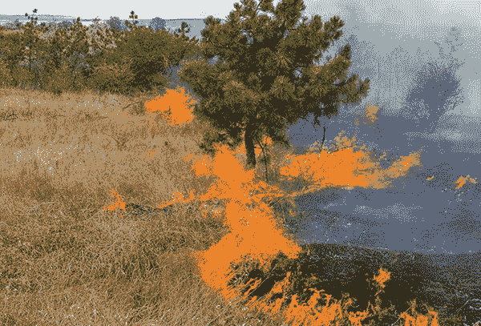
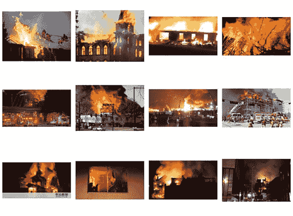
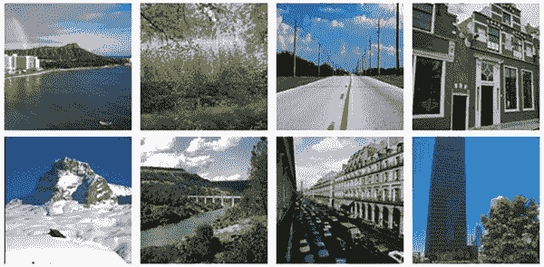
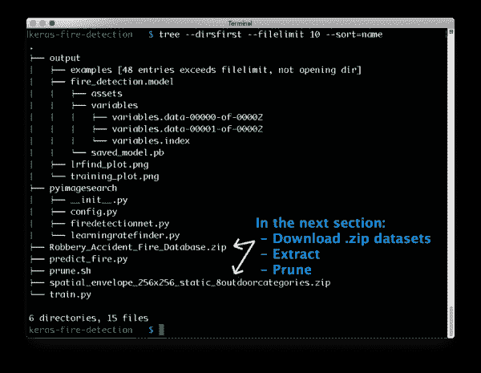
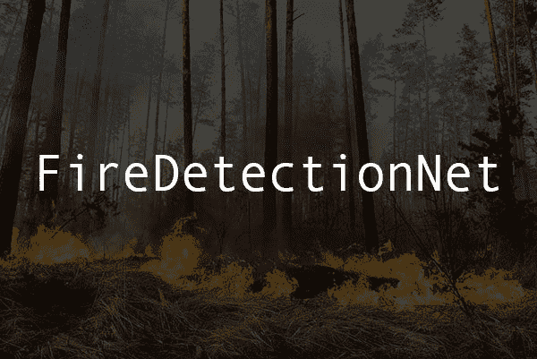
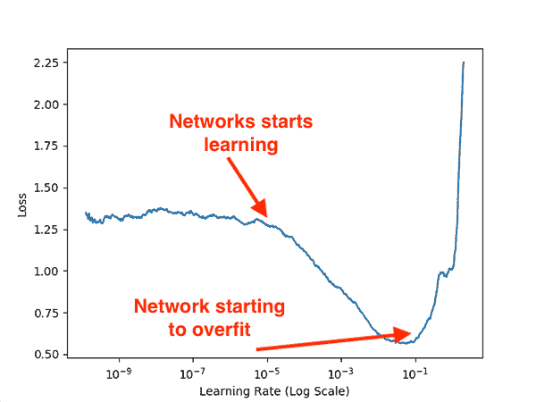
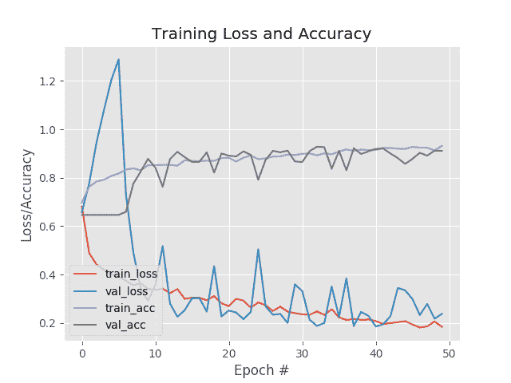
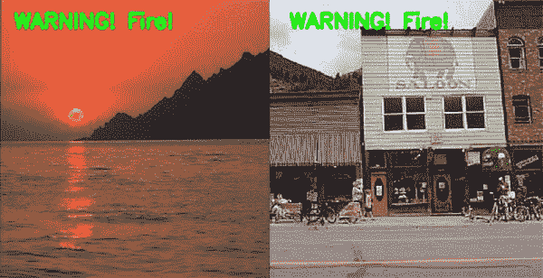

# 使用 Keras 和深度学习进行火灾和烟雾检测

> 原文：<https://pyimagesearch.com/2019/11/18/fire-and-smoke-detection-with-keras-and-deep-learning/>


在本教程中，您将学习如何使用计算机视觉、OpenCV 和 Keras 深度学习库来检测火灾和烟雾。

今天的教程是受上周我收到的一封来自 PyImageSearch 阅读器丹尼尔的电子邮件的启发。

丹尼尔写道:

> 嗨，阿德里安，我不知道你有没有看到新闻，但我的家乡加利福尼亚州在过去几周已经被野火彻底摧毁了。
> 
> 我家住在洛杉矶地区，离盖蒂大火不太远。很难不担心我们的家和我们的安全。
> 
> 这是一个可怕的情况，它让我思考:
> 
> 你认为计算机视觉可以用来探测野火吗？从人们家中开始的火灾呢？
> 
> 如果你能写一篇关于这个话题的教程，我将不胜感激。我很乐意从中学习，并尽自己的一份力量去帮助别人。

简短的回答是， ***是的*，计算机视觉和深度学习*能用来探测野火吗:***

 **   配备摄像头的物联网/边缘设备可以战略性地部署在山坡、山脊和高海拔地区，自动监控烟雾或火灾迹象。
*   无人机和四轴飞行器可以在容易发生野火的地区上空飞行，战略性地扫描烟雾。
*   卫星可以用来拍摄大面积区域的照片，而计算机视觉和深度学习算法可以处理这些图像，寻找烟雾的迹象。

对于野火来说，这一切都很好，但如果你想监控自己家的烟雾或火灾呢？

**答案是*增加现有的传感器*来帮助火灾/烟雾探测:**

*   现有的烟雾探测器利用**光电传感器**和一个光源来检测光源粒子是否被散射(意味着烟雾存在)。
*   然后你可以在房子周围分布温度传感器来监控每个房间的温度。
*   **摄像机**也可以放在可能起火的地方(厨房、车库等)。).
*   每个单独的传感器可以用来触发警报，或者您可以将传感器信息中继到一个中央集线器，该集线器聚合并分析传感器数据，计算家庭火灾的概率。

不幸的是，说起来容易做起来难。

虽然世界各地有 100 多名计算机视觉/深度学习从业者积极致力于火灾和烟雾探测(包括 [PyImageSearch 大师](https://pyimagesearch.com/pyimagesearch-gurus/)成员、[大卫·波恩](https://www.linkedin.com/in/david-bonn-427449b/))，但这仍然是一个开放式的问题。

也就是说，今天我将帮助你开始烟雾和火灾检测-在本教程结束时，你将拥有一个能够检测图像中火灾的深度学习模型(我甚至包括了我预先训练的模型，以使你立即启动并运行)。

**要了解如何利用计算机视觉、深度学习和 Keras 创建自己的火灾和烟雾探测器，*请继续阅读！***

## 使用 Keras 和深度学习进行火灾和烟雾检测

[](https://pyimagesearch.com/wp-content/uploads/2019/11/keras_fire_detection_wildfire.jpg)

**Figure 1:** Wildfires can quickly become out of control and endanger lives in many parts of the world. In this article, we will learn to conduct fire and smoke detection with Keras and deep learning.

在本教程的第一部分，我们将讨论用于火灾和烟雾探测的两个数据集。

从那里，我们将审查该项目的目录结构，然后实施`FireDetectionNet`，我们将使用 CNN 架构来检测图像/视频中的火灾和烟雾。

接下来，我们将训练我们的火灾探测模型，并分析分类准确性和结果。

我们将通过讨论该方法的一些限制和缺点来结束本教程，包括如何改进和扩展该方法。

### 我们的火灾和烟雾数据集

[](https://pyimagesearch.com/wp-content/uploads/2019/11/keras_fire_detection_dataset.jpg)

**Figure 2:** Today’s fire detection dataset is curated by [Gautam Kumar](https://www.linkedin.com/in/gautam-kumar-65399150/) and pruned by [David Bonn](https://www.linkedin.com/in/david-bonn-427449b/) (both of whom are PyImageSearch readers). We will put the dataset to work with Keras and deep learning to create a fire/smoke detector.

我们将用于火灾和烟雾示例的数据集是由 PyImageSearch 阅读器 [Gautam Kumar](https://www.linkedin.com/in/gautam-kumar-65399150/) 策划的。

瓜塔姆通过[在谷歌图片](https://pyimagesearch.com/2017/12/04/how-to-create-a-deep-learning-dataset-using-google-images/)中搜索与术语*【火】**【烟】*等相关的查询，总共收集了**1315 张图片**。

然而，原始数据集还没有清除无关的、不相关的图像，这些图像与火灾和烟雾不相关(例如，在火灾发生之前的著名建筑的例子)。

同是 PyImageSearch 的读者，[大卫·波恩](https://www.linkedin.com/in/david-bonn-427449b/)，花时间手动浏览火灾/烟雾图像，并识别出那些不应该*包括在内的图像。*

***注意:** *我获取了大卫识别出的无关图像列表，然后创建了一个 shell 脚本将它们从数据集中删除。shell 脚本可以在本教程的 ***【下载】*** 部分找到。**

### 8 场景数据集

[](https://pyimagesearch.com/wp-content/uploads/2019/11/keras_fire_detection_8scenes.jpg)

**Figure 3:** We will combine Gautam’s fire dataset with the [8-scenes](https://people.csail.mit.edu/torralba/code/spatialenvelope/) natural image dataset so that we can classify Fire vs. Non-fire using Keras and deep learning.

我们将用于*非火灾*示例的数据集被称为 [**8 场景**](https://people.csail.mit.edu/torralba/code/spatialenvelope/) ，因为它包含属于八个自然场景类别(全部没有火灾)的**2688 个图像**示例:

1.  海岸
2.  山
3.  森林
4.  空旷地区
5.  街道
6.  市内
7.  高层建筑
8.  公路

该数据集最初是由 Oliva 和 Torralba 在他们 2001 年的论文中策划的， [*模拟场景的形状:空间包络的整体表示。*](https://people.csail.mit.edu/torralba/code/spatialenvelope/)

8 场景数据集是对我们的火/烟数据集的自然补充，因为它描绘了自然场景，因为它们*应该*看起来没有火或烟存在。

虽然这个数据集有 8 个独特的类别，**当我们将它与高塔姆的*火灾*数据集组合时，我们将把它视为一个单一的*非火灾*类别**。

### 项目结构

[](https://pyimagesearch.com/wp-content/uploads/2019/11/keras_fire_detection_tree.png)

**Figure 4:** The project structure for today’s tutorial on fire and smoke detection with deep learning using the Keras/TensorFlow framework.

去拿今天的。使用这篇博文的 ***“下载”*** 部分从源代码和预训练模型中解压。

从那里你可以在你的机器上解压它，你的项目将看起来像图 4 。还有 ***一个例外*** :都不是数据集。zip ( *白色箭头*)将会出现。我们将在下一节的*中下载、提取和删减数据集。*

我们的`output/`目录包含:

*   我们的系列化火灾探测模型。我们今天用 Keras 和深度学习来训练模型。
*   将生成[学习率探测器](https://pyimagesearch.com/2019/08/05/keras-learning-rate-finder/)图，并在培训前检查最佳学习率。
*   培训过程完成后，将生成一个培训历史图。
*   `examples/`子目录将由`predict_fire.py`填充样本图像，这些样本图像将被注释以用于演示和验证目的。

我们的`pyimagesearch`模块包含:

*   我们可定制的配置。
*   `FireDetectionNet`:我们的 Keras 卷积神经网络类，专为探测火灾和烟雾而设计。
*   `LearningRateFinder`:Keras 类，用于协助[寻找深度学习](https://pyimagesearch.com/2019/08/05/keras-learning-rate-finder/)训练的最优学习速率的过程。

项目的根目录包含三个脚本:

*   `prune.sh`:一个简单的 bash 脚本，从 Gautam 的 fire 数据集中删除不相关的图像。
*   `train.py`:我们的 Keras 深度学习训练脚本。该脚本有两种操作模式:(1) [学习率查找器](https://pyimagesearch.com/2019/08/05/keras-learning-rate-finder/)模式，和(2)训练模式。
*   `predict_fire.py`:一个快速而肮脏的脚本，从我们的数据集中采样图像，生成带注释的*火灾/非火灾*图像用于验证。

让我们在下一部分继续准备我们的*火灾/非火灾*数据集。

### 准备我们的*火灾*和*非火灾*组合数据集

准备我们的*火灾*和*非火灾*数据集包括四个步骤:

1.  **步骤#1:** 确保您遵循了*上一节*中的说明，从 ***“下载”*** 部分抓取并解压缩今天的文件。
2.  **步骤#2** :下载并提取火灾/烟雾数据集到项目中。
3.  **步骤#3:** 删除火灾/烟雾数据集中无关的无关文件。
4.  **步骤#4:** 下载并提取 8 场景数据集到项目中。

**步骤#2-4** 的结果将是包含两个类的数据集:

*   *火*
*   *非火灾*

组合数据集是我经常使用的一种策略。它节省了宝贵的时间，并经常导致一个伟大的模型。

让我们开始将合并的数据集放在一起。

**步骤#2** :下载并提取火灾/烟雾数据集到项目中。

**[使用此链接](https://drive.google.com/file/d/11KBgD_W2yOxhJnUMiyBkBzXDPXhVmvCt/view?usp=sharing)下载火灾/烟雾数据集。**商店。压缩在上一节中提取的`keras-fire-detection/`项目目录。

下载后，解压缩数据集:

```py
$ unzip Robbery_Accident_Fire_Database2.zip

```

**第三步:**删除数据集中无关的文件。

执行`prune.sh`脚本，从 fire 数据集中删除无关的文件:

```py
$ sh prune.sh

```

至此，我们有了*火*的数据。现在我们需要*非火灾*数据来解决我们的两类问题。

**步骤#4:** 下载并提取 8 场景数据集到项目中。

[**使用此链接**](https://people.csail.mit.edu/torralba/code/spatialenvelope/spatial_envelope_256x256_static_8outdoorcategories.zip) **下载 8 场景数据集。**存储。在 *Fire* 数据集旁边的`keras-fire-detection/`项目目录中压缩。

下载完成后，导航到项目文件夹并取消归档数据集:

```py
$ unzip spatial_envelope_256x256_static_8outdoorcategories.zip

```

**审查项目+数据集结构**

此时，是时候再次检查我们的目录结构了。你的应该和我的一样:

```py
$ tree --dirsfirst --filelimit 10
.
├── Robbery_Accident_Fire_Database2
│   ├── Accident [887 entries]
│   ├── Fire [1315 entries]
│   ├── Robbery [2073 entries]
│   └── readme.txt
├── spatial_envelope_256x256_static_8outdoorcategories [2689 entries]
├── output
│   ├── examples [48 entries]
│   ├── fire_detection.model
│   │   ├── assets
│   │   ├── variables
│   │   │   ├── variables.data-00000-of-00002
│   │   │   ├── variables.data-00001-of-00002
│   │   │   └── variables.index
│   │   └── saved_model.pb
│   ├── lrfind_plot.png
│   └── training_plot.png
├── pyimagesearch
│   ├── __init__.py
│   ├── config.py
│   ├── firedetectionnet.py
│   └── learningratefinder.py
├── Robbery_Accident_Fire_Database.zip
├── spatial_envelope_256x256_static_8outdoorcategories.zip
├── prune.sh
├── train.py
└── predict_fire.py

11 directories, 16 files

```

确保您的数据集被修剪过(即`Fire/`目录应该正好有**1315 个条目**和*而不是*之前的 1405 个条目)。

### 我们的配置文件

这个项目将跨越需要执行的多个 Python 文件，所以让我们将所有重要的变量存储在一个单独的`config.py`文件中。

现在打开`config.py`并插入以下代码:

```py
# import the necessary packages
import os

# initialize the path to the fire and non-fire dataset directories
FIRE_PATH = os.path.sep.join(["Robbery_Accident_Fire_Database2",
	"Fire"])
NON_FIRE_PATH = "spatial_envelope_256x256_static_8outdoorcategories"

# initialize the class labels in the dataset
CLASSES = ["Non-Fire", "Fire"]

```

我们将使用`os`模块来合并路径(**行 2** )。

**第 5-7 行**包含到我们的(1) *火灾*图像和(2) *非火灾*图像的路径。

**第 10 行**是我们两个类名的列表。

让我们设置一些培训参数:

```py
# define the size of the training and testing split
TRAIN_SPLIT = 0.75
TEST_SPLIT = 0.25

# define the initial learning rate, batch size, and number of epochs
INIT_LR = 1e-2
BATCH_SIZE = 64
NUM_EPOCHS = 50

```

**第 13 行和第 14 行**定义了我们的训练和测试数据集分割的大小。

**第 17-19 行**包含三个超参数——初始学习率、批量大小和训练的时期数。

从这里开始，我们将定义几条路径:

```py
# set the path to the serialized model after training
MODEL_PATH = os.path.sep.join(["output", "fire_detection.model"])

# define the path to the output learning rate finder plot and
# training history plot
LRFIND_PLOT_PATH = os.path.sep.join(["output", "lrfind_plot.png"])
TRAINING_PLOT_PATH = os.path.sep.join(["output", "training_plot.png"])

```

**第 22-27 行**包括以下路径:

*   我们尚待训练的系列火灾探测模型。
*   [学习率探测器](https://pyimagesearch.com/2019/08/05/keras-learning-rate-finder/)图，我们将对其进行分析，以设置我们的初始学习率。
*   训练精度/损失历史图。

为了总结我们的配置，我们将定义预测抽查的设置:

```py
# define the path to the output directory that will store our final
# output with labels/annotations along with the number of images to
# sample
OUTPUT_IMAGE_PATH = os.path.sep.join(["output", "examples"])
SAMPLE_SIZE = 50

```

我们的预测脚本将使用我们的模型对图像进行采样和注释。

**第 32 行和第 33 行**包括输出目录的路径，我们将在那里存储输出分类结果和要采样的图像数量。

### 实现我们的火灾探测卷积神经网络

[](https://pyimagesearch.com/wp-content/uploads/2019/11/keras_fire_detection_arch.jpg)

**Figure 5:** `FireDetectionNet` is a deep learning fire/smoke classification network built with the Keras deep learning framework.

在这一节中，我们将实现`FireDetectionNet`，这是一个卷积神经网络，用于检测图像中的烟雾和火灾。

该网络利用**深度方向可分离卷积**而不是标准卷积作为深度方向可分离卷积:

*   **更高效，**因为边缘/物联网设备的 CPU 和功耗有限。
*   **需要更少的内存，**同样，Edge/IoT 设备的 RAM 有限。
*   **需要更少的计算，**因为我们的 CPU 能力有限。
*   在某些情况下，**可以比标准卷积执行得更好，**可以产生更好的火灾/烟雾探测器。

现在让我们开始实现`FireDetectioNet`——现在打开`firedetectionnet.py`文件并插入以下代码:

```py
# import the necessary packages
from tensorflow.keras.models import Sequential
from tensorflow.keras.layers import BatchNormalization
from tensorflow.keras.layers import SeparableConv2D
from tensorflow.keras.layers import MaxPooling2D
from tensorflow.keras.layers import Activation
from tensorflow.keras.layers import Flatten
from tensorflow.keras.layers import Dropout
from tensorflow.keras.layers import Dense

class FireDetectionNet:
	@staticmethod
	def build(width, height, depth, classes):
		# initialize the model along with the input shape to be
		# "channels last" and the channels dimension itself
		model = Sequential()
		inputShape = (height, width, depth)
		chanDim = -1

```

我们的 [TensorFlow 2.0](https://pyimagesearch.com/2019/10/21/keras-vs-tf-keras-whats-the-difference-in-tensorflow-2-0/) Keras 进口横跨**2-9 线**。我们将使用 [Keras 的顺序 API](https://pyimagesearch.com/2019/10/28/3-ways-to-create-a-keras-model-with-tensorflow-2-0-sequential-functional-and-model-subclassing/) 来构建我们的火灾探测 CNN。

**第 11 行**定义了我们的`FireDetectionNet`类。我们从定义第 13 行的**方法开始。**

`build`方法接受的参数包括我们图像的尺寸(`width`、`height`、`depth`)以及我们将训练模型识别的`classes`的数量(即该参数影响 softmax 分类器的头部形状)。

然后我们初始化`model`和`inputShape` ( **第 16-18 行**)。

从这里开始，我们将定义第一组`CONV => RELU => POOL`层:

```py
		# CONV => RELU => POOL
		model.add(SeparableConv2D(16, (7, 7), padding="same",
			input_shape=inputShape))
		model.add(Activation("relu"))
		model.add(BatchNormalization(axis=chanDim))
		model.add(MaxPooling2D(pool_size=(2, 2)))

```

这些层使用较大的内核大小，以便(1)更快地减少输入体积空间维度，以及(2)检测包含火焰的较大颜色斑点。

然后我们将定义更多的`CONV => RELU => POOL`层集合:

```py
		# CONV => RELU => POOL
		model.add(SeparableConv2D(32, (3, 3), padding="same"))
		model.add(Activation("relu"))
		model.add(BatchNormalization(axis=chanDim))
		model.add(MaxPooling2D(pool_size=(2, 2)))

		# (CONV => RELU) * 2 => POOL
		model.add(SeparableConv2D(64, (3, 3), padding="same"))
		model.add(Activation("relu"))
		model.add(BatchNormalization(axis=chanDim))
		model.add(SeparableConv2D(64, (3, 3), padding="same"))
		model.add(Activation("relu"))
		model.add(BatchNormalization(axis=chanDim))
		model.add(MaxPooling2D(pool_size=(2, 2)))

```

**第 34-40 行**允许我们的模型在应用一个`POOL`之前通过堆叠*两个*组`CONV => RELU`来学习更丰富的特性。

从这里开始，我们将创建全连接的网络负责人:

```py
		# first set of FC => RELU layers
		model.add(Flatten())
		model.add(Dense(128))
		model.add(Activation("relu"))
		model.add(BatchNormalization())
		model.add(Dropout(0.5))

		# second set of FC => RELU layers
		model.add(Dense(128))
		model.add(Activation("relu"))
		model.add(BatchNormalization())
		model.add(Dropout(0.5))

		# softmax classifier
		model.add(Dense(classes))
		model.add(Activation("softmax"))

		# return the constructed network architecture
		return model

```

**第 43-53 行**增加两组`FC => RELU`图层。

**行 56 和 57** 在**行 60** 返回`model`之前添加我们的 Softmax 分类器。

### 创建我们的培训脚本

我们的培训脚本将负责:

1.  从磁盘加载我们的*火灾*和*非火灾*组合数据集。
2.  实例化我们的`FireDetectionNet`架构。
3.  [通过使用我们的`LearningRateFinder`类找到我们的最佳学习率](https://pyimagesearch.com/2019/08/05/keras-learning-rate-finder/)。
4.  采用最佳的学习速率，并为所有的时代训练我们的网络。

我们开始吧！

打开目录结构中的`train.py`文件，插入以下代码:

```py
# set the matplotlib backend so figures can be saved in the background
import matplotlib
matplotlib.use("Agg")

# import the necessary packages
from tensorflow.keras.preprocessing.image import ImageDataGenerator
from tensorflow.keras.optimizers import SGD
from tensorflow.keras.utils import to_categorical
from sklearn.model_selection import train_test_split
from sklearn.metrics import classification_report
from pyimagesearch.learningratefinder import LearningRateFinder
from pyimagesearch.firedetectionnet import FireDetectionNet
from pyimagesearch import config
from imutils import paths
import matplotlib.pyplot as plt
import numpy as np
import argparse
import cv2
import sys

```

**第 1-19 行**处理我们的进口:

*   `matplotlib`:用 Python 生成图。**第 3 行**设置后端，这样我们可以将我们的绘图保存为图像文件。
*   `tensorflow.keras`:我们的 [TensorFlow 2.0 导入了](https://pyimagesearch.com/2019/10/21/keras-vs-tf-keras-whats-the-difference-in-tensorflow-2-0/)，包括数据增强、随机梯度下降优化器和一键标签编码器。
*   `sklearn`:数据集拆分和分类报告的两次导入。
*   `LearningRateFinder`:在培训之前，我们将使用该类来寻找最佳学习率*。当我们在这种模式下运行我们的脚本时，它将为我们生成一个图，以便(1)手动检查和(2)将最佳学习率插入到我们的配置文件中。*
*   `FireDetectionNet`:我们在上一节构建的火/烟卷积神经网络(CNN)。
*   `config`:我们对该训练脚本的设置的配置文件(它也包含我们对预测脚本的设置)。
*   `paths`:包含我的 [imutils](https://github.com/jrosebr1/imutils) 包中的函数，用于在目录树中列出图像。
*   `argparse`:用于[解析命令行参数](https://pyimagesearch.com/2018/03/12/python-argparse-command-line-arguments/)标志。
*   `cv2` : OpenCV 用于加载和预处理图像。

现在我们已经导入了包，让我们定义一个可重用的函数来加载我们的数据集:

```py
def load_dataset(datasetPath):
	# grab the paths to all images in our dataset directory, then
	# initialize our lists of images
	imagePaths = list(paths.list_images(datasetPath))
	data = []

	# loop over the image paths
	for imagePath in imagePaths:
		# load the image and resize it to be a fixed 128x128 pixels,
		# ignoring aspect ratio
		image = cv2.imread(imagePath)
		image = cv2.resize(image, (128, 128))

		# add the image to the data lists
		data.append(image)

	# return the data list as a NumPy array
	return np.array(data, dtype="float32")

```

我们的`load_dataset`助手功能协助加载、预处理和准备*火灾*和*非火灾*数据集。

**第 21 行**定义了接受数据集路径的函数。

**第 24 行**抓取数据集中的所有图像路径。

**第 28-35 行**在`imagePaths`上循环。图像被加载，调整到 *128×128* 的尺寸，并添加到`data`列表中。

**第 38 行**返回 NumPy 数组格式的`data`。

我们现在将解析一个命令行参数:

```py
# construct the argument parser and parse the arguments
ap = argparse.ArgumentParser()
ap.add_argument("-f", "--lr-find", type=int, default=0,
	help="whether or not to find optimal learning rate")
args = vars(ap.parse_args())

```

`--lr-find`标志为我们的脚本设置模式。如果标志设置为`1`，那么我们将进入学习率查找模式，生成学习率图供我们检查。否则，我们的脚本将在训练模式下运行，并为整个历元集训练网络(即当`--lr-find`标志不存在时)。

现在让我们开始加载我们的`data`:

```py
# load the fire and non-fire images
print("[INFO] loading data...")
fireData = load_dataset(config.FIRE_PATH)
nonFireData = load_dataset(config.NON_FIRE_PATH)

# construct the class labels for the data
fireLabels = np.ones((fireData.shape[0],))
nonFireLabels = np.zeros((nonFireData.shape[0],))

# stack the fire data with the non-fire data, then scale the data
# to the range [0, 1]
data = np.vstack([fireData, nonFireData])
labels = np.hstack([fireLabels, nonFireLabels])
data /= 255

```

**第 48 和 49 行**加载并调整*火灾*和*非火灾*图像。

**第 52 行和第 53 行**为两个类别构造标签(`1`表示*火灾*， `0`表示*非火灾*)。

随后，我们通过**行 57 和 58** 将`data`和`labels`堆叠成单个 NumPy 数组(即组合数据集)。

**第 59 行**将像素强度缩放到范围*【0，1】*。

我们还有三个步骤来准备数据:

```py
# perform one-hot encoding on the labels and account for skew in the
# labeled data
labels = to_categorical(labels, num_classes=2)
classTotals = labels.sum(axis=0)
classWeight = classTotals.max() / classTotals

# construct the training and testing split
(trainX, testX, trainY, testY) = train_test_split(data, labels,
	test_size=config.TEST_SPLIT, random_state=42)

```

首先，我们在我们的`labels` ( **行 63** )上执行一次热编码。

然后，我们 ***在我们的数据集*** ( **行 64 和 65** )中说明了偏斜。为此，在梯度更新期间，我们计算`classWeight`来加权*火*图像多于*非火*图像(因为我们拥有比*非火*图像多两倍的**火** *图像)。*

**第 68 行和第 69 行**基于我们的配置构建训练和测试分割(在我的配置中，我将分割设置为 75%训练/25%测试)。

接下来，我们将初始化数据扩充并编译我们的`FireDetectionNet`模型:

```py
# initialize the training data augmentation object
aug = ImageDataGenerator(
	rotation_range=30,
	zoom_range=0.15,
	width_shift_range=0.2,
	height_shift_range=0.2,
	shear_range=0.15,
	horizontal_flip=True,
	fill_mode="nearest")

# initialize the optimizer and model
print("[INFO] compiling model...")
opt = SGD(lr=config.INIT_LR, momentum=0.9,
	decay=config.INIT_LR / config.NUM_EPOCHS)
model = FireDetectionNet.build(width=128, height=128, depth=3,
	classes=2)
model.compile(loss="binary_crossentropy", optimizer=opt,
	metrics=["accuracy"])

```

第 74-79 行实例化我们的[数据扩充](https://pyimagesearch.com/2019/07/08/keras-imagedatagenerator-and-data-augmentation/)对象。

我们然后`build`和`compile`我们的`FireDetectionNet`模型(**第 83-88 行**)。注意，我们的初始学习率和衰减是在初始化我们的`SGD`优化器时设置的。

让我们来处理我们的 **[学习率探测器](https://pyimagesearch.com/2019/08/05/keras-learning-rate-finder/)模式:**

```py
# check to see if we are attempting to find an optimal learning rate
# before training for the full number of epochs
if args["lr_find"] > 0:
	# initialize the learning rate finder and then train with learning
	# rates ranging from 1e-10 to 1e+1
	print("[INFO] finding learning rate...")
	lrf = LearningRateFinder(model)
	lrf.find(
		aug.flow(trainX, trainY, batch_size=config.BATCH_SIZE),
		1e-10, 1e+1,
		stepsPerEpoch=np.ceil((trainX.shape[0] / float(config.BATCH_SIZE))),
		epochs=20,
		batchSize=config.BATCH_SIZE,
		classWeight=classWeight)

	# plot the loss for the various learning rates and save the
	# resulting plot to disk
	lrf.plot_loss()
	plt.savefig(config.LRFIND_PLOT_PATH)

	# gracefully exit the script so we can adjust our learning rates
	# in the config and then train the network for our full set of
	# epochs
	print("[INFO] learning rate finder complete")
	print("[INFO] examine plot and adjust learning rates before training")
	sys.exit(0)

```

第 92 行检查我们是否应该尝试找到最佳学习率。假设如此，我们:

*   初始化`LearningRateFinder` ( **第 96 行**)。
*   以`1e-10`的学习率开始训练，并以指数方式增加，直到我们达到`1e+1` ( **第 97-103 行**)。
*   绘制损失与学习率的关系图，并保存结果数字(**第 107 行和第 108 行**)。
*   优雅地向用户打印几条消息后的脚本(**第 115 行**)。

在这段代码执行之后，我们现在需要:

1.  **步骤#1:** 手动检查生成的学习率图。
2.  **步骤#2:** 用我们的`INIT_LR`(即我们通过分析情节确定的最优学习率)更新`config.py`。
3.  **步骤#3:** 在我们的完整数据集上训练网络。

假设我们已经完成了**步骤#1** 和**步骤#2** ，现在让我们处理**步骤#3** ，其中我们的初始学习率已经在配置中确定并更新。在这种情况下，是时候在我们的脚本中处理**训练模式**了:

```py
# train the network
print("[INFO] training network...")
H = model.fit_generator(
	aug.flow(trainX, trainY, batch_size=config.BATCH_SIZE),
	validation_data=(testX, testY),
	steps_per_epoch=trainX.shape[0] // config.BATCH_SIZE,
	epochs=config.NUM_EPOCHS,
	class_weight=classWeight,
	verbose=1)

```

**第 119-125 行**使用数据扩充和我们的倾斜数据集类别加权来训练我们的火灾探测`model`。一定要[复习我的`.fit_generator`教程](https://pyimagesearch.com/2018/12/24/how-to-use-keras-fit-and-fit_generator-a-hands-on-tutorial/)。

最后，我们将评估模型，将其序列化到磁盘，并绘制培训历史:

```py
# evaluate the network and show a classification report
print("[INFO] evaluating network...")
predictions = model.predict(testX, batch_size=config.BATCH_SIZE)
print(classification_report(testY.argmax(axis=1),
	predictions.argmax(axis=1), target_names=config.CLASSES))

# serialize the model to disk
print("[INFO] serializing network to '{}'...".format(config.MODEL_PATH))
model.save(config.MODEL_PATH)

# construct a plot that plots and saves the training history
N = np.arange(0, config.NUM_EPOCHS)
plt.style.use("ggplot")
plt.figure()
plt.plot(N, H.history["loss"], label="train_loss")
plt.plot(N, H.history["val_loss"], label="val_loss")
plt.plot(N, H.history["accuracy"], label="train_acc")
plt.plot(N, H.history["val_accuracy"], label="val_acc")
plt.title("Training Loss and Accuracy")
plt.xlabel("Epoch #")
plt.ylabel("Loss/Accuracy")
plt.legend(loc="lower left")
plt.savefig(config.TRAINING_PLOT_PATH)

```

**129-131 行**对测试数据进行预测，并在我终端打印分类报告。

**第 135 行**序列化`model`并保存到磁盘。我们将在预测脚本中回忆这个模型。

**第 138-149 行**生成了训练期间准确度/损失曲线的历史图。我们将检查这块地是否过度拟合或拟合不足。

### 用 Keras 训练火灾探测模型

培训我们的火灾探测模型分为三个步骤:

1.  **步骤#1:** 运行带有`--lr-find`命令行参数的`train.py`脚本，找到我们的最佳学习率。
2.  **步骤#2:** 更新我们配置文件(`config.py`)的**第 17 行**，将我们的`INIT_LR`值设置为最优学习率。
3.  **步骤#3:** 再次执行`train.py`脚本，但是这次让它为全套纪元进行训练。

首先使用本教程的 ***【下载】*** 部分将源代码下载到本教程中。

在那里，您可以通过执行以下命令来执行**步骤#1** :

```py
$ python train.py --lr-find 1
[INFO] loading data...
[INFO] finding learning rate...
Epoch 1/20
47/47 [==============================] - 10s 221ms/step - loss: 1.2949 - accuracy: 0.4923
Epoch 2/20
47/47 [==============================] - 11s 228ms/step - loss: 1.3315 - accuracy: 0.4897
Epoch 3/20
47/47 [==============================] - 10s 218ms/step - loss: 1.3409 - accuracy: 0.4860
Epoch 4/20
47/47 [==============================] - 10s 215ms/step - loss: 1.3973 - accuracy: 0.4770
Epoch 5/20
47/47 [==============================] - 10s 219ms/step - loss: 1.3170 - accuracy: 0.4957
...
Epoch 15/20
47/47 [==============================] - 10s 216ms/step - loss: 0.5097 - accuracy: 0.7728
Epoch 16/20
47/47 [==============================] - 10s 217ms/step - loss: 0.5507 - accuracy: 0.7345
Epoch 17/20
47/47 [==============================] - 10s 220ms/step - loss: 0.7554 - accuracy: 0.7089
Epoch 18/20
47/47 [==============================] - 10s 220ms/step - loss: 1.1833 - accuracy: 0.6606
Epoch 19/20
37/47 [======================>.......] - ETA: 2s - loss: 3.1446 - accuracy: 0.6338
[INFO] learning rate finder complete
[INFO] examine plot and adjust learning rates before training

```

[](https://pyimagesearch.com/wp-content/uploads/2019/11/keras_fire_detection_lrfind.png)

**Figure 6:** Analyzing our optimal deep learning rate finder plot. We will use the optimal learning rate to train a fire/smoke detector using Keras and Python.

检查上面的**图 6** ，你可以看到我们的网络能够获得牵引力，并在`1e-5`左右开始学习。

在`1e-2`和`1e-1`之间可以找到最低损耗；然而，在`1e-1`我们可以看到损耗开始急剧增加，这意味着学习速率*太大*和网络*过度拟合。*

**为了安全起见，我们应该使用初始学习率`1e-2`。**

现在让我们继续进行第二步。

打开`config.py`并滚动到**第 16-19 行**，在这里我们设置我们的训练超参数:

```py
# define the initial learning rate, batch size, and number of epochs
INIT_LR = 1e-2
BATCH_SIZE = 64
NUM_EPOCHS = 50

```

这里我们看到我们的初始学习率(`INIT_LR`)值——我们需要将这个值设置为`1e-2`(如我们的代码所示)。

最后一步(**步骤#3** )是为全套`NUM_EPOCHS`训练`FireDetectionNet`:

```py
$ python train.py
[INFO] loading data...
[INFO] compiling model...
[INFO] training network...
Epoch 1/50
46/46 [==============================] - 11s 233ms/step - loss: 0.6813 - accuracy: 0.6974 - val_loss: 0.6583 - val_accuracy: 0.6464
Epoch 2/50
46/46 [==============================] - 11s 232ms/step - loss: 0.4886 - accuracy: 0.7631 - val_loss: 0.7774 - val_accuracy: 0.6464
Epoch 3/50
46/46 [==============================] - 10s 224ms/step - loss: 0.4414 - accuracy: 0.7845 - val_loss: 0.9470 - val_accuracy: 0.6464
Epoch 4/50
46/46 [==============================] - 10s 222ms/step - loss: 0.4193 - accuracy: 0.7917 - val_loss: 1.0790 - val_accuracy: 0.6464
Epoch 5/50
46/46 [==============================] - 10s 224ms/step - loss: 0.4015 - accuracy: 0.8070 - val_loss: 1.2034 - val_accuracy: 0.6464
...
Epoch 46/50
46/46 [==============================] - 10s 222ms/step - loss: 0.1935 - accuracy: 0.9275 - val_loss: 0.2985 - val_accuracy: 0.8781
Epoch 47/50
46/46 [==============================] - 10s 221ms/step - loss: 0.1812 - accuracy: 0.9244 - val_loss: 0.2325 - val_accuracy: 0.9031
Epoch 48/50
46/46 [==============================] - 10s 226ms/step - loss: 0.1857 - accuracy: 0.9241 - val_loss: 0.2788 - val_accuracy: 0.8911
Epoch 49/50
46/46 [==============================] - 11s 229ms/step - loss: 0.2065 - accuracy: 0.9129 - val_loss: 0.2177 - val_accuracy: 0.9121
Epoch 50/50
46/46 [==============================] - 63s 1s/step - loss: 0.1842 - accuracy: 0.9316 - val_loss: 0.2376 - val_accuracy: 0.9111
[INFO] evaluating network...
              precision    recall  f1-score   support

    Non-Fire       0.96      0.90      0.93       647
        Fire       0.83      0.94      0.88       354

    accuracy                           0.91      1001
   macro avg       0.90      0.92      0.91      1001
weighted avg       0.92      0.91      0.91      1001

[INFO] serializing network to 'output/fire_detection.model'...

```

[](https://pyimagesearch.com/wp-content/uploads/2019/11/training_plot-1.png)

**Figure 7:** Accuracy/loss curves for training a fire and smoke detection deep learning model with Keras and Python.

这里的学习有点不稳定，但是你可以看到我们获得了 92%的准确率。

### 对火灾/非火灾图像进行预测

给定我们训练有素的火灾探测模型，现在让我们学习如何:

1.  从磁盘加载训练好的模型。
2.  从我们的数据集中随机抽取图像样本。
3.  使用我们的模型对每个输入图像进行分类。

打开`predict_fire.py`并插入以下代码:

```py
# import the necessary packages
from tensorflow.keras.models import load_model
from pyimagesearch import config
from imutils import paths
import numpy as np
import imutils
import random
import cv2
import os

# load the trained model from disk
print("[INFO] loading model...")
model = load_model(config.MODEL_PATH)

```

**第 2-9 行**处理我们的导入，即`load_model`，这样我们可以从磁盘加载我们序列化的 TensorFlow/Keras 模型。

让我们从合并的数据集中抓取 25 张随机图像:

```py
# grab the paths to the fire and non-fire images, respectively
print("[INFO] predicting...")
firePaths = list(paths.list_images(config.FIRE_PATH))
nonFirePaths = list(paths.list_images(config.NON_FIRE_PATH))

# combine the two image path lists, randomly shuffle them, and sample
# them
imagePaths = firePaths + nonFirePaths
random.shuffle(imagePaths)
imagePaths = imagePaths[:config.SAMPLE_SIZE]

```

**第 17 行和第 18 行**从我们的组合数据集中抓取图像路径，而**第 22-24 行**对 25 个随机图像路径进行采样。

从这里开始，我们将遍历每个单独的图像路径，并执行火灾探测推断:

```py
# loop over the sampled image paths
for (i, imagePath) in enumerate(imagePaths):
	# load the image and clone it
	image = cv2.imread(imagePath)
	output = image.copy()

	# resize the input image to be a fixed 128x128 pixels, ignoring
	# aspect ratio
	image = cv2.resize(image, (128, 128))
	image = image.astype("float32") / 255.0

	# make predictions on the image
	preds = model.predict(np.expand_dims(image, axis=0))[0]
	j = np.argmax(preds)
	label = config.CLASSES[j]

	# draw the activity on the output frame
	text = label if label == "Non-Fire" else "WARNING! Fire!"
	output = imutils.resize(output, width=500)
	cv2.putText(output, text, (35, 50), cv2.FONT_HERSHEY_SIMPLEX,
		1.25, (0, 255, 0), 5)

	# write the output image to disk	 
	filename = "{}.png".format(i)
	p = os.path.sep.join([config.OUTPUT_IMAGE_PATH, filename])
	cv2.imwrite(p, output)

```

**第 27 行**开始在我们采样的图像路径上循环:

*   我们加载并预处理图像，就像在训练中一样(**第 29-35 行**)。
*   做预测，抓住概率最高的标签(**第 38-40 行**)。
*   在图像的顶角标注标签(**第 43-46 行**)。
*   将输出图像保存到磁盘(**第 49-51 行**)。

### 火灾探测结果

要查看我们的火灾探测器，请确保使用本教程的 ***“下载”*** 部分下载源代码和预训练模型。

从那里，您可以执行以下命令:

```py
$ python predict_fire.py
[INFO] loading model...
[INFO] predicting...

```


**Figure 8:** Fire and smoke detection with Keras, deep learning, and Python.

我在**图 8** 中包含了一组结果样本——请注意我们的模型如何能够正确预测其中的*【着火】*和*【非着火】*。

### 局限性和缺点

然而，我们的结果并不完美。以下是一些不正确分类的例子:

[](https://pyimagesearch.com/wp-content/uploads/2019/11/keras_fire_detection_incorrect.jpg)

**Figure 9:** Examples of incorrect fire/smoke detection.

左边*的图像尤其令人不安——夕阳将红色和橙色的阴影投射在天空，创造出“地狱”般的效果。似乎在这些情况下，我们的火灾探测模型将会非常困难。*

那么，为什么会有这些不正确的分类呢？

答案就在数据集本身。

首先，我们只处理原始图像数据。

随着火灾以闷烧的形式开始，慢慢发展到临界点，然后爆发成巨大的火焰，烟和火可以用**视频**更好地探测。这种模式在视频流中比在图像中更容易检测到。

其次，我们的数据集非常小。

结合这两个数据集，我们总共只有 4003 张图像。火灾和烟雾数据集很难获得，这使得创建高精度模型极具挑战性。

最后，我们的数据集不一定能代表问题。

我们的火灾/烟雾数据集中的许多示例图像包含由新闻报道捕获的专业照片的示例。野外的火看起来不像这样。

为了改进我们的火灾和烟雾探测模型，我们需要更好的数据。

火灾/烟雾探测研究的未来努力应该少*关注实际的深度学习架构/训练方法，多*关注实际的数据集收集和管理过程，**确保数据集更好地代表火灾如何在自然场景图像中开始、阴燃和蔓延。****

### 摘要

在本教程中，您学习了如何使用计算机视觉、深度学习和 Keras 库来创建烟雾和火灾探测器。

为了构建我们的烟雾和火灾探测器，我们利用了两个数据集:

*   由 PyImageSearch 阅读器 [Gautam Kumar](https://www.linkedin.com/in/gautam-kumar-65399150/) 管理的火/烟实例数据集(1315 张图片)。
*   **无火/无烟示例数据集** (2，688 张图像)，包含 8 个自然户外场景的示例(森林、海岸线、山脉、野外等)。).这个数据集最初是由 Oliva 和 Torralba 在他们 2001 年的论文 [*中收集的，该论文对场景的形状进行建模:空间包络*](https://people.csail.mit.edu/torralba/code/spatialenvelope/) *的整体表示。*

然后我们设计了一个`FireDetectionNet`——一个用于烟雾和火灾探测的卷积神经网络。这个网络是在我们的两个数据集上训练的。一旦我们的网络被训练，我们在我们的测试集上评估它，发现它获得了 92%的准确率。

然而，这种方法有许多限制和缺点:

*   首先，我们只处理图像数据。通过视频可以更好地检测烟雾和火灾，因为火灾开始时是闷烧，慢慢发展到临界点，然后爆发成巨大的火焰。
*   其次，我们的数据集很小。结合这两个数据集，我们总共只有 4，003 张图像。火灾和烟雾数据集很难获得，这使得创建高精度模型极具挑战性。

基于上一点，我们的数据集不一定代表这个问题。我们的火灾/烟雾数据集中的许多示例图像都是由新闻报道捕获的专业照片。野外的火看起来不像这样。

重点是:

**火灾和烟雾探测*是*一个可解决的问题……*但是我们需要更好的数据集。***

幸运的是， [PyImageSearch Gurus](https://pyimagesearch.com/pyimagesearch-gurus/) 成员[大卫·波恩](https://www.linkedin.com/in/david-bonn-427449b/)正在积极解决这个问题，并在 PyImageSearch Gurus 社区论坛上讨论这个问题。如果你有兴趣了解他的项目，一定要联系他。

我希望你喜欢这个教程！

**要下载这篇文章的源代码(并在 PyImageSearch 上发布以后的教程时得到通知)，*只需在下面的表格中输入您的电子邮件地址。****