# 引导深度做梦产生艺术。

> 原文：<https://pyimagesearch.com/2015/07/13/generating-art-with-guided-deep-dreaming/>

[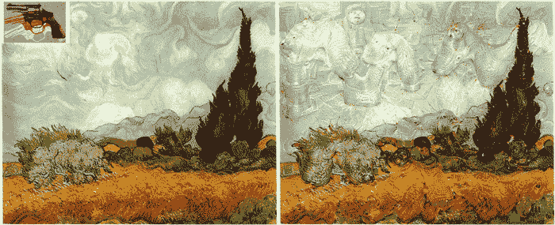](https://pyimagesearch.com/wp-content/uploads/2015/07/van_gogh_animated.gif)

用于深度做梦和可视化的 [bat-country Python 包](https://pyimagesearch.com/2015/07/06/bat-country-an-extendible-lightweight-python-package-for-deep-dreaming-with-caffe-and-convolutional-neural-networks/)的主要好处之一是它的易用性、可扩展性和可定制性。

让我告诉你，定制 ***在上周五*** 真的派上了用场，当时谷歌研究团队[发布了他们深度梦想作品](https://plus.google.com/+ResearchatGoogle/posts/NoBnPqwq3wh)的更新，展示了一种“引导”你的输入图像可视化目标图像特征的方法。

结果相当令人印象深刻，所以我决定将这个功能移植到 bat-country。

说实话，从开始到结束只花了大约 20 分钟就把代码编好了。老实说，与更新代码库相比，我花了更多的时间运行 Python 脚本来收集示例图像和更新文档。

这种快速转变的秘密在于`BatCountry`类的可扩展性，其中几乎*每个函数和每个方法都可以被覆盖和扩展*。

想要更改每个图像的预处理或后处理方式？没问题。定义您自己的自定义处理器并将其传入。想改变目标函数？再说一遍，只要确定你自己的目标，你就可以开始了。

事实上，定义你自己的定制目标函数是我在扩展`bat-country`时所走的*精确路线*。我简单地定义了一个新的目标函数，允许进一步定制阶跃函数，我们就完成了！

在这篇博客文章的剩余部分，我们将玩新的[蝙蝠国](https://github.com/jrosebr1/bat-country/)更新来执行引导做梦——***，甚至使用它来生成我们自己的艺术使用引导深度做梦！***

# 引导深度做梦

上周五，谷歌研究团队发布了他们深度做梦工作的更新，展示了通过提供*种子图像*来*指导*你的做梦过程是可能的。这种方法以类似的方式通过网络传递您的输入图像，但这次使用您的种子图像来引导和影响输出。

使用`bat-country`，进行引导做梦和深度做梦一样简单。下面是一些快速示例代码:

```py
# import the necessary packages
from batcountry import BatCountry
from PIL import Image
import numpy as np
import argparse

# construct the argument parser and parse the arguments
ap = argparse.ArgumentParser()
ap.add_argument("-b", "--base-model", required=True, help="base model path")
ap.add_argument("-l", "--layer", type=str, default="inception_4c/output",
	help="layer of CNN to use")
ap.add_argument("-i", "--image", required=True, help="path to base image")
ap.add_argument("-g", "--guide-image", required=True, help="path to guide image")
ap.add_argument("-o", "--output", required=True, help="path to output image")
args = ap.parse_args()

# we can't stop here...
bc = BatCountry(args.base_model)
features = bc.prepare_guide(Image.open(args.guide_image), end=args.layer)
image = bc.dream(np.float32(Image.open(args.image)), end=args.layer,
	iter_n=20, objective_fn=BatCountry.guided_objective,
	objective_features=features)
bc.cleanup()

# write the output image to file
result = Image.fromarray(np.uint8(image))
result.save(args.output)

```

如果你还没有安装`bat-country`，要么从 [GitHub repo](https://github.com/jrosebr1/bat-country/) 中下载代码，要么使用 pip 在你的系统上安装:`pip install bat-country`或`pip install --upgrade bat-country`。你还需要一个可以工作的[咖啡馆](http://caffe.berkeleyvision.org/)。

这种方法的好处是我们可以“引导”输出图像的样子。在这里，我使用文森特·梵高的*星夜*的种子图像，并应用到云的图像:

[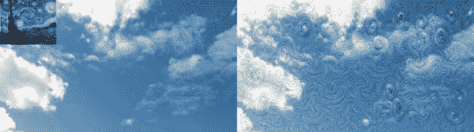](https://pyimagesearch.com/wp-content/uploads/2015/07/starry_night_example.jpg)

**Figure 1:** An example of applying guided dreaming using *Starry Night* and a cloud image.

正如你所看到的，应用引导做梦后的输出云图像似乎模仿了梵高绘画中的许多笔触。

这让我想到——**如果我从极其著名的艺术家那里拿一些著名的画，比如*安迪·沃霍尔*、*麦克·埃舍尔*、*巴勃罗·毕加索*、*杰森·布拉克*和*文森特·梵高*并把它们作为彼此的输入和指导，会发生什么？**

结果会是什么样的？每幅画的艺术风格会转移到另一幅上吗？

为了验证这一点，我收集了以下作品的图片:

*   安迪·沃霍尔—*[枪](https://pyimagesearch.com/wp-content/uploads/2015/07/andy_warhol_gun.jpg)*
*   安迪·沃霍尔—*[玛丽莲·梦露](https://pyimagesearch.com/wp-content/uploads/2015/07/andy_warhol_marilyn_mmonroe.jpg)*
*   杰森·布拉克—*[能量变得可见](https://pyimagesearch.com/wp-content/uploads/2015/07/jackson_pollock_energy_made_visible.jpg)*
*   MC 埃舍尔-*[天空和水 I](https://pyimagesearch.com/wp-content/uploads/2015/07/mc_escher_sky_and_water_i.jpg)*
*   MC 埃舍尔-*[马赛克 II](https://pyimagesearch.com/wp-content/uploads/2015/07/mc_escher_mosaic_ii.jpg)*
*   毕加索-*[格尔尼卡](https://pyimagesearch.com/wp-content/uploads/2015/07/pablo_picasso_guernica.jpg)*
*   梵高-*[翠柏麦田](https://pyimagesearch.com/wp-content/uploads/2015/07/van_gogh_wheat_field_with_cypresses.jpg)*

然后我通过上面详述的`demo_guided.py`脚本传递它们。

# 用深度做梦产生艺术

总的来说，结果看起来真的很棒。我特别满意的是*麦田与柏树*和*格尔尼卡*作为输入图像和其他绘画作为引导图像的结果。

下面你可以找到一些我最喜欢的图片:

## 文森特·梵高——有柏树的麦田

[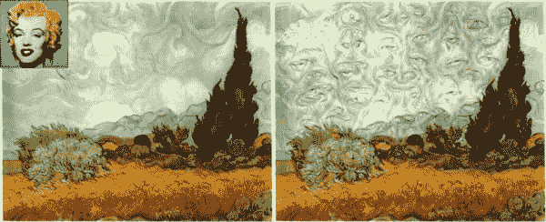](https://pyimagesearch.com/wp-content/uploads/2015/07/van_gogh_08.jpg)

**Figure 2:** Vincent van Gogh’s *Wheat Field with Cypresses* guided using Warhol’s *Marilyn Monroe*. Notice how eyes are now present in the sky.

[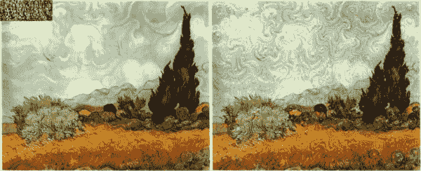](https://pyimagesearch.com/wp-content/uploads/2015/07/van_gogh_09.jpg)

**Figure 3:** Vincent van Gogh’s *Wheat Field with Cypresses* guided using Jackson Pollock’s *Energy Made Visible*.

[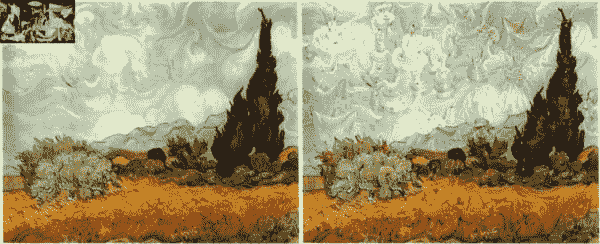](https://pyimagesearch.com/wp-content/uploads/2015/07/van_gogh_12.jpg)

**Figure 4:** Vincent van Gogh’s *Wheat Field with Cypresses* guided using Picasso’s *Guernica*.

## 巴勃罗·毕加索——格尔尼卡

[](https://pyimagesearch.com/wp-content/uploads/2015/07/pablo_picasso_guernica_05.jpg)

**Figure 5:** Pablo Picasso’s *Guernica* guided with MC Escher’s *Mosaic II*.

[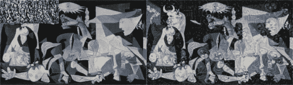](https://pyimagesearch.com/wp-content/uploads/2015/07/pablo_picasso_guernica_03.jpg)

**Figure 6:** Pablo Picasso’s *Guernica* guided with Jackson Pollock’s *Energy Made Visible*.

[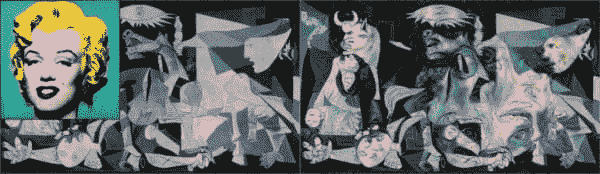](https://pyimagesearch.com/wp-content/uploads/2015/07/pablo_picasso_guernica_02.jpg)

**Figure 7:** Pablo Picasso’s *Guernica* guided with Andy Warhol’s *Marilyn Monroe*.

## MC 埃舍尔–马赛克 II

[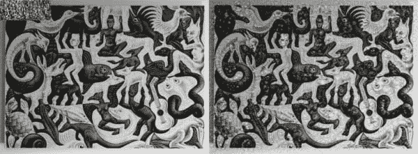](https://pyimagesearch.com/wp-content/uploads/2015/07/mc_escher_mosaic_ii_03.jpg)

**Figure 8:** MC Esher’s *Mosaic II* guided by Jackson Pollock’s *Energy Made Visible*.

[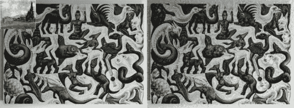](https://pyimagesearch.com/wp-content/uploads/2015/07/mc_escher_mosaic_ii_06.jpg)

**Figure 9:** MC Esher’s *Mosaic II* guided by Vincent van Gogh’s *Wheat Field with Cypresses*.

## 安迪·沃霍尔–玛丽莲·梦露

[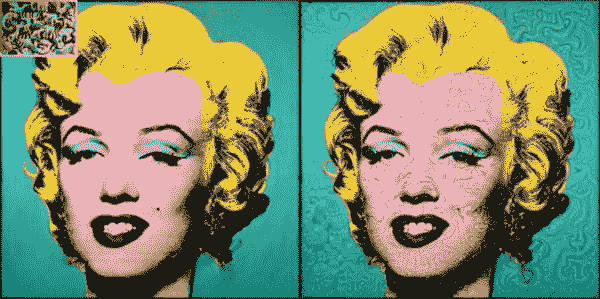](https://pyimagesearch.com/wp-content/uploads/2015/07/andy_warhol_marilyn_mmonroe_04.jpg)

**Figure 10:** Andy Warhol’s *Marilyn Monroe* guided using MC Escher’s *Sky and Water I*.

[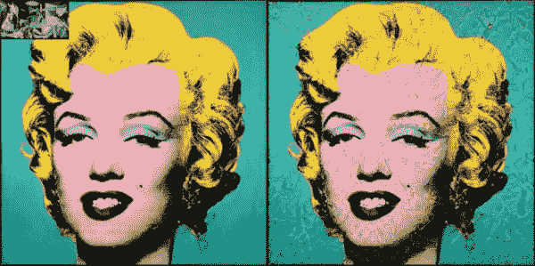](https://pyimagesearch.com/wp-content/uploads/2015/07/andy_warhol_marilyn_mmonroe_05.jpg)

**Figure 11:** Andy Warhol’s *Marilyn Monroe* guided using Picasso’s *Guernica*.

# 摘要

在这篇博文中，我回顾了对 [bat-country 包](https://github.com/jrosebr1/bat-country/)的更新，它将通过提供两个图像来允许**引导深度做梦:一个将通过网络传递的输入图像，以及一个网络将用来“引导”输出的种子图像。**

 **然后，我将更新后的代码用于从著名作品中生成艺术，如杰森·布拉克的*能量可见*，巴勃罗·毕加索的*格尔尼卡*，以及文森特·梵高的*翠柏麦田*。

一定要考虑在你的系统上安装`bat-country`包，试试深度做梦吧！玩一玩并生成自己的图像会令人奇怪地上瘾(更不用说，很有趣)。

最后，如果你对深度学习、深度做梦和计算机视觉感兴趣，可以考虑通过在下表中输入你的电子邮件地址来注册 PyImageSearch 时事通讯。我在 PyImageSearch 博客上定期更新，每次更新都充满了可操作的、真实世界的计算机视觉项目。

下次见！**