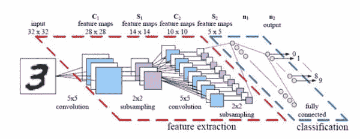

# 摆脱深度学习潮流，获得一些视角

> 原文：<https://pyimagesearch.com/2014/06/09/get-deep-learning-bandwagon-get-perspective/>

*免责声明:这篇帖子的语气有点玩世不恭。老实说，我支持深度学习研究，我支持这些发现，我相信通过研究深度学习，我们只能进一步改进我们的分类方法，并开发更好的方法。我们都知道研究是反复的。有时，我们甚至探索几十年前的方法，仅应用稍微不同的扭曲，产生显著不同的结果——因此一个新的研究领域诞生了。* *这就是机器学习研究的工作方式，理应如此。*

下面的咆哮实际上更像是对我们如何对待当前“热门”机器学习算法的控诉——就像“银弹”和治愈我们分类疾病的神奇药丸。但是，这些算法不是银弹，它们不是神奇的药丸，它们也不是工具箱中的工具——它们是由理性思维过程支持的方法，带有关于它们所应用的数据集的假设。通过多花一点时间思考实际问题，而不是盲目地把一堆算法扔向墙壁，看看有什么坚持，我相信我们只能进一步研究。

* * *

我觉得每次我上/r/machinelearning、HN 或 DataTau 时，都有人在谈论深度学习——而更多时候，这感觉就像是炒作。

我不是消极，因为我认为这项研究是一个死胡同。远非如此。这是一个 ***奇妙的*** 研究领域，还有 ***遥远的** **更多的*** 有待探索。

我只是厌倦了炒作。

真的，停止将深度学习视为受限的玻尔兹曼机器和卷积神经网络将解决你所有的图像分类困境。

是的。他们很强大。

是的，如果它们被应用到正确的问题类型中，它们有巨大的分类准确性。

但也要意识到深度学习是现在机器学习的热门话题。在某种程度上，在机器学习社区中有一种“赶时髦”的趋势——它也不是从深度网络开始的。

不相信我？请继续阅读。

# 为什么我在一个计算机视觉博客上谈论深度学习？

因为面对现实吧。除非你正在做一些非常严格形式的图像处理，否则如果没有某种机器学习，你就不可能拥有计算机视觉。

从聚类，到形成词袋模型，到软码字分配，到学习距离度量，到降维，到分类，回归(即使用回归森林的姿势估计，从而使 Xbox 360 Kinect 成为可能)，计算机视觉在数量惊人的任务中利用机器学习。

也就是说，如果你在用计算机视觉工作，你也可能会利用某种机器学习。

就深度网络而言，计算机视觉和机器学习变得更加交织——只要看看我们试图学习一组内核的卷积神经网络就知道了。

随着机器学习的兴起和衰落，这一潮流也将影响计算机视觉。

随着潮流，趋势也来了…

# 永久感知器故障

让我提醒你注意罗森布拉特的感知机算法(1958)。在他出版之后，基于感知的技术风靡一时。

但随后，明斯基和帕佩特 1969 年的论文实际上让神经网络研究停滞了近十年，证明了感知机无法解决异或(XOR)问题。此外，作者认为我们没有建立和维护大型神经网络所需的计算资源。

光是这一篇论文*就差点要了*神经网络研究的命。

真扫兴。

幸运的是，反向传播算法和 Rumelhart (1986 年)和 Werbos (1974 年)的研究能够使神经网络从可能过早死亡的状态中恢复过来。

可以说，如果没有这些研究人员的贡献，深度学习可能永远不会存在。

# 支持向量机

下一个潮流是:支持向量机。

在 90 年代中期，科尔特斯和瓦普尼克发表了他们开创性的支持向量网络论文。

你可能会认为机器学习已经解决了，甚至促使 Lipo Wang 博士说:

> 支持向量机的开发顺序与神经网络的开发顺序相反。支持向量机从完善的理论发展到实现和实验，而神经网络遵循更多的启发式路径，从应用和广泛的实验到理论。

这是一个非常强有力的说法，特别是在今天的深度学习背景下。

虽然我(稍微)断章取义地引用了这句话，但我使用这句话的真正原因是为了证明，曾经有一段时间，机器学习研究人员认为支持向量机有效地“解决”了分类问题。

支持向量机是未来。没有什么能打败他们… *包括神经网络*。

很讽刺，不是吗？因为现在我们所能谈论的就是堆叠受限玻尔兹曼机器和训练大规模卷积神经网络。

但是让我们保持这股潮流。

# 树木。树木。树木。

然后，随着 SVM 热，我们有了基于系综的方法。

基于 Amit 和 Geman (1997)、Ho (1998)和 Dietterich (2000)的工作，已故的 Leo Brieman 在 2001 年向机器学习社区贡献了他的 *Random Forests* 论文。

我们又跳上了马车，装上一堆树，扔上我们的铲子，前往壁橱苗圃建立营地。

老实说， ***我和*** 没什么不同——可以说，我喝了随机森林的 Kool-Aid。我的整篇论文涉及如何利用随机森林和弱特征表示来胜过专注于单个数据集的大量工程化的最新方法。

直到今天，我仍然发现自己稍微偏向于集合和基于森林的方法。

这种偏见是坏事吗？

我不这么认为。我认为这是自然的，甚至在一定程度上是人类的，偏向于你一生中很大一部分时间都在苦心研究的东西。

真正的问题是:*你能在没有大肆宣传的情况下做到吗？*

现在我们在当代。还有另一种“热门”学习模式。

# 深度学习，深度有缺陷？

但是事实证明，也许我们可以做得更好。

也许我们可以使用深度学习来学习*分层*特征表示。

听起来很棒，对吧？

但是现在我们又赶上了另一个潮流。我们就堆一堆 RBM，看看会发生什么！

我告诉你会发生什么。你让你的模型训练、交叉验证和网格搜索参数一个多星期(或者更长，取决于你的网络有多大和你可以支配的计算资源)，仅仅是为了让你在 ImageNet 上的准确度提高 0 . 1%。

好吧，我现在很愤世嫉俗。我承认这一点。

**但问题来了:** *我们需要停止把机器学习算法当成银弹*。

事实是，谈到机器学习，没有什么灵丹妙药。

相反，我们拥有的是一套惊人的、不可思议的算法，既有理论假设，又有经验证据，证明它们有能力解决分类问题的某个子集。

这里的目标是能够*识别*在某些领域表现良好的算法，*而不是*声称一种方法是机器学习的终极目标，将分类标记为“结案”。

尽管如此，老实说，我并不想抨击深度学习。正如科学界所展示的那样，这些深网非常强大。我全心全意支持他们的研究和发现。

# 神经网络的有趣特性

然而，谷歌的最新文章*神经网络的有趣特性*表明，在每一个深层神经网络中都潜伏着一个巨大的漏洞。

在他们的论文中，作者能够构建“敌对图像”——即，拍摄一幅图像并扰乱像素值，使其(有效地)与人眼相同，但可能导致深度网络的错误分类。

这些对立图像是以一种相当复杂的方式构建的——作者故意调整图像中的像素值，以最大化网络的预测误差，导致“对立图像”，当用作网络的输入时，几乎总是被错误分类，即使应用于在不同数据子集上训练的不同神经网络。

如果图像中的这些微小变化(实际上，人眼完全无法察觉)会导致性能完全下降，这对真实世界的数据集意味着什么？

因为让我们面对现实吧，真实世界的数据集 ***并不像 MNIST 的*** 那样干净。它们很脏。它们通常包含噪声。而且它们远非完美——当我们将算法从学术界移植到工业界时，这一点*尤其如此。*

那么，在实践中，这意味着什么呢？

这意味着从基于原始像素的特征中学习的方法还有很长的路要走。

深度学习会一直存在。老实说，我认为这是件好事。

目前正在进行一些令人难以置信的研究，我个人对卷积神经网络感到兴奋——我认为在未来五年内，卷积神经网络将继续在某些图像分类挑战中占据主导地位，如 ImageNet。

我也希望深度学习领域保持活跃(我相信它会)，因为无论如何，我们从研究深度网络中获得的研究和见解只会帮助我们在多年后创造出更好的方法。

但与此同时，也许我们可以把声音调小一点？

# 要点:

没有单一的机器学习模型是解决所有问题的“银弹”。

事实上，如果我们完全不把机器学习模型视为我们工具箱中的工具，那是最好的——我相信这是我们大多数问题的来源。

相反，我们需要花更多的时间来思考我们试图解决的实际问题，而不是用一堆算法来解决问题，看看什么可行。

因为当我们坐下来思考一个问题时，当我们花时间不仅理解我们的特征空间“是”什么以及它在现实世界中“暗示”什么时——那么我们就像机器学习的科学家一样。否则我们只是一堆机器学习*工程师*，盲目进行黑盒学习，操作一套 R，MATLAB，Python 库。

要点是:*机器学习不是工具。*这是一种具有理性思维过程的方法，完全依赖于我们试图解决的问题。我们不应该盲目地应用算法，看看什么能坚持下来。我们需要坐下来，探索特征空间(根据经验和现实世界的含义)，然后考虑我们的最佳行动模式。

坐下，深呼吸。花时间好好想想。

最重要的是，避免炒作。

# 接下来:

在我的下一篇文章中，我将向你展示一幅图像中仅仅一个像素的移动是如何扼杀你受限的玻尔兹曼机器的性能的。