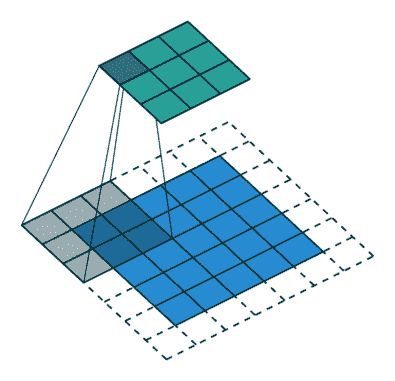

# 开始行动:时尚 DCGAN-MNIST

> 原文：<https://pyimagesearch.com/2021/11/11/get-started-dcgan-for-fashion-mnist/>

在本教程中，我们使用 TensorFlow 2 / Keras 实现了一个深度卷积 GAN (DCGAN)，基于论文[使用深度卷积生成对抗网络的无监督表示学习(拉德福德等人，2016)](https://arxiv.org/abs/1511.06434) 。这是最早的 GAN 论文之一，也是你开始学习 GAN 的典型读物。

这是我们 GAN 教程系列的第二篇文章:

1.  [*生成对抗网络简介*](https://pyimagesearch.com/2021/09/13/intro-to-generative-adversarial-networks-gans/)
2.  *入门:时尚 DCGAN-MNIST*(本帖)
3.  [*GAN 训练挑战:针对彩色图像的 DCGAN*](https://pyimagesearch.com/2021/12/13/gan-training-challenges-dcgan-for-color-images/)

我们将在本帖中讨论这些关键话题:

1.  DCGAN 架构指南
2.  使用 Keras 定制`train_step()``model.fit()`
3.  用 TensorFlow 2 / Keras 实现 DCGAN

在我们开始之前，你熟悉 GANs 的工作方式吗？

如果没有，一定要看看我以前的帖子“GANs 简介”，从高层次上了解 GANs 一般是如何工作的。每个 GAN 至少有一个发生器和一个鉴别器。虽然发生器和鉴别器相互竞争，但发生器在生成接近训练数据分布的图像方面做得更好，因为它从鉴别器获得了反馈。

**要了解如何使用 TensorFlow 2 / Keras 训练 DCGAN 生成时尚 MNIST 般的灰度图像，*继续阅读。***

### **架构指南**

DCGAN 论文介绍了一种 GAN 架构，其中鉴别器和发生器由卷积神经网络(CNN)定义。

它提供了几个架构指南来提高培训稳定性(参见**图 1** ):

让我们看一下上面的指导方针。为简洁起见，我将生成器称为 G，鉴别器称为 d。

#### **回旋**

*   **步长卷积:**步长为 2 的卷积层，用于 d 中的下采样，见**图 2** ( *左*)。
*   **分数步长卷积:** `Conv2DTranspose`步长为 2 的层，以 g 为单位进行上采样，见**图 2** ( *右*)。

*   
*   

**Figure 2**: *Left:* Strided convolutions (downsampling in D). *Right:* Fractional-strided convolutions (upsampling in G). Image source: [https://github.com/vdumoulin/conv_arithmetic](https://github.com/vdumoulin/conv_arithmetic).

#### **批量归一化**

该论文建议在 G 和 D 中使用批量标准化(batchnorm)来帮助稳定 GAN 训练。Batchnorm 将输入图层标准化为具有零均值和单位方差。它通常被添加在隐藏层之后和激活层之前。随着我们在 GAN 系列中的进展，您将学到更好的 GAN 规范化技术。目前，我们将坚持使用 batchnorm 的 DCGAN 论文建议。

#### **激活**

DCGAN 发生器和鉴别器中有四个常用的激活函数:**`sigmoid`****`tanh`****`ReLU`****`leakyReLU`**如图**图 3** 所示:

1.  `sigmoid`:将数字挤压成`0`(假的)和`1`(真的)。由于 DCGAN 鉴别器做的是二进制分类，所以我们在 d 的最后一层使用 sigmoid。
2.  `tanh`(双曲正切):也是 s 形像乙状结肠；事实上，它是一个缩放的 sigmoid，但以`0`为中心，并将输入值压缩到`[-1, 1]`。正如论文所推荐的，我们在 g 的最后一层使用`tanh`，这就是为什么我们需要预处理我们的训练图像到`[-1, 1]`的范围。
3.  `ReLU`(整流线性激活):输入值为负时返回`0`；否则，它返回输入值。本文建议对 G 中除输出层之外的所有层激活`ReLU`，输出层使用`tanh`。
4.  `LeakyReLU`:类似于`ReLU`除了当输入值为负的时候，它使用一个常数 alpha 给它一个非常小的斜率。正如论文所建议的，我们将斜率(alpha)设置为 0.2。除了最后一层，我们对所有层都使用了 D 中的`LeakyReLU`激活。

### **DCGAN Code in Keras**

现在我们已经很好地理解了论文中的指导方针，让我们浏览一下代码，看看如何在 TensorFlow 2 / Keras 中实现 DCGAN(参见**图 4** )。

和最初的 GAN 一样，我们同时训练两个网络:一个生成器和一个鉴别器。为了创建 DCGAN 模型，我们首先需要用 Keras Sequential API 为生成器和鉴别器定义模型架构。然后我们使用 Keras 模型子类化来创建 DCGAN。

请跟随这个 Colab 笔记本[这里](https://github.com/margaretmz/GANs-in-Art-and-Design/blob/main/2_dcgan_fashion_mnist.ipynb)的教程。

#### **依赖关系**

我们先启用 Colab GPU，导入需要的库。

##### **启用 Colab GPU**

本教程的代码在一个 Google Colab 笔记本里，最好启用 Colab 提供的免费 GPU。要在 Colab 中启用 GPU 运行时，请转到编辑→笔记本设置或运行时→更改运行时类型，然后从硬件加速器下拉菜单中选择“GPU”。

##### **进口**

Colab 应该已经预装了本教程所需的所有包。我们将在 TensorFlow 2 / Keras 中编写代码，并使用 matplotlib 进行可视化。我们只需要导入这些库，如下所示:

```py
import tensorflow as tf

from tensorflow import keras
from tensorflow.keras.datasets import fashion_mnist
from tensorflow.keras.models import Sequential
from tensorflow.keras import layers
from tensorflow.keras.models import Model
from tensorflow.keras.optimizers import Adam

from matplotlib import pyplot as plt
```

#### **数据**

第一步是为训练准备好数据。在这篇文章中，我们将使用时尚 MNIST 的数据来训练 DCGAN。

##### **数据加载**

时尚-MNIST 数据集具有训练/测试分割。对于训练 DCGAN，我们不需要这样的数据拆分。我们可以只使用训练数据，或者为了训练的目的而加载训练/测试数据集。

对于具有时尚 MNIST 的 DCGAN，仅使用训练数据集进行训练就足够了:

```py
(train_images, train_labels), (_, _) = tf.keras.datasets.fashion_mnist.load_data()
```

看一下带有`train_images.shape`的时尚-MNIST 训练数据形状，注意`(60000, 28, 28)`的形状，意味着有 60000 个训练灰度图像，大小为`28x28`。

##### **数据可视化**

我总是喜欢将训练数据可视化，以了解图像是什么样子的。让我们看一个图像，看看时尚 MNIST 灰度图像是什么样子的(见图 5**)。**

```py
plt.figure()
plt.imshow(train_images[0], cmap='gray')
plt.show()
```

##### **数据预处理**

加载的数据呈`(60000, 28, 28)`形状，因为它是灰度的。所以我们需要为通道添加第四维为 1，并将数据类型(来自 NumPy 数组)转换为 TensorFlow 中训练所需的`float32`。

```py
train_images = train_images.reshape(train_images.shape[0], 28, 28, 1).astype('float32')
```

我们将输入图像归一化到`[-1, 1]`的范围，因为生成器的最终层激活使用了前面提到的`tanh`。

```py
train_images = (train_images - 127.5) / 127.5
```

#### **发电机型号**

生成器的工作是生成可信的图像。它的目标是试图欺骗鉴别者，让他们认为它生成的图像是真实的。

生成器将随机噪声作为输入，并输出类似于训练图像的图像。因为我们在这里生成一个`28x28`灰度图像，模型架构需要确保我们达到一个形状，使得生成器输出应该是`28x28x1`(参见**图 6** )。

所以为了能够创建图像，生成器的主要任务是:

*   用`Reshape`图层将 1D 随机噪声(潜在矢量)转换为 3D
*   使用 Keras `Conv2DTranspose`层(本文中提到的分数步长卷积)向上采样几次，以输出图像大小，在时尚 MNIST 的情况下，是一个形状为`28x28x1`的灰度图像。

有几层构成了 G:

*   `Dense`(全连通)层:仅用于整形和平坦化噪声矢量
*   `Conv2DTranspose`:上采样
*   `BatchNormalization`:稳定训练；在 conv 层之后和激活功能之前。
*   使用 G 中的`ReLU`激活所有层，除了使用`tanh`的输出层。

让我们创建一个用于构建生成器模型架构的函数`def build_generator()`。

定义几个参数:

*   随机噪声的潜在维数
*   `Con2DTranspose`层的权重初始化
*   图像的颜色通道。

```py
# latent dimension of the random noise
LATENT_DIM = 100
# weight initializer for G per DCGAN paper
WEIGHT_INIT = tf.keras.initializers.RandomNormal(mean=0.0, stddev=0.02)
# number of channels, 1 for gray scale and 3 for color images
CHANNELS = 1
```

使用 Keras `Sequential` API 创建模型，这是创建模型最简单的方法:

```py
   model = Sequential(name='generator')
```

然后我们创建一个`Dense`层，为 3D 整形做准备，同时确保在模型架构的第一层定义输入形状。添加`BatchNormalization`和`ReLU`图层:

```py
   model.add(layers.Dense(7 * 7 * 256, input_dim=LATENT_DIM))
   model.add(layers.BatchNormalization())
   model.add(layers.ReLU())
```

现在我们将之前的图层从 1D 重塑为 3D。

```py
   model.add(layers.Reshape((7, 7, 256)))
```

用`2`的`stride`对`Conv2DTranspose`进行两次上采样，从`7x7`到`14x14`再到`28x28`。在每个`Conv2DTranspose`层后添加一个`BatchNormalization`层，然后再添加一个`ReLU`层。

```py
   # upsample to 14x14: apply a transposed CONV => BN => RELU
   model.add(layers.Conv2DTranspose(128, (5, 5), strides=(2, 2),padding="same", kernel_initializer=WEIGHT_INIT))
   model.add(layers.BatchNormalization())
   model.add((layers.ReLU()))

   # upsample to 28x28: apply a transposed CONV => BN => RELU
   model.add(layers.Conv2DTranspose(64, (5, 5), strides=(2, 2),padding="same", kernel_initializer=WEIGHT_INIT))
   model.add(layers.BatchNormalization())
   model.add((layers.ReLU()))
```

最后，我们使用激活了`tanh`的`Conv2D`层。注意`CHANNELS`早先被定义为`1`，它将制作一个`28x28x1`的图像，与我们的灰度训练图像相匹配。

```py
model.add(layers.Conv2D(CHANNELS, (5, 5), padding="same", activation="tanh"))
```

看看我们刚刚用`generator.summary()`定义的生成器模型架构，确保每一层都是我们想要的形状(参见**图 7** ):

#### **鉴别器型号**

鉴别器是一个简单的二进制分类器，可以辨别图像是真是假。它的目标是试图对图像进行正确的分类。但是，鉴别器和常规分类器之间有一些区别:

*   我们使用`LeakyReLU`作为每个 DCGAN 文件的激活函数。
*   鉴别器有**两组输入图像**:标记为 1 的训练数据集或真实图像，以及标记为 0 的生成器创建的假图像。

***注:*** *鉴频器网络通常比发生器小或简单，因为鉴频器的工作比发生器容易得多。如果鉴别器太强，那么发电机就不会有很好的改善。*

下面是鉴别器架构的样子(参见**图 8** ):

我们将再次创建一个函数来构建鉴别器模型。鉴别器的输入是真实图像(训练数据集)或生成器生成的假图像，因此对于时尚 MNIST，图像大小是`28x28x1`，它作为 argos 传递到函数中作为宽度、高度和深度。alpha 用于`LeakyReLU`定义泄漏的斜率。

```py
def build_discriminator(width, height, depth, alpha=0.2):
```

使用 Keras `Sequential` API 来定义鉴别器架构。

```py
   model = Sequential(name='discriminator')
   input_shape = (height, width, depth)
```

我们使用`Conv2D`、`BatchNormalization`和`LeakyReLU`两次进行下采样。

```py
   # first set of CONV => BN => leaky ReLU layers
   model.add(layers.Conv2D(64, (5, 5), strides=(2, 2), padding="same",
       input_shape=input_shape))
   model.add(layers.BatchNormalization())
   model.add(layers.LeakyReLU(alpha=alpha))

   # second set of CONV => BN => leacy ReLU layers
   model.add(layers.Conv2D(128, (5, 5), strides=(2, 2), padding="same"))
   model.add(layers.BatchNormalization())
   model.add(layers.LeakyReLU(alpha=alpha))
```

展平并应用 dropout:

```py
   model.add(layers.Flatten())
   model.add(layers.Dropout(0.3))
```

然后在最后一层，我们使用 sigmoid 激活函数输出单个值用于二进制分类。

```py
   model.add(layers.Dense(1, activation="sigmoid"))
```

调用`model.summary()`查看我们刚刚定义的鉴别器架构(参见**图 9** ):

#### **损失函数**

在继续创建 DCGAN 模型之前，我们先讨论一下损失函数。

计算损耗是 DCGAN(或任何 GAN)训练的核心。对于 DCGAN，我们将实现**改进的 minimax 损失**，它使用二进制交叉熵(BCE)损失函数。随着我们在 GAN 系列中的进展，您将了解不同 GAN 变体中的其他损失函数。

我们需要计算两个损耗:一个是鉴频器损耗，另一个是发电机损耗。

**鉴频器损耗**

由于有两组图像被送入鉴别器(真实图像和虚假图像)，我们将计算每组图像的损失，并将它们合并为鉴别器损失。

总损失=损失真实图像+损失虚假图像

**发电机损耗**

对于发生器损耗，我们可以训练 G 使`log D(G(z))`最大化，而不是训练 G 使`log(1 − D(G(z)))`(D 将假图像分类为假图像的概率)最小化(0)，我们可以训练 G 使`log D(G(z))`(D 将假图像错误分类为真图像的概率)最大化(1)。这就是修正的极大极小损失。

#### **DCGAN 模型:覆盖`train_step`**

我们已经定义了发生器和鉴别器架构，并了解了损失函数的工作原理。我们准备将 D 和 G 放在一起，通过子类化`keras.Model`并覆盖`train_step()`来训练鉴别器和生成器，从而创建 DCGAN 模型。这里是关于如何[编写底层代码](https://keras.io/guides/customizing_what_happens_in_fit/#going-lowerlevel)定制`model.fit()`的文档。这种方法的优点是，您仍然可以使用`GradientTape`进行定制的训练循环，同时仍然可以受益于`fit()`的便利特性(例如，回调和内置的分发支持等)。).

所以我们子类化`keras.Model`来创建 DCGAN 类—`class DCGAN(keras.Model)`:

DCGAN 类的细节请参考 Colab 笔记本[这里](https://github.com/margaretmz/GANs-in-Art-and-Design/blob/main/2_dcgan_fashion_mnist.ipynb)，这里我只重点讲解如何为训练 D 和 g 重写`train_step()`

在`train_step()`中，我们首先创建随机噪声，作为发生器的输入:

```py
batch_size = tf.shape(real_images)[0]
noise = tf.random.normal(shape=(batch_size, self.latent_dim))
```

然后我们用真实图像(标记为 1)和虚假图像(标记为 0)来训练鉴别器。

```py
with tf.GradientTape() as tape:
    # Compute discriminator loss on real images
    pred_real = self.discriminator(real_images, training=True)
    d_loss_real = self.loss_fn(tf.ones((batch_size, 1)), pred_real)

    # Compute discriminator loss on fake images
    fake_images = self.generator(noise)
    pred_fake = self.discriminator(fake_images, training=True)
    d_loss_fake = self.loss_fn(tf.zeros((batch_size, 1)), pred_fake)

    # total discriminator loss
    d_loss = (d_loss_real + d_loss_fake)/2
# Compute discriminator gradients
grads = tape.gradient(d_loss, self.discriminator.trainable_variables)
# Update discriminator weights
self.d_optimizer.apply_gradients(zip(grads, self.discriminator.trainable_variables))
```

我们训练生成器，而不更新鉴别器的权重。

```py
misleading_labels = tf.ones((batch_size, 1)) 

with tf.GradientTape() as tape:
    fake_images = self.generator(noise, training=True)
    pred_fake = self.discriminator(fake_images, training=True)
    g_loss = self.loss_fn(misleading_labels, pred_fake)
# Compute generator gradients
grads = tape.gradient(g_loss, self.generator.trainable_variables)
# Update generator weights
self.g_optimizer.apply_gradients(zip(grads, self.generator.trainable_variables))

self.d_loss_metric.update_state(d_loss)
self.g_loss_metric.update_state(g_loss)
```

#### **训练期间的监控和可视化**

我们将覆盖 Keras `Callback()`来监控:

1.  鉴频器损耗
2.  发电机损耗
3.  训练过程中生成的图像

例如，对于图像分类，损失可以帮助我们理解模型的表现如何。对于 GAN，D 损失和 G 损失表示每个模型的单独表现，可能是也可能不是 GAN 模型总体表现的准确衡量。我们将在下一篇文章“GAN 训练挑战”中进一步讨论这个问题

对于 GAN 评估，我们必须目视检查训练期间生成的图像。我们将在以后的帖子中学习其他评估方法。

#### **编译和训练模型**

现在我们终于可以组装 DCGAN 模型了！

```py
dcgan = DCGAN(discriminator=discriminator, generator=generator, latent_dim=LATENT_DIM)
```

正如 DCGAN 论文所建议的，我们对生成器和鉴别器都使用了具有 0.0002 的`learning rate`的`Adam`优化器。如前所述，我们对 D 和 g 都使用二元交叉熵损失函数。

```py
LR = 0.0002 # learning rate

dcgan.compile(
   d_optimizer=keras.optimizers.Adam(learning_rate=LR, beta_1 = 0.5),
   g_optimizer=keras.optimizers.Adam(learning_rate=LR, beta_1 = 0.5),
   loss_fn=keras.losses.BinaryCrossentropy(),
)
```

我们已经准备好训练 DCGAN 模型了，只需调用`model.fit`！

```py
NUM_EPOCHS = 50 # number of epochs
dcgan.fit(train_images, epochs=NUM_EPOCHS, 
callbacks=[GANMonitor(num_img=16, latent_dim=LATENT_DIM)])
```

训练 50 个历元，每个历元用 Colab 笔记本的 GPU 只需要 25 秒左右。

在训练期间，我们可以目视检查生成的图像，以确保生成器生成的图像质量良好。

查看图 10 中第 1 个历元、第 25 个历元和第 50 个历元的训练期间生成的图像，我们看到生成器在生成时尚 MNIST 相似图像方面变得越来越好。

## **总结**

在这篇文章中，我们讨论了如何训练一个稳定的 DCGAN 的 DCGAN 架构指南。伴随着一个 Colab 笔记本，我们在 TensorFlow 2 / Keras 中用灰度时尚 MNIST 图像完成了 DCGAN 代码的实现。我讨论了如何用 Keras 模型子类化定制`train_step`，然后调用 Keras `model.fit()`进行训练。在下一篇文章中，我将通过实现一个用流行色图像训练的 DCGAN 来演示 GAN 训练的挑战。

### **引用信息**

**梅纳德-里德，M.** 《入门:DCGAN for Fashion-MNIST》， *PyImageSearch* ，2021 年，[https://PyImageSearch . com/2021/11/11/Get-Started-DCGAN-for-Fashion-mnist/](https://pyimagesearch.com/2021/11/11/get-started-dcgan-for-fashion-mnist/)

```py
@article{Maynard-Reid_2021_DCGAN_MNIST,
  author = {Margaret Maynard-Reid},
  title = {Get Started: {DCGAN} for Fashion-{MNIST}},
  journal = {PyImageSearch},
  year = {2021},
  note = {https://pyimagesearch.com/2021/11/11/get-started-dcgan-for-fashion-mnist/},
}
```

**要下载这篇文章的源代码(并在未来教程在 PyImageSearch 上发布时得到通知)，*只需在下面的表格中输入您的电子邮件地址！***