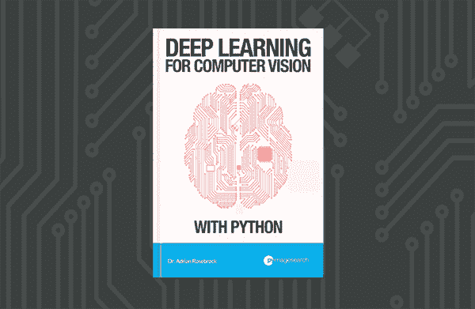
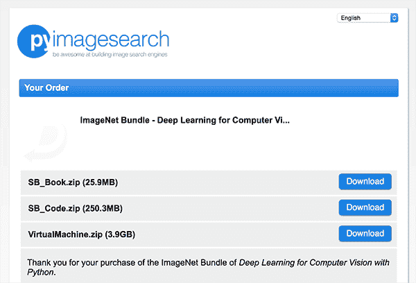
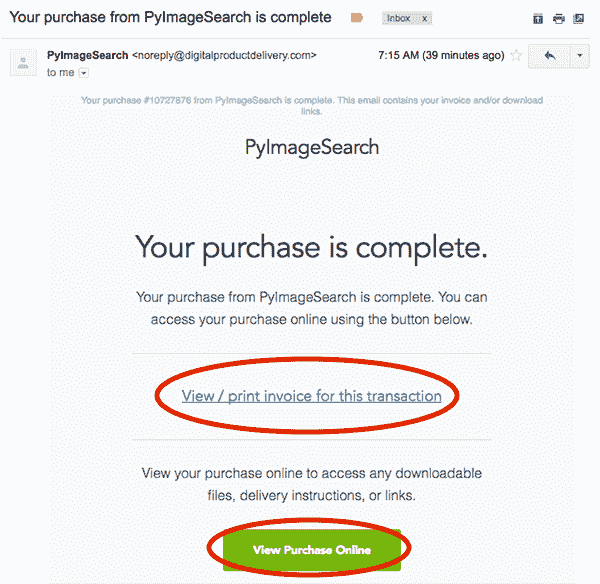
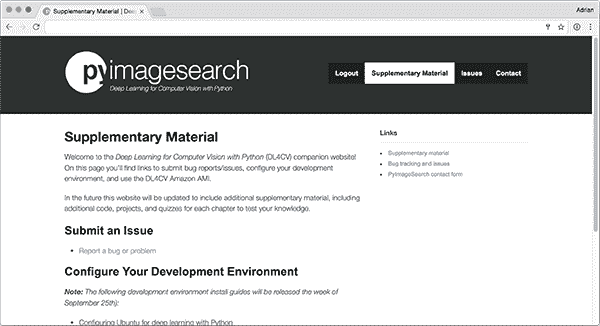
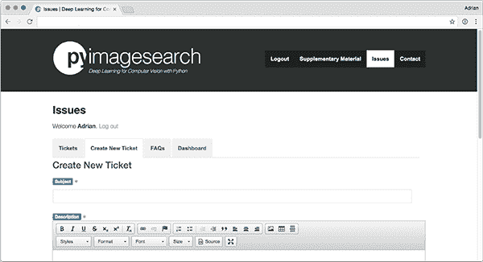

# 使用 Python 开始计算机视觉的深度学习

> 原文：<https://pyimagesearch.com/2017/09/23/getting-started-deep-learning-computer-vision-python/>

这篇博文是为那些已经购买了我的新书《Python 计算机视觉深度学习》 的读者准备的。

在本教程中，您将学习如何:

*   下载书籍、代码、数据集和任何与您的购买相关的额外内容。
*   获取您的电子邮件收据和发票。
*   使用 Python 访问与*计算机视觉深度学习相关的配套网站。*
*   使用配套网站发布问题、提交 bug 或报告打字错误。
*   重新激活过期的下载链接。

如果您有任何与本书相关的其他问题，请给我发电子邮件或使用[联系表](https://pyimagesearch.com/contact/)。

## 使用 Python 开始计算机视觉的深度学习

感谢你用 Python 拿起一本 *[计算机视觉深度学习！](https://pyimagesearch.com/deep-learning-computer-vision-python-book/)*

我感谢你对我和 PyImageSearch 博客的支持。没有你，PyImageSearch 就不可能实现。

我的目标是确保你在时间和金钱上的投资都能获得巨大的回报。为了确保你有一个良好的开端，本指南将帮助你开始使用全新的*Python 计算机视觉深度学习*。

### 下载文件

在您成功结帐并购买了使用 Python 进行计算机视觉的*深度学习*之后，您将被重定向到一个看起来与下图类似的页面:

**Figure 1:** The *“Downloads Page”* you can use to download the files associated with your purchase of *Deep Learning for Computer Vision with Python*.

这是你的 ***购买页面*** ，在这里你可以下载你的文件。左键点击每个文件，你的下载将开始。

所有以前缀`SB`开头的文件都是*启动包*的一部分。以`PB`开头的文件是*从业者包*的一部分。最后，以`IB`开头的文件名是 *ImageNet 包*的一部分。

包含`*_Book.zip`的文件名包含相应包的 PDF。包含`*_Videos.zip`的文件名包含捆绑包的视频。包括`*_Code.zip`在内的文件名包含您的代码/与包相关的数据集。例如，文件名`SB_Code.zip`包含与*启动包*相关的所有代码/数据集。文件名`SB_Book.zip`包含您的*启动包*的 PDF。

最后，`VirtualMachine.zip`文件包含你的[预配置的 Ubuntu VirtualBox 虚拟机](https://pyimagesearch.com/2017/09/22/deep-learning-python-ubuntu-virtual-machine/)。

***注:**此时只有*启动包*的内容已经发布。*从业者捆绑包*和* ImageNet 捆绑包*的内容将于 10 月发布。*

如果您在浏览器中关闭了此选项卡，并需要再次访问它，只需:

1.  打开你的收件箱。
2.  找到电子邮件收据(见下一节)。
3.  点击*“在线查看购买”*链接。

从那里，您将能够访问下载页面。

请尽快下载这些文件。出于安全原因，我用来处理支付和分发数字下载的服务会在四天后自动过期。如果你的下载过期了，完全没问题，只需参考下面的*“重新激活过期的下载”* 一节。

### 您的电子邮件收据和发票

在你购买了用 Python 编写的用于计算机视觉的*深度学习的副本*几分钟后，你会收到一封电子邮件，主题是: ***“你从 PyImageSearch 的购买已完成”*** 。

在这封电子邮件中，您可以找到查看/打印发票以及访问下载页面的链接:

**Figure 2:** After purchasing your copy of *Deep Learning for Computer Vision with Python* you will receive an email containing your receipt/invoice and link to re-access the downloads page.

如果您*没有*收到这封电子邮件，请确保您正在检查退房时使用的收件箱/电子邮件地址。如果您使用 PayPal，您需要检查与您的 PayPal 帐户相关的电子邮件地址。

如果你仍然找不到邮件，不要担心！请通过[联系表](https://pyimagesearch.com/contact/)向我发送电子邮件或信息，并附上任何相关信息，例如:

*   电子邮件地址的购买应在其下列出。
*   你的名字。
*   您可能拥有的任何其他相关信息(购买号、是否通过信用卡或 PayPal 付款、是否有朋友/同事为您购买等。).

从那里，我可以仔细检查数据库，并确保您收到您的电子邮件收据和下载链接。

### 访问配套网站

您购买的用于 Python 计算机视觉的*深度学习*包括访问补充材料/配套网站。

要访问配套网站:

1.  下载*启动包*的 PDF 文件。
2.  打开*入门包*至“伙伴网站”部分(PDF 第 15 页)。
3.  跟随到伙伴网站的链接。
4.  通过创建用户名和密码在配套网站上注册您的帐户。

从那里，您可以访问配套网站:

**Figure 3:** The *Deep Learning for Computer Vision with Python* companion website.

现在，配套网站包括链接到(1)配置您的开发环境和(2)报告一个错误。今后，本网站将包含额外的补充材料。

### 发布问题、错误报告或打字错误

你应该在同伴网站上创建你的账户的最重要的原因是 ***报告问题*** 、 ***bug*** ，或者 ***错别字*** 。

您可以点击配套网站标题中的*“问题”*按钮来完成此操作:

**Figure 4:** If you encounter an error when using the book, please check the *“Issues”* page inside the companion website.

然后，您将看到所有未结票证的列表。

您可以通过点击*“应用过滤器”*按钮来搜索这些票证。

如果没有与您的查询相匹配的票证，请点击*“创建新票证”*并填写必填字段:

**Figure 5:** If no (already submitted) bug report matches your error, please create a new ticket so myself and others in the PyImageSearch community can help you.

从那里，我和 PyImageSearch 社区的其他人可以帮助你解决这个问题。

关于任何问题，你也可以随时给我发邮件；但是，我可能会建议您参考配套网站来发布错误:

1.  我可以跟踪问题，并确保您的问题得到及时解决。
2.  如果其他读者也遇到这个问题，他们可以从中吸取教训。

由于*用 Python 进行计算机视觉的深度学习*是一本全新的书，必然会有很多疑问。通过使用问题追踪器，我们可以组织所有的 bug，同时确保社区也可以从其他问题中学习。

### 重新激活过期的下载

出于安全原因，我用来处理支付和分发数字下载的服务会在四天后自动过期。

如果你的网址过期了，完全没问题— ***只需给我发电子邮件或[给我发信息](https://pyimagesearch.com/contact/)，我可以为你重新激活购买。***

## 摘要

在本教程中，您学习了如何使用 Python 开始使用新购买的 [*计算机视觉深度学习。*](https://pyimagesearch.com/deep-learning-computer-vision-python-book/)

如果你有本指南中没有讨论的问题，请给我发电子邮件或给我发信息，我很乐意和你讨论这个问题。

否则，如果您的问题是*特别是*与一章、一段代码、一条错误消息或任何与本书的实际*内容*相关的内容，请参考上面的*“发布问题、错误报告或错别字”*部分。

再次感谢您使用 Python 购买*计算机视觉深度学习的副本。*

我感到无比兴奋和荣幸，能够在你的深度学习掌握之旅中指导你。

没有 ***你*** ，这个博客就不可能。

祝你有美好的一天和快乐的阅读！

附言:如果你还没有用 Python、 **[购买用于计算机视觉的*深度学习的副本，你可以在这里*](https://pyimagesearch.com/deep-learning-computer-vision-python-book/)** 购买。