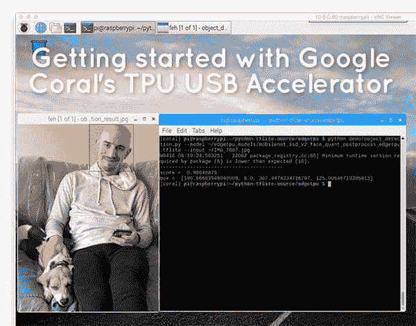
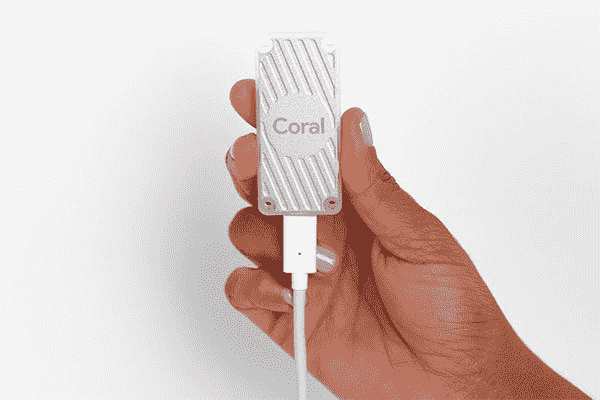
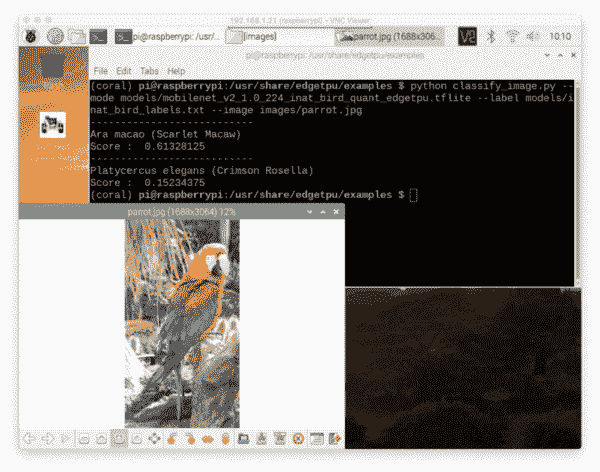
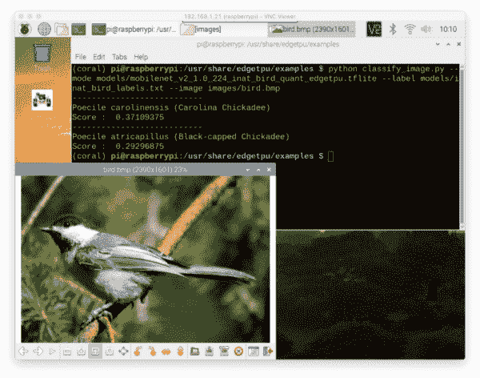
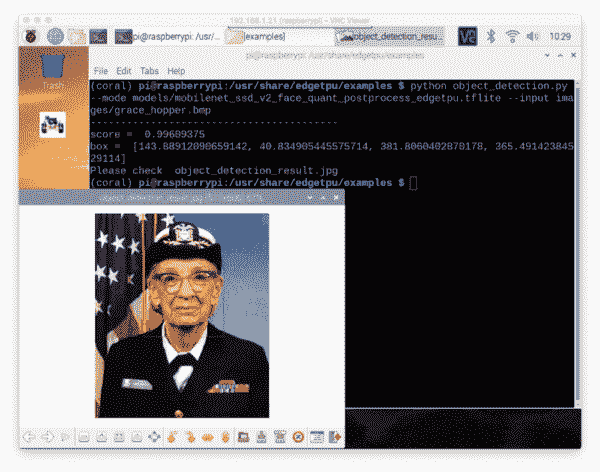
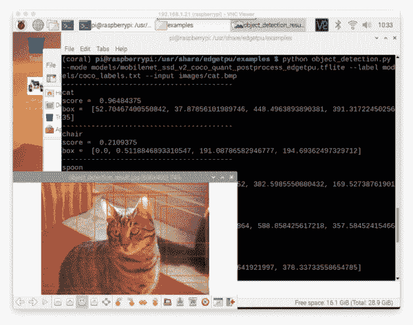
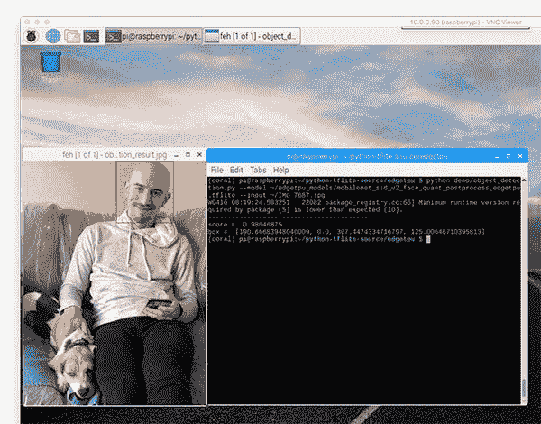
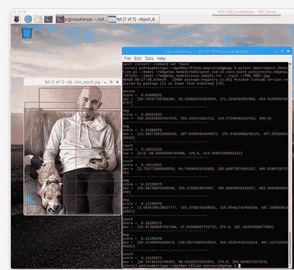

# 开始使用谷歌珊瑚的 TPU USB 加速器

> 原文：<https://pyimagesearch.com/2019/04/22/getting-started-with-google-corals-tpu-usb-accelerator/>

[](https://pyimagesearch.com/wp-content/uploads/2019/04/google_coral_getting_started_header.jpg)

在本教程中，您将学习如何在 Raspberry Pi 和 Ubuntu 上配置您的谷歌珊瑚 TPU USB 加速器。然后，您将学习如何使用 Google Coral 的 USB 加速器执行分类和对象检测。

几周前，谷歌发布了“Coral”，这是一种*超快*、“不需要互联网”的开发板和 USB 加速器，使深度学习从业者能够“在边缘”和“更接近数据”地部署他们的模型。

使用 Coral，深度学习开发人员*不再需要*拥有互联网连接，这意味着 Coral TPU 足够快，可以直接在设备上执行推理*，而不是将图像/帧发送到云端进行推理和预测。*

谷歌珊瑚有两种口味:

1.  **带有板载 Edge TPU 的单板计算机**。开发板可以被认为是“人工智能的高级树莓 Pi”或 NVIDIA 的 Jetson Nano 的竞争对手。
2.  一个 USB **加速器**可以插入一个设备(比如树莓派)。u 盘内置了一个 Edge TPU。可以把谷歌的 Coral USB 加速器看作是英特尔的 Movidius NCS 的竞争对手。

今天，我们将重点关注 Coral USB 加速器，因为它更容易上手(而且它非常符合我们过去几周树莓 Pi 相关帖子的主题)。

**要了解如何配置您的 Google Coral USB 加速器(并执行分类+对象检测)，*继续阅读！***

## 开始使用谷歌珊瑚的 TPU USB 加速器

[](https://pyimagesearch.com/wp-content/uploads/2019/04/google_coral_getting_started_device.jpg)

**Figure 1:** The Google Coral TPU Accelerator adds deep learning capability to resource-constrained devices like the Raspberry Pi ([source](https://coral.withgoogle.com/docs/accelerator/get-started/)).

在这篇文章中，我假设你有:

*   您的**谷歌珊瑚 USB 加速棒**
*   全新安装基于 Debian 的 Linux 发行版(例如， **Raspbian、Ubuntu、**等)。)
*   了解基本的 Linux 命令和文件路径

如果你还没有谷歌珊瑚加速器，你可以通过谷歌官方网站购买。

我将在 Raspbian 上配置 Coral USB 加速器，但是同样，如果您有基于 Debian 的操作系统，这些命令仍然可以工作。

我们开始吧！

***更新 2019-12-30:** 安装步骤 1-6 已经完全重构并更新，以符合谷歌关于安装 Coral 的 EdgeTPU 运行时库的建议说明。我的主要贡献是添加了 Python 虚拟环境。我还更新了关于如何运行示例脚本的部分。*

### 步骤 1:安装 Coral EdgeTPU 运行时和 Python API

在这一步，我们将使用您的 Aptitude 包管理器来安装 Google Coral 的 Debian/Raspbian 兼容包。

首先，让我们添加包存储库:

```py
$ echo "deb https://packages.cloud.google.com/apt coral-edgetpu-stable main" | sudo tee /etc/apt/sources.list.d/coral-edgetpu.list
$ curl https://packages.cloud.google.com/apt/doc/apt-key.gpg | sudo apt-key add -
$ sudo apt-get update

```

***注意:**小心换行，确保你复制了每个完整的命令，并在你的终端中输入，如图所示。*

现在我们准备好**安装 EdgeTPU 运行时库:**

```py
$ sudo apt-get install libedgetpu1-std

```

接着是**安装 EdgeTPU Python API:**

```py
$ sudo apt-get install python3-edgetpu

```

### 第二步:重启你的设备

重新启动您的 Raspberry Pi 或计算机是安装完成的关键。您可以使用以下命令:

```py
$ sudo reboot now

```

### 步骤 3:设置你的谷歌珊瑚虚拟环境

我们将使用 Python **虚拟环境**，这是使用 Python 时的最佳实践。

Python 虚拟环境是您系统上的一个*隔离的*开发/测试/生产环境——它与其他环境完全隔离。最重要的是，您可以使用 pip (Python 的包管理器)管理虚拟环境中的 Python 包。

当然，也有管理虚拟环境和包的替代方法(即 Anaconda/conda 和 venv)。我已经使用/尝试了所有这些工具，但最终选定 pip、 [virtualenv](https://virtualenv.pypa.io/en/latest/) 和 [virtualenvwrapper](https://virtualenvwrapper.readthedocs.org/en/latest/) 作为我安装在所有系统上的首选工具。如果你使用和我一样的工具，你会得到我最好的支持。

您可以使用以下命令安装 pip:

```py
$ wget https://bootstrap.pypa.io/get-pip.py
$ sudo python get-pip.py
$ sudo python3 get-pip.py
$ sudo rm -rf ~/.cache/pip

```

现在让我们安装`virtualenv`和`virtualenvwrapper`:

```py
$ sudo pip install virtualenv virtualenvwrapper

```

一旦`virtualenv`和`virtualenvwrapper`都安装好了，打开你的`~/.bashrc`文件:

```py
$ nano ~/.bashrc

```

…并将以下几行附加到文件的底部:

```py
# virtualenv and virtualenvwrapper
export WORKON_HOME=$HOME/.virtualenvs
export VIRTUALENVWRAPPER_PYTHON=/usr/bin/python3
source /usr/local/bin/virtualenvwrapper.sh

```

通过`ctrl + x`、`y`、`enter`保存并退出。

从那里，重新加载您的`~/.bashrc`文件，将更改应用到您当前的 bash 会话:

```py
$ source ~/.bashrc

```

接下来，创建您的 **Python 3 虚拟环境:**

```py
$ mkvirtualenv coral -p python3

```

这里我们使用 Python 3 创建了一个名为`coral`的 Python 虚拟环境。展望未来，我推荐 Python 3。

***注意:** Python 3 将在 2020 年 1 月 1 日到达生命的尽头，所以我**不**推荐使用 Python 2.7。*

### 步骤 4:将 EdgeTPU 运行时符号链接到您的虚拟环境中

符号链接是从一个文件/文件夹到另一个文件/文件夹的虚拟链接。你可以在[维基百科的文章](https://en.wikipedia.org/wiki/Symbolic_link)上了解更多。

我们将创建一个从包含 EdgeTPU 运行时库的 system packages 文件夹到我们的虚拟环境的符号链接。

首先，让我们找到 Python EdgeTPU 包的安装路径:

```py
$ dpkg -L python3-edgetpu
/.
/usr
/usr/lib
/usr/lib/python3
/usr/lib/python3/dist-packages
/usr/lib/python3/dist-packages/edgetpu
/usr/lib/python3/dist-packages/edgetpu/__init__.py
/usr/lib/python3/dist-packages/edgetpu/basic
/usr/lib/python3/dist-packages/edgetpu/basic/__init__.py
/usr/lib/python3/dist-packages/edgetpu/basic/basic_engine.py
/usr/lib/python3/dist-packages/edgetpu/basic/edgetpu_utils.py
/usr/lib/python3/dist-packages/edgetpu/classification
/usr/lib/python3/dist-packages/edgetpu/classification/__init__.py
/usr/lib/python3/dist-packages/edgetpu/classification/engine.py
/usr/lib/python3/dist-packages/edgetpu/detection
/usr/lib/python3/dist-packages/edgetpu/detection/__init__.py
/usr/lib/python3/dist-packages/edgetpu/detection/engine.py
/usr/lib/python3/dist-packages/edgetpu/learn
/usr/lib/python3/dist-packages/edgetpu/learn/__init__.py
/usr/lib/python3/dist-packages/edgetpu/learn/backprop
/usr/lib/python3/dist-packages/edgetpu/learn/backprop/__init__.py
/usr/lib/python3/dist-packages/edgetpu/learn/backprop/ops.py
/usr/lib/python3/dist-packages/edgetpu/learn/backprop/softmax_regression.py
/usr/lib/python3/dist-packages/edgetpu/learn/imprinting
/usr/lib/python3/dist-packages/edgetpu/learn/imprinting/__init__.py
/usr/lib/python3/dist-packages/edgetpu/learn/imprinting/engine.py
/usr/lib/python3/dist-packages/edgetpu/learn/utils.py
/usr/lib/python3/dist-packages/edgetpu/swig
/usr/lib/python3/dist-packages/edgetpu/swig/__init__.py
/usr/lib/python3/dist-packages/edgetpu/swig/_edgetpu_cpp_wrapper.cpython-35m-arm-linux-gnueabihf.so
/usr/lib/python3/dist-packages/edgetpu/swig/_edgetpu_cpp_wrapper.cpython-36m-arm-linux-gnueabihf.so
/usr/lib/python3/dist-packages/edgetpu/swig/_edgetpu_cpp_wrapper.cpython-37m-arm-linux-gnueabihf.so
/usr/lib/python3/dist-packages/edgetpu/swig/edgetpu_cpp_wrapper.py
/usr/lib/python3/dist-packages/edgetpu/utils
/usr/lib/python3/dist-packages/edgetpu/utils/__init__.py
/usr/lib/python3/dist-packages/edgetpu/utils/dataset_utils.py
/usr/lib/python3/dist-packages/edgetpu/utils/image_processing.py
/usr/lib/python3/dist-packages/edgetpu/utils/warning.py
/usr/lib/python3/dist-packages/edgetpu-2.12.2.egg-info
/usr/lib/python3/dist-packages/edgetpu-2.12.2.egg-info/PKG-INFO
/usr/lib/python3/dist-packages/edgetpu-2.12.2.egg-info/dependency_links.txt
/usr/lib/python3/dist-packages/edgetpu-2.12.2.egg-info/requires.txt
/usr/lib/python3/dist-packages/edgetpu-2.12.2.egg-info/top_level.txt
/usr/share
/usr/share/doc
/usr/share/doc/python3-edgetpu
/usr/share/doc/python3-edgetpu/changelog.Debian.gz
/usr/share/doc/python3-edgetpu/copyright

```

注意，在第 7 行的命令输出中，我们发现 edgetpu 库的根目录是:/usr/lib/python 3/dist-packages/edge TPU。我们将从虚拟环境站点包创建一个指向该路径的符号链接。

现在让我们创建我们的符号链接:

```py
$ cd ~/.virtualenvs/coral/lib/python3.7/site-packages
$ ln -s /usr/lib/python3/dist-packages/edgetpu/ edgetpu
$ cd ~

```

### 步骤 5:测试您的 Coral EdgeTPU 安装

让我们启动 Python shell 来测试我们的 Google Coral 安装:

```py
$ workon coral
$ python
>>> import edgetpu
>>> edgetpu.__version__
'2.12.2'

```

### 步骤 5b:您可能希望为 Google Coral 安装的可选 Python 包

随着您继续使用 Google Coral，您会发现您需要在虚拟环境中安装一些其他的包。

让我们安装用于 PiCamera(仅限 Raspberry Pi)和图像处理的软件包:

```py
$ workon coral
$ pip install "picamera[array]" # Raspberry Pi only
$ pip install numpy
$ pip install opencv-contrib-python==4.1.0.25
$ pip install imutils
$ pip install scikit-image
$ pip install pillow

```

### 步骤 6:安装 EdgeTPU 示例

现在我们已经安装了 TPU 运行时库，让我们来测试一下 Coral USB 加速器吧！

首先让我们**安装 EdgeTPU 示例包:**

```py
$ sudo apt-get install edgetpu-examples

```

从那里，我们需要添加**写权限到示例目录:**

```py
$ sudo chmod a+w /usr/share/edgetpu/examples

```

### 项目结构

今天教程的例子是独立的，不需要额外下载。

继续激活您的环境，并切换到示例目录:

```py
$ workon coral
$ cd /usr/share/edgetpu/examples

```

examples 目录包含图像和模型的目录，以及一些 Python 脚本。让我们用`tree`命令检查我们的项目结构:

```py
$ tree --dirsfirst
.
├── images
│   ├── bird.bmp
│   ├── cat.bmp
│   ├── COPYRIGHT
│   ├── grace_hopper.bmp
│   ├── parrot.jpg
│   └── sunflower.bmp
├── models
│   ├── coco_labels.txt
│   ├── deeplabv3_mnv2_pascal_quant_edgetpu.tflite
│   ├── inat_bird_labels.txt
│   ├── mobilenet_ssd_v1_coco_quant_postprocess_edgetpu.tflite
│   ├── mobilenet_ssd_v2_coco_quant_postprocess_edgetpu.tflite
│   ├── mobilenet_ssd_v2_face_quant_postprocess_edgetpu.tflite
│   └── mobilenet_v2_1.0_224_inat_bird_quant_edgetpu.tflite
├── backprop_last_layer.py
├── classify_capture.py
├── classify_image.py
├── imprinting_learning.py
├── object_detection.py
├── semantic_segmetation.py
└── two_models_inference.py

2 directories, 20 files

```

在下一节中，我们将使用以下基于 MobileNet 的 TensorFlow Lite 模型:

1.  `mobilenet_v2_1.0_224_inat_bird_quant_edgetpu.tflite`:在[鸟类数据集](https://www.inaturalist.org/)上训练的分类模型。
2.  `mobilenet_ssd_v2_face_quant_postprocess_edgetpu.tflite`:人脸检测模型。
3.  `mobilenet_ssd_v2_coco_quant_postprocess_edgetpu.tflite`:在 [COCO 数据集](http://cocodataset.org/#home)上训练的物体检测模型。

第一个模型将与`classify_image.py`分类 Python 脚本一起使用。

模型 2 和 3 都将与`object_detection.py` Python 脚本一起用于对象检测。请记住，面部检测是对象检测的一种形式。

### 使用 Google Coral USB 加速器进行分类、对象检测和人脸检测

此时，我们已经准备好测试我们的 Google Coral 协处理器了！

让我们首先执行一个简单的**图像分类**示例:

```py
$ python classify_image.py \
	--mode models/mobilenet_v2_1.0_224_inat_bird_quant_edgetpu.tflite \
	--label models/inat_bird_labels.txt \
	--image images/parrot.jpg 
---------------------------
Ara macao (Scarlet Macaw)
Score :  0.61328125
---------------------------
Platycercus elegans (Crimson Rosella)
Score :  0.15234375

```

[](https://pyimagesearch.com/wp-content/uploads/2019/04/coral_getting_started_parrot.png)

**Figure 2:** Getting started with Google’s Coral TPU accelerator and the Raspberry Pi to perform bird classification.

正如你所看到的，MobileNet(训练过 iNat 鸟类)已经正确地将图像标记为*“金刚鹦鹉”*，一种鹦鹉。

让我们尝试第二个分类示例:

```py
$ python classify_image.py \
	--mode models/mobilenet_v2_1.0_224_inat_bird_quant_edgetpu.tflite \
	--label models/inat_bird_labels.txt \
	--image images/bird.bmp 
---------------------------
Poecile carolinensis (Carolina Chickadee)
Score :  0.37109375
---------------------------
Poecile atricapillus (Black-capped Chickadee)
Score :  0.29296875

```

[](https://pyimagesearch.com/wp-content/uploads/2019/04/coral_getting_started_chickadee.png)

**Figure 3:** Bird classification using Python and the Google Coral. Read this tutorial to get started with Google’s Coral TPU accelerator and the Raspberry Pi. Learn to install the necessary software and run example code.

请注意，山雀的图像已被正确分类。事实上，前两个结果都是山雀的形式:(1)卡罗莱纳州，和(2)黑帽。

现在让我们尝试使用 Google Coral USB 加速器执行**面部检测**:

```py
$ python object_detection.py \
	--mode models/mobilenet_ssd_v2_face_quant_postprocess_edgetpu.tflite \
	--input images/grace_hopper.bmp 
-----------------------------------------
score =  0.99609375
box =  [143.88912090659142, 40.834905445575714, 381.8060402870178, 365.49142384529114]
Please check  object_detection_result.jpg

```

[](https://pyimagesearch.com/wp-content/uploads/2019/04/coral_getting_started_gracehopper.png)

**Figure 4:** Face detection with the Google Coral and Raspberry Pi is very fast. Read this tutorial to get started.

在这里，MobileNet + SSD 面部检测器能够检测到图像中格蕾丝·赫柏的面部。Grace 的脸部周围有一个非常微弱的红色方框(我推荐点击图片放大，这样就可以看到脸部检测方框)。在未来，我们将学习如何执行自定义对象检测，在此期间，您可以绘制一个更厚的检测框。

下一个示例显示了如何使用在 COCO 数据集上训练的 MobileNet + SSD 来执行**对象检测**:

```py
$ python object_detection.py \
	--mode models/mobilenet_ssd_v2_coco_quant_postprocess_edgetpu.tflite \
	--input images/cat.bmp 
-----------------------------------------
score =  0.96484375
box =  [52.70467400550842, 37.87856101989746, 448.4963893890381, 391.3172245025635]
-----------------------------------------
score =  0.2109375
box =  [0.0, 0.5118846893310547, 191.08786582946777, 194.69362497329712]
-----------------------------------------
score =  0.2109375
box =  [300.4741072654724, 38.08128833770752, 382.5985550880432, 169.52738761901855]
-----------------------------------------
score =  0.16015625
box =  [359.85671281814575, 46.61980867385864, 588.858425617218, 357.5845241546631]
-----------------------------------------
score =  0.16015625
box =  [0.0, 10.966479778289795, 191.53071641921997, 378.33733558654785]
-----------------------------------------
score =  0.12109375
box =  [126.62454843521118, 4.192984104156494, 591.4307713508606, 262.3262882232666]
-----------------------------------------
score =  0.12109375
box =  [427.05928087234497, 84.77717638015747, 600.0, 332.24596977233887]
-----------------------------------------
score =  0.08984375
box =  [258.74093770980835, 3.4015893936157227, 600.0, 215.32137393951416]
-----------------------------------------
score =  0.08984375
box =  [234.9416971206665, 33.762264251708984, 594.8572397232056, 383.5402488708496]
-----------------------------------------
score =  0.08984375
box =  [236.90505623817444, 51.90783739089966, 407.265830039978, 130.80371618270874]
Please check  object_detection_result.jpg

```

[](https://pyimagesearch.com/wp-content/uploads/2019/04/coral_getting_started_cat.png)

**Figure 5:** Getting started with object detection using the Google Coral EdgeTPU USB Accelerator device.

注意**图 5** 中有 ***十个*** 检测(淡红色方框；点击放大)，但图中只有*一只*猫— **这是为什么？**

原因是`object_detection.py`脚本没有按照*最小概率*进行过滤。您可以很容易地修改脚本，忽略概率为 *< 50%* 的检测(我们将在下个月使用 Google coral 进行[自定义对象检测)。](https://pyimagesearch.com/2019/05/13/object-detection-and-image-classification-with-google-coral-usb-accelerator/)

为了好玩，我决定尝试一个不包含在示例 TPU 运行时库演示中的图片。

下面是一个将人脸检测器应用于自定图像的示例:

```py
$ python object_detection.py \
    --mode models/mobilenet_ssd_v2_face_quant_postprocess_edgetpu.tflite \
    --input ~/IMG_7687.jpg
-----------------------------------------
score =  0.98046875
box =  [190.66683948040009, 0.0, 307.4474334716797, 125.00646710395813]

```

[](https://pyimagesearch.com/wp-content/uploads/2019/04/google_coral_getting_started_ccustom_face_detection.jpg)

**Figure 6:** Testing face detection (using my own face) with the Google Coral and Raspberry Pi.

果然我的脸被检测到了！

最后，这里有一个在同一映像上运行 MobileNet + SSD 的示例:

```py
$ python object_detection.py \
    --mode models/mobilenet_ssd_v2_coco_quant_postprocess_edgetpu.tflite \
    --label models/coco_labels.txt \
    --input ~/IMG_7687.jpg
-----------------------------------------
person
score =  0.87890625
box =  [58.70787799358368, 10.639026761054993, 371.2196350097656, 494.61638927459717]
-----------------------------------------
dog
score =  0.58203125
box =  [50.500258803367615, 358.102411031723, 162.57299482822418, 500.0]
-----------------------------------------
dog
score =  0.33984375
box =  [13.502731919288635, 287.04309463500977, 152.83603966236115, 497.8201985359192]
-----------------------------------------
couch
score =  0.26953125
box =  [0.0, 88.88640999794006, 375.0, 423.55993390083313]
-----------------------------------------
couch
score =  0.16015625
box =  [3.753773868083954, 64.79595601558685, 201.68977975845337, 490.678071975708]
-----------------------------------------
dog
score =  0.12109375
box =  [65.94736874103546, 335.2701663970947, 155.95845878124237, 462.4992609024048]
-----------------------------------------
dog
score =  0.12109375
box =  [3.5936199128627777, 335.3758156299591, 118.05401742458344, 497.33099341392517]
-----------------------------------------
couch
score =  0.12109375
box =  [49.873560667037964, 97.65596687793732, 375.0, 247.15487658977509]
-----------------------------------------
dog
score =  0.12109375
box =  [92.47469902038574, 338.89272809028625, 350.16247630119324, 497.23270535469055]
-----------------------------------------
couch
score =  0.12109375
box =  [20.54794132709503, 99.93192553520203, 375.0, 369.604617357254]

```

[](https://pyimagesearch.com/wp-content/uploads/2019/04/google_coral_getting_started_custom_object_detection.jpg)

**Figure 7:** An example of running the MobileNet SSD object detector on the Google Coral + Raspberry Pi.

同样，我们可以通过以最小概率过滤来去除无关的检测来改善结果。这样做将只留下两个检测:人(87.89%)和狗(58.20%)。

### 为谷歌的珊瑚训练定制模型怎么样？

你会注意到，在这篇文章中，我只在谷歌珊瑚上使用了*预先训练的*深度学习模型——**你自己训练的定制模型呢？**

Google [确实提供了一些关于那个](https://coral.withgoogle.com/docs/edgetpu/retrain-detection/)的文档，但是它*要高级得多*，对我来说太多了，以至于我不能在这篇博文中包含。

如果你有兴趣学习如何为谷歌的 Coral 训练你自己的定制模型，我会推荐你看看我即将出版的书， **[*计算机视觉的树莓派*](https://www.kickstarter.com/projects/adrianrosebrock/raspberry-pi-for-computer-vision-ebook)** (完整捆绑包)，在那里我将详细介绍谷歌 Coral。

### 如何在自己的自定义脚本中使用 Google Coral 的 Python 运行时库？

结合 OpenCV 和您自己的定制 Python 脚本使用`edgetpu`库超出了本文的范围。

下个月，我将介绍用于谷歌珊瑚分类和物体检测的定制 Python 脚本，以及我的用于计算机视觉的书 **[*【树莓 Pi】*](https://www.kickstarter.com/projects/adrianrosebrock/raspberry-pi-for-computer-vision-ebook)**。

### 使用谷歌 TPU USB 加速器的想法、提示和建议

总的来说，我真的很喜欢 Coral USB 加速器。我认为它非常容易配置和安装，虽然不是所有的演示都能开箱即用，但凭借一些文件路径的基本知识，我能够在几分钟内让它们运行起来。

在未来，我希望看到谷歌 TPU 运行时库*与 Python 虚拟环境更加兼容*。要求符号链接并不理想。

我还要补充一点，关于树莓派的推断比谷歌珊瑚 TPU 加速器宣传的要慢一点——这实际上不是 TPU 加速器**的问题，而是树莓派的问题。**

我这么说是什么意思？

请记住，树莓派 3B+使用的是 USB 2.0，但为了获得更好的推理速度，谷歌珊瑚 USB 加速器建议使用 USB 3。

由于 RPi 3B+没有 USB 3，所以在 RPi 4 出来之前我们对此无能为力——一旦它出来，我们将使用 Coral USB 加速器在 Pi 上进行更快的推断。

***更新 2019-12-30:****树莓 Pi 4B** 包含 **USB 3.0** 能力。传输图像、执行推理和获得结果所需的总时间要快得多。请务必参考[Raspberry Pi for Computer Vision](https://pyimagesearch.com/raspberry-pi-for-computer-vision/)中的第 23.2 章“测试和分析您的脚本”，以了解如何在 Raspberry Pi 上测试您的深度学习脚本。*

最后，我将注意到，在对象检测示例中，有一两次 Coral USB 加速器似乎“锁定”并且不执行推理(我认为它在尝试加载模型时“卡住了”)，迫使我`ctrl + c`退出脚本。

终止该脚本一定会阻止关键的“关闭”脚本在 Coral 上运行——演示 Python 脚本的任何后续执行都会导致错误。

为了解决这个问题，我必须拔掉 Coral USB 加速器，然后再插回去。同样，我不确定为什么会发生这种情况，我在 Google Coral 网站上也找不到任何提到这个问题的文档。

## 摘要

在本教程中，您学习了如何开始使用 Google Coral USB 加速器。

我们从在基于 Debian 的操作系统上安装 Edge TPU 运行时库开始(我们专门用 Raspbian 来安装 Raspberry Pi)。

之后，我们学习了如何运行 Edge TPU 库下载中包含的示例演示脚本。

我们还学习了如何将`edgetpu`库安装到 Python 虚拟环境中(这样我们可以保持我们的包/项目整洁)。

我们讨论了我在使用 Coral USB 加速器时的一些想法、反馈和建议，从而结束了本教程(如果您有任何问题，请务必首先参考它们)。

我希望你喜欢这个教程！

**要在 PyImageSearch 上发布未来教程时得到通知，*只需在下表中输入您的电子邮件地址！***