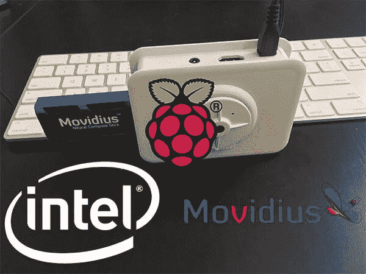
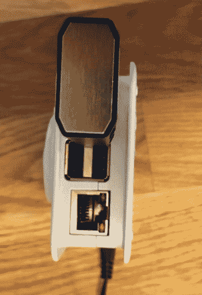
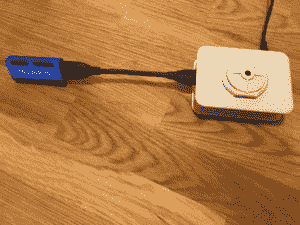

# 开始使用英特尔 Movidius 神经计算棒

> 原文：<https://pyimagesearch.com/2018/02/12/getting-started-with-the-intel-movidius-neural-compute-stick/>



让我问你三个问题:

1.  如果你能在 T2 的 u 盘上运行最先进的神经网络会怎么样？
2.  如果你能看到这个 u 盘上的**性能比你的 CPU 高 10 倍会怎么样？**
***   如果整个设备的价格低于 100 美元呢？**

 **听起来有趣吗？

**进入英特尔的 Movidius 神经计算棒(NCS)。**

Raspberry Pi 用户将*特别是*欢迎这款设备，因为它可以*显著*提高图像分类和物体检测的速度和能力。您可能会发现，Movidius“正是您所需要的”,它(1)外形小巧,( 2)价格实惠，可以加快网络推理时间。

在今天的帖子中，我们将讨论:

*   Movidius 神经计算棒的能力
*   如果你应该买一个
*   如何快速、轻松地使用 Movidius 开始跑步
*   在 MacBook Pro 和 Raspberry Pi 上比较网络推理时间的基准测试

下周，我将使用 Movidius 提供额外的基准和对象检测脚本。

**要开始使用英特尔 Movidius 神经计算棒并了解如何将 CNN 模型部署到您的 Raspberry Pi + NCS，*请继续阅读。***

***弃用声明:*** *本文使用的是 Movidius APIv1 和 APIv2，现在已经被 Intel 的 OpenVINO 软件取代，用于使用 Movidius NCS。[在这篇 PyImageSearch 文章](https://pyimagesearch.com/2019/04/08/openvino-opencv-and-movidius-ncs-on-the-raspberry-pi/)中了解更多关于 OpenVINO 的信息。*

## 开始使用英特尔 Movidius 神经计算棒

今天的博文分为五个部分。

首先，我来回答:

> 什么是英特尔 Movidius 神经计算棒，我是否应该购买一个？

接下来，我将解释使用 Movidius 神经计算棒的工作流程。整个过程相对简单，但需要详细说明，以便我们了解如何与 NCS 合作

然后，我们将把我们的 Raspberry Pi 与 NCS 一起设置为纯 API 模式。我们还会做一个快速的健全性检查，以确保我们与 NCS 有沟通。

接下来，我将介绍我的自定义 Raspberry Pi + Movidius NCS 图像分类基准脚本。我们将使用 SqueezeNet、GoogLeNet 和 AlexNet。

我们将通过比较基准测试结果来结束这篇博文。

### 什么是英特尔 Movidius 神经计算棒？

**英特尔的神经计算棒是一个 u 盘大小的深度学习机器。**

你可以把 NCS 想象成一个 USB 驱动的 GPU，尽管这有点言过其实——它不是 GPU，**它只能用于预测/推理，*而不是*训练。**

实际上，我会将 NCS 归类为协处理器。它只有一个目的:运行(向前传递)神经网络计算。在我们的例子中，我们将使用 NCS 进行图像分类。

NCS 应该*而不是*用于训练神经网络模型，而是为可部署模型而设计的。由于该设备旨在用于单板计算机，如 Raspberry Pi，因此功耗极低，因此不适合实际训练网络。

所以现在你在想:**我应该买 Movidius NCS 吗？**

在**只有 77 美元**时，NCS 打出了一记重拳。你可以在[亚马逊](http://amzn.to/2C9BkvV)或者英特尔网站上列出的任何一家[零售商那里购买这款设备。](https://developer.movidius.com/buy)

在 NCS 的引擎盖下是一个能够提供 80-150 GFLOPS 性能的 Myriad 2 处理器。这种处理器也被称为[视觉处理单元](https://www.movidius.com/solutions/vision-processing-unit)(或视觉加速器)，它仅消耗 1W 的功率(作为参考，Raspberry Pi 3 B 在 HDMI 关闭、led 关闭和 WiFi 打开的情况下消耗 1.2W 的功率)。

对您来说，购买 NCS 是否值得取决于几个问题的答案:

1.  你有立即使用的案例吗？或者你有 77 美元可以花在另一个玩具上吗？
2.  你愿意处理加入一个年轻社区的成长烦恼吗？虽然肯定有效，但我们不知道这些“视觉处理单元”是否会一直存在。
3.  你愿意为 SDK 贡献一台机器(或虚拟机)吗？
4.  Pi 用户:你愿意为 NCS 提供一个单独的 Pi 或至少一个单独的 microSD 吗？您是否知道，基于其外形尺寸，该设备将阻塞 3 个 USB 端口，除非您使用电缆连接 NCS 加密狗？

问题 1 由你决定。

我问问题 2 的原因是因为英特尔因文档质量差而臭名昭著，甚至像他们停止生产英特尔 Galileo 一样停止生产他们的产品。

我并不是说 NCS 会出现这两种情况。NCS 处于深度学习领域，目前正全速前进，因此该产品的未来看起来很光明。没有太多竞品也无妨。

问题 2 和问题 3(及其答案)是相关的。简而言之，您不能将开发环境与虚拟环境隔离开来，安装程序实际上*会从您的系统中删除*以前安装的 OpenCV。因此，您不应该在当前项目和工作环境附近获取安装程序脚本。我得到了惨痛的教训。相信我。

希望我没有把你吓跑——那不是我的本意。大多数人会购买 Movidius NCS 来搭配 Raspberry Pi 或其他单板电脑。

问题 4 是针对 Pi 用户的。说到 Pi，如果你一直在关注 PyImageSearch.com 的其他教程，你会知道我推荐 Python 虚拟环境来隔离你的 Python 项目和相关的依赖项。 **Python 虚拟环境是 Python 社区中的*最佳实践*。**

我对神经计算棒最大的不满之一是，英特尔的安装脚本实际上会让你的虚拟环境*几乎无法使用*。安装程序从 Debian/Ubuntu Aptitude repos 下载软件包，并更改 PYTHONPATH 系统变量。

它会很快变得很乱，为了安全起见，你应该使用一个新的 microSD ( [在亚马逊上购买一个 32GB 98MB/s 的 microSD](http://amzn.to/2C6GlFN))和 Raspbian Stretch。如果你在一个可部署的项目中工作，你甚至可以再买一个 Pi 来嫁给 NCS。

当我收到 NCS 时，我很兴奋地把它插入我的 Pi… *中，但不幸的是，我有了一个糟糕的开始。*

看看下面的图片。

我发现，随着 NCS 的插入，它阻塞了我的 Pi 上的所有其他 3 个 USB 端口。我甚至不能将我的无线键盘/鼠标转换器插入另一个端口！

现在，我知道 NCS 是为了与除 Raspberry Pi 之外的其他设备一起使用，但鉴于 Raspberry Pi 是最常用的单板系统之一，我有点惊讶英特尔没有考虑这一点——可能是因为该设备消耗大量电力，他们希望您在为您的 Pi 插入额外的外围设备时三思而行。

[](https://pyimagesearch.com/wp-content/uploads/2018/02/ncs-blocking-pi-usb.jpg)

**Figure 1:** The Intel Movidius NCS blocks the 3 other USB ports from easy access.

这非常令人沮丧。解决办法是买一个 6 英寸的 USB 3.0 扩展接口[，比如这个](http://amzn.to/2C8t1QY):

[](https://pyimagesearch.com/wp-content/uploads/2018/02/ncs-with-6in-dongle.jpg)

**Figure 2:** Using a 6in USB extension dongle with the Movidius NCS and Raspberry Pi allows access the other 3 USB ports.

考虑到这些因素，Movidius NCS 实际上是一款物有所值的好设备。让我们深入工作流程。

### Movidius NCS 工作流程

[](https://pyimagesearch.com/wp-content/uploads/2018/02/ncs-workflow.png)

**Figure 3:** The Intel Movidius NCS workflow (image credit: [Intel](https://qconsf.com/sf2017/system/files/presentation-slides/qconf_presentation.pdf))

***弃用声明:*** *本文使用的是 Movidius APIv1 和 APIv2，现在已经被 Intel 的 OpenVINO 软件取代，用于使用 Movidius NCS。[在这篇 PyImageSearch 文章](https://pyimagesearch.com/2019/04/08/openvino-opencv-and-movidius-ncs-on-the-raspberry-pi/)中了解更多关于 OpenVINO 的信息。*

一旦你理解了工作流程，使用 NCS 就很容易了。

底线是您需要一个 ***图形文件*** 来部署到 NCS。如果您愿意，这个图形文件可以与您的 Python 脚本放在同一个目录中——它将使用 NCS API 发送到 NCS。我包含了一些与这篇博文相关的带有 ***【下载】*** 的图形文件。

**一般来说，使用 NCS 的工作流程是:**

1.  使用一个**预先训练好的** TensorFlow/Caffe 模型*或者* **在 Ubuntu 或者 Debian 上用 TensorFlow/Caffe 训练一个网络**。
2.  使用 NCS SDK 工具链生成图形文件。
3.  将图形文件和 NCS 部署到运行 Debian 风格的 Linux 的单板计算机上。我用的是运行 Raspbian(基于 Debian)的 Raspberry Pi 3 B。
4.  使用 Python，使用 NCS API 将图形文件发送到 NCS，并请求对图像进行预测。处理预测结果，并根据结果采取(任意)行动。

今天，我们将使用 NCS API-only 模式工具链在中设置 Raspberry Pi。这个设置不包括生成图形文件的工具，也不安装 Caffe、Tensorflow 等。

然后，我们将创建自己的自定义图像分类基准脚本。你会注意到这个脚本在很大程度上基于之前的一篇关于使用树莓 Pi 和 OpenCVT3 进行深度学习的文章。

首先，让我们准备我们的树莓派。

### 在纯 API 模式下设置您的 Raspberry Pi 和 NCS

我吃了苦头才知道树莓派处理不了 SDK(我当时在想什么？)通过看一些稀疏的文档。

后来我从头开始，找到了更好的文档,指导我在纯 API 模式下设置我的 Pi(现在这有意义了)。我很快就以这种方式运行起来，我将向您展示如何做同样的事情。

**对于您的 Pi，我建议您在全新安装的 Raspbian Stretch 上以仅 API 模式安装 SDK。**

要在你的 Pi 上安装 Raspbian Stretch OS，在这里抓取 [Stretch 镜像，然后](https://www.raspberrypi.org/downloads/raspbian/)[使用这些指令](https://www.raspberrypi.org/documentation/installation/installing-images/README.md)刷新卡。

从那里，启动您的 Pi 并连接到 WiFi。如果您愿意，您可以通过 SSH 连接或使用显示器+键盘/鼠标(使用上面列出的 6 英寸加密狗，因为 USB 端口被 NCS 阻塞)来完成以下所有操作。

让我们更新系统:

```py
$ sudo apt-get update && sudo apt-get upgrade

```

然后让我们安装一堆软件包:

```py
$ sudo apt-get install -y libusb-1.0-0-dev libprotobuf-dev
$ sudo apt-get install -y libleveldb-dev libsnappy-dev
$ sudo apt-get install -y libopencv-dev
$ sudo apt-get install -y libhdf5-serial-dev protobuf-compiler
$ sudo apt-get install -y libatlas-base-dev git automake 
$ sudo apt-get install -y byacc lsb-release cmake 
$ sudo apt-get install -y libgflags-dev libgoogle-glog-dev 
$ sudo apt-get install -y liblmdb-dev swig3.0 graphviz 
$ sudo apt-get install -y libxslt-dev libxml2-dev 
$ sudo apt-get install -y gfortran 
$ sudo apt-get install -y python3-dev python-pip python3-pip 
$ sudo apt-get install -y python3-setuptools python3-markdown 
$ sudo apt-get install -y python3-pillow python3-yaml python3-pygraphviz
$ sudo apt-get install -y python3-h5py python3-nose python3-lxml 
$ sudo apt-get install -y python3-matplotlib python3-numpy 
$ sudo apt-get install -y python3-protobuf python3-dateutil 
$ sudo apt-get install -y python3-skimage python3-scipy 
$ sudo apt-get install -y python3-six python3-networkx

```

注意，我们已经从 Debian 仓库安装了`libopencv-dev`。这是我第一次推荐它，希望也是最后一次。通过 apt-get 安装 OpenCV(1)安装旧版本的 OpenCV，(2)不安装完整版本的 OpenCV，(3)不利用各种系统操作。再次声明，我*不*推荐这种方法安装 OpenCV。

此外，您可以看到我们正在安装一大堆包，我通常更喜欢在 Python 虚拟环境中使用 pip 来管理这些包。确保你使用的是一个新的存储卡，这样你就不会弄乱你 Pi 上正在做的其他项目。

由于我们使用 OpenCV 和 Python，我们将需要`python-opencv`绑定。Movidius 博客上的安装说明不包括这个工具。您可以通过输入以下内容来安装`python-opencv`绑定:

```py
$ sudo apt-get install -y python-opencv

```

让我们也安装 imutils 和 picamera API:

```py
$ pip install imutils
$ pip install “picamera[array]”

```

对于上面的`pip install`命令，我安装到了全局 Python 站点包中(没有虚拟环境)。

从这里，让我们创建一个工作区目录并克隆 NCSDK:

```py
$ cd ~
$ mkdir workspace
$ cd workspace
$ git clone https://github.com/movidius/ncsdk

```

现在，让我们克隆 NC 应用程序 Zoo，因为我们以后会用到它。

```py
$ git clone https://github.com/movidius/ncappzoo

```

从那里，导航到以下目录:

```py
$ cd ~/workspace/ncsdk/api/src

```

在该目录中，我们将使用 Makefile 以纯 API 模式安装 SDK:

```py
$ make
$ sudo make install

```

#### 测试 NCS 上的 Raspberry Pi 安装

让我们使用 NC 应用程序 Zoo 中的代码来测试安装。确保 NCS 在这一点上插入到您的 Pi 中。

```py
$ cd ~/workspace/ncappzoo/apps/hello_ncs_py
$ make run

making run
python3 hello_ncs.py;
Hello NCS! Device opened normally.
Goodbye NCS! Device closed normally.
NCS device working.

```

您应该会看到如上所示的确切输出。

### 使用预编译的图形文件

因为我们的 PI 上只有 API，所以我们必须依赖一个预先生成的图形文件来执行我们今天的分类项目。我已经在这篇博文的 ***【下载】*** 部分包含了相关的图形文件。

下周，我将向您展示如何使用安装在 Ubuntu 台式机/笔记本电脑上的成熟 SDK 来生成您自己的图形文件。

### 用 Movidius NCS 分类

如果您打开我们刚刚用 Makefile 创建的`run.py`文件，您会注意到大多数输入都是硬编码的，并且该文件通常很难看。

相反，我们将为分类和基准测试创建自己的文件。

在之前的一篇帖子 *[用 OpenCV](https://pyimagesearch.com/2017/10/02/deep-learning-on-the-raspberry-pi-with-opencv/)* 对树莓 Pi 进行深度学习中，我描述了如何使用 OpenCV 的 DNN 模块进行物体分类。

今天，我们将修改完全相同的脚本，使其与 Movidius NCS 兼容。

如果你比较一下这两个脚本，你会发现它们几乎是一样的。出于这个原因，我将简单地指出不同之处，所以我鼓励你参考[之前的帖子](https://pyimagesearch.com/2017/10/02/deep-learning-on-the-raspberry-pi-with-opencv/)以获得完整的解释。

每一个脚本都包含在这篇博文的 ***【下载】*** 部分，所以请务必打开 zip 并跟随它。

让我们回顾一下名为`pi_ncs_deep_learning.py`的*修改后的*文件的不同之处:

```py
# import the necessary packages
from mvnc import mvncapi as mvnc
import numpy as np
import argparse
import time
import cv2

```

这里我们正在导入我们的包——唯一的不同是在**行 2** ,在这里我们导入`mvncapi as mvnc`。这个导入是针对 NCS API 的。

从那里，我们需要解析我们的命令行参数:

```py
# construct the argument parse and parse the arguments
ap = argparse.ArgumentParser()
ap.add_argument("-i", "--image", required=True,
	help="path to input image")
ap.add_argument("-g", "--graph", required=True,
	help="path to graph file")
ap.add_argument("-d", "--dim", type=int, required=True,
	help="dimension of input to network")
ap.add_argument("-l", "--labels", required=True,
	help="path to ImageNet labels (i.e., syn-sets)")
args = vars(ap.parse_args())

```

在这个模块中，*删除了*两个参数(`--prototxt`和`--model`)，而*添加了*两个参数(`--graph`和`--dim`)。

`--graph`参数是我们的图形文件的路径——它代替了 prototxt 和 model。

图形文件可以通过 NCS SDK 生成，我们将在下周的博客文章中介绍。为了方便起见，我在 ***“下载*****中包含了本周的图形文件。在 Caffe 的情况下，图形是通过 SDK 从 prototxt 和模型文件中生成的。**

 **`--dim`参数简单地指定了我们将通过神经网络发送的(正方形)图像的像素尺寸。图片的尺寸在[之前的文章](https://pyimagesearch.com/2017/10/02/deep-learning-on-the-raspberry-pi-with-opencv/)中被硬编码。

接下来，我们将从磁盘加载类标签和输入图像:

```py
# load the class labels from disk
rows = open(args["labels"]).read().strip().split("\n")
classes = [r[r.find(" ") + 1:].split(",")[0] for r in rows]

# load the input image from disk, make a copy, resize it, and convert to float32
image_orig = cv2.imread(args["image"])
image = image_orig.copy()
image = cv2.resize(image, (args["dim"], args["dim"]))
image = image.astype(np.float32)

```

这里我们用和前面一样的方法从`synset_words.txt`加载类标签。

然后，我们利用 OpenCV 加载图像。

一个微小的变化是我们在第 26 行制作了原始图像的副本。我们需要两份拷贝——一份用于预处理/标准化/分类，一份用于稍后在屏幕上显示。

**第 27 行**调整我们的图像大小，你会注意到我们使用了`args["dim"]`——我们的命令行参数值。

输入到卷积神经网络的宽度和高度图像尺寸的常见选择包括 32 × 32、64 × 64、224 × 224、227 × 227、256 × 256 和 299 × 299。您的确切图像尺寸将取决于您使用的 CNN。

**第 28 行**将图像数组数据转换为`float32`格式，这是*NCS 和我们正在处理的图形文件的*要求。

接下来，我们执行均值减法，但我们将以稍微不同的方式进行:

```py
# load the mean file and normalize
ilsvrc_mean = np.load("ilsvrc_2012_mean.npy").mean(1).mean(1)
image[:,:,0] = (image[:,:,0] - ilsvrc_mean[0])
image[:,:,1] = (image[:,:,1] - ilsvrc_mean[1])
image[:,:,2] = (image[:,:,2] - ilsvrc_mean[2])

```

我们在第 31 行的**处加载`ilsvrc_2012_mean.npy`文件。这来自 ImageNet 大规模视觉识别挑战，可用于 SqueezeNet、GoogLeNet、AlexNet，以及通常在 ImageNet 上训练的所有其他利用均值减法的网络(为此我们硬编码了路径)。**

在第 32-34 行上计算图像均值减影(使用 GitHub 上的 Movidius [示例脚本中显示的相同方法)。](https://github.com/movidius/ncsdk/tree/master/examples/caffe)

从那里，我们需要与 NCS 建立通信，并将图形加载到 NCS 中:

```py
# grab a list of all NCS devices plugged in to USB
print("[INFO] finding NCS devices...")
devices = mvnc.EnumerateDevices()

# if no devices found, exit the script
if len(devices) == 0:
	print("[INFO] No devices found. Please plug in a NCS")
	quit()

# use the first device since this is a simple test script
print("[INFO] found {} devices. device0 will be used. "
	"opening device0...".format(len(devices)))
device = mvnc.Device(devices[0])
device.OpenDevice()

# open the CNN graph file
print("[INFO] loading the graph file into RPi memory...")
with open(args["graph"], mode="rb") as f:
	graph_in_memory = f.read()

# load the graph into the NCS
print("[INFO] allocating the graph on the NCS...")
graph = device.AllocateGraph(graph_in_memory)

```

可以看出，上面的代码块*完全不同*，因为上次我们根本没有使用 NCS。

让我们走一遍——它实际上非常简单。

为了准备在 NCS 上使用神经网络，我们需要执行以下操作:

1.  列出所有连接的 NCS 设备(**行 38** )。
2.  如果发现一个 NCS 有问题，就完全脱离脚本(**第 41-43 行**)。
3.  选择并打开`device0` ( **线 48 和 49** )。
4.  将图形文件加载到 Raspberry Pi 内存中，以便我们可以使用 API 将其传输到 NCS(**第 53 行和第 54 行**)。
5.  在 NCS 上加载/分配图表(**行 58** )。

**m ovidius 的开发者肯定说对了— *他们的 API 非常容易使用！***

如果你在上面错过了，这里值得注意的是，我们正在加载一个*预训练的*图。训练步骤已经在一台更强大的机器上执行过，图形是由 NCS SDK 生成的。训练你自己的网络不在这篇博文的讨论范围之内，但是在 [PyImageSearch 大师](https://pyimagesearch.com/pyimagesearch-gurus/)和[用 Python 进行计算机视觉深度学习](https://pyimagesearch.com/deep-learning-computer-vision-python-book/) 中有详细介绍。

如果你读了前一篇文章，你会认出下面的代码块，但是你会注意到三个变化:

```py
# set the image as input to the network and perform a forward-pass to
# obtain our output classification
start = time.time()
graph.LoadTensor(image.astype(np.float16), "user object")
(preds, userobj) = graph.GetResult()
end = time.time()
print("[INFO] classification took {:.5} seconds".format(end - start))

# clean up the graph and device
graph.DeallocateGraph()
device.CloseDevice()

# sort the indexes of the probabilities in descending order (higher
# probabilitiy first) and grab the top-5 predictions
preds = preds.reshape((1, len(classes)))
idxs = np.argsort(preds[0])[::-1][:5]

```

这里我们将使用 NCS 和 API 对图像进行分类。

使用我们的 graph 对象，我们调用`graph.LoadTensor`进行预测，调用`graph.GetResult`获取结果预测。这是一个两步操作，之前我们只是在一行中简单地调用了`net.forward`。

我们对这些操作进行计时，以计算我们的基准，同时像前面一样向终端显示结果。

接下来，我们通过清除图形存储器并关闭**线 69 和 70** 上的 NCS 连接来执行我们的内务处理任务。

从这里开始，我们还有一个剩余的块来将我们的图像显示到屏幕上(有一个非常小的变化):

```py
# loop over the top-5 predictions and display them
for (i, idx) in enumerate(idxs):
	# draw the top prediction on the input image
	if i == 0:
		text = "Label: {}, {:.2f}%".format(classes[idx],
			preds[0][idx] * 100)
		cv2.putText(image_orig, text, (5, 25), cv2.FONT_HERSHEY_SIMPLEX,
			0.7, (0, 0, 255), 2)

	# display the predicted label + associated probability to the
	# console
	print("[INFO] {}. label: {}, probability: {:.5}".format(i + 1,
		classes[idx], preds[0][idx]))

# display the output image
cv2.imshow("Image", image_orig)
cv2.waitKey(0)

```

在这个块中，我们在图像的顶部绘制最高的预测和概率。我们还在终端中打印前 5 个预测+概率。

这个模块中非常小的变化是我们在`image_orig`而不是`image`上绘制文本。

最后，我们在屏幕上显示输出`image_orig`。如果你使用 SSH 来连接你的 Raspberry Pi，只有当你在 SSH 连接到你的 Pi 时为 X11 转发提供了`-X`标志，这才会起作用。

要查看使用英特尔 Movidius 神经计算棒和 Python 在 Raspberry Pi 上应用深度学习图像分类的结果，请进入下一部分。

### 树莓 Pi 和深度学习结果

对于该基准测试，我们将比较使用 Pi CPU 和使用 Pi 与 NCS 协处理器的对比。

只是为了好玩，我还加入了我的 Macbook Pro 使用和不使用 NCS 的结果(这需要一个 Ubuntu 16.04 VM，我们将在下周构建和配置)。

我们将使用三种模型:

1.  斯奎泽尼
2.  谷歌网
3.  AlexNet

为了简单起见，我们每次都会对同一张图片进行分类——理发椅:

[](https://pyimagesearch.com/wp-content/uploads/2018/02/barbershop.png)

**Figure 4:** A barber chair in a barbershop is our test input image for deep learning on the Raspberri Pi with the Intel Movidius Neural Compute Stick.

由于终端输出结果相当长，我将把它们排除在后面的块之外。相反，为了便于比较，我将分享一个结果表。

下面是**个 CPU 命令**(尽管文件名中有`pi`，但实际上你可以在你的 Pi 或台式机/笔记本电脑上运行这个命令):

```py
# SqueezeNet with OpenCV DNN module using the CPU
$ python pi_deep_learning.py --prototxt models/squeezenet_v1.0.prototxt \
	--model models/squeezenet_v1.0.caffemodel --dim 227 \
	--labels synset_words.txt --image images/barbershop.png
[INFO] loading model...
[INFO] classification took 0.42588 seconds
[INFO] 1\. label: barbershop, probability: 0.8526
[INFO] 2\. label: barber chair, probability: 0.10092
[INFO] 3\. label: desktop computer, probability: 0.01255
[INFO] 4\. label: monitor, probability: 0.0060597
[INFO] 5\. label: desk, probability: 0.004565

# GoogLeNet with OpenCV DNN module using the CPU
$ python pi_deep_learning.py --prototxt models/bvlc_googlenet.prototxt \
	--model models/bvlc_googlenet.caffemodel --dim 224 \
	--labels synset_words.txt --image images/barbershop.png
...

# AlexNet with OpenCV DNN module using the CPU
$ python pi_deep_learning.py --prototxt models/bvlc_alexnet.prototxt \
	--model models/bvlc_alexnet.caffemodel --dim 227 \
	--labels synset_words.txt --image images/barbershop.png
...

```

***注意:**为了使用 OpenCV DNN 模块，您必须至少安装 OpenCV 3.3。你可以使用这些指令在你的树莓 Pi 上安装一个优化的 OpenCV 3.3。*

这里是 **NCS 命令**，使用我们刚刚走过的新的*修改过的*脚本(你实际上可以在你的 Pi 或你的桌面/笔记本电脑上运行这个，尽管文件名中有`pi`):

```py
# SqueezeNet on NCS
$ python pi_ncs_deep_learning.py --graph graphs/squeezenetgraph \
	--dim 227 --labels synset_words.txt --image images/barbershop.png
[INFO] finding NCS devices...
[INFO] found 1 devices. device0 will be used. opening device0...
[INFO] loading the graph file into RPi memory...
[INFO] allocating the graph on the NCS...
[INFO] classification took 0.085902 seconds
[INFO] 1\. label: barbershop, probability: 0.94482
[INFO] 2\. label: restaurant, probability: 0.013901
[INFO] 3\. label: shoe shop, probability: 0.010338
[INFO] 4\. label: tobacco shop, probability: 0.005619
[INFO] 5\. label: library, probability: 0.0035152

# GoogLeNet on NCS
$ python pi_ncs_deep_learning.py --graph graphs/googlenetgraph \
	--dim 224 --labels synset_words.txt --image images/barbershop.png
...

# AlexNet on NCS
$ python pi_ncs_deep_learning.py --graph graphs/alexnetgraph \
	--dim 227 --labels synset_words.txt --image images/barbershop.png
...

```

***注意:**为了使用 NCS，你必须有一个装载了 Raspbian(最好是 Stretch)的 Raspberry Pi，并且按照这篇博文中的说明安装了 NCS API-only 模式工具链。或者，你可以使用 Ubuntu 机器或虚拟机。*

请**注意两个*N*otes 以上**。你需要两张 ***独立的*** microSD 卡来完成这些实验。NCS 纯 API 模式工具链使用 OpenCV 2.4，因此没有新的 DNN 模块。您不能在 NCS 中使用虚拟环境，因此您需要完全隔离的系统。帮自己一个忙，弄几张备用的 microSD 卡——我喜欢 [32 GB 98MB/s 卡](http://amzn.to/2EuK6tD)。双引导你的 Pi 可能是一个选择，但我从未尝试过，也不想处理分区 microSD 卡的麻烦。

现在将结果汇总在一张表中:

[](https://pyimagesearch.com/wp-content/uploads/2018/02/ncs-benchmark-table.png)

**Figure 5:** Intel NCS with the Raspberry Pi benchmarks. I compared classification using the Pi CPU and using the Movidius NCS. On ImageNet, the NCS achieves a 395 to 545% speedup.

与使用 Pi 的 CPU 进行分类相比，NCS 在 Pi 上的速度明显更快，在 GoogLeNet 上实现了 6.45 倍的加速(545%)。NCS 肯定会给更大的网络带来显著的速度，比如这里比较的三个网络。

***注:**树莓 Pi 上收集的结果使用了我的[优化的 OpenCV 安装指令。](https://pyimagesearch.com/2017/10/09/optimizing-opencv-on-the-raspberry-pi/)如果你没有使用优化的 OpenCV 安装，你会看到加速在 **10-11x 的范围内！***

当比较我的 MacBook Pro 和 Ubuntu 虚拟机与我的 MBP 上的 SDK 虚拟机时，性能更差——这是意料之中的，原因有很多。

首先，我的 MBP 有一个更强大的 CPU。事实证明，在 CPU 上运行完整的推理要比将图像从 CPU 移动到 NCS，然后将结果拉回来的额外开销更快。

第二，当对虚拟机进行 USB 直通时，存在 USB 开销。VirtualBox USB passthrough 也不支持 USB 3。

值得注意的是，树莓派 3 B 有 USB 2.0。如果你真的想要单板计算机设置的速度，选择支持 USB 3.0 的机器。如果您进行基准测试，数据传输速度本身就很明显。

当我们比较实时视频 FPS 基准时，下周的结果将更加明显，所以请务必在周一回来查看。

## 从这里去哪里？

我很快会带着另一篇博文回来，与你分享如何为 Movidius NCS 生成你自己的自定义图形文件。

我还将描述如何使用 Movidius NCS 在实时视频中执行对象检测，我们将对 FPS 加速进行基准测试和比较，我想您会对此印象深刻。

与此同时，请务必查看 Movidius 博客和 TopCoder 竞赛。

### GitHub 上的 Movidus 博客

英特尔和 Movidius 正在 GitHub 上更新他们的博客。请务必将他们的页面加入书签和/或订阅 RSS:

[developer.movidius.com/blog](http://developer.movidius.com/blog)

你也可以登录 GitHub，点击 Movidius repos 上的“观看”按钮:

*   [github.com/movidius/ncsdk](https://github.com/movidius/ncsdk)
*   [github.com/movidius/ncappzoo](https://github.com/movidius/ncappzoo)

### TopCoder 竞赛

[](https://pyimagesearch.com/wp-content/uploads/2018/02/topcoder.png)

**Figure 5:** Earn up to $8,000 with the Movidius NCS on TopCoder.

您有兴趣挑战英特尔 Movidius 神经计算棒的极限吗？

英特尔正在赞助一项关于 TopCoder 的[竞赛。](https://community.topcoder.com/tc?module=MatchDetails&rd=17058)

有 **$20，000** 的奖品可供争夺(**第一名赢得$8，000** )！

注册和提交截止日期为**2018 年 2 月 26 日**。

跟踪[排行榜和排名](https://community.topcoder.com/longcontest/?module=ViewStandings&rd=17058)！

## 摘要

今天，我们探索了英特尔的新 Movidius 神经计算棒。我今天在这里的目标是向您展示这种新的深度学习设备(我们也将在未来的博客帖子中使用)。我还演示了如何使用 NCS 工作流和 API。

一般来说，NCS 工作流程包括:

1.  使用运行 Ubuntu/Debian 的机器用 Tensorflow 或 Caffe 训练网络(或使用预训练的网络)。
2.  使用 NCS SDK 生成图形文件。
3.  将图形文件和 NCS 部署到运行 Debian 风格的 Linux 的单板计算机上。我们使用了运行 Raspbian(基于 Debian)的 Raspberry Pi 3 B。
4.  执行推理、分类、对象检测等。

今天，我们跳过了第 1 步和第 2 步。相反，我提供图形文件，你可以立即在你的 Pi 上开始使用。

然后，我们编写了自己的分类基准测试 Python 脚本，并对结果进行了分析，结果表明在 Raspberry Pi 上实现了显著的 10 倍加速。

到目前为止，NCS 的功能给我留下了非常深刻的印象——它与 Raspberry Pi 配合得非常好，我认为如果(1)你有它的用例，或者(2)你只是想修改和修补，它就有很大的价值。

我希望您喜欢今天关于英特尔新的 Movidius 神经计算棒的介绍文章！

**为了及时了解 PyImageSearch 博客帖子、销售和活动，例如 [PyImageConf](http://pyimageconf.com) 、*，请务必在下表中输入您的电子邮件地址。***

***弃用声明:*** *本文使用的是 Movidius APIv1 和 APIv2，现在已经被 Intel 的 OpenVINO 软件取代，用于使用 Movidius NCS。[在这篇 PyImageSearch 文章](https://pyimagesearch.com/2019/04/08/openvino-opencv-and-movidius-ncs-on-the-raspberry-pi/)中了解更多关于 OpenVINO 的信息。*****