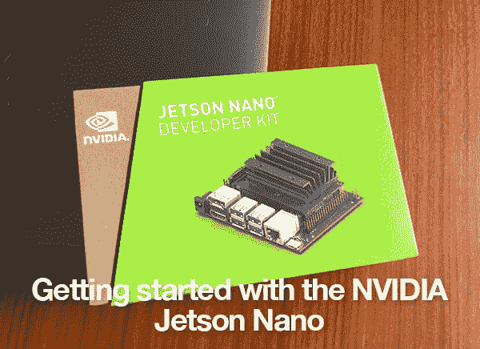
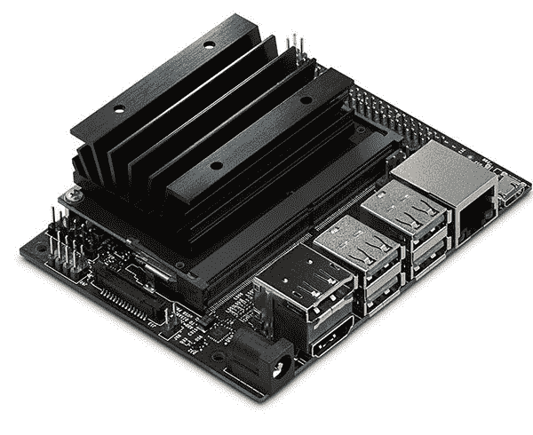
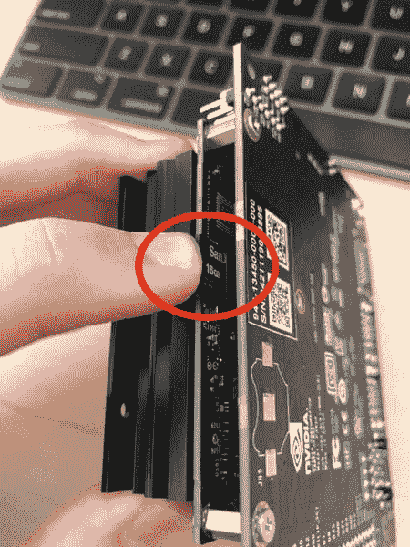
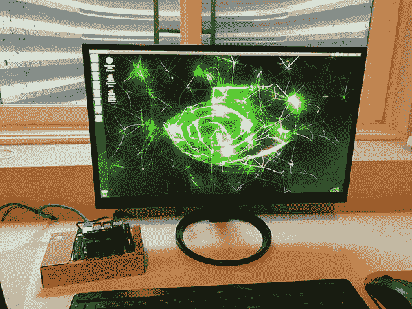

# NVIDIA Jetson Nano 入门

> 原文：<https://pyimagesearch.com/2019/05/06/getting-started-with-the-nvidia-jetson-nano/>

[](https://pyimagesearch.com/wp-content/uploads/2019/05/jetson_nano_geting_started_header.jpg)

在本教程中，您将了解如何开始使用 NVIDIA Jetson Nano，包括:

*   第一次开机
*   安装系统软件包和先决条件
*   配置 Python 开发环境
*   在 Jetson Nano 上安装 Keras 和 TensorFlow
*   更改默认摄像机
*   利用 Jetson Nano 进行分类和目标探测

我还会一路提供我的评论，包括当我设置我的 Jetson Nano 时是什么绊倒了我，确保你避免我犯的同样的错误。

当您完成本教程时，您的 NVIDIA Jetson Nano 将配置完毕，并准备好进行深度学习！

**要了解如何开始使用 NVIDIA Jetson Nano，*请继续阅读！***

## NVIDIA Jetson Nano 入门

[](https://pyimagesearch.com/wp-content/uploads/2019/05/jetson_nano_getting_started_board.jpg)

**Figure 1:** In this blog post, we’ll get started with the NVIDIA Jetson Nano, an AI edge device capable of 472 GFLOPS of computation. At around $100 USD, the device is packed with capability including a Maxwell architecture 128 CUDA core GPU covered up by the massive heatsink shown in the image. ([image source](https://www.nvidia.com/en-us/autonomous-machines/embedded-systems/jetson-nano/))

在本教程的第一部分，您将学习如何下载和刷新 NVIDIA Jetson Nano。img 文件到你的微型 SD 卡。然后，我将向您展示如何安装所需的系统包和先决条件。

在那里，您将配置您的 Python 开发库，并学习如何**在您的设备上安装 Jetson 纳米优化版的 Keras 和 TensorFlow** 。

然后，我将向您展示如何在您的 Jetson Nano 上使用摄像头，甚至在 Nano 上执行**图像分类和物体检测。**

然后，我们将通过对 Jetson Nano 的简短讨论来结束本教程，NVIDIA Jetson Nano、Google Coral 和 Movidius NCS 之间的完整基准测试和比较将在未来的博客文章中发布。

### 在开始使用杰特森纳米之前

在你启动你的 NVIDIA Jetson Nano 之前，你需要三样东西:

1.  一张 micro-SD 卡( ***)最低* 16GB**
2.  5V 2.5A 微型 USB 电源
3.  以太网电缆

我很想强调一下 16GB micro-SD 卡的*最小值*。我第一次配置我的 Jetson Nano 时，我使用了 16GB 的卡，但这个空间很快就被耗尽了*，特别是当我安装了 Jetson 推理库，它将下载几千兆字节的预训练模型。*

 *因此，*我向*推荐一款 32GB 的微型 SD 卡给你的 Nano。

其次，当谈到你的 5V 2.5A MicroUSB 电源时，在他们的文档中 NVIDIA [特别推荐了 Adafruit](https://www.adafruit.com/product/1995) 的这款。

最后，你 ***将需要一个以太网电缆*** 时，与杰特森纳米，我觉得真的，*真的*令人沮丧。

NVIDIA Jetson Nano 被宣传为一款强大的物联网和人工智能边缘计算设备…

*…如果是这样的话，**为什么设备上没有 WiFi 适配器？***

我不理解英伟达的决定，我也不认为应该由产品的最终用户来决定“自带 WiFi 适配器”。

如果目标是将人工智能引入物联网和边缘计算，那么应该有 WiFi。

但是我跑题了。

你可以在这里阅读更多关于 NVIDIA 对 Jetson Nano 的推荐。

### 下载并闪存。img 文件到您的微型 SD 卡

在我们开始在 Jetson Nano 上安装任何软件包或运行任何演示之前，我们首先需要从 NVIDIA 的网站上下载 Jetson Nano 开发者套件 SD 卡映像 。

NVIDIA 提供了用于刷新的文档。img 文件保存到 micro-SD 卡，适用于 [Windows、macOS 和 Linux](https://developer.nvidia.com/embedded/learn/get-started-jetson-nano-devkit#write)——您应该选择适合您特定操作系统的闪存指令。

### NVIDIA Jetson Nano 的第一次启动

下载并刷新了。img 文件到您的 micro-SD 卡，将卡插入 micro-SD 卡插槽。

我费了好大劲才找到卡槽——它实际上在热同步下面，就在我手指指向的地方:

[](https://pyimagesearch.com/wp-content/uploads/2019/05/jetson_nano_getting_started_sd_slot.jpg)

**Figure 2:** Where is the microSD card slot on the NVIDIA Jetson Nano? The microSD receptacle is hidden under the heatsink as shown in the image.

我认为英伟达可以让这个槽更明显一点，或者至少在他们的网站上更好地记录下来。

将 micro-SD 卡滑回家后，接上电源，开机。

假设您的 Jetson Nano 连接到 HDMI 输出，您应该会看到屏幕上显示以下内容(或类似内容):

[](https://pyimagesearch.com/wp-content/uploads/2019/05/jetson_nano_getting_started_boot_up.jpg)

**Figure 3:** To get started with the NVIDIA Jetson Nano AI device, just flash the .img (preconfigured with Jetpack) and boot. From here we’ll be installing TensorFlow and Keras in a virtual environment.

然后，Jetson Nano 将引导您完成安装过程，包括设置您的用户名/密码、时区、键盘布局等。

### 安装系统软件包和先决条件

在本指南的剩余部分，我将向您展示如何为深度学习配置您的 NVIDIA Jetson Nano，包括:

*   安装系统软件包先决条件。
*   在 Jetson Nano 上安装 Keras、TensorFlow 和 Keras。
*   安装 Jetson 推理引擎。

让我们从安装所需的系统包开始:

```py
$ sudo apt-get install git cmake
$ sudo apt-get install libatlas-base-dev gfortran
$ sudo apt-get install libhdf5-serial-dev hdf5-tools
$ sudo apt-get install python3-dev

```

如果你有一个良好的互联网连接，上述命令应该只需要几分钟就可以完成。

### 配置 Python 环境

下一步是配置我们的 Python 开发环境。

我们先安装`pip`，Python 的包管理器:

```py
$ wget https://bootstrap.pypa.io/get-pip.py
$ sudo python3 get-pip.py
$ rm get-pip.py

```

在本指南中，我们将使用 Python 虚拟环境来保持我们的 Python 开发环境*相互独立*和*相互分离*。

使用 Python 虚拟环境是**最佳实践**，并且将帮助您避免为您想要在 Jetson Nano 上使用的*每个*开发环境维护微 SD。

为了管理我们的 Python 虚拟环境，我们将使用 [virtualenv](https://virtualenv.readthedocs.io/en/latest/) 和 [virtualenvwrapper](https://virtualenvwrapper.readthedocs.io/en/latest/) ，我们可以使用以下命令安装它们:

```py
$ sudo pip install virtualenv virtualenvwrapper

```

一旦我们安装了`virtualenv`和`virtualenvwrapper`，我们需要更新我们的`~/.bashrc`文件。我选择使用`nano`，但是你可以使用你最喜欢的编辑器:

```py
$ nano ~/.bashrc

```

向下滚动到`~/.bashrc`文件的底部，添加以下几行:

```py
# virtualenv and virtualenvwrapper
export WORKON_HOME=$HOME/.virtualenvs
export VIRTUALENVWRAPPER_PYTHON=/usr/bin/python3
source /usr/local/bin/virtualenvwrapper.sh

```

添加完以上几行后，保存并退出编辑器。

接下来，我们需要使用`source`命令重新加载`~/.bashrc`文件的内容:

```py
$ source ~/.bashrc

```

我们现在可以使用`mkvirtualenv`命令创建一个 Python 虚拟环境——我将我的虚拟环境命名为`deep_learning`,但是您可以随意命名:

```py
$ mkvirtualenv deep_learning -p python3

```

### 在 NVIDIA Jetson Nano 上安装 TensorFlow 和 Keras

在我们可以在 Jetson Nano 上安装 TensorFlow 和 Keras 之前，我们首先需要安装 NumPy。

首先，使用`workon`命令确保您在`deep_learning`虚拟环境中:

```py
$ workon deep_learning

```

从那里，您可以安装 NumPy:

```py
$ pip install numpy

```

在我的 Jetson Nano 上安装 NumPy 需要大约 10-15 分钟，因为它必须在系统上编译(目前没有针对 Jetson Nano 的预建版本的 NumPy)。

下一步是在 Jetson Nano 上安装 Keras 和 TensorFlow。你可能很想做一个简单的`pip install tensorflow-gpu`——***不要这样做！***

相反，NVIDIA 已经为 Jetson Nano 提供了一个 T2 官方的 TensorFlow 版本。

您可以使用以下命令安装正式的 Jetson Nano TensorFlow:

```py
$ pip install --extra-index-url https://developer.download.nvidia.com/compute/redist/jp/v42 tensorflow-gpu==1.13.1+nv19.3

```

在我的 Jetson Nano 上安装 NVIDIA 的`tensorflow-gpu`包花了大约 40 分钟。

这里的最后一步是安装 SciPy 和 Keras:

```py
$ pip install scipy
$ pip install keras

```

这些安装需要大约 35 分钟。

### 在 Nano 上编译和安装 Jetson 推理

杰特森纳米。img 已经安装了 JetPack，所以我们可以立即跳到[构建 Jetson 推理引擎。](https://github.com/dusty-nv/jetson-inference/blob/master/docs/building-repo-2.md)

第一步是克隆出`jetson-inference`回购:

```py
$ git clone https://github.com/dusty-nv/jetson-inference
$ cd jetson-inference
$ git submodule update --init

```

然后我们可以使用`cmake`来配置构建。

```py
$ mkdir build
$ cd build
$ cmake ..

```

**运行`cmake`时有两件重要的事情需要注意:**

1.  `cmake`命令将要求 root 权限，所以在您提供 root 凭证之前不要离开 Nano。
2.  在配置过程中，`cmake`还将**下载几千兆字节的预训练样本模型。**确保你的微型 SD 卡上有几个 GB 的空间。(这也是为什么我推荐一张 **32GB** microSD 卡而不是 16GB 卡)。

在`cmake`完成构建配置后，我们可以编译并安装 Jetson 推理引擎:

```py
$ make
$ sudo make install

```

在 Nano 上编译和安装 Jetson 推理引擎只花了 3 分多钟。

### 安装 OpenCV 怎么样？

我决定在以后的教程中介绍如何在 Jetson Nano 上安装 OpenCV。为了在 Nano 上充分利用 OpenCV，需要设置许多`cmake`配置，坦率地说，这篇文章已经够长了。

同样，我将在未来的教程中介绍如何在 Jetson Nano 上配置和安装 OpenCV。

### 运行 NVIDIA Jetson Nano 演示

使用 NVIDIA Jetson Nano 时，您有两种输入相机设备选项:

1.  CSI 相机模块，如 Raspberry Pi 相机模块(顺便说一下，该模块与 Jetson Nano 兼容)
2.  USB 网络摄像头

我目前正在为我即将出版的书使用我所有的树莓 Pi 相机模块， [*树莓 Pi 用于计算机视觉*](https://www.kickstarter.com/projects/adrianrosebrock/raspberry-pi-for-computer-vision-ebook) ，所以我决定使用我的[罗技 C920](https://amzn.to/2J2gYMm) ，它与 Nano 即插即用兼容(你也可以使用更新的[罗技 C960](https://amzn.to/2DDAkUm) )。

Jetson Nano 推理库包含的示例可在`jetson-inference`中找到:

*   `detectnet-camera`:使用*摄像机*作为输入进行物体检测。
*   `detectnet-console`:也执行物体检测，但是使用输入的*图像*而不是摄像机。
*   `imagenet-camera`:使用*摄像机*进行图像分类。
*   `imagenet-console`:使用在 ImageNet 数据集上预先训练的网络对输入的*图像*进行分类。
*   `segnet-camera`:对输入的*摄像头*进行语义分割。
*   `segnet-console`:也执行语义分割，但是是在*图像*上。
*   其他一些例子也包括在内，包括深度单应估计和超分辨率。

然而，为了运行这些例子，我们需要稍微修改一下各个摄像机的源代码。

在每个示例中，您会看到`DEFAULT_CAMERA`值被设置为`-1`，这意味着应该使用连接的 CSI 摄像机。

然而，由于我们使用的是 USB 摄像头，我们需要将`DEFAULT_CAMERA`值从`-1`更改为 `0`(或者任何正确的`/dev/video` V4L2 摄像头)。

**幸运的是，这个改变超级容易做到！**

先以图像分类为例。

首先，将目录更改为`~/jetson-inference/imagenet-camera`:

```py
$ cd ~/jetson-inference/imagenet-camera

```

从那里，打开`imagenet-camera.cpp`:

```py
$ nano imagenet-camera.cpp

```

然后，您需要向下滚动到大约 ***的第 37*** 行，在那里您将看到`DEFAULT_CAMERA`值:

```py
#define DEFAULT_CAMERA -1        // -1 for onboard camera, or change to index of /dev/video V4L2 camera (>=0)    

```

只需将该值从`-1`更改为 `0`:

```py
#define DEFAULT_CAMERA 0        // -1 for onboard camera, or change to index of /dev/video V4L2 camera (>=0)    

```

从那里，保存并退出编辑器。

编辑完 C++文件后，您需要重新编译示例，简单如下:

```py
$ cd ../build
$ make
$ sudo make install

```

请记住，`make`足够聪明，不会让*而不是*重新编译整个库。它将*只*重新编译已经改变的文件(在这种情况下，ImageNet 分类的例子)。

编译完成后，转到`aarch64/bin`目录并执行`imagenet-camera`二进制文件:

```py
$ cd aarch64/bin/
$ ./imagenet-camera
imagenet-camera
  args (1):  0 [./imagenet-camera]  

[gstreamer] initialized gstreamer, version 1.14.1.0
[gstreamer] gstCamera attempting to initialize with GST_SOURCE_NVCAMERA
[gstreamer] gstCamera pipeline string:
v4l2src device=/dev/video0 ! video/x-raw, width=(int)1280, height=(int)720, format=YUY2 ! videoconvert ! video/x-raw, format=RGB ! videoconvert !appsink name=mysink
[gstreamer] gstCamera successfully initialized with GST_SOURCE_V4L2

imagenet-camera:  successfully initialized video device
    width:  1280
   height:  720
    depth:  24 (bpp)

imageNet -- loading classification network model from:
         -- prototxt     networks/googlenet.prototxt
         -- model        networks/bvlc_googlenet.caffemodel
         -- class_labels networks/ilsvrc12_synset_words.txt
         -- input_blob   'data'
         -- output_blob  'prob'
         -- batch_size   2

[TRT]  TensorRT version 5.0.6
[TRT]  detected model format - caffe  (extension '.caffemodel')
[TRT]  desired precision specified for GPU: FASTEST
[TRT]  requested fasted precision for device GPU without providing valid calibrator, disabling INT8
[TRT]  native precisions detected for GPU:  FP32, FP16
[TRT]  selecting fastest native precision for GPU:  FP16
[TRT]  attempting to open engine cache file networks/bvlc_googlenet.caffemodel.2.1.GPU.FP16.engine
[TRT]  loading network profile from engine cache... networks/bvlc_googlenet.caffemodel.2.1.GPU.FP16.engine
[TRT]  device GPU, networks/bvlc_googlenet.caffemodel loaded

```

在这里，您可以看到 GoogLeNet 被加载到内存中，之后推理开始:

<https://www.youtube.com/embed/vnpUmI0xy0g?feature=oembed>*