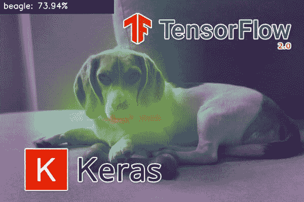
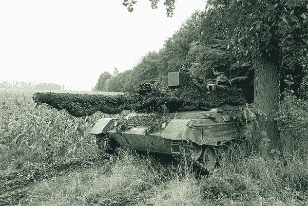
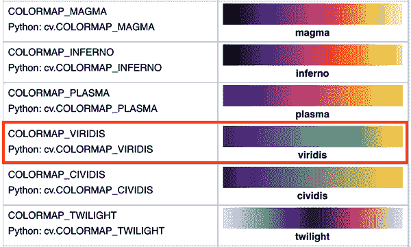
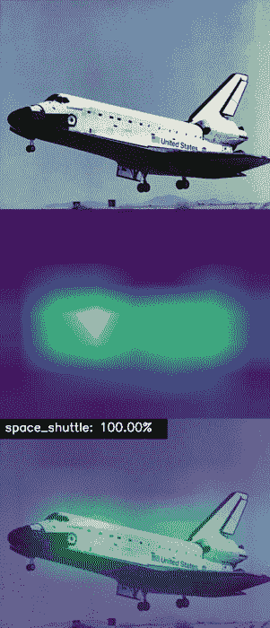
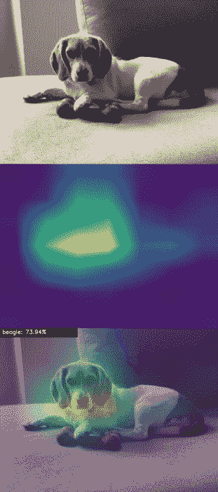
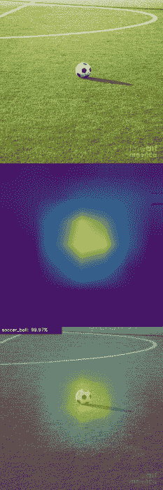

# Grad-CAM:使用 Keras、TensorFlow 和深度学习可视化类激活图

> 原文：<https://pyimagesearch.com/2020/03/09/grad-cam-visualize-class-activation-maps-with-keras-tensorflow-and-deep-learning/>

[](https://pyimagesearch.com/wp-content/uploads/2020/03/keras_gradcam_header.jpg)

在本教程中，您将学习如何使用一种称为 Grad-CAM 的算法来可视化用于调试深度神经网络的类激活图。然后我们将使用 Keras 和 TensorFlow 实现 Grad-CAM。

虽然深度学习在图像分类、对象检测和图像分割方面促进了前所未有的准确性，但他们最大的问题之一是**模型可解释性**，这是模型理解和模型调试**的核心组件。**

在实践中，深度学习模型被视为“黑盒”方法，很多时候我们对以下方面没有合理的想法:

*   其中网络在输入图像中“寻找”
*   在推理/预测过程中，哪一系列神经元在正向传递中被激活
*   网络如何获得最终输出

这就提出了一个有趣的问题——如果你不能正确验证一个模型是如何到达那里的，你怎么能相信它的决定呢？

为了帮助深度学习实践者在视觉上调试他们的模型，并正确理解它在图像中“看”的地方，Selvaraju 等人创建了**梯度加权类激活映射**，或者更简单地说， **Grad-CAM:**

> Grad-CAM 使用任何目标概念的梯度(比如“狗”的 logits，甚至是一个标题)，流入最终的卷积层，以产生一个粗略的定位图，突出显示图像中的重要区域，用于预测概念。"

使用 Grad-CAM，我们可以直观地验证我们的网络在看哪里，验证它确实在看图像中的正确模式，并在这些模式周围激活。

如果网络不是围绕图像中适当的模式/对象激活的，那么我们知道:

*   我们的网络还没有正确地学习我们数据集中的潜在模式
*   我们的训练程序需要重新审视
*   我们可能需要收集额外的数据
*   最重要的是，*我们的模型还没有准备好部署。*

Grad-CAM 是一个应该在任何深度学习实践者的工具箱中的工具——现在就花时间学习如何应用它。

**要了解如何使用 Grad-CAM 来调试您的深度神经网络，并使用 Keras 和 TensorFlow 可视化类激活图，*请继续阅读！***

## Grad-CAM:使用 Keras、TensorFlow 和深度学习可视化类激活图

在本文的第一部分，我将与您分享一个警示故事，说明调试和视觉验证您的卷积神经网络“看”在图像中正确位置的重要性。

从那里，我们将深入 Grad-CAM，这是一种可用于可视化卷积神经网络(CNN)的类激活图的算法，从而允许您验证您的网络正在正确的位置“查看”和“激活”。

然后我们将使用 Keras 和 TensorFlow 实现 Grad-CAM。

在我们的 Grad-CAM 实现完成之后，我们将看一些可视化类激活图的例子。

### 为什么我们要在卷积神经网络中可视化类激活图？

[](https://pyimagesearch.com/wp-content/uploads/2020/03/keras_gradcam_tank.jpg)

**Figure 1:** Deep learning models are often criticized for being “black box” algorithms where we don’t know what is going on under the hood. Using a gradient camera (i.e., Grad-CAM), deep learning practitioners can visualize CNN layer activation heatmaps with Keras/TensorFlow. Visualizations like this allow us to peek at what the “black box” is doing, ensuring that engineers don’t fall prey to the urban legend of an unfortunate AI developer who created a cloud detector rather than the Army’s desire of a tank detector. ([image source](http://forum-console.worldoftanks.com/index.php?/topic/113484-camo-netting/))

在计算机视觉社区中有一个古老的城市传说，研究人员用它来警告初学机器学习的从业者，在没有首先*验证*它正常工作的情况下*部署*一个模型的危险。

在这个故事中，美国陆军想使用神经网络来自动探测伪装的坦克。

该项目的研究人员收集了 200 幅图像的数据集:

*   其中 100 辆*载有隐藏在树上的*伪装坦克
*   其中 100 张*不包含*坦克，仅仅是树木/森林的图像

研究人员获取了这个数据集，然后将其分成 50/50 的训练和测试部分，确保类别标签平衡。

在训练集上训练神经网络，并获得 100%的准确度。研究人员对这一结果非常满意，并急切地将其应用到他们的测试数据中。他们再次获得了 100%的准确率。

研究人员给五角大楼打电话，对他们刚刚“解决”伪装坦克探测的消息感到兴奋。

几周后，研究小组接到了来自五角大楼的电话——他们对伪装坦克探测器的性能非常不满。在实验室中表现*如此出色*的神经网络在野外表现*糟糕*。

困惑中，研究人员回到他们的实验中，使用不同的训练程序训练一个又一个模型，只得到相同的结果——训练集和测试集的准确率都是 100%。

直到一位聪明的研究人员目测了他们的数据集，才最终意识到问题所在:

*   **伪装坦克**的照片是在**阳光明媚的日子**拍摄的
*   **森林(没有坦克)**的图像是在**阴天**拍摄的

本质上，美国陆军已经制造了一个价值数百万美元的云探测器。

虽然不是真的，但这个古老的城市传说很好地说明了模型互操作性的重要性。

如果研究团队有 Grad-CAM 这样的算法，他们会注意到模型是在有云/无云的情况下激活的，而不是坦克本身(这就是他们的问题)。

Grad-CAM 将为纳税人节省数百万美元，更不用说，让研究人员在五角大楼挽回面子——在那样的灾难之后，他们不太可能获得更多的工作或研究拨款。

### 什么是梯度加权类激活映射(Grad-CAM ),我们为什么要使用它？

[](https://pyimagesearch.com/wp-content/uploads/2020/03/keras_gradcam_paper.jpg)

**Figure 2:** Visualizations of Grad-CAM activation maps applied to an image of a dog and cat with Keras, TensorFlow and deep learning. (image source: Figure 1 of [Selvaraju et al.](https://arxiv.org/pdf/1610.02391.pdf))

作为深度学习实践者，**确保你的模型正确运行是你的责任。**你可以这样做的一个方法是调试你的模型，并在视觉上验证它在图像中的正确位置“看”和“激活”。

为了帮助深度学习实践者调试他们的网络，Selvaraju 等人发表了一篇题为 *[Grad-CAM:通过基于梯度的定位](https://arxiv.org/abs/1610.02391)* 从深度网络进行可视化解释的新颖论文。

这种方法是:

*   易于实施
*   几乎适用于任何卷积神经网络架构
*   可用于直观调试网络在图像中的位置

Grad-CAM 的工作原理是(1)找到网络中的最终卷积层，然后(2)检查流入该层的梯度信息。

**Grad-CAM 的输出是给定类标签**(顶部、预测标签或我们选择用于调试的任意标签)的热图可视化。我们可以使用这张热图来直观地验证 CNN 在图像中的位置。

有关 Grad-CAM 如何工作的更多信息，我建议您阅读 [Selvaraju 等人的论文](https://arxiv.org/abs/1610.02391)以及[Divyanshu Mishra](https://towardsdatascience.com/demystifying-convolutional-neural-networks-using-gradcam-554a85dd4e48)的这篇优秀文章(只需注意， ***他们的*** 实现*不会*与 TensorFlow 2.0 一起工作，而 ***我们的*** *会*与 TF 2.0 一起工作)。

### 配置您的开发环境

为了使用我们的 Grad-CAM 实施，我们需要用几个软件包配置我们的系统，包括:

*   [张量流](https://pyimagesearch.com/2019/10/21/keras-vs-tf-keras-whats-the-difference-in-tensorflow-2-0/)(推荐 2.0)
*   [OpenCV](https://pyimagesearch.com/2018/07/19/opencv-tutorial-a-guide-to-learn-opencv/)
*   [imutils](https://github.com/jrosebr1/imutils)

幸运的是，这些包都是 pip 可安装的。我个人建议您遵循我的 TensorFlow 2.0 安装教程之一:

*   *[如何在 Ubuntu](https://pyimagesearch.com/2019/12/09/how-to-install-tensorflow-2-0-on-ubuntu/)T3 上安装 tensor flow 2.0【Ubuntu 18.04 OS；CPU 和可选的 NVIDIA GPU)*
*   *[如何在 macOS 上安装 tensor flow 2.0](https://pyimagesearch.com/2019/12/09/how-to-install-tensorflow-2-0-on-macos/)*(Catalina 和 Mojave OSes)

**请注意:** PyImageSearch 不支持 Windows — [参考我们的 FAQ](https://pyimagesearch.com/faqs/single-faq/can-you-help-me-do-___-on-windows) 。虽然我们不支持 Windows，但是这篇博文中的代码可以在配置正确的 Windows 上运行。

这两个教程都将教您如何使用本教程所需的所有软件来配置 Python 虚拟环境。我非常鼓励在虚拟环境中使用 Python 业界也认为这是一种最佳实践。如果你从未使用过 Python 虚拟环境，你可以在这篇 [RealPython 文章](https://realpython.com/python-virtual-environments-a-primer/)中了解更多。

一旦您的系统配置完毕，您就可以开始学习本教程的其余部分了。

### 项目结构

让我们检查一下我们教程的项目结构。但是首先，一定要从这篇博文的 ***【下载】*** 部分获取代码和示例图片。从那里，提取文件，并在您的终端中使用`tree`命令:

```py
$ tree --dirsfirst
.
├── images
│   ├── beagle.jpg
│   ├── soccer_ball.jpg
│   └── space_shuttle.jpg
├── pyimagesearch
│   ├── __init__.py
│   └── gradcam.py
└── apply_gradcam.py

2 directories, 6 files
```

今天的`pyimagesearch`模块包含了`GradCAM`类中的 Grad-CAM 实现。

我们的`apply_gradcam.py`驱动程序脚本接受我们的任何样本`images/`，并应用在 ImageNet 上训练的 VGG16 或 ResNet CNN 来(1)计算 Grad-CAM 热图和(2)在 OpenCV 窗口中显示结果。

让我们深入研究一下实现。

### 用 Keras 和 TensorFlow 实现 Grad-CAM

尽管 Grad-CAM 算法相对简单，但我还是努力寻找一个与 TensorFlow 2.0 兼容的实现。

我找到的最接近的一个在[TF-explain](https://github.com/sicara/tf-explain)；然而，那种方法*只能在训练*时使用——它*不能在*训练完一个模特之后使用。

因此，我决定基于 [tf-explain](https://github.com/sicara/tf-explain) 的工作创建自己的 Grad-CAM 实现，确保我的 Grad-CAM 实现:

*   与 Keras 和 TensorFlow 2.0 兼容
*   可以在模型已经被训练后*使用*
*   也可以很容易地修改，以便在培训期间进行回调(不在本文讨论范围内)

让我们深入研究我们的 Keras 和 TensorFlow Grad-CAM 实现。

打开项目目录结构中的`gradcam.py`文件，让我们开始吧:

```py
# import the necessary packages
from tensorflow.keras.models import Model
import tensorflow as tf
import numpy as np
import cv2

class GradCAM:
	def __init__(self, model, classIdx, layerName=None):
		# store the model, the class index used to measure the class
		# activation map, and the layer to be used when visualizing
		# the class activation map
		self.model = model
		self.classIdx = classIdx
		self.layerName = layerName

		# if the layer name is None, attempt to automatically find
		# the target output layer
		if self.layerName is None:
			self.layerName = self.find_target_layer()
```

在我们定义`GradCAM`类之前，我们需要导入几个包。其中包括一个 TensorFlow `Model`，我们将为其构建梯度模型，用于数学计算的 NumPy，以及 OpenCV。

我们的`GradCAM`类和构造函数从第 7 行**和第 8 行**开始定义。构造函数接受并存储:

*   我们将用来计算热图的张量流`model`
*   `classIdx` —我们将用来测量我们的类激活热图的特定类索引
*   一个可选的 CONV `layerName`模型，以防我们想要可视化 CNN*特定*层的热图；否则，如果没有提供具体的层名，我们将*自动*推断出`model`架构的最终 conv/池层(**第 18 行和第 19 行**)

既然我们的构造函数已经定义好了，我们的类属性也已经设置好了，那么让我们定义一个方法来找到我们的目标层:

```py
	def find_target_layer(self):
		# attempt to find the final convolutional layer in the network
		# by looping over the layers of the network in reverse order
		for layer in reversed(self.model.layers):
			# check to see if the layer has a 4D output
			if len(layer.output_shape) == 4:
				return layer.name

		# otherwise, we could not find a 4D layer so the GradCAM
		# algorithm cannot be applied
		raise ValueError("Could not find 4D layer. Cannot apply GradCAM.")
```

我们的`find_target_layer`函数以*逆序*遍历网络中的所有层，在此期间，它检查当前层是否有 4D 输出(暗示 CONV 或池层)。

如果找到这样一个 4D 输出，我们把那层命名为`return`(**第 24-27 行**)。

否则，**如果网络没有 4D 输出，那么我们不能应用 Grad-CAM，**，此时，我们`raise`一个`ValueError`异常，导致我们的程序停止(**第 31 行**)。

在我们的下一个函数中，我们将计算我们的可视化热图，给定一个输入`image`:

```py
	def compute_heatmap(self, image, eps=1e-8):
		# construct our gradient model by supplying (1) the inputs
		# to our pre-trained model, (2) the output of the (presumably)
		# final 4D layer in the network, and (3) the output of the
		# softmax activations from the model
		gradModel = Model(
			inputs=[self.model.inputs],
			outputs=[self.model.get_layer(self.layerName).output,
				self.model.output])
```

**第 33 行**定义了`compute_heatmap`方法，这是我们 Grad-CAM 的**核心。让我们一步一步地来了解这个实现是如何工作的。**

首先，我们的 Grad-CAM 要求我们传入`image`,我们希望为其可视化类激活映射。

从那里，我们构造了我们的`gradModel` ( **第 38-41 行**，它由一个*输入*和一个*输出*组成:

*   `inputs` **:** 将标准图像输入到`model`
*   `outputs` **:** 用于生成类激活映射的`layerName`类属性的输出。注意我们是如何调用`model`上的`get_layer`的，同时也抓取了那个特定层的`output`

一旦构建了梯度模型，我们将继续计算梯度:

```py
		# record operations for automatic differentiation
		with tf.GradientTape() as tape:
			# cast the image tensor to a float-32 data type, pass the
			# image through the gradient model, and grab the loss
			# associated with the specific class index
			inputs = tf.cast(image, tf.float32)
			(convOutputs, predictions) = gradModel(inputs)
			loss = predictions[:, self.classIdx]

		# use automatic differentiation to compute the gradients
		grads = tape.gradient(loss, convOutputs)
```

接下来，我们需要理解*自动微分*的定义以及 TensorFlow 所说的*梯度带*。

首先，*自动微分*是计算一个值并计算该值的导数的过程( [CS321 Toronto](https://www.cs.toronto.edu/~rgrosse/courses/csc321_2018/slides/lec10.pdf) ， [Wikipedia](https://en.wikipedia.org/wiki/Automatic_differentiation) )。

TenorFlow 2.0 通过他们所谓的*渐变带*提供了*自动* *微分*的实现

> TensorFlow 提供了用于自动微分的`tf.GradientTape`API——计算计算相对于其输入变量的梯度。TensorFlow 将在`tf.GradientTape`上下文中执行的所有操作“记录”到“磁带”上。TensorFlow 然后使用该磁带和与每个记录的操作相关联的梯度来计算使用反向模式微分的“记录”计算的梯度( [TensorFlow 的*自动微分和梯度磁带*教程](https://www.tensorflow.org/tutorials/customization/autodiff))。

我建议你花一些时间在 TensorFlow 的 GradientTape 文档上，特别是我们现在要使用的 T2 梯度法。

我们使用`GradientTape` ( **线 44** )开始*自动微分*的记录操作。

**线 48** 接受输入`image`并将其转换为 32 位浮点类型。向前通过梯度模型(**线 49** )产生`layerName`层的`convOutputs`和`predictions`。

然后我们提取与我们的`predictions`相关联的`loss`和我们感兴趣的特定的`classIdx`(**第 50 行**)。

请注意，我们的 ***推论停留在我们关注的特定层*。**我们不需要计算完整的向前传球。

**第 53 行**使用*自动微分*计算梯度，我们称之为`grads` ( **第 53 行**)。

给定我们的梯度，我们现在将计算*引导梯度*:

```py
		# compute the guided gradients
		castConvOutputs = tf.cast(convOutputs > 0, "float32")
		castGrads = tf.cast(grads > 0, "float32")
		guidedGrads = castConvOutputs * castGrads * grads

		# the convolution and guided gradients have a batch dimension
		# (which we don't need) so let's grab the volume itself and
		# discard the batch
		convOutputs = convOutputs[0]
		guidedGrads = guidedGrads[0]
```

首先，我们找到值为`> 0`的所有输出和梯度，并将它们从二进制掩码转换为 32 位浮点数据类型(**第 56 行和第 57 行**)。

然后我们通过乘法(**线 58** )计算*引导梯度*。

记住`castConvOutputs`和`castGrads`都只包含 *1 的*和 *0 的*的值；因此，在这个乘法期间，如果`castConvOutputs`、`castGrads`和`grads`中的任何一个是零，则卷中该特定索引的输出值将是零。

本质上，我们在这里所做的是找到`castConvOutputs`和`castGrads`的正值，然后将它们乘以微分的梯度——这个操作将允许我们在`compute_heatmap`函数中可视化网络在体积中的哪个位置被激活。

卷积和导向渐变有一个我们不需要的批量维度。**线 63 和 64** 抓取卷本身并丢弃来自`convOutput`和`guidedGrads`的批次。

我们正在接近我们的可视化热图。让我们继续:

```py
		# compute the average of the gradient values, and using them
		# as weights, compute the ponderation of the filters with
		# respect to the weights
		weights = tf.reduce_mean(guidedGrads, axis=(0, 1))
		cam = tf.reduce_sum(tf.multiply(weights, convOutputs), axis=-1)
```

**第 69 行**通过计算`guidedGrads`的平均值来计算梯度值的`weights`，其本质上是整个体积的*1×1×N*平均值。

然后，我们将这些`weights`和有重量的(即数学加权的)地图加到 Grad-CAM 可视化(`cam`)的**第 70 行**。

我们的下一步是生成与我们的图像相关的输出热图:

```py
		# grab the spatial dimensions of the input image and resize
		# the output class activation map to match the input image
		# dimensions
		(w, h) = (image.shape[2], image.shape[1])
		heatmap = cv2.resize(cam.numpy(), (w, h))

		# normalize the heatmap such that all values lie in the range
		# [0, 1], scale the resulting values to the range [0, 255],
		# and then convert to an unsigned 8-bit integer
		numer = heatmap - np.min(heatmap)
		denom = (heatmap.max() - heatmap.min()) + eps
		heatmap = numer / denom
		heatmap = (heatmap * 255).astype("uint8")

		# return the resulting heatmap to the calling function
		return heatmap
```

我们获取输入图像的原始尺寸，并将我们的`cam`映射缩放到原始图像尺寸(**行 75 和 76** )。

从那里，我们执行[最小-最大重新缩放](https://en.wikipedia.org/wiki/Feature_scaling#Rescaling_(min-max_normalization)到范围*【0，1】*，然后将像素值转换回范围*【0，255】*(**第 81-84 行**)。

最后，我们的`compute_heatmap`方法的最后一步将`heatmap`返回给调用者。

假设我们已经计算了热图，现在我们希望有一种方法可以将 Grad-CAM 热图透明地叠加到我们的输入图像上。

让我们继续定义这样一个实用程序:

```py
	def overlay_heatmap(self, heatmap, image, alpha=0.5,
		colormap=cv2.COLORMAP_VIRIDIS):
		# apply the supplied color map to the heatmap and then
		# overlay the heatmap on the input image
		heatmap = cv2.applyColorMap(heatmap, colormap)
		output = cv2.addWeighted(image, alpha, heatmap, 1 - alpha, 0)

		# return a 2-tuple of the color mapped heatmap and the output,
		# overlaid image
		return (heatmap, output)
```

我们通过前面的`compute_heatmap`函数生成的热图是图像中网络激活位置的单通道灰度表示——较大的值对应较高的激活，较小的值对应较低的激活。

为了覆盖热图，我们首先需要对热图应用伪/假颜色。为此，我们将使用 OpenCV 内置的 VIRIDIS colormap(即`cv2.COLORMAP_VIRIDIS`)。

病毒的温度如下所示:

[](https://pyimagesearch.com/wp-content/uploads/2020/03/keras_gradcam_colormap.png)

**Figure 3:** The VIRIDIS color map will be applied to our Grad-CAM heatmap so that we can visualize deep learning activation maps with Keras and TensorFlow. ([image source](https://docs.opencv.org/master/d3/d50/group__imgproc__colormap.html#gga9a805d8262bcbe273f16be9ea2055a65afdb81862da35ea4912a75f0e8f274aeb))

请注意，较暗的输入灰度值会产生深紫色的 RGB 颜色，而较亮的输入灰度值会映射到浅绿色或黄色。

**第 93 行**使用维里迪斯将颜色映射应用到输入`heatmap`。

从那里，我们透明地将热图覆盖在我们的`output`可视化上(**第 94 行**)。阿尔法通道是*直接加权*到 BGR 图像中(即，我们没有给图像添加阿尔法通道)。要了解更多关于透明叠加的知识，我建议你阅读我的 *[带 OpenCV](https://pyimagesearch.com/2016/03/07/transparent-overlays-with-opencv/)* 的透明叠加教程。

最后，**行 98** 返回`heatmap`的 2 元组(应用了 VIRIDIS 色图)以及`output`可视化图像。

### 创建 Grad-CAM 可视化脚本

随着 Grad-CAM 实现的完成，我们现在可以转到驱动程序脚本来应用它进行类激活映射。

如前所述，我们的`apply_gradcam.py`驱动程序脚本接受一个图像，并使用在 ImageNet 上训练的 VGG16 或 ResNet CNN 进行推理，以(1)计算 Grad-CAM 热图和(2)在 OpenCV 窗口中显示结果。

你将能够使用这个可视化脚本来实际“看到”你的深度学习模型下正在发生的事情，许多批评者认为这是一个太多的“黑匣子”，特别是在涉及到自动驾驶汽车等公共安全问题时。

让我们打开项目结构中的`apply_gradcam.py`,插入以下代码:

```py
# import the necessary packages
from pyimagesearch.gradcam import GradCAM
from tensorflow.keras.applications import ResNet50
from tensorflow.keras.applications import VGG16
from tensorflow.keras.preprocessing.image import img_to_array
from tensorflow.keras.preprocessing.image import load_img
from tensorflow.keras.applications import imagenet_utils
import numpy as np
import argparse
import imutils
import cv2

# construct the argument parser and parse the arguments
ap = argparse.ArgumentParser()
ap.add_argument("-i", "--image", required=True,
	help="path to the input image")
ap.add_argument("-m", "--model", type=str, default="vgg",
	choices=("vgg", "resnet"),
	help="model to be used")
args = vars(ap.parse_args())
```

这个脚本最显著的引入是我们的`GradCAM`实现、ResNet/VGG 架构和 OpenCV。

我们的脚本接受两个[命令行参数](https://pyimagesearch.com/2018/03/12/python-argparse-command-line-arguments/):

*   通往我们的输入图像的路径，我们试图对其进行分类并应用 Grad-CAM。
*   `--model`:我们想要应用的深度学习模型。默认情况下，我们将在 Grad-CAM 中使用 VGG16。或者，您可以指定 ResNet50。在这个例子中，当您键入命令时，您的`choices`被限制为直接在终端中输入的`vgg`或`resenet`，但是您也可以修改这个脚本来与您自己的架构一起工作。

给定`--model`参数，让我们加载我们的模型:

```py
# initialize the model to be VGG16
Model = VGG16

# check to see if we are using ResNet
if args["model"] == "resnet":
	Model = ResNet50

# load the pre-trained CNN from disk
print("[INFO] loading model...")
model = Model(weights="imagenet")
```

**第 23-31 行**使用预先训练的 ImageNet 权重加载 VGG16 或 ResNet50。

或者，您可以加载自己的模型；为了简单起见，我们在示例中使用 VGG16 和 ResNet50。

接下来，我们将加载并预处理我们的`--image`:

```py
# load the original image from disk (in OpenCV format) and then
# resize the image to its target dimensions
orig = cv2.imread(args["image"])
resized = cv2.resize(orig, (224, 224))

# load the input image from disk (in Keras/TensorFlow format) and
# preprocess it
image = load_img(args["image"], target_size=(224, 224))
image = img_to_array(image)
image = np.expand_dims(image, axis=0)
image = imagenet_utils.preprocess_input(image)
```

给定我们的输入图像(通过命令行参数提供)，**行 35** 以 OpenCV BGR 格式从磁盘加载它，而**行 40** 以 TensorFlow/Keras RGB 格式加载相同的图像。

我们的第一个预处理步骤将图像的大小调整为 *224×224* 像素(**第 36 行**和**第 40 行**)。

如果在这个阶段我们检查。我们的图像的形状，你会注意到 NumPy 数组的形状是`(224, 224, 3)`——每个图像是 224 像素宽和 224 像素高，有 3 个通道(分别用于红色、绿色和蓝色通道)。

然而，在我们可以通过我们的 CNN 将我们的`image`进行分类之前，我们需要将维度扩展为`(1, 224, 224, 3)`。

我们为什么要这样做？

当使用深度学习和卷积神经网络对图像进行分类时，为了提高效率，我们经常通过网络“批量”发送图像。因此，通过网络一次只传递*一幅图像*的情况实际上非常罕见——当然，除非你只有一幅图像要分类并应用梯度图(就像我们一样)。

因此，我们将图像转换为一个数组，并添加一个批处理维度(**第 41 行和第 42 行**)。

然后，我们通过减去从 ImageNet 数据集计算的平均 RGB 像素强度(即，平均减法)来预处理第 43 行**上的图像。**

出于分类的目的(即，还不是 Grad-CAM)，接下来我们将使用我们的模型对图像进行预测:

```py
# use the network to make predictions on the input image and find
# the class label index with the largest corresponding probability
preds = model.predict(image)
i = np.argmax(preds[0])

# decode the ImageNet predictions to obtain the human-readable label
decoded = imagenet_utils.decode_predictions(preds)
(imagenetID, label, prob) = decoded[0][0]
label = "{}: {:.2f}%".format(label, prob * 100)
print("[INFO] {}".format(label))
```

**第 47 行**执行推理，通过我们的 CNN 传递我们的`image`。

然后我们找到对应概率最大的类别`label`索引(**第 48-53 行**)。

或者，如果您认为您的模型正在与一个特定的类标签进行斗争，并且您想要可视化它的类激活映射，那么您可以硬编码您想要可视化的类标签索引。

此时，我们已经准备好**计算 Grad-CAM 热图可视化:**

```py
# initialize our gradient class activation map and build the heatmap
cam = GradCAM(model, i)
heatmap = cam.compute_heatmap(image)

# resize the resulting heatmap to the original input image dimensions
# and then overlay heatmap on top of the image
heatmap = cv2.resize(heatmap, (orig.shape[1], orig.shape[0]))
(heatmap, output) = cam.overlay_heatmap(heatmap, orig, alpha=0.5)
```

为了应用 Grad-CAM，我们用我们的`model`和最高概率类索引`i` ( **第 57 行**)实例化一个`GradCAM`对象。

然后我们计算热图——Grad-CAM 的核心在于`compute_heatmap`方法(**第 58 行**)。

然后，我们将热图缩放/调整到我们的原始输入尺寸，并在我们的`output`图像上覆盖热图，透明度为 50%(**行 62 和 63** )。

最后，我们生成一个堆叠的可视化，包括(1)原始图像，(2)热图，以及(3)透明地覆盖在原始图像上的带有预测类标签的热图:

```py
# draw the predicted label on the output image
cv2.rectangle(output, (0, 0), (340, 40), (0, 0, 0), -1)
cv2.putText(output, label, (10, 25), cv2.FONT_HERSHEY_SIMPLEX,
	0.8, (255, 255, 255), 2)

# display the original image and resulting heatmap and output image
# to our screen
output = np.vstack([orig, heatmap, output])
output = imutils.resize(output, height=700)
cv2.imshow("Output", output)
cv2.waitKey(0)
```

**第 66-68 行**在`output` Grad-CAM 图像的顶部绘制预测类别标签。

然后，我们将这三幅图像进行可视化，调整到适合我们屏幕的已知尺寸`height`，并在 OpenCV 窗口中显示结果(**第 72-75 行**)。

在下一节中，我们将 Grad-CAM 应用于三个样本图像，看看结果是否符合我们的预期。

### 用 Grad-CAM、Keras 和 TensorFlow 可视化类激活图

要使用 Grad-CAM 可视化类激活图，请确保使用本教程的 ***【下载】*** 部分下载我们的 Keras 和 TensorFlow Grad-CAM 实现。

从那里，打开一个终端，并执行以下命令:

```py
$ python apply_gradcam.py --image images/space_shuttle.jpg
[INFO] loading model...
[INFO] space_shuttle: 100.00%
```

[](https://pyimagesearch.com/wp-content/uploads/2020/03/keras_gradcam_space_shuttle.png)

**Figure 4:** Visualizing Grad-CAM activation maps with Keras, TensorFlow, and deep learning applied to a space shuttle photo.

这里你可以看到 VGG16 以 100%的置信度正确地将我们的输入图像分类为`space shuttle`——通过查看我们在**图 4** 中的 Grad-CAM 输出，我们可以看到 VGG16 在航天飞机上的模式周围正确地激活，验证了网络的行为符合预期。

让我们尝试另一个图像:

```py
$ python apply_gradcam.py --image images/beagle.jpg
[INFO] loading model...
[INFO] beagle: 73.94%
```

[](https://pyimagesearch.com/wp-content/uploads/2020/03/keras_gradcam_beagle.png)

**Figure 5:** Applying Grad-CAM to visualize activation maps with Keras, TensorFlow, and deep learning applied to a photo of my beagle, Janie.

这一次，我们传入我的狗 Janie 的图像。VGG16 正确地将图像标记为`beagle`。

检查**图 5** 中的 Grad-CAM 输出，我们可以看到 VGG16 正在 Janie 的脸部周围激活，这表明我的狗的脸是网络用来将她归类为小猎犬的重要特征。

让我们检查最后一个图像，这次使用 ResNet 架构:

```py
$ python apply_gradcam.py --image images/soccer_ball.jpg --model resnet
[INFO] loading model...
[INFO] soccer_ball: 99.97%
```

[](https://pyimagesearch.com/wp-content/uploads/2020/03/keras_gradcam_soccer_ball.png)

**Figure 6:** In this visualization, we have applied Grad-CAM with Keras, TensorFlow, and deep learning applied to a soccer ball photo.

我们的`soccer ball`以 99.97%的准确率被正确分类，但更有趣的是**图 6** 中的类激活可视化——注意我们的网络如何有效地*忽略*足球场，仅激活足球周围的*。*

 *这种激活行为验证了我们的模型在训练期间已经正确地学习了`soccer ball`类。

在训练完你自己的 CNN 之后，**我强烈建议你使用 Grad-CAM，并从视觉上验证你的模型正在学习你认为它正在学习的模式**(以及*而不是*你的数据集中偶然出现的其他模式)。

### 摘要

在本教程中，您学习了 Grad-CAM，这是一种可用于可视化类激活图和调试卷积神经网络的算法，可确保您的网络“看到”图像中的正确位置。

请记住，如果您的网络在您的训练和测试集上表现良好，**仍然有*的机会，您的准确性是由意外或偶然事件造成的！***

你的“高精度”模型可能在图像数据集中你没有注意到或察觉到的模式下被激活。

我建议你有意识地将 Grad-CAM 整合到你自己的深度学习管道中，并从视觉上验证你的模型是否正确运行。

你要做的最后一件事是部署一个模型，你*认为*表现很好，但在*现实中*在与你想要识别的图像中的物体无关的模式下激活。

**要下载这篇文章的源代码(并在未来教程在 PyImageSearch 上发布时得到通知)，*只需在下面的表格中输入您的电子邮件地址！****