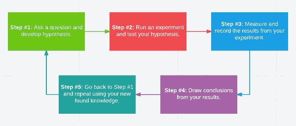

# 在 PyImageSearch 博客上提问的指南

> 原文：<https://pyimagesearch.com/2017/03/06/guide-asking-questions-pyimagesearch-blog/>

在过去三年的《PyImageSearch.com》中，我收到并回答了来自读者*的**数万个问题**，就像你自己*一样，他们对研究计算机视觉、OpenCV 和深度学习感兴趣。

回顾这段时间，我可以说我回答的绝大多数问题都是一种真正的快乐。

其他的问题**需要一点挖掘**并且和读者来来回回地解决真正的*潜在问题*是什么。那也没关系。有些问题很复杂，需要稍微“巧妙处理”一下，直到我们能哄出主要问题。

另一方面，一小部分问题有点难，有点乏味，需要我自己和提问者的耐心。这些棘手的问题在内容或主题上并不“困难”，而是要弄清楚读者想要达到什么目的，并以尊重我的时间和他们的时间的方式来完成。

在上周的博客文章中，我讨论了提出有洞察力的计算机视觉问题的五个关键组成部分(最终目标是让你得到更好的答案，T2，T3)。

今天我们将更进一步，将这些组件应用到我在 PyImageSearch 博客上收到的*个实际问题*中。

**我的目标是:**

1.  提供一套指导方针，您可以在联系我(或任何其他主题专家)时使用，以确保您的计算机视觉问题得到回答。
2.  提供问题的*正面*和*负面*品质的例子，你可以在设计自己的询问时使用并从中学习。
3.  **帮助我更好地帮助你**确保以尊重你我时间的方式提问。

**要了解更多关于如何在 PyImageSearch 博客上提问的信息(并获得你的问题的最佳答案)，请继续阅读。**

## 在 PyImageSearch 博客上提问的指南

你可能想知道为什么我要在 PyImageSearch 博客上写一个完整的提问指南？

原因是 PyImageSearch 在过去三年里增长了很多。

我现在每天收到数百封电子邮件*询问关于计算机视觉、OpenCV 和深度学习的问题。*

 *不要误会我的意思:

很高兴与你互动，回答你的问题，并向你学习:

这是我一天中最重要的时刻。

然而，问题的绝对数量要求我将这个过程正式化一点，以帮助 T2 尽可能地提高效率。

由于我不想求助于尴尬的、非个人化的调查或热门问题的“每周综述”(其中只有一小部分问题得到回答)，我决定最好的行动是创建一个指南，提供:

1.  一个 ***大纲*** 和 ***模板*** ，你可以在制作自己的问题时使用。
2.  ***真题*** 正反两面品质的例子我都收到了，你可以从中学习。

通过使用这些资源，我相信我们可以通过更有效的提问和回答而受益。

记住，我的最终目标是 ***帮你*** ，但是你需要 ***先帮我*** 理解你的问题。

***注:**为了保护提问读者的身份，在这篇博文中，所有的名字、大学和机构都被匿名了。任何与姓名、问题或从属关系相关的现实生活纯属巧合。*

### 为什么问问题(并从中学习)对你最有利

提问是计算机科学(以及所有科学)的一个基本方面。

事实上，问题是科学方法的基石:

**Figure 1:** The five fundamental steps of the scientific method.

这个提出问题、进行实验、测量/评估结果、得出结论以及重复这个过程的过程让我们获得了新的知识。

通过这些问题，我们发现*成长*不仅是就我们自身而言，也是就一般的科学方法而言。

作为一名计算机视觉的学生，*提问对你最有利***——这使你能够**获得新的见解**，**消除困惑**，以及**解决你正在从事的项目。****

 **也就是说，我们可以应用一些最佳实践来确保我们提出正确的问题。

你看，提问是一种后天习得的技能，类似于一门艺术。

这需要时间来掌握——但一旦你掌握了，它就开启了一个世界，在那里其他人(比如我自己)可以更好地帮助你理解计算机视觉。

**要点:**你对你的问题提供的信息越清晰，我就能更好地帮助你找到正确的方向并解决你的问题(但你仍然需要自己做艰苦的工作)。

要了解在 PyImageSearch 博客上提问的最佳实践，请继续阅读。

### 提问提纲

无论是给我自己还是其他主题专家发邮件，我都建议遵循这个简单的提纲:

1.  自我介绍一下。
2.  问你的问题。
3.  解释你为什么要问。
4.  提及你有什么计算机视觉经验(如果有的话)。

让我们深入探讨这些要点。

#### 所有好问题都以介绍开始

我认为运行 PyImageSearch 博客是一种特权和 T2 的荣誉，我想了解你。

告诉我你的名字。说说你对计算机视觉的体验水平？让我知道你是计算机视觉的学生、研究人员、爱好者还是仅仅对计算机视觉感兴趣的程序员。

另外，如果你是第一次给我发邮件，知道你是如何找到 PyImageSearch 博客(例如、Google、朋友/同事推荐、stack overflow/Reddit/等链接。).

#### 从那里，问你的问题

花点时间来阐述你的问题，并仔细思考。

我已经写了一个完全独立的指南，关于如何更好地回答你的计算机视觉问题——**在写问题之前，请务必阅读它。**

在你提问之前阅读本指南将为我们双方节省大量时间，并确保你的问题得到正确回答。

#### 问完问题后，解释*你为什么要问*

理解*为什么*你会问一个特定问题的背景*不仅对我(对你自己也是)至关重要*。

如果你是一个计算机视觉爱好者，周末会在你的 Raspberry Pi 上玩黑客游戏，那么我建议使用的技术将会与一个在大学里寻找最先进研究的研究人员大不相同。

花点时间去理解你问题背后的 *why* 并确保你把它转述给我——我对你的问题产生的背景了解得越多，我就能更好地帮助你。

#### 最后，一定要让我知道你的计算机视觉经验(如果有的话)

就像问题背后的*背景*和*为什么*很重要一样，了解你对计算机视觉的经验水平也很关键。

如果你没有计算机视觉方面的任何经验，那 100%没问题——但我确实需要知道这一点，以便我可以为你推荐一条包括基础知识的前进道路。

同样，如果你知道计算机视觉和 OpenCV 的基础知识，一定要让我知道，这样我才能向你推荐更高级的技术。

最后，如果你在一所大学机构里做研究，那对我来说也很有帮助，我可以试着给你介绍一些你可能感兴趣的出版物。

### 提问的模板

结合上面的提问提纲，我制作了一个“填空”模板，帮助你在构思问题和给我(或任何其他主题专家)发电子邮件时解决问题:

> 嗨阿德里安，
> 
> 我的名字是{{名字}}。我第一次找到你是因为{{ source }}。
> 
> 我对{{ topic }}感兴趣。
> 
> 我的问题是:
> 
> {{问题}}
> 
> 我这么问的原因是因为{{ question_reason }}。
> 
> 我对{{ topic }}的体验是{{ experience_level }}。
> 
> 谢谢，
> 
> {{名字}}

为了理解应用这个模板的重要性，让我们考虑一个与计算机视觉完全分离的主题*—*—*计划一次旅行*。让我们假设我想去柬埔寨，为了计划这次旅行，我要给我的(虚构的)旅行社 Karen 发电子邮件。

***不使用*** 模板，我最初给凯伦的邮件可能是这样的:

> 嗨，凯伦，
> 
> 我想去柬埔寨。请帮助我。
> 
> 艾德里安(男子名)

这封邮件对凯伦没什么帮助。除了我说我想去柬埔寨，她没什么可说的:

*   我为什么要去柬埔寨？
*   我想在一年中的什么时候游览？
*   这次旅行是出差还是游玩？
*   我的旅行预算是多少？
*   我以前去过柬埔寨吗？
*   我有兴趣在柬埔寨观光吗？

显而易见，根据我最初的询问，我和 Karen 之间需要通过几封电子邮件才能清楚地了解我访问柬埔寨的意图。

然而， ***如果我使用上面的模板*** ，我最初的邮件会变得更加清晰:

> 嗨，凯伦，
> 
> 我叫艾德里安。我的朋友特里莎介绍我认识你，她说你是一个出色的旅行社代理人。
> 
> 明年的某个时候，我想去柬埔寨看看。
> 
> 我以前从未去过柬埔寨，但我有亲戚住在那里，我想去看看他们。他们不太会说英语，所以我很好地掌握这次旅行的方式(航班、租车、住宿等)是很重要的。).
> 
> 我也不知道一年中什么时候去柬埔寨最好。你能提供一年中最佳旅游时间的建议吗？
> 
> 我这次旅行的预算是 1500 美元。我可以用这笔预算做些什么，以确保我能负担得起一趟航班，并在我在那里的时候仍然能看到所有主要的网站？
> 
> 谢谢！
> 
> 阿德里安

在这一点上，凯伦确切地知道了我的意图，并且可以更好地帮助我。她可能还有一些问题需要澄清，但至少基础已经打好了。

这里的要点是，我需要首先*帮助自己*提出一个凯伦能更好回答的问题。从那里，凯伦可以更好地帮助我。

### 如何将此模板应用于您在 PyImageSearch 博客上的问题

让我们假设我的名字叫史蒂夫，我对*基于内容的图像检索(CBIR)* 或者更简单地说，*图像搜索引擎*感兴趣。

刚刚在 Google 上通过查询*“图片搜索引擎 python”*找到了 PyImageSearch 博客，登陆 [*《用 Python 和 OpenCV 构建图片搜索引擎的完整指南》*教程](https://pyimagesearch.com/2014/12/01/complete-guide-building-image-search-engine-python-opencv/)。

我们还假设我有一些 Python 编程语言的经验，但是没有 OpenCV 的先验知识。

然后，我可以像这样填写模板:

> 嗨阿德里安，
> 
> 我叫史蒂夫。当我在搜索“图片搜索引擎 python”时，我通过谷歌找到了你的博客。
> 
> 我对构建图像搜索引擎很感兴趣，并且通读了你的[图像搜索引擎指南教程](https://pyimagesearch.com/2014/12/01/complete-guide-building-image-search-engine-python-opencv/)。看到一个基本的图片搜索引擎是如何构建和组装的真的很有帮助。非常感谢。
> 
> 我的问题是:
> 
> 在该教程中，您使用了颜色直方图来量化图像内容。如果我想识别纹理或形状呢？
> 
> 我这样问的原因是因为我为一家大型股票照片公司工作，我们需要建立一个系统，可以(自动)根据图像内容搜索相似的图像。
> 
> 我之前没有任何计算机视觉或 OpenCV 的经验，但我知道如何用 Python、PHP 和 C++编写代码。
> 
> 如果你能给我指出正确的方向，我将不胜感激。
> 
> 谢谢！
> 
> 史蒂夫(男子名)

史蒂夫的问题是一个很好的有见地的计算机视觉问题的例子:

*   这是经过深思熟虑的，切中要害的。
*   它有具体的目标:
    *   史蒂夫想了解更多关于图像搜索引擎的知识。
    *   利用这些知识，他想为他工作的公司建立一个图像搜索引擎。
*   它提供了足够的上下文和背景(包括以前的编程经验)。

鉴于 Steve 刚刚开始接触计算机视觉和 OpenCV，我可以向他推荐一条途径:

1.  教他计算机视觉和图像处理的基础知识。
2.  教育他各种颜色、形状和纹理图像描述符。
3.  指导史蒂夫如何建立一个可扩展的图像搜索引擎。

再次，史蒂夫带着开放的心态走进这个问题。

他不是在寻找一个“替他完成”的解决方案，而是 ***一条通往理解*** 图像搜索引擎 ***的道路，以便他可以完成他的项目。***

正如我们将在这些示例方程的其余部分中看到的，在计算机视觉领域很少有(如果有的话)“替你完成”的解决方案。即使有，这些解决方案可能需要你调整各种旋钮和杠杆。如果没有计算机视觉和图像处理的基础知识，你可能会很难将这些旋钮拨到正确的位置。

### 我在 PyImageSearch 博客上收到的问题示例

在本指南的剩余部分，我们将看看我在 PyImageSearch 博客上收到的个实际问题。

我们将检查这些问题中的每一个，并找出问题的积极和消极方面，以便您可以使用这些知识来制作自己的出色的计算机视觉问题。

每个示例问题都属于提出一个好的计算机视觉问题的五个组成部分:

*   **成分#1:** 知道目的。
*   组件#2: 提供上下文。
*   第三部分:做你的调查。
*   **组件#4:** 提出问题(并尊重他人的时间)。
*   **组件#5:** 根据需要重复该过程。

**Figure 2:** The five components of a practical insightful question.

其中一些问题是上述各个部分的*极好的例子*。

其他人在某些方面有所欠缺。

不管是哪种情况，我都会把这两种品质都说出来，这样你就可以从中学习了——这将使我能够通过理解你的问题来更好地帮助你。

#### 第一部分:知道问题的目的

我们的第一个例子来自 Jason:

> 主题:Jason 提交的联系表单
> 
> 如何追踪杯赛？请回答我。

Jason 的邮件非常简短——老实说，这是一个对我来说极具挑战性的问题。

原因是因为我提取不出问题的*目的*。

我不知道 Jason 想要识别和跟踪哪些类型的杯子:

*   *每一款*类型的杯子？
*   这包括玻璃杯和高脚杯吗？
*   啤酒杯呢？
*   这些杯子是什么材料的？它们是玻璃、陶瓷、塑料、金属等吗？？
*   还是我们只局限于杰森家里厨房橱柜里的某一种杯子？

我也不知道*Jason 想要建立他的杯子识别和跟踪系统的原因:*

*   他是在为毕业做准备吗？这个杯子追踪器应该是他最后的顶点项目了吧？
*   他是否在一家大规模生产杯子并需要检测、跟踪和统计传送带上杯子数量的公司工作？
*   还是他只是单纯好奇如何跟踪识别杯子这个爱好项目？

选项是*无止境的*，对我来说*不可能*从杰森的电子邮件中辨别出*【为什么】*。

除了从根本上很难回答之外，这些类型的问题还会使人精神疲惫，令人生厌。

因为 Jason 的电子邮件缺乏上下文和细节，所以我和他之间需要多次电子邮件往来才能确定他项目的最终目标。

如果 Jason 能花更多的时间来形成一个问题，其中包括他希望完成的目标的具体细节，那么我可能会给他更多的帮助。*否则，我很难对他的问题做出回应(甚至证明所花时间的合理性)。*

像这样的电子邮件，我可能会回复，询问更多的细节，但在未来，这些问题将获得较低的优先级，*可能根本不会回答。*

如果我按照上面的模板重写这封邮件(对 Jason 进行假设，因为我不知道他的动机是什么)，它看起来会像这样:

> 主题:Jason 提交的联系表单
> 
> 嗨阿德里安，
> 
> 我是计算机视觉和 OpenCV 的新手。我几个小时前才发现你的博客，并读过几篇文章。
> 
> 我心中有一个爱好项目，我想检测和跟踪视频中的杯子。
> 
> 为什么是杯子？
> 
> 我有一个 2 岁的女儿，我最近给她买了颜色鲜艳的红色、黄色和蓝色的塑料吸管杯，以确保她不会把果汁洒在地板上。
> 
> 从我读过的帖子来看，颜色似乎可以用来寻找图像中的物体，这些杯子似乎是一个很好的候选物。
> 
> 同样，我是计算机视觉的新手，所以这个项目只是我自学基础知识的一种方式。
> 
> 我如何应用你的技术来检测和跟踪视频中的杯子？
> 
> 我应该从哪里开始？
> 
> 伊阿宋

在这个重写的示例中，我将拥有回答 Jason 的问题所需的所有信息:

1.  我知道他的计算机视觉和 OpenCV 经验。
2.  我知道他对追踪一种特定类型的杯子感兴趣。
3.  我知道这是他的爱好项目。

根据这些信息，我可以为 Jason 提供启动项目的建议，而不像在最初的例子中，我必须花费至少 3-4 封电子邮件来来回回地试图理解项目的目的。

对你项目的目标直言不讳会为我们双方*节省很多时间。*

 *#### 第 2 部分:提供背景(即*“为什么”*你在问问题)

下一封电子邮件来自马克:

> 我正在做一个项目。我需要计算视频中越线的人数。请发送代码。提前谢了。
> 
> 标记

Mark 的问题(实际上不是一个问题)与 Jason 的问题类似:非常简短，没有太多细节。

同样，我也很难回答这个问题。

我不确定*为什么*马克要数视频中的人数，甚至不知道*所说的“数人数”是指什么。*

然而，根据我在计算机视觉领域的经验(以及回答过 100 个类似的问题)，我*认为* Mark 想要做这样的东西:

<https://www.youtube.com/embed/OWab2_ete7s?feature=oembed>****