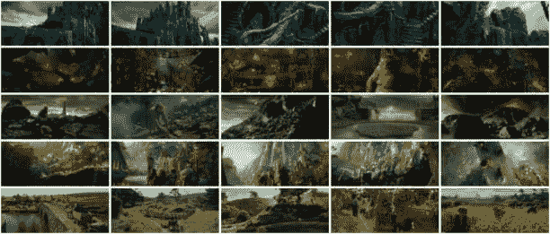
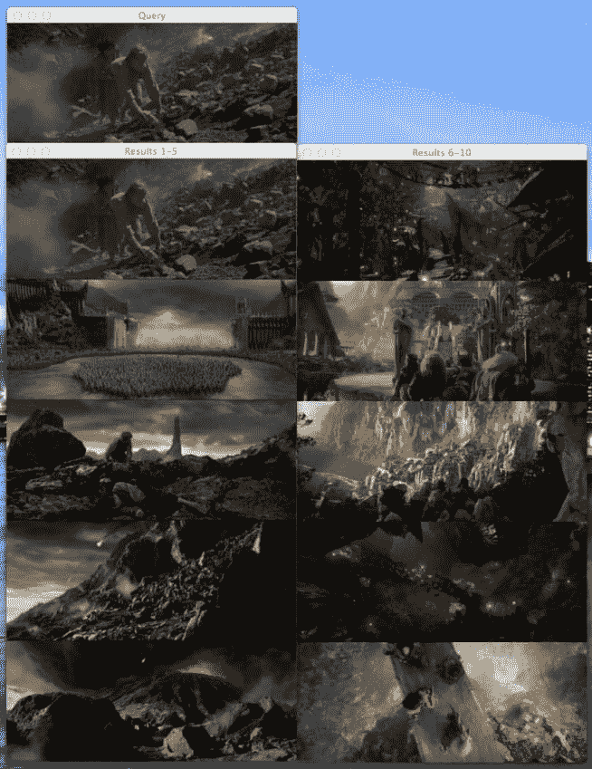
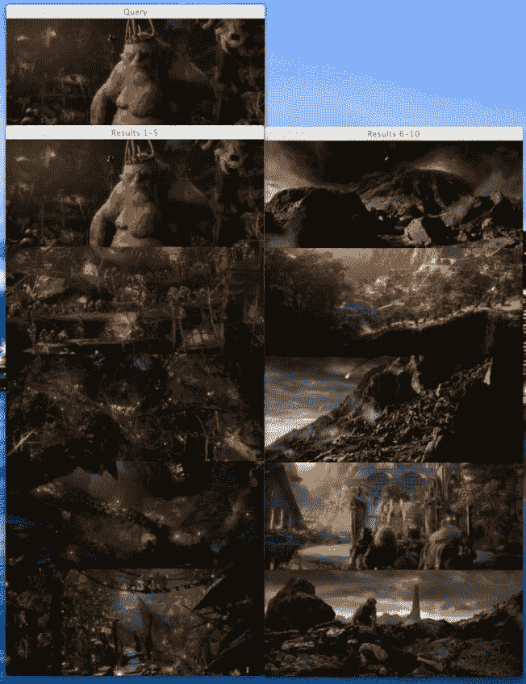
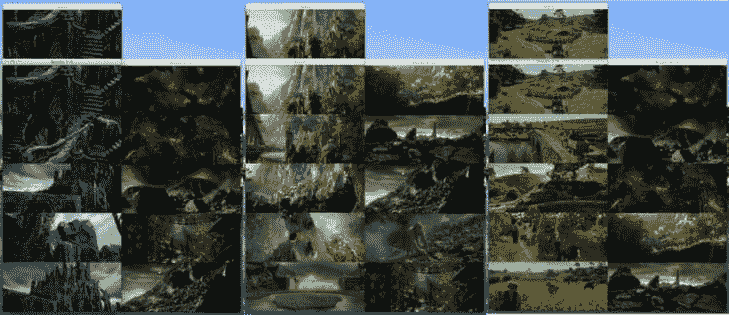
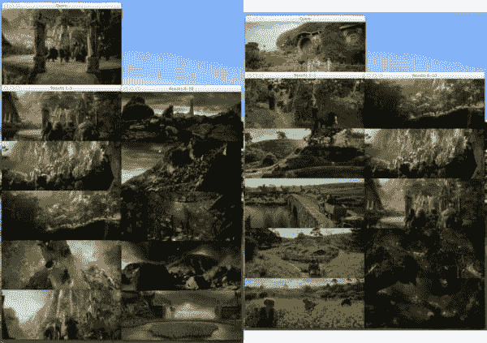

# 霍比特人和直方图——如何用 Python 构建你的第一个图像搜索引擎

> 原文：<https://pyimagesearch.com/2014/01/27/hobbits-and-histograms-a-how-to-guide-to-building-your-first-image-search-engine-in-python/>

> 一枚戒指统治他们，一枚戒指寻找他们；一枚戒指将他们带到一起，在黑暗中将他们捆绑。

我们将要建立的图像搜索引擎将会是如此的令人敬畏，如果没有末日火山的帮助，它可能已经摧毁了至尊魔戒本身。

好吧，在过去的一周里，我显然看了很多《霍比特人》和《T2》《指环王》。

我心想，你知道什么最棒吗？

使用电影截图建立一个简单的图像搜索引擎。这正是我所做的。

这里有一个快速概述:

*   **我们要做的:**建立一个图片搜索引擎，从开始到结束，使用*的霍比特人*和*的指环王*截图。
*   **你将学到:**建立一个图片搜索引擎所需的 4 个步骤，包括代码示例。从这些例子中，你将能够建立你自己的图像搜索引擎。
*   **你需要的:** Python，NumPy，和 [OpenCV](http://opencv.org/quickstart.html) 。了解一些基本的图像概念，比如像素和直方图，会有所帮助，但是*绝对不是必需的*。这篇博客文章旨在成为构建图像搜索引擎的实践指南。

## 霍比特人和直方图——如何用 Python 构建你的第一个图像搜索引擎

我以前从未见过如何建立一个简单的图片搜索引擎的指南。但这正是这篇文章的内容。我们将使用(可以说是)最基本的图像描述符之一来量化和描述这些截图——颜色直方图。

我在上一篇文章中讨论了颜色直方图，在计算机视觉和图像搜索引擎中使用颜色直方图的指南。如果你没有读过，没关系，但是我建议你在看完这篇博文后回去读一读，以进一步了解颜色直方图。

但在我深入研究构建图像搜索引擎的细节之前，让我们先来看看我们的数据集《霍比特人》和《T2》的《指环王》截图:

[](https://pyimagesearch.com/wp-content/uploads/2014/01/dataset.jpg)

**Figure 1:** Our dataset of *The Hobbit* and *Lord of the Rings* screenshots. We have 25 total images of 5 different categories including Dol Guldur, the Goblin Town, Mordor/The Black Gate, Rivendell, and The Shire.

如你所见，我们的数据集中共有 25 张不同的图片，每类 5 张。我们的类别包括:

*   **多尔·古尔杜尔:**《死灵法师地牢》，索隆在幽暗密林的据点。
*   **妖精小镇:**迷雾山脉中的兽人小镇，妖精王的故乡。
*   **魔多/黑门:**索隆的要塞，周围是山脉和火山平原。
*   中土世界的精灵前哨站。
*   **夏尔:**霍比特人的故乡。

这些图片来自《霍比特人:意想不到的旅程》。我们的夏尔图片来自*《指环王:指环王联盟*。最后，我们的魔多/黑门截图来自*指环王:王者归来*。

### 目标是:

我们要做的第一件事是*索引*我们数据集中的 25 张图片。索引是通过使用*图像描述符*从每个图像中提取*特征*来量化我们数据集的过程，并存储所得到的特征以备后用，例如执行搜索。

一个*图像描述符*定义了我们如何量化一幅图像，因此从一幅图像中提取特征被称为*描述一幅图像*。图像描述符的输出是一个*特征向量*，一个图像本身的抽象。简单来说，就是用来表示一个图像的数字列表。

可以使用*距离度量*来比较两个特征向量。距离度量用于通过检查两个特征向量之间的距离来确定两幅图像有多“相似”。在图像搜索引擎的情况下，我们给我们的脚本一个*查询图像*，并要求它根据图像与我们的查询的相关程度，对索引中的图像进行排序。

这么想吧。当你去谷歌并在搜索框中输入“指环王”时，你会期望谷歌返回给你与托尔金的书和电影系列相关的页面。类似地，如果我们提供一个带有查询图像的图像搜索引擎，我们希望它返回与图像内容相关的图像——因此，我们有时称图像搜索引擎为学术界更普遍的名称*基于内容的图像检索(CBIR)* 系统。

那么我们指环王图片搜索引擎的总体目标是什么呢？

**我们的目标是，给定来自五个不同类别之一的查询图像，返回该类别对应的前 10 个结果中的图像。**

那是一口。我们用一个例子来说明一下。

如果我向我们的系统提交一个 Shire 的查询图像，我希望它能在我们的数据集中返回前 10 个结果，给出所有 5 个 Shire 图像。同样，如果我提交一个瑞文戴尔的查询图片，我希望我们的系统在前 10 个结果中给出所有 5 个瑞文戴尔的图片。

有道理吗？很好。让我们来谈谈建立图像搜索引擎的四个步骤。

### 构建图像搜索引擎的 4 个步骤

在最基本的层面上，构建图像搜索引擎有四个步骤:

1.  定义您的描述符:您将使用哪种类型的描述符？你是在描述颜色吗？质感？外形？
2.  **索引您的数据集:**将您的描述符应用到您的数据集中的每个图像，提取一组特征。
3.  **定义你的相似度:**你将如何定义两幅图像有多“相似”？你可能会使用某种[距离度量](http://en.wikipedia.org/wiki/Metric_(mathematics))。常见的选择包括欧几里德、Cityblock(曼哈顿)、余弦和卡方等等。
4.  **搜索:**要执行搜索，请将您的描述符应用到您的查询图像，然后询问您的距离度量来对您的图像在索引中与您的查询图像的相似程度进行排序。通过相似性对结果进行排序，然后检查它们。

### 步骤 1:描述符——3D RGB 颜色直方图

我们的图像描述符是 RGB 颜色空间中的 3D 颜色直方图，每个红色、绿色和蓝色通道有 8 个面元。

解释 3D 直方图的最佳方式是使用连接词**和**。该图像描述符将询问给定图像有多少像素具有落入面元#1 **的红色值和落入面元#2 **的绿色值以及落入面元#1 的蓝色像素。这个过程将对每个箱的组合重复进行；然而，这将以计算高效的方式完成。****

当计算具有 8 个面元的 3D 直方图时，OpenCV 会将特征向量存储为一个`(8, 8, 8)`数组。我们将简单地把它弄平，并将其整形为`(512,)`。一旦它变平，我们就可以很容易地比较特征向量的相似性。

准备好看代码了吗？好了，我们开始吧:

```py
# import the necessary packages
import imutils
import cv2

class RGBHistogram:
	def __init__(self, bins):
		# store the number of bins the histogram will use
		self.bins = bins

	def describe(self, image):
		# compute a 3D histogram in the RGB colorspace,
		# then normalize the histogram so that images
		# with the same content, but either scaled larger
		# or smaller will have (roughly) the same histogram
		hist = cv2.calcHist([image], [0, 1, 2],
			None, self.bins, [0, 256, 0, 256, 0, 256])

		# normalize with OpenCV 2.4
		if imutils.is_cv2():
			hist = cv2.normalize(hist)

		# otherwise normalize with OpenCV 3+
		else:
			hist = cv2.normalize(hist,hist)

		# return out 3D histogram as a flattened array
		return hist.flatten()

```

如您所见，我定义了一个`RGBHistogram`类。我倾向于将我的图像描述符定义为*类*，而不是*函数*。这是因为你很少单独从一幅图像中提取特征。而是从整个图像数据集中提取特征。此外，您希望从所有图像中提取的特征使用相同的参数，在这种情况下，就是直方图的箱数。如果您打算比较它们的相似性，那么从一幅图像中使用 32 个柱，然后从另一幅图像中使用 128 个柱来提取直方图是没有多大意义的。

让我们把代码拆开，了解一下发生了什么:

*   **第 6-8 行:**这里我定义了`RGBHistogram`的构造函数。我们需要的唯一参数是直方图中每个通道的仓数量。同样，这也是为什么我更喜欢使用类而不是函数作为图像描述符——通过将相关参数放在构造函数中，可以确保每个图像都使用相同的参数。
*   **第 10 行:**你猜对了。describe 方法用于“描述”图像并返回特征向量。
*   **第 15 行和第 16 行:**这里我们提取实际的 3D RGB 直方图(或者实际上是 BGR，因为 OpenCV 将图像存储为 NumPy 数组，但是通道顺序相反)。我们假设`self.bins`是三个整数的列表，指定每个通道的仓数量。
*   **第 19-24 行:**重要的是，我们要根据像素数来标准化直方图。如果我们使用图像的原始(整数)像素计数，然后将其缩小 50%并再次描述，那么对于相同的图像，我们将有两个不同的特征向量。在大多数情况下，您希望避免这种情况。我们通过将原始整数像素计数转换成实数值百分比来获得*比例不变性*。例如，不是说面元#1 中有 120 个像素，而是说面元#1 中有所有像素的 20%。同样，通过使用像素计数的百分比而不是原始的整数像素计数，我们可以确保两个相同的图像(仅大小不同)将具有(大致)相同的特征向量。
*   **第 27 行:**当计算一个 3D 直方图时，直方图将被表示为一个带有`(N, N, N)`个面元的 NumPy 数组。为了更容易地计算直方图之间的距离，我们简单地将这个直方图展平成一个形状`(N ** 3,)`。**示例:**当我们实例化我们的 RGBHistogram 时，我们将使用每个通道 8 个面元。没有展平我们的直方图，形状将是`(8, 8, 8)`。但是把它展平，形状就变成了`(512,)`。

既然我们已经定义了我们的图像描述符，我们可以继续我们的数据集的索引过程。

### 步骤 2:索引我们的数据集

好了，我们已经决定我们的图像描述符是一个三维 RGB 直方图。下一步是将我们的图像描述符应用到数据集中的每个图像。

这意味着我们将遍历 25 个图像数据集，从每个图像中提取 3D RGB 直方图，将特征存储在字典中，并将字典写入文件。

对，就是这样。

实际上，您可以根据需要使索引变得简单或复杂。索引是一项很容易实现并行的任务。如果我们有一个四核机器，我们可以在四个核之间分配工作，加快索引过程。但是因为我们只有 25 张图像，这是相当愚蠢的，尤其是考虑到计算直方图的速度有多快。

让我们深入了解一下`index.py`:

```py
# import the necessary packages
from pyimagesearch.rgbhistogram import RGBHistogram
from imutils.paths import list_images
import argparse
import pickle
import cv2

# construct the argument parser and parse the arguments
ap = argparse.ArgumentParser()
ap.add_argument("-d", "--dataset", required = True,
	help = "Path to the directory that contains the images to be indexed")
ap.add_argument("-i", "--index", required = True,
	help = "Path to where the computed index will be stored")
args = vars(ap.parse_args())

# initialize the index dictionary to store our our quantifed
# images, with the 'key' of the dictionary being the image
# filename and the 'value' our computed features
index = {}

```

好的，我们要做的第一件事是导入我们需要的包。我决定将`RGBHistogram`类存储在一个名为`pyimagesearch`的模块中。我是说，这才有意义，对吧？我们将使用`cPickle`将我们的索引转储到磁盘。我们将使用`glob`来获取我们要索引的图像的路径。

`--dataset`参数是我们的图像在磁盘上存储的路径，而`--index`选项是索引计算后我们将存储索引的路径。

最后，我们将初始化我们的`index` —一个内置的 Python 字典类型。字典的关键字将是图像文件名。我们假设所有文件名都是唯一的，事实上，对于这个数据集，它们是唯一的。字典的值将是图像的计算直方图。

在这个例子中使用字典是最有意义的，尤其是为了解释的目的。给定一个键，字典指向另一个对象。当我们使用图像文件名作为关键字，直方图作为值时，我们暗示给定的直方图 *H* 用于量化和表示文件名为 *K* *的图像。*

同样，您可以根据自己的意愿让这个过程变得简单或复杂。更复杂的图像描述符使用术语频率-逆文档频率加权( [tf-idf](http://en.wikipedia.org/wiki/Tf%E2%80%93idf) )和一个[倒排索引](http://en.wikipedia.org/wiki/Inverted_index)，但是我们现在要避开它。不过不要担心，我会有*很多*的博客文章讨论我们如何利用更复杂的技术，但是目前，让我们保持简单。

```py
# initialize our image descriptor -- a 3D RGB histogram with
# 8 bins per channel
desc = RGBHistogram([8, 8, 8])

```

这里我们实例化我们的`RGBHistogram`。同样，我们将分别为红色、绿色和蓝色通道使用 8 个箱。

```py
# use list_images to grab the image paths and loop over them
for imagePath in list_images(args["dataset"]):
	# extract our unique image ID (i.e. the filename)
	k = imagePath[imagePath.rfind("/") + 1:]

	# load the image, describe it using our RGB histogram
	# descriptor, and update the index
	image = cv2.imread(imagePath)
	features = desc.describe(image)
	index[k] = features

```

这里是实际索引发生的地方。让我们来分解一下:

*   **第 26 行:**我们使用`list_images`来获取图像路径，并开始遍历我们的数据集。
*   **第 28 行:**我们提取字典的“关键字”。在这个样本数据集中，所有的文件名都是唯一的，所以文件名本身就足以作为键。
*   **第 32-34 行:**图像从磁盘上下载，然后我们使用`RGBHistogram`从图像中提取直方图。直方图然后存储在索引中。

```py
# we are now done indexing our image -- now we can write our
# index to disk
f = open(args["index"], "wb")
f.write(pickle.dumps(index))
f.close()

# show how many images we indexed
print("[INFO] done...indexed {} images".format(len(index)))

```

现在我们的索引已经被计算出来了，我们把它写到磁盘上，这样我们就可以在以后的搜索中使用它。

要索引您的图像搜索引擎，只需在终端中输入以下内容(注意[命令行参数](https://pyimagesearch.com/2018/03/12/python-argparse-command-line-arguments/)):

```py
$ python index.py --dataset images --index index.cpickle
[INFO] done...indexed 25 images

```

### 第三步:搜索

现在，我们已经将索引放在了磁盘上，可以随时进行搜索。

问题是，我们需要一些代码来执行实际的搜索。我们如何比较两个特征向量，如何确定它们有多相似？

这个问题最好先在`searcher.py`里面解决，然后我再分解一下。

```py
# import the necessary packages
import numpy as np

class Searcher:
	def __init__(self, index):
		# store our index of images
		self.index = index

	def search(self, queryFeatures):
		# initialize our dictionary of results
		results = {}

		# loop over the index
		for (k, features) in self.index.items():
			# compute the chi-squared distance between the features
			# in our index and our query features -- using the
			# chi-squared distance which is normally used in the
			# computer vision field to compare histograms
			d = self.chi2_distance(features, queryFeatures)

			# now that we have the distance between the two feature
			# vectors, we can udpate the results dictionary -- the
			# key is the current image ID in the index and the
			# value is the distance we just computed, representing
			# how 'similar' the image in the index is to our query
			results[k] = d

		# sort our results, so that the smaller distances (i.e. the
		# more relevant images are at the front of the list)
		results = sorted([(v, k) for (k, v) in results.items()])

		# return our results
		return results

	def chi2_distance(self, histA, histB, eps = 1e-10):
		# compute the chi-squared distance
		d = 0.5 * np.sum([((a - b) ** 2) / (a + b + eps)
			for (a, b) in zip(histA, histB)])

		# return the chi-squared distance
		return d

```

首先，大部分代码只是注释。不要害怕是 41 行。如果你还没有猜到，我喜欢注释良好的代码。让我们调查一下发生了什么:

*   **第 4-7 行:**我做的第一件事是定义一个`Searcher`类和一个只有一个参数的构造函数——T1。这个`index`被认为是我们在索引步骤中写入文件的索引字典。
*   **第 11 行:**我们定义了一个字典来存储我们的`results`。关键字是图像文件名(来自索引)，值是给定图像与查询图像的相似程度。
*   **第 14-26 行:**这是实际搜索发生的部分。我们在索引中循环遍历图像文件名和相应的特征。然后，我们使用卡方距离来比较我们的颜色直方图。计算出的距离随后被存储在`results`字典中，表明两幅图像彼此有多相似。
*   **第 30-33 行:**结果按照相关性排序(卡方距离越小，相关/相似)并返回。
*   **第 35-41 行:**这里我们定义了用于比较两个直方图的卡方距离函数。一般而言，大箱与小箱之间的差异不太重要，应同样进行加权。这正是卡方距离的作用。我们提供了一个`epsilon`虚拟值来避免那些讨厌的“被零除”错误。如果图像的特征向量的卡方距离为零，则认为图像是相同的。距离越大，它们越不相似。

现在你有了它，一个 Python 类，它可以获取索引并执行搜索。现在是时候让这个搜索器发挥作用了。

**注意:**对于那些更倾向于学术的人来说，如果你对直方图距离度量感兴趣，你可能想看看来自 ECCV 10 会议的 *[二次卡方直方图距离族](http://www.cs.huji.ac.il/~ofirpele/publications/ECCV2010.pdf)* 。

### 步骤 4:执行搜索

最后。我们正在接近一个功能图像搜索引擎。

但是我们还没到那一步。我们在`search.py`中需要一点额外的代码来处理从磁盘上加载图像和执行搜索:

```py
# import the necessary packages
from pyimagesearch.searcher import Searcher
import numpy as np
import argparse
import os
import pickle
import cv2

# construct the argument parser and parse the arguments
ap = argparse.ArgumentParser()
ap.add_argument("-d", "--dataset", required = True,
	help = "Path to the directory that contains the images we just indexed")
ap.add_argument("-i", "--index", required = True,
	help = "Path to where we stored our index")
args = vars(ap.parse_args())

# load the index and initialize our searcher
index = pickle.loads(open(args["index"], "rb").read())
searcher = Searcher(index)

```

重要的事情先来。导入我们将需要的包。如您所见，我已经将我们的`Searcher`类存储在了`pyimagesearch`模块中。然后，我们以与索引步骤中相同的方式定义我们的参数。最后，我们使用`cPickle`从磁盘上加载我们的索引并初始化我们的`Searcher`。

```py
# loop over images in the index -- we will use each one as
# a query image
for (query, queryFeatures) in index.items():
	# perform the search using the current query
	results = searcher.search(queryFeatures)

	# load the query image and display it
	path = os.path.join(args["dataset"], query)
	queryImage = cv2.imread(path)
	cv2.imshow("Query", queryImage)
	print("query: {}".format(query))

	# initialize the two montages to display our results --
	# we have a total of 25 images in the index, but let's only
	# display the top 10 results; 5 images per montage, with
	# images that are 400x166 pixels
	montageA = np.zeros((166 * 5, 400, 3), dtype = "uint8")
	montageB = np.zeros((166 * 5, 400, 3), dtype = "uint8")

	# loop over the top ten results
	for j in range(0, 10):
		# grab the result (we are using row-major order) and
		# load the result image
		(score, imageName) = results[j]
		path = os.path.join(args["dataset"], imageName)
		result = cv2.imread(path)
		print("\t{}. {} : {:.3f}".format(j + 1, imageName, score))

		# check to see if the first montage should be used
		if j < 5:
			montageA[j * 166:(j + 1) * 166, :] = result

		# otherwise, the second montage should be used
		else:
			montageB[(j - 5) * 166:((j - 5) + 1) * 166, :] = result

	# show the results
	cv2.imshow("Results 1-5", montageA)
	cv2.imshow("Results 6-10", montageB)
	cv2.waitKey(0)

```

大部分代码处理结果的显示。实际的“搜索”是在一行中完成的(#31)。不管怎样，让我们来看看发生了什么:

*   **第 23 行:**我们将把索引中的每张图片视为一个查询，看看我们会得到什么结果。通常，查询是*外部*的，不是数据集的一部分，但是在我们开始之前，让我们先执行一些示例搜索。
*   第 25 行:这里是实际搜索发生的地方。我们将当前图像视为我们的查询并执行搜索。
*   **第 28-31 行:**加载并显示我们的查询图像。
*   **第 37-55 行:**为了显示前 10 个结果，我决定使用两个蒙太奇图像。第一个蒙太奇显示结果 1-5，第二个蒙太奇显示结果 6-10。第 27 行提供了图像的名称和距离。
*   **第 58-60 行:**最后，我们向用户显示搜索结果。

所以你有它。一个完整的 Python 图像搜索引擎。

让我们看看这东西的表现如何:

```py
$ python search.py --dataset images --index index.cpickle

```

最后，在窗口处于活动状态时按下一个键后，您将看到这个魔多查询和结果:

```py
query: Mordor-002.png
	1\. Mordor-002.png : 0.000
	2\. Mordor-004.png : 0.296
	3\. Mordor-001.png : 0.532
	4\. Mordor-003.png : 0.564
	5\. Mordor-005.png : 0.711
	6\. Goblin-002.png : 0.825
	7\. Rivendell-002.png : 0.838
	8\. Rivendell-004.png : 0.980
	9\. Goblin-001.png : 0.994
	10\. Rivendell-005.png : 0.996

```

[](https://pyimagesearch.com/wp-content/uploads/2014/01/Mordor-002.jpg)

**图 2:** 使用【Mordor-002.png 作为查询的搜索结果。我们的图像搜索引擎能够返回来自魔多和黑门的图像。让我们从《T4:王者归来》的结尾开始，用弗罗多和山姆爬上火山作为我们的查询图像。如你所见，我们的前 5 个结果来自“魔多”类别。

也许你想知道为什么 Frodo 和 Sam 的查询图像也是在#1 结果位置的图像？让我们回想一下卡方距离。我们说过，如果两个特征向量之间的距离为零，则认为图像是“相同的”。因为我们使用已经作为查询索引的图像，所以它们实际上是相同的，并且距离为零。因为零值表示完全相似，所以查询图像出现在#1 结果位置。

现在，让我们尝试另一个图像，这一次使用妖精镇中的妖精王。当你准备好了，只要在 OpenCV 窗口激活时按一个键，直到你看到这个妖精王的查询:

```py
query: Goblin-004.png
	1\. Goblin-004.png : 0.000
	2\. Goblin-003.png : 0.103
	3\. Golbin-005.png : 0.188
	4\. Goblin-001.png : 0.335
	5\. Goblin-002.png : 0.363
	6\. Mordor-005.png : 0.594
	7\. Rivendell-001.png : 0.677
	8\. Mordor-003.png : 0.858
	9\. Rivendell-002.png : 0.998
	10\. Mordor-001.png : 0.999

```

[](https://pyimagesearch.com/wp-content/uploads/2014/01/Goblin-004.jpg)

**图 3:** 使用【Goblin-004.png 作为查询的搜索结果。返回的前 5 张图片来自地精镇。妖精王看起来不太高兴。但是我们很高兴地精镇的五张照片都进入了前十名。

最后，这里还有三个搜索 Dol-Guldur、Rivendell 和 Shire 的示例。同样，我们可以清楚地看到，来自各自类别的所有五张图片都位于前 10 名结果中。

[](https://pyimagesearch.com/wp-content/uploads/2014/01/result-montage.jpg)

**Figure 4:** Using images from Dol-Guldur *(Dol-Guldur-004.png)*, Rivendell *(Rivendell-003.png)*, and The Shire (*Shire-002.png)* as queries.

### 额外收获:外部查询

到目前为止，我只向你展示了如何使用已经在你的索引中的图片*进行搜索。但显然，这并不是所有图像搜索引擎的工作方式。谷歌允许你上传自己的图片。TinEye 允许你上传自己的图片。为什么我们不能？让我们看看如何使用`search_external.py`来执行搜索，使用一个我们还没有索引的图像:*

```py
# import the necessary packages
from pyimagesearch.rgbhistogram import RGBHistogram
from pyimagesearch.searcher import Searcher
import numpy as np
import argparse
import os
import pickle
import cv2

# construct the argument parser and parse the arguments
ap = argparse.ArgumentParser()
ap.add_argument("-d", "--dataset", required = True,
	help = "Path to the directory that contains the images we just indexed")
ap.add_argument("-i", "--index", required = True,
	help = "Path to where we stored our index")
ap.add_argument("-q", "--query", required = True,
	help = "Path to query image")
args = vars(ap.parse_args())

# load the query image and show it
queryImage = cv2.imread(args["query"])
cv2.imshow("Query", queryImage)
print("query: {}".format(args["query"]))

# describe the query in the same way that we did in
# index.py -- a 3D RGB histogram with 8 bins per
# channel
desc = RGBHistogram([8, 8, 8])
queryFeatures = desc.describe(queryImage)

# load the index perform the search
index = pickle.loads(open(args["index"], "rb").read())
searcher = Searcher(index)
results = searcher.search(queryFeatures)

# initialize the two montages to display our results --
# we have a total of 25 images in the index, but let's only
# display the top 10 results; 5 images per montage, with
# images that are 400x166 pixels
montageA = np.zeros((166 * 5, 400, 3), dtype = "uint8")
montageB = np.zeros((166 * 5, 400, 3), dtype = "uint8")

# loop over the top ten results
for j in range(0, 10):
	# grab the result (we are using row-major order) and
	# load the result image
	(score, imageName) = results[j]
	path = os.path.join(args["dataset"], imageName)
	result = cv2.imread(path)
	print("\t{}. {} : {:.3f}".format(j + 1, imageName, score))

	# check to see if the first montage should be used
	if j < 5:
		montageA[j * 166:(j + 1) * 166, :] = result

	# otherwise, the second montage should be used
	else:
		montageB[(j - 5) * 166:((j - 5) + 1) * 166, :] = result

# show the results
cv2.imshow("Results 1-5", montageA)
cv2.imshow("Results 6-10", montageB)
cv2.waitKey(0)

```

*   **第 2-18 行:**到现在为止，这应该感觉像是非常标准的东西。我们正在导入我们的包并设置我们的参数解析器，但是，您应该注意到新的参数`--query`。这是我们的查询图像的路径。
*   **第 21 行和第 22 行:**我们将加载您的查询图像并向您展示，以防您忘记您的查询图像是什么。
*   **第 28 和 29 行:**用与索引步骤 中完全相同的 bin 数实例化我们的`RGBHistogram` ***。我用粗体和斜体来说明使用相同参数的重要性。然后，我们从查询图像中提取特征。***
*   **第 32-34 行:**使用`cPickle`从磁盘上加载我们的索引并执行搜索。
*   **第 40-63 行:**就像在上面的代码中执行搜索一样，这段代码只是向我们显示我们的结果。

在写这篇博文之前，我在谷歌上下载了两张索引中没有的图片。一辆[瑞文戴尔](https://pyimagesearch.com/wp-content/uploads/2014/01/rivendell-query.png)和一辆[夏尔](https://pyimagesearch.com/wp-content/uploads/2014/01/shire-query.png)。这两个图像将是我们的查询。

要运行该脚本，只需在终端中提供正确的命令行参数:

```py
$ python search_external.py --dataset images --index index.cpickle \
	--query queries/rivendell-query.png
query: queries/rivendell-query.png
	1\. Rivendell-002.png : 0.195
	2\. Rivendell-004.png : 0.449
	3\. Rivendell-001.png : 0.643
	4\. Rivendell-005.png : 0.757
	5\. Rivendell-003.png : 0.769
	6\. Mordor-001.png : 0.809
	7\. Mordor-003.png : 0.858
	8\. Goblin-002.png : 0.875
	9\. Mordor-005.png : 0.894
	10\. Mordor-004.png : 0.909
$ python search_external.py --dataset images --index index.cpickle \
	--query queries/shire-query.png 
query: queries/shire-query.png
	1\. Shire-004.png : 1.077
	2\. Shire-003.png : 1.114
	3\. Shire-001.png : 1.278
	4\. Shire-002.png : 1.376
	5\. Shire-005.png : 1.779
	6\. Rivendell-001.png : 1.822
	7\. Rivendell-004.png : 2.077
	8\. Rivendell-002.png : 2.146
	9\. Golbin-005.png : 2.170
	10\. Goblin-001.png : 2.198

```

查看以下两个查询图像的结果:

[](https://pyimagesearch.com/wp-content/uploads/2014/01/external-results-montage.jpg)

**Figure 5:** Using external Rivendell *(Left)* and the Shire *(Right)* query images. For both cases, we find the top 5 search results are from the same category.

在这种情况下，我们使用了两张以前没有见过的图像进行搜索。左边的是瑞文戴尔的。我们可以从结果中看到，我们的索引中的其他 5 个 Rivendell 图像被返回，这表明我们的图像搜索引擎工作正常。

在右边，我们有一个来自夏尔的查询图像。同样，这张图片没有出现在我们的索引中。但是当我们查看搜索结果时，我们可以看到其他 5 个 Shire 图像是从图像搜索引擎返回的，这再次证明了我们的图像搜索引擎正在返回语义相似的图像。

## 摘要

在这篇博文中，我们从头到尾探索了如何创建一个图片搜索引擎。第一步是选择图像描述符——我们使用 3D RGB 直方图来描述图像的颜色。然后，我们通过提取特征向量(即直方图)，使用我们的描述符对数据集中的每个图像进行索引。从那里，我们使用卡方距离来定义两幅图像之间的“相似性”。最后，我们把所有的碎片粘在一起，创建了一个*指环王*图片搜索引擎。

那么，下一步是什么？

我们才刚刚开始。现在，我们只是触及了图像搜索引擎的皮毛。这篇博文中的技巧非常简单。有很多可以借鉴的地方。例如，我们专注于仅使用直方图来描述颜色。但是我们如何描述纹理呢？还是外形？这个神秘的 SIFT 描述符是什么？

所有这些问题以及更多的问题，都将在未来几个月得到解答。

### 如果你喜欢这篇博文，请考虑与他人分享。