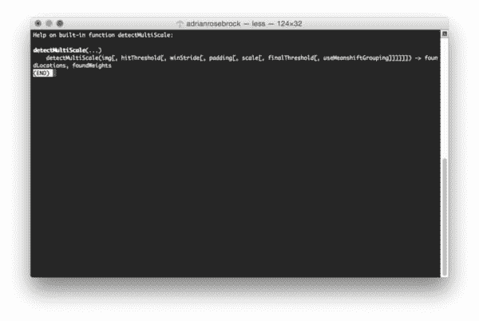
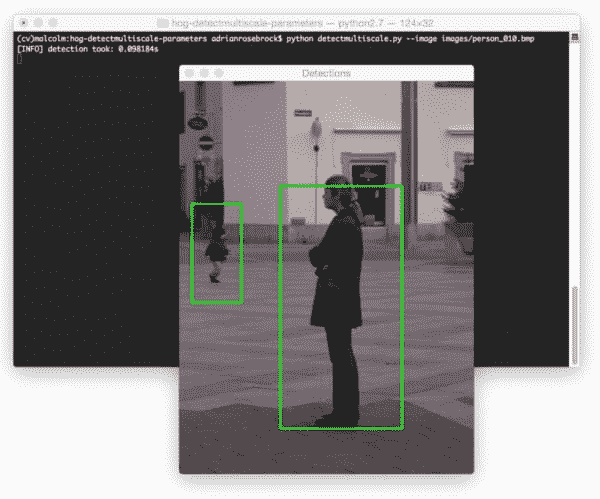
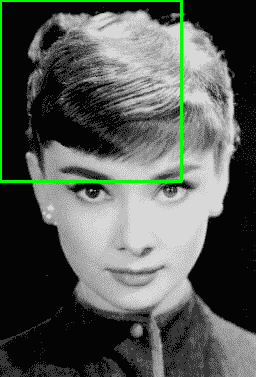
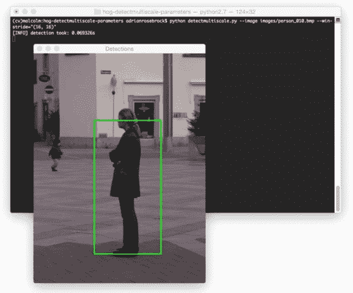
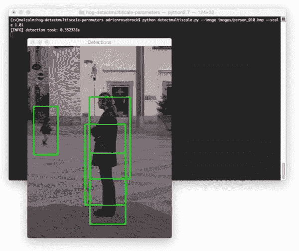
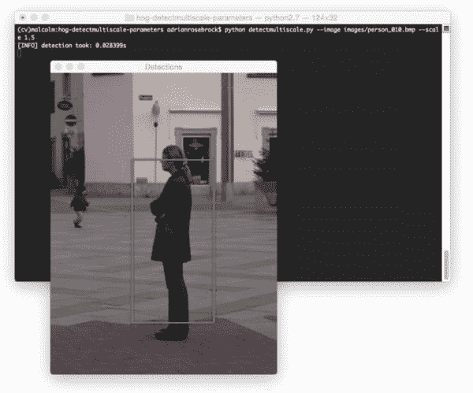
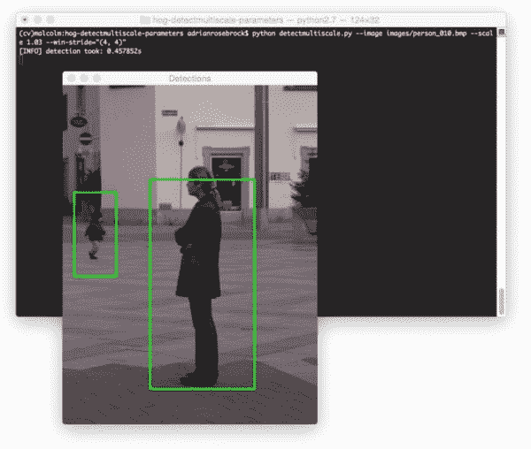
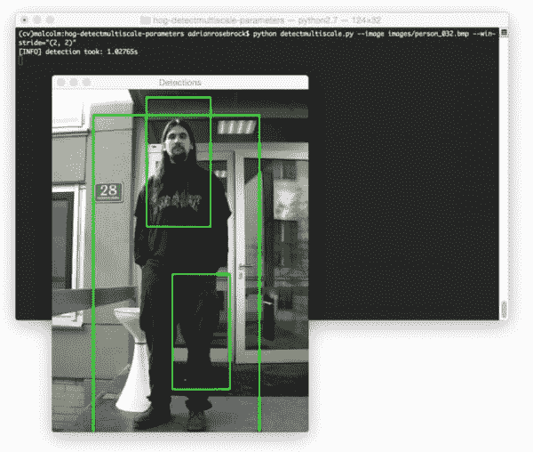
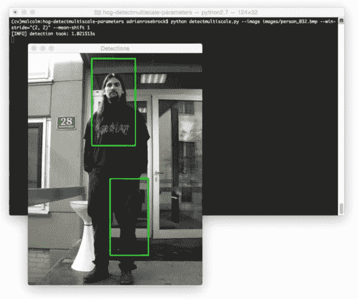
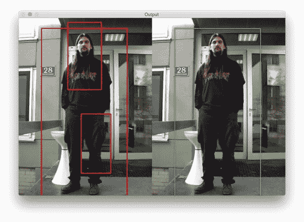

# HOG 检测多尺度参数解释

> 原文：<https://pyimagesearch.com/2015/11/16/hog-detectmultiscale-parameters-explained/>

[](https://pyimagesearch.com/wp-content/uploads/2015/11/detectmultiscale_help.jpg)

上周我们讨论了如何使用 OpenCV 和 Python 来[执行行人检测](https://pyimagesearch.com/2015/11/09/pedestrian-detection-opencv/)。

为了实现这一点，我们利用 OpenCV 自带的内置 [HOG +线性 SVM 检测器](https://pyimagesearch.com/2014/11/10/histogram-oriented-gradients-object-detection/)，允许我们检测图像中的人。

然而，我们*没有*详细讨论的猪人检测器的一个方面是`detectMultiScale`功能；具体来说，该功能的 ***参数*** 可以:

1.  增加假阳性检测的数量(即，报告图像中的位置包含人，但实际上不包含人)。
2.  导致完全错过检测。
3.  *显著地*影响检测过程的速度。

在这篇博文的剩余部分，我将把每个`detectMultiScale`参数分解成梯度方向直方图描述符和 SVM 检测器。

我还将解释如果我们希望我们的行人检测器实时运行，我们必须在*速度*和*精度*之间做出的 ***权衡*** 。如果您想在资源受限的设备(如 Raspberry Pi)上实时运行行人检测器，这种权衡*尤其重要*。

## 访问 HOG 检测多比例参数

要查看`detectMultiScale`函数的参数，只需启动一个 shell，导入 OpenCV，然后使用`help`函数:

```py
$ python
>>> import cv2
>>> help(cv2.HOGDescriptor().detectMultiScale)

```

[](https://pyimagesearch.com/wp-content/uploads/2015/11/detectmultiscale_help.jpg)

**Figure 1:** The available parameters to the detectMultiScale function.

您可以在任何 OpenCV 函数上使用内置的 Python `help`方法来获得参数和返回值的完整列表。

## HOG 检测多尺度参数解释

在我们探索`detectMultiScale`参数之前，让我们首先创建一个简单的 Python 脚本(基于我们上周的[行人检测器)，它将允许我们轻松地进行实验:](https://pyimagesearch.com/2015/11/09/pedestrian-detection-opencv/)

```py
# import the necessary packages
from __future__ import print_function
import argparse
import datetime
import imutils
import cv2

# construct the argument parse and parse the arguments
ap = argparse.ArgumentParser()
ap.add_argument("-i", "--image", required=True,
	help="path to the input image")
ap.add_argument("-w", "--win-stride", type=str, default="(8, 8)",
	help="window stride")
ap.add_argument("-p", "--padding", type=str, default="(16, 16)",
	help="object padding")
ap.add_argument("-s", "--scale", type=float, default=1.05,
	help="image pyramid scale")
ap.add_argument("-m", "--mean-shift", type=int, default=-1,
	help="whether or not mean shift grouping should be used")
args = vars(ap.parse_args())

```

因为这个脚本的大部分是基于上周的帖子，所以我将对代码做一个更快速的概述。

**第 9-20 行**处理解析我们的命令行参数`--image`开关是我们想要检测行人的输入图像的路径。`--win-stride`是滑动窗口在 *x* 和 *y* 方向的步长。`--padding`开关控制在 HOG 特征向量提取和 SVM 分类之前填充 ROI 的像素数量。为了控制图像金字塔的比例(允许我们在多个比例下检测图像中的人)，我们可以使用`--scale`参数。最后，如果我们想要对检测到的边界框应用均值漂移分组，可以指定`--mean-shift`。

```py
# evaluate the command line arguments (using the eval function like
# this is not good form, but let's tolerate it for the example)
winStride = eval(args["win_stride"])
padding = eval(args["padding"])
meanShift = True if args["mean_shift"] > 0 else False

# initialize the HOG descriptor/person detector
hog = cv2.HOGDescriptor()
hog.setSVMDetector(cv2.HOGDescriptor_getDefaultPeopleDetector())

# load the image and resize it
image = cv2.imread(args["image"])
image = imutils.resize(image, width=min(400, image.shape[1]))

```

既然我们已经解析了命令行参数，我们需要分别在第 24-26 行的**上提取它们的元组和布尔值。使用`eval`函数，尤其是在命令行参数中，并不是一种好的做法，但是为了这个例子，让我们容忍它(并且为了便于我们使用不同的`--win-stride`和`--padding`值)。**

**第 29 行和第 30 行**初始化方向梯度直方图检测器，并将支持向量机检测器设置为 OpenCV 中包含的默认行人检测器。

从那里，**第 33 行和第 34 行**加载我们的图像并将其调整到最大宽度为 400 像素——我们的图像越小，处理和检测图像中的人就越快。

```py
# detect people in the image
start = datetime.datetime.now()
(rects, weights) = hog.detectMultiScale(image, winStride=winStride,
	padding=padding, scale=args["scale"], useMeanshiftGrouping=meanShift)
print("[INFO] detection took: {}s".format(
	(datetime.datetime.now() - start).total_seconds()))

# draw the original bounding boxes
for (x, y, w, h) in rects:
	cv2.rectangle(image, (x, y), (x + w, y + h), (0, 255, 0), 2)

# show the output image
cv2.imshow("Detections", image)
cv2.waitKey(0)

```

**第 37-41 行**使用`detectMultiScale`函数和我们通过命令行参数提供的参数检测我们的`image`中的行人。我们将在**第 37 行和第 41 行**上启动和停止一个计时器，允许我们确定在给定的一组参数下处理一个图像需要多长时间。

最后，**第 44-49 行**在我们的`image`上画出边界框检测，并将输出显示到我们的屏幕上。

要获得对象检测计时的默认基线，只需执行以下命令:

```py
$ python detectmultiscale.py --image images/person_010.bmp

```

在我的 MacBook Pro 上，检测过程总共需要 0.09 秒，这意味着我每秒可以处理大约 10 张图像:

[](https://pyimagesearch.com/wp-content/uploads/2015/11/detectmultiscale_default_params.jpg)

**Figure 2:** On my system, it takes approximately 0.09s to process a single image using the default parameters.

在本课的剩余部分，我们将详细探讨`detectMultiScale`的参数，以及这些参数对检测时间的影响。

### img(必需)

这个参数非常明显——它是我们想要检测对象(在这个例子中是人)的图像。这是`detectMultiScale`函数的*唯一的*必需参数。我们传入的图像可以是*彩色*或者*灰度*。

### hitThreshold(可选)

`hitThreshold`参数是*可选的*，在`detectMultiScale`功能中默认不使用。

当我查看这个函数的 [OpenCV 文档](http://docs.opencv.org/2.4/modules/gpu/doc/object_detection.html#gpu-hogdescriptor-detectmultiscale)时，对参数的唯一描述是:*“特征和 SVM 分类平面之间距离的阈值”*。

鉴于该参数的稀疏文档(以及我在使用它进行行人检测时的奇怪行为)，我认为该参数控制输入 HOG 要素和 SVM 分类平面之间的最大欧氏距离。如果欧几里德距离*超过*该阈值，则检测被拒绝。然而，如果距离*低于*该阈值，则检测被接受。

我个人的观点是，你不应该费心去摆弄这个参数*，除非*你在你的图像中看到了极高的误报检测率。在这种情况下，可能值得尝试设置这个参数。否则，就让[非最大值抑制](https://pyimagesearch.com/2015/02/16/faster-non-maximum-suppression-python/)处理任何重叠的边界框，[就像我们在上一课](https://pyimagesearch.com/2015/11/09/pedestrian-detection-opencv/)中做的那样。

### winStride(可选)

`winStride`参数是一个二元组，它规定了滑动窗口的 *x* 和 *y* 位置的“步长”。

`winStride`和`scale`都是 ***非常重要的参数*** ，需要正确设置。这些参数 ***不仅对探测器的*精度*有巨大影响*** ，而且对探测器运行的*速度*也有巨大影响。

在对象检测的上下文中，滑动窗口是一个固定宽度和高度的矩形区域，它在图像上“滑动”，如下图所示:

[](https://pyimagesearch.com/wp-content/uploads/2014/10/sliding_window_example.gif)

**Figure 3:** An example of applying a sliding window to an image for face detection.

在滑动窗口的每一个停止点(对于图像金字塔的每一层，在下面的`scale`部分讨论)，我们(1)提取 HOG 特征并且(2)将这些特征传递给我们的线性 SVM 用于分类。特征提取和分类器决定的过程是一个昂贵的过程，所以如果我们打算近实时地运行我们的 Python 脚本，我们更愿意评估尽可能少的窗口。

*`winStride`越小，需要评估的窗口就越多(这可能很快变成相当大的计算负担):*

```py
$ python detectmultiscale.py --image images/person_010.bmp --win-stride="(4, 4)"

```

[](https://pyimagesearch.com/wp-content/uploads/2015/11/detectmultiscale_decrease_winstride.jpg)

**Figure 4:** Decreasing the *winStride* increases the amount of time it takes it process each each.

这里我们可以看到，将`winStride`减少到 *(4，4)* 实际上已经将我们的检测时间大大增加到 0.27 秒

类似地，*较大的* `winStride`是需要评估的*较少的窗口*(允许我们显著地加速我们的检测器)。然而，如果`winStride`变得太大，那么我们很容易完全错过检测:

```py
$ python detectmultiscale.py --image images/person_010.bmp --win-stride="(16, 16)"

```

[](https://pyimagesearch.com/wp-content/uploads/2015/11/detectmultiscale_increase_winstride.jpg)

**Figure 5:** Increasing the *winStride* can reduce our pedestrian detection time (0.09s down to 0.06s, respectively), but as you can see, we miss out on detecting the boy in the background.

我倾向于从使用 *(4，4)* 的`winStride`值开始，并增加该值，直到我在速度和检测精度之间获得合理的平衡。

### 填充(可选)

`padding`参数是一个元组，其指示在 HOG 特征提取之前滑动窗口 ROI 被“填充”的 *x* 和 *y* 方向上的像素数。

正如 Dalal 和 Triggs 在他们 2005 年的 CVPR 论文中所建议的，在之前，在图像 ROI *周围添加一点填充，以进行特征提取和分类，实际上可以提高检测器的准确性。*

填充的典型值包括 *(8，8)* 、 *(16，16)* 、 *(24，24)* 和 *(32，32)* 。

### 比例(可选)

图像金字塔是图像的*多尺度表示*:

[](https://pyimagesearch.com/wp-content/uploads/2015/03/pyramid_example.png)

**Figure 6:** An example image pyramid.

在图像金字塔的每一层，图像被缩小并且(可选地)通过高斯滤波器被平滑。

这个`scale`参数控制着我们的图像在图像金字塔的每一层被调整大小的因子，最终影响图像金字塔中等级的*数量*。

一个*变小* `scale`将 ***增加*** 图像金字塔中的层数*和* ***增加*** 处理图像所需的时间:

```py
$ python detectmultiscale.py --image images/person_010.bmp --scale 1.01

```

[](https://pyimagesearch.com/wp-content/uploads/2015/11/detectmultiscale_decrease_scale.jpg)

**Figure 7:** Decreasing the *scale* to 1.01

处理我们的图像所花费的时间已经大幅增加到 0.3 秒。我们现在还有一个重叠边界框的问题。然而，使用[非最大值抑制](https://pyimagesearch.com/2015/02/16/faster-non-maximum-suppression-python/)可以很容易地解决这个问题。

与此同时，*更大的*比例将 ***减少*** 金字塔中的层数，以及 ***减少*** 检测图像中的物体所需的时间:

```py
$ python detectmultiscale.py --image images/person_010.bmp --scale 1.5

```

[](https://pyimagesearch.com/wp-content/uploads/2015/11/detectmultiscale_increase_scale.jpg)

**Figure 8:** Increasing our *scale* allows us to process nearly 20 images per second — at the expense of missing some detections.

这里我们可以看到，我们仅用 0.02 秒就完成了行人检测，这意味着我们每秒可以处理近 *50 张图像*。然而，这是以错过一些检测为代价的，如上图所示。

最后，如果你同时减少*`winStride`和`scale`，你将*显著*增加执行物体检测的时间:*

```py
$ python detectmultiscale.py --image images/person_010.bmp --scale 1.03 \
	--win-stride="(4, 4)"

```

[](https://pyimagesearch.com/wp-content/uploads/2015/11/detectmultiscale_decrease_scale_and_winstride.jpg)

**Figure 9:** Decreasing both the scale and window stride.

我们能够检测到图像中的两个人——但执行这种检测几乎需要半秒钟，这绝对不适合实时应用。

请记住，对于*金字塔的每一层*，一个带有`winStride`台阶的滑动窗口会在*整个层*上移动。虽然评估图像金字塔的多个层很重要，使我们能够**在不同尺度下找到图像中的对象**，但这也增加了大量的计算负担，因为每一层还意味着必须执行一系列滑动窗口、HOG 特征提取和 SVM 决策。

`scale`的典型值通常在*【1.01，1.5】*范围内。如果您打算实时运行`detectMultiScale`,这个值应该尽可能大，而不显著牺牲检测精度。

同样，除了`winStride`，`scale`是检测速度方面最重要的参数。

### finalThreshold (optional)

老实说，我甚至无法在 OpenCV 文档中找到`finalThreshold`(特别是针对 Python 绑定的),我也不知道它是做什么的。我假设它与`hitThreshold`有些关系，允许我们对潜在的命中应用“最终阈值”，剔除潜在的误报，但同样，这只是基于参数名称的推测。

如果有人知道这个参数控制什么，请在这篇文章的底部留下评论。

### useMeanShiftGrouping(可选)

`useMeanShiftGrouping`参数是一个布尔值，指示是否应该执行均值偏移分组来处理潜在的重叠边界框。这个值默认为`False`，在我看来，永远不要设置为`True` —用[非极大值抑制](https://pyimagesearch.com/2015/02/16/faster-non-maximum-suppression-python/)代替；你会得到更好的结果。

当使用 HOG +线性 SVM 物体检测器时，您无疑会遇到多个重叠边界框的问题，其中检测器在我们试图检测的物体周围的区域*中多次触发:*

[](https://pyimagesearch.com/wp-content/uploads/2015/11/detectmultiscale_no_mean_shift.jpg)

**Figure 10:** An example of detecting multiple, overlapping bounding boxes.

为了抑制这些多重边界框， [Dalal 建议使用均值偏移](https://lear.inrialpes.fr/pubs/2006/Dal06/Dalal-phd-slides.pdf)(幻灯片 18)。然而，根据我的经验，均值偏移的性能次优，不应用作边界框抑制的方法，如下图所示:

[](https://pyimagesearch.com/wp-content/uploads/2015/11/detectmultiscale__mean_shift.jpg)

**Figure 11:** Applying mean-shift to handle overlapping bounding boxes.

相反，利用[非最大值抑制](https://pyimagesearch.com/2015/02/16/faster-non-maximum-suppression-python/) (NMS)。NMS 不仅速度更快，而且最终检测更加准确:

[](https://pyimagesearch.com/wp-content/uploads/2015/11/pedestrian_detection_person_032.jpg)

Figure 12: Instead of applying mean-shift, utilize NMS instead. Your results will be much better.

## 加快物体检测过程的提示

无论您是批量处理图像数据集，还是希望实时(或尽可能接近实时)运行 HOG 检测机，以下三个技巧都可以帮助您尽可能提高检测机的性能:

1.  **在不影响检测精度的情况下，尽可能缩小图像或帧的尺寸。**在调用`detectMultiScale`功能之前，减小你的图像的宽度和高度。您的图像越小，需要处理的数据就越少，因此检测器的运行速度会更快。
2.  **调整您的`scale`和`winStride`参数。**这两个参数对你的物体探测器速度有 ***巨大的影响*** 。`scale`和`winStride`都应该尽可能大，同样，不牺牲探测器的精度。
3.  **如果你的检测器*仍然*不够快……**你可能要考虑用 C/C++重新实现你的程序。Python 很棒，你可以用它做很多事情。但是有时您需要 C 或 C++的编译二进制速度——对于资源受限的环境尤其如此。

## 摘要

在本课中，我们复习了 HOG 描述符和 SVM 检测器的`detectMultiScale`函数的参数。具体来说，我们在行人检测的背景下检查了这些参数值。我们还讨论了使用 HOG 检测器时必须考虑的 ***速度和精度权衡*** 。

如果你的目标是在(近)实时应用中应用 HOG +线性 SVM，你首先要做的是在不牺牲检测精度的情况下，将图像尺寸调整到尽可能小:*图像越小，需要处理的数据就越少。*你可以一直跟踪你的尺寸调整因子，并将返回的边界框乘以这个因子，以获得与原始图像尺寸相关的边界框尺寸。

其次，一定要玩好你的`scale`和`winStride`参数。这些值会极大地影响检测机的检测准确性(以及假阳性率)。

最后，如果您仍然没有获得想要的每秒帧数(假设您正在处理一个实时应用程序)，您可能需要考虑用 C/C++重新实现您的程序。虽然 Python 非常快(从各方面考虑)，但有时你无法超越二进制可执行文件的速度。**