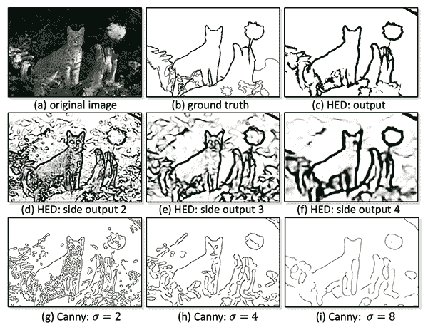
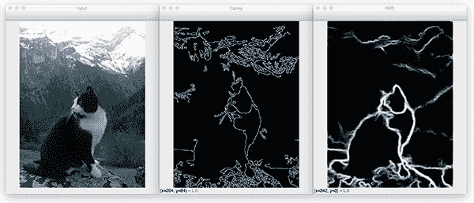
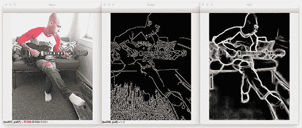
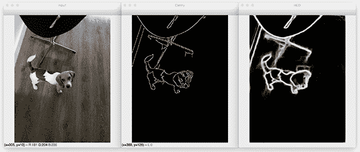

# 基于 OpenCV 和深度学习的整体嵌套边缘检测

> 原文：<https://pyimagesearch.com/2019/03/04/holistically-nested-edge-detection-with-opencv-and-deep-learning/>


在本教程中，您将学习如何通过 OpenCV 和深度学习应用整体嵌套边缘检测(HED)。我们将对图像和视频流应用整体嵌套边缘检测，然后将结果与 OpenCV 的标准 Canny 边缘检测器进行比较。

**边缘检测使我们能够找到图像中物体的边界**，是图像处理和计算机视觉的第一个应用用例之一。

当使用 OpenCV 进行边缘检测时，你很可能会使用 [Canny 边缘检测器](https://pyimagesearch.com/2015/04/06/zero-parameter-automatic-canny-edge-detection-with-python-and-opencv/)；然而，**Canny 边缘检测器有几个问题，即:**

1.  设置滞后阈值的下限值和上限值是一个*手动过程*，需要实验和视觉验证。
2.  适用于一幅图像的滞后阈值可能不适用于另一幅图像(对于在不同光照条件下拍摄的图像来说，*几乎总是如此*)。
3.  Canny 边缘检测器通常需要多个预处理步骤(即转换为灰度、模糊/平滑等。)以便获得良好的边缘图。

**整体嵌套边缘检测** (HED)试图通过*端到端深度神经网络*解决 Canny 边缘检测器的局限性。

该网络接受 RGB 图像作为输入，然后产生边缘图作为输出。此外，HED 制作的边缘图在保留图像中的对象边界方面做得更好。

**要了解关于 OpenCV 整体嵌套边缘检测的更多信息，*请继续阅读！***

### 基于 OpenCV 和深度学习的整体嵌套边缘检测

在本教程中，我们将学习使用 OpenCV 和深度学习的整体嵌套边缘检测(HED)。

我们将从讨论整体嵌套边缘检测算法开始。

从那里我们将回顾我们的项目结构，然后在*图像*和*视频*中利用 HED 进行边缘检测。

让我们开始吧！

### 什么是整体嵌套边缘检测？

[](https://pyimagesearch.com/wp-content/uploads/2019/03/holistically_nested_edge_detection_vis.png)

**Figure 1:** Holistically-Nested Edge Detection with OpenCV and Deep Learning (source: [2015 Xie and Tu Figure 1](https://arxiv.org/pdf/1504.06375.pdf))

我们今天要用的算法来自谢和涂 2015 年的论文， [*【整体嵌套边缘检测】*](https://arxiv.org/abs/1504.06375)，简称“”。

谢和涂的工作描述了能够自动学习丰富的分层边缘图的深度神经网络，所述分层边缘图能够确定图像中对象的边缘/对象边界。

这个边缘检测网络能够在 [Berkely BSDS500](https://www2.eecs.berkeley.edu/Research/Projects/CS/vision/bsds/) 和 [NYU 深度](https://cs.nyu.edu/~silberman/datasets/)数据集上获得最先进的结果。

对网络架构和算法的全面回顾超出了本帖的范围，因此请参考[官方出版物](https://arxiv.org/abs/1504.06375)了解更多细节。

### 项目结构

继续抓取今天的 ***【下载】*** 并解压文件。

在那里，您可以使用以下命令检查项目目录:

```py
$ tree --dirsfirst
.
├── hed_model
│   ├── deploy.prototxt
│   └── hed_pretrained_bsds.caffemodel
├── images
│   ├── cat.jpg
│   ├── guitar.jpg
│   └── janie.jpg
├── detect_edges_image.py
└── detect_edges_video.py

2 directories, 7 files

```

我们的 HED 咖啡模型包含在`hed_model/`目录中。

我提供了一些样本，包括我自己的一张照片，我的狗，还有我在网上找到的一张猫的图片样本。

今天我们将回顾一下`detect_edges_image.py`和`detect_edges_video.py`脚本。两个脚本共享相同的边缘检测过程，所以我们将花大部分时间在 HED 图像脚本上。

### 图像整体嵌套边缘检测

我们今天讨论的 Python 和 OpenCV 整体嵌套的边缘检测示例与 OpenCV 官方报告中的 [HED 示例非常相似。](https://github.com/opencv/opencv/blob/master/samples/dnn/edge_detection.py)

**我在这里的主要贡献是:**

1.  提供一些额外的文档(在适当的时候)
2.  最重要的是，**向您展示如何在您自己的项目中使用整体嵌套边缘检测。**

让我们开始吧——打开`detect_edge_image.py`文件并插入以下代码:

```py
# import the necessary packages
import argparse
import cv2
import os

# construct the argument parser and parse the arguments
ap = argparse.ArgumentParser()
ap.add_argument("-d", "--edge-detector", type=str, required=True,
	help="path to OpenCV's deep learning edge detector")
ap.add_argument("-i", "--image", type=str, required=True,
	help="path to input image")
args = vars(ap.parse_args())

```

我们的进口货物是在**2-4 号线**处理的。我们将使用 [`argparse`来解析命令行参数](https://pyimagesearch.com/2018/03/12/python-argparse-command-line-arguments/)。OpenCV 函数和方法通过`cv2`导入来访问。我们的`os`导入将允许我们在任何操作系统下构建文件路径。

该脚本需要两个命令行参数:

*   `--edge-detector`:OpenCV 深度学习边缘检测器的路径。该路径包含两个 Caffe 文件，稍后将用于初始化我们的模型。
*   `--image`:测试用输入图像的路径。就像我之前说的——我已经在 ***【下载】*** 中提供了一些图片，但是你也应该在你自己的图片上尝试一下这个脚本。

让我们定义一下我们的`CropLayer`类:

```py
class CropLayer(object):
	def __init__(self, params, blobs):
		# initialize our starting and ending (x, y)-coordinates of
		# the crop
		self.startX = 0
		self.startY = 0
		self.endX = 0
		self.endY = 0

```

为了利用 OpenCV 的整体嵌套边缘检测模型，我们需要定义一个自定义的层裁剪类——我们将这个类恰当地命名为`CropLayer`。

在这个类的构造函数中，我们存储了开始和结束的坐标 *(x，y)*——分别是裁剪开始和结束的坐标(**第 15-21 行**)。

使用 OpenCV 应用 HED 的下一步是定义`getMemoryShapes`函数，这个方法负责计算`inputs`的卷大小:

```py
	def getMemoryShapes(self, inputs):
		# the crop layer will receive two inputs -- we need to crop
		# the first input blob to match the shape of the second one,
		# keeping the batch size and number of channels
		(inputShape, targetShape) = (inputs[0], inputs[1])
		(batchSize, numChannels) = (inputShape[0], inputShape[1])
		(H, W) = (targetShape[2], targetShape[3])

		# compute the starting and ending crop coordinates
		self.startX = int((inputShape[3] - targetShape[3]) / 2)
		self.startY = int((inputShape[2] - targetShape[2]) / 2)
		self.endX = self.startX + W
		self.endY = self.startY + H

		# return the shape of the volume (we'll perform the actual
		# crop during the forward pass
		return [[batchSize, numChannels, H, W]]

```

**第 27 行**导出输入体积的形状以及目标形状。

**第 28 行**也从`inputs`中提取批次大小和通道数量。

最后，**行 29** 分别提取目标形状的高度和宽度。

给定这些变量，我们可以计算开始和结束作物 *(x，y)*-**线 32-35** 上的坐标。

然后，我们将体积的形状返回给第 39 行上的调用函数。

我们需要定义的最后一个方法是`forward`函数。该功能负责在网络的正向传递(即推理/边缘预测)过程中执行裁剪:

```py
	def forward(self, inputs):
		# use the derived (x, y)-coordinates to perform the crop
		return [inputs[0][:, :, self.startY:self.endY,
				self.startX:self.endX]]

```

**第 43 行和第 44 行**利用了 Python 和 NumPy 方便的列表/数组切片语法。

给定我们的`CropLayer`类，我们现在可以从磁盘加载我们的 HED 模型，并用`net`注册`CropLayer`:

```py
# load our serialized edge detector from disk
print("[INFO] loading edge detector...")
protoPath = os.path.sep.join([args["edge_detector"],
	"deploy.prototxt"])
modelPath = os.path.sep.join([args["edge_detector"],
	"hed_pretrained_bsds.caffemodel"])
net = cv2.dnn.readNetFromCaffe(protoPath, modelPath)

# register our new layer with the model
cv2.dnn_registerLayer("Crop", CropLayer)

```

我们的 prototxt 路径和模型路径是使用通过`args["edge_detector"]` ( **第 48-51 行**)可用的`--edge-detector`命令行参数构建的。

从那里，`protoPath`和`modelPath`都用于在**线 52** 上加载和初始化我们的 Caffe 模型。

让我们继续加载我们的输入内容`image`:

```py
# load the input image and grab its dimensions
image = cv2.imread(args["image"])
(H, W) = image.shape[:2]

# convert the image to grayscale, blur it, and perform Canny
# edge detection
print("[INFO] performing Canny edge detection...")
gray = cv2.cvtColor(image, cv2.COLOR_BGR2GRAY)
blurred = cv2.GaussianBlur(gray, (5, 5), 0)
canny = cv2.Canny(blurred, 30, 150)

```

我们的原始数据`image`被加载，空间尺寸(宽度和高度)在**行 58 和 59** 被提取。

我们还计算 Canny 边缘图(**第 64-66 行**)，这样我们可以将我们的边缘检测结果与 HED 进行比较。

最后，我们准备应用 HED:

```py
# construct a blob out of the input image for the Holistically-Nested
# Edge Detector
blob = cv2.dnn.blobFromImage(image, scalefactor=1.0, size=(W, H),
	mean=(104.00698793, 116.66876762, 122.67891434),
	swapRB=False, crop=False)

# set the blob as the input to the network and perform a forward pass
# to compute the edges
print("[INFO] performing holistically-nested edge detection...")
net.setInput(blob)
hed = net.forward()
hed = cv2.resize(hed[0, 0], (W, H))
hed = (255 * hed).astype("uint8")

# show the output edge detection results for Canny and
# Holistically-Nested Edge Detection
cv2.imshow("Input", image)
cv2.imshow("Canny", canny)
cv2.imshow("HED", hed)
cv2.waitKey(0)

```

为了将整体嵌套边缘检测(HED)与 OpenCV 和深度学习一起应用，我们:

*   从我们的图像中构造一个`blob`(**第 70-72 行**)。
*   将斑点通过 HED 网，获得`hed`输出(**行 77 和 78** )。
*   将输出调整到我们的原始图像尺寸( **Line 79** )。
*   将我们的图像像素缩放回范围*【0，255】*，并确保类型为`"uint8"` ( **第 80 行**)。

最后，我们将展示:

1.  原始输入图像
2.  Canny 边缘检测图像
3.  我们的整体嵌套边缘检测结果

### 图像和 HED 结果

要使用 OpenCV 将整体嵌套的边缘检测应用到您自己的图像，请确保您使用本教程的 ***【下载】*** 部分来获取源代码、经过训练的 HED 模型和示例图像文件。从那里，打开一个终端并执行以下命令:

```py
$ python detect_edges_image.py --edge-detector hed_model --image images/cat.jpg
[INFO] loading edge detector...
[INFO] performing Canny edge detection...
[INFO] performing holistically-nested edge detection...

```

[](https://pyimagesearch.com/wp-content/uploads/2019/03/holistically_nested_edge_detection_cat.png)

**Figure 2:** Edge detection via the HED approach with OpenCV and deep learning ([input image source](https://www.boredpanda.com/cat-guide-man- mountain-gimmelwald-switzerland/? utm_source=google&utm_medium=organic&utm_cam paign=organic)).

左边的*是我们的输入图像。*

在*中心*我们有一个灵敏的边缘检测器。

右边的*是我们应用整体嵌套边缘检测后的最终输出。*

请注意，精明的边缘检测器无法保留猫、山脉或猫所坐的岩石的对象边界。

另一方面，HED 能够保留所有这些物体的边界。

让我们尝试另一个图像:

```py
$ python detect_edges_image.py --edge-detector hed_model --image images/guitar.jpg
[INFO] loading edge detector...
[INFO] performing Canny edge detection...
[INFO] performing holistically-nested edge detection...

```

[](https://pyimagesearch.com/wp-content/uploads/2019/03/holistically_nested_edge_detection_guitar.png)

**Figure 3:** Me playing guitar in my office (*left*). Canny edge detection (*center*). Holistically-Nested Edge Detection (*right*).

在上面的**图 3** 中，我们可以看到一个我弹吉他的例子。使用 Canny 边缘检测器，会有许多由地毯的纹理和图案引起的“噪声”——相反，HED 没有这样的噪声。

此外，HED 在捕捉我的衬衫、牛仔裤(包括牛仔裤上的洞)和吉他的对象边界方面做得更好。

让我们做最后一个例子:

```py
$ python detect_edges_image.py --edge-detector hed_model --image images/janie.jpg
[INFO] loading edge detector...
[INFO] performing Canny edge detection...
[INFO] performing holistically-nested edge detection...

```

[](https://pyimagesearch.com/wp-content/uploads/2019/03/holistically_nested_edge_detection_janie.png)

**Figure 4:** My beagle, Janie, undergoes Canny and Holistically-Nested Edge Detection (HED) with OpenCV and deep learning.

这幅图像中有两个物体:(1)珍妮，一只狗，和(2)她身后的椅子。

精明的边缘检测器(*中心*)在突出椅子的轮廓方面做得很好，但不能正确地捕捉到狗的对象边界，主要是因为她的外套中的亮/暗和暗/亮过渡。

HED ( *右*)更容易捕捉到简妮的整个轮廓。

### 视频中整体嵌套的边缘检测

我们已经用 OpenCV 对图像应用了整体嵌套边缘检测——对视频也可以这样做吗？

让我们找出答案。

打开`detect_edges_video.py`文件并插入以下代码:

```py
# import the necessary packages
from imutils.video import VideoStream
import argparse
import imutils
import time
import cv2
import os

# construct the argument parser and parse the arguments
ap = argparse.ArgumentParser()
ap.add_argument("-d", "--edge-detector", type=str, required=True,
	help="path to OpenCV's deep learning edge detector")
ap.add_argument("-i", "--input", type=str,
	help="path to optional input video (webcam will be used otherwise)")
args = vars(ap.parse_args())

```

我们的视频脚本需要三个额外的导入:

*   `VideoStream`:从网络摄像头、视频文件或其他输入源读取帧。
*   `imutils`:我在 [GitHub](https://github.com/jrosebr1/imutils) 和 [PyPi](https://pypi.org/project/imutils/) 上提供的便利功能包。我们正在使用我的`resize`函数。
*   `time`:该模块允许我们发出睡眠命令，以允许我们的视频流建立并“预热”。

第 10-15 行上的两个命令行参数非常相似:

*   `--edge-detector`:OpenCV 的 HED 边缘检测器之路。
*   `--input`:输入视频文件的*可选*路径。如果没有提供路径，将使用网络摄像头。

我们的`CropLayer`类与我们之前定义的相同:

```py
class CropLayer(object):
	def __init__(self, params, blobs):
		# initialize our starting and ending (x, y)-coordinates of
		# the crop
		self.startX = 0
		self.startY = 0
		self.endX = 0
		self.endY = 0

	def getMemoryShapes(self, inputs):
		# the crop layer will receive two inputs -- we need to crop
		# the first input blob to match the shape of the second one,
		# keeping the batch size and number of channels
		(inputShape, targetShape) = (inputs[0], inputs[1])
		(batchSize, numChannels) = (inputShape[0], inputShape[1])
		(H, W) = (targetShape[2], targetShape[3])

		# compute the starting and ending crop coordinates
		self.startX = int((inputShape[3] - targetShape[3]) / 2)
		self.startY = int((inputShape[2] - targetShape[2]) / 2)
		self.endX = self.startX + W
		self.endY = self.startY + H

		# return the shape of the volume (we'll perform the actual
		# crop during the forward pass
		return [[batchSize, numChannels, H, W]]

	def forward(self, inputs):
		# use the derived (x, y)-coordinates to perform the crop
		return [inputs[0][:, :, self.startY:self.endY,
				self.startX:self.endX]]

```

在定义了我们的*相同的* `CropLayer`类之后，我们将继续初始化我们的视频流和 HED 模型:

```py
# initialize a boolean used to indicate if either a webcam or input
# video is being used
webcam = not args.get("input", False)

# if a video path was not supplied, grab a reference to the webcam
if webcam:
	print("[INFO] starting video stream...")
	vs = VideoStream(src=0).start()
	time.sleep(2.0)

# otherwise, grab a reference to the video file
else:
	print("[INFO] opening video file...")
	vs = cv2.VideoCapture(args["input"])

# load our serialized edge detector from disk
print("[INFO] loading edge detector...")
protoPath = os.path.sep.join([args["edge_detector"],
	"deploy.prototxt"])
modelPath = os.path.sep.join([args["edge_detector"],
	"hed_pretrained_bsds.caffemodel"])
net = cv2.dnn.readNetFromCaffe(protoPath, modelPath)

# register our new layer with the model
cv2.dnn_registerLayer("Crop", CropLayer)

```

无论我们选择使用我们的`webcam`还是一个视频文件，脚本都将动态地为这两者工作(**第 51-62 行**)。

我们的 HED 模型被加载，`CropLayer`被注册在**行 65-73** 。

让我们循环获取帧并应用边缘检测！

```py
# loop over frames from the video stream
while True:
	# grab the next frame and handle if we are reading from either
	# VideoCapture or VideoStream
	frame = vs.read()
	frame = frame if webcam else frame[1]

	# if we are viewing a video and we did not grab a frame then we
	# have reached the end of the video
	if not webcam and frame is None:
		break

	# resize the frame and grab its dimensions
	frame = imutils.resize(frame, width=500)
	(H, W) = frame.shape[:2]

```

我们开始在第 76-80 行的**帧上循环。如果我们到达一个视频文件的结尾(当一帧是`None`时就会发生)，我们将从循环中断开(**第 84 行和第 85 行**)。**

第 88 行和第 89 行调整我们的框架大小，使其宽度为 500 像素。然后，我们在调整大小后获取框架的尺寸。

现在，让我们像在之前的脚本中一样处理帧*和*:

```py
	# convert the frame to grayscale, blur it, and perform Canny
	# edge detection
	gray = cv2.cvtColor(frame, cv2.COLOR_BGR2GRAY)
	blurred = cv2.GaussianBlur(gray, (5, 5), 0)
	canny = cv2.Canny(blurred, 30, 150)

	# construct a blob out of the input frame for the Holistically-Nested
	# Edge Detector, set the blob, and perform a forward pass to
	# compute the edges
	blob = cv2.dnn.blobFromImage(frame, scalefactor=1.0, size=(W, H),
		mean=(104.00698793, 116.66876762, 122.67891434),
		swapRB=False, crop=False)
	net.setInput(blob)
	hed = net.forward()
	hed = cv2.resize(hed[0, 0], (W, H))
	hed = (255 * hed).astype("uint8")

```

在输入帧上计算坎尼边缘检测(**行 93-95** )和 HED 边缘检测(**行 100-106** )。

从那里，我们将显示边缘检测结果:

```py
	# show the output edge detection results for Canny and
	# Holistically-Nested Edge Detection
	cv2.imshow("Frame", frame)
	cv2.imshow("Canny", canny)
	cv2.imshow("HED", hed)
	key = cv2.waitKey(1) & 0xFF

	# if the `q` key was pressed, break from the loop
	if key == ord("q"):
		break

# if we are using a webcam, stop the camera video stream
if webcam:
	vs.stop()

# otherwise, release the video file pointer
else:
	vs.release()

# close any open windows
cv2.destroyAllWindows()

```

我们的三个输出帧显示在**行 110-112** : (1)原始的、调整大小的帧，(Canny 边缘检测结果，以及(3)HED 结果。

按键通过**线 113** 捕获。如果按下`"q"`，我们将中断循环并清理(**第 116-128 行**)。

### 视频和 HED 结果

那么，如何使用 OpenCV 实时执行整体嵌套边缘检测呢？

让我们找出答案。

请务必使用这篇博文的 ***【下载】*** 部分下载源代码和 HED 模型。

从那里，打开一个终端并执行以下命令:

```py
$ python detect_edges_video.py --edge-detector hed_model
[INFO] starting video stream...
[INFO] loading edge detector...

```


在上面简短的 GIF 演示中，你可以看到 HED 模型的演示。

请特别注意，当使用 Canny 边缘检测器时，背景中的灯边界是如何完全丢失的；然而，当使用 HED 时，边界被保留。

在性能方面，我在收集上面的演示时使用的是我的 3Ghz 英特尔至强 W 处理器。我们使用 HED 模型在 CPU 上获得了接近实时的性能。

要获得真正的实时性能，您需要利用 GPU 但是，请记住，OpenCV 的“dnn”模块的 GPU 支持特别有限(具体来说，目前不支持 NVIDIA GPUs)。

与此同时，如果您需要实时性能，您可以考虑使用 Caffe + Python 绑定。

## 摘要

在本教程中，您学习了如何使用 OpenCV 和深度学习来执行整体嵌套边缘检测(HED)。

与 Canny 边缘检测器不同，Canny 边缘检测器需要预处理步骤、手动调整参数，并且通常在使用不同照明条件捕获的图像上表现不佳，整体嵌套边缘检测寻求创建一个*端到端*深度学习边缘检测器。

正如我们的结果显示，HED 产生的输出边缘图比简单的 Canny 边缘检测器更好地保留了对象边界。整体嵌套边缘检测可以在环境和光照条件潜在地未知或简单地不可控的应用中潜在地替代 Canny 边缘检测。

不利的一面是，HED 的计算成本比 Canny 高得多。Canny 边缘检测器可以在 CPU 上超实时运行；然而，HED 的实时性能需要 GPU。

我希望你喜欢今天的帖子！

**要下载本指南的源代码，并在 PyImageSearch 上发布未来教程时得到通知，*只需在下表中输入您的电子邮件地址！***