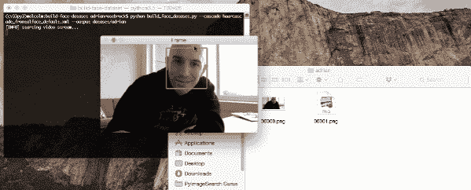

# 如何构建自定义人脸识别数据集

> 原文：<https://pyimagesearch.com/2018/06/11/how-to-build-a-custom-face-recognition-dataset/>

[](https://pyimagesearch.com/wp-content/uploads/2018/06/build_face_dataset_method_1.gif)

在接下来的几篇博文中，我们将训练一个计算机视觉+深度学习模型来执行 ***面部识别……***

…但是在我们能够*训练*我们的模型识别图像和视频流中的人脸之前，我们首先需要 ***收集人脸数据集本身。***

如果你已经在使用一个预先准备好的数据集，比如《野生人脸标签》( LFW ),那么艰苦的工作已经为你完成了。您将能够使用下周的博客文章来创建您的面部识别应用程序。

但是对于我们大多数人来说，我们反而想要识别不属于任何当前数据集的面孔并且识别我们自己、朋友、家庭成员、同事和同事等的面孔。

为了做到这一点，我们需要收集我们想要识别的人脸样本，然后以某种方式量化它们。

这个过程通常被称为**面部识别注册**。我们称之为“注册”,因为我们将用户作为数据集和应用程序中的示例人员进行“注册”。

今天的博文将关注注册过程的第一步:创建一个自定义的样本人脸数据集。

在下周的博客文章中，你将学习如何获取这个示例图像数据集，量化人脸，并创建自己的面部识别+ OpenCV 应用程序。

**要了解如何创建自己的人脸识别数据集，*请继续阅读！***

## 如何创建自定义人脸识别数据集

在本教程中，我们将回顾三种为面部识别创建自定义数据集的方法。

第一种方法将使用 OpenCV 和网络摄像头来(1)检测视频流中的人脸，以及(2)将示例人脸图像/帧保存到磁盘。

第二种方法将讨论如何以编程方式下载人脸图像。

最后，我们将讨论图像的手动收集以及这种方法何时合适。

让我们开始构建人脸识别数据集吧！

### 方法 1:通过 OpenCV 和网络摄像头进行面部注册

[](https://pyimagesearch.com/wp-content/uploads/2018/06/build_face_dataset_method_1.gif)

**Figure 1:** Using OpenCV and a webcam it’s possible to detect faces in a video stream and save the examples to disk. This process can be used to create a face recognition dataset on premises.

**这是创建您自己的自定义人脸识别数据集的第一种方法，适用于:**

1.  您正在构建一个“现场”人脸识别系统
2.  而且你需要和特定的人有物理接触来收集他们面部的图像

这种系统对于公司、学校或其他组织来说是典型的，在这些组织中，人们需要每天亲自出现和参加。

为了收集这些人的示例面部图像，我们可以护送他们到一个特殊的房间，在那里安装了一台摄像机，以(1)检测他们面部在视频流中的 *(x，y)*-坐标，以及(2)将包含他们面部的帧写入磁盘。

我们甚至可能在几天或几周内执行这一过程，以收集他们面部的样本:

*   不同的照明条件
*   一天中的时间
*   心情和情绪状态

…创建一组更多样化的图像，代表特定人物的面部。

让我们继续构建一个简单的 Python 脚本，以便于构建我们的自定义人脸识别数据集。该 Python 脚本将:

1.  访问我们的网络摄像头
2.  检测人脸
3.  将包含该面的帧写入磁盘

要获取今天博文的代码，请务必滚动到 ***【下载】*** 部分。

当你准备好了，打开`build_face_dataset.py`让我们一步步来:

```py
# import the necessary packages
from imutils.video import VideoStream
import argparse
import imutils
import time
import cv2
import os

```

在**2-7 行**，我们导入我们需要的包。值得注意的是，我们需要 OpenCV 和`imutils`。

要安装 OpenCV，请务必遵循我在本页上的安装指南。

您可以通过 pip 轻松安装或升级 [imutils](https://github.com/jrosebr1/imutils) :

```py
$ pip install --upgrade imutils

```

如果您正在使用 Python 虚拟环境，不要忘记使用`workon`命令！

现在您的环境已经设置好了，让我们来讨论两个必需的[命令行参数](https://pyimagesearch.com/2018/03/12/python-argparse-command-line-arguments/):

```py
# construct the argument parser and parse the arguments
ap = argparse.ArgumentParser()
ap.add_argument("-c", "--cascade", required=True,
	help = "path to where the face cascade resides")
ap.add_argument("-o", "--output", required=True,
	help="path to output directory")
args = vars(ap.parse_args())

```

命令行参数在运行时由一个名为`argparse`的便利包解析(它包含在所有 Python 安装中)。如果你不熟悉`argparse`和命令行参数，我强烈推荐你给[一个快速阅读这篇博文](https://pyimagesearch.com/2018/03/12/python-argparse-command-line-arguments/)的机会。

我们有两个必需的命令行参数:

*   `--cascade`:磁盘上 Haar cascade 文件的路径。
*   `--output`:输出目录的路径。人脸图像将存储在此目录中，我建议您以人名命名此目录。如果您的名字是“John Smith”，您可以将所有图像放在`dataset/john_smith`中。

让我们加载我们的脸哈尔级联和初始化我们的视频流:

```py
# load OpenCV's Haar cascade for face detection from disk
detector = cv2.CascadeClassifier(args["cascade"])

# initialize the video stream, allow the camera sensor to warm up,
# and initialize the total number of example faces written to disk
# thus far
print("[INFO] starting video stream...")
vs = VideoStream(src=0).start()
# vs = VideoStream(usePiCamera=True).start()
time.sleep(2.0)
total = 0

```

在**的第 18 行**我们加载了 OpenCV 的 Haar face `detector`。这个`detector`将在我们即将到来的逐帧循环中完成繁重的工作。

我们在第 24 行的**上实例化并启动我们的`VideoStream`。**

***注意:**如果你使用的是 Raspberry Pi，注释掉**第 24 行**并取消后面一行的注释。*

为了让我们的相机预热，我们简单地暂停两秒钟(**第 26 行**)。

我们还初始化了一个代表存储在磁盘上的人脸图像数量的`total`计数器(**第 27 行**)。

现在让我们逐帧循环视频流:

```py
# loop over the frames from the video stream
while True:
	# grab the frame from the threaded video stream, clone it, (just
	# in case we want to write it to disk), and then resize the frame
	# so we can apply face detection faster
	frame = vs.read()
	orig = frame.copy()
	frame = imutils.resize(frame, width=400)

	# detect faces in the grayscale frame
	rects = detector.detectMultiScale(
		cv2.cvtColor(frame, cv2.COLOR_BGR2GRAY), scaleFactor=1.1, 
		minNeighbors=5, minSize=(30, 30))

	# loop over the face detections and draw them on the frame
	for (x, y, w, h) in rects:
		cv2.rectangle(frame, (x, y), (x + w, y + h), (0, 255, 0), 2)

```

在**行 30** 处，我们开始循环(当按下“q”键时，循环退出)。

从那里，我们抓取一个`frame`，创建一个副本，并调整它的大小(**第 34-36 行**)。

***现在该进行人脸检测了！***

使用`detectMultiScale`方法，我们可以在`frame`中检测人脸。该函数需要多个参数:

*   `image`:灰度图像
*   `scaleFactor`:指定图像尺寸在每个比例下缩小多少
*   `minNeighbor`:指定每个候选边界框矩形应该有多少个邻居以保持有效检测的参数
*   `minSize`:可能的最小面部图像尺寸

不幸的是，有时这种方法需要调整以消除假阳性或检测人脸，但对于“近距离”人脸检测，这些参数应该是一个很好的起点。

也就是说，你在寻找更先进、更可靠的方法吗？在之前的一篇博文中，我用 OpenCV 和深度学习 覆盖了 [*人脸检测。你可以很容易地用深度学习方法更新今天的脚本，这种方法使用预先训练好的模型。这种方法的好处是不需要调整参数，而且速度非常快。*](https://pyimagesearch.com/2018/02/26/face-detection-with-opencv-and-deep-learning/)

我们的人脸检测方法的结果是一个`rects`(包围盒矩形)列表。在第 44 和 45 行的**上，我们循环遍历`rects`并在`frame`上画出矩形用于显示。**

我们将在循环中采取的最后步骤是(1)在屏幕上显示帧，以及(2)处理按键:

```py
	# show the output frame
	cv2.imshow("Frame", frame)
	key = cv2.waitKey(1) & 0xFF

	# if the `k` key was pressed, write the *original* frame to disk
	# so we can later process it and use it for face recognition
	if key == ord("k"):
		p = os.path.sep.join([args["output"], "{}.png".format(
			str(total).zfill(5))])
		cv2.imwrite(p, orig)
		total += 1

	# if the `q` key was pressed, break from the loop
	elif key == ord("q"):
		break

```

在**行 48** 上，我们将帧显示到屏幕上，然后捕捉**行 49** 上的按键。

根据是否按下“k”或“q”键，我们将:

*   保留`frame`并保存到磁盘中(**第 53-56 行**)。我们还增加我们捕获的`total`帧(**行 57** )。对于每个我们想要“保留”的`frame`，必须按下“k”键。我建议让你的脸保持在不同的角度，不同的部位，戴/不戴眼镜，等等。
*   退出循环，准备退出脚本(quit)。

如果没有键被按下，我们从循环的顶部开始，从流中抓取一个`frame`。

最后，我们将打印终端中存储的图像数量并执行清理:

```py
# print the total faces saved and do a bit of cleanup
print("[INFO] {} face images stored".format(total))
print("[INFO] cleaning up...")
cv2.destroyAllWindows()
vs.stop()

```

现在让我们运行脚本并收集面孔！

确保你已经从这篇博文的 ***“下载”*** 部分下载了代码和 Haar cascade。

从那里，在您的终端中执行以下命令:

```py
$ python build_face_dataset.py --cascade haarcascade_frontalface_default.xml \
	--output dataset/adrian
[INFO] starting video stream...
[INFO] 6 face images stored
[INFO] cleaning up...

```

<https://www.youtube.com/embed/K0l0cs7ekeo?feature=oembed>