# 如何为计算机视觉和深度学习配置您的 NVIDIA Jetson Nano

> 原文：<https://pyimagesearch.com/2020/03/25/how-to-configure-your-nvidia-jetson-nano-for-computer-vision-and-deep-learning/>

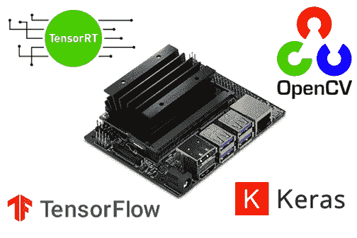

在今天的教程中，您将了解如何使用 TensorFlow、Keras、TensorRT 和 OpenCV 为计算机视觉和深度学习配置您的 NVIDIA Jetson Nano。

两周前，我们讨论了如何使用我的 [*预配置的* Nano。img 文件](https://pyimagesearch.com/2020/03/04/nvidia-jetson-nano-img-pre-configured-for-deep-learning-and-computer-vision/) — **今天，你将从*开始学习如何配置自己的 Nano。***

这个指南要求你在自己配置你的 NVIDIA Jetson Nano 时，有*至少* 48 小时的时间来消磨(是的，*这真的很有挑战性*

如果你决定要跳过麻烦，使用我预先配置的纳米。img，你可以在我的新书中找到它， *[计算机视觉的树莓派](https://pyimagesearch.com/raspberry-pi-for-computer-vision/)。*

但是对于那些足够勇敢的人来说，这篇文章是给你的！

**要了解如何为计算机视觉和深度学习配置你的 NVIDIA Jetson Nano，*继续阅读*。**

## 如何为计算机视觉和深度学习配置您的 NVIDIA Jetson Nano

NVIDIA Jetson Nano 拥有 472GFLOPS 的计算能力。虽然它是一台非常强大的机器，但配置它却不容易(复杂的机器通常不容易配置)。

在本教程中，我们将通过 16 个步骤来配置您的 Jetson Nano，以实现计算机视觉和深度学习。

做好准备，这将是一个漫长而艰苦的过程——按照这个指南，你可能需要 2-5 天*的时间*来配置你的 Nano。

一旦完成，我们将测试我们的系统，以确保它配置正确，TensorFlow/Keras 和 OpenCV 按预期运行。我们还将使用 OpenCV 测试我们的 Nano 的摄像头，以确保我们可以访问我们的视频流。

如果您在最后的测试步骤中遇到问题，那么您可能需要返回并解决它；或者更糟，从第一步开始，忍受另外 2-5 天的痛苦，通过配置教程开始运行(但是不要担心，我在 16 个步骤的结尾提供了一个替代方案)。

### 第一步:Flash NVIDIA 的 Jetson Nano 开发者套件。为 Jetson Nano 向 microSD 进行 img

在这一步，我们将下载 [NVIDIA 的基于 Jetpack 4.2 Ubuntu 的操作系统映像](https://developer.nvidia.com/jetpack-4_2)，并将其闪存到 microSD。您需要刷新 microSD，并准备好执行后续步骤。

点击此处开始下载[，确保下载“Jetson Nano Developer Kit SD 卡映像”,如下图所示:](https://developer.nvidia.com/jetpack-4_2)

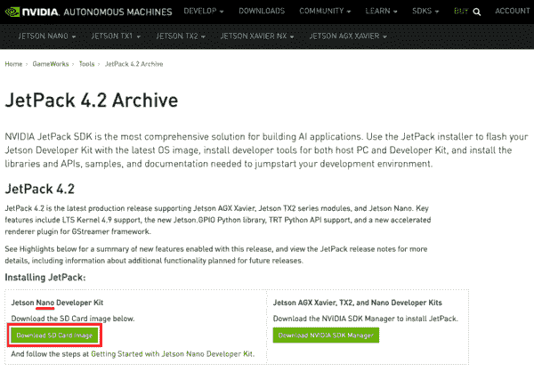

**Figure 1:** The first step to configure your NVIDIA Jetson Nano for computer vision and deep learning is to download the [Jetpack SD card image](https://developer.nvidia.com/jetpack-4_2).

我们推荐 Jetpack 4.2 兼容 *[的*完整捆绑*计算机视觉](https://pyimagesearch.com/raspberry-pi-for-computer-vision/)* 的【树莓 Pi】(我们的推荐未来必然会有变化)。

下载 Nano SD 映像时，继续下载并安装 [balenaEtcher](https://www.balena.io/etcher/) ，这是一个磁盘映像刷新工具:

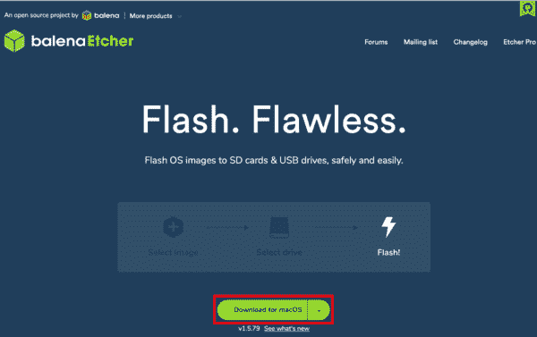

**Figure 2:** Download and install balenaEtcher for your OS. You will use it to flash your Nano image to a microSD card.

一旦(1)下载了您的 Nano Jetpack 映像，并且(2)安装了 balenaEtcher，您就可以将映像刷新到 microSD 了。

您需要合适的 microSD 卡和 microSD 读卡器硬件。我们推荐 32GB 或 64GB 的 microSD 卡(SanDisk 的 98MB/s 卡是高质量的，如果他们是您所在地区的经销商，亚马逊也会提供这些卡)。任何 microSD 读卡器都应该能用。

将 microSD 插入读卡器，然后将读卡器插入电脑的 USB 端口。从那里，启动 balenaEtcher 并开始闪光。

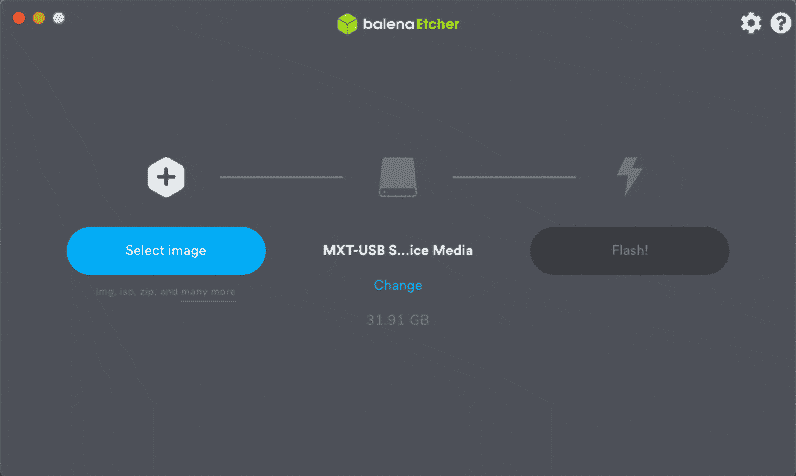

**Figure 3:** Flashing NVIDIA’s Jetpack image to a microSD card with balenaEtcher is one of the first steps for configuring your Nano for computer vision and deep learning.

当闪烁成功完成时，您准备好继续进行**步骤#2** 。

### 第二步:用 microSD 启动你的 Jetson Nano 并连接到网络

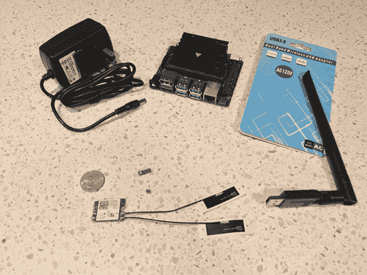

**Figure 4:** The NVIDIA Jetson Nano does not come with WiFi capability, but you can use a USB WiFi module (*top-right*) or add a more permanent module under the heatsink (*bottom-center*). Also pictured is a 5V 4A (20W) power supply (*top-left*) that you may wish to use to power your Jetson Nano if you have lots of hardware attached to it.

在此步骤中，我们将启动 Jetson Nano 并建立网络连接。

这一步需要以下内容:

1.  从**步骤#1** 开始闪烁的 microSD
2.  NVIDIA Jetson Nano 开发板
3.  HDMI 屏幕
4.  USB 键盘+鼠标
5.  电源——1)5V 2.5A(12.5 瓦)microSD 电源或 2)5V 4A(20W)筒式插头电源，在 J48 连接器处有跳线
6.  网络连接——要么是(1)将 Nano 连接到网络的以太网电缆，要么是(2)无线模块。无线模块可以以 USB WiFi 适配器或安装在 Jetson Nano 散热器下的 WiFi 模块的形式出现

如果你想要 WiFi(大部分人都有)，你必须自己加一个 WiFi 模块。为您的 Jetson Nano 添加 WiFi 的两个绝佳选择包括:

*   USB 转 WiFi 适配器(**图四**、*右上*)。不需要任何工具，可以移植到其他设备上。图为 **[Geekworm 双频 USB 1200m](https://geekworm.com/products/geekworm-nvidia-jetson-nano-dual-band-wireless-usb-3-0-adapter-5ghz-2-4ghz-1200m)**
*   WiFi 模块如 **[Intel 双频 Wireless-Ac 8265 W/Bt](https://amzn.to/2QKX7Ep)**(Intel 8265 NGW)和 2x**[Molex Flex 2042811100 Flex 天线](https://www.digikey.com/short/zqtf9h)** ( **图 5** *、中底*)。您必须在 Jetson Nano 的主散热器下安装 WiFi 模块和天线。这种升级需要 2 号十字螺丝刀、无线模块和天线(更不用说大约 10-20 分钟的时间)

如果您需要在 Jetson Nano 上使用 WiFi，我们建议您使用 USB WiFi 适配器。网上有很多选择，所以尽量购买一个在操作系统上预装了 Ubuntu 18.04 驱动程序的，这样你就不需要手忙脚乱地下载和安装驱动程序了。

一旦你收集好所有的装备，将你的 microSD 插入你的 Jetson Nano，如图 5 所示


**Figure 5:** To insert your Jetpack-flashed microSD after it has been flashed, find the microSD slot as shown by the red circle in the image. Insert your microSD until it clicks into place.

从那里，连接您的屏幕，键盘，鼠标和网络接口。

最后，施加力量。将电源适配器的电源插头插入 Jetson Nano(如果您使用 20W 桶形插头电源，请使用 J48 跳线)。

[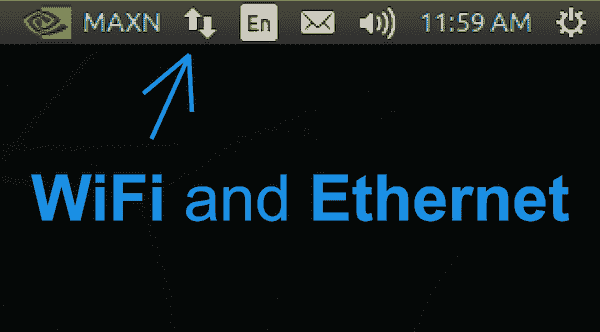](https://pyimagesearch.com/wp-content/uploads/2020/03/nano_config_networking.png)

**Figure 6:** Use the icon near the top right corner of your screen to configure networking settings on your NVIDIA Jetson Nano. You will need internet access to download and install computer vision and deep learning software.

一旦你看到你的 NVIDIA + Ubuntu 18.04 桌面，你应该使用菜单栏中的图标根据需要配置你的有线或无线网络设置，如**图 6** 所示。

当您确认您的 NVIDIA Jetson Nano 可以访问互联网时，您可以进入下一步。

### 步骤 3:打开一个终端或启动一个 SSH 会话

在此步骤中，我们将执行以下操作之一:

1.  **选项 1:** 在 Nano 桌面上打开一个终端，假设您将使用连接到 Nano 的键盘和鼠标执行从这里开始的所有步骤
2.  **选项 2:** 从不同的计算机启动 SSH 连接，以便我们可以远程配置我们的 NVIDIA Jetson Nano，用于计算机视觉和深度学习

两种选择都一样好。

#### 选项 1:使用 Nano 桌面上的终端

对于**选项 1** ，打开应用启动器，选择终端应用。您可能希望在左侧菜单中右键单击它，并将其锁定到启动器，因为您可能会经常使用它。

您现在可以继续**步骤#4** ，同时保持终端打开以输入命令。

#### 选项 2:启动 SSH 远程会话

对于**选项 2** ，您必须首先确定您的 Jetson Nano 的用户名和 IP 地址。在您的 Nano 上，从应用程序启动器启动终端，并在提示符下输入以下命令:

```py
$ whoami
nvidia
$ ifconfig
en0: flags=8863 mtu 1500
	options=400
	ether 8c:85:90:4f:b4:41
	inet6 fe80::14d6:a9f6:15f8:401%en0 prefixlen 64 secured scopeid 0x8
	inet6 2600:100f:b0de:1c32:4f6:6dc0:6b95:12 prefixlen 64 autoconf secured
	inet6 2600:100f:b0de:1c32:a7:4e69:5322:7173 prefixlen 64 autoconf temporary
	inet 192.168.1.4 netmask 0xffffff00 broadcast 192.168.1.255
	nd6 options=201
	media: autoselect
	status: active
```

获取您的 IP 地址(在突出显示的行中)。我的 IP 地址是*192 . 168 . 1 . 4*；然而，你的 IP 地址将是不同的，**所以一定要检查和验证你的 IP 地址！**

然后，在一台 ***单独的*** 计算机上，如您的笔记本电脑/台式机，启动 SSH 连接，如下所示:

```py
$ ssh nvidia@192.168.1.4
```

请注意我是如何在命令中输入 Jetson Nano 的用户名和 IP 地址来进行远程连接的。您现在应该已经成功连接到您的 Jetson Nano，并且您可以继续进行**步骤#4** 。

### 第四步:更新你的系统并删除程序以节省空间

在这一步，我们将删除我们不需要的程序，并更新我们的系统。

首先，让我们将 Nano 设置为使用最大功率容量:

```py
$ sudo nvpmodel -m 0
$ sudo jetson_clocks
```

命令为你的 Jetson Nano 处理两个功率选项:(1) 5W 是模式`1`和(2) 10W 是模式 `0`。默认为高功率模式，但最好在运行`jetson_clocks`命令前强制该模式。

根据 NVIDIA devtalk 论坛:

> *`jetson_clocks`脚本禁用 DVFS 调控器，并将时钟锁定到活动`nvpmodel`电源模式定义的最大值。因此，如果您的活动模式是 10W，`jetson_clocks`将锁定时钟到 10W 模式的最大值。如果你的活动模式是 5W，`jetson_clocks`会将时钟锁定到 5W 模式的最大值* ( [NVIDIA DevTalk Forums](https://devtalk.nvidia.com/default/topic/1050897/jetson-nano/what-does-jetson_clocks-do-/) )。

***注:*** *有两种典型的方式为你的杰特森 Nano 提供动力。5V 2.5A (10W) microUSB 电源适配器是一个不错的选择。如果您有许多由 Nano 供电的设备(键盘、鼠标、WiFi、相机)，那么您应该考虑 5V 4A (20W)电源，以确保您的处理器可以全速运行，同时为您的外围设备供电。从技术上讲，如果您想直接在接头引脚上供电，还有第三种电源选项。*

在你将 Nano 设置为最大功率后，继续移除 libre office——它会占用大量空间，我们不需要它来进行计算机视觉和深度学习:

```py
$ sudo apt-get purge libreoffice*
$ sudo apt-get clean
```

接下来，让我们继续更新系统级软件包:

```py
$ sudo apt-get update && sudo apt-get upgrade
```

下一步，我们将开始安装软件。

### 步骤#5:安装系统级依赖项

我们需要安装的第一套软件包括一系列开发工具:

```py
$ sudo apt-get install git cmake
$ sudo apt-get install libatlas-base-dev gfortran
$ sudo apt-get install libhdf5-serial-dev hdf5-tools
$ sudo apt-get install python3-dev
$ sudo apt-get install nano locate
```

接下来，我们将安装 SciPy 先决条件(从 [NVIDIA 的 devtalk 论坛](https://devtalk.nvidia.com/default/topic/1066391/jetson-nano/keras-and-scipy-throwing-weird-errors-while-installing-on-jetson-nano-no-links-could-help-me-/post/5415052/#5415052)收集)和一个系统级 [Cython](https://pyimagesearch.com/2017/08/28/fast-optimized-for-pixel-loops-with-opencv-and-python/) 库:

```py
$ sudo apt-get install libfreetype6-dev python3-setuptools
$ sudo apt-get install protobuf-compiler libprotobuf-dev openssl
$ sudo apt-get install libssl-dev libcurl4-openssl-dev
$ sudo apt-get install cython3
```

我们还需要一些 XML 工具来处理 TensorFlow 对象检测(TFOD) API 项目:

```py
$ sudo apt-get install libxml2-dev libxslt1-dev
```

### 步骤 6:更新 CMake

现在我们将更新 CMake 预编译器工具，因为我们需要一个新的版本来成功编译 OpenCV。

首先，下载并解压缩 CMake 更新:

```py
$ wget http://www.cmake.org/files/v3.13/cmake-3.13.0.tar.gz
$ tar xpvf cmake-3.13.0.tar.gz cmake-3.13.0/
```

接下来，编译 CMake:

```py
$ cd cmake-3.13.0/
$ ./bootstrap --system-curl
$ make -j4
```

最后，更新 bash 概要文件:

```py
$ echo 'export PATH=/home/nvidia/cmake-3.13.0/bin/:$PATH' >> ~/.bashrc
$ source ~/.bashrc
```

CMake 现在可以在您的系统上运行了。确保您没有删除个人文件夹中的`cmake-3.13.0/`目录。

### 步骤 7:安装 OpenCV 系统级依赖项和其他开发依赖项

现在，让我们在我们的系统上安装 OpenCV 依赖项，从构建和编译具有并行性的 OpenCV 所需的工具开始:

```py
$ sudo apt-get install build-essential pkg-config
$ sudo apt-get install libtbb2 libtbb-dev
```

接下来，我们将安装一些编解码器和图像库:

```py
$ sudo apt-get install libavcodec-dev libavformat-dev libswscale-dev
$ sudo apt-get install libxvidcore-dev libavresample-dev
$ sudo apt-get install libtiff-dev libjpeg-dev libpng-dev
```

然后，我们将安装一系列 GUI 库:

```py
$ sudo apt-get install python-tk libgtk-3-dev
$ sudo apt-get install libcanberra-gtk-module libcanberra-gtk3-module
```

最后，我们将安装 Video4Linux (V4L ),这样我们就可以使用 USB 网络摄像头，并为 FireWire 摄像头安装一个库:

```py
$ sudo apt-get install libv4l-dev libdc1394-22-dev
```

### 步骤 8:在你的 Jetson Nano 上设置 Python 虚拟环境


**Figure 7:** Each Python virtual environment you create on your NVIDIA Jetson Nano is separate and independent from the others.

我怎么强调都不为过: **Python 虚拟环境是开发和部署 Python 软件项目的最佳实践。**

虚拟环境允许独立安装不同的 Python 包。当您使用它们时，您可以在一个环境中拥有一个版本的 Python 库，而在一个单独的隔离环境中拥有另一个版本。

在本教程的剩余部分，我们将创建一个这样的虚拟环境；不过，完成这个**步骤#8** 后，你可以根据自己的需要创建*多个*环境。如果你不熟悉虚拟环境，请务必阅读 [RealPython 指南](https://realpython.com/python-virtual-environments-a-primer/)。

首先，我们将安装*事实上的* Python 包管理工具，pip:

```py
$ wget https://bootstrap.pypa.io/get-pip.py
$ sudo python3 get-pip.py
$ rm get-pip.py
```

然后我们将安装我最喜欢的管理虚拟环境的工具，`virtualenv`和`virtualenvwrapper`:

```py
$ sudo pip install virtualenv virtualenvwrapper
```

在您向 bash 概要文件添加信息之前,`virtualenvwrapper`工具并没有完全安装。继续使用`nano`编辑器打开您的`~/.bashrc`:

```py
$ nano ~/.bashrc
```

然后在文件的底部插入以下内容:

```py
# virtualenv and virtualenvwrapper
export WORKON_HOME=$HOME/.virtualenvs
export VIRTUALENVWRAPPER_PYTHON=/usr/bin/python3
source /usr/local/bin/virtualenvwrapper.sh
```

使用`nano`编辑器底部显示的快捷键保存并退出文件，然后加载 bash 概要文件以完成`virtualenvwrapper`安装:

```py
$ source ~/.bashrc
```

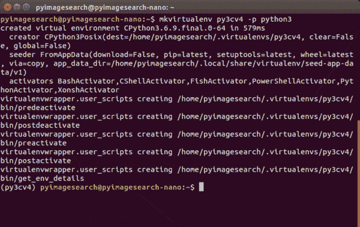

**Figure 8:** Terminal output from the `virtualenvwrapper` setup installation indicates that there are no errors. We now have a virtual environment management system in place so we can create computer vision and deep learning virtual environments on our NVIDIA Jetson Nano.

只要您没有遇到任何错误消息，`virtualenv`和`virtualenvwrapper`现在都准备好了，您可以在**步骤#9** 中根据需要创建和销毁虚拟环境。

### 步骤 9:创建您的“py3cv4”虚拟环境

一旦你在前一步安装了`virtualenv`和`virtualenvwrapper`，这一步就非常简单了。`virtualenvwrapper`工具提供了以下命令来处理虚拟环境:

*   `mkvirtualenv`:创建一个 Python 虚拟环境
*   `lsvirtualenv`:列出您系统上安装的虚拟环境
*   `rmvirtualenv`:删除虚拟环境
*   `workon`:激活 Python 虚拟环境
*   `deactivate`:退出虚拟环境，返回系统环境

假设**步骤#8** 进展顺利，让我们**在我们的 Nano:** 上创建一个 Python 虚拟环境

```py
$ mkvirtualenv py3cv4 -p python3
```

我将虚拟环境命名为`py3cv4`,表明我们将使用 Python 3 和 OpenCV 4。你可以根据你的项目和软件需求，甚至你自己的创造力来命名你的。

当您的环境准备就绪时，bash 提示符前面会有`(py3cv4)`。如果您的提示前面没有您的虚拟环境名称，您可以随时使用如下的`workon`命令:

```py
$ workon py3cv4
```


**Figure 9:** Ensure that your bash prompt begins with your virtual environment name for the remainder of this tutorial on configuring your NVIDIA Jetson Nano for deep learning and computer vision.

对于本教程中的其余步骤，您必须处于`py3cv4`虚拟环境中。

### 步骤 10:安装 Protobuf 编译器

**本节将带您逐步完成配置`protobuf`的过程，以便 *TensorFlow 能够快速运行*。**

如果`protobuf`和`libprotobuf`的有效实现*不存在*，TensorFlow 的性能会*受到显著*影响(以负面方式)。

当我们 pip-install TensorFlow 时，它会自动安装一个可能不是理想版本的`protobuf`版本。关于【TensorFlow 性能慢的问题已经在[这个 NVIDIA 开发者论坛](https://devtalk.nvidia.com/default/topic/1046492/tensorrt/extremely-long-time-to-load-trt-optimized-frozen-tf-graphs/)中详细说明了。

首先，下载并安装 protobuf 编译器的高效实现( [source](https://jkjung-avt.github.io/tf-trt-revisited/) ):

```py
$ wget https://raw.githubusercontent.com/jkjung-avt/jetson_nano/master/install_protobuf-3.6.1.sh
$ sudo chmod +x install_protobuf-3.6.1.sh
$ ./install_protobuf-3.6.1.sh
```

这将需要大约一个小时来安装，所以去散散步，或者读一本好书，如用于计算机视觉的 *[【树莓派】](https://pyimagesearch.com/raspberry-pi-for-computer-vision/)* 或用于计算机视觉的 *[深度学习与 Python](https://pyimagesearch.com/deep-learning-computer-vision-python-book/)* 。

一旦`protobuf`安装到您的系统上，您需要将其安装到您的虚拟环境中:

```py
$ workon py3cv4 # if you aren't inside the environment
$ cd ~
$ cp -r ~/src/protobuf-3.6.1/python/ .
$ cd python
$ python setup.py install --cpp_implementation
```

注意，我们没有使用 pip 来安装`protobuf`包，而是使用了`setup.py`安装脚本。使用`setup.py`的好处是我们专门为纳米处理器编译软件*，而不是使用通用的预编译二进制文件。*

 *在剩下的步骤中，我们将混合使用`setup.py`(当我们需要优化编译时)和 pip(当通用编译足够时)。

让我们继续进行**步骤#11** ，在这里我们将安装深度学习软件。

### 步骤 11:在 Jetson Nano 上安装 TensorFlow、Keras、NumPy 和 SciPy

在本节中，我们将安装 TensorFlow/Keras 及其依赖项。

首先，确保您在虚拟环境中:

```py
$ workon py3cv4
```

然后安装 NumPy 和 Cython:

```py
$ pip install numpy cython
```

您可能会遇到以下错误信息:

```py
ERROR: Could not build wheels for numpy which use PEP 517 and cannot be installed directly.
```

如果您看到该消息，请遵循以下附加步骤。首先，用超级用户权限安装 NumPy:

```py
$ sudo pip install numpy
```

然后，创建一个从系统的 NumPy 到虚拟环境站点包的符号链接。要做到这一点，您需要`numpy`的安装路径，可以通过发出 NumPy uninstall 命令找到，然后*和**取消**它*，如下所示:

```py
$ sudo pip uninstall numpy
Uninstalling numpy-1.18.1:
  Would remove:
    /usr/bin/f2py
    /usr/local/bin/f2py
    /usr/local/bin/f2py3
    /usr/local/bin/f2py3.6
    /usr/local/lib/python3.6/dist-packages/numpy-1.18.1.dist-info/*
    /usr/local/lib/python3.6/dist-packages/numpy/*
Proceed (y/n)? n
```

**注意，您应该在提示符下键入`n`,因为我们不想继续卸载 NumPy。**然后，记下安装路径(高亮显示)，并执行以下命令(根据需要替换路径):

```py
$ cd ~/.virtualenvs/py3cv4/lib/python3.6/site-packages/
$ ln -s ~/usr/local/lib/python3.6/dist-packages/numpy numpy
$ cd ~
```

此时，NumPy 通过符号链接到您的虚拟环境中。我们应该快速测试它，因为 NumPy 在本教程的剩余部分是需要的。在终端中发出以下命令:

```py
$ workon py3cv4
$ python
>>> import numpy
```

现在已经安装了 NumPy，让我们安装 SciPy。我们需要 [SciPy v1.3.3 才能在 Nano](https://forums.developer.nvidia.com/t/scipy-not-getting-installed-on-jetson-nano-inspite-of-all-dependencies/110034) 上兼容 TensorFlow 1.13.1。因此，我们不能使用 pip。相反，我们将直接从 GitHub 获取一个版本(正如在 [DevTalk 链接](https://forums.developer.nvidia.com/t/scipy-not-getting-installed-on-jetson-nano-inspite-of-all-dependencies/110034)中向我们推荐的)并安装它:

```py
$ wget https://github.com/scipy/scipy/releases/download/v1.3.3/scipy-1.3.3.tar.gz
$ tar -xzvf scipy-1.3.3.tar.gz scipy-1.3.3
$ cd scipy-1.3.3/
$ python setup.py install
```

安装 SciPy 大约需要 **35 分钟**。观看并等待它安装就像看着油漆变干，所以你不妨打开我的[书籍或课程](https://pyimagesearch.com/books-and-courses/)，温习一下你的计算机视觉和深度学习技能。

现在我们将安装 **NVIDIA 针对 Jetson Nano** 优化的 TensorFlow 1.13。你当然想知道:

> 为什么我不应该在 NVIDIA Jetson Nano 上使用 TensorFlow 2.0？

这是一个很好的问题，我将邀请我的 NVIDIA Jetson Nano 专家 [Sayak Paul](https://pyimagesearch.com/faqs/single-faq/who-is-behind-pyimagesearch) 来回答这个问题:

> 虽然 TensorFlow 2.0 可安装在 Nano 上，但不建议安装，因为它可能与 Jetson Nano 基本操作系统附带的 TensorRT 版本不兼容。此外，用于 Nano 的 TensorFlow 2.0 车轮有许多内存泄漏问题，可能会使 Nano 冻结和挂起。基于这些原因，我们在这个时间点推荐 TensorFlow 1.13。

鉴于 Sayak 的专家解释，现在让我们继续安装 TF 1.13:

```py
$ pip install --extra-index-url https://developer.download.nvidia.com/compute/redist/jp/v42 tensorflow-gpu==1.13.1+nv19.3
```

现在让我们转到 Keras，我们可以通过 pip 简单地安装它:

```py
$ pip install keras
```

接下来，我们将在 Jetson Nano 上安装 TFOD API。

### 步骤#12:在 Jetson Nano 上安装 TensorFlow 对象检测 API

在这一步中，我们将在 Jetson Nano 上安装 TFOD API。

TensorFlow 的对象检测 API (TFOD API)是一个库，我们通常知道它用于开发对象检测模型。我们还需要它来优化 Nano 的 GPU 模型。

NVIDIA 的`tf_trt_models`是 TFOD API 的包装器，它允许构建冻结图，这是模型部署的必要条件。更多关于`tf_trt_models`的信息可以在[这个 NVIDIA 仓库](https://github.com/NVIDIA-AI-IOT/tf_trt_models)中找到。

同样，确保所有操作都发生在您的`py3cv4`虚拟环境中:

```py
$ cd ~
$ workon py3cv4
```

首先，从 TensorFlow 克隆`models`存储库:

```py
$ git clone https://github.com/tensorflow/models
```

为了能够重现，您应该检查以下支持 TensorFlow 1.13.1 的提交:

```py
$ cd models && git checkout -q b00783d
```

在那里，安装 COCO API 以使用 COCO 数据集，特别是对象检测:

```py
$ cd ~
$ git clone https://github.com/cocodataset/cocoapi.git
$ cd cocoapi/PythonAPI
$ python setup.py install
```

下一步是编译 TFOD API 使用的 Protobuf 库。Protobuf 库使我们(以及 TFOD API)能够以一种与语言无关的方式序列化结构化数据:

```py
$ cd ~/models/research/
$ protoc object_detection/protos/*.proto --python_out=.
```

从那里，让我们配置一个有用的脚本，我称之为`setup.sh`。每次在 Nano 上使用 TFOD API 进行部署时，都需要这个脚本。使用 Nano 编辑器创建这样一个文件:

```py
$ nano ~/setup.sh
```

在新文件中插入以下行:

```py
#!/bin/sh

export PYTHONPATH=$PYTHONPATH:/home/`whoami`/models/research:\
/home/`whoami`/models/research/slim
```

顶部的符号表示这个文件是可执行的，然后脚本根据 TFOD API 安装目录配置您的`PYTHONPATH`。使用`nano`编辑器底部显示的快捷键保存并退出文件。

### 第 13 步:为 Jetson Nano 安装 NVIDIA 的“tf_trt_models”

在这一步，我们将从 GitHub 安装`tf_trt_models`库。该套件包含针对 Jetson Nano 的 TensorRT 优化模型。

首先，确保您在`py3cv4`虚拟环境中工作:

```py
$ workon py3cv4
```

继续克隆 GitHub repo，并执行安装脚本:

```py
$ cd ~
$ git clone --recursive https://github.com/NVIDIA-Jetson/tf_trt_models.git
$ cd tf_trt_models
$ ./install.sh
```

这就是全部了。下一步，我们将安装 OpenCV！

### 步骤 14:在 Jetson Nano 上安装 OpenCV 4.1.2

在本节中，我们将在我们的 Jetson Nano 上安装支持 CUDA 的 OpenCV 库[。](https://pyimagesearch.com/2020/02/03/how-to-use-opencvs-dnn-module-with-nvidia-gpus-cuda-and-cudnn/)

[OpenCV](https://pyimagesearch.com/2020/02/03/how-to-use-opencvs-dnn-module-with-nvidia-gpus-cuda-and-cudnn/) 是我们用于图像处理、通过 DNN 模块进行深度学习以及基本显示任务的通用库。如果你有兴趣学习一些基础知识，我为你创建了一个 [OpenCV 教程](https://pyimagesearch.com/2018/07/19/opencv-tutorial-a-guide-to-learn-opencv/)。

CUDA 是 NVIDIA 的一套库，用于处理他们的 GPU。一些非深度学习任务实际上可以在支持 CUDA 的 GPU 上比在 CPU 上运行得更快。因此，我们将安装支持 CUDA 的 OpenCV，因为 NVIDIA Jetson Nano 有一个支持 CUDA 的小 GPU。

这一段教程是基于[python PS 网站](https://pythops.com/post/compile-deeplearning-libraries-for-jetson-nano)的所有者们的辛勤工作。

我们将从源代码进行编译，所以首先让我们从 GitHub 下载 OpenCV 源代码:

```py
$ cd ~
$ wget -O opencv.zip https://github.com/opencv/opencv/archive/4.1.2.zip
$ wget -O opencv_contrib.zip https://github.com/opencv/opencv_contrib/archive/4.1.2.zip
```

注意 OpenCV 和 OpenCV-contrib 的版本是匹配的。为了兼容性，版本*必须与*匹配。

为了方便起见，从那里提取文件并重命名目录:

```py
$ unzip opencv.zip
$ unzip opencv_contrib.zip
$ mv opencv-4.1.2 opencv
$ mv opencv_contrib-4.1.2 opencv_contrib
```

如果您的 Python 虚拟环境尚未激活，请继续激活它:

```py
$ workon py3cv4
```

并切换到 OpenCV 目录，然后创建并输入一个构建目录:

```py
$ cd opencv
$ mkdir build
$ cd build
```

当您在(1)`~/opencv/build`目录和(2)`py3cv4`虚拟环境中时，输入下一个 CMake 命令非常重要。现在花点时间来验证:

```py
(py3cv4) $ pwd
/home/nvidia/opencv/build
```

我通常不会在 bash 提示符中显示虚拟环境的名称，因为这会占用空间，但是请注意我是如何让*在上面的提示符的开头显示它，以表明我们“在”虚拟环境中。*

此外，`pwd`命令的结果表明我们在`build/`目录中。

如果您满足了这两个要求，现在就可以使用 CMake 编译准备工具了:

```py
$ cmake -D CMAKE_BUILD_TYPE=RELEASE \
	-D WITH_CUDA=ON \
	-D CUDA_ARCH_PTX="" \
	-D CUDA_ARCH_BIN="5.3,6.2,7.2" \
	-D WITH_CUBLAS=ON \
	-D WITH_LIBV4L=ON \
	-D BUILD_opencv_python3=ON \
	-D BUILD_opencv_python2=OFF \
	-D BUILD_opencv_java=OFF \
	-D WITH_GSTREAMER=ON \
	-D WITH_GTK=ON \
	-D BUILD_TESTS=OFF \
	-D BUILD_PERF_TESTS=OFF \
	-D BUILD_EXAMPLES=OFF \
	-D OPENCV_ENABLE_NONFREE=ON \
	-D OPENCV_EXTRA_MODULES_PATH=/home/`whoami`/opencv_contrib/modules ..
```

这里有很多编译器标志，我们来回顾一下。注意`WITH_CUDA=ON`被设置，表明我们将使用 CUDA 优化进行编译。

其次，请注意，我们已经在我们设置的`OPENCV_EXTRA_MODULES_PATH`、*和*中提供了到我们的`opencv_contrib`文件夹的路径，这表明我们正在安装对外部和专利算法具有*完全支持*的 OpenCV 库。

确保复制上面的整个命令，包括最底部的`..`。当 CMake 完成时，您将在终端中看到以下输出:

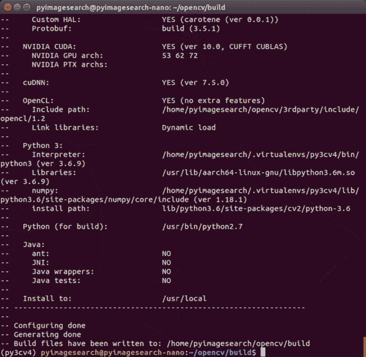

**Figure 10:** It is critical to inspect your CMake output when installing the OpenCV computer vision library on an NVIDIA Jetson Nano prior to kicking off the compile process.

我强烈建议您向上滚动，用敏锐的眼光阅读终端输出，看看是否有错误。在继续之前，需要解决错误。如果您确实遇到错误，很可能是来自**步骤#5-#11** 的一个或多个先决条件没有正确安装。尝试确定问题并解决它。

如果您确实修复了一个问题，那么在再次运行 CMake 之前，您需要删除并重新创建您的构建目录:

```py
$ cd ..
$ rm -rf build
$ mkdir build
$ cd build
# run CMake command again
```

当您对 CMake 输出感到满意时，就该用 Make:

```py
$ make -j4
```

编译 OpenCV 大约需要 **2.5 小时。**完成后，您将看到 100%,您的 bash 提示符将返回:

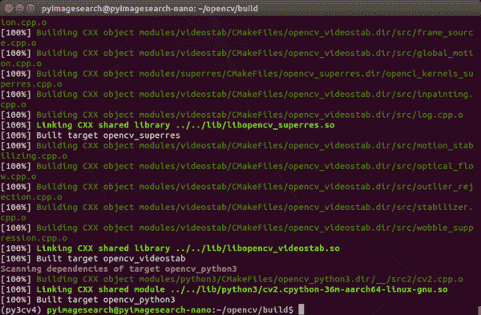

**Figure 11:** Once your `make` command reaches 100% you can proceed with setting up your NVIDIA Jetson Nano for computer vision and deep learning.

从那里，我们需要完成安装。首先，运行安装命令:

```py
$ sudo make install
```

然后，我们需要创建一个从 OpenCV 的安装目录到虚拟环境的符号链接。符号链接就像一个指针，一个特殊的操作系统文件在你的计算机上从一个地方指向另一个地方(在这里是我们的 Nano)。现在让我们创建符号链接:

```py
$ cd ~/.virtualenvs/py3cv4/lib/python3.6/site-packages/
$ ln -s /usr/local/lib/python3.6/site-packages/cv2/python3.6/cv2.cpython-36m-aarch64-linux-gnu.so cv2.so
```

OpenCV 正式安装。在下一节中，我们将安装一些有用的库来补充我们目前已经安装的所有东西。

### 步骤#15:通过 pip 安装其他有用的库

在本节中，我们将使用 pip 将附加的软件包安装到我们的虚拟环境中。

继续并激活您的虚拟环境:

```py
$ workon py3cv4
```

然后安装以下用于机器学习、图像处理和绘图的软件包:

```py
$ pip install matplotlib scikit-learn
$ pip install pillow imutils scikit-image
```

其次是[戴维斯·金的 dlib 库](https://pyimagesearch.com/2017/03/13/an-interview-with-davis-king-creator-of-the-dlib-toolkit/):

```py
$ pip install dlib
```

***注:*** *虽然你可能很想为你的 NVIDIA Jetson Nano 编译具有 CUDA 功能的 dlib，但目前 dlib 不支持 Nano 的 GPU。来源:(1) [dlib GitHub 问题](https://github.com/davisking/dlib/issues/1718)和(2) [NVIDIA devtalk 论坛](https://devtalk.nvidia.com/default/topic/1051055/jetson-nano/installing-dlib-with-python3-6-in-jetson-nano/)。*

现在继续安装 Flask，这是一个 Python 微型 web 服务器；还有 Jupyter，一个基于网络的 Python 环境:

```py
$ pip install flask jupyter
```

最后，为 TFOD API 安装我们的 XML 工具，并安装 progressbar 来跟踪需要很长时间的终端程序:

```py
$ pip install lxml progressbar2
```

干得好，但派对还没结束。在下一步中，我们将测试我们的安装。

### 步骤#16:测试和验证

我总是喜欢在这一点上测试我的安装，以确保一切如我所愿。当您准备在您的 NVIDIA Jetson Nano 上部署计算机视觉和深度学习项目时，这种快速验证可以节省时间。

#### 测试张量流和 Keras

要测试 TensorFlow 和 Keras，只需在 Python shell 中导入它们:

```py
$ workon py3cv4
$ python
>>> import tensorflow
>>> import keras
>>> print(tensorflow.__version__)
1.13.1
>>> print(keras.__version__)
2.3.0
```

同样，我们故意不使用 TensorFlow 2.0。截至 2020 年 3 月，当我写这篇文章时，TensorRT 支持/不支持 TensorFlow 2.0，它有内存泄漏问题。

#### 测试 TFOD API

为了测试 TFOD API，我们首先需要运行安装脚本:

```py
$ cd ~
$ source ./setup.sh
```

然后执行测试程序，如**图 12:** 所示

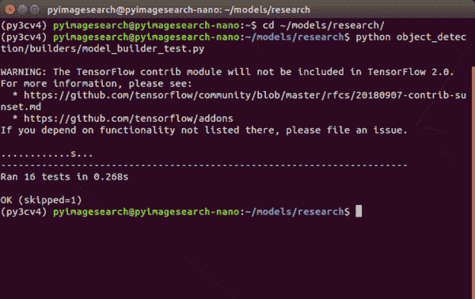

**Figure 12:** Ensure that your NVIDIA Jetson Nano passes all TensorFlow Object Detection (TFOD) API tests before moving on with your embedded computer vision and deep learning install.

假设您在运行的每个测试旁边看到“好”，您就可以开始了。

#### 测试 OpenCV

为了测试 OpenCV，我们将简单地将其导入 Python shell 并加载和显示一个图像:

```py
$ workon py3cv4
$ wget -O penguins.jpg http://pyimg.co/avp96
$ python
>>> import cv2
>>> import imutils
>>> image = cv2.imread("penguins.jpg")
>>> image = imutils.resize(image, width=400)
>>> message = "OpenCV Jetson Nano Success!"
>>> font = cv2.FONT_HERSHEY_SIMPLEX
>>> _ = cv2.putText(image, message, (30, 130), font, 0.7, (0, 255, 0), 2)
>>> cv2.imshow("Penguins", image); cv2.waitKey(0); cv2.destroyAllWindows()
```

[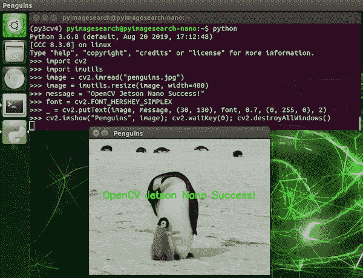](https://pyimagesearch.com/wp-content/uploads/2020/03/nano_config_penguins.png)

**Figure 13:** OpenCV (compiled with CUDA) for computer vision with Python is working on our NVIDIA Jetson Nano.

#### 测试您的网络摄像头

在这一节中，我们将开发一个快速而简单的脚本，使用(1)PiCamera 或(2)USB 摄像头来测试您的 NVIDIA Jetson Nano 摄像头。

您知道 NVIDIA Jetson Nano 与您的 Raspberry Pi picamera 兼容吗？

事实上是的，但是它需要一个长的源字符串来与驱动程序交互。在本节中，我们将启动一个脚本来看看它是如何工作的。

首先，用带状电缆将 PiCamera 连接到 Jetson Nano，如图所示:

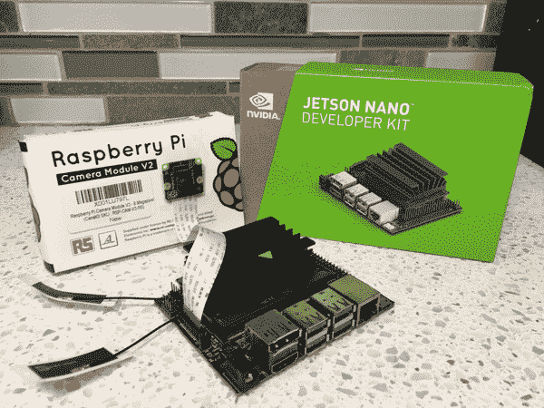

**Figure 14:** Your NVIDIA Jetson Nano is compatible with your Raspberry Pi’s PiCamera connected to the MIPI port.

接下来，一定要抓取与这篇博文相关的 ***【下载】*** 作为测试脚本。现在让我们回顾一下`test_camera_nano.py`脚本:

```py
# import the necessary packages
from imutils.video import VideoStream
import imutils
import time
import cv2

# grab a reference to the webcam
print("[INFO] starting video stream...")
#vs = VideoStream(src=0).start()
vs = VideoStream(src="nvarguscamerasrc ! video/x-raw(memory:NVMM), " \
	"width=(int)1920, height=(int)1080,format=(string)NV12, " \
	"framerate=(fraction)30/1 ! nvvidconv ! video/x-raw, " \
	"format=(string)BGRx ! videoconvert ! video/x-raw, " \
	"format=(string)BGR ! appsink").start()
time.sleep(2.0)
```

这个脚本同时使用了 OpenCV 和`imutils`，如第 2-4 行的**中的导入所示。**

使用`imutils`的`video`模块，让我们在**行的第 9-14 行创建一个`VideoStream`:**

*   **USB 摄像头:**目前已在**第 9 行**中注释掉，要使用您的 USB 网络摄像头，您只需提供`src=0`或另一个设备序号，如果您有多个 USB 摄像头连接到您的 Nano
*   **PiCamera:** 目前活跃在**线 10-14** 上，一个很长的`src`字符串用于与 Nano 上的驱动程序一起工作，以访问插入 MIPI 端口的 PiCamera。如您所见，格式字符串中的宽度和高度表示 1080p 分辨率。您也可以使用 PiCamera 兼容的其他[分辨率](https://picamera.readthedocs.io/en/release-1.12/fov.html#camera-modes)

我们现在对皮卡梅拉更感兴趣，所以让我们把注意力集中在**第 10-14 行**。这些行为 Nano 激活一个流以使用 PiCamera 接口。注意逗号、感叹号和空格。**您肯定希望得到正确的`src`字符串，所以请仔细输入所有参数！**

接下来，我们将捕获并显示帧:

```py
# loop over frames
while True:
	# grab the next frame
	frame = vs.read()

	# resize the frame to have a maximum width of 500 pixels
	frame = imutils.resize(frame, width=500)

	# show the output frame
	cv2.imshow("Frame", frame)
	key = cv2.waitKey(1) & 0xFF

	# if the `q` key was pressed, break from the loop
	if key == ord("q"):
		break

# release the video stream and close open windows
vs.stop()
cv2.destroyAllWindows()
```

在这里，我们开始在帧上循环。我们`resize`了`frame`，并在 OpenCV 窗口中将它显示到我们的屏幕上。如果按下`q`键，我们退出循环并清理。

要执行该脚本，只需输入以下命令:

```py
$ workon py3cv4
$ python test_camera_nano.py
```

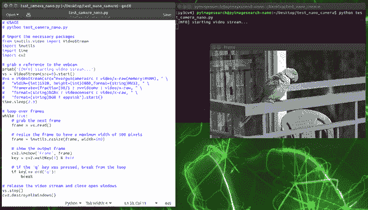

**Figure 15:** Testing a PiCamera with the NVIDIA Jetson Nano configured for computer vision and deep learning.

正如你所看到的，现在我们的 PiCamera 与 NVIDIA Jetson Nano 一起工作正常。

### 有没有更快的方法来启动和运行？

[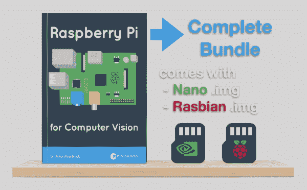](https://pyimagesearch.com/raspberry-pi-for-computer-vision/)

**Figure 16:** Pick up your copy of [*Raspberry Pi for Computer Vision*](https://pyimagesearch.com/raspberry-pi-for-computer-vision/) to gain access to the book, code, and three pre-configured .imgs: (1) NVIDIA Jetson Nano, (2) Raspberry Pi 3B+ / 4B, and (3) Raspberry Pi Zero W. This book will help you get your start in edge, IoT, and embedded computer vision and deep learning.

作为痛苦、乏味且耗时 2 天多的 Nano 配置过程的替代，我建议从计算机视觉 的 *[的*完整捆绑包*中抓取一份副本。](https://pyimagesearch.com/raspberry-pi-for-computer-vision/)*

我的书里有一个[预配置的 Nano。img](https://pyimagesearch.com/2020/03/04/nvidia-jetson-nano-img-pre-configured-for-deep-learning-and-computer-vision/) 是由我的团队开发的，随时可以开箱即用。它包括 TensorFlow/Keras、TensorRT、OpenCV、scikit-image、scikit-learn 等等。

你需要做的只是:

1.  下载杰特森纳米。img 文件
2.  闪存到您的 microSD 卡
3.  启动你的 Nano
4.  开始你的项目

**The。img 文件抵得上*完整捆绑*单独捆绑的价格。**

正如资深软件顾问彼得·兰斯所说:

> 为 Jetson Nano 建立一个开发环境是一件可怕的事情。试了几次后，我放弃了，又放了一天。
> 
> 直到现在，我的儿子都在做它最擅长的事情:在抽屉里收集灰尘。但现在我有借口清洗它，让它再次运行。
> 
> 除了阿德里安的材料牛逼全面，预配置的 Nano。img 奖金是馅饼上的樱桃，使得计算机视觉的树莓 Pi 的价格更具吸引力。
> 
> 对任何对 Adrian 的 RPi4CV 书感兴趣的人，对自己公平一点，计算一下你浪费在无所事事上的时间。它会让你意识到，你浪费的时间会比花在书本上的时间还多。

我的一个推特粉丝附和说:

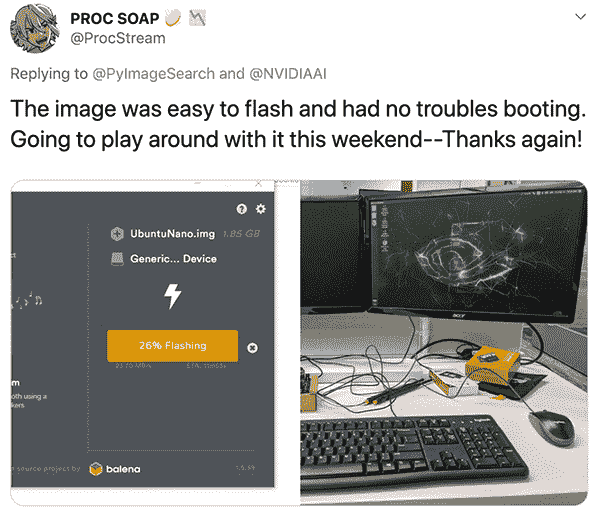

我的。img 文件定期更新并分发给客户。我还为我的[书籍和课程](https://pyimagesearch.com/books-and-courses/)的客户提供优先支持，这是我无法免费提供给互联网上每个访问这个网站的人的。

简而言之，如果你需要我为你的 Jetson Nano 提供支持，我建议你买一本用于计算机视觉的 *[【树莓 Pi】](https://pyimagesearch.com/raspberry-pi-for-computer-vision/)，*，它提供了互联网上最好的嵌入式计算机视觉和深度学习教育。

除了。img 文件，RPi4CV 涵盖了如何将计算机视觉、深度学习和 OpenCV 成功应用于嵌入式设备，例如:

*   树莓派
*   英特尔 Movidus NCS
*   谷歌珊瑚
*   NVIDIA Jetson Nano

在里面，你会发现超过 40 个关于嵌入式计算机视觉和深度学习的项目(包括 60 多个章节)。

一些突出的项目包括:

*   **交通计数**和**车速检测**
*   实时人脸识别
*   建立**课堂考勤**系统
*   自动**手势识别**
*   白天和夜间**野生动物监测**
*   **安全**应用
*   资源受限设备上的深度学习**分类**、**物体检测、**和**人体姿态估计**
*   …还有更多！

如果你和我一样兴奋，请通过[点击此处](https://pyimagesearch.com/raspberry-pi-for-computer-vision/)获取*免费*目录:

## 摘要

在本教程中，我们为基于 Python 的深度学习和计算机视觉配置了我们的 NVIDIA Jetson Nano。

我们从刷新 NVIDIA Jetpack .img 开始，从那里我们安装了先决条件。然后，我们配置了一个 Python 虚拟环境，用于部署计算机视觉和深度学习项目。

在我们的虚拟环境中，我们安装了 TensorFlow、TensorFlow 对象检测(TFOD) API、TensorRT 和 OpenCV。

我们最后测试了我们的软件安装。我们还开发了一个快速的 Python 脚本来测试 PiCamera 和 USB 摄像头。

如果你对计算机视觉和深度学习的 Raspberry Pi 和 NVIDIA Jetson Nano 感兴趣，一定要拿起一份用于计算机视觉的 *[Raspberry Pi。](https://pyimagesearch.com/raspberry-pi-for-computer-vision/)*

**要下载这篇文章的源代码(并在未来教程在 PyImageSearch 上发布时得到通知)，*只需在下面的表格中输入您的电子邮件地址！****