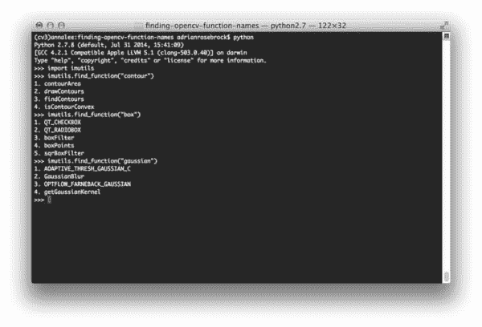
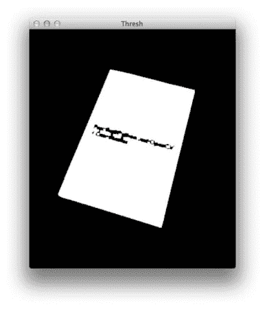

# 如何在 OpenCV 中通过名字查找函数

> 原文：<https://pyimagesearch.com/2015/08/31/how-to-find-functions-by-name-in-opencv/>

[](https://pyimagesearch.com/wp-content/uploads/2015/08/opencv_func_names_examples.jpg)

OpenCV 可能是一个很大、很难导航的库，*尤其是*如果你刚刚开始学习计算机视觉和图像处理。

OpenCV 3 的[版本只是使事情变得更加复杂，移动了一些重要的函数，甚至稍微改变了它们的名字(我马上想到了`cv2.cv.BoxPoints` vs. `cv2.boxPoints`方法)。](https://pyimagesearch.com/2015/06/08/opencv-3-0-released-and-the-coming-changes-to-the-pyimagesearch-blog/)

虽然一个好的 IDE 可以帮助你只通过几次击键就能搜索和找到一个特定的功能，但有时你无法访问你的 IDE。如果你试图开发与**OpenCV 2.4 和 OpenCV 3 兼容的代码，那么你需要*以编程方式*确定给定的函数是否可用(无论是通过[版本检测](https://pyimagesearch.com/2015/08/10/checking-your-opencv-version-using-python/)还是函数列表)。**

 **进入`find_function`方法，现在是 [imutils](https://github.com/jrosebr1/imutils) 库的一部分，它可以帮助你简单地通过提供一个查询字符串来搜索和查找 OpenCV 方法*。*

在这篇博文的剩余部分，我将向你展示如何在 OpenCV 库中使用简单的 Python 方法快速地*和**搜索和查找函数。*

 *## 转储所有 OpenCV 函数名和属性

查看暴露给 Python 绑定的所有 OpenCV 函数和属性的一种快速方法是使用内置的 Python `dir`函数，该函数用于返回当前本地范围内的名称列表。

假设您已经安装了 OpenCV 并准备好了 Python shell，我们可以使用`dir`方法创建一个所有 OpenCV 方法和属性的列表:

```py
>>> import cv2
>>> funcs = dir(cv2)
>>> for f in funcs:
...     print(f)
... 
ACCESS_FAST
ACCESS_MASK
ACCESS_READ
ACCESS_RW
ACCESS_WRITE
ADAPTIVE_THRESH_GAUSSIAN_C
ADAPTIVE_THRESH_MEAN_C
AGAST_FEATURE_DETECTOR_AGAST_5_8
AGAST_FEATURE_DETECTOR_AGAST_7_12D
AGAST_FEATURE_DETECTOR_AGAST_7_12S
AGAST_FEATURE_DETECTOR_NONMAX_SUPPRESSION
AGAST_FEATURE_DETECTOR_OAST_9_16
AGAST_FEATURE_DETECTOR_THRESHOLD
AKAZE_DESCRIPTOR_KAZE
AKAZE_DESCRIPTOR_KAZE_UPRIGHT
AKAZE_DESCRIPTOR_MLDB
AKAZE_DESCRIPTOR_MLDB_UPRIGHT
AKAZE_create
...
waitKey
warpAffine
warpPerspective
watershed
xfeatures2d
ximgproc
xphoto

```

虽然这个方法确实给了我们 OpenCV 中的属性和函数列表，但是它需要对列表进行*手动扫描*或 *grep* 来找到特定的函数。

**就我个人而言，如果我对你要找的东西有一个粗略的想法**，我喜欢使用这个方法名称的原始列表(有点像*“当我看到它的时候我就知道了”*类型的情况)；否则，我会使用`imutils`的`find_function`方法来快速缩小搜索空间——类似于搜索`dir(cv2)`的输出。

## 在 OpenCV 库中搜索(部分)函数名

让我们从定义我们的`find_function`方法开始这一部分:

```py
# import the necessary packages
from __future__ import print_function
import cv2
import re

def find_function(name, pretty_print=True, module=None):
	# if the module is None, initialize it to to the root `cv2`
	# library
	if module is None:
		module = cv2

	# grab all function names that contain `name` from the module
	p = ".*{}.*".format(name)
	filtered = filter(lambda x: re.search(p, x, re.IGNORECASE), dir(module))

	# check to see if the filtered names should be returned to the
	# calling function
	if not pretty_print:
		return filtered

	# otherwise, loop over the function names and print them
	for (i, funcName) in enumerate(filtered):
		print("{}. {}".format(i + 1, funcName))

if __name__ == "__main__":
	find_function("blur")

```

**2-4 线**从进口我们需要的包装开始。我们将需要`cv2`用于 OpenCV 绑定，需要`re`用于 Python 内置的正则表达式功能。

我们在第 6 行的**上定义了我们的`find_function`方法。这个方法需要一个必需的参数，即我们要搜索`cv2`的函数的(部分)`name`。我们还将接受两个可选参数:`pretty_print`这是一个布尔值，它指示结果应该作为列表返回还是整齐地格式化到我们的控制台；和`module`，它是 OpenCV 库的根模块或子模块。**

我们将把`module`初始化为根模块`cv2`，但是我们也可以传入一个子模块，比如`xfeatures2d`。在任一情况下，将在`module`中搜索与`name`匹配的部分功能/属性。

实际的搜索发生在**的第 13 行和第 14 行**，在这里我们应用一个正则表达式来确定`module`中的任何属性/函数名是否包含所提供的`name`。

**第 18 行和第 19 行**检查我们是否应该将`filtered`函数的列表返回给调用函数；否则，我们循环函数名并将它们打印到我们的控制台(**第 22 行和第 23 行**)。

最后， **Line 26** 通过搜索名字中包含`blur`的函数来测试我们的`find_function`方法。

要查看我们的`find_function`方法的运行情况，只需打开一个终端并执行以下命令:

```py
$ python find_function.py
1\. GaussianBlur
2\. blur
3\. medianBlur

```

正如我们的输出所示，OpenCV 中似乎有三个函数包含文本`blur`，包括`cv2.GaussianBlur`、`cv2.blur`和`cv2.medianBlur`。

## 通过名称查找 OpenCV 函数的真实例子

正如我在这篇文章前面提到的，`find_functions`方法已经是 [imutils](https://github.com/jrosebr1/imutils) 库的一部分。您可以通过`pip`安装`imutils`:

```py
$ pip install imutils

```

如果您的系统上已经安装了`imutils`，请务必将其升级到最新版本:

```py
$ pip install --upgrade imutils

```

我们在这个项目中的目标是编写一个 Python 脚本来检测实用 Python 和 OpenCV +案例研究 的 ***[硬拷贝版本(该版本将于美国东部时间](https://pyimagesearch.com/practical-python-opencv/)**8 月 16 日**周三 12:00 发布，所以请务必标记您的日历！)并绘制一个*它的边界轮廓*围绕它:***

[](https://pyimagesearch.com/wp-content/uploads/2015/08/opencv_func_names_input.jpg)

**Figure 1:** Our goal is to find the original book in the image *(left)* and then draw the outline on the book *(right)*.

打开一个新文件，命名为`find_book.py`，让我们开始编码:

```py
# import the necessary packages
import numpy as np
import imutils
import cv2

# load the image containing the book
image = cv2.imread("ppao_hardcopy.png")
orig = image.copy()

# convert the image to grayscale, threshold it, and then perform a
# series of erosions and dilations to remove small blobs from the
# image
gray = cv2.cvtColor(image, cv2.COLOR_BGR2GRAY)
thresh = cv2.threshold(gray, 40, 255, cv2.THRESH_BINARY)[1]
thresh = cv2.erode(thresh, None, iterations=2)
thresh = cv2.dilate(thresh, None, iterations=2)

```

我们从在第 7 行从磁盘加载我们的映像开始。然后我们在**的第 13-16 行**做一些基本的图像处理，包括转换成灰度，阈值处理，以及一系列的腐蚀和膨胀，从阈值图像中去除任何小斑点。我们的输出阈值图像如下所示:

[](https://pyimagesearch.com/wp-content/uploads/2015/08/opencv_func_name_thresh.jpg)

**Figure 3:** The thresholded, binary representation of the book image.

然而，为了*画出包围书的轮廓*，我首先需要*找到书本身的轮廓*。

假设我被困住了，我不知道在图像中寻找物体轮廓的函数的名字是什么，但是我记得在 OpenCV 中“轮廓”被称为“轮廓”。

通过启动一个 shell 并使用`imutils`中的`find_function`，我很快确定我正在寻找`cv2.findContours`函数:

```py
$ python
>>> import imutils
>>> imutils.find_function("contour")
1\. contourArea
2\. drawContours
3\. findContours
4\. isContourConvex

```

现在我知道我正在使用`cv2.findContours`方法，我需要弄清楚这个函数应该使用什么轮廓提取标志。我只想返回*外部*轮廓(即最外面的轮廓),所以我也需要查找那个属性:

```py
>>> imutils.find_function("external")
1\. RETR_EXTERNAL

```

明白了。我需要使用`cv2.RETR_EXTERNAL`标志。现在我已经解决了这个问题，我可以完成我的 Python 脚本了:

```py
# find contours in the thresholded image, keeping only the largest
# one
cnts = cv2.findContours(thresh.copy(), cv2.RETR_EXTERNAL,
	cv2.CHAIN_APPROX_SIMPLE)
cnts = imutils.grab_contours(cnts)
c = max(cnts, key=cv2.contourArea)
cv2.drawContours(image, [c], -1, (0, 255, 255), 3)

# show the output image
thresh = np.dstack([thresh] * 3)
cv2.imshow("Output", np.hstack([orig, thresh, image]))
cv2.waitKey(0)

```

**第 20-22 行**调用`cv2.findContours`找到阈值图像中物体的*外部轮廓*(感谢`cv2.RETR_EXTERNAL`属性)。

然后，我们将找到最大的轮廓(假定是书的轮廓)，并在我们的图像上画出轮廓(**第 23 行和第 24 行**)。

最后，**行 27-29** 显示了我们的输出图像。

要查看我的脚本的运行情况，我只需启动一个终端并发出以下命令:

```py
$ python find_book.py

```

[](https://pyimagesearch.com/wp-content/uploads/2015/08/opencv_func_names_output.jpg)

**Figure 3:** Our original input image (left), the thresholded, binary representation of the image (center), and the contour drawn surrounding the book (right).

果然，我们已经能够毫无问题地探测并画出这本书的轮廓了！

## 摘要

在这篇博文中，我们学习了如何获取 OpenCV 中所有暴露于 Python 绑定的函数和属性的名称。

然后，我们构建了一个 Python 函数，通过文本查询以编程方式搜索这些函数/属性名。该功能已包含在 [imutils](https://github.com/jrosebr1/imutils) 包中。

最后，我们探讨了如何在日常工作流程中使用 OpenCV 函数过滤来提高生产率和促进快速函数查找。我们通过构建一个小的 Python 脚本来检测图片中是否有书，从而演示了这一点。***