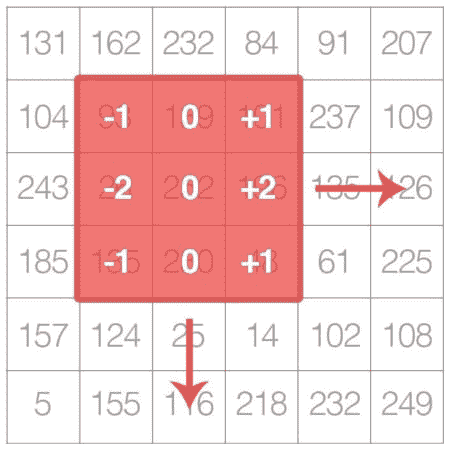
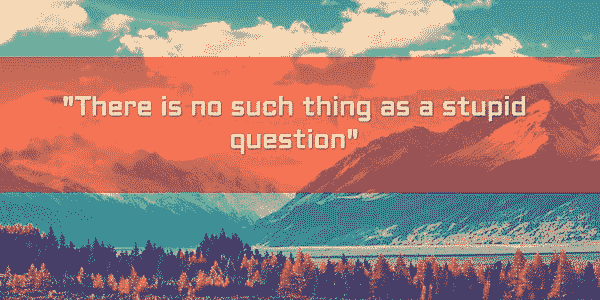

# 如何更好地回答您的计算机视觉问题

> 原文：<https://pyimagesearch.com/2017/02/27/how-to-get-better-answers-to-your-computer-vision-questions/>

今天的博客文章是两部分系列文章的第一部分，灵感来自我周末收到的 Aarav 的一封电子邮件，他是一位对研究计算机视觉感兴趣的 PyImageSearch 读者:

> 主题:我如何提出好的计算机视觉问题？
> 
> 嘿阿德里安，
> 
> 我叫 Aarav。首先，我只想说我有多喜欢你的博客。这对我是一个巨大的资源。
> 
> 我目前在 IIT 孟买大学学习计算机科学。我对计算机视觉和深度学习非常感兴趣，但对这些领域很陌生。
> 
> 我知道我还有很多东西要学，但我在提问时会感到难为情。
> 
> 我在顶级计算机视觉 LinkedIn 小组、StackOverflow 和 reddit 上发布了一些问题:
> 
> (考虑到 Aarav 的隐私，省略了链接)
> 
> 但是我经常得不到回应。我得到的回答都很简短，有时令人不快，而且对我毫无帮助。
> 
> 老实说，这让我怀疑我是否想研究这个领域。
> 
> 阿德里安，你能帮我吗？我做错什么了吗？
> 
> 如果你能写一篇关于如何提出好的计算机视觉问题的博文，那会很有帮助。
> 
> 谢谢，
> 
> Aarav

我能理解 Aarav——学会问一个好问题是一种后天的技能，几乎可以说是一种“艺术”。

我怎么知道这个？

除了花七年时间在学校获得学士学位和博士学位(在此过程中，我也提出了一些问题)，每天我还花大量时间回答 PyImageSearch 读者的问题，这些读者就像你一样，对研究计算机视觉感兴趣，但对某个特定主题感到困惑。

在过去三年运行 PyImageSearch **的过程中，我已经回答了成千上万个计算机视觉问题***……但我从未真正解决过什么是“好的”计算机视觉问题。*

正如 Aarav 所提出的，你如何*知道*你在问一个“好”的问题？

你怎样问这个问题才能:

1.  获得你所寻求的知识/清晰。
2.  在认可和尊重他人时间的同时？

有这样神奇的公式吗？

不幸的是，没有放之四海而皆准的解决方案。

但是当你问关于计算机视觉(或者任何一般的技术主题)的问题时，你可以(并且应该)使用一些通用的技术。

在今天的博文中，我们将讨论提出一个好的计算机视觉问题的五个关键组成部分。

下周，我们将应用这些组件来分析和剖析*实际的 PyImageSearch 问题*，以更好地理解如何提出有见地的问题。

无论你是在 StackOverflow 上发帖，给我发邮件，还是联系任何其他的[主题专家](https://en.wikipedia.org/wiki/Subject-matter_expert)，我希望你能使用这些技巧来更好地帮助你自己和那些回答你问题的人。

***注:** Aarav 的姓名、大学和所属机构均已匿名，以保护提问读者的身份。任何与名字、问题或隶属关系的现实关联纯属巧合。*

## 如何提出好的计算机视觉问题

在开始今天的博文之前，我想和你分享一个我在大学学习计算机视觉时的个人故事。

然后我们将讨论什么是“好”的问题，接着回顾在问任何 问题时需要的五个关键要素。

### 个人故事

**Figure 1:** As an undergraduate student I had trouble grasping the concept of kernels and convolutions, one of the cornerstones of computer vision and image processing.

当我刚开始学习计算机视觉和图像处理时，我有很多问题*。*

 *特别是，我清楚地记得与核的概念 [*和卷积的概念*](https://pyimagesearch.com/2016/07/25/convolutions-with-opencv-and-python/) 的斗争——我根本无法将教科书上的数学知识转化为实际的应用。

在我的教授第一次在课堂上讨论了核和旋积之后，我花了两天的时间转着轮子，徒劳地重读了课本上的同一章，复习了同样的课堂笔记，却一无所获。

在我们的下一次讲座之前，我在办公时间夹着尾巴去找我的教授，对我不能掌握这么简单的概念感到一半羞愧(我甚至怀疑我是否有能力将计算机视觉作为职业来研究)。

我的教授给了我很大的帮助，对我非常耐心。

他帮助消除了我的疑虑。

回想起来，我记得当时感觉 ***极度紧张和拘谨*** 要去见我的教授:

我不想把他的时间浪费在我自己应该能够理解和回答的问题上。

我与事实相去甚远。

像我的计算摄影教授(以及我的许多其他老师)这样的人**真心希望帮助我**——他们所要求的回报是:

1.  尊重他们的时间。
2.  我明白，虽然他们可以指引我，给我指出正确的方向，但我还是得自己做艰苦的工作。

很久以前，我就开始思考与我的计算摄影教授的互动，但上周末，当我收到 Aarav 发来的电子邮件时，我想起了这件事。

Aarav 的问题让我停下来思考了一会儿:

在某种程度上，我和我的教授又回到了原点。虽然我会一直认为自己是一名学生(我从来没有学过东西，而且 T2 总是坚持学习和尝试新事物)，但 T4 已经成为计算机视觉领域的专家。

在过去三年运行 PyImageSearch 的过程中，我看到了一些好问题——那些经过深思熟虑、有特定目的和最终目标的问题。

我也回答了一些问题，这些问题需要一点挖掘，并与读者反复讨论，以了解实际的潜在问题是什么。

我甚至回答了一些非常棘手的问题，需要我自己和读者的耐心。

我个人的观点是，无论我们已经有多好，我们都可以在提问方面变得更好。

我们问的问题越多，我们能学到的就越多——但我们需要以尊重周围人的方式来这样做。

### 什么是好问题？

你可能对这句老话很熟悉:

**Figure 2:** *“There is no such thing as a stupid question”*

在很大程度上，这是真的。

然而，我认为天文学家、宇宙学家和天体物理学家卡尔·萨根说得好:

**Figure 3:** *“…every question is a cry to understand the world. There is no such thing as a dumb question”* — Carl Sagan

在高度技术化的先进领域，比如计算机视觉，有 ***绑定*** 成为问题——正是这些问题的*本质*和*存在*使得计算机科学(以及所有其他科学)成为可能。

先进科学领域的专家一直在问问题。

事实上，研究人员真的是以提问为工作的。

他们质疑他们的研究。

他们质疑同行的研究。

他们从他们的*原始问题*中衍生出*更多的问题*。

你可能已经熟悉了这个过程——它被称为**科学方法:**

**Figure 4:** Whether we are just getting started in our science careers or already performing state-of-the-art research, we can ***all*** apply the scientific method.

*   **步骤#1:** 提出一个问题，发展一个假设。
*   第二步:做一个实验来测试你的假设。
*   第三步:测量并记录你的实验结果。
*   第四步:从你的结果中得出结论。
*   第五步:回到第一步，用你新发现的知识重复。

这些*精确的步骤*允许我们进行新的研究并推进当前最先进的…

**…但是这个过程不仅仅是*研究人员的*，*任何参与计算机科学的人都可以参与。***

当研究人员正在推进他们各自的领域时，在光谱的另一端，我们有学生，我们只是试图通过询问关于计算机视觉的非常基础的问题开始。这些最初的问题为他们日后在职业生涯中问*更高级的问题*打下了基础。

简单来说:

**我们*需要*提出问题。我们*需要*的问题来回答。没有这个过程，科学就不可能进步。**

鉴于问题的不可避免性，无论是在非常高的层面(即，最先进的研究)还是在非常基础的层面(即，计算机视觉的构建模块)，我们都需要**专注于*如何写出更有洞察力、更有智慧的问题*以及*可以由他人回答的具体目标*。**

### 一个实用的、有见地的问题的五个组成部分

**Figure 5:** The five components of a practical insightful question.

我将不再关注什么是“好”的问题，而是关注什么是“有见地”的问题。

问一个有见地的问题从*开始，远远早于*它被输入到电子邮件或评论表格中。

我在下面列出了编写实用、有见地的计算机视觉问题的要素:

1.  知道目的。
2.  理解上下文。
3.  做你的研究。
4.  提出你的问题(并尊重他人的时间)
5.  必要时重复该过程。

我们将在这篇文章的剩余部分详细回顾这些组件。

#### 第一部分:了解目的

在你问问题之前，你应该先退一步，问自己 ***为什么*** 你首先要问这个问题。

更具体地说，问自己:*“问完这个问题后，我希望获得什么知识/洞察力？”*

你看，*所有*有见地、有智慧的问题都有一个目的——它们*所有*都有一个最终目标。什么是*你的最终目标*在提问？

通过将*目的*(组件#1)与*背景*(组件#2)结合起来，主题专家可以更好地帮助你。

#### 组件#2:理解上下文

理解你的问题背后的*“为什么*”*很有帮助，但这还不够——**我还需要你问题的*背景*。***

我说的上下文是什么意思？

背景是构成你的问题的背景的*环境。*

有哪些相关的生活环境在提示这个问题？

你是一个正在做棘手的家庭作业的学生吗？

你是一个正在进行最先进的实验并希望发表你的结果的研究人员吗？

或者你只是对某个特定的计算机视觉主题感到好奇，想了解更多？

不仅要理解*为什么*你会问这个问题，还要理解*背后的*背景**会让你的问题更容易回答。**

关于你的问题，你能提供的背景信息越多越好。

#### 第三部分:做研究

理解了你提问的目的后，你应该花些时间做一些初步的研究，即使只是在内部层面上。

**问自己:**

*   关于这个话题，我有什么预先存在的知识吗？如果是，我已经知道了什么？
*   在哪里可以找到与此问题/主题相关的资源？
*   是否有任何现有的教程、博客帖子、研究论文等。这回答了我的问题吗？
*   我是否花了 15-20 分钟在谷歌上查询与我的问题相似的内容，并阅读了别人在我之前问过的内容？

你可能能够回答所有这些问题中的*——或者你可能只能回答*其中的*个问题。*

这个练习的重点不是“核对每一项”，而是后退一步*批判性地*思考你的问题。

#### 第四部分:提出你的问题(并尊重他人的时间)

当你真正*问*你的问题时，你应该已经准备好了。

通过提问，你应该明白你的最终目标是什么，你希望学到/完成什么。

你应该在这个问题上做足功课，看看其他人是否问过类似的问题(以及查看回答)。

最后，也是最重要的:

***在尊重他人的情况下提问。***

不管你是在 StackOverflow、LinkedIn 上发帖，还是询问某个主题专家(比如我自己)， ***尊重他们的时间。***

*   不要指望你询问的人会写一份多页的电子邮件回复你的问题，分析每一个小细节，并包括你应该阅读的论文的详尽清单。
*   不要指望他们为你写代码。
*   别指望他们会牵你的手。

现实一点，相应地设定你的期望:

1.  问问题时，要考虑到你的*具体最终目标*和*背景*。
2.  并且你会收到一个帮助你指明正确方向的回复(但不会为你做所有的艰苦工作)。你需要自己做这项艰苦的工作。

一个问题的好坏取决于对它的思考、时间和努力。

如果你花时间带着深思熟虑的目的和最终目标提出问题，你会发现你得到的回应会更好，对完成你的特定项目/任务更有帮助。

#### 组件#5:必要时重复该过程

很多时候，一个问题引出另一个问题。

我们问了一个问题，澄清了一个特定的问题，却发现它进一步混淆了下游另一个概念的水——我们再次需要帮助和解释。

这种情况下，就要重复这个过程了。

评估你的新问题。

你为什么问这个？

你的最终目标是什么？

对这个问题进行研究。

然后问(同时尊重他人时间)。

冲洗并重复。

### 问好问题需要练习

随着你越来越擅长问有见地的问题，你会开始注意到别人问问题的模式。

当一个同事或同事已经做了充分的研究来准备他们的问题时，或者当他们凭感觉飞行，希望从一个考虑不周的调查中突然实现一个解决方案时，你会开始感觉到。

作为一名主题专家，我可以告诉你回答有特定目的和最终目标的问题是多么令人愉快的事情。

我*喜欢*回答这些问题，因为我不仅可以*澄清任何疑问*，还可以*就如何解决读者正在研究的整体问题提供建议*。

读者总是很开心，不仅因为他们的问题得到了解答，还因为他们有更多的资源来帮助解决他们的问题。

相反，我还可以告诉你 ***如何令人厌烦而又乏味*** 它可以回答读者提出的问题:

*   不尊重我的时间。
*   他们自己没有花时间考虑*为什么*他们会问这个问题(即最终目标+背景)。

在下周的博客文章中，我们将分析我在 PyImageSearch 博客上收到的*个实际问题*，一条一条地回顾它们，看看如何提出一个好问题的五个组成部分。这些例子将帮助你提高自己提问的能力——因为让我们面对它，我们都可以使用一点实践。

## 摘要

今天的博文讨论了如何提出好的计算机视觉问题。

问一个好问题的五个组成部分包括:

1.  了解你问题的*目的*(即最终目标)。
2.  转述问题的*语境*(你所处的情境提示了要问的问题)。
3.  做你的研究。
4.  在尊重他人的情况下提问。
5.  必要时重复该过程。

这个公式也可以扩展到计算机科学之外的其他技术领域。

在这个由两部分组成的系列的第二篇教程中，我将讨论如何在 PyImageSearch 博客上提问**特别是**。

我们将看看我在 PyImageSearch 博客上收到的实际电子邮件，并把它们分开，讨论这个问题的积极(和消极)方面——我甚至会建议一些方法来更好地表达你的查询，以帮助确保你找到你正在寻找的信息。

***要在下一篇“不容错过”的博文发布时收到通知，请务必在下表中输入您的电子邮件地址，加入 PyImageSearch 时事通讯！****