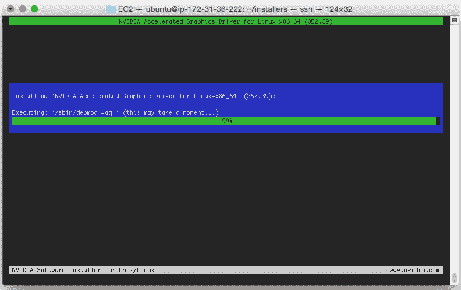
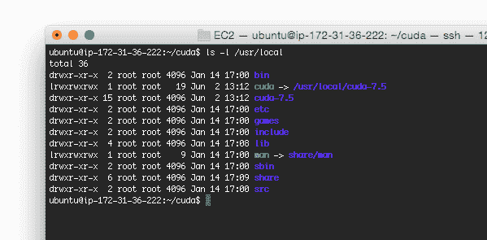
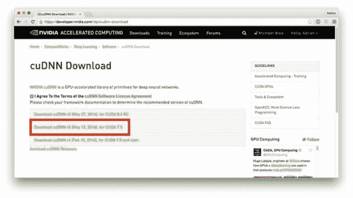
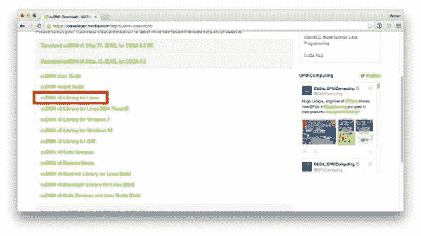

# 深度学习如何安装 CUDA 工具包和 cuDNN

> 原文：<https://pyimagesearch.com/2016/07/04/how-to-install-cuda-toolkit-and-cudnn-for-deep-learning/>



如果你真的想做任何类型的深度学习，你应该利用你的 GPU 而不是 T2 的 CPU。**你的 GPU 越多，你就越富裕。**

如果你已经有一个 NVIDIA 支持的 GPU，那么下一个合乎逻辑的步骤是安装两个重要的库:

1.  **NVIDIA CUDA Toolkit:**用于构建 GPU 加速应用的开发环境。这个工具包包括一个专门为 NVIDIA GPUs 设计的编译器*和相关的数学库+优化例程。*
2.  **cud nn 库**:深度神经网络的 GPU 加速原语库。使用 cuDNN 软件包，你可以将训练速度提高 44%以上，在火炬和咖啡馆的速度提升超过*6 倍*。

在这篇博文的剩余部分，我将演示如何安装 NVIDIA CUDA Toolkit 和 cuDNN 库来进行深度学习。

具体来说，我将使用运行 Ubuntu 14.04 的 Amazon EC2 g 2.2x 大型机器。请随意创建一个自己的实例并跟随它。

**当你完成本教程时，你将拥有一个*全新的系统，为深度学习做好准备。***

## 深度学习如何安装 CUDA 工具包和 cuDNN

正如我在之前的一篇博文中提到的，Amazon 提供了一个 EC2 实例，该实例提供了对 GPU 的访问，用于计算目的。

这个实例被命名为**g 2.2x 大型实例**，成本大约为*每小时 0.65 美元*。系统中包含的 GPU 是 K520，具有 4GB 内存和 1，536 个内核。

你也可以升级到**g 2.8x 大型实例** ( *$2.60 每小时*)获得*四个*K520 GPU(总计 16GB 内存)。

对于我们大多数人来说，g2.8xlarge 有点贵，尤其是如果你只是将深度学习作为一种爱好的话。另一方面，g2.2xlarge 实例是一个完全合理的选择，允许你放弃下午的星巴克咖啡，用咖啡因换取一点深度学习的乐趣和教育。

在这篇博文的剩余部分，我将详细介绍如何在 Amazon EC2 上的 g 2.2x 大型 GPU 实例中安装 NVIDIA CUDA Toolkit v7.5 和 cuDNN v5。

如果你对深度学习感兴趣，我*强烈建议你*使用这篇博客文章中的详细说明来设置自己的 EC2 系统——你将能够使用你的 GPU 实例来跟随 PyImageSearch 博客上的未来深度学习教程(相信我，会有很多这样的教程)。

***注:**你是亚马逊 AWS 和 EC2 的新手吗？在继续之前，你可能想阅读亚马逊 EC2 GPU 上的[深度学习和 Python 以及 nolearn](https://pyimagesearch.com/2014/10/13/deep-learning-amazon-ec2-gpu-python-nolearn/) 。这篇博客文章提供了关于如何启动第一个 EC2 实例并将其用于深度学习的分步说明(带有大量截图)。*

### 安装 CUDA 工具包

假设你有(1)一个支持 GPU 的 EC2 系统或者(2)你自己的支持 NVIDIA 的 GPU 硬件，下一步是安装 [CUDA 工具包](https://developer.nvidia.com/cuda-toolkit)。

但是在我们这样做之前，我们需要先安装一些必需的包:

```py
$ sudo apt-get update
$ sudo apt-get upgrade
$ sudo apt-get install build-essential cmake git unzip pkg-config
$ sudo apt-get install libopenblas-dev liblapack-dev
$ sudo apt-get install linux-image-generic linux-image-extra-virtual
$ sudo apt-get install linux-source linux-headers-generic

```

我在亚马逊 EC2 GPU 实例上遇到的一个问题是，我们需要*禁用新的内核驱动*，因为它*与我们即将安装的 NVIDIA 内核模块*冲突。

***注意:**我只需要禁用亚马逊 EC2 GPU 实例上的新内核驱动程序——我不确定是否需要在 Ubuntu 的标准桌面安装上这样做。根据你自己的硬件和设置，你可以*潜在地*跳过这一步。*

要禁用新内核驱动程序，首先创建一个新文件:

```py
$ sudo nano /etc/modprobe.d/blacklist-nouveau.conf

```

然后将以下几行添加到文件中:

```py
blacklist nouveau
blacklist lbm-nouveau
options nouveau modeset=0
alias nouveau off
alias lbm-nouveau off

```

保存这个文件，退出您的编辑器，然后更新初始 RAM 文件系统，然后重新启动您的机器:

```py
$ echo options nouveau modeset=0 | sudo tee -a /etc/modprobe.d/nouveau-kms.conf
$ sudo update-initramfs -u
$ sudo reboot

```

重新启动后，新的内核驱动程序应该被禁用。

下一步是安装 CUDA 工具包。我们将为 Ubuntu 14.04 安装 [CUDA Toolkit v7.5](https://developer.nvidia.com/cuda-downloads) 。安装 CUDA 实际上是一个相当简单的过程:

1.  下载安装归档文件并将其解压缩。
2.  运行相关的脚本。
3.  出现提示时，选择默认选项/安装目录。

首先，我们先下载适用于 CUDA 7.5 的`.run`文件:

```py
$ wget http://developer.download.nvidia.com/compute/cuda/7.5/Prod/local_installers/cuda_7.5.18_linux.run

```

通过超快的 EC2 连接，我能够在不到 30 秒的时间内下载完整的 1.1GB 文件:


**Figure 1:** Downloading the CUDA Toolkit from NVIDIA’s official website.

接下来，我们需要使`.run`文件可执行:

```py
$ chmod +x cuda_7.5.18_linux.run

```

然后将各个安装脚本提取到`installers`目录中:

```py
$ mkdir installers
$ sudo ./cuda_7.5.18_linux.run -extract=`pwd`/installers

```

您的`installers`目录现在应该是这样的:


**Figure 2:** Extracting the set of .run files into the ‘installers’ directory.

请注意我们有三个独立的`.run`文件——我们需要按照正确的顺序单独执行每个文件:

*   `NVIDIA-Linux-x86_64-352.39.run`
*   `cuda-linux64-rel-7.5.18-19867135.run`
*   `cuda-samples-linux-7.5.18-19867135.run`

下面一组命令将负责实际安装 CUDA 工具包:

```py
$ sudo ./NVIDIA-Linux-x86_64-352.39.run
$ modprobe nvidia
$ sudo ./cuda-linux64-rel-7.5.18-19867135.run
$ sudo ./cuda-samples-linux-7.5.18-19867135.run

```

再次提醒，确保在出现提示时选择默认选项和目录。

为了验证是否安装了 CUDA 工具包，您应该检查您的`/usr/local`目录，其中应该包含一个名为`cuda-7.5`的子目录，后面是一个名为`cuda`的符号链接，它指向这个子目录:



**Figure 3:** Verifying that the CUDA Toolkit has been installed.

既然安装了 CUDA 工具包，我们需要更新我们的`~/.bashrc`配置:

```py
$ nano ~/.bashrc

```

然后添加下面几行来定义 CUDA 工具包`PATH`变量:

```py
# CUDA Toolkit
export CUDA_HOME=/usr/local/cuda-7.5
export LD_LIBRARY_PATH=${CUDA_HOME}/lib64:$LD_LIBRARY_PATH
export PATH=${CUDA_HOME}/bin:${PATH}

```

您的`.bashrc`文件会在您每次登录或打开新终端时自动`source`更新，但由于我们*刚刚*修改了它，我们需要手动`source`它:

```py
$ source ~/.bashrc

```

接下来，让我们安装 cuDNN！

### 安装 cuDNN

我们现在准备安装 [NVIDIA CUDA 深度神经网络库](https://developer.nvidia.com/cudnn)，这是一个 GPU 加速的深度神经网络库。诸如 Caffe 和 Keras(以及较低层次的 Theano)这样的软件包使用 cuDNN 来*显著*加速网络培训过程。

要获得 cuDNN 库，你首先需要[用 NVIDIA](https://developer.nvidia.com/accelerated-computing-developer-program) 创建一个(免费)账户。从那里，你可以[下载 cuDNN](https://developer.nvidia.com/cudnn) 。

对于本教程，**我们将使用 cuDNN v5:**



**Figure 4:** We’ll be installing the cuDNN v5 library for deep learning.

确保您下载了用于 Linux 的 *cuDNN v5 库:*



**Figure 5:** Since we’re installing the cuDNN on Ubuntu, we download the library for Linux.

这是一个 75MB 的小下载，你应该把它保存到你的本地机器*(也就是你用来阅读本教程的笔记本电脑/台式机)，然后*把*上传到你的 EC2 实例。为此，只需使用`scp`，根据需要替换路径和 IP 地址:*

```py
$ scp -i EC2KeyPair.pem ~/Downloads/cudnn-7.5-linux-x64-v5.0-ga.tgz ubuntu@<ip_address>:~

```

安装 cuDNN 非常简单——我们所需要做的就是将`lib64`和`include`目录中的文件复制到我们 EC2 机器上相应的位置:

```py
$ cd ~
$ tar -zxf cudnn-7.5-linux-x64-v5.0-ga.tgz
$ cd cuda
$ sudo cp lib64/* /usr/local/cuda/lib64/
$ sudo cp include/* /usr/local/cuda/include/

```

恭喜您，cuDNN 现已安装！

### 做一些清理工作

现在我们已经(1)安装了 NVIDIA CUDA Toolkit ,( 2)安装了 cuDNN，让我们做一些清理工作来回收磁盘空间:

```py
$ cd ~
$ rm -rf cuda installers
$ rm -f cuda_7.5.18_linux.run cudnn-7.5-linux-x64-v5.0-ga.tgz

```

在未来的教程中，我将演示如何使用 CUDA 和 cuDNN 来加快深度神经网络的训练。

## 摘要

在今天的博文中，我演示了如何安装用于深度学习的 CUDA 工具包和 cuDNN 库。如果你对深度学习感兴趣，我*强烈推荐*安装一台支持 GPU 的机器。

如果你还没有兼容 NVIDIA 的 GPU，不要担心——亚马逊 EC2 提供了 g 2.2 x large(0.65 美元/小时)和 g 2.8 x large(2.60 美元/小时)实例，这两种实例都可以用于深度学习。

这篇博客文章中详细描述的步骤将在 Ubuntu 14.04 的 g2.2xlarge 和 g2.8xlarge 实例上工作，请随意选择一个实例并设置您自己的深度学习开发环境(事实上，我鼓励您这样做！)

如果您熟悉命令行和 Linux 系统(并且在 EC2 生态系统方面有少量经验)，那么完成整个过程只需要 1-2 个小时。

最重要的是，您可以使用这个 EC2 实例来关注 PyImageSearch 博客上未来的深度学习教程。

**请务必使用下面的表格注册 PyImageSearch 时事通讯，以便在新的深度学习文章发布时获得通知！***