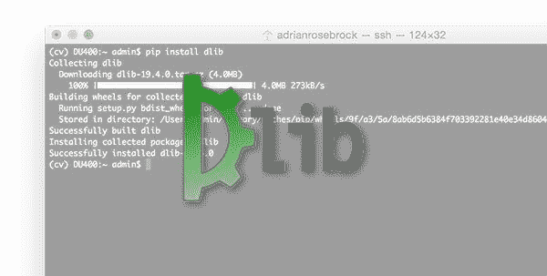
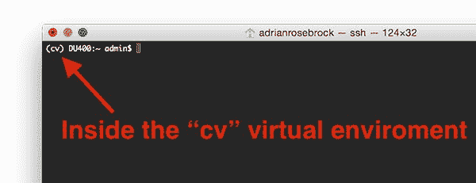
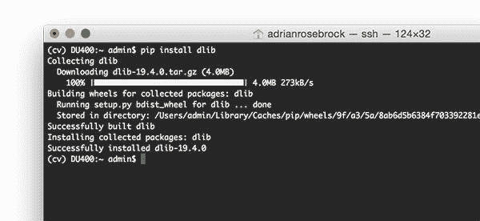
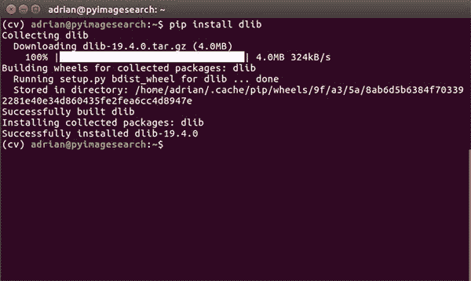
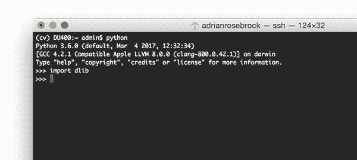
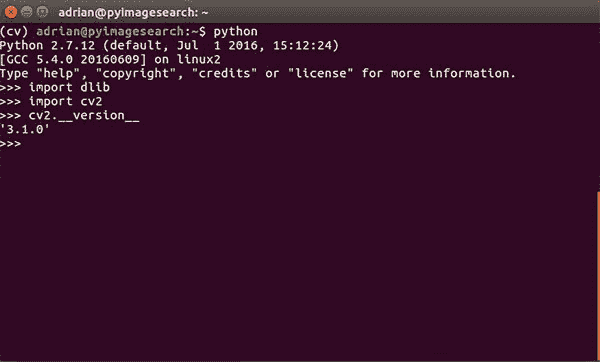

# 如何安装 dlib

> 原文：<https://pyimagesearch.com/2017/03/27/how-to-install-dlib/>



两周前，我采访了 Davis King，他是 T2 dlib 库 T3 的创建者和主要维护者。

今天我将演示如何在 macOS 和 Ubuntu 上安装带有 Python 绑定的 dlib。

我 ***强烈建议*** 在接下来的几天里花点时间在你的系统上安装 dlib。

从下周开始，我们将一头扎进 dlib 的核心计算机视觉实现之一——***面部标志检测*** 。

我将演示如何使用面部标志:

*   面部部分(即眼睛、鼻子、嘴巴等。)提取
*   面部对齐
*   眨眼检测
*   …以及更多。

但这一切都要从安装 dlib 开始！

**要了解如何在您的系统上安装带有 Python 绑定的 dlib，*请继续阅读。***

## 如何安装 dlib

dlib C++库由 [Davis King](https://github.com/davisking) 开发，是一个用于线程、网络、数值运算、机器学习、计算机视觉和压缩的跨平台包，重点强调了*极高质量的*和*可移植代码*。dlib 的文档也很棒。

从计算机视觉的角度来看，dlib 有许多最先进的实现，包括:

*   面部标志检测
*   相关跟踪
*   深度度量学习

在接下来的几周里，我们将探索其中的一些技术(尤其是面部标志检测)，所以现在一定要花时间在您的系统上配置和安装 dlib。

### 步骤 1:安装 dlib 先决条件

dlib 库只有四个主要的先决条件:

*   **[Boost](http://www.boost.org/) :** Boost 是一个经过同行评审的(也就是非常高质量的)C++库的集合，帮助程序员不要陷入重复发明轮子的困境。Boost 提供了线性代数、多线程、基本图像处理和单元测试等实现。
*   **[助推。Python](http://www.boost.org/doc/libs/1_57_0/libs/python/doc/index.html) :** 顾名思义，Boost。Python 提供了 C++和 Python 编程语言之间的互操作性。
*   **[CMake](https://cmake.org/) :** CMake 是一套开源的跨平台工具，用于构建、测试和打包软件。如果您曾经在系统上使用 CMake 编译过 OpenCV，那么您可能已经对它很熟悉了。
*   **[X11](https://en.wikipedia.org/wiki/X_Window_System)/[XQuartx](https://www.xquartz.org/):**简称*【X Window System】*，X11 提供了 GUI 开发的基本框架，常见于类 Unix 操作系统上。X11 的 macOS/OSX 版本被称为 *XQuartz* 。

下面我将向您展示如何在您的 Ubuntu 或 macOS 机器上安装这些先决条件。

#### 人的本质

安装 CMake，Boost，Boost。Python 和 X11 可以通过`apt-get`轻松实现:

```py
$ sudo apt-get install build-essential cmake
$ sudo apt-get install libgtk-3-dev
$ sudo apt-get install libboost-all-dev

```

我假设您的机器上已经安装了`pip`(用于管理、安装和升级 Python 包)，但是如果没有，您可以通过以下方式安装`pip`:

```py
$ wget https://bootstrap.pypa.io/get-pip.py
$ sudo python get-pip.py

```

完成这些步骤后，继续第 2 步。

#### 马科斯

为了安装 Boost，Boost。Python 和 macOS 上的 CMake，你将使用[自制软件包管理器](https://brew.sh/)。把 Homebrew 想象成一个类似的 Ubuntu 的`apt-get`版本，只适用于 macOS。

如果您尚未安装 Homebrew，可以通过执行以下命令来安装:

```py
$ /usr/bin/ruby -e "$(curl -fsSL https://raw.githubusercontent.com/Homebrew/install/master/install)"
$ brew update

```

***提示:**你可以通过在终端执行`brew`命令来检查你的机器上是否已经安装了家酿软件。如果你得到一个`brew: command not found`错误，那么你的机器上没有安装 Homebrew。*

既然已经安装了 Homebrew，打开您的`~/.bash_profile`文件(如果它不存在，创建它):

```py
$ nano ~/.bash_profile

```

在检查你系统的其他部分之前，更新你的`PATH`变量来检查自制软件*安装的软件包:*

```py
# Homebrew
export PATH=/usr/local/bin:$PATH

```

更新您的`~/.bash_profile`文件后，它看起来应该类似于我的:


**Figure 1:** After updating your *~/.bash_profile* file, yours should look similar to mine.

我们现在需要通过`source`命令重新加载`~/.bash_profile`文件的内容:

```py
$ source ~/.bash_profile

```

该命令只需要执行*一次*。或者，你可以打开一个新的终端窗口，它会自动为你*`source``~/.bash_profile`。*

 *接下来，让我们安装 Python 2.7 和 Python 3:

```py
$ brew install python
$ brew install python3

```

然后，我们可以安装 CMake、Boost 和 Boost。Python:

```py
$ brew install cmake
$ brew install boost
$ brew install boost-python --with-python3

```

`--with-python3`标志确保 Python 3 绑定 Boost。Python 也会被编译-默认情况下会编译 Python 2.7 绑定。

一旦你开始`boost-python`安装，考虑去散散步，因为构建可能需要一点时间(10-15 分钟)。

作为健全性检查，我建议在继续之前验证您已经安装了`boost`和`boost-python`:

```py
$ brew list | grep 'boost'
boost
boost-python

```

从我的终端输出可以看到，Boost 和 Boost 都有。Python 已成功安装。

最后一步是安装 XQuartz 窗口管理器，这样我们就可以访问 X11 了。XQuartz 易于安装——只需下载`.dmg`并运行安装向导。 ***安装后，请务必注销并重新登录！***

***趣闻** : XQuartz 曾经在 OSX 10.5-10.7 上被*默认*安装。我们现在需要手动安装它。*

现在我们已经安装了我们的先决条件，让我们继续下一步(可选)的步骤。

### 步骤 2:访问您的 Python 虚拟环境(可选)

如果你遵循了我的任何关于安装 OpenCV 的 PyImageSearch 教程，那么你可能正在使用 Python 虚拟环境。

使用 Python 的 [virtualenv](https://virtualenv.pypa.io/en/latest/) 和 [virtualenvwrapper](https://virtualenvwrapper.readthedocs.io/en/latest/) 库，我们可以为我们正在进行的每个项目创建*单独、独立的* Python 环境——这被认为是用 Python 编程语言开发软件时的**最佳实践**。

***注意:**我之前已经在 PyImageSearch 博客上多次讨论过 Python 虚拟环境，所以今天我不会在这里花更多时间讨论它们——如果你想了解更多，请查看我的[安装 OpenCV 教程](https://pyimagesearch.com/opencv-tutorials-resources-guides/)。*

如果您想将 dlib 安装到一个预先存在的 Python 虚拟环境中，请使用`workon`命令:

```py
$ workon <your virtualenv name>

```

例如，如果我想访问一个名为`cv`的 Python 虚拟环境，我会使用以下命令:

```py
$ workon cv

```

注意我的终端窗口发生了怎样的变化——文本`(cv)`现在出现在我的提示符之前，表明我在`cv` Python 虚拟环境中:



**Figure 2:** I can tell that I am in the *“cv”* Python virtual environment by validating that the text *“(cv)”* appears before my prompt.

否则，我可以使用`mkvirtualenv`命令创建一个完全独立的虚拟环境——下面的命令创建一个名为`py2_dlib`的 Python 2.7 虚拟环境:

```py
$ mkvirtualenv py2_dlib

```

虽然这个命令将创建一个名为`py3_dlib`的 Python 3 虚拟环境:

```py
$ mkvirtualenv py3_dlib -p python3

```

再次请记住，使用 Python 虚拟环境是*可选的*，但是如果你正在进行任何类型的 Python 开发，强烈推荐使用。

对于在 PyImageSearch 博客上关注过我之前的 OpenCV 安装教程的读者，请确保在继续第 3 步之前访问您的 Python 虚拟环境(因为您需要将 Python 先决条件+ dlib 安装到您的虚拟环境中)。

### 步骤 3:用 Python 绑定安装 dlib

dlib 库没有任何真正的 Python 先决条件，但是如果您计划将 dlib 用于任何类型的计算机视觉或图像处理，我建议安装:

*   [NumPy](http://www.numpy.org/)
*   [轨道](https://scipy.org/)轨道
*   [scikit-image](http://scikit-image.org/)

这些软件包可以通过`pip`安装:

```py
$ pip install numpy
$ pip install scipy
$ pip install scikit-image

```

几年前，我们必须从源代码手动编译 dlib(类似于我们如何安装 OpenCV)。然而，我们现在也可以使用`pip`来安装 dlib:

```py
$ pip install dlib

```

这个命令将从 PyPI 下载 dlib 包，通过 CMake 自动配置它，然后编译并安装在您的系统上。

只要你有动力，动力，动力。Python，并且 X11/XQuartz 安装在您的系统上，该命令应该没有错误地退出(留给您一个成功的 dlib 安装)。

我建议出去喝杯咖啡，因为这个步骤可能需要 5-10 分钟来完成编译。

回来后，您应该看到 dlib 已经成功安装:



**Figure 3:** The dlib library with Python bindings on macOS have been successfully installed.

我的 Ubuntu 安装也是如此:



**Figure 4:** Installing dlib with Python bindings on Ubuntu.

### 步骤 4:测试您的 dlib 安装

要测试您的 dlib 安装，只需打开一个 Python shell(确保访问您的虚拟环境，如果您使用它们的话)，并尝试导入`dlib`库:

```py
$ python
Python 3.6.0 (default, Mar  4 2017, 12:32:34) 
[GCC 4.2.1 Compatible Apple LLVM 8.0.0 (clang-800.0.42.1)] on darwin
Type "help", "copyright", "credits" or "license" for more information.
>>> import dlib
>>>

```



**Figure 5:** Testing out my dlib + Python install on macOS and Python 3.6.

如果您已经在安装 OpenCV 的同一个 Python 虚拟环境中安装了 dlib，那么您也可以通过您的`cv2`绑定来访问 OpenCV。下面是我的 Ubuntu 机器上的一个例子:

```py
$ python
Python 2.7.12 (default, Jul  1 2016, 15:12:24) 
[GCC 5.4.0 20160609] on linux2
Type "help", "copyright", "credits" or "license" for more information.
>>> import dlib
>>> import cv2
>>> cv2.__version__
'3.1.0'
>>>

```



**Figure 6:** Validating that I can import both dlib and OpenCV into the same Python shell.

恭喜，您现在已经在系统上安装了 dlib！

## 摘要

在今天的博文中，我演示了如何在 Ubuntu 和 macOS 上安装带有 Python 绑定的 dlib 库。

下周我们将开始探索如何使用 dlib 具体来说，**面部标志检测**。

**你不想错过这个教程，所以为了在下一篇文章发表时得到通知，*请务必在下面的表格中输入你的电子邮件地址！***

下周见！*